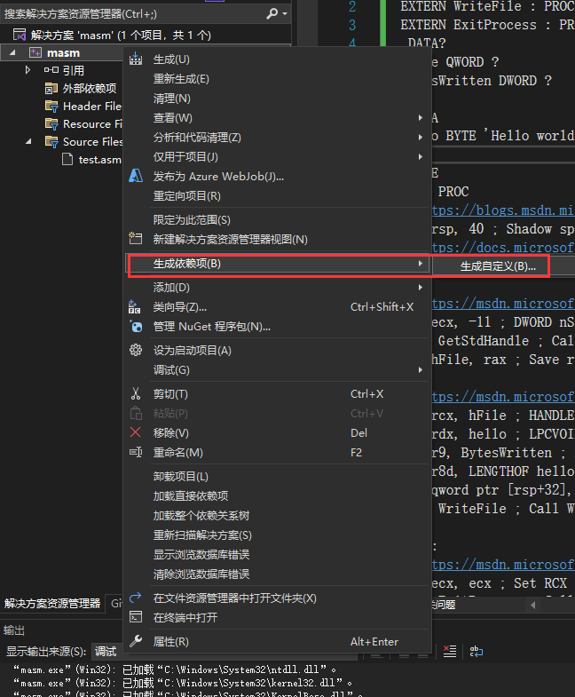
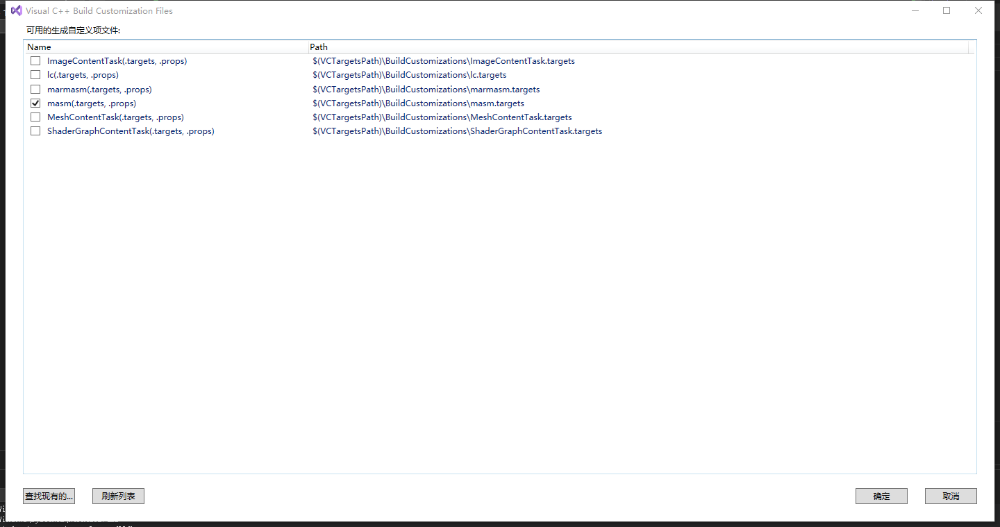

# visual studio 2022 编写汇编设置
+ 创建一个空 windows 程序空项目
+ 右键项目选择 生成依赖项 -> 生成自定义 -> 选择 masm





+ 新建一个空的 cpp 文件，后缀自己换成 .asm
+ 右键项目选择 属性 -> 链接器 -> 系统 -> 子系统 -> 控制台 (/SUBSYSTEM:CONSOLE)  
+ 右键项目选择 属性 -> 链接器 -> 系统 -> 高级 -> 入口点(自己填 main)
+ 选中生成的文件右键属性 -> 常规 -> 项类型(选择 Microsoft Macro Assembler)
+ 选中 x64 直接运行

以下是汇编代码版的 Hello World

```plain
EXTERN GetStdHandle : PROC
EXTERN WriteFile : PROC
EXTERN ExitProcess : PROC
.DATA?
hFile QWORD ?
BytesWritten DWORD ?

.DATA
hello BYTE 'Hello world!', 13, 10

.CODE
main PROC
; https://blogs.msdn.microsoft.com/oldnewthing/20160623-00/?p=93735
sub rsp, 40 ; Shadow space (4 * 8) & 1 parameter (8 bytes)
; https://docs.microsoft.com/en-us/cpp/build/stack-allocation
and spl, -16 ; Align to 16

; https://msdn.microsoft.com/library/windows/desktop/ms683231.aspx
mov ecx, -11 ; DWORD nStdHandle = STD_OUTPUT_HANDLE
call GetStdHandle ; Call WinApi
mov hFile, rax ; Save returned handle

; https://msdn.microsoft.com/library/windows/desktop/aa365747.aspx
mov rcx, hFile ; HANDLE hFile (here: Stdout)
lea rdx, hello ; LPCVOID lpBuffer
lea r9, BytesWritten ; LPDWORD lpNumberOfBytesWritten
mov r8d, LENGTHOF hello ; DWORD nNumberOfBytesToWrite
mov qword ptr [rsp+32], 0 ; LPOVERLAPPED lpOverlapped = NULL
call WriteFile ; Call WinAPI

exit:
; https://msdn.microsoft.com/library/windows/desktop/ms682658.aspx
xor ecx, ecx ; Set RCX to null for return value
call ExitProcess ; Call WinAPI to exit
main ENDP

END
```

