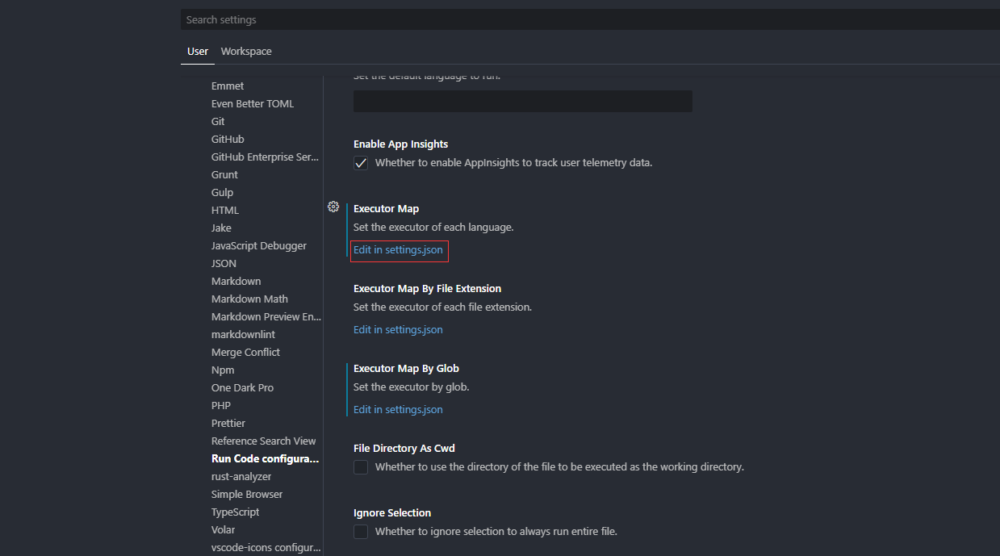
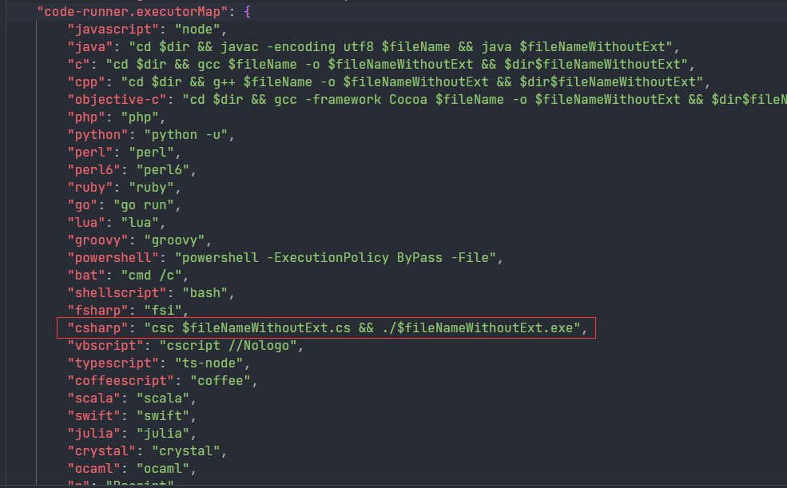
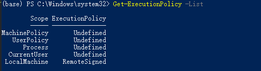
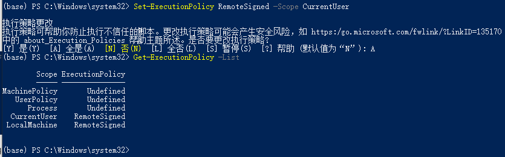

## Visual Studio Code 的 CodeRunner 插件配置 csc 编译执行单个 cs 文件
CodeRunner 运行 C# 文件时默认使用 scripts ，这个插件不太好安装，建议使用 win 自带的 csc 直接编译执行

1. 添加系统环境变量即可，win10+ 系统无需安装，直接把目录加进环境变量即可：C:\Windows\Microsoft.NET\Framework64\v4.0.30319
2. 修改 CodeRunner 配置





```json
"csharp": "cd $dir && csc /nologo $fileNameWithoutExt.cs && ./$fileNameWithoutExt.exe",
```

## 无法将 xxx 识别为 cmdlet、函数、脚本文件或可运行程序的名称
需要使用管理员运行 Power Shell

1. 首先查看权限  `Get-ExecutionPolicy -List`



2. 要 CurrentUser 和 LocalMachine 都具有 RemoteSigned 权限，执行命令 `Set-ExecutionPolicy RemoteSigned -Scope CurrentUser`



3. <font style="color:#DF2A3F;">如果还是不行，则需要重启一下电脑</font>

