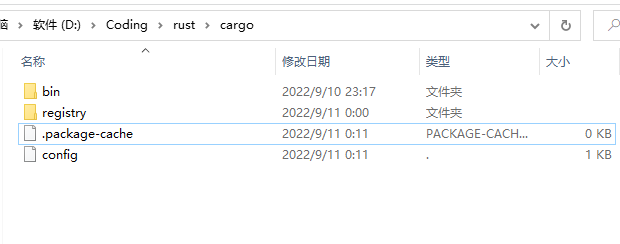

# Windows 安装 rust
下载 [rust-init](https://www.rust-lang.org/zh-CN/tools/install)

1. 直接编辑系统环境变量（需要提前创建文件夹）

```plain
# 声明环境变量
CARGO_HOME      D:\Coding\rust\.cargo
RUSTUP_HOME     D:\Coding\rust\.rustup
# 定义环境变量
%CARGO_HOME%
%RUSTUP_HOME%
```

2. 直接运行 `rustup-init`安装即可

# Linux 安装 rust
1. 修改系统环境变量

```bash
# 声明环境变量
export CARGO_HOME=/home/lhc/softs/rust/.cargo
export RUSTUP_HOME=/home/lhc/softs/rust/rustup
# 定义环境变量
PATH=$PATH:$CARGO_HOME:$RUSTUP_HOME
```

2. 直接运行命令`curl --proto '=https' --tlsv1.2 -sSf https://sh.rustup.rs | sh`

# Cargo 换源
1. 最简单的是直接安装 crm `cargo install crm`然后通过`crm`来管理源
2. cargo 默认会去 github 下载 crates 在国内比较慢，因此需要修改国内的源
3. 在 cargo 的安装目录下找到 config 文件（高版本的 rust 将 config 替换成了 config.toml，但是内容是一致的），如果没有就直接创建（如果不知道 cargo 的安装目录可以去系统环境变量里面找，如下图）



+ config 文件内容：

```bash
[source.crates-io]
registry = "https://github.com/rust-lang/crates.io-index"
# 指定镜像
replace-with = 'rsproxy' # 如：tuna、sjtu、ustc，或者 rustcc 

[registries.bfsu]
index = "https://mirrors.bfsu.edu.cn/git/crates.io-index.git"

[registries.bfsu-sparse]
index = "sparse+https://mirrors.bfsu.edu.cn/crates.io-index/"

[registries.hit]
index = "https://mirrors.hit.edu.cn/crates.io-index.git"

[registries.nju]
index = "https://mirror.nju.edu.cn/git/crates.io-index.git"

[registries.rsproxy]
index = "https://rsproxy.cn/crates.io-index"

[registries.rsproxy-sparse]
index = "sparse+https://rsproxy.cn/index/"

[registries.sjtu]
index = "https://mirrors.sjtug.sjtu.edu.cn/git/crates.io-index"

[registries.sjtu-sparse]
index = "sparse+https://mirrors.sjtug.sjtu.edu.cn/crates.io-index/"

[registries.tuna]
index = "https://mirrors.tuna.tsinghua.edu.cn/git/crates.io-index.git"

[registries.tuna-sparse]
index = "sparse+https://mirrors.tuna.tsinghua.edu.cn/crates.io-index/"

[registries.ustc]
index = "git://mirrors.ustc.edu.cn/crates.io-index"

[registries.ustc-sparse]
index = "sparse+https://mirrors.ustc.edu.cn/crates.io-index/"

[net]
git-fetch-with-cli = true
```

# Rust 版本控制
rust 自带版本控制工具`rustup`

1. 升级：`rustup update`
2. 安装特定的版本`rustup update nightly --force`这里是安装最新的 nightly 版本，如果需要安装之前的某个版本可以直接把 nightly 替换为需要安装的版本号即可
3. 安装完成后通过`rustup default nightly`来切换使用的版本
4. rustup 可以用来卸载自己`rustup self uninstall`卸载其它版本命令为`rustup toolchain uninstall 版本号`


