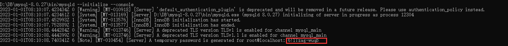

# MySQL8 主从、主主集群搭建
这里用两台机器作为演示，ip 分别为 192.168.6.100/192.168.6.101，如果是主从那么只做一台的配置即可，主主就是相当于做两次主从，即：192.168.6.100（master） <- 192.168.6.101（slave） 192.168.6.100（slave） -> 192.168.6.101（master）

1. 首先下载 mysql8 `wget https://dev.mysql.com/get/Downloads/MySQL-8.0/mysql-8.0.31-linux-glibc2.12-x86_64.tar.xz`
2. 解压到指定目录 `tar -Jxf mysql-8.0.31-linux-glibc2.12-x86_64.tar.xz -C /opt/softs && mv mysql-8.0.31-linux-glibc2.12-x86_64.tar.xz mysql-8.0.31`
3. 进入目录创建 logs、other 文件夹 `cd /usr/mpsp/mysql-8.0.31 && mkdir logs other`不要创建 data 文件夹
4. 编写 mysql 配置文件 `vim ./my.cnf`（另一台服务器修改对应的 server-id、auto_increment_offset）

```properties
[client]
port = 3306
socket = /usr/mpsp/mysql-8.0.31/other/mysql.sock
 
[mysqld]
port = 3306
socket = /usr/mpsp/mysql-8.0.31/other/mysql.sock
basedir = /usr/mpsp/mysql-8.0.31
datadir = /usr/mpsp/mysql-8.0.31/data
pid-file = /usr/mpsp/mysql-8.0.31/other/mysql.pid
user = mysql
bind-address = 0.0.0.0
# 一个集群内保证唯一即可
server-id = 1
# 主键自增步长（为集群节点数量）
auto_increment_increment=2
# 主键自增起始值（为机器号）
auto_increment_offset=1

character-set-server = utf8mb4
collation-server = utf8mb4_general_ci

#设置client连接mysql时的字符集,防止乱码
init_connect='SET NAMES utf8mb4'

#TIMESTAMP如果没有显示声明NOT NULL，允许NULL值
explicit_defaults_for_timestamp = true
 
lower_case_table_names=1
skip-name-resolve
# 禁止MySQL对外部连接进行DNS解析，使用这一选项可以消除MySQL进行DNS解析的时间。但需要注意，如果开启该选项，
# 则所有远程主机连接授权都要使用IP地址方式，否则MySQL将无法正常处理连接请求
 
#skip-networking
back_log = 600
# MySQL能有的连接数量。当主要MySQL线程在一个很短时间内得到非常多的连接请求，这就起作用，
# 然后主线程花些时间(尽管很短)检查连接并且启动一个新线程。back_log值指出在MySQL暂时停止回答新请求之前的短时间内多少个请求可以被存在堆栈中。
# 如果期望在一个短时间内有很多连接，你需要增加它。也就是说，如果MySQL的连接数据达到max_connections时，新来的请求将会被存在堆栈中，
# 以等待某一连接释放资源，该堆栈的数量即back_log，如果等待连接的数量超过back_log，将不被授予连接资源。
# 另外，这值（back_log）限于您的操作系统对到来的TCP/IP连接的侦听队列的大小。
# 你的操作系统在这个队列大小上有它自己的限制（可以检查你的OS文档找出这个变量的最大值），试图设定back_log高于你的操作系统的限制将是无效的。

max_connections = 1000
# MySQL的最大连接数，如果服务器的并发连接请求量比较大，建议调高此值，以增加并行连接数量，当然这建立在机器能支撑的情况下，因为如果连接数越多，介于MySQL会为每个连接提供连接缓冲区，就会开销越多的内存，所以要适当调整该值，不能盲目提高设值。可以过'conn%'通配符查看当前状态的连接数量，以定夺该值的大小。
 
max_connect_errors = 6000
# 对于同一主机，如果有超出该参数值个数的中断错误连接，则该主机将被禁止连接。如需对该主机进行解禁，执行：FLUSH HOST。 

open_files_limit = 65535
# MySQL打开的文件描述符限制，默认最小1024;当open_files_limit没有被配置的时候，比较max_connections*5和ulimit -n的值，哪个大用哪个，
# 当open_file_limit被配置的时候，比较open_files_limit和max_connections*5的值，哪个大用哪个。
 
table_open_cache = 128
# MySQL每打开一个表，都会读入一些数据到table_open_cache缓存中，当MySQL在这个缓存中找不到相应信息时，才会去磁盘上读取。默认值64
# 假定系统有200个并发连接，则需将此参数设置为200*N(N为每个连接所需的文件描述符数目)；
# 当把table_open_cache设置为很大时，如果系统处理不了那么多文件描述符，那么就会出现客户端失效，连接不上
 
max_allowed_packet = 4M
# 接受的数据包大小；增加该变量的值十分安全，这是因为仅当需要时才会分配额外内存。例如，仅当你发出长查询或MySQLd必须返回大的结果行时MySQLd才会分配更多内存。
# 该变量之所以取较小默认值是一种预防措施，以捕获客户端和服务器之间的错误信息包，并确保不会因偶然使用大的信息包而导致内存溢出。
 
binlog_cache_size = 1M
# 一个事务，在没有提交的时候，产生的日志，记录到Cache中；等到事务提交需要提交的时候，则把日志持久化到磁盘。默认binlog_cache_size大小32K
 
max_heap_table_size = 8M
# 定义了用户可以创建的内存表(memory table)的大小。这个值用来计算内存表的最大行数值。这个变量支持动态改变
 
tmp_table_size = 16M
# MySQL的heap（堆积）表缓冲大小。所有联合在一个DML指令内完成，并且大多数联合甚至可以不用临时表即可以完成。
# 大多数临时表是基于内存的(HEAP)表。具有大的记录长度的临时表 (所有列的长度的和)或包含BLOB列的表存储在硬盘上。
# 如果某个内部heap（堆积）表大小超过tmp_table_size，MySQL可以根据需要自动将内存中的heap表改为基于硬盘的MyISAM表。还可以通过设置tmp_table_size选项来增加临时表的大小。也就是说，如果调高该值，MySQL同时将增加heap表的大小，可达到提高联接查询速度的效果
 
read_buffer_size = 2M
# MySQL读入缓冲区大小。对表进行顺序扫描的请求将分配一个读入缓冲区，MySQL会为它分配一段内存缓冲区。read_buffer_size变量控制这一缓冲区的大小。
# 如果对表的顺序扫描请求非常频繁，并且你认为频繁扫描进行得太慢，可以通过增加该变量值以及内存缓冲区大小提高其性能
 
read_rnd_buffer_size = 8M
# MySQL的随机读缓冲区大小。当按任意顺序读取行时(例如，按照排序顺序)，将分配一个随机读缓存区。进行排序查询时，
# MySQL会首先扫描一遍该缓冲，以避免磁盘搜索，提高查询速度，如果需要排序大量数据，可适当调高该值。但MySQL会为每个客户连接发放该缓冲空间，所以应尽量适当设置该值，以避免内存开销过大
 
sort_buffer_size = 8M
# MySQL执行排序使用的缓冲大小。如果想要增加ORDER BY的速度，首先看是否可以让MySQL使用索引而不是额外的排序阶段。
# 如果不能，可以尝试增加sort_buffer_size变量的大小
 
join_buffer_size = 8M
# 联合查询操作所能使用的缓冲区大小，和sort_buffer_size一样，该参数对应的分配内存也是每连接独享
 
thread_cache_size = 64
# 这个值（默认8）表示可以重新利用保存在缓存中线程的数量，当断开连接时如果缓存中还有空间，那么客户端的线程将被放到缓存中，
# 如果线程重新被请求，那么请求将从缓存中读取,如果缓存中是空的或者是新的请求，那么这个线程将被重新创建,如果有很多新的线程，
# 增加这个值可以改善系统性能.通过比较Connections和Threads_created状态的变量，可以看到这个变量的作用。(–>表示要调整的值)
# 根据物理内存设置规则如下：
# 1G  —> 8
# 2G  —> 16
# 3G  —> 32
# 大于3G  —> 64
 
key_buffer_size = 512M
#指定用于索引的缓冲区大小，增加它可得到更好处理的索引(对所有读和多重写)，到你能负担得起那样多。如果你使它太大，
# 系统将开始换页并且真的变慢了。对于内存在4GB左右的服务器该参数可设置为384M或512M。通过检查状态值Key_read_requests和Key_reads，
# 可以知道key_buffer_size设置是否合理。比例key_reads/key_read_requests应该尽可能的低，
# 至少是1:100，1:1000更好(上述状态值可以使用SHOW STATUS LIKE 'key_read%'获得)。注意：该参数值设置的过大反而会是服务器整体效率降低
 
ft_min_word_len = 4
# 分词词汇最小长度，默认4
 
transaction_isolation = REPEATABLE-READ
# MySQL支持4种事务隔离级别，他们分别是：
# READ-UNCOMMITTED, READ-COMMITTED, REPEATABLE-READ, SERIALIZABLE.
# 如没有指定，MySQL默认采用的是REPEATABLE-READ，ORACLE默认的是READ-COMMITTED

log_bin = mysql-bin
binlog_format = mixed
binlog_expire_logs_seconds = 2592000 #超过30天的binlog删除
log_error = /usr/mpsp/mysql-8.0.31/logs/error.log #错误日志路径
slow_query_log = 1
long_query_time = 3 #慢查询时间 超过3秒则为慢查询
 
slow_query_log_file = /usr/mpsp/mysql-8.0.31/logs/slow-query.log
performance_schema = 0
explicit_defaults_for_timestamp
lower_case_table_names = 1 #不区分大小写 
skip-external-locking #MySQL选项以避免外部锁定。该选项默认开启
default-storage-engine = InnoDB #默认存储引擎
innodb_file_per_table = 1
# InnoDB为独立表空间模式，每个数据库的每个表都会生成一个数据空间
# 独立表空间优点：
# 1．每个表都有自已独立的表空间。
# 2．每个表的数据和索引都会存在自已的表空间中。
# 3．可以实现单表在不同的数据库中移动。
# 4．空间可以回收（除drop table操作处，表空不能自已回收）
# 缺点：
# 单表增加过大，如超过100G
# 结论：
# 共享表空间在Insert操作上少有优势。其它都没独立表空间表现好。当启用独立表空间时，请合理调整：innodb_open_files
innodb_open_files = 500
# 限制Innodb能打开的表的数据，如果库里的表特别多的情况，请增加这个。这个值默认是300
innodb_buffer_pool_size = 6G
# InnoDB使用一个缓冲池来保存索引和原始数据, 不像MyISAM.
# 这里你设置越大,你在存取表里面数据时所需要的磁盘I/O越少.
# 在一个独立使用的数据库服务器上,你可以设置这个变量到服务器物理内存大小的80%
# 不要设置过大,否则,由于物理内存的竞争可能导致操作系统的换页颠簸.
# 注意在32位系统上你每个进程可能被限制在 2-3.5G 用户层面内存限制,
# 所以不要设置的太高.
innodb_write_io_threads = 4
innodb_read_io_threads = 4
# innodb使用后台线程处理数据页上的读写 I/O(输入输出)请求,根据你的 CPU 核数来更改,默认是4
# 注:这两个参数不支持动态改变,需要把该参数加入到my.cnf里，修改完后重启MySQL服务,允许值的范围从 1-64
innodb_thread_concurrency = 0
# 默认设置为 0,表示不限制并发数，这里推荐设置为0，更好去发挥CPU多核处理能力，提高并发量
innodb_purge_threads = 1
# InnoDB中的清除操作是一类定期回收无用数据的操作。在之前的几个版本中，清除操作是主线程的一部分，这意味着运行时它可能会堵塞其它的数据库操作。
# 从MySQL5.5.X版本开始，该操作运行于独立的线程中,并支持更多的并发数。用户可通过设置innodb_purge_threads配置参数来选择清除操作是否使用单
# 独线程,默认情况下参数设置为0(不使用单独线程),设置为 1 时表示使用单独的清除线程。建议为1
innodb_flush_log_at_trx_commit = 2
# 0：如果innodb_flush_log_at_trx_commit的值为0,log buffer每秒就会被刷写日志文件到磁盘，提交事务的时候不做任何操作（执行是由mysql的master thread线程来执行的。
# 主线程中每秒会将重做日志缓冲写入磁盘的重做日志文件(REDO LOG)中。不论事务是否已经提交）默认的日志文件是ib_logfile0,ib_logfile1
# 1：当设为默认值1的时候，每次提交事务的时候，都会将log buffer刷写到日志。
# 2：如果设为2,每次提交事务都会写日志，但并不会执行刷的操作。每秒定时会刷到日志文件。要注意的是，并不能保证100%每秒一定都会刷到磁盘，这要取决于进程的调度。
# 每次事务提交的时候将数据写入事务日志，而这里的写入仅是调用了文件系统的写入操作，而文件系统是有 缓存的，所以这个写入并不能保证数据已经写入到物理磁盘
# 默认值1是为了保证完整的ACID。当然，你可以将这个配置项设为1以外的值来换取更高的性能，但是在系统崩溃的时候，你将会丢失1秒的数据。
# 设为0的话，mysqld进程崩溃的时候，就会丢失最后1秒的事务。设为2,只有在操作系统崩溃或者断电的时候才会丢失最后1秒的数据。InnoDB在做恢复的时候会忽略这个值。
 
# 总结
# 设为1当然是最安全的，但性能页是最差的（相对其他两个参数而言，但不是不能接受）。如果对数据一致性和完整性要求不高，完全可以设为2，如果只最求性能，例如高并发写的日志服务器，设为0来获得更高性能
 
innodb_log_buffer_size = 4M
# 此参数确定些日志文件所用的内存大小，以M为单位。缓冲区更大能提高性能，但意外的故障将会丢失数据。MySQL开发人员建议设置为1－8M之间
innodb_redo_log_capacity = 32M
# 此参数确定数据日志文件的大小，更大的设置可以提高性能，但也会增加恢复故障数据库所需的时间
innodb_max_dirty_pages_pct = 90
# innodb主线程刷新缓存池中的数据，使脏数据比例小于90%
innodb_lock_wait_timeout = 30
# InnoDB事务在被回滚之前可以等待一个锁定的超时秒数。InnoDB在它自己的锁定表中自动检测事务死锁并且回滚事务。InnoDB用LOCK TABLES语句注意到锁定设置。默认值是50秒
bulk_insert_buffer_size = 8M
# 服务器关闭交互式连接前等待活动的秒数。交互式客户端定义为在mysql_real_connect()中使用CLIENT_INTERACTIVE选项的客户端。默认值：28800秒（8小时）
wait_timeout = 28800
# 服务器关闭非交互连接之前等待活动的秒数。在线程启动时，根据全局wait_timeout值或全局interactive_timeout值初始化会话wait_timeout值，
# 取决于客户端类型(由mysql_real_connect()的连接选项CLIENT_INTERACTIVE定义)。参数默认值：28800秒（8小时）
# MySQL服务器所支持的最大连接数是有上限的，因为每个连接的建立都会消耗内存，因此我们希望客户端在连接到MySQL Server处理完相应的操作后，
# 应该断开连接并释放占用的内存。如果你的MySQL Server有大量的闲置连接，他们不仅会白白消耗内存，而且如果连接一直在累加而不断开，
# 最终肯定会达到MySQL Server的连接上限数，这会报'too many connections'的错误。对于wait_timeout的值设定，应该根据系统的运行情况来判断。
# 在系统运行一段时间后，可以通过show processlist命令查看当前系统的连接状态，如果发现有大量的sleep状态的连接进程，则说明该参数设置的过大，
# 可以进行适当的调整小些。要同时设置interactive_timeout和wait_timeout才会生效。

[mysqldump]
quick
max_allowed_packet = 32M #服务器发送和接受的最大包长度
[myisamchk]
key_buffer_size = 8M
sort_buffer_size = 8M
read_buffer = 4M
write_buffer = 4M
```

5. 添加 mysql 用户和用户组用于启动 mysql `<font style="color:rgb(0, 0, 0);background-color:rgb(241, 241, 241);">groupadd mysql && </font><font style="color:rgb(0, 0, 0) !important;">useradd </font><font style="color:rgb(0, 0, 255) !important;">-</font><font style="color:rgb(0, 0, 0) !important;">r </font><font style="color:rgb(0, 0, 255) !important;">-</font><font style="color:rgb(0, 0, 0) !important;">g mysql mysql</font>`<font style="color:rgb(0, 0, 0);background-color:rgb(241, 241, 241);">设置 mysql 为非登录用户 </font>`<font style="color:rgb(0, 0, 0) !important;">usermod </font><font style="color:rgb(0, 0, 255) !important;">-</font><font style="color:rgb(0, 0, 0) !important;">s </font><font style="color:rgb(0, 0, 255) !important;">/</font><font style="color:rgb(0, 0, 0) !important;">sbin</font><font style="color:rgb(0, 0, 255) !important;">/</font><font style="color:rgb(0, 0, 0) !important;">nologin mysql</font>`<font style="color:rgb(0, 0, 0) !important;">（可选，设置后无法 su mysql）</font>
6. 执行数据库初始化命令 （尾行会输出数据库的初始化密码）

```bash
chown -R mysql.mysql /usr/mpsp/mysql-8.0.31
su mysql
./bin/mysqld --defaults-file=/usr/mpsp/mysql-8.0.31/my.cnf --initialize
cat /usr/mpsp/mysql-8.0.31/logs/error.log
```

7. 创建 system 服务方便启动和管理 `vim /usr/lib/systemd/system/mysql.service`（root 用户操作）

```properties
[Unit]
Description=MySQL server
After=syslog.target network.target
 
[Service]
User=mysql
Group=mysql
Type=forking
TimeoutSec=0
#PermissionsStartOnly=true
ExecStart=/usr/mpsp/mysql-8.0.31/bin/mysqld --defaults-file=/usr/mpsp/mysql-8.0.31/my.cnf --daemonize
LimitNOFILE = 65535
Restart=on-failure
RestartSec=3
RestartPreventExitStatus=1
PrivateTmp=false

[Install]
WantedBy=multi-user.target
```

8. 重新加载 systemctl 配置后启动 mysql 服务并添加至开机自启 `systemctl daemon-reload && systemctl start mysql && systemctl enable mysql`至此两台服务器上的 mysql 均安装完毕
9. 开始做 192.168.6.100（master） <- 192.168.6.101（slave）首先登录 192.168.6.100。通过 sock 登录 mysql`./bin/mysql -uroot -S /usr/mpsp/mysql-8.0.31/other/mysql.sock -p`（密码就是之前保存的）

```sql
-- 修改默认的 root 密码 
alter user 'root'@'localhost' identified with mysql_native_password by 'mysql123';
use mysql;
-- 允许远程登录
update user set host = '%'  where user ='root';
-- 创建用户 mmstate 用作主主复制
create user 'mmstate'@'%' identified with mysql_native_password by 'mysql123';
-- 授权所有表，这里可以指定 库名.表名
grant replication slave on *.* to 'mmstate'@'%';
-- 刷新权限
flush privileges;
-- 记一下结果
show master status;
```

10. 然后登录 192.168.6.101。通过 sock 登录 mysql `./bin/mysql -uroot -S /usr/mpsp/mysql-8.0.31/other/mysql.sock -p`（密码就是之前保存的）<font style="color:#DF2A3F;">如果是主从这里就可以结束进行测试了</font>

```sql
-- 修改默认的 root 密码 
alter user 'root'@'localhost' identified with mysql_native_password by 'mysql123';
use mysql;
-- 允许远程登录
update user set host = '%'  where user ='root';
-- 都写 master（192.168.6.100） 上的配置
change master to master_host='192.168.6.100',master_user='mmstate',master_password='mysql123',master_log_file='mysql-bin.000002',master_log_pos=1831;
-- 开启从节点
start slave;
flush privileges;
-- 结果 Slave_IO_Running: Yes  Slave_SQL_Running: Yes 为正常
show slave status \G
```

11. 主主的话反着再做一边，开始做 192.168.6.100（slave） -> 192.168.6.101（master）首先登录 192.168.6.101。通过 sock 登录 mysql `./bin/mysql -uroot -S /usr/mpsp/mysql-8.0.31/other/mysql.sock -p`

```sql
-- 创建用户 mmstate 用作主主复制
create user 'mmstate'@'%' identified with mysql_native_password by 'mysql123';
-- 授权所有表，这里可以指定 库名.表名
grant replication slave on *.* to 'mmstate'@'%';
-- 刷新权限
flush privileges;
-- 记一下结果
show master status;
```

12. 然后登录 192.168.6.100。通过 sock 登录 mysql `./bin/mysql -uroot -S /usr/mpsp/mysql-8.0.31/other/mysql.sock -p`

```sql
-- 都写 master（192.168.6.101）上的配置
change master to master_host='192.168.6.101',master_user='mmstate',master_password='mysql123',master_log_file='mysql-bin.000002',master_log_pos=1682;
-- 开启从节点
start slave;
flush privileges;
-- 结果 Slave_IO_Running: Yes  Slave_SQL_Running: Yes 为正常
show slave status \G
```

至此主主搭建完成

# Windows 下 MySQL8 二进制安装
1. [官网](https://downloads.mysql.com/archives/community/) 下载二进制包
2. 解压至安装目录，并在目录下创建 my.ini 文件，写入以下信息（<font style="color:#DF2A3F;">data 目录不要手动创建，安装时程序会自动创建</font>）

```plain
[mysqld]
#设置3306端口
port=3306
#设置mysql的安装目录
basedir=D:\DB\mysql-8.0.27
#设置mysql数据库的数据的存放目录
datadir=D:\DB\mysql-8.0.27\data
#允许最大连接数
max_connections=200
#允许连接失败的次数。
max_connect_errors=10
#服务端使用的字符集默认为utf8mb4
character-set-server=utf8mb4
#创建新表时将使用的默认存储引擎
default-storage-engine=INNODB
#默认使用"mysql_native_password"插件认证
#mysql_native_password
default_authentication_plugin=mysql_native_password
[mysql]
#设置mysql客户端默认字符集
default-character-set=utf8mb4
[client]
#设置mysql客户端连接服务端时默认使用的端口
port=3306
default-character-set=utf8mb4
```

3. 以管理员身份打开 cmd 键入以下命令：mysqld --initialize --console（该命令需要去安装目录下的 bin 目录去执行，或者直接加到系统环境变量里）记录控制台输出的初始密码。如果需要指定配置文件则命令如下：<font style="color:rgb(68, 68, 68);background-color:rgb(245, 245, 245);"> </font>mysqld --defaults-file=xxx --initialize --console



4. 安装 mysql 到系统服务：mysqld --install（默认服务名是 MYSQL，如果需要自定义名称则命令为：mysqld --install xxx）如果 MYSQL 的启动配置文件也要修改则命令为 mysqld -install xxx --defaults-file="xxx\\my.ini"（删除系统服务命令：sc delete xxx，手动安装系统服务：sc &lt;server> create [server nam] [binPath=] start=anto  server 要以 // 给出 例如：//mysqld.exe 其中 [] 表示参数可选）
5. 安装完成后键入命令：net start mysql 启动 mysql
6. 依次键入命令修改 mysql 密码以及开启远程登录权限

```bash
mysql -u root -h localhost -P 3306 -p
# 键入之前的控制台密码
use mysql;
# 修改密码
ALTER USER root@localhost IDENTIFIED BY '自定义密码';
# 开启远程登录权限
update user set host ='%' where user ='root';
# 刷新权限
flush privileges;
exit
```

# MySQL 锁排查
## DML 排查
MDL 全称为 metadata lock，即元数据锁。MDL 锁主要作用是维护表元数据的数据一致性，在表上有活动事务（显式或隐式）的时候，不可以对元数据进行写入操作。因此从 MySQL5.5 版本开始引入了 MDL 锁，来保护表的元数据信息，用于解决或者保证 DDL 操作与 DML 操作之间的一致性。

1. 可以通过查询表``performance_schema`.metadata_locks、`performance_schema`.threads、`performance_schema`.`processlist``列出锁的信息、用户信息、连接信息

```sql
SELECT ml.*,p.* FROM `performance_schema`.metadata_locks ml LEFT JOIN `performance_schema`.threads t ON ml.OWNER_THREAD_ID = t.THREAD_ID LEFT JOIN `performance_schema`.`processlist` p ON t.PROCESSLIST_ID = p.ID WHERE ml.OWNER_THREAD_ID != sys.ps_thread_id(CONNECTION_ID())
```

2. 如果要查看阻塞的线程具体在执行什么 SQL 可以通过以下 SQL 进行查询（这里需要第 1 步中查询出来的线程 ID）

```sql
SELECT * FROM `performance_schema`.events_statements_current WHERE THREAD_ID = 上一步查询出来的线程 ID
```

## 表级锁排查
可以通过查询``performance_schema`.table_handles`来进行排查，主要关注`EXTERNAL_LOCK`字段

```sql
SELECT * FROM `performance_schema`.table_handles WHERE OBJECT_SCHEMA = 数据库名 AND OBJECT_NAME = 表名
```

## 行级锁排查
从 MySQL 8.0 开始，在 performance_schema 中提供了一个 data_locks 表用于记录任意事务的锁信息（同时废弃了 information_schema.innodb_locks 表），不需要有锁等待关系存在（注意，该表中只记录 InnoDB 存储引擎层的锁）

```sql
SELECT * FROM `performance_schema`.data_locks
```

# 查看最近的 TOP SQL
1. 查询最近的 n 条 sql 按照执行时间排序

```sql
select THREAD_ID, EVENT_NAME, SOURCE, sys.format_time(TIMER_WAIT), sys.format_time(LOCK_TIME), SQL_TEXT, CURRENT_SCHEMA, MESSAGE_TEXT, ROWS_AFFECTED, ROWS_SENT, ROWS_EXAMINED from `performance_schema`.events_statements_history where CURRENT_SCHEMA != 'performance_schema' order by TIMER_WAIT desc limit 10
```

2. 按照查询次数统计排序

```sql
select SCHEMA_NAME, DIGEST_TEXT, COUNT_STAR, sys.format_time(SUM_TIMER_WAIT)as sum_time, sys.format_time(MIN_TIMER_WAIT) as min_time, sys.format_time(AVG_TIMER_WAIT)as avg_time, sys.format_time(MAX_TIMER_WAIT) as  max_time, sys.format_time(SUM_LOCK_TIME) as sum_lock_time, SUM_ROWS_AFFECTED, SUM_ROWS_SENT, SUM_ROWS_EXAMINED from `performance_schema`.events_statements_summary_by_digest where SCHEMA_NAME is not null and SCHEMA_NAME != 'performance_schema' order by COUNT_STAR desc limit 10
```

3. MySQL 的 events_statements_history 表或者 events_statements_history_long 表会记录所有客户端执行过的 SQL，即使执行错误也会记录。可以通过查询这两张表做一些 sql 语法错误统计。执行 SQL 出错时，字段 MYSQL_ERRNO 不为 0

```sql
SELECT * FROM `performance_schema`.events_statements_history where MYSQL_ERRNO != 0
```

# 查看 SQL 执行进度
可通过以下 SQL 实现，需要提供执行 SQL 的连接 id，否则就按照 current_statement 字段展示的正在执行的 SQL 判断。process 字段表示执行进度

```sql
SELECT * FROM `sys`.`session`
```

# 主从复制问题排查
MySQL 从库复出错时一般通过`show slave status \G`查看报错信息，但是该信息不是很全面，详细信息可以通过查询``performance_schema`.replication_applier_status_by_worker`表（要在从库进行查询）

```sql
SELECT * FROM `performance_schema`.replication_applier_status_by_worker
```

如果要查看复制进度可以查询``mysql`.slave_master_info、`mysql`.slave_relay_log_info`表（要在从库进行查询）前者提供查询 I/O 线程读取主库的位置信息，以及从库连接主库的 IP 地址、账号、端口、密码等信息后者提供查询 SQL 线程重放的 binlog 文件对应的主库位置和中继日志当前最新的位置信息

# MySQL 查看数据库占用磁盘大小
table_schema 就是数据库名，占用空间包含实际数据 + 索引 

```sql
SELECT table_schema as '数据库名称', SUM(round(((data_length + index_length) / 1024 / 1024), 2)) as '数据库大小(MB)'
FROM information_schema.TABLES
WHERE table_schema in ('autotwo', 'zbxdata') GROUP BY table_schema;
```

# MySQL 数据备份及恢复
少量数据一般使用 mysqldump 就可将数据导出，但是这个工具有两点需要注意：

1. mysqldump 导出数据时会锁表，因此需要添加`--single-transaction`参数避免
2. 该工具的导出速度过慢，如果有几十个 G 的数据需要导出则需要换导出工具

Xtrabackup 是由 Percona 公司开源的一款 MySQL 物理热备份工具，目前社区非常活跃，是 MySQL 开源社区的主流备份工具，可在[官网](https://www.percona.com/downloads)直接下载。选择对 MySQL 备份的版本即可。注意这里的版本一定要和使用的 MySQL 版本一致


下载完成后直接解压即可使用，以下是备份整库的命令（<font style="color:#DF2A3F;">这里需要注意如果本机通过包管理器——yum、rpm、apt 等安装过 MySQL 则默认的配置文件会在 /etc/my.cnf ，该工具会优先使用这个配置文件</font>）：

```bash
# parallel 指开几个线程备份，target-dir 则是导出后存放的目录
./xtrabackup --backup -u root -S /usr/mpsp/mysql-8.0.31/other/mysql.sock -p'mysql123' --parallel=5 --target-dir=/usr/log/backup/`date +"%F_%H_%M_%S"` 2>/usr/log/backup/xtrabackup.log &
# 导出后通过 tar 命令进行打包压缩
```

备份完成后会在导出目录下额外生成一些文件用于记录备份信息，其中`xtrabackup_binlog_info`文件记录了本次备份时的 binlog 文件和 pos 信息，该信息可用于从库进行同步的起点。该工具相当于是把 MySQL 的 data 目录完整的复制了出来，并且处理了 redo 和 undo 日志，因此恢复时则是预处理完导出目录后将其替换要恢复数据的 data 目录即可。

```bash
# 首先预处理备份的目录，use-memory 可限制使恢复时使用的内存，默认是 100M
# target-dir 指的是待恢复的目录不是恢复到的目录
./xtrabackup --prepare --use-memory=2G --target-dir=./
# 修改目录下文件的归属，需要和 MySQL 保持一致
# 然后将恢复完成的目录替换数据库的 data 目录即可，最后重启 MySQL
```

如果需要继续做同步，则根据 `xtrabackup_binlog_info`文件指定 binglog 和 pos`change master to master_host='172.21.80.65',master_user='mmstate',master_password='mysql123',master_log_file='mysql-bin.000093',master_log_pos=157;`

# MySQL 主从同步添加监控
可以通过执行`show slave status \G`查看同步状态，以下是监控脚本，可以添加到 crontab 定时执行

```bash
#!/bin/sh

CMD=/usr/mpsp/mysql-8.0.31/bin/mysql
MYSQL_USER=root
MYSQL_PASSWORD=mysql123
MYSQL_SOCK=/usr/mpsp/mysql-8.0.31/other/mysql.sock
RESET_FLAG_FILE=/usr/mpsp/mysql-8.0.31/flag_file

COUNTER=$($CMD -u$MYSQL_USER -p$MYSQL_PASSWORD -S $MYSQL_SOCK -e "show slave status\G" | grep -E "Slave_IO_Running|Slave_SQL_Running" | grep -o "Yes" | wc -l)
RESET_FLAG=$(cat $RESET_FLAG_FILE)

if [ -z "$RESET_FLAG" ] && [ "$COUNTER" -ne 2 ]; then
    task_name="MySQL 从节点同步任务失败，IP 172.22.80.65"
    url="http://172.26.30.201:8080/smsParserService/downsms"
    phones=("15620551053" "15652410029")

    for phone in "${phones[@]}"
    do
        cur_time=$(date +%s%3N)
        curl -X POST -H "Content-Type: text/xml;charset=UTF-8" -d "<map> <entry> <string>calling</string> <string>$phone</string> </entry> <entry> <string>rpid</string> <string>MySQL$cur_time</string> </entry> <entry> <string>funCode</string> <string>PUSHSMS</string> </entry> <entry> <string>intrType</string> <string>COMMON_SMS_CONTENT</string> </entry> <entry> <string>smsContent</string> <string>$task_name</string> </entry> </map>" $url
    done
    echo "$(date +'%Y-%m-%d')" > $RESET_FLAG_FILE
fi

if [ "$(cat $RESET_FLAG_FILE)" != "$(date +'%Y-%m-%d')" ]; then
    > $RESET_FLAG_FILE
fi

```

