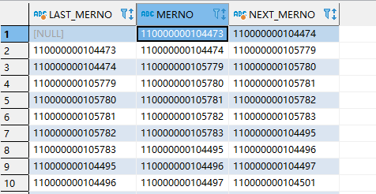

# Oracle 在当前行获取上 n 行下 n 行数据
lead(field, num, defaultvalue) field 需要查找的字段，num 往后查找的 num 行的数据，defaultvalue 没有符合条件的默认值。
lag(field, num, defaultvalue) field 需要查找的字段，num 往前查找的 num 行的数据，defaultvalue 没有符合条件的默认值。

```sql
SELECT LAG(MERNO, 1, NULL) OVER(ORDER BY MODTIME DESC) AS LAST_MERNO, MERNO,
	LEAD(MERNO, 1, NULL) OVER(ORDER BY MODTIME DESC) AS NEXT_MERNO
FROM WEB_DB.MERCHANT_INFO
```



# Oracle 去除特殊字符
可以使用 replace 函数进行替换，配合 chr 函数使用（该函数返回以数值表达式值为编码的字符——也就是将 ASCII 码转换为字符）

+ chr(10) 换行符
+ chr(9) 制表符
+ chr(13) 回车符

```sql
// 去除换行符
SELECT replace('123
               123',chr(10),'') FROM DUAL
```

# MySQL 正则提取指定字符串
当 MySQL 版本高于 5.7 时可以采用 <font style="color:rgb(51, 51, 51);">REGEXP_SUBSTR(str, regexp, position, occurrence, mode) </font>函数，REGEXP_SUBSTR 参数解析：

+ str：一般为提取的目标字段
+ regexp：正则表达式
+ position：开始搜索的位置，默认 1
+ occurrence：表示第几次匹配的内容，默认 1
+ mode：表示进行正则匹配时采用的模式

c：区分大小写

i：区分大小写

m：多行匹配模式

n：. 可以匹配行结束

u：仅限 unix 行结尾

如果匹配模式存在矛盾的选项，则以最右边的为准。

如果匹配不上或者待匹配字符串为空则返回 NULL，以下为实例，提取 [ ] 中间的字串

```sql
SELECT REGEXP_SUBSTR(`subject`, '\\[(.*?)\\]') AS extracted FROM zbxdata_warninfo;
```

当 MySQL 版本低于 5.7 时，只能采取折中的办法进行提取

```sql
SELECT SUBSTRING(`subject`, LOCATE('[', `subject`) + 1, LOCATE(']', `subject`) - LOCATE('[', `subject`) - 1) AS group_name, `subject`, content
FROM zbxdata.zbxdata_warninfo where `subject` is not null and `subject` != ''
```

# 
