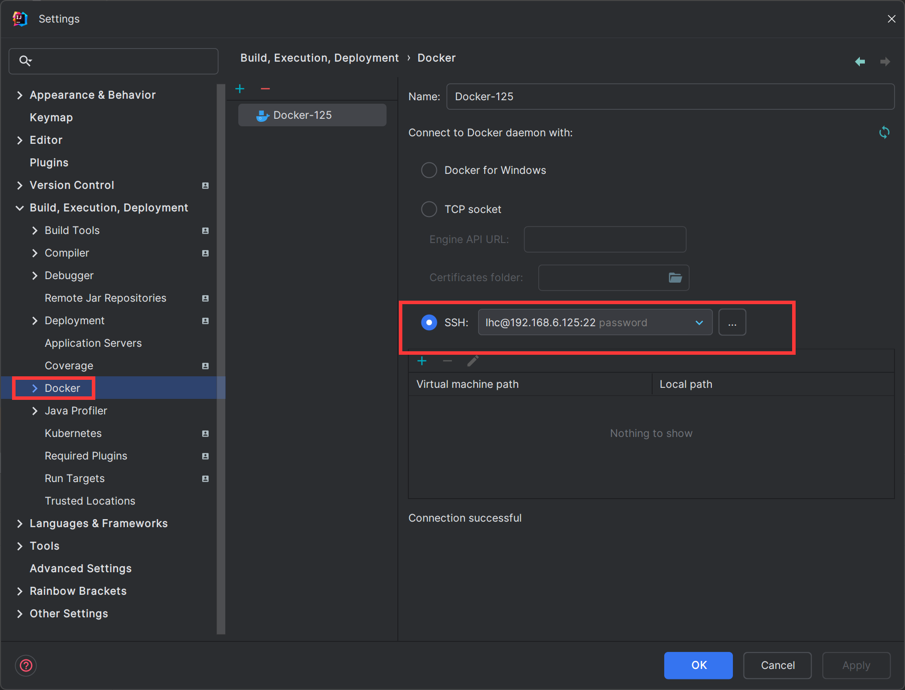
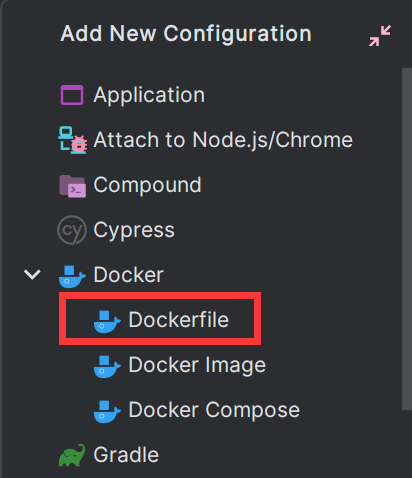
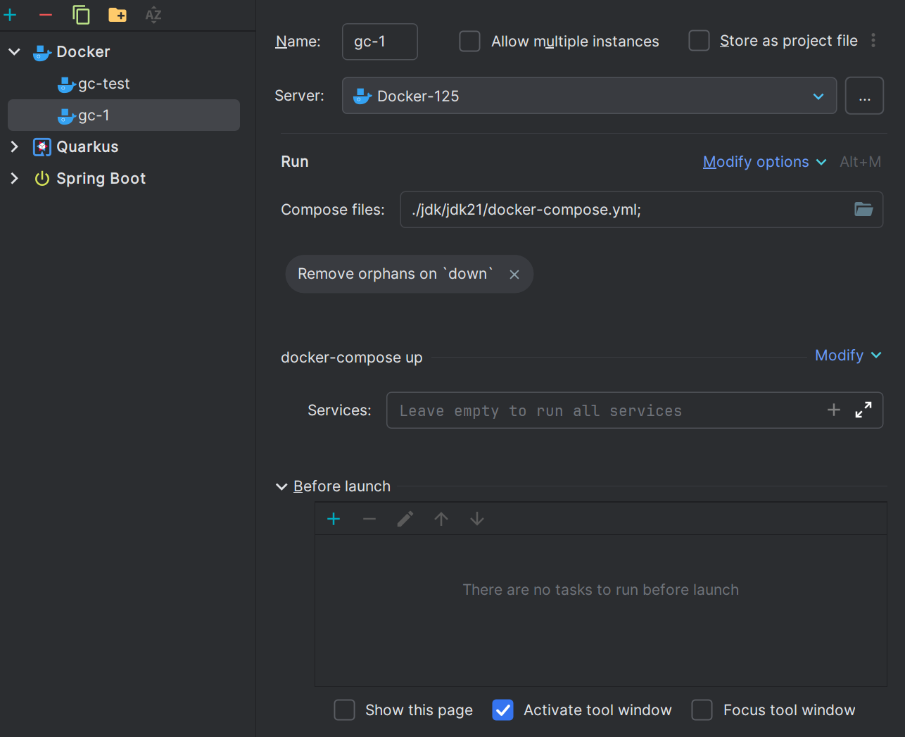

# docker

# Window 下使用 IDEA 的 Docker 远程部署

1. 首先要确定插件 Docker 是启用的状态，低版本需要下载（高版本自带）安装不了则表示 IDEA 版本过低不支持
2. 由于 Docker 是客户端/服务器模式，因此要先在下载客户端到本机 windows 上，主要下载以下三个包 [docker](https://download.docker.com/win/static/stable/x86_64/)、[docker-compose](https://github.com/docker/compose/releases)、[docker-buildx](https://github.com/docker/buildx/releases)（注意平台）在 linux 上 docker 和 docker compose 是合在一起的，但是这里只是单独安装了客户端。因此需要单独下载 docker-compose。安装完成后 docker、docker-compose 新建文件夹放在一起即可，docker-buildx 需要放到`%USERPROFILE%\.docker\cli-plugins`目录下（没有则创建，%USERPROFILE% 指的是当前用户根目录）
3. 都放置完毕后，首先添加 docker 远程，这里选 SSH 在输入服务器密码后可直接连接，否则需要修改配置文件开放 docker 远程 api 端口（如果是公网则需要添加 TLS 认证）。



4. 在本地项目的根路径下创建 Dockerfile 文件，这里的 Dockerfile 编写规则是以当前项目为根路径。然后新增一个 Run Configuration。容器的运行现在大多都是用 docker compose 编排，因此一般不单独 run container



5. 首先在同样的目录下创建 docker-compose.yml 镜像就使用上一步构建的。要使用 docker compose 编排则需要添加新的 Run Configuration 并依赖上一步 build 出来的 image（这里最好不要在 Run Configuration 里直接依赖 build 任务）



# Docker 开放 Remote API 并添加 TLS 认证

开放远程端口可直接参考[官网](https://docs.docker.com/config/daemon/remote-access/)配置

1. 这里有两个地方可配置开放远程端口，编辑`/etc/docker/daemon.json`然后往其中添加以下内容。hosts 内容是数组，如果没有本机通过 unix 套接字直连的情况可以不写第 0 项，第二项端口可任意修改

```json
{
  "hosts": [
    "unix:///var/run/docker.sock",
    "tcp://0.0.0.0:2375"
  ]
}
```

2. 如果第 1 步中没有添加 unix 套接字则可跳过此项，否则需要编辑 docker 启动配置。首先执行命令`systemctl status docker`查看启动 service 位置，然后将其中的`ExecStart`内容修改为`/usr/bin/dockerd --containerd=/run/containerd/containerd.sock`即去掉其中的`-H fd://`具体可查看[官网说明](https://docs.docker.com/config/daemon/troubleshoot/#configure-the-daemon-host-with-systemd)
3. 或者直接在启动项上添加内容`-H tcp://0.0.0.0:2375`
4. 执行命令`systemctl daemon-reload && systemctl reastart docker`即可

添加 TLS 认证则需要先生成 CA ，并签发服务端和客户端证书，具体内容[参考官网](https://docs.docker.com/engine/security/protect-access/#use-ssh-to-protect-the-docker-daemon-socket)

1. 首先需要安装 openssl
2. 先创建 certs 文件夹然后进入其中，依次执行以下脚本（这里最好使用 root 用户操作）

```bash
# 生成 CA 私钥，这里需要输入密码，这个密码后面签发证书时需要用到
openssl genrsa -aes256 -out ca-key.pem 4096
# 根据 CA 私钥生成 CA 公钥，这里的 days 单位是天，可以自行修改。生成时需要提供上一步输入的密码
# 然后是一些 CA 公钥的附加信息，不想写可以直接回车跳过
openssl req -new -x509 -days 365 -key ca-key.pem -sha256 -out ca.pem

# 生成服务端私钥
openssl genrsa -out server-key.pem 4096
# 根据服务端私钥生成公钥，这里的 $HOST 可以用域名代替没有就写 ip 或者随便写一个
openssl req -subj "/CN=$HOST" -sha256 -new -key server-key.pem -out server.csr

# 写入生成配置，这里的 $HOST 如果有实际域名则必须填写域名否则会影响客户端的连接，如果没有也是用
# IP 代替或者随便写一个。如果写了 DNS 则后面的 IP 可以不写，否则 IP 必须写成 客户端要访问服务端
# IP，这里最好加上 0.0.0.0、127.0.0.1、以及内网 IP
echo subjectAltName = DNS:$HOST,IP:xxxx,IP:127.0.0.1,IP:0.0.0.0 >> extfile.cnf
# 设置 Docker 守护进程密钥的扩展使用属性，使其仅用于服务器身份验证
echo extendedKeyUsage = serverAuth >> extfile.cnf
# 开始生成服务器签名证书，这里只需要修改日期，然后输入最开始设置的 CA 密码
openssl x509 -req -days 365 -sha256 -in server.csr -CA ca.pem -CAkey ca-key.pem \
  -CAcreateserial -out server-cert.pem -extfile extfile.cnf

# 生成客户端私钥
openssl genrsa -out key.pem 4096
# 根据客户端私钥生成公钥
openssl req -subj '/CN=client' -new -key key.pem -out client.csr
# 使密钥适合客户端身份验证，创建新的扩展配置文件
echo extendedKeyUsage = clientAuth > extfile-client.cnf
# 生成客户端签名证书，这里只需要修改日期，然后输入最开始设置的 CA 密码
openssl x509 -req -days 365 -sha256 -in client.csr -CA ca.pem -CAkey ca-key.pem \
  -CAcreateserial -out cert.pem -extfile extfile-client.cnf

# 删除无用的中间文件
rm -rf client.csr server.csr extfile.cnf extfile-client.cnf
# 证书文件是不用修改的，可以只给读权限
chmod 0400 ca-key.pem key.pem server-key.pem ca.pem server-cert.pem cert.pem
```

3. 生成完成后将 certs 目录移动到`/etc/docker`目录下修改所属为 root，然后往 daemon.json 文件中写入以下内容，或者可以在 docker 的启动服务中添加`--tlsverify --tlscacert=ca.pem --tlscert=server-cert.pem --tlskey=server-key.pem`

```json
{
  "tlsverify": true,
  "tlscacert": "/etc/docker/certs/ca.pem",
  "tlscert": "/etc/docker/certs/server-cert.pem",
  "tlskey": "/etc/docker/certs/server-key.pem"
}
```

4. 需要提供给客户端`ca.pem、cert.pem、key.pem`这三个文件，运行以下命令验证是否能远程控制`docker --tlsverify --tlscacert=ca.pem --tlscert=cert.pem --tlskey=key.pem -H=$HOST:2376 version`这里的 $HOST 需要写成实际访问的域名或者 IP
