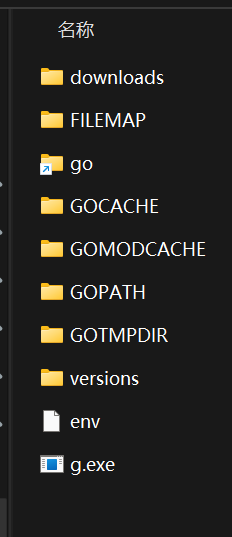
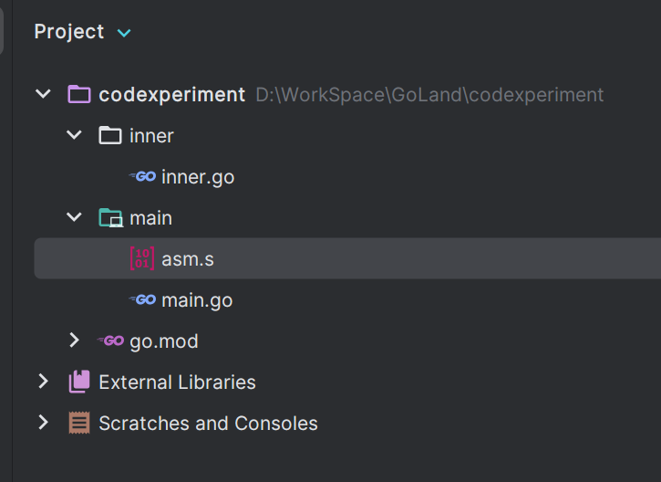
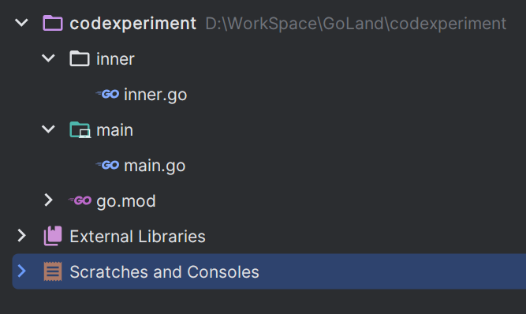

# go

# Windows 下 Golang 版本控制工具

可以使用 [voidint/g](https://github.com/voidint/g)

1. 下载文件直接解压到安装目录下
2. 开始配置系统环境变量

```plain
# 定义 g 环境变量
G                D:\Coding\g\g.exe
G_EXPERIMENTAL   true
G_HOME           D:\Coding\g
G_MIRROR         https://golang.google.cn/dl/
GOROOT           D:\Coding\g\go
# 这里把 go 的环境变量定义一下，工具会生成一个快捷方式 go 指向实际的 version 文件夹，
# 这里的 env 包含了全部的环境变量，且只能通过配置系统环境变量的方式进行，不可以使用
# go env -w xxx=xxx 的命令进行修改
GOENV            D:\Coding\g\env
# 实际添加到 path 下
%G%
%G_MIRROR%
%G_EXPERIMENTAL%
%G_HOME%
%G_HOME%\bin
%GOENV%
%GOROOT%
%GOROOT%\bin
```

env 文件内容（对应的文件夹需要提前创建）



文件格式需要是 UTF-8 bom，且换行格式为 unix LF

```plain
GO111MODULE=auto
GOPATH=D:\coding\g\GOPATH
GOPROXY=https://golang.google.cn,direct
GOTMPDIR=D:\coding\g\GOTMPDIR
GOCACHE=D:\coding\g\GOCACHE
GOMODCACHE=D:\coding\g\GOMODCACHE
```

3. 可以在命令行使用 g 进行版本控制了

# Golang 交叉编译命令

* 在 win 平台上编译成 linux 和  Mac 平台可执行文件

```bash
# 编译 linux
SET CGO_ENABLED=0  # 禁用CGO
SET GOOS=linux  # 目标平台是linux
SET GOARCH=amd64  # 目标处理器架构是amd64
go build
# 编译 mac
SET CGO_ENABLED=0
SET GOOS=darwin
SET GOARCH=amd64
go build
```

* Mac 下编译 Linux 和 Windows平台 64位 可执行程序

```bash
# 编译 linux
CGO_ENABLED=0
GOOS=linux
GOARCH=amd64
go build
# 编译 windows
CGO_ENABLED=0
GOOS=windows
GOARCH=amd64 
go build
```

* Linux 下编译 Mac 和 Windows 平台64位可执行程序

```bash
# 编译 mac
CGO_ENABLED=0
GOOS=darwin
GOARCH=amd64
go build
# 编译 windows
CGO_ENABLED=0
GOOS=windows
GOARCH=amd64
go build
```

# io/ioutil API迁移

从 go 1.16 开始<code> io/ioutil </code>被弃用，其 API 迁移如下：

```plain
ioutil.ReadAll -> io.ReadAll
ioutil.ReadFile -> os.ReadFile
ioutil.ReadDir -> os.ReadDir
ioutil.NopCloser -> io.NopCloser
ioutil.ReadDir -> os.ReadDir
ioutil.TempDir -> os.MkdirTemp
ioutil.TempFile -> os.CreateTemp
ioutil.WriteFile -> os.WriteFile
```

# Golang 反汇编部分代码

使用`go tool objdump`，可以看到任意函数的机器码、汇编指令、偏移。但是一些简单的函数在使用此命令时有时候会查到不到目标函数，不出意外应该是被内联了。需要加上`//go:noinline`防止编译器内联（程序需要重新进行编译）`go tool objdump -S -s 'main.read' main.exe`

```cpp
package main

func main() {
	n := 10
	println(read(&n))
}

//go:noinline
func read(p *int) (v int) {
	v = *p
	return
}
```

# Golang 指针操作

Golang 中也可以像 C 语言那样对指针进行运算，但是比较麻烦需要转换成 uintptr 本质是一个平台相关的 uint 类型。

如下所示

```go
package main

import (
	"fmt"
	"unsafe"
)

func main() {
	a := []int{1, 2, 3, 4, 5, 6, 7, 8, 9, 10, 11, 12, 13, 14, 15}
	b := &a[0]
    // 访问下标为 1 的元素
	p := (*int)(unsafe.Pointer(uintptr(unsafe.Pointer(b)) + unsafe.Sizeof(*b)))
	fmt.Println(*p)
	addr(&a[2], &a[3])
}

//go:noinline
func addr(a *int, b *int) {
	fmt.Println(*a)
    // 根据函数参数传递规则，根据 a 的地址访问 b 
	fmt.Println(*(*int)(unsafe.Pointer(uintptr(unsafe.Pointer(a)) + unsafe.Sizeof(*a))))
}
```

# Golang 编译指令

golang 编译指令可以参考[官方文档](https://pkg.go.dev/cmd/compile#hdr-Compiler_Directives)，其定义如下：编译器接受注释形式的指令。为了与非指令注释区分开来，指令要求在注释开头和指令名称之间不留空格。不过，由于指令是注释，不了解指令惯例或特定指令的工具可以像其他注释一样跳过指令。

## linkname

linkname 主要作用是将包级别的非导出变量或函数在包外也能被访问，主要有 3 种方式实现：

1. 主动拉取目标包中的变量、函数`//go:linkname <指令下方的只有声明的函数或包级别变量名> <本包或者其他包中的有完整定义的函数或变量>`比如在引用标准库中的`fmt.Println()`（注意：unsafe 包是必须导入的，其次最好导入目标包。由于破坏了包级别的访问性，因此若是直接访问不会触发包的初始化方法）

定义主动拉取的方法签名时最好和实现的方法保持一致，否则会出现段错误（该错误会在运行时发生）

该方式在 go1.23 版本后将受到限制。具体表现为标准库中的方法均不允许以该种形式导出，个人或者三方的除外。可通过编译时添加参数`ldflags: -checklinkname=0`关闭检查，但这只是个临时的缓冲方法，后续 go 版本升级后该方法可能会变得不可用

```go
package main

import (
	_ "flag" // 这里如果不导入初始化下面会输出 nil 
	_ "fmt"
	_ "unsafe"
)

//go:linkname myprint fmt.Println
func myprint(a ...any) (n int, err error)

//go:linkname errRange flag.errRange
var errRange error

func main() {
	_, err := myprint(errRange)
	if err != nil {
		return
	}
}
```

2. 实现方法主动推送给其它签名方法，该方式较为繁琐，需要在导出方法同级包下创建一个空的以`.s`结尾的汇编文件告诉编译器导出方法的定义在别处。该方法相当于指定了导出方法和被导出方法



```go
package inner

import (
	"fmt"
	_ "unsafe" // 必须引入 unsafe
)

// 这里必须写出 当前方法 导出方法
//go:linkname myprint main.myprint
func myprint(a string) {
	fmt.Println(a)
}

//go:linkname s main.s
var s = "hello world"

```

```go
package main

import (
	_ "codexperiment/inner" // 这里必须引入导出方法实现的包
)

func myprint(a string)

var s string

func main() {
	myprint(s)
}
```

3. 方式 1 和 2 的结合体，该方法可以不用写中间的`.s`空汇编文件，但是针对包路径要写全



```go
package main

import (
	_ "codexperiment/inner" // 最好导出
	_ "unsafe" // 必须导出
)

//go:linkname myprint codexperiment/inner.myprint
func myprint(a string)

//go:linkname s codexperiment/inner.s
var s string

func main() {
	myprint(s)
}

```

```go
package inner

import (
	"fmt"
	_ "unsafe" // 必须导入
)

//go:linkname myprint
func myprint(a string) {
	fmt.Println(a)
}

//go:linkname s
var s = "hello world"
```
