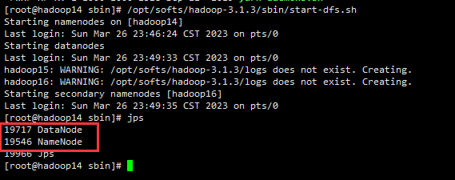
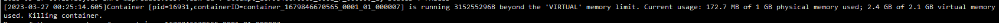
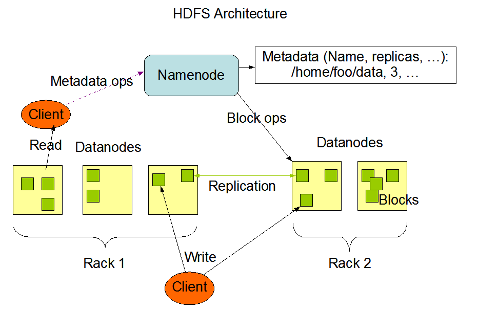

# hadoop

# Hadoop 组成

Hadoop 一共就做两件事情，数据存储（HDFS）和数据计算（MapperReduce 一般指离线计算）

1.x 版本调度和计算集成在一起，2.x 版本以后计算由 MapperReduce 负责，调度由 Yarn 负责

* 存储组件（HDFS）：NameNode（数据目录）、DataNode（实际存储数据）、SecondaryNameNode（数据目录的备份，存在一定备份延时）
* 资源管理组件（Yarn）：ResourceManager（资源调度中心）、NodeManager（实际节点的资源调度中心）Container（实际任务执行的环境，首先会开启一个 App Master 向 ResourceManager 申请资源，然后分配资源给 Map Task—— 实际就是在做 Mapper 工作，最后收集计算结果）

# Hadoop 集群搭建

环境准备：JDK8+、Hadoop 安装包

* Hadoop [下载地址](https://archive.apache.org/dist/hadoop/common/) （以下安装以 3.1.3 版本为准）下载（wget 下载）后直接解压到指定目录 `tar -xf hadoop-3.1.3.tar.gz -C /opt/softs`
* 安装 [OpenJDK8](https://jdk.java.net/java-se-ri/8-MR4) 解压到指定目录并改名 `tar -xf openjdk-8u42-b03-linux-x64-14_jul_2022.tar.gz -C /opt/softs`

集群搭建规划

| | hadoop14 | hadoop15 | hadoop16 |
| --- | --- | --- | --- |
| HDFS | NameNode<br/>DataNode | <br/>DataNode | secondaryNameNode<br/>DataNode |
| YARN | <br/>NodeManager | ResouceManager<br/>NodeManager | <br/>NodeManager |

1. 配置 JDK 以及 Hadoop 环境变量，创建 `/etc/profile.d/env.sh`写入环境变量 `source /etc/profile`

```plain
#!/bin/bash
# JAVA_HOME
export JAVA_HOME=/opt/softs/jdk1.8
export PATH=$PATH:$JAVA_HOME/bin
# HADOOP
export HADOOP_HOME=/opt/softs/hadoop-3.1.3
export PATH=$PATH:$HADOOP_HOME/bin
export PATH=$PATH:$HADOOP_HOME/sbin
# 如果是以 root 启动 hadoop 则需要额外加入以下 5 行
export HDFS_NAMENODE_USER=root
export HDFS_DATANODE_USER=root
export HDFS_SECONDARYNAMENODE_USER=root
export YARN_RESOURCEMANAGER_USER=root
export YARN_NODEMANAGER_USER=root
```

2. 在 hadoop14 上配置 NameNode，编辑文件 `vim /opt/softs/hadoop-3.1.3/etc/hadoop/core-site.xml`

```xml
<?xml version="1.0" encoding="UTF-8"?>
<?xml-stylesheet type="text/xsl" href="configuration.xsl"?>
<configuration>
    <!-- 指定 NameNode 地址-->
    <property>
        <name>fs.defaultFS</name>
        <value>hdfs://hadoop14:8020</value>
    </property>
    <!-- 指定 hadoop 数据存储目录-->
    <property>
        <name>hadoop.tmp.dir</name>
        <value>/opt/softs/hadoop-3.1.3/data</value>
    </property>
</configuration>
```

3. 在 hadoop14 上配置 HDFS，编辑文件 `vim /opt/softs/hadoop-3.1.3/etc/hadoop/hdfs-site.xml`

```xml
<?xml version="1.0" encoding="UTF-8"?>
<?xml-stylesheet type="text/xsl" href="configuration.xsl"?>
<configuration>
    <!-- NameNode Web 访问地址 -->
    <property>
        <name>dfs.namenode.http-address</name>
        <value>hadoop14:9870</value>
    </property>
    <!-- secondaryNameNode Web 访问地址 -->
    <property>
        <name>dfs.namenode.secondary.http-address</name>
        <value>hadoop16:9868</value>
    </property>
</configuration>
```

3. 在 hadoop14 上配置 Yarn，编辑文件 `vim /opt/softs/hadoop-3.1.3/etc/hadoop/yarn-site.xml`

```xml
<?xml version="1.0"?>
<configuration>
  <!-- 指定 MapReduce 走 shuffle -->
  <property>
    <name>yarn.nodemanager.aux-services</name>
    <value>mapreduce_shuffle</value>
  </property>
  <!-- 指定 ResourceManager 地址 -->
  <property>
    <name>yarn.resourcemanager.hostname</name>
    <value>hadoop15</value>
  </property>
  <!-- 环境变量继承，3.1.3 以后不再需要，为当前版本的 bug -->
  <property>
    <name>yarn.nodemanager.env-whitelist</name>
    <value>JAVA_HOME,HADOOP_COMMON_HOME,HADOOP_HDFS_HOME,HADOOP_CONF_DIR,CLASSPATH_PREPEND_DISTCACHE,HADOOP_YARN_HOME,HADOOP_MAPRED_HOME</value>
  </property>
  <!-- 开启日志聚集功能 -->
  <property>
    <name>yarn.log-aggregation-enable</name>
    <value>true</value>
  </property>
  <!-- 设置日志聚集服务器地址 -->
  <property>
    <name>yarn.log.server.url</name>
    <value>http://hadoop14:19888/jobhistory/logs</value>
  </property>
  <!-- 设置日志保留时间 -->
  <property>
    <name>yarn.log-aggregation.retain-seconds</name>
    <value>604800</value>
  </property>
</configuration>
```

4. 在 hadoop14 上配置 MapRecude，编辑文件 `vim /opt/softs/hadoop-3.1.3/etc/hadoop/mapred-site.xml`

```xml
<?xml version="1.0"?>
<?xml-stylesheet type="text/xsl" href="configuration.xsl"?>
<configuration>
  <!-- 指定 MapReduce 程序运行在 Yarn 上，默认是在本地 -->
  <property>
    <name>mapreduce.framework.name</name>
    <value>yarn</value>
  </property>
  <!-- 历史服务器地址 -->
  <property>
    <name>mapreduce.jobhistory.address</name>
    <value>hadoop14:10020</value>
  </property>
  <!-- 历史服务器 web 地址 -->
  <property>
    <name>mapreduce.jobhistory.webapp.address</name>
    <value>hadoop14:19888</value>
  </property>
</configuration>
```

5. 在 hadoop14 上配置 workers（定义集群机器），编辑文件 `vim /opt/softs/hadoop-3.1.3/etc/hadoop/workers`

```plain
hadoop14
hadoop15
hadoop16
```

6. 设置免密登录其它两台机器

1）生成密钥对 `ssh-keygen -t rsa`连续敲三次回车

2）开始分发密钥以及提供免密登录 `ssh-copy-id username@ip`这里我用的是 root 账户（需要输入其它机器的 root 密码）

3）编写分发脚本并添加可执行权限，然后建立软链接方便全局使用 `ln -s /opt/softs/xsync /usr/local/bin`

```bash
#!/bin/bash
if [ $# -lt 1 ]
then
    echo Not Enough Arguement!
    exit;
fi
# 这里提前配置了域名，如果不配置则需要填写实际 ip
for host in hadoop14 hadoop15 hadoop16
do
    echo ================== $host ==================
    for file in $@
    do
        if [ -e $file ]
        then
            pdir=$(cd -P $(dirname $file); pwd)
            fname=$(basename $file)
            ssh $host "mkdir -p $pdir"
            rsync -av $pdir/$fname $host:$pdir
        else
            echo $file does not exists!
        fi
    done
done
```

7. 运行分发脚本，把前 4 步配置好的文件统一分发到其它两台机器上 `xsync /opt/softs`
8. 初始化 dfs，在 hadoop14 上运行。如果是第一次启动需要运行命令 `hdfs namenode -format`（这个命令只在第一次初始化集群时需要运行，每次运行会产生一个新的 NameNode Id，如果想重置环境，则需要停止 namenode 和 datanode 进程然后删除所有机器的 data 和 logs 目录）
9. 启动 dfs，直接运行 `/opt/softs/hadoop-3.1.3/sbin/start-dfs.sh`正常情况下 DataNode 和 NameNode 都应该启动，如果少了停止其它机器上的进程，删除 data 和 logs 目录然后从第 7 步开始，重新来过。启动完成后可以在 hadoop14 上打开 web 页面 `http://hadoop14:9870`（如果打不开大概率是防火墙没关闭）



10. 启动 ResourceManage，在 hadoop15 上运行 `/opt/softs/hadoop-3.1.3/sbin/start-yarn.sh`对照部署规划查看其它两台服务器上的进程。启动完成后可以查看 yarn 的调度面板 `http://hadoop15:8088`。这里 hadoop 集群就启动完成了
11. 启动历史服务器，在hadoop14 上运行  `bin/mapred --daemon start historyserve`

# Hadoop 集群功能测试

* 在 hadoop14 机器上创建 hdfs 目录 `hadoop fs -mkdir /wcinput`
* 上传一个小文件 `hadoop fs -put ./xsync /wcinput`
* 上传一个大文件 `hadoop fs -put /opt/packages/jdk-8u351-linux-x64.tar.gz /wcinput`最终上传的文件在目录下 `/opt/softs/hadoop-3.1.3/data/dfs/data/current/BP-307151001-192.168.109.14-1679845725263/current/finalized/subdir0/subdir0`由于配置了 3 个 DataNode 因此默认的数据共有三份，分别在三台机器上。（路径一致）
* 开始执行单词统计 demo `hadoop jar share/hadoop/mapreduce/hadoop-mapreduce-examples-3.1.3.jar wordcount /wcinput /wcoutput`遇到错误：



在 hadoop14 上修改 `vim /opt/softs/hadoop-3.1.3/etc/hadoop/yarn-site.xml`添加以下配置，重新分发 `xsync etc/hadoop/yarn-site.xml`后在 hadoop15 上重启 yarn `./stop-yarn.sh && ./start-yarn.sh`

```xml
<!-- 是否对容器强制执行虚拟内存限制 -->
<property>
  <name>yarn.nodemanager.vmem-check-enabled</name>
  <value>false</value>
  <description>Whether virtual memory limits will be enforced for containers</description>
</property>
<property>
  <!-- 为容器设置内存限制时虚拟内存与物理内存之间的比率 -->
  <name>yarn.nodemanager.vmem-pmem-ratio</name>
  <value>4</value>
  <description>Ratio between virtual memory to physical memory when setting memory limits for containers</description>
</property>
```

删除结果输出目录 `hadoop dfs -rm -r -f /wcoutput`（hadoop 不允许结果目录存在）重新执行 demo

集群启动：hadoop14 `sbin/start-dfs.sh` hadoop15 `sbin/start-yarn.sh` hadoop14 `bin/mapred --daemon start historyserver`

集群停止：hadoop15 `sbin/stop-yarn.sh`hadoop14 `bin/mapred --daemon stop historyserver && sbin/stop-dfs.sh`

# HDFS

## HDFS 概述

HDFS（Hadoop Distribute File System），直译为分布式文件系统，用户存储海量文件，通过目录树的形式（参考 Linux 文件系统）来访问、定位文件。适合一次写入多次读出的场景（读多写少）它不适合进行：

1. 低延时的数据访问（类似MySQL）
2. 大量的小文件存储（寻址时间超过读取时间，违反了设计初衷）
3. 并发写入（一个文件只能由一个线程写）和文件随机修改（支持追加）

## HDFS 组成架构



1. NameNode（俗称 nn）整个集群的 Master 主要负责管理 HDFS 的名称空间、配置副本策略、管理数据块的映射信息（分布式存储的文件需要有地方存储分割的文件编号）、处理客户端的读写请求
2. DataNode（也就是 slave 真正存储数据的地方）执行实际的存储操作，主要负责存储实际的数据块、执行数据块的读写操作
3. SecondaryNameNode（俗称 2nn）它并不是 NameNode 的热备，当 NameNode 宕机时也不能替代它进行工作，主要负责辅助 NameNode，分担其工作量，比如定期合并 Fsimage 和 Edits，并将结果推送给 NameNode；在紧急情况下用于恢复 NameNode（相当于是一个延时的备份）
4. Client（也就是客户端）主要负责当进行文件上传时负责将文件切分为 Block 然后上传、与 NameNode 交互获取文件的存储位置、与 DataNode 交互，让其读写数据 以及提供一些命令来管理 HDFS（包含对 HDFS 的 CRUD），比如之前用到的 NameNode 格式化命令

Hadoop 2.x/3.x 版本默认的块大小为 128 M 在 1.x 版本默认的块大小为 64 M，这个块大小涉及 HDFS 的寻址，因此一般设置为 128 M 左右刚好满足机械硬盘的传输速度，如果是高速的固态硬盘可以根据实际传输速率靠近 2 的次幂去配置（这个值设置的太小会增加寻址时间，太大会增加磁盘的读取开销——定位文件耗时太长）因此块大小设置主要取决于磁盘的读写速率

HDFS 配置文件优先级：hdfs-default.xml < hdfs-site.xml < 项目资源目录下的配置文件 < 代码里面的配置

## HDFS 写入数据流程

以 a/b.txt 为例：

1. 客户端选择文件上传方式（默认是本地）这里要选 Distributed FileSystem（分布式文件上传）
2. 紧接着向 NameNode 发起上传请求
3. NameNode 校验上传方权限，以及检查文件夹、文件是否存在然后响应可上传文件
4. 客户端请求上传第一个 Block，请求 NameNode 返回指定的 DataNode
5. NameNode 计算节点距离和负载均衡后返回指定的 n 个 （表示冗余存储的个数） DataNode 节点
6. 客户端创建 FSDataOutputStream 开始往返回的第一个 DataNode 传输数据（DataNode 数据会先到内存然后同时开 2 个线程，一个往本地写，一个继续往下一个 DataNode 同步——接下来的节点以此类推）传输时客户端以 packet 为单位进行上传（64 kb）packet 中按照 512 字节的 chunk + 4 字节的 校验和组成（这个数据会缓冲到内存然后在 DataNode 返回 ACK 包之后才会删除）

## HDFS 读取数据流程

以 a/b.txt 为例：

1. 客户端向 NameNode 请求下载文件
2. NameNode 返回目标文件的元数据（也就是目标文件分成的 Block 以及 Block 所在的 DataNode）
3. 客户端创建 FSInputStream 选择节点距离最近以及综合负载后（逻辑距离）的 DataNode 读取（读取方式为串行读取，综合网络和磁盘 IO）

## NN、2NN 工作机制

NameNode 节点内存存放实时的元数据，edits 文件用于记账（类似 mysql 的 redolog）fsimage 文件存放合并历史 edits 文件的结果，NameNode 启动时会合并未计算结果的 edits 文件和 fsimage 文件到内存中

* NameNode 节点内存存放实时的元数据，同时每当有计算任务时会将操作步骤先写入到磁盘（edits\_inprogress 文件，也就是 edits 文件位于 NameNode 节点：/opt/softs/hadoop-3.1.3/data/dfs/name/current）然后再同步内存
* SecondaryNameNode 定时（通常为 1 小时）主动请求 NameNode 是否需要合并计算结果（辅助工作）或者当 NameNode 节点中的 edits 文件数据满了（通常为 100w 条，这个是 2nn 主动进行检查，每 60s 一次）协助计算  edits 文件内容并将结果合并到 fsmiage 文件中，同时 NameNode 滚动 edits 文件生成新的记账文件（保留历史）
* SecondaryNameNode 拉取未合并的 edits 文件和 NameNode 中最新的 fsimage 文件到本地（本地路径：/opt/softs/hadoop-3.1.3/data/dfs/namesecondary/current）然后进行计算合并生成新的 fsimage.chkpoint 文件，再将其拷贝到 NameNode 中覆盖原来的 fsimage 文件

## Fsimage 文件信息

* fsimage 存储了所有的文件元数据（但是不包含副本数量，这个是集群启动时 DataNode 主动上报的）同路径下的 seen\_txid 文件记录了最新的 edits 文件后缀编号，VERSION 文件记录了集群的编号和名称空间等重要信息，
* 可以通过命令查看 fimage 文件内容 `hadoop oiv -p xml -i fsimage文件 -o 输出文件名.xml`（这里的输出文件类型仅仅支持以下几种格式：XML、ReverseXML、FileDistribution、Web、Delimited）

## Edits 编辑日志

* edits 文件只记录操作步骤并且该文件写入方式为追加写入，不进行任何的合并操作
* 可以通过命令查看 edits 文件内容 `hdfs oev -p 文件类型 -i edits文件路径 -o 转换后的文件输出路径`可转换的文件类型同 Fsimage 文件。进行合并时取大于当前 Fsimage 后缀值的 Edits  文件进行合并

## 2NN 检查时间间隔设置

默认检查时间间隔为 1 小时或者操作次数达 100w 次（2nn 每 60 s 主动检查一次），可以在 hdfs-default.xml 文件中自定义间隔时间：

```xml
<!-- 检查间隔时间 -->
<property>
  <name>dfs.namenode.checkpoint.period</name>
  <value>3600s</value>
</property>
<!-- 操作次数达 100w 主动发起合并请求 -->
<property>
  <name>dfs.namenode.checkpoint.txns</name>
  <value>1000000</value>
</property>
<!-- 60 秒检查一次 -->
<property>
  <name>dfs.namenode.checkpoint.check.period</name>
  <value>60s</value>
</property>
```

## DataNode 工作机制

* DataNode 通常负责存储实际的块数据、数据长度、校验和以及时间戳，具体存放路径 `/opt/softs/hadoop-3.1.3/data/dfs/data/current/BP-307151001-192.168.109.14-1679845725263/current/finalized/subdir0/subdir0`meta 类型的文件即为块数据的元数据信息。
* 集群启动时，DataNode 主动向 NameNode 进行注册并上报自己的元数据信息，以后周期性上报所有块信息（默认 6 个小时一次），除此之外还与 NameNode 维持心跳连接（3 秒一次）当超过 10 分钟 + 30 秒 NameNode 依旧没有收到 DataNode 的心跳包则会永久排除这个节点。

# MapReduce

## MapReduce 概述

MapReduce 是一个分布式运算程序的编程框架，它有以下的优点和缺点。

优点：

* 易于编程，用户只关心业务逻辑，实现框架接口即可
* 扩展性良好，可以动态增加服务器，解决计算资源不够的问题
* 高容错性，当机器宕机时，任务可以进行迁移
* 适合海量的数据计算（TB/PB）

缺点：

* 不擅长实时计算
* 不擅长流式计算（数据不是固定存储在磁盘的，是一条条产生的）
* 不擅长 DAG 有向无环图计算（任务间存在强依赖关系，A 的计算结果要作为 B 的计算输入）

MapReduce 有自己的序列化类型，除了 java 的 String 对应 MapReduce 的 Text 外，其它类型均是在后面加 Writeable

## MapReduce 核心思想

1. MapRecude 一般分成两个阶段：Map 阶段和 Reduce 阶段
2. Map 阶段的并发 MapTask 完全并发运行，互不相干
3. Reduce 阶段的并发 ReduceTask 同样互不相干，但是它们的数据依赖于上一个阶段的所有 MapTask 并发实例的输出
4. MapReduce 编程模型只能包含一个 Map 和一个 Reduce 阶段，如果逻辑复杂那么只能多道 MapReduce 串行计算

## MapReduce 进程

一个完整的 MapReduce 程序在分布式运行时有三类实例进程：

1. MrAppMaster：负责整个程序过程调度及状态协调
2. MapTask：负责 Map 阶段的整个数据处理
3. ReduceTask：负责 Reduce 阶段的整个数据处理
