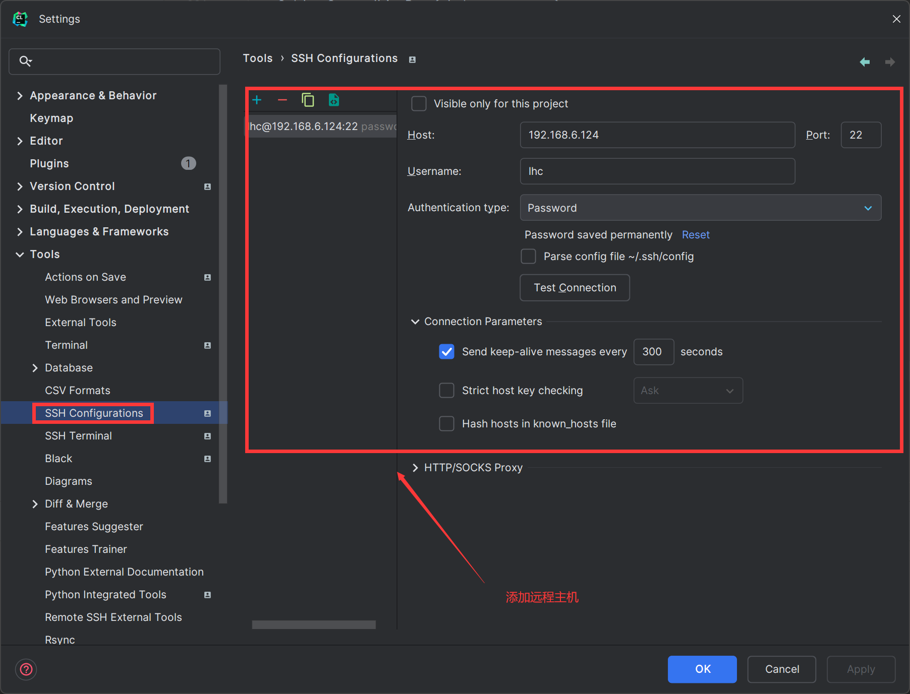
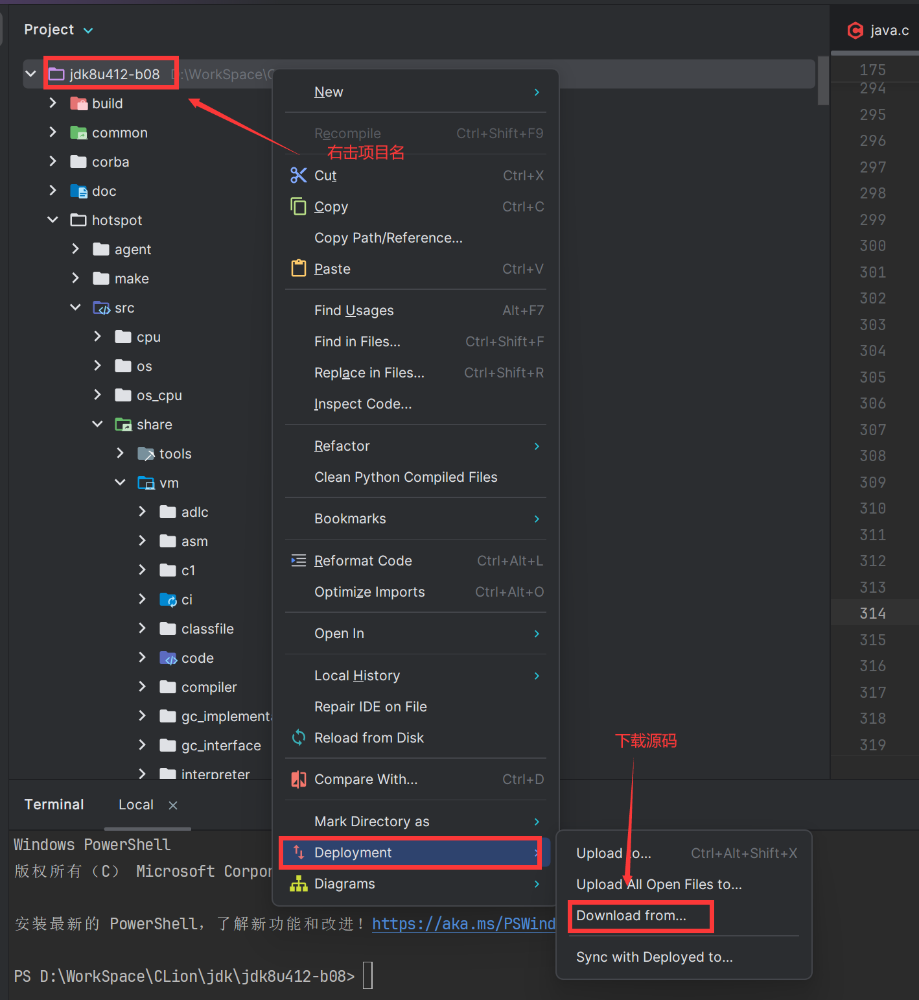
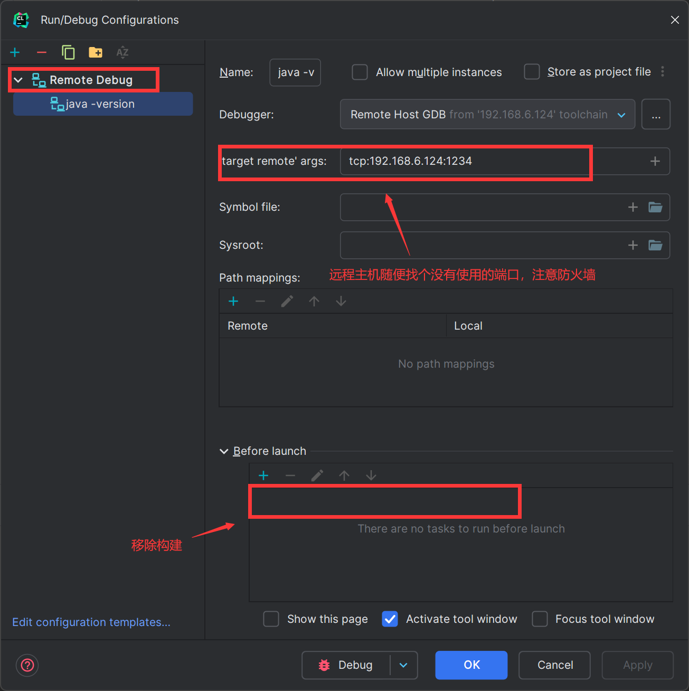
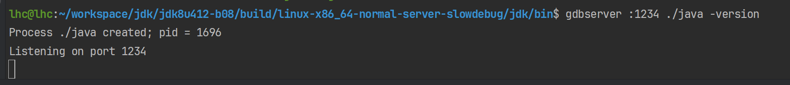
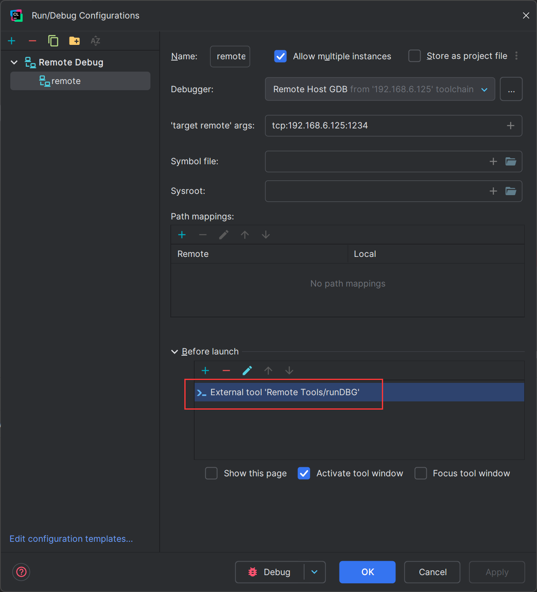
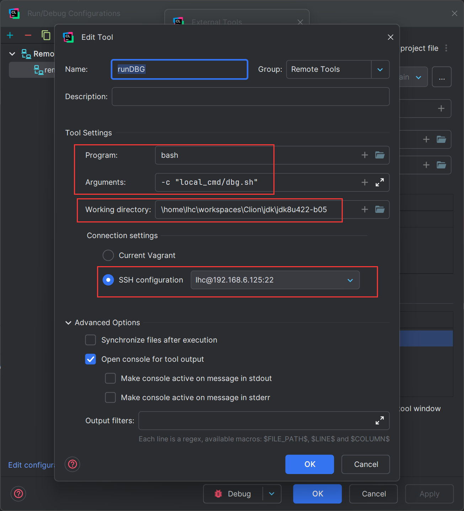
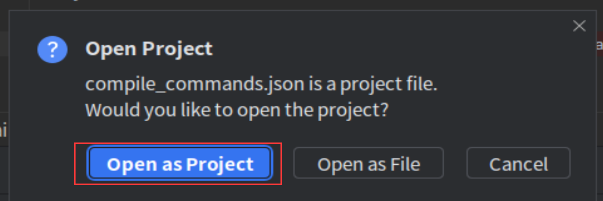
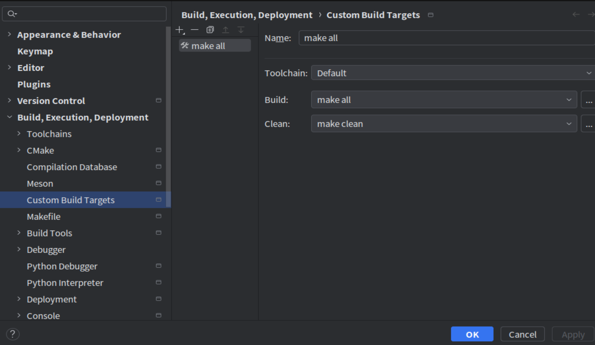
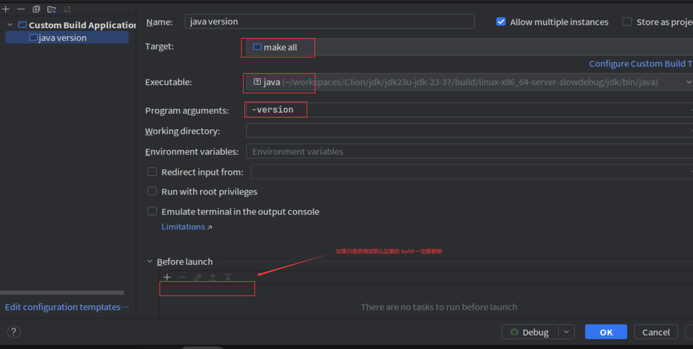

以下是一些 jdk 下载地址：

| 下载地址 | 说明 |
| --- | --- |
| [oracle jdk](https://www.oracle.com/java/technologies/downloads/archive/) | 所有 GA 版本构建好的 jdk，但是需要登录 |
| [open jdk](https://jdk.java.net/archive/) | jdk7 以后的 jdk 及源码 |
| [eclipse jdk](https://adoptium.net/zh-CN/temurin/archive/) | 也叫 adoptiumjdk 可下载主流版本的 jdk 及源码 |
| [azul jdk](https://www.azul.com/downloads/?package=jdk&show-old-builds=true#zulu) | 也叫 zulujdk 可下载所有版本及超前版本构建好的 jdk |
| [bellsoft jdk](https://bell-sw.com/pages/downloads) | 可下载自 jdk8 以后的 jdk |
| [github openjdk](https://github.com/openjdk/jdk) | openjdk 的 github 地址，仅包含源码 |
| [injdk](https://www.injdk.cn/) | 各开源 jdk 发行版网址整合 |


这些 jdk 均从 openjdk 构建除 oracle jdk 外其它 jdk 无版权争议，且功能基本一致，只是各自的构建平台和版本号不同，部分内置一些对自家产品 api 的支持。

jdk 源码编译通用流程是直接解压源码后运行根路径下的 `configure`进行配置检查，然后 `make all`进行编译。以下是对配置参数和编译参数的解析，详情[参考](https://github.com/openjdk/jdk/blob/master/doc/building.md)

# jdk8 源码编译
1. vmware 下使用 ubuntu-24.04-server （[清华源](https://mirrors.tuna.tsinghua.edu.cn/ubuntu-releases/24.04/ubuntu-24.04-live-server-amd64.iso)下载，注意平台）进行编译，这里推荐使用 5.4.0 版本的 gcc 和 g++（可直接编译通过）, 可以直接使用 ubuntu-16
2. 需要提前下载 [jdk8](https://wiki.openjdk.org/display/jdk8u) 的源码以及编译好的 [jdk7](https://download.java.net/openjdk/jdk7u75/ri/openjdk-7u75-src-b13-18_dec_2014.zip) （这里也可以使用 jdk8 作为 bootjdk）分别解压
3. 安装需要的依赖 `apt install -y libx11-dev libxext-dev libxrender-dev libxtst-dev libxt-dev build-essential gawk m4 libasound2-dev xorg-dev xutils-dev x11proto-print-dev binutils libcups2-dev zip unzip file`
4. 修改以下两个文件 `jdk/src/solaris/native/java/net/PlainDatagramSocketImpl.c``jdk/src/solaris/native/java/net/PlainSocketImpl.c`注释掉其中的 `#include<sys/sysctl.h>`（较高版本已不含 sys/sysctl.h 文件）
5. 进入 jdk8 源码目录然后执行命令 `chmod +x ./configure && ./configure --with-target-bits=64 --with-boot-jdk=bootjdk路径（之前下载的 jdk7 解压后目录） --with-debug-level=slowdebug --enable-debug-symbols --disable-zip-debug-info`，<font style="color:#DF2A3F;">命令执行完成后一定要查看当前的的 gcc、g++ 版本是否符合要求，安装依赖时有可能修改了 gcc、g++ 版本</font>
6. 无问题后开始编译 `make JOBS=6`（大概 5~10 分钟）
7. 编译后的 jdk 在 build 目录下，执行命令查看 `./build/linux-x86_64-normal-server-slowdebug/jdk/bin/java -version`正常输出则编译成功

# jdk 高版本源码编译
1. jdk8 以后推荐使用 gcc、g++ 7.5.0 版本，实测 jdk11、jdk17、jdk21 都能编译通过， 可以直接使用 ubuntu-18
2. 安装需要的依赖 `apt install -y libx11-dev libxext-dev libxrender-dev libxtst-dev libxt-dev build-essential gawk m4 libasound2-dev xorg-dev xutils-dev x11proto-print-dev binutils libcups2-dev zip unzip file autoconf`
3. 进入 jdk 源码目录然后执行命令 `chmod +x ./configure && ./configure --with-target-bits=64 --with-boot-jdk=bootjdk路径（之前下载的 bootjdk 解压后目录）--disable-warnings-as-errors --with-debug-level=slowdebug --with-native-debug-symbols=internal`，<font style="color:#DF2A3F;">命令执行完成后一定要查看当前的的 gcc、g++ 版本是否符合要求，安装依赖时有可能修改了 gcc、g++ 版本</font>
4. 无问题后开始编译 `make all`（大概 5~10 分钟）
5. 编译后的 jdk 在 build 目录下，执行命令查看 `./build/linux-x86_64-normal-server-slowdebug/jdk/bin/java -version`正常输出则编译成功

# jdk8 使用 clion 调试
1. clion 在本地创建任意项目，然后删除所有文件
2. 配置远程信息，然后从远程主机下载编译好的 jdk 源码





3. 配置 debug remote（这里远程主机需要安装 gdb、gdbserver）



4. 远程主机使用 gdbserver 启动程序监听，在任意地方下好断点后 clion 运行 debug remote



5. 以上流程也可以做成自动化的

直接添加一个





远程 DEBUG 最好写成脚本，直接运行会卡住。建议使用 screen 管理，nohup 在重启时还需要 kill，脚本如下：

```bash
#!/bin/bash

JAVA_HOME="/home/lhc/workspaces/Clion/jdk/jdk8u422-b05/build/linux-x86_64-normal-server-slowdebug/jdk"
JAR_HOME="/home/lhc/workspaces/Clion/jdk/jdk8u422-b05/jar"
APP_NAME="javaagent"
PORT="1234"

screen -wipe

if screen -list | grep -q "$APP_NAME"; then
  screen -S $APP_NAME -X quit
fi

sleep 1

screen -dmS $APP_NAME bash -c "gdbserver :$PORT $JAVA_HOME/bin/java -javaagent:$JAR_HOME/sourcetest-1.0-SNAPSHOT.jar -jar $JAR_HOME/sourcetest-1.0-SNAPSHOT.jar"

sleep 3
```

# jdk 高版本使用 clion 调试
jdk 12 之后可以更加方便的使用 clion 进行调试，不再需要依赖 CMakeLists，改方法参考 clion 官方[链接](https://blog.jetbrains.com/clion/2020/03/openjdk-with-clion/)

1. 在源码的根路径下执行命令`make compile-commands`生成 compile-commands.json 文件
2. 使用 clion 直接 open 这个文件，选择 open as project，等待索引项目完成



3. 如果是本地调试需要先添加一个 Custom Build Targets，里面其实随便填一下就行（如果是要修改源码并编译调试的就需要正常填写 make all 和 make clean 命令）



4. 填写完成后添加 Custom Build Application



## Linux 下配置
1. 如果使用`GDB`调试需要忽略`SIGSEGV`信号，需要在打开的目录下创建`.gdbinit`文件，内容为

```plain
handle SIGSEGV nostop noprint
```

2. 然后在用户目录下创建`~/.config/gdb/gdbinit`文件，内容为

```plain
add-auto-load-safe-path 上一步创建的 .gdbinit 路径（或者直接写 / 表示全路径加载）
```

## MacOS 下配置
1. 如果使用的是`lldb`那么需要忽略两种信号，首先在打开的目录下创建`.lldbinit`文件，内容为

```plain
process handle --pass true --stop false --notify false SIGILL SIGSEGV
```

2. 然后在用户目录下创建`.lldbinit` 文件，开启自动加载项目配置文件，内容为

```plain
settings set target.load-cwd-lldbinit true
```

