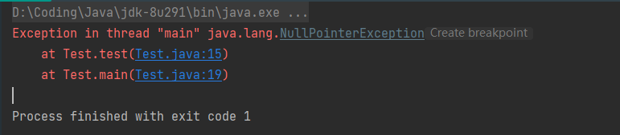
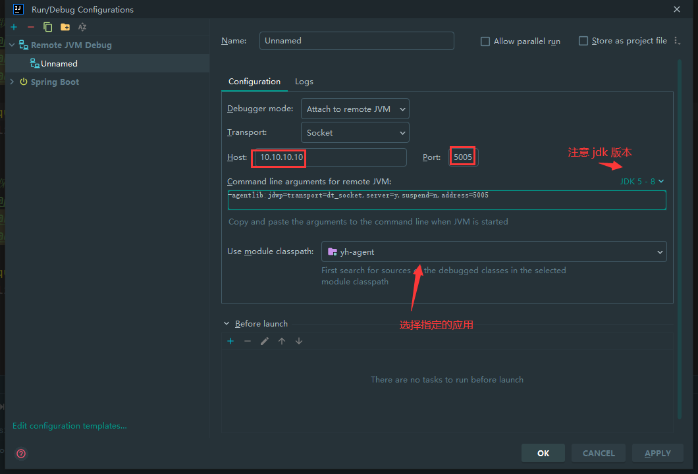
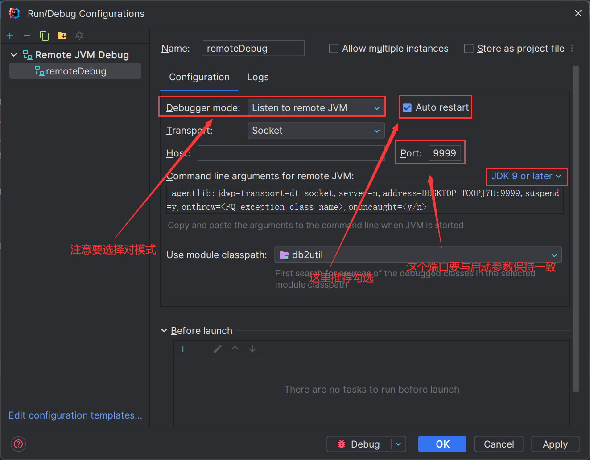
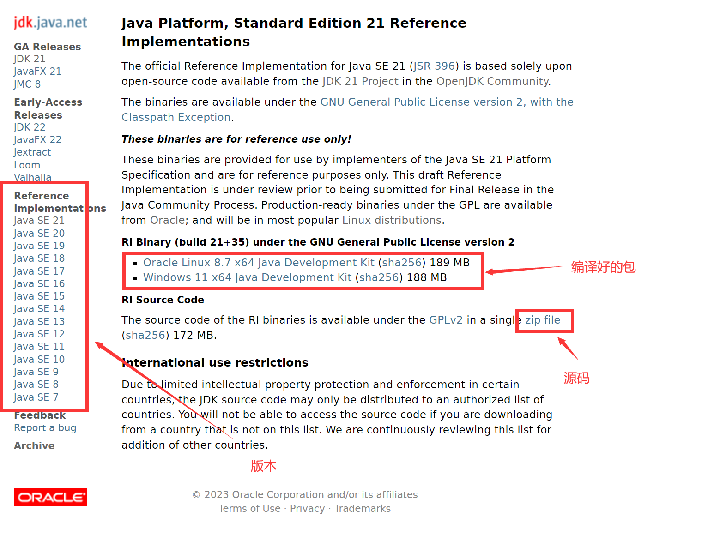
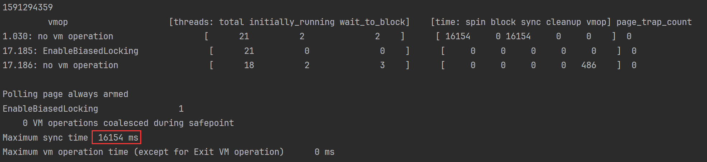
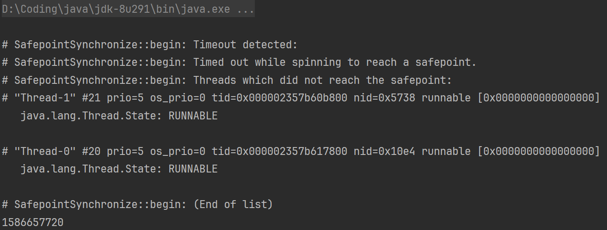
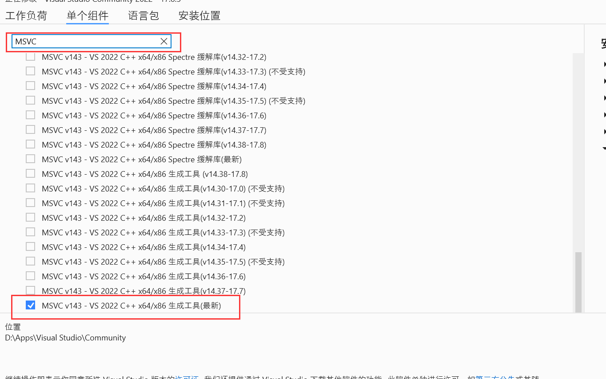
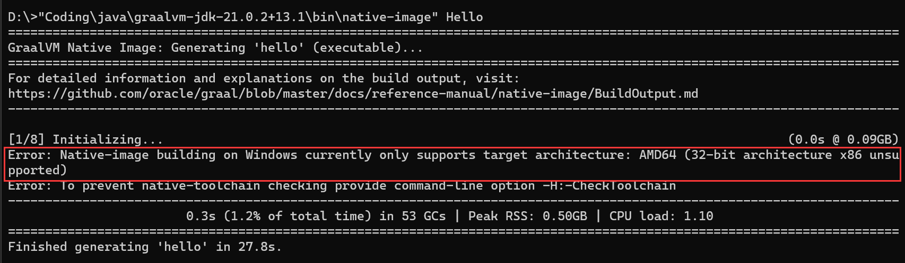
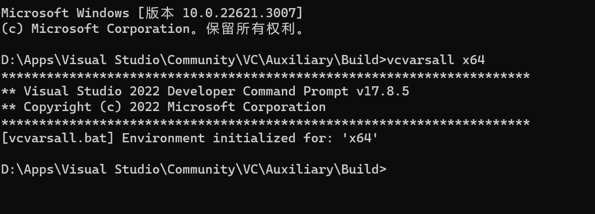

# java

# 方法返回值空指针

这里的第 13 行调用会抛出空指针异常，原因是方法返回 int 但实际是 null，无法转换(高版本的 jdk 错误提示会更加详细)。

```java
public class Test {

    public static int test() {
        ArrayList<Integer> integers = new ArrayList<Integer>() {
            {
                add(null);
            }
        };
        return integers.get(0);
    }

    public static void main(String[] args) {
        test();
    }
}
```



# 不使用任何锁让三个线程依次循环输出 A、B、C

不使用任何锁让三个线程依次循环输出 A、B、C 一百次，代码如下：

```java
class Solution {
    private static int count = 0;
    public static void main(String[] args) {
        Solution s = new Solution();
        new Thread(() -> {
            while (count < 300) {
                s.toString();
                if (count % 3 == 0 && count < 300) {
                    System.out.println("t1 A " + count);
                    count++;
                }
            }
        }).start();
        new Thread(() -> {
            while (count < 300) {
                s.toString();
                if (count % 3 == 1 && count < 300) {
                    System.out.println("t2 B " + count);
                    count++;
                }
            }
        }).start();
        new Thread(() -> {
            while (count < 300) {
                s.toString();
                if (count % 3 == 2 && count < 300) {
                    System.out.println("t3 C " + count);
                    count++;
                }
            }
        }).start();
    }
}
```

# 接口发送 xml 格式数据

对方接口接收 text/xml 格式数据，因此发送数据时需要将对象转为 xml

```java
class Solution {
    public static void main(String[] args) {
        HashMap<String, String> map = new HashMap<>(16);
        map.put("a", "1");
        map.put("b", "2");
        map.put("c", "3");
        map.put("d", "4");
        // isPretty:代表是否美化输出的 xml 字符串。omitXmlDeclaration:是否隐藏 xml 头部标识
        // 若要隐藏 standalone 只需转为 Document 对象后设置为 true 即可
        String root = XmlUtil.mapToXmlStr(map, "root", "", CharsetUtil.GBK,
                true, false);
        Document doc = XmlUtil.mapToXml(map, "root");
        doc.setXmlStandalone(true);
        String format = XmlUtil.toStr(doc, CharsetUtil.GBK, true, false);
        System.out.println(root);
        System.out.println(format);
    }
}
```

# SpringBoot2.7.2 在未连接公网的老服务器启动慢

现象：新加的应用采用 SpringBoot2.7.2 在未连接公网的老服务器（CentOS6）上启动耗时花费 8 分钟以上，原因是 SpringBoot 启动时会调用方法 `NetworkInterface.getAll`方法获取本机的 ip 由于 `/etc/hosts` 文件中没有本机的域名因此会等到较长时间再启动

* 大多数原因是因为未将当前的服务器主机名添加到本地的 DNS，导致 <code>NetworkInterface.getAll</code> 阻塞，可以将当前主机名添加到 <code>/etc/hosts</code>文件后再尝试

```bash
hostname
# 将结果写入 /etc/hosts 映射 ip 为 127.0.0.1
```

* 如果启动依旧很慢则可以尝试关闭 DNS 解析服务

```bash
java -jar xxx.jar -Xms512m -Xmx512m -Duser.timezone=GMT+08 -Dfile.encoding=UTF-8 -server -Xss5m -Xnoagent -Djava.net.preferIPv4Stack=true -Djava.security.egd=file:/dev/./urandom
```

# IDEA 设置远程 DEBUG

IDEA 的远程 debug 分为两种模式，一种是通过 AttachJVM 附加到已启动的进程上进行调试，另一种是应用程序在启动时主动往调试端推送调试信息

1. 首先远程的服务需要以 debug 的形式启动，需要添加以下的 jvm 参数，如果是tomcat服务则直接加到catalina.sh 里面。其它服务器同理(本地代码必须与 debug 服务器上的代码一致，同时防火墙需要开放指定的 debug 端口)

```bash
# 调试地址尽量设置高地址
-server -Xdebug -Xnoagent -Djava.compiler=NONE -Xrunjdwp:transport=dt_socket,server=y,suspend=n,address=xxxxx
```

* 在 IDEA 上新增 Remote JVM Debug(低版本 IDEA 上的叫 Remote) 然后添加对应的端口即可，如下图（这里是附加到进程）



* 直接启动(启动仅输出一行连接日志)，使用方式和本地 debug 一样下断点观看即可

2. 这里需要远程服务器能主动连接到本机，添加以下启动参数（这种方式要求远程的服务器能通过 ip: port 主动连接上本机才行）

```bash
# 添加以下启动参数，这里的 address 要填本机的（远程应用启动时会主动通过以下 ip:port 建立连接）
-agentlib:jdwp=transport=dt_socket,server=n,address=本机ip:本机端口,suspend=y
```

* IDEA 上新增 Remote JVM Debug(低版本 IDEA 上的叫 Remote) 然后添加对应的端口，修改 Debugger mode 为 Listen to remote JVM，如下图（这里是等待进程建立连接）



* 在本地代码上下断点，本地先运行 Debug 然后再运行远程的服务即可（如果远程的服务先于本地 Debug，那么远程的服务会一直卡在执行 main 方法之前，直到本地 Debug 启动）

# 基于 Netty 实现的定时器

基于 netty 框架的 HashedWheelTimer 实现的计时器，该类型的计时器通常用于不太注重时间精度的场景中，例如短信通知、心跳计时等等，以下为具体实现：

```java
package org.example.me;

import cn.hutool.core.date.DateUtil;
import cn.hutool.core.lang.Assert;
import io.netty.util.HashedWheelTimer;
import io.netty.util.TimerTask;

import java.util.concurrent.ExecutorService;
import java.util.concurrent.Executors;
import java.util.concurrent.ThreadFactory;
import java.util.concurrent.TimeUnit;
import java.util.concurrent.atomic.AtomicInteger;
import java.util.function.BooleanSupplier;

/**
 * @author Haochuliu
 * 基于 netty 时间轮实现的指定次数，指定间隔时间 调用业务方法
 * 该调用方式间隔的时间不是精确时间，本类默认的时间轮刻度为 100 ms
 * 意味着两次调用间隔最多有 99 ms 的时间误差
 * 详细可查看 @See io.netty.util.HashedWheelTimer 类实现方式
 */

class Solution {

    /** 时间轮刻度 100 ms */
    private final static long TICK_DURATION = 100;

    /** 时间轮个数为 512 必须为 2 的次幂，这里直接用移位表示 */
    private final static int TICKS_PER_WHEEL = 2 << 8;

    /** 不进行内存泄露检查 */
    private final static boolean LEAK_DETECTION = false;

    /** 无超时时间设置 */
    private static final long MAX_PENDING_TIMEOUTS = -1;

    /** 时间轮线程前缀 */
    private final static String PREFIX = "TIME_WHEEL_THREADS_";

    /** 构建的时间轮对象 */
    private final static HashedWheelTimer WHEEL_TIMER;

    /** 用于执行时间轮任务、以及提交任务到时间轮的线程池 */
    private final static ExecutorService TIME_WHEEL_EXECUTOR = Executors.newFixedThreadPool(5);

    // HashedWheelTimer 初始化
    static {
        ThreadFactory wheelFactory = new ThreadFactory() {
            private final AtomicInteger counter = new AtomicInteger(0);

            @Override
            public Thread newThread(Runnable r) {
                return new Thread(r, PREFIX + counter.getAndIncrement());
            }
        };
        WHEEL_TIMER = new HashedWheelTimer(wheelFactory, TICK_DURATION, TimeUnit.MILLISECONDS,
                TICKS_PER_WHEEL,LEAK_DETECTION, MAX_PENDING_TIMEOUTS, TIME_WHEEL_EXECUTOR);
        WHEEL_TIMER.start();
    }

    /**
     * @param task 需要自己实现的业务逻辑，需要使用函数式接口实现
     * @param timeInterval 任务执行间隔时间（单位：秒）至少间隔 1 秒
     * @param executeTimes 执行总次数。至少执行 1 次
     */
    public static void executePerDuration(BooleanSupplier task, long timeInterval, int executeTimes) {
        Assert.isTrue(timeInterval > 0, "时间间隔必须大于等于 1 秒！");
        Assert.isTrue(executeTimes > 0, "执行次数必须大于等于 1 次！");
        TIME_WHEEL_EXECUTOR.execute(() -> actualExecutePerDuration(task, timeInterval, executeTimes));
    }

    public static void main(String[] args) throws InterruptedException {
        AtomicInteger a = new AtomicInteger(0);
        AtomicInteger b = new AtomicInteger(0);
        AtomicInteger c = new AtomicInteger(0);
        executePerDuration(() -> {
            System.out.println(Thread.currentThread().getName() + "\t" + DateUtil.now() + " a " + a.getAndIncrement());
            return true;
        }, 1, 10);
        executePerDuration(() -> {
            System.out.println(Thread.currentThread().getName() + "\t" + DateUtil.now() + " b " + b.getAndIncrement());
            return true;
        }, 2, 10);
        executePerDuration(() -> {
            System.out.println(Thread.currentThread().getName() + "\t" + DateUtil.now() + " c " + c.getAndIncrement());
            return true;
        }, 3, 10);
    }

    private static void actualExecutePerDuration(BooleanSupplier task, long timeInterval, int executeTimes) {
        if (!task.getAsBoolean()) {
            return;
        }
        AtomicInteger notifyCount = new AtomicInteger(executeTimes - 1);
        TimerTask timerTask = timeout -> {
            try {
                if (task.getAsBoolean() && notifyCount.decrementAndGet() > 0) {
                    WHEEL_TIMER.newTimeout(timeout.task(), timeInterval, TimeUnit.SECONDS);
                }
            } catch (Exception e) {
                throw e;
            }
        };
        WHEEL_TIMER.newTimeout(timerTask, timeInterval, TimeUnit.SECONDS);
    }
}
```

# XXL-Job 做分布式部署时，客户端重启后无法继续触发定时

* 解决方案：org.quartz.jobStore.misfireThreshold 最多设置 10 秒否则会出现客户端重启无法继续触发定时现象

```properties
org.quartz.scheduler.instanceName: DefaultQuartzScheduler
org.quartz.scheduler.instanceId: AUTO
org.quartz.scheduler.rmi.export: false
org.quartz.scheduler.rmi.proxy: false
org.quartz.scheduler.wrapJobExecutionInUserTransaction: false
# org.quartz.scheduler.batchTriggerAcquisitionMaxCount: 3

org.quartz.threadPool.class: org.quartz.simpl.SimpleThreadPool
org.quartz.threadPool.threadCount: 50
org.quartz.threadPool.threadPriority: 5
org.quartz.threadPool.threadsInheritContextClassLoaderOfInitializingThread: true

# 这里最多设置 10 秒否则无效
org.quartz.jobStore.misfireThreshold: 1000
org.quartz.jobStore.maxMisfiresToHandleAtATime: 1

# for cluster enable lock
org.quartz.jobStore.acquireTriggersWithinLock: true

#org.quartz.jobStore.class: org.quartz.simpl.RAMJobStore

# for cluster
# 表前缀
org.quartz.jobStore.tablePrefix: UBADMA.JD_
org.quartz.jobStore.class: org.quartz.impl.jdbcjobstore.JobStoreTX
org.quartz.jobStore.isClustered: true
org.quartz.jobStore.clusterCheckinInterval: 5000
```

* 每次重启应用后手动启停全部任务，任务 ID 从表中获取：TRIGGER\_INFO，以下为自动启停脚本

```python
import json
import time
import requests as requests
GS = {}
def config_read():
    global GS
    try:
        with open('config.json', encoding='utf-8') as f:
            result = json.load(f)
            GS = result
    except Exception as ignored:
        print('读取文件失败')


def login():
    res = requests.post(url=GS['loginUrl'],
                        headers={'Content-Type': 'application/x-www-form-urlencoded'},
                        data={'username': GS['username'], 'password': GS['password']})
    if res.status_code != 200:
        print('登录失败')
    else:
        GS['sessionId'] = res.request.headers.get('cookie')


def restart(job_id, flag):
    data = {'id': job_id}
    if flag:
        req_url = GS['startUrl']
        err_text = '启动'
    else:
        req_url = GS['stopUrl']
        err_text = '停止'
    res = requests.post(url=req_url,
                        headers={'Content-Type': 'application/x-www-form-urlencoded',
                                 'Cookie': GS['sessionId']},
                        data=data)
    if res.status_code != 200:
        print('{} job {} 失败'.format(err_text, job_id))


def start():
    print('开始读取配置')
    config_read()
    print('读取配置完成')
    print('开始登录 job-dispatcher')
    login()
    print('登录 job-dispatcher 成功')
    time.sleep(1)
    flag = False
    for job_id in GS['jobIds']:
        restart(job_id, flag)
        flag = not flag
        time.sleep(0.5)
        restart(job_id, flag)
        flag = not flag
        time.sleep(0.5)
        print(job_id)
    print('任务已重启完成')
    input("按回车键关闭窗口")

if __name__ == '__main__':
    start()
```

```json
{
  "loginUrl": "http://10.10.178.106:8010/hpay-job-dispatcher/login",
  "stopUrl": "http://10.10.178.106:8010/hpay-job-dispatcher/jobinfo/stop",
  "startUrl": "http://10.10.178.106:8010/hpay-job-dispatcher/jobinfo/start",
  "jobIds": [
    "6", "11", "27", "28", "46", "67", "94", "102", "146", "166", "209", "326", "349", "386", "387", "388", "389", "427", "546", "588", "606", "609", "627", "628", "686", "707", "746", "747", "827", "828", "829", "830", "831", "832", "833", "834", "835", "836", "837", "838", "839", "840", "841", "842", "843", "844", "845", "846", "847", "848", "850", "851", "852", "853", "854", "855", "856", "857", "858", "859", "860", "861", "862", "863", "864", "865", "866", "867", "868", "869", "870", "871", "872", "873", "874", "875", "876", "877", "878", "879", "880", "881", "882", "883", "884", "885", "886", "887", "888", "889", "890", "891", "892", "893", "894", "895", "896", "897", "898", "899", "900", "901", "902", "903", "904", "905", "906", "909", "910", "911", "912", "913", "914", "915", "916", "917", "918", "919", "921", "922", "1410", "1442", "1448", "1453"
  ],
  "username": "admin",
  "password": "admin"
}
```

# Java 删除文件失败，但是不抛出异常

java 删除文件时 通常直接调用文件的 delete 方法直接删除，但是这个方法是有返回值的，当返回 false 时表示删除文件失败，原因大概率为 当前文件存在未关闭的文件句柄（再次体现 文件用完要记得关闭）如果是删除文件夹则需要先递归的清空文件夹下的文件才能删除根文件夹。

过程中如果遇到删除失败，则是通过循环多删除几次并在删除文件前调用 `System.gc()`达到自动回收文件句柄的效果。但是这样既不节约资源（每次都要 full gc）编写代码也很麻烦（递归 + 循环）可以采用通过 shell 脚本的方式来删除文件/文件夹：

* linux `rm -rf target`
* windows 下删除文件和文件夹分别采用 `del /s /q target` `rd /s /q targe`（毕竟 windows 不像 linux 万物皆文件）

```java
private boolean removeFile(String filePath) {
    boolean result = false;
    try {
        // windows 需要更换命令，并以递归的方式分别对文件/文件夹进行处理
        ProcessBuilder processBuilder = new ProcessBuilder("rm", "-rf", filePath);
        Process process = processBuilder.start();
        int exitCode = process.waitFor();
        result = exitCode == 0;
    } catch (Exception e) {
        log.error(ExceptionUtil.stacktraceToString(e));
    }
    return result;
}
```

# MongoTemplate 组合任意查询语句

可以使用通用 API 进行任意创建

```java
import org.springframework.data.mongodb.MongoExpression;
import org.bson.Document;
// 这里的表达式是不需要加 { } 的
AggregationExpression.from(MongoExpression
                           .create("k: {$cond: [{$eq: [{\"$substrCP\": [\"$$taskNo.k\", 0, 1] }, {$literal: \"$\"}] }, {$substrCP: [\"$$taskNo.k\", 1, {$strLenCP: \"$$taskNo.k\"}] }, \"$$taskNo.k\"] }, v: \"$$taskNo.v\""))))
// 如果是要加 k: v 这种 map 形式的表达式, 则可以使用 Document
doc -> new Document().append("appName", "$$app.k").append("appValue", "$$app.v")
```

# JDK 源码获取

可直接从 [链接](https://jdk.java.net/java-se-ri/21) 获取



# javaagent 编写

Java Agent 又叫做 Java 探针，是在 JDK1.5 引入的一种可以动态修改 Java 字节码的技术。Java 类编译之后形成字节码被 JVM 执行，在 JVM 在执行这些字节码之前获取这些字节码信息，并且通过字节码转换器对这些字节码进行修改，来完成一些额外的功能

1. 首先创建入口类（javaagent 的入口方法为: premain）

```java
public class Launcher {

    public static void premain(String agentArgs, Instrumentation inst) {
        LogUtil.info("soa agent start...");
        inst.addTransformer(new SOATransformer());
        LogUtil.info("soa agent end...");
    }

}
```

2. 创建类继承 ClassFileTransformer 重写 transform 方法即可替换相应的类（可直接修改字节码，也可以借助 javassist 方便对字节码进行定位修改）

```java
import com.umpay.agent.constants.Common;
import com.umpay.agent.utils.LogUtil;
import javassist.ClassPool;
import javassist.CtClass;
import javassist.CtMethod;

import java.lang.instrument.ClassFileTransformer;
import java.lang.instrument.IllegalClassFormatException;
import java.security.ProtectionDomain;

public class SOATransformer implements ClassFileTransformer {

    @Override
    public byte[] transform(ClassLoader loader, String className, Class<?> classBeingRedefined,
                            ProtectionDomain protectionDomain, byte[] classfileBuffer) throws IllegalClassFormatException {
        className = className.replace("/", ".");
        // className 传入的是 a/b/c 这种格式的类路径 换成 a.b.c 格式相对来说容易接受
        if (!Common.HOOK_CLASS_PATH.equals(className)) {
            return null;
        }
        CtClass ctClass;
        try {
            ctClass = ClassPool.getDefault().get(className);
            CtMethod initParams = ctClass.getDeclaredMethod(Common.HOOK_METHOD_NAME);
            initParams.insertAfter(Common.HOOK_CODE);
            return ctClass.toBytecode();
        } catch (Exception e) {
            LogUtil.info("hook 目标类 {} 失败, 堆栈信息:\n", Common.HOOK_CLASS_PATH);
            e.printStackTrace();
        }
        return null;
    }
}
```

3. 在 pom 中添加插件（本质是在 jar 的根路径下创建 META-INF/MANIFEST.MF 文件写入对应内容）

```xml
<plugin>
  <groupId>org.apache.maven.plugins</groupId>
  <artifactId>maven-shade-plugin</artifactId>
  <version>3.0.0</version>
  <executions>
    <execution>
      <phase>package</phase>
      <goals>
        <goal>shade</goal>
      </goals>
      <configuration>
        <transformers>
          <transformer
            implementation="org.apache.maven.plugins.shade.resource.ManifestResourceTransformer">
            <manifestEntries>
              <!-- 指定入口类名 -->
              <Premain-Class>com.umpay.agent.Launcher</Premain-Class>
              <Can-Redefine-Classes>true</Can-Redefine-Classes>
              <Can-Retransform-Classes>true</Can-Retransform-Classes>
              <Can-Set-Native-Method-Prefix>true</Can-Set-Native-Method-Prefix>
            </manifestEntries>
          </transformer>
        </transformers>
      </configuration>
    </execution>
  </executions>
</plugin>
```

4. 在需要被 hook 的 java 程序启动参数上添加 `-javaagent:hook.jar`

# JDK8 源码编译（带调试信息）

1. 需要提前下载 [jdk8](https://download.java.net/openjdk/jdk8u43/ri/openjdk-8u43-linux-x64.tar.gz) 的源码以及编译好的 [jdk7](https://download.java.net/openjdk/jdk7u75/ri/openjdk-7u75-src-b13-18_dec_2014.zip) 分别解压
2. 需要低于 5.4.0 版本的 gcc 和 g++, 可以直接使用 ubuntu-16.04.7
3. 下载安装需要的依赖 `apt install -y libx11-dev libxext-dev libxrender-dev libxtst-dev libxt-dev build-essential gawk m4 libasound2-dev xorg-dev xutils-dev x11proto-print-dev binutils libcups2-dev zip unzip file`
4. 修改以下两个文件 `jdk/src/solaris/native/java/net/PlainDatagramSocketImpl.c``jdk/src/solaris/native/java/net/PlainSocketImpl.c`注释掉其中的 `#include<sys/sysctl.h>`（较高版本无需修改）
5. 进入 jdk8 源码目录然后执行命令 <code>chmod +x ./configure && ./configure --with-target-bits=64 --with-boot-jdk=bootjdk路径 --with-debug-level=slowdebug --enable-debug-symbols ZIP_DEBUGINFO_FILES=0</code>，命令执行完成后一定要查看当前的的 gcc、g++ 版本是否符合要求，安装依赖时有可能修改了 gcc、g++ 版本
6. 无问题后开始编译 `make all ZIP_DEBUGINFO_FILES=0 DISABLE_HOTSPOT_OS_VERSION_CHECK=ok`
7. 编译完成后执行命令查看 `./build/linux-x86_64-normal-server-slowdebug/jdk/bin/java -version`

# JVM Safepoint

JVM 要进入 STW 状态需要所有线程进入 Safepoint。Safepoint 实现参考 JVM [源码](https://hg.openjdk.org/jdk8u/jdk8u/hotspot/file/tip/src/share/vm/runtime/safepoint.cpp) （在 228 行有说明）原文翻译如下：

```plain
JVM 线程有以下 5 中方式可进入 safepoint
Begin the process of bringing the system to a safepoint.
Java threads can be in several different states and are
stopped by different mechanisms:

Running interpreted（当 JVM 以解释器模式运行代码时，也就是没有 JIT 参与，对应添加 -Xint 参数）
    也就是每行字节码之间都被添加了 safepoint 代码
    The interpeter dispatch table is changed to force it to
    check for a safepoint condition between bytecodes.
Running in native code（执行 native 方法或者代码，例如 Thread.sleep(0)）
    从本地代码返回时，Java线程必须检查安全点状态以查看是否必须阻塞。
    When returning from the native code, a Java thread must check
    the safepoint _state to see if we must block.
    如果VM线程看到一个处于本地状态的Java线程，它不会等待此线程阻塞。
    If the VM thread sees a Java thread in native, it does
    not wait for this thread to block.
    对于安全点状态和 Java 线程状态的内存写入和读取的顺序至关重要。
    The order of the memory writes and reads of both the safepoint state and the Java
    threads state is critical.  
    为了确保内存写入相互串行化，VM 线程发出内存屏障指令（在MP系统上）。
    In order to guarantee that the memory writes are serialized with respect to each other,
    the VM thread issues a memory barrier instruction (on MP systems).  
    为了避免为每个调用本地代码的 Java 线程发出内存屏障的开销，每个 Java 线程在更改线程状态后执行对单个内存页面的写入。
    In order to avoid the overhead of issuing
    a memory barrier for each Java thread making native calls, each Java
    thread performs a write to a single memory page after changing the thread state. 
    VM 线程执行一系列 mprotect 操作，强制所有 Java 线程的先前写入串行化。
    The VM thread performs a sequence of
    mprotect OS calls which forces all previous writes from all
    Java threads to be serialized.
    这是在os::serialize_thread_states()调用中完成的。
    This is done in the os::serialize_thread_states() call.  
    这比在每次调用本地代码时执行membar指令要高效得多。
    This has proven to be much more efficient than executing a membar instruction
    on every call to native code.
Running compiled Code（执行 C1、C2 优化过的代码）
    被（C1、C2）编译的代码直接从全局（主动检查是否需要进入 Safepoint）页面读取安全点，如果在这之中试图到达安全点，则直接报错。
    Compiled code reads a global (Safepoint Polling) page that
    is set to fault if we are trying to get to a safepoint.
Blocked（处于阻塞状态下的线程要等待所有的 safepoint 操作完成后才能改变状态）
    处于阻塞状态的线程将不被允许在安全点操作完成之前解除阻塞条件
    A thread which is blocked will not be allowed to return from the
    block condition until the safepoint operation is complete.
In VM or Transitioning between states（也就是线程状态发生变化的间隙会插入 safepoint）
    如果Java线程当前在虚拟机中运行或在状态之间过渡，安全点代码将等待线程在尝试过渡到新状态时自行阻塞
    If a Java thread is currently running in the VM or transitioning
    between states, the safepointing code will wait for the thread to
    block itself when it attempts transitions to a new state.
```

总结 JVM 线程有以下 5 中方式可进入 safepoint：

1. 没有被 JIT 优化过的代码（也就是字节码）
   * 解释器会看线程是否被标记为 poll armed，如果是，VM 线程调用 SafepointSynchronize::block(JavaThread \*thread) 进行 block
2. 执行 native 方法（例如 Thread.sleep(0)，前提依旧是没有被 JIT 优化过的代码 ）
   * 当运行 native 代码时，VM 线程略过这个线程，但是给这个线程设置 poll armed，让它在执行完 native 代码之后，它会检查是否 pool armed，如果还需要停在 Safepoint，则直接 block
3. 在执行被 JIT 编译过的代码（C1、C2 优化编译过的代码）
   * 经过 JIT 编译优化的代码，会在所有方法的返回之前，以及所有非 counted loop 的循环（无界循环）回跳之前放置一个 Safepoint
   * 由于运行的是编译好的机器码，直接查看本地 local pooling page 是否为脏，如果为脏则需要 block。这个特性是在 Java 10 引入的（ [JEP 312: Thread-Local Handshakes](https://openjdk.java.net/jeps/312) ）之后才是只用检查本地 local pooling page 是否为脏就可以了（之前需要检查全局的 polling page）
4. 所有进入阻塞状态的线程需要等待 Safepoint 操作完成才能改变状态（也就是当线程可以离开 block 状态前需要进入 Safepoint）
5. 线程状态发生变化时 或者 VM 运行状态
   * 这里其实算是第四点的详尽说明，后面的 VM 运行状态 指的是运行时的 VM 总会切换状态，所以无论如何都会进入到 线程状态发生改变

以下一些情况会让所有线程进入 safepoint（即发生 STW）

1. 定时进入 Safepoint：每经过`-XX:GuaranteedSafepointInterval` 配置的时间，都会让所有线程进入 safepoint，一旦所有线程都进入，立刻从 safepoint 恢复。这个定时主要是为了一些没必要立刻 STW 的任务执行，可以设置`-XX:GuaranteedSafepointInterval=0`关闭这个定时，推荐是关闭。
2. 由于 jstack，jmap 和 jstat 等命令，也就是 Signal Dispatcher 线程要处理的大部分命令，都会导致 STW。这种命令都需要采集堆栈信息，所以需要所有线程进入 Safepoint 并暂停。
3. 偏向锁取消（这个不一定会引发整体的 STW，参考[JEP 312: Thread-Local Handshakes](https://openjdk.java.net/jeps/312)）：Java 认为，锁大部分情况是没有竞争的（某个同步块大多数情况都不会出现多线程同时竞争锁），所以可以通过偏向来提高性能。即在无竞争时，之前获得锁的线程再次获得锁时，会判断是否偏向锁指向我，那么该线程将不用再次获得锁，直接就可以进入同步块。但是高并发的情况下，偏向锁会经常失效，导致需要取消偏向锁，取消偏向锁的时候，需要 STW，因为要获取每个线程使用锁的状态以及运行状态。
4. Java Instrument 导致的 Agent 加载以及类的重定义：由于涉及到类重定义，需要修改栈上和这个类相关的信息，所以需要 STW
5. Java Code Cache 相关：当发生 JIT 编译优化或者去优化，需要 OSR （栈上替换 JIT 优化后的代码）或者 Bailout （栈上去除 JIT 优化后的代码）或者清理代码缓存的时候，由于需要读取线程执行的方法以及改变线程执行的方法，所以需要 STW
6. GC：这个由于需要每个线程的对象使用信息，以及回收一些对象，释放某些堆内存或者直接内存，所以需要 STW
7. JFR 的一些事件：如果开启了 JFR 的 OldObject 采集，这个是定时采集一些存活时间比较久的对象，所以需要 STW。同时，JFR 在 dump 的时候，由于每个线程都有一个 JFR 事件的 buffer，需要将 buffer 中的事件采集出来，所以需要 STW。

其他的事件，不经常遇到，可以参考源码 [vmOperations.hpp](https://github.com/openjdk/jdk/blob/faf4d7ccb792b16092c791c0ac77acdd440dbca1/src/hotspot/share/runtime/vmOperations.hpp)

```c
#define VM_OPS_DO(template)                       \
  template(None)                                  \
  template(Cleanup)                               \
  template(ThreadDump)                            \
  template(PrintThreads)                          \
  template(FindDeadlocks)                         \
  template(ClearICs)                              \
  template(ForceSafepoint)                        \
  template(ForceAsyncSafepoint)                   \
  template(DeoptimizeFrame)                       \
  template(DeoptimizeAll)                         \
  template(ZombieAll)                             \
  template(Verify)                                \
  template(PrintJNI)                              \
  template(HeapDumper)                            \
  template(DeoptimizeTheWorld)                    \
  template(CollectForMetadataAllocation)          \
  template(GC_HeapInspection)                     \
  template(GenCollectFull)                        \
  template(GenCollectFullConcurrent)              \
  template(GenCollectForAllocation)               \
  template(ParallelGCFailedAllocation)            \
  template(ParallelGCSystemGC)                    \
  template(G1CollectForAllocation)                \
  template(G1CollectFull)                         \
  template(G1Concurrent)                          \
  template(G1TryInitiateConcMark)                 \
  template(ZMarkStart)                            \
  template(ZMarkEnd)                              \
  template(ZRelocateStart)                        \
  template(ZVerify)                               \
  template(HandshakeOneThread)                    \
  template(HandshakeAllThreads)                   \
  template(HandshakeFallback)                     \
  template(EnableBiasedLocking)                   \
  template(BulkRevokeBias)                        \
  template(PopulateDumpSharedSpace)               \
  template(JNIFunctionTableCopier)                \
  template(RedefineClasses)                       \
  template(UpdateForPopTopFrame)                  \
  template(SetFramePop)                           \
  template(GetObjectMonitorUsage)                 \
  template(GetAllStackTraces)                     \
  template(GetThreadListStackTraces)              \
  template(GetFrameCount)                         \
  template(GetFrameLocation)                      \
  template(ChangeBreakpoints)                     \
  template(GetOrSetLocal)                         \
  template(GetCurrentLocation)                    \
  template(ChangeSingleStep)                      \
  template(HeapWalkOperation)                     \
  template(HeapIterateOperation)                  \
  template(ReportJavaOutOfMemory)                 \
  template(JFRCheckpoint)                         \
  template(ShenandoahFullGC)                      \
  template(ShenandoahInitMark)                    \
  template(ShenandoahFinalMarkStartEvac)          \
  template(ShenandoahInitUpdateRefs)              \
  template(ShenandoahFinalUpdateRefs)             \
  template(ShenandoahDegeneratedGC)               \
  template(Exit)                                  \
  template(LinuxDllLoad)                          \
  template(RotateGCLog)                           \
  template(WhiteBoxOperation)                     \
  template(JVMCIResizeCounters)                   \
  template(ClassLoaderStatsOperation)             \
  template(ClassLoaderHierarchyOperation)         \
  template(DumpHashtable)                         \
  template(DumpTouchedMethods)                    \
  template(PrintCompileQueue)                     \
  template(PrintClassHierarchy)                   \
  template(ThreadSuspend)                         \
  template(ThreadsSuspendJVMTI)                   \
  template(ICBufferFull)                          \
  template(ScavengeMonitors)                      \
  template(PrintMetadata)                         \
  template(GTestExecuteAtSafepoint)               \
  template(JFROldObject)                          \
```

以下是 Safepoint 的一些补充：

* 默认情况下 JVM 每 1000ms 将进行一次全局的 Safepoint 检查（所有线程进入 Safepoint）
* 这个检查频度可以通过 JVM 参数进行调整`-XX:GuaranteedSafepointInterval=2000`（单位毫秒）对于一些高并发的应用该参数建议关闭 `-XX:+UnlockDiagnosticVMOptions -XX:GuaranteedSafepointInterval=0`
* 如果有线程长时间处于执行未插入安全点的循环之中则会造成长时间的 STW，这里可以通过参数`-XX:+PrintSafepointStatistics -XX:PrintSafepointStatisticsCount=1`查看等待进入 safepoint 耗时。
* 参数`-XX:+SafepointTimeout -XX:SafepointTimeoutDelay=2000`（这个 SafepointTimeoutDelay 根据实际情况设置）可以查看未在预定时间内进入 safepoint 的线程信息

示例：

```java
// 以下代码在 jdk9 以下将永远不会在 1 秒以后输出 a，而是会延迟几秒（确切的说是等待线程 thread1、thread2 执行完毕）
// 如果 sleep 时间在 700~900 毫秒间（sleep 后不触发首轮 safepoint 检查）也会按照预期输出
// 这里就是由于 JVM 认为 int 类型的循环属于可数循环 JIT 会去除循环体之间的 safepoint
// 解决方案就是把 int 改为 long （long 视为不可数循环，JVM 将不会去除每轮循环体结束时的 safepoint）
// PS：有例子这里使用的是原子类操作（属于执行了 native 方法）但未进入 safepoint
// 原因是循环次数过多被 JIT 优化了
private static volatile int a = 0;

public static void main(String[] args) throws InterruptedException {
    Runnable r = () -> {
        for (int i = 0; i < 1000000000; i++) {
            a++;
        }
    };
    Thread thread1 = new Thread(r);
    Thread thread2 = new Thread(r);
    thread1.start();
    thread2.start();
    TimeUnit.SECONDS.sleep(1);
    System.out.println(a);
}
```

添加参数`-XX:+PrintSafepointStatistics -XX:PrintSafepointStatisticsCount=1`查看等待同步耗时长达 16154 ms。该参数在 JDK12 以后被废弃可采用以下参数进行替代 `-Xlog:safepoint=trace:stdout:utctime,level,tags`



添加参数`-XX:+SafepointTimeout -XX:SafepointTimeoutDelay=2000`可观察到超时的线程信息（不给定线程名称那默认就是 Thread-0 开始自动递增起名）



# JFR

提供了一种从操作系统层、JVM 和 Java 应用程序层收集事件的方式。收集的事件包括线程延时事件，例如休眠（sleep）、等待（wait）、锁竞争、I/O、GC 和方法分析

* JFR 至少需要 jdk 版本 8+，当 jdk8 小版本号小于 1.8u40 时需要在启动命令上添加参数开启 `-XX:+UnlockCommercialFeatures -XX:+FlightRecorder`之后的版本则可以通过 jcmd 命令直接开启

```bash
# 查看是否开启
jcmd pid VM.check_commercial_features
# 开启 JFR（开启特性不代表启用）
jcmd pid VM.unlock_commercial_features
```

* JFR 采集有两种方式：1. 固定时长的采集 2. 持续不断的采集，命令如下：

```bash
# 查看当前进程正在执行的 JFR 任务
jcmd pid JFR.check
# 采集固定时长 JFR 任务（settings 有两个选项 default 和 profile 后者采集的信息更多，尽量使用 profile）
# delay 表示延长多长时间后开始采集 duration 表示本次采集持续时间
jcmd pid JFR.start name=自定义本次任务名称 settings=profile delay=5s duration=5m filename="任意路径.jfr" compress=true
# 持续不断的采集 JFR 任务（这里依旧可以指定文件地址，如果不指定默认在 jre/lib/jfr 下）
jcmd pid JFR.start name=自定义本次任务名称 settings=profile delay=5s duration=0 compress=true
# 手动转存 JFR 文件
jcmd pid JFR.dump name=自定义本次任务名称 filename="任意路径.jfr" compress=true
# 手动停止持续采集 JFR 任务（进程停止也会自动停止，已记录的会保存在磁盘上）
jcmd pid JFR.stop name=自定义本次任务名称
# 推荐采集固定时长或者不停的采集直到进程被手动或者意外终止（JFR 占用磁盘量大概在 20 分钟/1MB 耗费 2% 左右当前 JVM 资源）
jcmd pid JFR.start name=自定义本次任务名称 settings=profile delay=5s duration=0 filename="任意路径.jfr" compress=true
```

# GraalVM

GraalVM [官网](https://www.graalvm.org/)

作用：GraalVM 提前将您的 Java 应用程序编译成独立的二进制文件。与在 Java 虚拟机 (JVM) 上运行的应用程序相比，这些二进制文件更小，启动速度快 100 倍，无需预热即可提供峰值性能，并且使用更少的内存和 CPU。

windows 下使用 GraalVM 时需要提前安装 Visual Studio 2019 以上，安装时勾选 MSVC 最新版本



然后是去 GraalVM[ 官网](https://www.graalvm.org/)下载特定的 JDK。与平常的 JDK 安装形式一样，先解压然后再设置环境变量（如果是多 JDK 也可以不设置）直接使用全路径也是可以的。使用 native-image 将 java 编译（mvn 打包）后的产物转换为 PE 文件时不能直接在命令行直接执行命令（这样会因缺少 MSVC 环境而失败）网上大多教你怎么配置 MSVC 环境，然后最后大概率还是编译失败，这里有两种方式可以完成完整的环境配置

1. 在开始菜单栏找到 Visual Studio 开始栏然后按照操作系统位数（32/64位）选择对应的命令行（现在应该没有装 32 位的了，无脑 64 位）否则大概率如下错误（可以使用 win + q 直接搜索）




2. 也可以找到 VC 安装目录执行 `vcvarsall.bat`脚本，安装目录在 `Visual Studio安装目录\Community\VC\Auxiliary\Build`打开新的控制台执行命令设置环境变量`vcvarsall x64`



3. 如果想永久配置环境变量可以参考 `vcvarsall`脚本去设置相应的环境变量，也可以通过 `echo %PATH%`对比原终端与配置完成后的终端差异，补充被添加的部分
