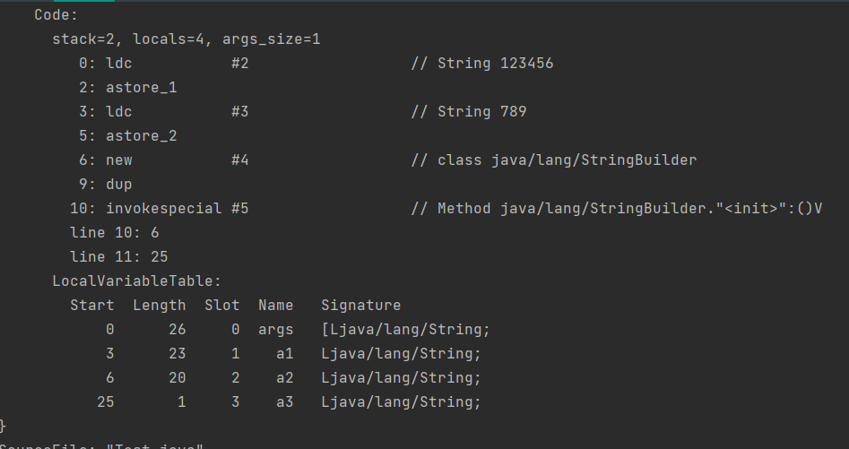
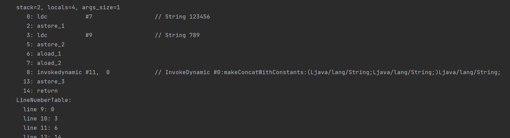
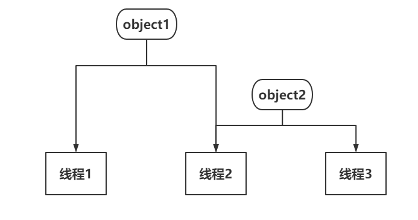

# java 笔记

# 1、基本 / 包装类型

## 1、基本类型

* 整数：int, short, byte, long
* 浮点型：float, double
* 字符：char
* 布尔：boolean

仅对64位Hotspot虚拟机

| 基本类型 | 包装类型 | 长度(单位：字节) | 获取最大/小值方法 | 初始化缓存大小 |
| :--- | :--- | :--- | :--- | :--- |
| byte | java.lang.Byte | 1 | Byte.MAX\_VALUE/Byte.MIN\_VALUE | -(-128) + 127 + 1 = 256 |
| short | java.lang.Short | 2 | Short.MAX\_VALUE/Short.MIN\_VALUE | -(-128) + 127 + 1 = 256 |
| int | java.lang.Integer | 4 | Integer.MAX\_VALUE/Integer.MIN\_VALUE | -(-128) + 127 + 1 = 256 |
| long | java.lang.Long | 8 | Long.MAX\_VALUE/Long.MIN\_VALUE | Math.min(h, Integer.MAX\_VALUE - (-low) -1) = 256（可修改） |
| float | java.lang.Float | 4 | Float.MAX\_VALUE/Float.MIN\_VALUE | 无缓存概念 |
| double | java.lang.Double | 8 | Double.MAX\_VALUE/Double.MIN\_VALUE | 无缓存概念 |
| char | java.lang.Character | 2 | Character.MAX\_VALUE/Character.MIN\_VALUE（Character的MAX\_VALUE = "\uFFFF" 最小值MIN\_VALUE = "\u0000"） | 127 + 1 = 128 |
| boolean | java.lang.Boolean | 1 | Boolean.FALSE/Boolean.TRUE（Boolean没有最大最小值一说，非要比较的话还是对应false为0，true不为0） | 无缓存概念 |

## 2、包装类型

在JDK中整型数值基本都有自己的Cache，在JVM创建时这些类的Cache就被加载到了堆内存中。Byte、Short、Integer、Long的缓存默认都是256，Character由于不存在负数所以是128。浮点和布尔值没有缓存，其中Integer的缓存大小可通过JVM参数修改。

例：-XX:AutoBoxCacheMax=200

最大可到 Integer.MAX\_VALUE - 128 - 1 = 2147483518

```java
public static void main(String[] args) {
    // 调用Integer.ValueOf(127)创建
    Integer a = 127;
    Integer b = 127;
    Integer c = 128;
    Integer d = 128;
    // 使用默认参数，结果为true
    System.out.println(a == b);
    // 使用默认参数，结果为false
    // 添加JVM参数：-XX:AutoBoxCacheMax=200 结果为true
    System.out.println(c == d);
}

// 通过Integer a = 127 形式创建的对象都是隐式的调用了Integer.ValueOf()源码（JDK17）
// 以下为Integer.ValueOf()源码（JDK17）
/**
     * Returns an {@code Integer} instance representing the specified
     * {@code int} value.  If a new {@code Integer} instance is not
     * required, this method should generally be used in preference to
     * the constructor {@link #Integer(int)}, as this method is likely
     * to yield significantly better space and time performance by
     * caching frequently requested values.
     *
     * This method will always cache values in the range -128 to 127,
     * inclusive, and may cache other values outside of this range.
     *
     * @param  i an {@code int} value.
     * @return an {@code Integer} instance representing {@code i}.
     * @since  1.5
*/
@IntrinsicCandidate
public static Integer valueOf(int i) {
    // 创建的值如在缓存中则直接返回，相当于同一对象比较，自然为true
    if (i >= IntegerCache.low && i <= IntegerCache.high)
        return IntegerCache.cache[i + (-IntegerCache.low)];
    return new Integer(i);
}
```

附Integer的Cache源码和AutoBoxCacheMax参数说明：

```java
/**
     * Cache to support the object identity semantics of autoboxing for values between
     * -128 and 127 (inclusive) as required by JLS.
     *
     * The cache is initialized on first usage.  The size of the cache
     * may be controlled by the {@code -XX:AutoBoxCacheMax=<size>} option.
     * During VM initialization, java.lang.Integer.IntegerCache.high property
     * may be set and saved in the private system properties in the
     * jdk.internal.misc.VM class.
     *
     * WARNING: The cache is archived with CDS and reloaded from the shared
     * archive at runtime. The archived cache (Integer[]) and Integer objects
     * reside in the closed archive heap regions. Care should be taken when
     * changing the implementation and the cache array should not be assigned
     * with new Integer object(s) after initialization.
*/

private static class IntegerCache {
    static final int low = -128;
    static final int high;
    static final Integer[] cache;
    static Integer[] archivedCache;

    static {
        // high value may be configured by property
        int h = 127;
        String integerCacheHighPropValue =
            VM.getSavedProperty("java.lang.Integer.IntegerCache.high");
        if (integerCacheHighPropValue != null) {
            try {
                h = Math.max(parseInt(integerCacheHighPropValue), 127);
                // Maximum array size is Integer.MAX_VALUE
                h = Math.min(h, Integer.MAX_VALUE - (-low) -1);
            } catch( NumberFormatException nfe) {
                // If the property cannot be parsed into an int, ignore it.
            }
        }
        high = h;

        // Load IntegerCache.archivedCache from archive, if possible
        CDS.initializeFromArchive(IntegerCache.class);
        int size = (high - low) + 1;

        // Use the archived cache if it exists and is large enough
        if (archivedCache == null || size > archivedCache.length) {
            Integer[] c = new Integer[size];
            int j = low;
            for(int i = 0; i < c.length; i++) {
                c[i] = new Integer(j++);
            }
            archivedCache = c;
        }
        cache = archivedCache;
        // range [-128, 127] must be interned (JLS7 5.1.7)
        // assert默认关闭此行无效，可通过添加-enableassertions或者-ea打开断言
        assert IntegerCache.high >= 127;
    }

    private IntegerCache() {}
}
```

## 3、附注

* 八大包装类型都为final不可继承修改，且都各自实现了Comparable可调用compareTo()方法比较大小
* 当需要将其他类型转换为Integer或者其它包装类型时优先使用类中的ValueOf()方法，虽然ValueOf()本质是调用ParseInt()，但前者多了判断待转换的数是否在缓存中，比起后者效率更高。

# 2、字符串处理

## 1、String

1. JDK8使用char数组进行存储，JDK9开始使用byte数组进行存储并引入coder属性用于判断字符使用Latin1还是utf16编码。
2. Java 6引入了Compressed Strings，对于one byte per character（通常为ASCII表中的字符）使用byte\[]，对于two bytes per character（通常为非ASCII表中的字符）继续使用char\[]；之前可以使用-XX:+UseCompressedStrings来开启，不过在java7被废弃了，然后在java8被移除
3. Java 9引入了Compact Strings来取代Java 6的Compressed Strings，它的实现更过彻底，完全使用byte\[]来替代char\[]，同时新引入了一个字段coder来标识是LATIN1还是UTF16

* COMPACT\_STRINGS默认为true，即该特性默认是开启的
* COMPACT\_STRINGS开启只是让JVM能够通过JIT来判断目标字符串是否能用LATIN1存储，否则只能使用UTF16存储。具体目标是否使用LATIN1存储还是由JIT决定
* coder方法判断COMPACT\_STRINGS为true的话，则返回coder值，否则返回UTF16；isLatin1方法判断COMPACT\_STRINGS为true且coder为LATIN1则返回true
* 诸如charAt、equals、hashCode、indexOf、substring等等一系列方法都依赖isLatin1方法来区分对待是StringLatin1还是StringUTF16

在代码中直接给出的字符串最大长度为65534（JVM编译规范），超过这个值就会报编译失败，而在内存中字符串最大可到2^31（4GB）。byte\[]、char\[]最大刚好为Integer.MAX\_VALUE + 1（数组从0开始）

intern()：

该方法在JDK1.6以前会将当前字符串拷贝至字符串常量池（前提是字符串常量池不存在当前字符串），JDK1.7以后改将当前字符串的引用拷贝至字符串常量池（前提是字符串常量池不存在当前字符串），注意区别。

```java
public static void main(String[] args) {
    String s1 = "s1";
    String s2 = new String("s1");
    // false
    System.out.println(s1 == s2);
    String s3 = s2.intern();
    // true
    System.out.println(s1 == s3);
    String s4 = new String("s4");
    String s5 = "s4";
    // true
    System.out.println(s4.intern() == s5);
    // false 这里查看字节码发现字符串s4是由ldc指令直接从常量池加载（即s4早在调用intern()前就在字符串常量池了）
    System.out.println(s4 == s5);
    String s6 = new String("s6") + new String("s6");
    s6.intern();
    String s7 = "s6s6";
    // 这里不同JDK版本答案不同，JDK1.6以前为false（JDK1.6以前intern()方法会拷贝当前字符串到永久代并返回永久代的引用）s6是栈中对象，s7是永久代对象因此不相等；JDK1.7以后为true，秋娥在于intern()方法不再拷贝字符串而是将当前栈中的字符串引用拷贝至字符串常量池。此时常量池中的引用就是栈中引用因此相等
    System.out.println(s6 == s7);
}
```

valueOf():

valueOf在转换空对象时会返回"null"字符串，因此在对象判空时需要添加"null"字符串的判断。使用String.valueOf()比直接使用toString()更加优秀，原因是前者不会抛出空指针异常，其实在其它包装类的转换要优先使用valueOf方法来避免空指针异常。

## 2、StringBuilder、StringBuffer

1. String类可以可以看作是Java存储字符串的基本类型，当需要处理字符串时：拼接、插入等等操作需要用到StringBuilder，与其形似的类为StringBuffer，二者最大区别在于StringBuffer中的public方法均是线程安全的。
2. StringBuilder底层采用了和String一样的存储类型（JDK1.6以前使用byte\[]，JDK1.7~JDK1.8使用char\[]，JDK9以后均采用byte\[]，同样添加coder属性表明存储是LATIN1还是UTF16）
3. 在Java代码中两个字符串使用的+号拼接一般是转换成StringBuilder对象进行最后在toString()得到最终合并的字符串

```java
public static void main(String[] args) {
    // 1个对象，编译器会优化常量的+操作，a1直接从常量池加载
    String a1 = "123" + "456";
    // 1个对象
    String a2 = "789";
    // 2个对象，a1、会使用new StringBuilder(a1)形式创建再调用append(a2)拼接，最后toString()又会创建一个新类
    String a3 = a1 + a2;
}
```

字符串拼接的字节码指令在JDK8和9以后差别较大

JDK1.8字节码：

一如往常将第一个对象用new StringBuilder()的形式创建再调用append()拼接，最后toString()又隐式创建了一个对象



JDK17字节码：

比起JDK1.8改动相当大，不再显示创建StringBuilder而是调用了一个动态的方法makeConcatWithConstants，对应新增的类：java.lang.invoke.StringConcatFactory

原文：

`This class provides two forms of linkage methods: a simple version (makeConcat(MethodHandles.Lookup, String, MethodType)) using only the dynamic arguments, and an advanced version (makeConcatWithConstants(MethodHandles.Lookup, String, MethodType, String, Object...) using the advanced forms of capturing the constant arguments. The advanced strategy can produce marginally better invocation bytecode, at the expense of exploding the number of shapes of string concatenation methods present at runtime, because those shapes would include constant static arguments as well.`

翻译：

`此类提供了两种形式的链接方法：一种是仅使用动态参数的简单版本（makeConcat（MethodHandles.Lookup，String，MethodType）），另一种是高级版本（makeConcatWithConstants（MethodHandles.Lookup，String，MethodType，String，Object…）使用捕获常量参数的高级形式。高级策略可以产生稍微好一点的调用字节码，但代价是在运行时出现的字符串连接方法的形状数量激增，因为这些形状还包括常量静态参数。`



在toString()方法上两者也有区别，StringBuffer会缓存上次调用的toString()方法值（通过给字段toStringCache赋值实现缓存，任意的修改都会清空缓存），而StringBuilder没有缓存一说。

# 3、List集合

List接口位于java.util包下，父接口是java.lang.Collection，再往上是java.lang.Iterable。

* java.util.RandomAccess

原文：

```java
Marker interface used by List implementations to indicate that they support fast (generally constant time) random access. The primary purpose of this interface is to allow generic algorithms to alter their behavior to provide good performance when applied to either random or sequential access lists.
The best algorithms for manipulating random access lists (such as ArrayList) can produce quadratic behavior when applied to sequential access lists (such as LinkedList). Generic list algorithms are encouraged to check whether the given list is an instanceof this interface before applying an algorithm that would provide poor performance if it were applied to a sequential access list, and to alter their behavior if necessary to guarantee acceptable performance.
It is recognized that the distinction between random and sequential access is often fuzzy. For example, some List implementations provide asymptotically linear access times if they get huge, but constant access times in practice. Such a List implementation should generally implement this interface. As a rule of thumb, a List implementation should implement this interface if, for typical instances of the class, this loop:
       for (int i=0, n=list.size(); i < n; i++)
           list.get(i);
   
runs faster than this loop:
       for (Iterator i=list.iterator(); i.hasNext(); )
           i.next();
   
This interface is a member of the Java Collections Framework.
Since:
1.4
```

翻译：

```java
列表实现所使用的标记接口，用于指示它们支持快速（通常为常数时间）随机访问。该接口的主要目的是允许通用算法在应用于随机或顺序访问列表时改变其行为，以提供良好的性能。
操作随机访问列表（如ArrayList）的最佳算法在应用于顺序访问列表（如LinkedList）时会产生二次行为。鼓励通用列表算法在应用算法之前检查给定列表是否是该接口的实例，如果将该算法应用于顺序访问列表，该算法将提供较差的性能，并在必要时改变其行为，以保证可接受的性能。
人们认识到，随机存取和顺序存取之间的区别往往是模糊的。例如，一些列表实现提供了渐近线性的访问时间，如果它们在实践中获得了巨大但恒定的访问时间。这样的列表实现通常应该实现这个接口。根据经验，对于类的典型实例，实现RandomAccess接口的类使用for循环要快于使用迭代器
```

## 1、Vector

Vector可以看作是线程安全的ArrayList（有关元素修改的public方法均用synchronized修饰），该类实现了RandomAccess接口，底层使用Object\[]，默认初始化容量是10，扩容机制十分简洁，仅在当前容量上加上待添加的元素大小即为扩容后的容量大小（这里add和addAll有部分区别add每次容量增1，而addAll容量增加待添加集合的大小）该类一般很少使用，因此内部实现也较为敷衍。

* 添加元素源码

```java
/**
     * Appends the specified element to the end of this Vector.
     *
     * @param e element to be appended to this Vector
     * @return {@code true} (as specified by {@link Collection#add})
     * @since 1.2
*/
// 对外公开的添加元素方法
public synchronized boolean add(E e) {
    modCount++;
    add(e, elementData, elementCount);
    return true;
} 

/**
     * This helper method split out from add(E) to keep method
     * bytecode size under 35 (the -XX:MaxInlineSize default value),
     * which helps when add(E) is called in a C1-compiled loop.
*/
// 实际添加元素方法
private void add(E e, Object[] elementData, int s) {
    // 如果elementData数组已满
    if (s == elementData.length)
        // 先扩容再添加元素
        elementData = grow();
    elementData[s] = e;
    elementCount = s + 1;
}
```

* 扩容源码

```java
private Object[] grow() {
    // 给的参数是添加元素前的容量 + 1
    return grow(elementCount + 1);
}
/**
     * Increases the capacity to ensure that it can hold at least the
     * number of elements specified by the minimum capacity argument.
     *
     * @param minCapacity the desired minimum capacity
     * @throws OutOfMemoryError if minCapacity is less than zero
*/
// 扩容方法
private Object[] grow(int minCapacity) {
    int oldCapacity = elementData.length;
    // capacityIncrement 默认是0因此增量就是1
    int newCapacity = ArraysSupport.newLength(oldCapacity,
                                              minCapacity - oldCapacity, /* minimum growth */
                                              capacityIncrement > 0 ? capacityIncrement : oldCapacity
                                              /* preferred growth */);
    return elementData = Arrays.copyOf(elementData, newCapacity);
}
```

## 2、ArrayList

ArrayList底层采用Object\[]存储元素，该类实现了RandomAccess接口，默认初始化容量为10，每次扩容为原来的1.5倍（这里仅限调用add方法，当调用addAll方法时首先会扩容1.5倍，当扩容的1.5倍仍不足以存放待添加集合时此时会扩容：当前Object\[]大小 + 待添加集合元素个数）

* 添加元素源码

```java
/**
     * Appends the specified element to the end of this list.
     *
     * @param e element to be appended to this list
     * @return <tt>true</tt> (as specified by {@link Collection#add})
*/
// 对外公开的添加元素方法
public boolean add(E e) {
    // 添加时首先判断是否需要扩容
    ensureCapacityInternal(size + 1);  // Increments modCount!!
    elementData[size++] = e;
    return true;
}
```

* 扩容源码

```java
// 确定容量方法
private void ensureCapacityInternal(int minCapacity) {
    // 首先确认最少需要的容量
    ensureExplicitCapacity(calculateCapacity(elementData, minCapacity));
}
// 计算容量方法
private static int calculateCapacity(Object[] elementData, int minCapacity) {
    // DEFAULTCAPACITY_EMPTY_ELEMENTDATA 就是一个空对象，如果是一个空对象则该ArrayList是以空构造函数创建且未调用过add()
    if (elementData == DEFAULTCAPACITY_EMPTY_ELEMENTDATA) {
        return Math.max(DEFAULT_CAPACITY, minCapacity);
    }
    return minCapacity;
}
// 确定容量方法
private void ensureExplicitCapacity(int minCapacity) {
    modCount++;

    // overflow-conscious code
    // 如果当前数组的容量不足以存放待添加的元素，则需要扩容
    if (minCapacity - elementData.length > 0)
        grow(minCapacity);
}
/**
     * Increases the capacity to ensure that it can hold at least the
     * number of elements specified by the minimum capacity argument.
     *
     * @param minCapacity the desired minimum capacity
*/
// 扩容方法
private void grow(int minCapacity) {
    // overflow-conscious code
    int oldCapacity = elementData.length;
    // 扩容为当前容量的1.5倍
    int newCapacity = oldCapacity + (oldCapacity >> 1);
    // 如果扩容后依旧存放不了待添加的元素，则直接扩容为实际需要的最小元素个数，这里一般只有调用addAll方法猜出触发
    if (newCapacity - minCapacity < 0)
        newCapacity = minCapacity;
    // 校验增量是否溢出
    if (newCapacity - MAX_ARRAY_SIZE > 0)
        newCapacity = hugeCapacity(minCapacity);
    // minCapacity is usually close to size, so this is a win:
    // 元素迁移，底层还是调用System.arraycopy()
    elementData = Arrays.copyOf(elementData, newCapacity);
}
```

## 3、LinkedList

LinkedList底层采用双向链表存储数据存，内部类储结构如下：

```java
// 双向链表
private static class Node<E> {
    E item;
    Node<E> next;
    Node<E> prev;

    Node(Node<E> prev, E element, Node<E> next) {
        this.item = element;
        this.next = next;
        this.prev = prev;
    }
}
```

LinkedList一般用于经常在集合之间添加删除或者移动元素的场景下，比起ArrayList效率更高，ArrayList每次单个元素变动都需要移动剩余的全部元素，而LinkedList一般只用修改前驱和后继节点即可。

* 添加元素源码：

```java
// 对外公开的添加元素方法
public boolean add(E e) {
    linkLast(e);
    return true;
}
// 实际添加元素方法
void linkLast(E e) {
    // 记录尾节点
    final Node<E> l = last;
    // 新增节点
    final Node<E> newNode = new Node<>(l, e, null);
    // 原来的尾节点直接变为新增节点
    last = newNode;
    // 如果原来的链表为空，则头节点和尾节点相同，否则链表的下个节点要是新增的节点
    if (l == null)
        first = newNode;
    else
        l.next = newNode;
    size++;
    modCount++;
}
```

## 4、ArrayDeque

ArrayDeque是双端队列（即可在队列头、尾添加或者删除元素），底层采用Object\[]存储元素。JDK1.8之前默认初始化容量为16，JDK9之后默认初始化容量为17，每次扩容都是2的n次方。可指定初始化容量（必须为2的n次方，即使不是扩容时会自动转换，最小为8）

* 指定容量的构造方法

```java
// 带指定容量的构造方法
public ArrayDeque(int numElements) {
    allocateElements(numElements);
}
// 创建指定容量的构造方法（实际值为2的次幂）
private void allocateElements(int numElements) {
    elements = new Object[calculateSize(numElements)];
}
// 计算阈值方法
private static int calculateSize(int numElements) {
    // 最小不能小于8
    int initialCapacity = MIN_INITIAL_CAPACITY;
    // Find the best power of two to hold elements.
    // Tests "<=" because arrays aren't kept full.
    // 无符号右移加上按位的或操作保证获取到最接近的2的次幂
    if (numElements >= initialCapacity) {
        initialCapacity = numElements;
        initialCapacity |= (initialCapacity >>>  1);
        initialCapacity |= (initialCapacity >>>  2);
        initialCapacity |= (initialCapacity >>>  4);
        initialCapacity |= (initialCapacity >>>  8);
        initialCapacity |= (initialCapacity >>> 16);
        initialCapacity++;

        if (initialCapacity < 0)   // Too many elements, must back off
            initialCapacity >>>= 1;// Good luck allocating 2 ^ 30 elements
    }
    return initialCapacity;
}
```

* 添加元素源码

```java
// 对外公开的addFirst方法
public void addFirst(E e) {
    if (e == null)
        throw new NullPointerException();
    // 计算元素在数组中的存放位置
    elements[head = (head - 1) & (elements.length - 1)] = e;
    if (head == tail)
        doubleCapacity();
}
// 扩容方法（如其名直接扩2倍）
private void doubleCapacity() {
    assert head == tail;
    int p = head;
    int n = elements.length;
    int r = n - p; // number of elements to the right of p
    // 左移一位（相当于x2）即为扩容后的大小
    int newCapacity = n << 1;
    if (newCapacity < 0)
        throw new IllegalStateException("Sorry, deque too big");
    Object[] a = new Object[newCapacity];
    System.arraycopy(elements, p, a, 0, r);
    System.arraycopy(elements, 0, a, r, p);
    elements = a;
    head = 0;
    tail = n;
}
```

* api使用

| | | 头节点 | | 尾节点 |
| --- | --- | :--- | --- | :--- |
| | 抛出异常 | 返回false | 抛出异常 | 返回false |
| 插入 | addFirst(e) | offerFirst(e) | addLast(e) | offerLast(e) |
| 移除 | removeFirst() | pollFirst() | removeLast() | pollLast() |
| 查看 | getFirst() | peekFirst() | getLast() | peekLast() |

ArrayDeque和Queue方法的的对应关系如下：

| 队列方法 | ArrayDeque的等效方法 |
| :--- | :--- |
| add(e) | addLast(e) |
| offer(e) | offerLast(e) |
| remove() | removeFirst() |
| poll() | pollFirst() |
| element() | getFirst() |
| peek() | peekFirst() |

ArrayDeque和Stack方法的对应关系如下：

| 栈方法 | ArrayDeque的等效方法 |
| :--- | :--- |
| push(e) | addFirst(e) |
| pop() | removeFirst() |
| peek() | peekFirst() |

## 5、Stack

Stack继承Vector采用相同的Object\[]存储数据，Stack中的四个方法：push()、pop()、peek()、search()均是线程安全（使用synchronized修饰）

# 4、Map集合

## 1、Hashtable

Hashtable可以看作是线程安全的HashMap（有关元素修改的public方法均使用synchronized修饰），底层使用数组 + 链表（没有红黑树的转换）的形式存储数据。默认初始化容量为11，负载因子为0.75，每次扩容为原数组长度的2倍 + 1，Hashtable的value不允许添加null元素，该类一般很少使用，因此内部实现也较为敷衍，内部类储结构如下：

```java
// 数组
private transient Entry<?,?>[] table;
// 链表
private static class Entry<K,V> implements Map.Entry<K,V> {
        final int hash;
        final K key;
        V value;
        Entry<K,V> next;

        protected Entry(int hash, K key, V value, Entry<K,V> next) {
            this.hash = hash;
            this.key =  key;
            this.value = value;
            this.next = next;
        }
}
```

* 添加元素、扩容源码：

```java
// 对外公开的put方法
public synchronized V put(K key, V value) {
    // Make sure the value is not null
    // value不可为null
    if (value == null) {
        throw new NullPointerException();
    }

    // Makes sure the key is not already in the hashtable.
    Entry<?,?> tab[] = table;
    int hash = key.hashCode();
    //这里直接采用取模的方式定位key在数组中的位置
    int index = (hash & 0x7FFFFFFF) % tab.length;
    @SuppressWarnings("unchecked")
    Entry<K,V> entry = (Entry<K,V>)tab[index];
    //如果key已经存在则遍历链表更新目标元素
    for(; entry != null ; entry = entry.next) {
        if ((entry.hash == hash) && entry.key.equals(key)) {
            V old = entry.value;
            entry.value = value;
            return old;
        }
    }
    //如果key不存在则添加新元素
    addEntry(hash, key, value, index);
    return null;
}
// 实际的添加元素方法
private void addEntry(int hash, K key, V value, int index) {
    Entry<?,?> tab[] = table;
    if (count >= threshold) {
        // Rehash the table if the threshold is exceeded
        // 如果当前容量超过扩容阈值，则进行扩容
        rehash();

        tab = table;
        hash = key.hashCode();
        index = (hash & 0x7FFFFFFF) % tab.length;
    }

    // Creates the new entry.
    @SuppressWarnings("unchecked")
    Entry<K,V> e = (Entry<K,V>) tab[index];
    tab[index] = new Entry<>(hash, key, value, e);
    count++;
    modCount++;
}
// 扩容方法
protected void rehash() {
    int oldCapacity = table.length;
    Entry<?,?>[] oldMap = table;

    // overflow-conscious code
    // 新的数组大小为之前的2倍 + 1
    int newCapacity = (oldCapacity << 1) + 1;
    if (newCapacity - MAX_ARRAY_SIZE > 0) {
        if (oldCapacity == MAX_ARRAY_SIZE)
            // Keep running with MAX_ARRAY_SIZE buckets
            return;
        newCapacity = MAX_ARRAY_SIZE;
    }
    // 直接使用新的容量创建新的数组
    Entry<?,?>[] newMap = new Entry<?,?>[newCapacity];

    modCount++;
    // 重新计算下次扩容阈值
    threshold = (int)Math.min(newCapacity * loadFactor, MAX_ARRAY_SIZE + 1);
    table = newMap;
    // 将原来数组中的元素迁移到新数组中
    for (int i = oldCapacity ; i-- > 0 ;) {
        for (Entry<K,V> old = (Entry<K,V>)oldMap[i] ; old != null ; ) {
            Entry<K,V> e = old;
            old = old.next;

            int index = (e.hash & 0x7FFFFFFF) % newCapacity;
            e.next = (Entry<K,V>)newMap[index];
            newMap[index] = e;
        }
    }
}
```

## 2、HashMap

HashMap底层采用数组 + 链表（数组长度大于等于64，且链表长度大于等于8时，当前链表会转化为红黑树；当前红黑树中的元素个数小于6时又会重新转换为链表），默认初始化容量为16，负载因子为0.75，每次扩容为当前的2倍。在JDK1.7以前HashMap添加元素时直接在链表头部插入，这样在多线程操作时可能造成链表成环（多线程场景下不加锁操作HashMap本就是错误的），在1.8以后改为尾部插入避免此种问题发生。内部类储结构如下：

```java
// 数组
transient Node<K,V>[] table;
// 链表
static class Node<K,V> implements Map.Entry<K,V> {
        final int hash;
        final K key;
        V value;
        Node<K,V> next;

        Node(int hash, K key, V value, Node<K,V> next) {
            this.hash = hash;
            this.key = key;
            this.value = value;
            this.next = next;
        }
}
// 红黑树
static final class TreeNode<K,V> extends LinkedHashMap.Entry<K,V> {
        TreeNode<K,V> parent;  // red-black tree links
        TreeNode<K,V> left;
        TreeNode<K,V> right;
        TreeNode<K,V> prev;    // needed to unlink next upon deletion
        boolean red;
        TreeNode(int hash, K key, V val, Node<K,V> next) {
            super(hash, key, val, next);
        }

        /**
         * Returns root of tree containing this node.
         */
        final TreeNode<K,V> root() {
            for (TreeNode<K,V> r = this, p;;) {
                if ((p = r.parent) == null)
                    return r;
                r = p;
            }
        }
}
```

* 添加元素、扩容源码：

```java
// 对外公开的put方法
public V put(K key, V value) {
    return putVal(hash(key), key, value, false, true);
}
// 实际添加元素方法
final V putVal(int hash, K key, V value, boolean onlyIfAbsent,
               boolean evict) {
    Node<K,V>[] tab; Node<K,V> p; int n, i;
    // JDK1.8以后创建空的HashMap时不会调用构造方法，而是直接创建一个空的Object对象，以下判断是否为第一次添加元素（此时再调用构造方法初始化HashMap）
    if ((tab = table) == null || (n = tab.length) == 0)
        n = (tab = resize()).length;
    //当前元素存放的位置上没有链表时则直接创建新的链表，否则就得遍历插入到链表的末尾
    if ((p = tab[i = (n - 1) & hash]) == null)
        tab[i] = newNode(hash, key, value, null);
    else {
        Node<K,V> e; K k;
        // 如果当前元素刚好是链表的首个元素（hash值和实际值都得相等），此时对应修改
        if (p.hash == hash &&
            ((k = p.key) == key || (key != null && key.equals(k))))
            e = p;
        // 如果当数组位是红黑树则调用红黑树的添加元素方法
        else if (p instanceof TreeNode)
            e = ((TreeNode<K,V>)p).putTreeVal(this, tab, hash, key, value);
        // 都不是则直接插入到链表末尾
        else {
            for (int binCount = 0; ; ++binCount) {
                // 找到末尾节点的上一个节点
                if ((e = p.next) == null) {
                    // 直接把新元素添加到末尾节点（此时新元素已添加完成）
                    p.next = newNode(hash, key, value, null);
                    // 满足首个树化条件（链表长度大于8，这里 - 1 是因为迭代从0开始）
                    if (binCount >= TREEIFY_THRESHOLD - 1) // -1 for 1st
                        // 转为红黑树
                        treeifyBin(tab, hash);
                    break;
                }
                // 已添加完成可以退出循环
                if (e.hash == hash &&
                    ((k = e.key) == key || (key != null && key.equals(k))))
                    break;
                // 继续找下一个
                p = e;
            }
        }
        // 第一个if （如果当前元素刚好是链表的首个元素）
        if (e != null) { // existing mapping for key
            // 保存下旧值用作返回
            V oldValue = e.value;
            if (!onlyIfAbsent || oldValue == null)
                // 修改原来的值
                e.value = value;
            // 此处用于服务LinkedHashMap
            afterNodeAccess(e);
            return oldValue;
        }
    }
    ++modCount;
    if (++size > threshold)
        resize();
    // 此处用于服务LinkedHashMap
    afterNodeInsertion(evict);
    return null;
}
// 扩容方法
final Node<K,V>[] resize() {
    Node<K,V>[] oldTab = table;
    int oldCap = (oldTab == null) ? 0 : oldTab.length;
    int oldThr = threshold;
    int newCap, newThr = 0;
    // 计算扩容后的容量（已经初始化过的HashMap -> 调用过add方法）
    if (oldCap > 0) {
        if (oldCap >= MAXIMUM_CAPACITY) {
            threshold = Integer.MAX_VALUE;
            return oldTab;
        }
        // oldCap << 1 直接x2
        else if ((newCap = oldCap << 1) < MAXIMUM_CAPACITY &&
                 oldCap >= DEFAULT_INITIAL_CAPACITY)
            // 阈值也要扩充2倍
            newThr = oldThr << 1; // double threshold
    }
    // 这个容量是16 -> 默认值（给了阈值但没给容量）
    else if (oldThr > 0) // initial capacity was placed in threshold
        newCap = oldThr;
    // 默认初始化（第一次调用add方法）
    else {               // zero initial threshold signifies using defaults
        newCap = DEFAULT_INITIAL_CAPACITY;
        newThr = (int)(DEFAULT_LOAD_FACTOR * DEFAULT_INITIAL_CAPACITY);
    }
    // 计算新的阈值（第二个 else if 里面没有计算新的阈值）
    if (newThr == 0) {
        float ft = (float)newCap * loadFactor;
        newThr = (newCap < MAXIMUM_CAPACITY && ft < (float)MAXIMUM_CAPACITY ?
                  (int)ft : Integer.MAX_VALUE);
    }
    threshold = newThr;
    @SuppressWarnings({"rawtypes","unchecked"})
    // 直接以新的容量创建数组
    Node<K,V>[] newTab = (Node<K,V>[])new Node[newCap];
    // 替换原来的容器
    table = newTab;
    if (oldTab != null) {
        for (int j = 0; j < oldCap; ++j) {
            Node<K,V> e;
            if ((e = oldTab[j]) != null) {
                oldTab[j] = null;
                // 如果当前位置的链表仅有一个元素则直接复制
                if (e.next == null)
                    newTab[e.hash & (newCap - 1)] = e;
                // 如果是红黑树则使用红黑树的方式复制
                else if (e instanceof TreeNode)
                    ((TreeNode<K,V>)e).split(this, newTab, j, oldCap);
                // 下面是超过一个元素的链表（因为容量变大了，hash & 数组长度 会发生改变）
                else { // preserve order
                    // 这里的两组引用分别代表loHead -> 扩容后依旧在原位的Node hiHead -> 扩容后在新位的的Node
                    Node<K,V> loHead = null, loTail = null;
                    Node<K,V> hiHead = null, hiTail = null;
                    Node<K,V> next;
                    do {
                        next = e.next;
                        if ((e.hash & oldCap) == 0) {
                            if (loTail == null)
                                loHead = e;
                            else
                                loTail.next = e;
                            loTail = e;
                        }
                        else {
                            if (hiTail == null)
                                hiHead = e;
                            else
                                hiTail.next = e;
                            hiTail = e;
                        }
                    } while ((e = next) != null);
                    // 依旧存放在原位
                    if (loTail != null) {
                        loTail.next = null;
                        newTab[j] = loHead;
                    }
                    // 由于扩容是2倍，因此新的位置 = 原位置 + 原数组长度
                    if (hiTail != null) {
                        hiTail.next = null;
                        newTab[j + oldCap] = hiHead;
                    }
                }
            }
        }
    }
    return newTab;
}
// 红黑树化方法
final void treeifyBin(Node<K,V>[] tab, int hash) {
    int n, index; Node<K,V> e;
    // 第二个限定条件：当前数组的元素个数如果不足64则直接扩容（前提条件是链表长度大于8）
    if (tab == null || (n = tab.length) < MIN_TREEIFY_CAPACITY)
        resize();
    // 转化为红黑树
    else if ((e = tab[index = (n - 1) & hash]) != null) {
        TreeNode<K,V> hd = null, tl = null;
        // do...while 循环将链表元素添加到红黑树上
        do {
            TreeNode<K,V> p = replacementTreeNode(e, null);
            if (tl == null)
                hd = p;
            else {
                p.prev = tl;
                tl.next = p;
            }
            tl = p;
        } while ((e = e.next) != null);
        if ((tab[index] = hd) != null)
            // 之前的循环只是把链表元素添加到树上，这里才开始构造红黑树
            hd.treeify(tab);
    }
}
```

## 3、HashSet

实际使用的时HashMap的key，添加重复元素时原值会被覆盖。具体看构造方法：

```java
/**
     * Constructs a new, empty set; the backing {@code HashMap} instance has
     * default initial capacity (16) and load factor (0.75).
*/
public HashSet() {
    map = new HashMap<>();
}
```

## 4、TreeMap

TreeMap底层直接使用了红黑树的实现，添加重复元素时原值会被覆盖。允许对key进行定制排序（可在构造方法上传递比较器进行定制排序）。具体看构造方法：

```java
private transient Entry<K,V> root;

static final class Entry<K,V> implements Map.Entry<K,V> {
    K key;
    V value;
    Entry<K,V> left;
    Entry<K,V> right;
    Entry<K,V> parent;
    boolean color = BLACK;

    /**
         * Make a new cell with given key, value, and parent, and with
         * {@code null} child links, and BLACK color.
    */
    Entry(K key, V value, Entry<K,V> parent) {
        this.key = key;
        this.value = value;
        this.parent = parent;
    }
}
```

## 5、TreeSet

TreeSet本质还是TreeMap，添加重复元素时原值会被覆盖。允许对key进行定制排序（可在构造方法上传递比较器进行定制排序）。具体看构造方法：

```java
/**
     * Constructs a new, empty tree set, sorted according to the
     * natural ordering of its elements.  All elements inserted into
     * the set must implement the {@link Comparable} interface.
     * Furthermore, all such elements must be <i>mutually
     * comparable</i>: {@code e1.compareTo(e2)} must not throw a
     * {@code ClassCastException} for any elements {@code e1} and
     * {@code e2} in the set.  If the user attempts to add an element
     * to the set that violates this constraint (for example, the user
     * attempts to add a string element to a set whose elements are
     * integers), the {@code add} call will throw a
     * {@code ClassCastException}.
*/
public TreeSet() {
    this(new TreeMap<>());
}
```

## 6、LinkedHashMap

LinkedHashMap可以看作是 HashMap + 双向链表，为了使得HashMap变得可以有序访问，增加了双向链表来记录节点的添加顺序。内部类储结构如下：

```java
/**
     * The head (eldest) of the doubly linked list.
*/
transient LinkedHashMap.Entry<K,V> head;

/**
     * The tail (youngest) of the doubly linked list.
*/
transient LinkedHashMap.Entry<K,V> tail;

/**
     * HashMap.Node subclass for normal LinkedHashMap entries.
*/
static class Entry<K,V> extends HashMap.Node<K,V> {
    Entry<K,V> before, after;
    Entry(int hash, K key, V value, Node<K,V> next) {
        super(hash, key, value, next);
    }
}
```

维护链表主要使用三个方法

* afterNodeRemoval

```java
// 移除节点
void afterNodeRemoval(Node<K,V> e) { // unlink
    LinkedHashMap.Entry<K,V> p =
        (LinkedHashMap.Entry<K,V>)e, b = p.before, a = p.after;
    // 将移除的节点前后指向都清空
    p.before = p.after = null;
    // 如果前驱节点为空，则后继节点直接变为头节点
    if (b == null)
        head = a;
    // 否则前驱节点指向后继节点（这是双向链表）
    else
        b.after = a;
    // 如果后继节点为空，则后继节点直接变为尾节点
    if (a == null)
        tail = b;
    // 否则后继节点指向前驱节点（这是双向链表）
    else
        a.before = b;
}
```

* afterNodeInsertion（基本不会执行）

```java
// 改方法基本不会执行
void afterNodeInsertion(boolean evict) { // possibly remove eldest
    LinkedHashMap.Entry<K,V> first;
    // removeEldestEntry(first)默认返回false，所以afterNodeInsertion这个方法其实并不会执行
    if (evict && (first = head) != null && removeEldestEntry(first)) {
        K key = first.key;
        removeNode(hash(key), key, null, false, true);
    }
}

/**
     * Returns {@code true} if this map should remove its eldest entry.
     * This method is invoked by {@code put} and {@code putAll} after
     * inserting a new entry into the map.  It provides the implementor
     * with the opportunity to remove the eldest entry each time a new one
     * is added.  This is useful if the map represents a cache: it allows
     * the map to reduce memory consumption by deleting stale entries.
     *
     * <p>Sample use: this override will allow the map to grow up to 100
     * entries and then delete the eldest entry each time a new entry is
     * added, maintaining a steady state of 100 entries.
     * 
<pre>
     *     private static final int MAX_ENTRIES = 100;
     *
     *     protected boolean removeEldestEntry(Map.Entry eldest) {
     *        return size() &gt; MAX_ENTRIES;
     *     }
     * </pre>
     *
     * <p>This method typically does not modify the map in any way,
     * instead allowing the map to modify itself as directed by its
     * return value.  It <i>is</i> permitted for this method to modify
     * the map directly, but if it does so, it <i>must</i> return
     * {@code false} (indicating that the map should not attempt any
     * further modification).  The effects of returning {@code true}
     * after modifying the map from within this method are unspecified.
     *
     * <p>This implementation merely returns {@code false} (so that this
     * map acts like a normal map - the eldest element is never removed).
     *
     * @param    eldest The least recently inserted entry in the map, or if
     *           this is an access-ordered map, the least recently accessed
     *           entry.  This is the entry that will be removed it this
     *           method returns {@code true}.  If the map was empty prior
     *           to the {@code put} or {@code putAll} invocation resulting
     *           in this invocation, this will be the entry that was just
     *           inserted; in other words, if the map contains a single
     *           entry, the eldest entry is also the newest.
     * @return   {@code true} if the eldest entry should be removed
     *           from the map; {@code false} if it should be retained.
*/
protected boolean removeEldestEntry(Map.Entry<K,V> eldest) {
    return false;
}
```

* afterNodeAccess

```java
// 在节点被访问后根据accessOrder判断是否需要调整链表顺序
void afterNodeAccess(Node<K,V> e) { // move node to last
    LinkedHashMap.Entry<K,V> last;
    // 如果accessOrder为false，什么都不做
    if (accessOrder && (last = tail) != e) {
        // p指向待删除元素，b执行前驱，a执行后驱
        LinkedHashMap.Entry<K,V> p =
            (LinkedHashMap.Entry<K,V>)e, b = p.before, a = p.after;
        // 这里执行双向链表删除操作
        p.after = null;
        if (b == null)
            head = a;
        else
            b.after = a;
        if (a != null)
            a.before = b;
        else
            last = b;
        // 这里执行将p放到尾部
        if (last == null)
            head = p;
        else {
            p.before = last;
            last.after = p;
        }
        tail = p;
        ++modCount;
    }
}
```

## 7、LinkedHashSet

LinkedHashSet，直接继承自HashSet。具体看构造方法：

```java
/**
     * Constructs a new, empty linked hash set with the default initial
     * capacity (16) and load factor (0.75).
*/
public LinkedHashSet() {
    super(16, .75f, true);
}
```

# 5、wait / notify

Object类作为Java中所有类的父类，该类中包含三个用于多线程协作的方法，以下三个方法必须在  synchronized 代码块中才能使用。

* wait()

该方法调用后当前线程将持续等待直到被 notify / notifyAll 方法唤醒（唤醒后将继续执行）。它有2个重载方法，需要携带超时时间（在指定超时时间后将自动被唤醒，也可提前使用 notify/notifyAll 方法唤醒）。wait方法将立即释放线程获取的锁以及CPU资源（Thread.sleep() 仅释放CPU资源不释放锁）。

* notify() / notyfyAll()

notify 方法调用后将唤醒一个正处于wait状态下的线程（必须持有相同的对象监视器），唤醒顺序按照先进先出 FIFO，而 notyfyAll 方法将唤醒全部处于wait状态下的线程（必须持有相同的对象监视器），唤醒顺序按照先进后出 FILO，这里无论是 notify 还是 notyfyAll 执行后都不会立即释放CPU资源而是要等到 synchronized 代码块执行结束后才会被释放。

以下是一道经典面试题：使用 wait / notify 实现 100 以内的奇、偶数交替打印，实现如下：

```java
class Test {
    public static int i = 0;
    public static Object object = new Object();
    public static void main(String[] args) {
        Thread[] t = new Thread[3];
        Thread t1 = new Thread(()-> {
            while (i < 100000) {
                synchronized (object) {
                    try {
                        object.wait();
                        while (!Thread.State.WAITING.equals(t[2].getState())) {
                            object.wait(1);
                        }
                        System.out.println("t2：B" + i++);
                        object.notify();
                    } catch (Exception e) {
                    }
                }
            }
        });
        Thread t2 = new Thread(() -> {
            while (i < 100000) {
                synchronized (object) {
                    try {
                        while (!Thread.State.WAITING.equals(t[1].getState())) {
                            object.wait(1);
                        }
                        System.out.println("t1：A" + i++);
                        object.notify();
                        object.wait();
                    } catch (Exception e) {
                    }
                }
            }
        });
        t[1] = t1;
        t[2] = t2;
        t1.start();	
        t2.start();
    }
}
```

现在有3个（甚至更多）线程，依旧使用 wait / notify 实现一次输出0~100至控制台。

解决方案：既然2个线程可用 wait / notify 交替输出，那么把3个线程当作2个线程问题即可解决，将线程1视为1个整体，2、3视为一个整体。此时需要两个对象监视器分别为object1、object2，object1控制1、2，object2控制2，3。具体如图所示：



一个循环流程如下表：

| 时刻 | t1线程状态 | t2线程状态 | t3线程状态 |
| :--- | :--- | :--- | :--- |
| `0` | `runing` | `wait(object1)` | `wait(object2)` |
| `1` | `nofity(object1)` | `wait(object1)` | `wait(object2)` |
| `2` | `wait(object1)` | `runing` | `wait(object2)` |
| `3` | `wait(object1)` | `notify(object2)` | `wait(object2)` |
| `4` | `wait(object1)` | `wait(object2)` | `runing` |
| `5` | `wait(object1)` | `wait(object2)` | `notify(object2)` |
| `6` | `wait(object1)` | `notify(object1)` | `wait(object2)` |
| `7` | `runing` | `wait(object1)` | `wait(object2)` |

代码如下：

```java
class test {
    public static int i = 0;
    public static Object object1 = new Object();
    public static Object object2 = new Object();
    public static void main(String[] args) {
        Thread[] t = new Thread[4];
        Thread t1 = new Thread(()-> {
            while (i < 10000) {
                synchronized (object2) {
                    try {
                        object2.wait();
                        System.out.println("t3：" + i++);
                        while (!Thread.State.WAITING.equals(t[2].getState())) {
                            object2.wait(1);
                        }
                        object2.notify();
                    } catch (Exception e) {
                    }
                }
            }
        });
        Thread t2 = new Thread(()-> {
            while (i < 10000) {
                synchronized (object1) {
                    try {
                        object1.wait();
                        synchronized (object2) {
                            System.out.println("t2：" + i++);
                            while (!Thread.State.WAITING.equals(t[1].getState())) {
                                object2.wait(1);
                            }
                            object2.notify();
                            object2.wait();
                        }
                        while (!Thread.State.WAITING.equals(t[3].getState())) {
                            object1.wait(1);
                        }
                        object1.notify();
                    } catch (Exception e) {
                    }
                }
            }
        });
        Thread t3 = new Thread(()-> {
            while (i < 10000) {
                synchronized (object1) {
                    try {
                        System.out.println("t1：" + i++);
                        while (!Thread.State.WAITING.equals(t[2].getState())) {
                            object1.wait(1);
                        }
                        object1.notify();
                        object1.wait();
                    } catch (Exception e) {
                    }
                }
            }
        });
        t[1] = t1;
        t[2] = t2;
        t[3] = t3;
        t3.start();
        t2.start();
        t1.start();
    }
}
```

# 6、volatile

volatile 关键字主要用于设置轻量级的锁，volatile 可保证整个对象的原子性和可见性（即对象上使用，对整个对象都是全局可见的），该关键字主要有以下两个作用：

* 防止JVM进行指令重排序

该特性可在双重 check 的单例模式中体现：

```java
import java.io.Serial;
import java.io.Serializable;

/**
 * @author haochuliu
 */

class Singleton implements Serializable,Cloneable {
    @Serial
    private static final long serialVersionUID = -1811990712618852923L;
    //这里声明为volatile是因为21行代码不是原子的，可能会先分配了空间再执行对象初始化，此时如果有另一个线程也来获取对象则会获取对象成功却调用失败的情况
    private static volatile Singleton instance;

    private Singleton() {
    }

    public static Singleton getInstance() {
        if (null == instance) {
            synchronized (Singleton.class) {
                if (null == instance) {
                    instance = new Singleton();
                }
            }
        }
        return instance;
    }

    @Serial
    private Object readResolve(){
        throw new RuntimeException("禁止序列化生成对象");
    }

    @Override
    public Singleton clone() {
        throw new RuntimeException("禁止clone生成对象");
    }
}

public class Test {
    public static void main(String[] args) {
        Singleton instance1 = Singleton.getInstance();
        Singleton instance2 = Singleton.getInstance();
        System.out.println(instance1 == instance2);
    }
}
```

* 强制从主存中读取被修饰的变量数据

该特性可在以下代码体现：

```java
// loop不使用 volatile 修饰，该方法运行后将进入死循环
public class Test {
    // public static volatile int loop = 0;
    public static int loop = 0;
    public static void main(String[] args) {
        new Thread(() -> {
            try {
                Thread.sleep(500);
            } catch (InterruptedException e) {
                e.printStackTrace();
            }
            loop = 1;
            System.out.println("loop = 1");
        }).start();
        System.out.println("begin loop");
        while (loop != 1) { }
        System.out.println("end loop");
    }
}
```

# 7、CAS / AQS

## 1、CAS

CAS 即 compare and swap 多用于 Java 的并发包下（java.util.concurrent），原子类就是其中的代表。CAS 实现原理相对（AQS）简单，CAS 有三个操作数：内存值 V、旧的预期值 A、要修改的值 B，当且仅当预期值 A 和内存值 V 相同时，将内存值修改为 B 并返回 true ，否则什么都不做并返回 false 。但要使用CAS 就会遇到以下几个方面的问题：

* ABA 问题

即一个变量在多线程情况下被一个线程从A改成了B，同时又被另一个线程从B改回了A，但此时调用者感知不到A被修改了（存在问题）。ABA问题的解决思路就是使用版本号。在变量前面追加上版本号，每次变量更新的时候把版本号加一。

从 Java1.5 开始 JDK 的 atomic 包里提供了一个类 AtomicStampedReference 来解决ABA问题。这个类的 compareAndSet 方法作用是首先检查当前引用是否等于预期引用，并且当前标志是否等于预期标志，如果全部相等，则以原子方式将该引用和该标志的值设置为给定的更新值。

* 循环时间长开销大

自旋 CAS 如果长时间不成功，会给 CPU 带来非常大的执行开销。如果 JVM 能支持处理器提供的 pause 指令那么效率会有一定的提升，pause 指令有两个作用，第一它可以延迟流水线执行指令（de-pipeline）,使 CPU 不会消耗过多的执行资源，延迟的时间取决于具体实现的版本，在一些处理器上延迟时间是零。第二它可以避免在退出循环的时候因内存顺序冲突（memory order violation）而引起CPU流水线被清空（CPU pipeline flush），从而提高 CPU 的执行效率。

* 只能保证一个共享变量的原子操作

当对一个共享变量执行操作时，可以使用循环CAS的方式来保证原子操作，但是对多个共享变量操作时，循环CAS就无法保证操作的原子性，这个时候就可以用锁，或者有一个取巧的办法，就是把多个共享变量合并成一个共享变量来操作。比如有两个共享变量 i＝2 , j=a ，合并一下 ij = 2a，然后用 CAS 来操作 ij 。从Java1.5 开始 JDK 提供了 AtomicReference 类来保证引用对象之间的原子性，你可以把多个变量放在一个对象里来进行 CAS 操作。

## 2、AQS

AQS 即抽象队列同步器 AbstractQueuedSynchronizer ，AQS 定义了一套多线程访问共享资源的同步器框架，许多同步类实现都依赖于它，如常用的 ReentrantLock / Semaphore / CountDownLatch/ ThreadPoolExecutor...

它维护了一个 volatile int state（代表共享资源）和一个 FIFO 线程等待队列（多线程争用资源被阻塞时会进入此队列）。state 的访问方式有三种:

1. getState() 获取当前同步状态
2. setState() 设置当前同步状态
3. compareAndSetState() 使用 CAS 设置当前状态，该方法能保证状态的原子性

AQS 定义两种资源共享方式：Exclusive（独占，只有一个线程能执行，如 ReentrantLock）和 Share（共享，多个线程可同时执行，如 Semaphore / CountDownLatch）。

不同的自定义同步器争用共享资源的方式也不同。自定义同步器在实现时只需要实现共享资源 state 的获取与释放方式即可，至于具体线程等待队列的维护（如获取资源失败入队/唤醒出队等），AQS 已经在顶层实现好了。
