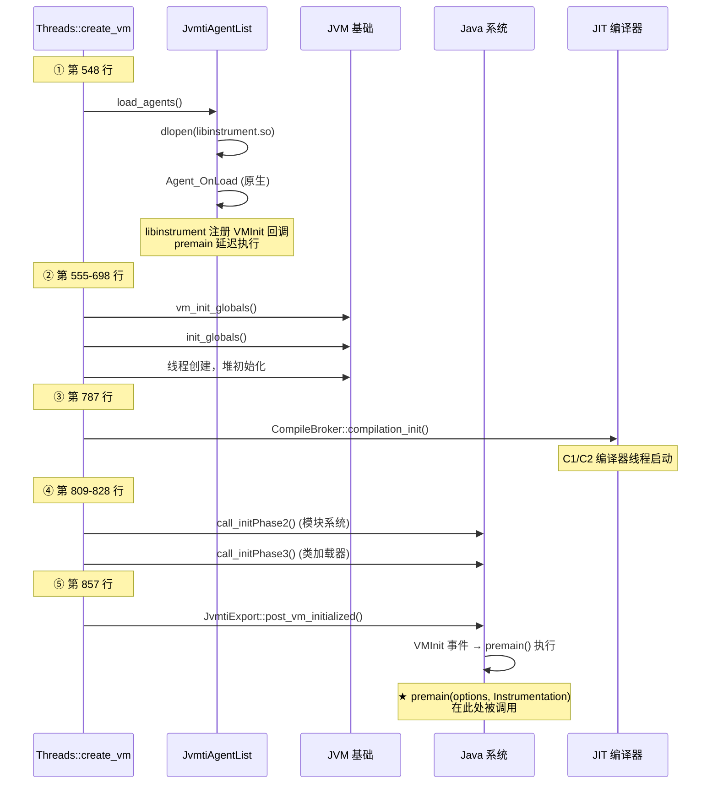
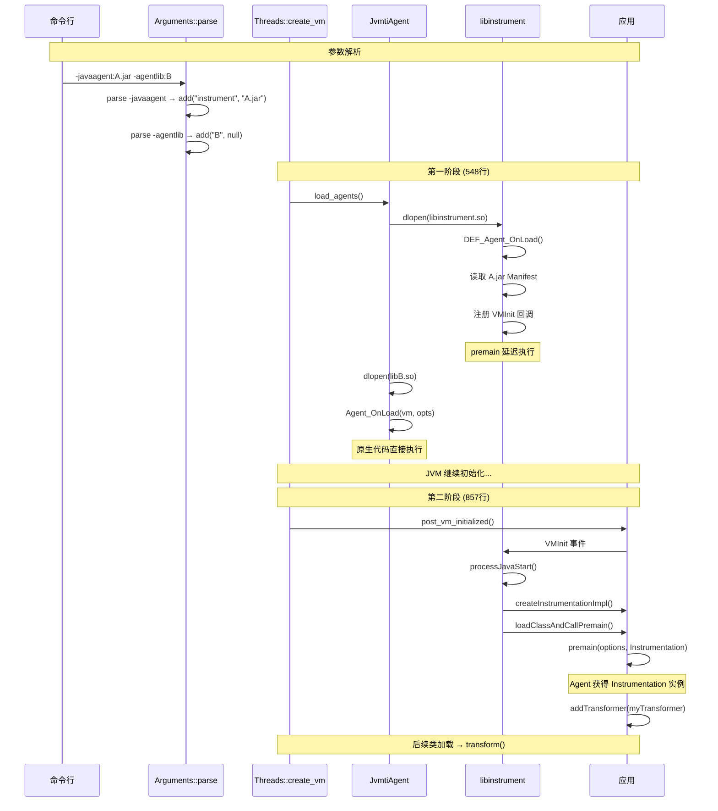

# JavaAgent 与 AgentLib 加载全流程分析

> 上次修改：2026-06-06 15:30
> 基于 OpenJDK 26 GA 版本源码分析
> 分析范围：命令行解析 → JVM 初始化 → Agent 加载 → premain/agentmain 执行 → JIT 编译

## 重点关注
- [ ] `-agentlib:` / `-agentpath:` 和 `-javaagent:` 的参数解析差异
- [ ] 代理加载的两阶段时间线 (Agent_OnLoad → VMInit → premain)
- [ ] `-javaagent` 的 JPLIS 桥接机制
- [ ] 多 Agent 加载顺序保证
- [ ] Agent Java 代码的 JIT 编译优化可达 Level 4
- [ ] 完整流程图

## 第一部分: JavaAgent 与 AgentLib 的加载全流程

---

## 一、命令行参数解析阶段

### 1.1 解析入口

JVM 启动时，`Arguments::parse()` 在 `arguments.cpp` 中处理命令行参数。

#### 1.1.1 `-agentlib:` 和 `-agentpath:` 解析 (arguments.cpp:2309-2342)

```cpp
} else if (match_option(option, "-agentlib:", &tail) ||
      (is_absolute_path = match_option(option, "-agentpath:", &tail))) {
```

| 选项 | `is_absolute_path` | 说明 |
|------|-------------------|------|
| `-agentlib:name[=options]` | `false` | 在标准库路径中查找 `libname.so`/`name.dll` |
| `-agentpath:/path/lib.so[=options]` | `true` | 直接使用给定的完整路径加载 |

处理逻辑:
1. 将 `tail` 按 `=` 分割为 `name` 和 `options` 两部分
2. 检查是否为 JDWP 调试代理，如果是则设置 `_has_jdwp_agent = true`
3. 调用 `JvmtiAgentList::add(name, options, is_absolute_path)` 将代理加入全局列表

#### 1.1.2 `-javaagent:` 解析 (arguments.cpp:2343-2361)

```cpp
} else if (match_option(option, "-javaagent:", &tail)) {
    JvmtiAgentList::add("instrument", options, false);  // name 固定为 "instrument"
    if (!create_numbered_module_property("jdk.module.addmods", "java.instrument", _addmods_count++)) {
        return JNI_ENOMEM;
    }
}
```

**关键区别:**
- `-javaagent:` **始终**以 `name = "instrument"` 添加代理
- 同时确保 `--add-modules java.instrument`，保证 `java.instrument` 模块可用
- `is_absolute_path = false`（通过标准库路径查找）

---

## 二、JvmtiAgent 数据结构

### 2.1 核心数据结构 (jvmtiAgent.hpp/cpp)

```cpp
class JvmtiAgent {
    const char* _name;             // 库名，如 "jdwp", "instrument"
    const char* _options;          // 选项字符串
    void*       _os_lib;           // 已加载共享库的句柄 (dlopen handle)
    const void* _jplis;            // JPLIS 代理指针（仅 instrument lib）
    bool        _absolute_path;
    bool        _static_lib;
    bool        _instrument_lib;   // 是否为 instrument 库
    bool        _dynamic;          // 是否通过 Attach API 动态加载
    bool        _xrun;
    bool        _loaded;
};
```

### 2.2 全局代理列表 (jvmtiAgentList.cpp)

```cpp
class JvmtiAgentList {
    static JvmtiAgent* _head;  // 链表头指针（AtomicAccess 安全并发）

    static void add(const char* name, const char* options, bool absolute_path);
    Iterator agents();       // 排除 XRUN
    Iterator java_agents();  // 仅 JPLIS (javaagent)
    Iterator native_agents();// 仅原生代理
};
```

---

## 三、JVM 初始化序列 — 代理加载时间线

### 3.1 核心序列 (threads.cpp — Threads::create_vm())

代理的加载分布在 JVM 初始化的多个时间点：



**关键时间点**:

| 时序 | 行号 | 事件 | 说明 |
|------|------|------|------|
| ① | 548 | `load_agents()` | 加载原生代理 + libinstrument，调用 `Agent_OnLoad` |
| ② | 555-698 | 基础初始化 | vm_init_globals, init_globals, 核心 Java 类 |
| ③ | 787 | `compilation_init()` | **C1/C2 编译器线程启动** |
| ④ | 809-828 | 模块系统 | initPhase2 (模块), initPhase3 (类加载器) |
| ⑤ | 857 | `post_vm_initialized()` | **VMInit 事件 → premain()** |

---

## 四、`JvmtiAgentList::load_agents()` 详细调用链

### 4.1 完整调用链

```
Threads::create_vm() 第 548 行
  └── JvmtiAgentList::load_agents()
       ├── convert_xrun_agents()
       │   └── -Xrun: 查找 JVM_OnLoad，未找到则转为 Agent_OnLoad
       │
       ├── JvmtiPhaseTransition → phase: ONLOAD
       │
       └── load_agents(Iterator 排除 _xrun)
            └── 遍历所有代理
                 └── 每个调用 agent->load()
                      └── JvmtiAgent::load():
                           if (is_xrun())       → invoke_JVM_OnLoad()
                           if (is_dynamic())    → invoke_Agent_OnAttach()
                           else                 → invoke_Agent_OnLoad()
```

### 4.2 invoke_Agent_OnLoad() 内部流程

```
invoke_Agent_OnLoad(agent)
  │
  ├── lookup_Agent_OnLoad_entry_point(agent)
  │   ├── load_agent_from_executable()         // 先检查静态链接
  │   │   └── os::find_builtin_agent()
  │   │
  │   └── (如果静态链接未找到)
  │       └── load_library(agent)
  │           ├── agent->is_absolute_path() ?
  │           │   ├── YES → load_agent_from_absolute_path()
  │           │   │       └── os::dll_load(agent->name())
  │           │   │
  │           │   └── NO  → load_agent_from_relative_path()
  │           │           ├── os::dll_locate_live(dll_dir, name)
  │           │           └── os::dll_build_name(libpath, name)
  │           │
  │           └── agent->set_os_lib(library)
  │
  ├── os::find_agent_function(agent, false, "Agent_OnLoad")
  │   └── dlsym(library, "Agent_OnLoad")
  │
  └── (*on_load_entry)(&main_vm, agent->options(), nullptr)
```

---

## 五、`-javaagent` 的两阶段加载（JPLIS 桥接）

### 5.1 第一阶段：Agent_OnLoad（早期，第 548 行）

`-javaagent:myagent.jar=opts` 在参数解析时创建：
```
JvmtiAgent {
    _name           = "instrument"
    _options        = "myagent.jar=opts"
    _absolute_path  = false
    _instrument_lib = true
}
```

当 `invoke_Agent_OnLoad()` 调用该代理时，它加载的是 `libinstrument.so`（JPLIS 库），而非用户 JAR。

**`DEF_Agent_OnLoad()` 执行 (InvocationAdapter.c:146-289):**

```
DEF_Agent_OnLoad(vm, "myagent.jar=opts", NULL)
  │
  ├── parseArgumentTail() → jarfile = "myagent.jar", options = "opts"
  │
  ├── createNewJPLISAgent(vm, &agent, jarfile)  // 创建 JPLISAgent 结构体
  │
  ├── readAttributes(jarfile)                    // 读取 MANIFEST.MF
  │
  ├── getAttribute(attributes, "Premain-Class")
  │   └── premainClass = "com.example.MyAgent"
  │
  ├── getAttribute(attributes, "Boot-Class-Path")
  │   └── appendBootClassPath()  // 注册 JVMTI AddToBootstrapClassLoaderSearch
  │
  ├── convertCapabilityAttributes(attributes, agent)
  │   ├── Can-Redefine-Classes    → addRedefineClassesCapability()
  │   ├── Can-Retransform-Classes → retransformableEnvironment()
  │   └── Can-Set-Native-Method-Prefix → addNativeMethodPrefixCapability()
  │
  └── 注册 JVMTI 事件回调:
      SetEventCallbacks(vm, eventHandlerVMInit)     // 注册 VMInit 回调
      SetEventNotificationMode(ENABLE, VM_INIT)     // 启用 VMInit 事件
```

此时 **premain 不会被执行**，只是注册了回调。

### 5.2 第二阶段：VMInit 事件触发（后期，第 857 行）

```
JvmtiExport::post_vm_initialized()
  │
  └── eventHandlerVMInit(jvmtiEnv, jniEnv, thread)  // InvocationAdapter.c
       │
       ├── appendClassPath(agent, jarfile)
       │   └── JVMTI AddToSystemClassLoaderSearch(jarfile)
       │
       └── processJavaStart(agent, jniEnv)  // JPLISAgent.c:390-441
            │
            ├── createInstrumentationImpl(jniEnv, agent)
            │   ├── FindClass "sun/instrument/InstrumentationImpl"
            │   ├── new InstrumentationImpl(nativeAgent, redefineAdded, ...)
            │   └── agent->mInstrumentationImpl = impl
            │
            ├── setLivePhaseEventHandlers(agent)
            │   └── 设置 ClassFileLoadHook 回调（替换 VMInit 回调）
            │
            └── startJavaAgent(agent, jniEnv,
                                agent->mAgentClassName,
                                agent->mOptionsString,
                                agent->mPremainCaller)
                 └── invokeJavaAgentMainMethod(jnienv, ...)
                      └── CallVoidMethod(InstrumentationImpl,
                              loadClassAndCallPremain, "com.example.MyAgent", "opts")
```

### 5.3 Java 侧执行 (InstrumentationImpl.java:481-548)

```
InstrumentationImpl.loadClassAndCallPremain(classname, optionsString)
  │
  └── loadClassAndStartAgent("com.example.MyAgent", "premain", "opts")
       │
       ├── ClassLoader.getSystemClassLoader().loadClass("com.example.MyAgent")
       │   └── 加载 agent 类（首次加载时可能触发 ClassFileLoadHook）
       │
       ├── javaAgentClass.getDeclaredMethod("premain", String.class, Instrumentation.class)
       │   └── 找不到时尝试 getDeclaredMethod("premain", String.class)
       │
       └── premain(optionsString, this)   // 调用 agent 的 premain 方法
```

### 三维评估：JPLIS 两阶段设计

#### 这样实现的好处
- **Java 就绪后执行 premain**：确保 `InstrumentationImpl`、类加载器等 Java 基础设施完全可用
- **原生代码在早期执行**：`Agent_OnLoad` 在 JVM 未初始化时即可执行，符合原生代理需求
- **JVMTI 回调机制**：利用已有的 JVMTI 事件体系，无需额外框架

#### 是否有更好的方案
- **单阶段 Java agent**：在 JVM 完全初始化后一次性加载所有 agent，但无法利用早期 JVMTI 功能
- **纯 Java agent 框架**：不依赖 libinstrument 原生代码，纯 Java 实现，但无法提前注册 JVMTI 事件
- **直接嵌入 InstrumentationImpl**：JPLIS 作为中间层增加复杂度，但提供了统一的字节码增强 API

#### 不这么实现的问题
- **两阶段增加复杂度**：Agent_OnLoad 和 premain 的时序分离增加了调试难度
- **依赖 libinstrument.so**：必须有一个原生层桥接，Java agent 无法脱离 JPLIS
- **VMInit 事件延迟**：如果 JVM 初始化耗时较长，premain 的触发时间相应延迟

---

## 六、动态代理加载（Attach API）

### 6.1 动态加载流程

```
JvmtiAgentList::load_agent(name, is_absolute_path, options, st)
  │
  ├── 检查 phase == JVMTI_PHASE_LIVE (只能在 LIVE 阶段进行)
  │
  ├── 创建 JvmtiAgent { _dynamic = true }
  │
  └── agent->load(st)
       └── invoke_Agent_OnAttach(agent, st)
            │
            ├── 检查 EnableDynamicAgentLoading
            ├── load_agent_from_executable(agent)  // 检查静态链接
            │   └── 或 load_library(agent)          // 加载共享库
            ├── (*on_attach_entry)(&main_vm, agent->options(), nullptr)
            └── 如果是 instrument 库:
                └── convert_to_jplis(agent)
```

### 6.2 动态 javaagent 的 agentmain

动态加载 `-javaagent` 时:
1. 读取 JAR `MANIFEST.MF` 的 **`Agent-Class`** 属性（而非 Premain-Class）
2. 调用 `loadClassAndCallAgentmain()` 而非 `loadClassAndCallPremain()`
3. Agent 的 `agentmain(String, Instrumentation)` 方法被调用

---

## 七、多个 Agent 的加载顺序

### 7.1 顺序保证

**`JvmtiAgentList::add()` 在链表末尾插入新代理（使用无锁 CAS 追加到尾部）:**

```cpp
void JvmtiAgentList::add(JvmtiAgent* agent) {
    JvmtiAgent** tail_ptr = &_head;
    while (true) {
        JvmtiAgent* next = AtomicAccess::load(tail_ptr);
        if (next == nullptr) {
            if (AtomicAccess::cmpxchg(tail_ptr, nullptr, agent) != nullptr) {
                continue;  // 有其他线程并发添加，重试
            }
            break;
        }
        tail_ptr = &next->_next;
    }
}
```

```
java -javaagent:A.jar -javaagent:B.jar -agentlib:C -agentpath:D.so
                          ↓
               JvmtiAgentList: [A, B, C, D] (保持命令行顺序)
                          ↓
               iterate:  A → B → C → D (加载顺序)
```

---

## 八、JavaAgent 与 AgentLib 的区别总结

### 对比表

| 方面 | `-javaagent:jar[=options]` | `-agentlib:name[=options]` |
|------|--------------------------|---------------------------|
| **库名** | `"instrument"`（固定） | 用户指定的 `name` |
| **加载的共享库** | `libinstrument.so` (JPLIS) | `libname.so` |
| **入口函数** | `libinstrument` 的 `Agent_OnLoad` | 用户库的 `Agent_OnLoad` |
| **Agent_OnLoad 时机** | 第 548 行（早期） | 第 548 行（早期） |
| **premain/agentmain 时机** | VMInit 事件（第 857 行，晚期） | 不适用 |
| **调用 Java 代码** | 是（通过 JPLIS 桥接） | 否（纯原生 C/C++） |
| **JAR 清单解析** | 是（Premain/Agent-Class 等） | 否 |
| **ClassFileTransformer** | 支持（通过 Instrumentation API） | 需要手写 JVMTI 回调 |
| **动态加载入口** | Agent_OnAttach → agentmain() | Agent_OnAttach |

### 架构对比图

```
-agentlib:jdwp                          -javaagent:myagent.jar
    │                                        │
    ▼                                        ▼
os::dll_load("libjdwp.so")               os::dll_load("libinstrument.so")
    │                                        │
    ▼                                        ▼
Agent_OnLoad(vm, opts, NULL)             DEF_Agent_OnLoad(vm, "myagent.jar=opts", NULL)
    │                                        │
    │ [直接初始化 JDWP]                      │ 解析 JAR manifest
    │                                        │ 注册 VMInit 回调
    │                                        │
    │                                        ▼ (VM 继续初始化...)
    │                                        │
    │                                   VMInit 事件回调
    │                                        │
    │                                   InstrumentationImpl 创建
    │                                   Agent 类加载
    │                                   premain(options, inst) 调用
```

  - java
  - hotspot
  - jvm
tags:
---

## 九、Agent 代码的 JIT 编译优化分析

### 9.1 编译器初始化时机

**关键**: JIT 编译器在 premain **之前**就已经初始化完成。

```
Threads::create_vm() 时序:
  Line 787: CompileBroker::compilation_init()  ← C1/C2 编译器线程启动
  Line 857: JvmtiExport::post_vm_initialized() ← premain 执行
  Line 925: return JNI_OK                      ← 返回 JavaMain
```

### 9.2 编译层级定义

```cpp
enum CompLevel : s1 {
    CompLevel_none              = 0,    // 解释器
    CompLevel_simple            = 1,    // C1，无 profiling
    CompLevel_limited_profile   = 2,    // C1，仅有调用/回边计数器
    CompLevel_full_profile      = 3,    // C1，完整 profiling (MDO)
    CompLevel_full_optimization = 4,    // C2 或 JVMCI
};
```

### 9.3 默认编译路径

```
Level 0 (解释器)
  → Level 3 (C1 full profile)    ← initial_compile_level() 默认
    → Level 4 (C2 full opt)       ← 调用计数达到 Tier4 阈值
```

### 9.4 关键结论

```
Agent Java 代码可以被优化到最高层级:

最大优化级别 = CompLevel_full_optimization = 4 (C2 或 JVMCI 编译)

前提条件：
1. JDK 在服务端模式下运行（默认，包含 C2 编译器）
2. TieredCompilation = true（默认）
3. Agent 方法被足够频繁地调用
4. 方法大小未超过 C2 的编译大小限制
```

**影响因素**:

| 因素 | 影响 | 说明 |
|------|------|------|
| 调用频率 | 决定是否触发升级编译 | `transform()` 调用次数多 → Level 4 |
| 方法大小 | 超过 C2 限制只能到 Level 1 | |
| TieredCompilation | 关闭后只有 Level 4 | 最大性能但启动更慢 |
| CompileThreshold | 决定升级阈值 | 默认 Tier3:200, Tier4:5000 |

## 完整流程图



## 关键源码文件索引

| 文件路径 | 关键内容 | 行号 |
|---------|---------|------|
| `src/hotspot/share/runtime/arguments.cpp` | `-agentlib:/-agentpath:` 解析 | 2309-2342 |
| `src/hotspot/share/runtime/arguments.cpp` | `-javaagent:` 解析 | 2343-2361 |
| `src/hotspot/share/runtime/threads.cpp` | `Threads::create_vm()` 初始化序列 | 450-918 |
| `src/hotspot/share/runtime/threads.cpp` | `JvmtiAgentList::load_agents()` 调用 | 548 |
| `src/hotspot/share/prims/jvmtiAgent.hpp` | `JvmtiAgent` 类定义 | 34-86 |
| `src/hotspot/share/prims/jvmtiAgent.cpp` | `invoke_Agent_OnLoad()` 原生加载 | 591-614 |
| `src/hotspot/share/prims/jvmtiAgentList.cpp` | `JvmtiAgentList::load_agents()` | 179-187 |
| `src/hotspot/share/prims/jvmtiAgentList.cpp` | `JvmtiAgentList::add()` CAS 链表添加 | 99-117 |
| `src/hotspot/share/prims/jvmtiExport.cpp` | `post_vm_initialized()` 事件分发 | 754-788 |
| `src/hotspot/share/compiler/compilerDefinitions.hpp` | `CompLevel` 枚举 | 55-64 |
| `src/hotspot/share/compiler/compilationPolicy.cpp` | `initial_compile_level()` | 725-742 |
| `src/java.instrument/share/native/libinstrument/InvocationAdapter.c` | `DEF_Agent_OnLoad()` | 145-289 |
| `src/java.instrument/share/native/libinstrument/InvocationAdapter.c` | `eventHandlerVMInit()` | 595-630 |
| `src/java.instrument/share/native/libinstrument/JPLISAgent.c` | `processJavaStart()` | 390-441 |
| `src/java.instrument/share/classes/sun/instrument/InstrumentationImpl.java` | `loadClassAndCallPremain()` | 551-557 |
