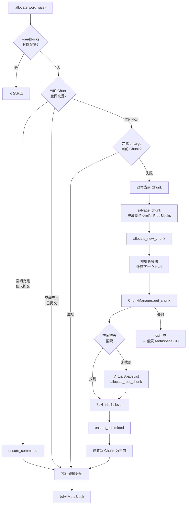
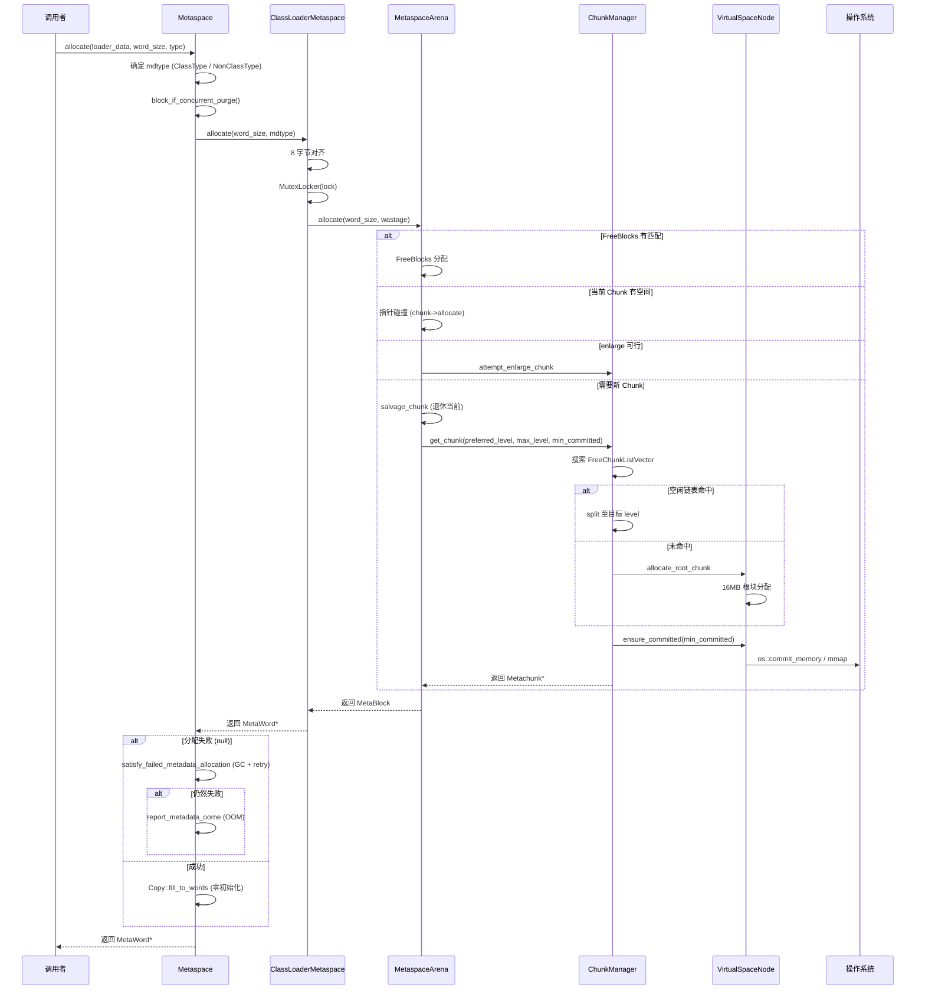

# Arena 分配与完整分配路径

> 上次修改：2026-06-06 15:30
> 本文档对应源码目录：`src/hotspot/share/memory/metaspace/`

## 重点关注
- [ ] ClassLoaderMetaspace — CLD 到 Arena 的桥梁
- [ ] MetaspaceArena — 核心分配器（Chunk 链表 + FreeBlocks）
- [ ] ArenaGrowthPolicy — 三种类加载器各自的增长策略
- [ ] 完整分配路径走读（从 `Metaspace::allocate` 到指针碰撞）
- [ ] 分配失败时的 GC 重试逻辑

## 1. ClassLoaderMetaspace — 顶层分配入口

**源文件**: `src/hotspot/share/memory/classLoaderMetaspace.hpp`

```cpp
class ClassLoaderMetaspace : public CHeapObj<mtClass> {
  Mutex* const _lock;                                   // CLD 持有的锁
  const Metaspace::MetaspaceType _space_type;            // 空间类型
  metaspace::MetaspaceArena* _non_class_space_arena;     // 非类 Arena
  metaspace::MetaspaceArena* _class_space_arena;         // 类 Arena (可能为 null)
};
```

**关系**:

```
ClassLoaderData (CLD)
  └─ ClassLoaderMetaspace
       ├─ _non_class_space_arena  → MetaspaceArena
       │    └─ MetaspaceContext::context_nonclass()
       │         ├─ VirtualSpaceList (可扩展)
       │         └─ ChunkManager
       │
       └─ _class_space_arena  → MetaspaceArena  (如果 UseCompressedClassPointers)
            └─ MetaspaceContext::context_class()
                 ├─ VirtualSpaceList (固定大小)
                 └─ ChunkManager
```

## 2. MetaspaceArena — 核心分配器

**源文件**: `src/hotspot/share/memory/metaspace/metaspaceArena.hpp`

```cpp
class MetaspaceArena : public CHeapObj<mtClass> {
  const size_t _allocation_alignment_words;     // 对齐粒度
  ChunkManager* const _chunk_manager;           // Chunk 获取来源
  const ArenaGrowthPolicy* const _growth_policy; // 增长策略
  MetachunkList _chunks;                        // Chunk 链表 (头 = 当前 Chunk)
  FreeBlocks* _fbl;                             // 提前释放块的管理器 (按需创建)
  SizeAtomicCounter* const _total_used_words_counter; // 指向全局已用计数器
  const char* const _name;
};
```

**典型 Arena 状态**:

```
MetaspaceArena
  │
  │ _chunks (MetachunkList)
  │
  │  当前 Chunk (头)          退休 Chunk #1        退休 Chunk #2
  │  ┌────────────────┐      ┌──────────────┐    ┌──────────────┐
  │  │ 使用中          │ ←---│ 满载 (退休)    │ ←--│ 满载 (退休)    │
  │  │ ┌──────┬──────┐│      │ ┌────────────┐│    │ ┌────────────┐│
  │  │ │ used │ free ││      │ │   used     ││    │ │   used     ││
  │  │ └──────┴──────┘│      │ └────────────┘│    │ └────────────┘│
  │  └────────────────┘      └──────────────┘    └──────────────┘
  │
  │ _fbl (FreeBlocks, 可选)
  │  ┌────┐  ┌────┐  ┌────┐
  │  │块A  │→│块B  │→│块C  │  ← 提前解分配的块
  │  └────┘  └────┘  └────┘
```

### 分配方法 `allocate()`

```cpp
MetaBlock MetaspaceArena::allocate(size_t word_size, MetaBlock& wastage);
```

**内部逻辑**:



### 退休当前 Chunk (`salvage_chunk`)

当当前 Chunk 空间不足时，将其中剩余的、已提交但未使用的内存提取为一个 MetaBlock，加入 `_fbl`:

```cpp
MetaBlock MetaspaceArena::salvage_chunk(Metachunk* c) {
  const size_t remaining_words = c->free_below_committed_words();
  if (remaining_words >= FreeBlocks::MinWordSize) {
    MetaWord* ptr = c->allocate(remaining_words);
    return MetaBlock(ptr, remaining_words);
  }
  return MetaBlock();  // 没有剩余
}
```

### 增长策略 (next_chunk_level)

```cpp
chunklevel_t MetaspaceArena::next_chunk_level() const {
  const int growth_step = _chunks.count();
  return _growth_policy->get_level_at_step(growth_step);
}
```

每次新 Chunk 的大小由 `ArenaGrowthPolicy` 决定，基于已分配的 Chunk 数量。

---

## 3. ArenaGrowthPolicy — 增长策略

**源文件**: `src/hotspot/share/memory/metaspace/metaspaceArenaGrowthPolicy.cpp`

不同类加载器类型使用不同的增长序列：

### 标准类加载器 (StandardMetaspaceType)

| 步骤 | 非类空间 | 类空间 |
|------|---------|--------|
| 1 | 4K | 2K |
| 2 | 4K | 2K |
| 3 | 4K | 4K |
| 4 | 8K | 8K |
| 5 | 16K | 16K |
| 6+ | (重复 16K) | (重复 16K) |

### Boot 类加载器 (BootMetaspaceType)

| 步骤 | 非类空间 | 类空间 |
|------|---------|--------|
| 1 | 4M | 256K |
| 2 | 1M | (重复) |
| 3+ | (重复 1M) | |

### 匿名/类镜像持有者 (ClassMirrorHolderMetaspaceType)

| 步骤 | 非类空间 | 类空间 |
|------|---------|--------|
| 1 | 1K | 1K |
| 2+ | (重复 1K) | (重复 1K) |

### 三维评估：差异化增长策略

#### 这样实现的好处
- **Boot 类加载器大块起步**：预期加载大量类 → 初始 4M 非类空间 + 256K 类空间，减少 Chunk 翻倍次数和系统调用
- **匿名类加载器最小起步**：Lambda 和反射通常只加载 1~2 个类 → 初始 1K，避免浪费
- **标准类加载器渐进增长**：从 2K/4K 开始逐步增大至 16K 封顶，兼顾小应用和大应用

#### 是否有更好的方案
- **统一 4K 起步**：简单但 Boot 类加载器性能差（需 10+ 次 Chunk 翻倍）
- **完全动态策略**：根据实际分配历史自动调整，但实现复杂且难以预测
- **静态一次性分配**：每个 ClassLoaderMetaspace 预先分配估计大小，但浪费严重

#### 不这么实现的问题
- **Boot 类加载器如果起步太小**：频繁 Chunk 翻倍导致启动性能下降
- **标准类加载器如果起步太大**：小应用或短暂类加载器大量浪费内存
- **无增长策略**：所有分配都 4K 起步，启动时间可能增加 10%+

---

## 4. FreeBlocks — 提前释放块管理

当元数据对象被提前解分配（例如内联缓存清理），其占用的空间被记录在 `FreeBlocks` 中，使用一种简单二叉树结构管理。

```cpp
class FreeBlocks : public CHeapObj<mtMetaspace> {
  BlockTree _tree;     // 基于大小的块树
};
```

Arena 分配时优先从这些空闲块中分配，然后再尝试指针碰撞。

---

## 5. 完整分配路径

### 外部调用: Metaspace::allocate()

**源文件**: `src/hotspot/share/memory/metaspace.cpp` line 874

```cpp
MetaWord* Metaspace::allocate(ClassLoaderData* loader_data,
                               size_t word_size,
                               MetaspaceObj::Type type,
                               TRAPS) {
  // 1. 确定元数据类型
  MetadataType mdtype = (type == MetaspaceObj::ClassType) ? ClassType : NonClassType;

  // 2. 如果有并发卸载正在发生, 等待
  MetaspaceCriticalAllocation::block_if_concurrent_purge();

  // 3. 委托给 ClassLoaderMetaspace
  MetaWord* result = loader_data->metaspace_non_null()->allocate(word_size, mdtype);

  // 4. 分配失败 → 触发 GC + 重试
  if (result == nullptr && is_init_completed()) {
    result = Universe::heap()->satisfy_failed_metadata_allocation(
               loader_data, word_size, mdtype);
  }

  // 5. 仍然失败 → OOM 报告
  if (result == nullptr) {
    report_metadata_oome(loader_data, word_size, type, mdtype, THREAD);
    return nullptr;
  }

  // 6. 零初始化
  Copy::fill_to_words((HeapWord*)result, word_size, 0);
  return result;
}
```

### 完整路径总结



```
Metaspace::allocate(loader_data, word_size, type)
  │
  ├─ MetaspaceCriticalAllocation::block_if_concurrent_purge()
  │    (等待可能的并发 Metaspace 卸载)
  │
  ├─ ClassLoaderMetaspace::allocate(word_size, mdType)
  │    ├─ align_up(word_size, min_allocation_alignment)  // 8 字节对齐
  │    ├─ MutexLocker(lock)  // CLD 级别锁定
  │    │
  │    ├─ 选择 Arena:
  │    │   ClassType + 有类空间 → class_space_arena
  │    │   其他               → non_class_space_arena
  │    │
  │    └─ MetaspaceArena::allocate(word_size, wastage)
  │         ├─ 1. 尝试 FreeBlocks 回收
  │         ├─ 2. 当前 Chunk 指针碰撞
  │         │    └─ chunk->allocate(word_size)  // O(1), 无锁
  │         ├─ 3. 空间不足 → attempt_enlarge_current_chunk()
  │         │    └─ ChunkManager::attempt_enlarge_chunk()
  │         │         └─ VirtualSpaceNode::attempt_enlarge_chunk()
  │         ├─ 4. 仍不足 → 退休当前, 分配新 Chunk
  │         │    └─ allocate_new_chunk()
  │         │         └─ ChunkManager::get_chunk(preferred_level, max_level, min_committed)
  │         │              ├─ 搜索空闲链表: FreeChunkListVector
  │         │              ├─ 未找到 → VirtualSpaceList::allocate_root_chunk()
  │         │              │    └─ VirtualSpaceNode::allocate_root_chunk()
  │         │              │         └─ RootChunkArea::alloc_root_chunk_header()
  │         │              │            + ChunkHeaderPool::allocate_chunk_header()
  │         │              ├─ split() 至目标 level
  │         │              ├─ ensure_committed(min_committed_words)
  │         │              │    └─ VirtualSpaceNode::commit_range()
  │         │              │         └─ os::commit_memory() 或 mmap()
  │         │              └─ 返回 Metachunk*
  │         └─ 在新 Chunk 上 allocate()
  │
  ├─ 分配失败 → 触发 GC + 重试
  │    └─ Universe::heap()->satisfy_failed_metadata_allocation()
  │
  ├─ 仍然失败 → report_metadata_oome() (OutOfMemoryError)
  │
  └─ 成功 → Copy::fill_to_words(result, word_size, 0)  // 零初始化
       → 返回 MetaWord*
```

### 三维评估：6 级分配退化路径

#### 这样实现的好处
- **最快路径 O(1)**：指针碰撞分配是单一加法指令，无锁
- **渐进退化**：从最快到最慢逐步降级，正常情况下仅使用前 2~3 级
- **Arena 本地优先**：FreeBlocks 和当前 Chunk 操作完全无锁（在 CLD 锁保护下）
- **GC 是最后手段**：避免不必要的 Full GC

#### 是否有更好的方案
- **使用 TLAB 风格**：每个线程一个 Metaspace 分配缓冲区，减少锁竞争
- **无锁分配**：使用原子 bump pointer，消除 CLD 级别锁，但增加 ABA 问题处理复杂度
- **Batched 分配**：批量获取一组 Chunk，减少 ChunkManager 交互

#### 不这么实现的问题
- **CLD 锁竞争**：多线程并发分配同类元数据时（如 Lambda 生成），CLD 锁可能成为瓶颈
- **Arena 内存碎片**：退休 Chunk 的剩余空间可能永远无法被使用（尤其是非类空间）
- **GC 路径慢**：触发 Metaspace GC 涉及 Full GC，毫秒级暂停

  - java
  - hotspot
  - jvm
tags:
---

## 6. MetaspaceObj::Type 类型

**源文件**: `src/hotspot/share/oops/metaspaceObj.hpp` (枚举定义)

```cpp
class MetaspaceObj {
 public:
  enum Type {
    ClassType,              // Klass/InstanceKlass → 类空间
    SymbolType,             // Symbol
    TypeArrayType,          // 基本类型数组
    ObjArrayType,           // 对象数组
    MethodType,             // Method
    ConstMethodType,        // ConstMethod
    MethodDataType,         // MethodData
    ConstantPoolType,       // ConstantPool
    ConstantPoolCacheType,  // ConstantPoolCache
    AnnotationType,         // Annotation
    MethodCountersType,     // MethodCounters
    ...
    number_of_types
  };
};
```

**分配规则**: `ClassType` → 类空间 (如果启用)，其他所有 → 非类空间。

## 引用代码索引

以下代码块中的引用文件路径使用**相对路径**（相对于工程根目录）:
- `src/hotspot/share/memory/classLoaderMetaspace.hpp` — ClassLoaderMetaspace 定义
- `src/hotspot/share/memory/metaspace/metaspaceArena.hpp` — MetaspaceArena 定义
- `src/hotspot/share/memory/metaspace/metaspaceArenaGrowthPolicy.cpp` — ArenaGrowthPolicy 增长策略
- `src/hotspot/share/memory/metaspace/metaspaceArenaGrowthPolicy.hpp` — 增长策略头文件
- `src/hotspot/share/memory/metaspace.cpp` — Metaspace::allocate() 入口
- `src/hotspot/share/oops/metaspaceObj.hpp` — MetaspaceObj::Type 枚举
