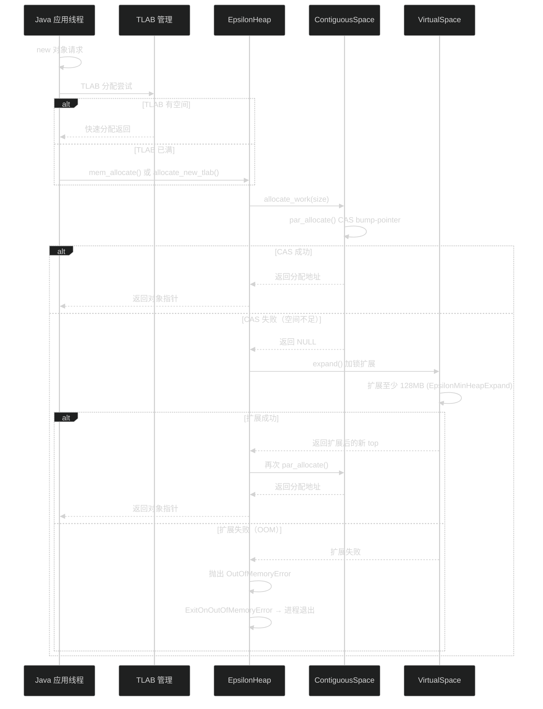
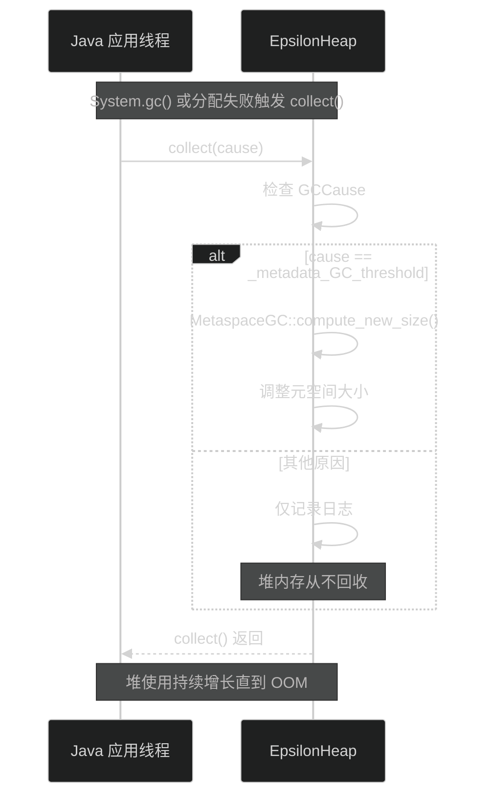
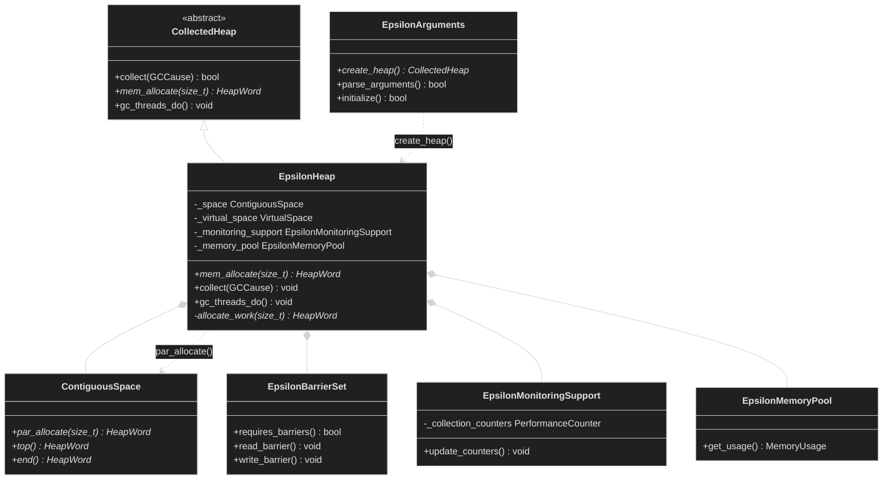

# Epsilon GC

> 生成日期：2026-06-14 20:16
> 数据来源：JDK 26 Epsilon GC 源码分析

---

## 重点关注

- [ ] EpsilonHeap::allocate_work 中 TLAB 分配 → CAS bump-pointer → 加锁扩展的三级分配路径
- [ ] EpsilonBarrierSet 全部空实现下 JIT 编译器如何完全省略屏障代码（requires_barriers 返回 false）
- [ ] ExitOnOutOfMemoryError=true 默认策略在生产环境外的适用边界
- [ ] EpsilonArguments 中弹性 TLAB（EpsilonElasticTLAB）的衰减策略工作原理
- [ ] collect() 无操作实现中仅对 `_metadata_GC_threshold` 原因的 MetaspaceGC 处理逻辑

---

## 功能概述

Epsilon GC 是 JDK 中一个"无操作"（No-Op）垃圾回收器。它处理内存分配，但**完全不执行任何内存回收**。当堆内存耗尽时，默认直接退出进程（`ExitOnOutOfMemoryError=true`）。它用于性能测试、内存压力测试和极短生命周期的应用场景。

主要特征：
- **只分配不回收**：从未触发 GC 回收堆内存
- **CAS Bump-Pointer**：`ContiguousSpace::par_allocate()` 无锁快速路径
- **空屏障集**：`EpsilonBarrierSet` 全部为空实现，JIT 完全省略屏障代码
- **无 GC 线程**：`gc_threads_do()` 实现为空
- **弹性 TLAB**：基于线程活跃度的自适应 TLAB 大小调整和衰减

---

## 核心概念

### 1. EpsilonHeap — 堆容器

**定义**：Epsilon GC 的堆实现，使用单个 `ContiguousSpace` 连续空间。

**作用**：
- 管理唯一的 `ContiguousSpace` 和底层 `VirtualSpace`
- 实现 `allocate_work()` 三级分配路径
- `collect()` 仅处理元空间阈值，从不回收堆内存

**三维评估**：

| 维度 | 评估 |
|------|------|
| 好处 | 极简堆结构，分配路径最短，运行开销为零 |
| 替代方案 | 有回收能力的堆；引入 GC 暂停 |
| 风险 | 堆空间持续增长至 OOM，不适用于长期运行应用 |

### 2. EpsilonArguments — 工厂方法

**定义**：Epsilon GC 的参数解析与堆工厂类。

**作用**：
- 实现 `create_heap()` 返回 `EpsilonHeap` 实例
- 配置 `ExitOnOutOfMemoryError=true`（默认）
- 处理弹性 TLAB 相关参数（`EpsilonMaxTLABSize`、`EpsilonTLABElasticity` 等）

**三维评估**：

| 维度 | 评估 |
|------|------|
| 好处 | 轻量参数解析，无额外配置依赖 |
| 替代方案 | 集中式参数工厂；但 Epsilon 参数极少 |
| 风险 | ExitOnOutOfMemoryError 默认退出可能导致用户困惑 |

### 3. EpsilonBarrierSet — 空屏障集

**定义**：Epsilon 的屏障集，所有屏障方法均为空实现。

**作用**：
- 没有读屏障、写屏障、SATB 屏障、卡表屏障
- `requires_barriers()` 返回 `false`
- JIT 编译器在代码生成时完全省略屏障相关指令

**三维评估**：

| 维度 | 评估 |
|------|------|
| 好处 | 零运行时屏障开销，应用分配吞吐量最高 |
| 替代方案 | ZGC/Shenandoah 的读/写屏障；运行时开销 ~5-15% |
| 风险 | 无屏障意味着无法执行任何形式的并发 GC |

### 4. EpsilonMonitoringSupport — 计数器

**定义**：Epsilon 的性能监控支持，提供堆使用统计计数器。

**作用**：
- `update_counters()` 更新容量、使用量、已提交内存等指标
- 支撑 JMX `MemoryMXBean` 的内存池查询
- 仅提供统计功能，不参与 GC 决策

**三维评估**：

| 维度 | 评估 |
|------|------|
| 好处 | 极简监控实现，不影响运行时性能 |
| 替代方案 | 更复杂的监控框架；增加维护成本 |
| 风险 | 监控数据量有限，缺乏 GC 相关统计 |

---

## 关键流程

### 分配流程

### 收集流程

---

## 类继承关系

---

## 三维评估表

| 维度 | 好处 | 替代方案 | 风险 |
|------|------|----------|------|
| 分配吞吐量 | 最高（零屏障开销 + CAS bump-pointer） | 任何有回收能力的 GC | 堆不回收，OOM 是必然结果 |
| 运行时开销 | 零 GC 线程，零屏障，零标记/扫描 | Shenandoah/ZGC 屏障 ~5-15% | 无 GC 意味着无法从内存压力中恢复 |
| 可预测性 | 分配行为完全确定，无 GC 暂停 | G1 停顿预测模型 | ExitOnOOM 导致进程终止不可恢复 |
| 实现简单 | 代码量少，无复杂同步 | Full GC 实现数万行 | 简单的代价是功能缺失 |
| 调试/测试 | 消除 GC 干扰，精确测量分配性能 | 生产 GC：增加了 GC 噪声 | 与生产环境行为差异大 |

  - java
  - hotspot
  - jvm
tags:
---

## 核心文件说明

| 文件路径 | 核心类/结构 | 功能描述 |
|----------|------------|---------|
| `src/hotspot/share/gc/epsilon/epsilonHeap.hpp` | `EpsilonHeap` | Epsilon GC 堆，管理 ContiguousSpace 和分配逻辑 |
| `src/hotspot/share/gc/epsilon/epsilonArguments.hpp` | `EpsilonArguments` | Epsilon 参数解析和堆工厂类 |
| `src/hotspot/share/gc/epsilon/epsilonBarrierSet.hpp` | `EpsilonBarrierSet` | 空屏障集（所有屏障为空实现） |
| `src/hotspot/share/gc/epsilon/epsilonMonitoringSupport.hpp` | `EpsilonMonitoringSupport` | 性能计数器支持 |
| `src/hotspot/share/gc/epsilon/epsilonMemoryPool.hpp` | `EpsilonMemoryPool` | JMX 内存池管理 |
| `src/hotspot/share/gc/epsilon/epsilon_globals.hpp` | `Epsilon_Globals` | Epsilon 命令行参数定义 |
| `src/hotspot/share/gc/epsilon/epsilonThreadLocalData.hpp` | `EpsilonThreadLocalData` | 线程本地 TLAB 数据 |
| `src/hotspot/share/gc/epsilon/epsilonInitLogger.hpp` | `EpsilonInitLogger` | 初始化日志输出 |
