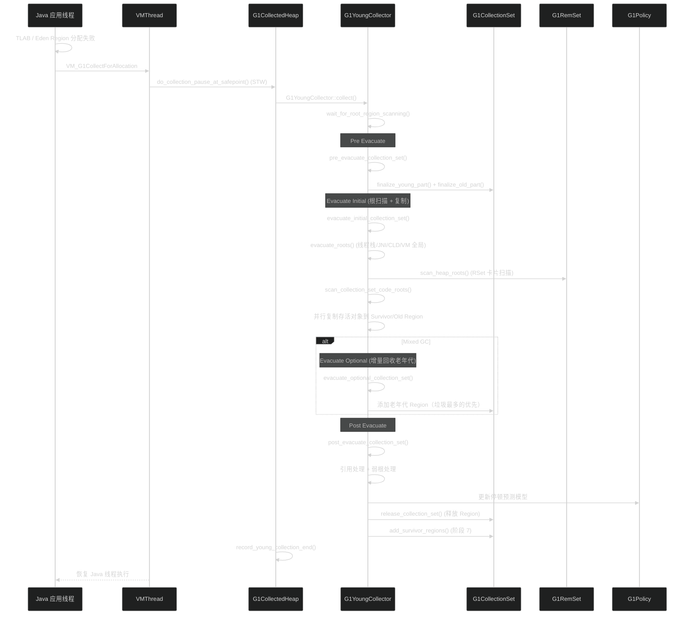
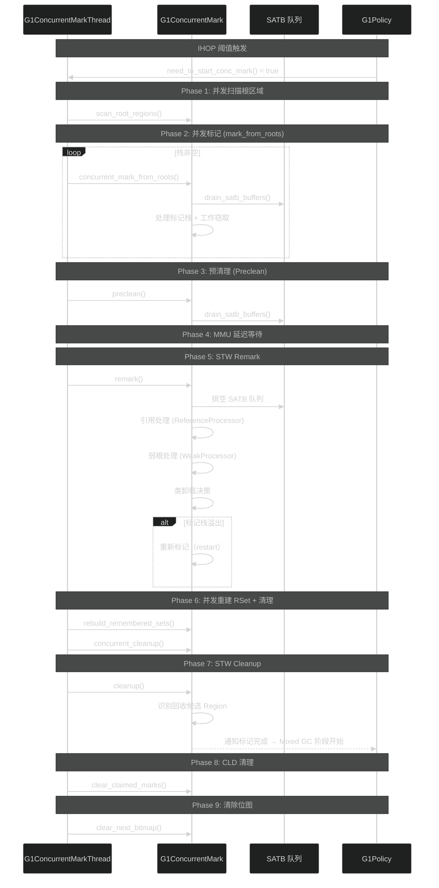
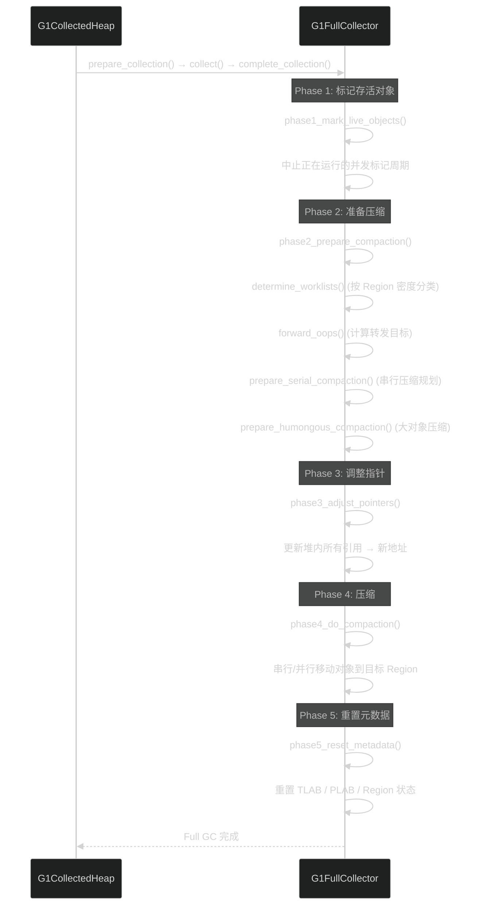
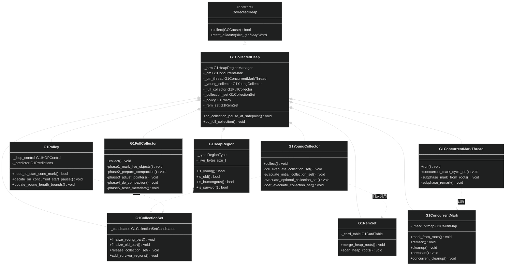

# G1 GC

> 生成日期：2026-06-14 20:16
> 数据来源：JDK 26 G1 GC 源码分析

---

## 重点关注

- [ ] G1YoungCollector 的 evacuate_initial 中并行根扫描 + RSet 扫描的负载均衡策略
- [ ] G1ConcurrentMarkThread 七阶段并发循环中 SATB 队列排空与 MMU 延迟的协调机制
- [ ] G1FullCollector 五阶段 mark-sweep-compact 在 Region 化堆上的实现差异
- [ ] G1CollectionSet 七阶段生命周期中老年代 Region 的增量添加逻辑
- [ ] G1Policy 的 IHOP 动态调整和停顿预测模型在多工作负载下的收敛性
- [ ] G1RemSet 的 Card 精度 RSet 在大堆场景下的内存开销

---

## 功能概述

G1（Garbage First）是自 JDK 9 以来的默认垃圾回收器，专为大堆多核服务器场景设计。它将堆划分为等大小的 Region，通过可预测的暂停模型和分代回收策略，在吞吐量和延迟之间取得平衡。

主要特征：
- **Region 化堆**：堆划分为 1-32MB 的等大小 Region，按需标记为 Eden/Survivor/Old/Humongous
- **停顿预测**：`G1Policy` 基于历史数据建立暂停时间模型，约束每次 GC 的工作量
- **并发标记**：`G1ConcurrentMarkThread` 通过 7 阶段并发标记循环发现老年代回收候选
- **Mixed GC**：并发标记完成后，逐步回收老年代中最多垃圾的 Region
- **SATB**：Snapshot-At-The-Beginning 保证并发标记完整性

---

## 核心概念

### 1. G1CollectedHeap — 中央堆

**定义**：G1 GC 的堆容器，管理所有 Region、CSet、RSet 和 GC 调度。

**作用**：
- 管理 `G1HeapRegion` 数组和空闲 Region 列表
- 创建 `G1YoungCollector`、`G1ConcurrentMark`、`G1FullCollector` 执行 GC
- 协调并发标记和 STW 暂停的切换

**三维评估**：

| 维度 | 评估 |
|------|------|
| 好处 | Region 化设计支持 TB 级大堆，GC 调度灵活 |
| 替代方案 | ParallelScavengeHeap 固定代边界；实现简单但粗粒度 |
| 风险 | 中央调度逻辑复杂，并发 + STW 混合状态管理难度大 |

### 2. G1YoungCollector — Young/Mixed GC 编排

**定义**：G1 中每次 Young 或 Mixed GC 暂停的核心编排器。

**作用**：
- `collect()`：驱动 pre_evacuate → evacuate_initial → evacuate_optional → post_evacuate
- evacuate_initial：根扫描 + CSet Region 中存活对象的并行复制
- evacuate_optional：Mixed GC 中额外回收的老年代 Region
- post_evacuate：引用处理、弱根处理、GC 分配区域释放

**三维评估**：

| 维度 | 评估 |
|------|------|
| 好处 | 暂停时间可控，支持年轻代和老年代增量回收 |
| 替代方案 | PSScavenge：无增量选项，每次 Young GC 回收全部年轻代 |
| 风险 | 四个阶段的编排复杂性高，可选阶段的回退逻辑可能影响停顿预测 |

### 3. G1ConcurrentMark — 并发标记

**定义**：G1 并发标记算法的核心，使用 SATB 保证并发标记完整性。

**作用**：
- 并发 `mark_from_roots()` 遍历存活对象图
- STW `remark()` 排空 SATB 队列 + 引用处理
- STW `cleanup()` 识别回收候选 Region
- 处理位图溢出导致的重新标记

**三维评估**：

| 维度 | 评估 |
|------|------|
| 好处 | 应用线程不暂停，标记 1TB 堆仅需秒级并发时间 |
| 替代方案 | Parallel 的 STW 标记；暂停与堆大小线性相关 |
| 风险 | SATB 队列可能堆积，浮动垃圾（Floating Garbage）导致回收不彻底 |

### 4. G1ConcurrentMarkThread — 并发标记线程

**定义**：驱动并发标记 7 阶段循环的独立守护线程。

**作用**：
- `concurrent_mark_cycle_do()` 执行 7 阶段：并发扫描根 → 并发标记 → 预清理 → MMU 延迟 → STW Remark → 并发重建 RSet + 清理 → STW Cleanup → CLD 清理 → 清除位图
- 协调与 Mutator 线程的并发执行
- MMU（Minimum Mutator Utilization）保证应用线程有足够的 CPU 时间

**三维评估**：

| 维度 | 评估 |
|------|------|
| 好处 | 并发执行，不阻塞应用线程 |
| 替代方案 | 纯 STW 标记；实现简单但暂停时间长 |
| 风险 | 7 阶段循环逻辑复杂，MMU 延迟可能导致标记周期过长 |

### 5. G1FullCollector — Full GC

**定义**：G1 退守到 STW Full GC 时的执行者，采用 5 阶段 mark-sweep-compact。

**作用**：
- Concurrent Mark 失败（并发模式失败）或晋升失败时触发
- Phase 1：标记存活对象（中止并发周期）
- Phase 2：准备压缩（计算转发目标 + Humongous 压缩）
- Phase 3：调整所有引用
- Phase 4：串行/并行压缩
- Phase 5：重置元数据

**三维评估**：

| 维度 | 评估 |
|------|------|
| 好处 | 兜底保障，任何情况下都能回收全部垃圾 |
| 替代方案 | Shenandoah 的 Full GC 也是 mark-sweep-compact；但 G1 支持并行段 |
| 风险 | Full GC 暂停时间与堆大小线性相关，TB 级堆可能暂停数十秒 |

### 6. G1CollectionSet — CSet 管理

**定义**：决定每次 GC 要回收哪些 Region 的组件，生命周期跨越多个 GC 阶段。

**作用**：
- 7 阶段生命周期：阶段 0（添加 Survivor）→ 阶段 1（增量添加 Eden）→ 阶段 2（重标记）→ 阶段 3（添加老年代组）→ 阶段 4-5（回收）→ 阶段 6（释放 Region）→ 阶段 7（添加 Survivor）
- 老年代选择基于垃圾最多的 Region（Garbage First 名称的由来）
- 受 `-XX:G1MixedGCLiveThresholdPercent` 等参数控制

**三维评估**：

| 维度 | 评估 |
|------|------|
| 好处 | 增量回收老年代，暂停时间可预测 |
| 替代方案 | Parallel 一次回收整个老年代；暂停不可控 |
| 风险 | Mixed GC 周期过长可能导致老年代堆积并触发并发模式失败 |

### 7. G1RemSet — Remembered Set

**定义**：跟踪跨 Region 引用的 Card 精度 RSet，支持并发扫描和合并。

**作用**：
- 每个 Region 记录哪些外部 Card 包含指向本 Region 的引用
- Young GC 时扫描 RSet 定位老年代→年轻代跨代引用
- 支持 `merge_heap_roots()` 合并和 `scan_heap_roots()` 扫描

**三维评估**：

| 维度 | 评估 |
|------|------|
| 好处 | 细粒度跟踪跨 Region 引用，避免全堆扫描 |
| 替代方案 | Parallel 的 CardTable 扫描；简单但每次 Young GC 需扫描整个老年代 |
| 风险 | RSet 内存开销可达堆大小的 2-5%，大堆场景显著 |

### 8. G1HeapRegion — 堆区域

**定义**：G1 堆的基本单元，大小为 1-32MB（自动选择），具有 8 种类型。

**作用**：
- 类型切换：Eden ↔ Survivor ↔ Old ↔ Humongous ↔ Free
- 维护本 Region 的存活对象计数、RSet 引用、TLAB 状态
- 支持快速类型查询和对象遍历

**三维评估**：

| 维度 | 评估 |
|------|------|
| 好处 | Region 类型动态切换，堆布局灵活适应工作负载 |
| 替代方案 | Parallel 的连续 MutableSpace；更简单但无法灵活调整 |
| 风险 | Humongous 对象跨连续 Region 分配可能导致过早 Full GC |

### 9. G1Policy — GC 策略

**定义**：G1 的决策核心，负责 IHOP 计算、停顿预测、年轻代大小调整。

**作用**：
- `need_to_start_conc_mark()`：IHOP 动态阈值，基于并发标记完成所需时间和分配率
- `update_young_length_bounds()`：根据停顿目标调整年轻代 Region 数量
- 维护历史加权平均的停顿时间、GC 耗时等统计

**三维评估**：

| 维度 | 评估 |
|------|------|
| 好处 | 复杂统计模型实现自动调优，减少人工干预 |
| 替代方案 | 固定 IHOP/固定年轻代大小；无法自适应 |
| 风险 | 统计预测在负载突变时可能失准，导致并发模式失败 |

---

## 关键流程

### Young / Mixed GC

### 并发标记七阶段循环

### Full GC（五阶段 mark-sweep-compact）

---

## 类继承关系

---

## 三维评估表

| 维度 | 好处 | 替代方案 | 风险 |
|------|------|----------|------|
| 暂停可预测 | 停顿预测模型约束每次 GC 工作量 | Parallel：暂停不可控 | 负载突变时预测失准 |
| Region 化堆 | 支持 TB 级大堆，回收粒度灵活 | Parallel：连续空间；存局部性更好 | Region 管理 + RSet 额外内存开销 |
| 并发标记 | 7 阶段并发 + STW 混合，应用不暂停 | Parallel/Serial：纯 STW 标记 | 浮动垃圾 + 并发模式失败风险 |
| Mixed GC | 增量回收老年代，平滑暂停 | Parallel：老年代一次压缩 | Mixed GC 周期过长 |
| 自适应 | IHOP + 停顿预测自动调优 | 固定参数配置 | 多变量统计模型稳定性依赖调优 |
| SATB | 并发标记完整性保障 | G1 独占 | SATB 队列堆积可能导致 Remark 暂停超预期 |

  - java
  - hotspot
  - jvm
tags:
---

## 核心文件说明

| 文件路径 | 核心类/结构 | 功能描述 |
|----------|------------|---------|
| `src/hotspot/share/gc/g1/g1CollectedHeap.hpp` | `G1CollectedHeap` | G1 中央堆容器，管理 Region、GC 调度和协调 |
| `src/hotspot/share/gc/g1/g1YoungCollector.hpp` | `G1YoungCollector` | Young/Mixed GC 暂停编排（4 阶段） |
| `src/hotspot/share/gc/g1/g1ConcurrentMark.hpp` | `G1ConcurrentMark` | 并发标记算法（SATB + 位图） |
| `src/hotspot/share/gc/g1/g1ConcurrentMarkThread.hpp` | `G1ConcurrentMarkThread` | 并发标记 7 阶段循环线程 |
| `src/hotspot/share/gc/g1/g1FullCollector.hpp` | `G1FullCollector` | Full GC 5 阶段 mark-sweep-compact |
| `src/hotspot/share/gc/g1/g1CollectionSet.hpp` | `G1CollectionSet` | CSet 7 阶段生命周期管理 |
| `src/hotspot/share/gc/g1/g1RemSet.hpp` | `G1RemSet` | Card 精度 Remembered Set |
| `src/hotspot/share/gc/g1/g1HeapRegion.hpp` | `G1HeapRegion` | 堆区域（1-32MB，8 种类型） |
| `src/hotspot/share/gc/g1/g1Policy.hpp` | `G1Policy` | IHOP、停顿预测、年轻代调整策略 |
