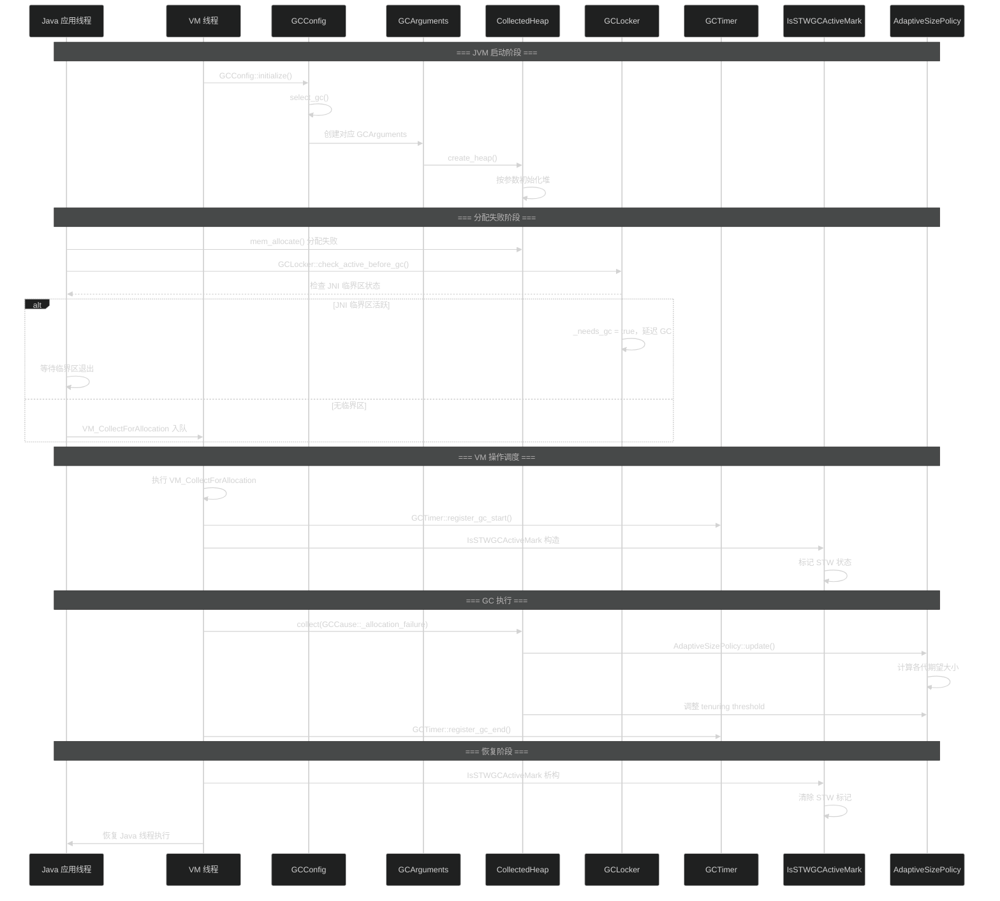
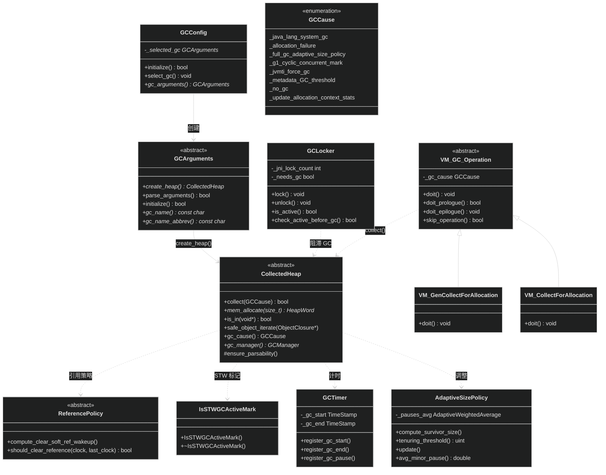

# GC 共享基础设施

> 生成日期：2026-06-14 20:16
> 数据来源：JDK 26 GC 共享基础设施源码分析

---

## 重点关注

- [ ] GC 工厂方法模式：GCArguments 与 GCConfig 如何解耦 GC 选择逻辑
- [ ] GCCause 枚举是否覆盖了所有可能的 GC 触发场景
- [ ] GCLocker JNI 临界区同步机制是否存在死锁风险
- [ ] AdaptiveSizePolicy 参数调整是否能在所有工作负载下收敛
- [ ] VM_GC_Operation 与 CollectedHeap 的协作是否完整处理了分配失败路径

---

## 功能概述

GC 共享基础设施层为 JDK 中所有垃圾收集器提供通用框架和工具。它定义了 GC 的生命周期管理、触发原因分类、时间跟踪、JNI 临界区保护、自适应策略接口以及 VM 操作调度等核心机制。该层不涉及具体回收算法，而是构建了一个可扩展的骨架，任何 GC 实现都依赖于此基础设施。

主要功能包括：
- **GC 选择与初始化**：通过 `GCConfig` 在 JVM 启动时选择合适的 GC
- **GC 触发管理**：通过 `GCCause` 枚举标准化所有可能的 GC 触发原因
- **时间 & 性能跟踪**：`GCTimer`、`AdaptiveSizePolicy` 提供 GC 耗时与动态调优
- **JNI 临界区同步**：`GCLocker` 保护 JNI 临界区内对象不被 GC 移动
- **VM 操作调度**：`VM_GC_Operation` 将 GC 请求封装为 VM 线程可执行的操作

---

## 核心概念

### 1. CollectedHeap — GC 基类

**定义**：所有 GC 堆的抽象基类，声明了堆分配、GC 执行、堆遍历等纯虚接口。

**作用**：
- 定义 `collect()`、`mem_allocate()`、`is_in()` 等核心接口
- 提供堆区域划分与线程本地分配缓冲（TLAB）管理
- 定义 `gc_cause()` / `gc_manager()` 等状态查询方法

**三维评估**：

| 维度 | 评估 |
|------|------|
| 好处 | 统一的堆抽象，GC 实现只需继承并实现关键方法即可接入 JVM 整体框架 |
| 替代方案 | C++ 模板策略模式或 C 风格函数指针表；继承方式在 JDK 扩展了 30+ 年，生态成熟 |
| 风险 | 基类接口膨胀（CollectedHeap 约 80+ 虚方法），新 GC 需覆盖大量方法；修改基类影响所有 GC |

### 2. GCArguments — 工厂方法

**定义**：每个 GC 对应的参数解析与堆工厂类，采用工厂方法模式创建具体 `CollectedHeap` 实例。

**作用**：
- 解析 GC 专属命令行参数（如 `-XX:G1HeapRegionSize`）
- 实现 `create_heap()` 纯虚方法，返回对应的 `CollectedHeap` 实例
- 持有 `_gc_name`、`_gc_name_abbrev` 等元数据供诊断使用

**三维评估**：

| 维度 | 评估 |
|------|------|
| 好处 | 将参数解析与 GC 初始化解耦；新增 GC 时只需新增 GCArguments 子类即可 |
| 替代方案 | 集中式 if-else 工厂；破坏了开闭原则 |
| 风险 | 参数解析分散在各 GCArguments 子类中，公共参数处理可能重复 |

### 3. GCConfig — GC 选择器

**定义**：JVM 启动时根据命令行参数和可用性选择合适的 GC，是 GC 策略的入口关卡。

**作用**：
- `select_gc()` 解析 `-XX:+UseG1GC`、`-XX:+UseZGC` 等标志
- 检查 GC 可用性（平台支持、认证状态、许可证）
- 委托给 `GCArguments::create_heap()` 实例化具体堆

**三维评估**：

| 维度 | 评估 |
|------|------|
| 好处 | 单一切入点，GC 选择逻辑集中；支持通过命令行动态切换 |
| 替代方案 | 编译期宏选择 GC；灵活性差，不支持运行时切换 |
| 风险 | 选择逻辑随 GC 数量增加而复杂化；部分 GC 存在平台限制需额外检查 |

### 4. GCCause — 触发原因枚举

**定义**：`enum GCCause` 定义了所有可能的 GC 触发原因，从分配失败到 JVMTI 强制执行。

**作用**：
- 标准化 GC 触发原因记录
- 支持 GC 日志和诊断报告中的原因溯源
- 区分外部请求（`_java_lang_system_gc`）与内部决策（`_allocation_failure`）

**三维评估**：

| 维度 | 评估 |
|------|------|
| 好处 | 精确的触发原因追踪，便于性能分析和问题诊断 |
| 替代方案 | 自由字符串；不利于比较和聚合统计 |
| 风险 | 枚举成员可能遗漏某些场景，新增触发原因需修改枚举 |

### 5. GCTimer — 时间跟踪

**定义**：提供 GC 暂停时间和并发阶段耗时的精确测量工具。

**作用**：
- 记录 `GCStart`、`GCEnd` 等时间戳
- 支持 GC 阶段时间分解（`GCPhaseTimer`）
- 为打印 GC 日志和 JMX MXBean 提供数据源

**三维评估**：

| 维度 | 评估 |
|------|------|
| 好处 | 统一的 GC 计时框架，时间数据可用于停顿预测和自适应策略 |
| 替代方案 | 各 GC 自行记录时间戳；导致重复实现和一致性差 |
| 风险 | 时钟源差异（`os::javaTimeMillis()` vs `os::elapsed_counter()`）可能引入测量偏差 |

### 6. GCLocker — JNI 临界区同步

**定义**：当 Java 线程处于 JNI 临界区（`GetPrimitiveArrayCritical` / `GetStringCritical` 之间）时，阻止 GC 移动对象的同步机制。

**作用**：
- 计数正在 JNI 临界区的线程数
- 当临界区活跃时，阻止需要移动对象的 GC
- `_needs_gc` 标记在临界区结束后立即触发延迟的 GC

**三维评估**：

| 维度 | 评估 |
|------|------|
| 好处 | 保证 JNI 临界区内对象指针安全，避免 GC 移动导致原生代码访问已移动对象 |
| 替代方案 | 禁止 JNI 临界区使用原始指针，强制使用句柄；影响 JNI 代码移植性 |
| 风险 | 长临界区会无限期阻塞 GC，可能导致 GC 压力堆积或 OutOfMemoryError |

### 7. IsSTWGCActiveMark — STW 标记

**定义**：RAII 风格的 Stop-The-World 标记辅助类，用于标记当前处于 STW 暂停状态。

**作用**：
- 进入 STW 时构造，退出时析构
- 配合 `SafepointSynchronize` 检查 VM 状态
- 用于断言和调试断言当前线程是否应持有堆锁

**三维评估**：

| 维度 | 评估 |
|------|------|
| 好处 | RAII 确保 STW 标记的正确配对；调试期有效检测并发冲突 |
| 替代方案 | 手动标记/清除 STW 标志位；容易遗漏清除操作 |
| 风险 | 仅用于调试断言，对生产环境无直接影响 |

### 8. AdaptiveSizePolicy — 自适应调整策略

**定义**：根据历史 GC 性能数据动态调整各代大小和晋升阈值，以优化吞吐量和暂停时间。

**作用**：
- 计算各代期望大小
- 调整 Survivor 空间大小和晋升阈值（`tenuring threshold`）
- 平衡吞吐量与暂停时间目标

**三维评估**：

| 维度 | 评估 |
|------|------|
| 好处 | 无需手动调优即可适应不同工作负载；减少 `-Xmn`、`-XX:SurvivorRatio` 等参数依赖 |
| 替代方案 | 静态代大小配比；无法自适应变化负载 |
| 风险 | 反馈控制可能在负载突变时振荡；响应滞后在短时间内峰值分配场景下效果有限 |

### 9. ReferencePolicy — 软引用策略

**定义**：决定软引用在被清除前应存活的最长时间的策略。

**作用**：
- 计算软引用在最近 GC 后的存活时间
- 根据不同策略（LRU、基于空闲堆空间比例）决定清除时机
- 配合 `ReferenceProcessor` 处理引用对象

**三维评估**：

| 维度 | 评估 |
|------|------|
| 好处 | 软引用行为可预测，不同策略适应不同内存压力场景 |
| 替代方案 | 固定存活时间；无法与堆使用状况联动 |
| 风险 | 策略选择需要与 GC 搭配测试，错误策略可能导致 OOM 或过早清除 |

### 10. VM_GC_Operation — VM 操作

**定义**：将 GC 请求封装为 VM 线程执行的 `VM_Operation` 子类，通过 VMThread 队列调度执行。

**作用**：
- `VM_CollectForAllocation`：分配失败触发的 VM 操作
- `VM_GenCollectForAllocation`：分代 GC 分配失败操作
- 确保 GC 在安全点执行，所有 Java 线程到达安全点后才开始 GC

**三维评估**：

| 维度 | 评估 |
|------|------|
| 好处 | 统一的 VM 操作调度框架；GC 执行在安全点保障内存一致性 |
| 替代方案 | 直接在线程中执行 GC；违反安全点约束，可能导致并发访问冲突 |
| 风险 | VM 操作队列可能因 GC 慢而阻塞其他 VM 操作（如 `HeapDumper`） |

---

## 关键流程

### GC 从触发到执行的完整链路

---

## 类继承关系

---

## 三维评估表

| 组件 | 好处 (Benefit) | 替代方案 (Alternative) | 风险 (Risk) |
|------|---------------|----------------------|------------|
| CollectedHeap | GC 实现只需继承即可接入 JVM | 模板/函数指针；继承方式成熟 | 接口膨胀，修改影响所有 GC |
| GCArguments | 参数解析与初始化解耦 | 集中工厂；不符合开闭原则 | 参数处理分散在各子类 |
| GCConfig | 单一切入点，选择逻辑集中 | 编译期宏选择；灵活性差 | 选择逻辑随 GC 数量复杂化 |
| GCCause | 精确的触发原因追踪 | 自由字符串；不利于统计 | 枚举可能遗漏触发场景 |
| GCTimer | 统一的 GC 计时框架 | 各 GC 自行计时；一致性差 | 时钟源偏差 |
| GCLocker | 保护 JNI 临界区内指针安全 | 句柄代替原始指针；移植性差 | 长临界区阻塞 GC |
| IsSTWGCActiveMark | RAII 标记，自动配对 | 手动标记；遗漏清除风险 | 仅调试期有效 |
| AdaptiveSizePolicy | 自动适应负载，无需手动调优 | 静态配比；无法自适应 | 负载突变可能振荡 |
| ReferencePolicy | 软引用行为可预测 | 固定存活时间；不与堆联动 | 策略选择不当可致 OOM |
| VM_GC_Operation | 统一调度，安全点执行 | 线程直接执行；违反安全点 | GC 慢时阻塞其他 VM 操作 |

  - java
  - hotspot
  - jvm
tags:
---

## 核心文件说明

| 文件路径 | 核心类/结构 | 功能描述 |
|----------|------------|---------|
| `src/hotspot/share/gc/shared/collectedHeap.hpp` | `CollectedHeap` | GC 堆的抽象基类，定义所有 GC 通用的堆接口 |
| `src/hotspot/share/gc/shared/gcArguments.hpp` | `GCArguments` | GC 参数解析与工厂方法基类 |
| `src/hotspot/share/gc/shared/gcConfig.hpp` | `GCConfig` | JVM 启动时选择合适 GC 的入口类 |
| `src/hotspot/share/gc/shared/gcCause.hpp` | `GCCause` | 所有 GC 触发原因的枚举定义 |
| `src/hotspot/share/gc/shared/gcTimer.hpp` | `GCTimer`, `GCPhase` | GC 各阶段时间跟踪工具 |
| `src/hotspot/share/gc/shared/gcLocker.hpp` | `GCLocker` | JNI 临界区内对象保护的同步原语 |
| `src/hotspot/share/gc/shared/isGCActiveMark.hpp` | `IsSTWGCActiveMark` | STW 暂停状态的 RAII 标记 |
| `src/hotspot/share/gc/shared/adaptiveSizePolicy.hpp` | `AdaptiveSizePolicy` | 各代大小和晋升阈值的自适应调整策略 |
| `src/hotspot/share/gc/shared/referencePolicy.hpp` | `ReferencePolicy` | 软引用等引用类型的清除策略 |
| `src/hotspot/share/gc/shared/vmGCOperations.hpp` | `VM_GC_Operation` | GC 请求的 VM 操作封装类 |
