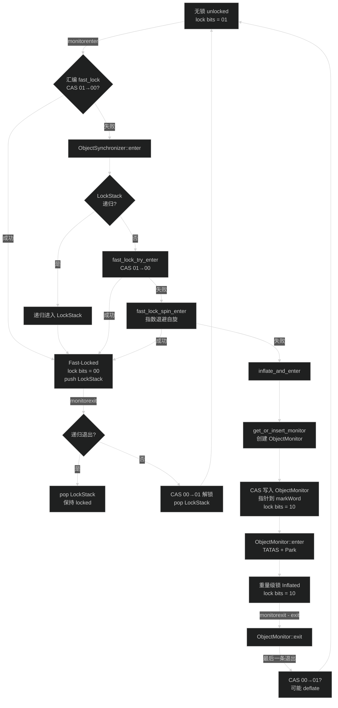

# 场景分析：JVM synchronized 锁实现原理
> 上次修改：2026-06-10 22:27

## 重点关注
- [ ] JDK 26 锁架构概览（偏向锁已移除）
- [ ] 二段式锁升级路径：无锁 -> Fast-Locked (LockStack) -> 重量级锁 (ObjectMonitor)
- [ ] markWord lock bits 语义
- [ ] LockStack 快速锁定机制
- [ ] 汇编级快速路径 (fast_lock/fast_unlock)
- [ ] ObjectSynchronizer 核心进入/退出路径
- [ ] 锁膨胀 (Inflation) 过程
- [ ] ObjectMonitor 重量级锁实现（TATAS + Park）
- [ ] JIT 编译路径的快速锁

## 场景描述
分析 Hotspot JVM 对 Java synchronized 关键字的底层实现原理。从字节码指令 monitorenter/monitorexit 开始，经过解释器分派、汇编快速路径、同步器运行时，最终到 ObjectMonitor 重量级锁的完整调用链路。JDK 26 已完全移除偏向锁，锁升级链路简化为：无锁 -> Fast-Locked（LockStack 轻量级锁定）-> 重量级锁（ObjectMonitor 膨胀）。

关键背景：JDK 15 起偏向锁默认禁用，JDK 26 中偏向锁代码全部删除，由 LockStack 机制替代传统的栈锁（stack-locking）。

## 涉及模块
| 模块 | 角色 |
|------|------|
| hotspot/share/interpreter | 字节码分派、模板表、运行时常量入口 |
| hotspot/cpu/x86 | x86 汇编快速路径 (fast_lock/fast_unlock) |
| hotspot/share/runtime | ObjectSynchronizer 核心同步器、ObjectMonitor 重量级锁、LockStack |
| hotspot/share/oops | markWord 对象头标记字 |

## 锁状态与 markWord 结构

### markWord 64-bit 布局
```
[unused:22 | hash:31 | unused_gap:4 | age:4 | self_fwd:1 | lock:2]
```

使用 compact headers 时（64-bit）：
```
[klass:22 | hash:31 | unused_gap:4 | age:4 | self_fwd:1 | lock:2]
```

### lock bits 语义
| 值 | 宏常量 | 含义 |
|----|--------|------|
| `0b00` (0) | locked_value | Fast-Locked：轻量级锁定，对象地址在线程的 LockStack 中 |
| `0b01` (1) | unlocked_value | Unlocked (Neutral)：无锁状态 |
| `0b10` (2) | monitor_value | Inflated：已膨胀，markWord 存储 ObjectMonitor 指针（或通过 OMCache/表查找） |
| `0b11` (3) | marked_value | Marked：GC 转发指针（并发标记/压缩） |

特殊值：
| 值 | 含义 |
|----|------|
| `0x0...00` (全零) | INFLATING()：膨胀进行中（传统 stack-locking 场景，fast-locking 不使用） |

关键方法（`src/hotspot/share/oops/markWord.hpp`）：
- `is_fast_locked()` — `lock_bits == 0`
- `is_unlocked()` — `lock_bits == 1`
- `has_monitor()` — `lock_bits == 2`

```cpp
// markWord.hpp:201-217
bool is_fast_locked() const { return (value() & lock_mask_in_place) == locked_value; }
bool is_unlocked()    const { return (mask_bits(value(), lock_mask_in_place) == unlocked_value); }
bool has_monitor()    const { return ((value() & lock_mask_in_place) == monitor_value); }
```

**三维评估**：
- **好处**：lock bits 使用最低 2 bit，与指针自然对齐（4/8 字节对齐的指针低两位恒为 0），可直接嵌入指针或状态码，零额外空间开销。markWord 中同时编码 hash、age、klass（compact headers）等字段，空间利用率高。
- **替代方案**：在对象头中单独分配一个锁字段——浪费空间且破坏缓存局部性。ARM64 等架构也可使用类似低位标记方案。
- **风险**：hash code 必须在膨胀前安装（否则膨胀后丢失）。全零 INFLATING 值的检测逻辑在传统 stack-locking 路径中存在，fast-locking 场景下不使用但保留兼容。

## 锁升级流程

使用 Mermaid flowchart 展示：



## 调用时序图

```mermaid
%%{init: {'theme':'dark'}}%%
sequenceDiagram
    participant Bytecode as monitorenter bytecode
    participant Template as TemplateTable
    participant Asm as MacroAssembler (x86)
    participant Runtime as InterpreterRuntime
    participant Sync as ObjectSynchronizer
    participant LockStk as LockStack
    participant OM as ObjectMonitor
    participant OS as OS (pthread)
    
    Bytecode->>Template: 字节码分派 (0xC2)
    Template->>Asm: lock_object()
    
    rect rgb(22, 60, 45)
        Note over Asm: 快速路径 (纯汇编)
        Asm->>Asm: fast_lock()
        Asm->>Asm: 检查 LockStack 是否满
        Asm->>Asm: 检查递归 (栈顶相同?)
        Asm->>Asm: 检查是否已 inflate (10)?
        Asm->>Asm: CAS markWord: 01→00
        Asm->>LockStk: push(obj) 到线程 LockStack
        Note over Asm: 快速路径成功→直接返回
    end
    
    Asm->>Runtime: 快速路径失败→call_VM
    
    rect rgb(60, 35, 28)
        Note over Runtime,OM: 慢速路径 (C++)
        Runtime->>Sync: monitorenter(obj)
        
        Sync->>LockStk: try_recursive_enter(obj)
        alt LockStack 可递归
            LockStk-->>Sync: success→返回
        end
        
        Sync->>Sync: fast_lock_try_enter(obj)
        alt CAS 01→00 成功
            Sync->>LockStk: push(obj)
            LockStk-->>Sync: success→返回
        end
        
        Sync->>Sync: fast_lock_spin_enter(obj)
        alt 自旋成功
            Sync->>LockStk: push(obj)
            LockStk-->>Sync: success→返回
        end
        
        Note over Sync: 以上都失败→膨胀
        Sync->>Sync: inflate_and_enter(obj)
        Sync->>Sync: get_or_insert_monitor()
        Sync->>OM: inflate_into_object_header()
        Note over OM: CAS 将 ObjectMonitor 指针<br>写入 markWord (lock bits=10)
        
        OM->>OM: enter()
        OM->>OM: spin_enter() 自旋
        OM->>OM: enter_with_contention_mark()
        OM->>OM: enter_internal()
        OM->>OM: try_lock() CAS
        OM->>OM: try_spin() 自适应自旋
        OM->>OM: try_lock_or_add_to_entry_list()
        OM->>OS: ParkEvent::park() 线程挂起
        OS-->>OM: unpark() 被唤醒
        OM->>OM: try_lock() 再尝试
        Note over OM: 获取锁→返回
    end
```



## 核心源码解读

### 1. 解释器入口：lock_object / unlock_object

**文件**：`src/hotspot/cpu/x86/interp_masm_x86.cpp:1098-1120`

```asm
// lock_object 核心逻辑：
movptr(obj_reg, Address(lock_reg, BasicObjectLock::obj_offset()));  // 加载对象指针
fast_lock(lock_reg, obj_reg, swap_reg, tmp_reg, slow_case);         // 尝试快速锁定
jmp(done);                                                           // 成功→直接返回
bind(slow_case);
call_VM_preemptable(noreg, CAST_FROM_FN_PTR(address, InterpreterRuntime::monitorenter), lock_reg);
```

解释器执行 monitorenter 字节码时，先尝试汇编级快速路径 fast_lock()。如果快速路径失败（CAS 竞争、LockStack 满、对象已膨胀等），则调用 `InterpreterRuntime::monitorenter` 进入 C++ 运行时。

**三维评估**：
- **好处**：fast path 纯汇编实现，零函数调用开销；slow path 延迟到真正需要时才进入，典型的 fast-path/slow-path 优化模式。
- **替代方案**：直接调用运行时——简化实现但无竞争场景性能差。
- **风险**：快速路径和慢速路径的状态一致性需谨慎维护；fast_lock 实现与运行时同步逻辑耦合度高。

### 2. 解释器运行时入口

**文件**：`src/hotspot/share/interpreter/interpreterRuntime.cpp:729-742`

```cpp
JRT_ENTRY_NO_ASYNC(void, InterpreterRuntime::monitorenter(JavaThread* current, BasicObjectLock* elem))
  Handle h_obj(current, elem->obj());
  ObjectSynchronizer::enter(h_obj, elem->lock(), current);
JRT_END
```

### 3. 汇编级快速路径：fast_lock

**文件**：`src/hotspot/cpu/x86/macroAssembler_x86.cpp`（fast_lock 方法）

```
fast_lock() 核心逻辑（伪代码描述）：
1. mov(tmp, obj->markWord)                            // 读取对象头
2. test(tmp, FAST_LOCKED_BIT)                          // 检查 lock bits
3. jne(slow)                                            // 非 fast-lock 走慢路径
4. cmpxchg(tmp, RAX | LOCKED_BITS, obj->markWord)      // CAS 设置 locked
5. je(locked)                                           // CAS 成功
6. jmp(slow)                                            // CAS 失败
locked:
7. push obj to LockStack                                // 记录锁定对象
```

CAS 操作将 markWord 的 lock bits 从 `0b01` (unlocked) 转为 `0b00` (fast-locked)，成功后将对象引用压入线程的 LockStack。

**三维评估**：
- **好处**：纯汇编实现避免函数调用开销；CAS 硬件原子指令保证并发安全；路径极短（约 10 条指令），对无竞争场景最优。
- **替代方案**：传统做法使用栈上 BasicLock 对象记录 displaced markWord，JDK 26 改用 LockStack 直接在寄存器/高速缓存操作，减少了内存间接引用。
- **风险**：CAS 失败（轻微竞争）仍需调用运行时；fast-lock 适用于短临界区，长操作仍建议直接使用重量级锁。

### 4. ObjectSynchronizer::enter 主路径

**文件**：`src/hotspot/share/runtime/synchronizer.cpp:2084-2142`

```cpp
void ObjectSynchronizer::enter(Handle obj, BasicLock* lock, JavaThread* current) {
  if (obj->klass()->is_value_based()) {                  // value-based class 检查
    handle_value_based_class(obj, current);
  }

  LockStack& lock_stack = current->lock_stack();

  // Step 1: 尝试 LockStack 递归进入
  if (!lock_stack.is_full() && lock_stack.try_recursive_enter(obj())) {
    return;
  }

  // Step 2: 如果对象已在 LockStack 中但需要 inflate（如锁降级场景）
  if (lock_stack.contains(obj())) {
    ObjectMonitor* monitor = inflate_fast_locked_object(...);
    bool entered = monitor->enter(current);
    cache_setter.set_monitor(monitor);
    return;
  }

  // Step 3: 尝试 CAS 快速锁定 + 自旋（梯度降级）
  while (true) {
    if (fast_lock_try_enter(obj(), lock_stack, current)) {
      return;
    } else if (UseObjectMonitorTable && fast_lock_spin_enter(obj(), lock_stack, current, observed_deflation)) {
      return;
    }

    // Step 4: 膨胀为重量级锁
    ObjectMonitor* monitor = inflate_and_enter(...);
    if (monitor != nullptr) {
      cache_setter.set_monitor(monitor);
      return;
    }
    observed_deflation = true;  // 检测到 deflation→重试 fast-lock
  }
}
```

**三维评估**：
- **好处**：梯度降级尝试——先零开销 LockStack 检查，然后 CAS 原子锁定，然后自旋，最后膨胀。绝大多数场景在 CAS 或之前完成。支持 deflation 重试循环，避免膨胀/收缩震荡。
- **替代方案**：一次性膨胀的做法（如直接 ObjectMonitor）对无竞争场景过重。Linux 内核的 mutex 也采用类似 fast path -> slow path 的乐观策略。
- **风险**：value-based class 检查有额外开销；如果锁竞争模式剧烈波动，CAS 重复失败->膨胀的延迟比预期高。`inflate_and_enter` 返回 nullptr 时表示检测到 deflation，需要回退 fast-lock，此路径复杂度较高。

#### CacheSetter 辅助类

**文件**：`src/hotspot/share/runtime/synchronizer.cpp:1926-1960`

```cpp
class ObjectSynchronizer::CacheSetter : StackObj {
  JavaThread* const _thread;
  BasicLock* const _lock;
  ObjectMonitor* _monitor;       // 初始为 nullptr

public:
  CacheSetter(JavaThread* thread, BasicLock* lock) :
    _thread(thread), _lock(lock), _monitor(nullptr) {}

  ~CacheSetter() {
    if (UseObjectMonitorTable) {
      if (_monitor != nullptr) {
        if (_monitor != _lock->object_monitor_cache()) {
          _thread->om_set_monitor_cache(_monitor);    // 写线程 OMCache
          _lock->set_object_monitor_cache(_monitor);  // 写 BasicLock 缓存
        }
      } else {
        _lock->clear_object_monitor_cache();           // 无 monitor → 清除缓存
      }
    }
  }

  void set_monitor(ObjectMonitor* monitor) {
    assert(_monitor == nullptr, "only set once");
    _monitor = monitor;
  }
};
```

CacheSetter 是一个 RAII 辅助类，在 `ObjectSynchronizer::enter()` 的**栈上**分配（`CacheSetter cache_setter(current, lock)`），析构时自动将膨胀后的 ObjectMonitor 写回两级缓存：
- **线程级 OMCache**（容量 8，加速 JIT 编译路径的 ObjectMonitor 查找）
- **BasicLock 级缓存**（C2 fast-path 可能从此读取）

如果整个 enter 过程未调用 `set_monitor()`（即路径终点是 LockStack 而非 ObjectMonitor），则析构时**清除** BasicLock 缓存条目，避免残留脏数据。

#### 两条递归路径详解

`enter()` 中 2101 行和 2106 行对应两种不同的递归锁定场景，其行为差异取决于 LockStack 中目标对象的位置：

```cpp
LockStack& lock_stack = current->lock_stack();

// 路径 A (line 2101) — 栈顶匹配，纯栈操作
if (!lock_stack.is_full() && lock_stack.try_recursive_enter(obj())) {
    // LockStack 不为空且栈顶 == obj → 直接压栈
    // CacheSetter._monitor 保持 nullptr → 析构时清除 BasicLock 缓存
    return;
}

// 路径 B (line 2106) — 在栈中但不在栈顶，膨胀为 ObjectMonitor
if (lock_stack.contains(obj())) {
    // try_recursive_enter 失败（栈顶不是 obj），但 obj 在栈中某处
    // 必须膨胀才能管理嵌套递归
    ObjectMonitor* monitor = inflate_fast_locked_object(obj(), ..., current, current);
    bool entered = monitor->enter(current);
    cache_setter.set_monitor(monitor);  // CacheSetter 记录 monitor
    return;  // 析构时写入 OMCache + BasicLock 缓存
}
```

`try_recursive_enter` 的实现（`lockStack.inline.hpp:121-145`）：

```cpp
inline bool LockStack::try_recursive_enter(oop o) {
  // 只有当栈顶元素 == o 时才成功
  int end = to_index(_top);
  if (end == 0 || _base[end - 1] != o) {
    return false;     // 栈顶不匹配
  }
  _base[end] = o;     // 压栈
  _top += oopSize;
  return true;
}
```

#### Java 演示代码

```java
public class LockRecursionDemo {
    static final Object obj = new Object();
    static final Object other = new Object();

    void demo() {
        // ── 场景 A: 触发 line 2101 try_recursive_enter ──
        synchronized (obj) {                    // 第一次: fast_lock_try_enter (line 2120)
                                                // LockStack: [] → [obj]
            synchronized (obj) {                // 第二次: obj 在栈顶 → try_recursive_enter 成功
                                                // LockStack: [obj] → [obj, obj]
                // 纯栈操作，零分配，CacheSetter 析构时清除缓存
            }
        }

        // ── 场景 B: 触发 line 2106 contains → inflate ──
        synchronized (obj) {                    // LockStack: [] → [obj]
            synchronized (other) {              // LockStack: [obj] → [obj, other]
                synchronized (obj) {            // 栈顶是 other, 不是 obj
                    // try_recursive_enter 失败（栈顶匹配检查）
                    // contains(obj) == true → inflate_fast_locked_object
                    // CacheSetter.set_monitor(monitor) → 写入两级缓存
                }
            }
        }
    }
}
```

**对应关系总结**：

| 场景 | 触发行 | 条件 | LockStack 操作 | 对象分配 | CacheSetter 行为 |
|------|--------|------|---------------|---------|-----------------|
| 首次锁定 | 2120 `fast_lock_try_enter` | markWord unlocked | `push(obj)` | 无 | 析构时清除缓存 |
| 连续递归重入 | **2101** `try_recursive_enter` | 栈顶 == obj | `push(obj)`（再压一次） | 无 | 析构时清除缓存 |
| 隔层递归重入 | **2106** `contains` → inflate | obj 在栈中但不在栈顶 | `inflate_fast_locked_object` | 分配 ObjectMonitor | 写入 OMCache + BasicLock |

通俗理解：
- **2101 行**：连续锁同一个对象 → 直接压栈，零开销
- **2106 行**：锁了 A → 锁 B → 又锁 A，中间插了别的锁 → 膨胀为 ObjectMonitor

### 5. ObjectSynchronizer::exit 主路径

**文件**：`src/hotspot/share/runtime/synchronizer.cpp:2144-2194`

```cpp
void ObjectSynchronizer::exit(oop object, BasicLock* lock, JavaThread* current) {
  markWord mark = object->mark();
  
  LockStack& lock_stack = current->lock_stack();
  if (mark.is_fast_locked()) {
    // 尝试递归退出
    if (lock_stack.try_recursive_exit(object)) return;
    // 非结构化退出→先膨胀再退出
    if (lock_stack.is_recursive(object)) {
      inflate_fast_locked_object(object, ...);
    }
  }

  // 非递归 fast-lock→CAS 解锁
  while (mark.is_fast_locked()) {
    markWord unlocked_mark = mark.set_unlocked();
    markWord old_mark = mark;
    mark = object->cas_set_mark(unlocked_mark, old_mark);
    if (old_mark == mark) {
      size_t recursion = lock_stack.remove(object) - 1;
      return;
    }
  }

  // 已膨胀→通过 ObjectMonitor::exit 解锁
  assert(mark.has_monitor(), "must be");
  ObjectMonitor* monitor = ...;
  // 如果是匿名持有者，先将 ownership 转给当前线程
  if (monitor->has_anonymous_owner()) {
    monitor->set_owner_from_anonymous(current);
    monitor->set_recursions(current->lock_stack().remove(object) - 1);
  }
  monitor->exit(current);
}
```

**三维评估**：
- **好处**：三种退出路径（递归 fast-lock、非递归 fast-lock、inflated）集中管理；lock_stack.remove() 同时处理递归计数和对象移除。
- **替代方案**：所有退出走 ObjectMonitor::exit——简单但丢失 fast-lock 性能优势。
- **风险**：非结构化锁退出（如异常路径）需要膨胀到 ObjectMonitor 才能正确处理；匿名持有者（anonymous owner）的检测和所有权转交逻辑增加了退出路径的复杂度。

### 6. LockStack 数据结构

**文件**：`src/hotspot/share/runtime/lockStack.hpp:42-157`

```cpp
class LockStack {
  static const int CAPACITY = 8;       // 固定容量，每个线程 8 个 slot
  uint32_t _top;                        // 栈顶偏移（字节偏移，非索引）
  const uintptr_t _bad_oop_sentinel;   // 下溢出哨兵值（badOopVal）
  oop _base[CAPACITY];                 // 栈底数组

  // 关键操作
  bool contains(oop o);                // 检查对象是否在栈中
  void push(oop o);                    // 压入锁对象
  bool try_recursive_enter(oop o);     // 检查栈顶 == o → 递归进入
  bool try_recursive_exit(oop o);      // 检查栈顶和下个元素 == o → 递归退出
  void remove(oop o);                  // 从任意位置移除（inflate 时用）
};
```

伴随的 OMCache（`lockStack.hpp:132-155`）：

```cpp
class OMCache {
  static constexpr int CAPACITY = 8;
  struct OMCacheEntry {
    oop _oop = nullptr;
    ObjectMonitor* _monitor = nullptr;
  } _entries[CAPACITY];
  const oop _null_sentinel = nullptr;
  // 用于缓存 ObjectMonitor 查找结果，加速 JIT 编译路径
};
```

**三维评估**：
- **好处**：固定大小（8）的线程本地栈，访问无需任何同步（只有当前线程操作）；通过检查栈顶元素实现 O(1) 递归锁定；cache-friendly，常驻 L1 缓存。`_top` 使用字节偏移而非索引以优化生成代码的寻址效率。`_bad_oop_sentinel` 在栈空时拦截下溢出。
- **替代方案**：传统 stack-locking 将 BasicLock（含 displaced markWord）分配在解释器帧上，每次访问需加载帧基址；LockStack 直接从线程结构访问，更简洁快速。OMCache 缓存 ObjectMonitor 避免重复查表，是 JDK 26 的新增优化。
- **风险**：CAPACITY=8 的限制——单线程嵌套锁超过 8 层会迫使膨胀为重量级锁；极深嵌套场景反而性能更差（但实际代码很少超过 8 层同步嵌套）。OMCache 与 LockStack 的协同维护增加实现复杂度。

### 7. fast_lock_try_enter 与 fast_lock_spin_enter

**文件**：`src/hotspot/share/runtime/synchronizer.cpp:1990-2049`

```cpp
// 核心 CAS 快速锁定
inline bool ObjectSynchronizer::fast_lock_try_enter(oop obj, LockStack& lock_stack, JavaThread* current) {
  markWord mark = obj->mark();
  while (mark.is_unlocked()) {
    ensure_lock_stack_space(current);                   // 确保 LockStack 有空间
    markWord locked_mark = mark.set_fast_locked();
    markWord old_mark = mark;
    mark = obj->cas_set_mark(locked_mark, old_mark);    // CAS: 01→00
    if (old_mark == mark) {
      lock_stack.push(obj);                             // 成功：入栈并返回
      return true;
    }
  }
  return false;
}

// 指数退避自旋
bool ObjectSynchronizer::fast_lock_spin_enter(oop obj, LockStack& lock_stack, JavaThread* current, bool observed_deflation) {
  const int log_spin_limit = os::is_MP() ? FastLockingSpins : 1;
  for (int i = 0; should_spin() && i < log_spin_limit; i++) {
    const int total_spin_count = 1 << i;
    // 内层 SpinPause() 循环，外层检查 safepoint
    for (int outer = 0; outer < outer_spin_count; outer++) {
      should_process = SafepointMechanism::should_process(current);
      for (int inner = 1; inner < inner_spin_count; inner++) {
        SpinPause();                                    // PAUSE 指令（rep nop）
      }
    }
    if (fast_lock_try_enter(obj, lock_stack, current)) return true;
  }
  return false;
}
```

**三维评估**：
- **好处**：自旋期间只读（不写）markWord，不引发缓存一致性流量；指数退避（1, 2, 4, 8... 次迭代）自适应竞争激烈程度；safepoint 检查防止 STW 延迟；SpinPause() 在 x86 上发出 PAUSE 指令，在多核/超线程系统中提升性能。
- **替代方案**：固定次数自旋——竞争低时浪费 CPU，竞争高时不够。纯 OS 阻塞——短临界区时开销过大。
- **风险**：自旋消耗 CPU 时间片（长临界区时）；自旋阈值 FastLockingSpins 的调优需根据负载特征调整；observed_deflation 路径增加分支复杂度。

### 8. 锁膨胀：inflate_into_object_header

**文件**：`src/hotspot/share/runtime/synchronizer.cpp:2246-2361`

```cpp
ObjectMonitor* ObjectSynchronizer::inflate_into_object_header(oop object, ...) {
  for (;;) {
    const markWord mark = object->mark_acquire();

    // CASE: inflated → 直接返回
    if (mark.has_monitor()) {
      ObjectMonitor* inf = mark.monitor();
      // 匿名持有者且当前线程持有 LockStack 项→转交 ownership
      if (inf->has_anonymous_owner() && locking_thread->lock_stack().contains(object)) {
        inf->set_owner_from_anonymous(locking_thread);
        locking_thread->lock_stack().remove(object);
      }
      return inf;
    }

    // CASE: fast-locked → 构造 ObjectMonitor，CAS 替换 markWord
    if (mark.is_fast_locked()) {
      ObjectMonitor* monitor = new ObjectMonitor(object);
      monitor->set_header(mark.set_unlocked());
      if (locking_thread->lock_stack().contains(object)) {
        monitor->set_owner(locking_thread);             // 自己持有→直接设 owner
      } else {
        monitor->set_anonymous_owner();                 // 他人持有→匿名 owner
      }
      if (object->cas_set_mark(monitor_mark, mark) == mark) {
        // 成功：从 LockStack 移除，添加到全局 in_use_list
        locking_thread->lock_stack().remove(object);
        _in_use_list.add(monitor);
        return monitor;
      }
      delete monitor;  // CAS 失败→重试
      continue;
    }

    // CASE: unlocked → 构造 ObjectMonitor，CAS 安装
    assert(mark.is_unlocked(), "invariant");
    ObjectMonitor* m = new ObjectMonitor(object);
    m->set_header(mark);
    if (object->cas_set_mark(markWord::encode(m), mark) == mark) {
      _in_use_list.add(m);
      return m;
    }
    delete m;
    continue;
  }
}
```

**三维评估**：
- **好处**：循环 CAS 确保操作原子性；三种状态（inflated/fast-locked/unlocked）集中处理，逻辑清晰；并发 inflate 通过 CAS 保证只有一个线程成功。匿名 owner 机制允许非持有线程代为膨胀，然后原持有者稍后通过 exit 路径接管。
- **替代方案**：粗粒度全局锁保护膨胀——安全但严重降低并发。乐观 CAS 重试是当前主流选择。UseObjectMonitorTable 模式下 ObjectMonitor 指针不直接编码在 markWord 中，而是通过全局并发哈希表查找。
- **风险**：反复 CAS 失败（高并发 inflate 同一对象）引起活锁，但概率极低（inflated 是吸收状态，不会来回切换）。hash code 预安装逻辑增加复杂性。内存分配（new ObjectMonitor）可能在 CAS 失败后浪费（CAS 失败时 delete）。

### 9. ObjectMonitor 重量级锁

**文件**：`src/hotspot/share/runtime/objectMonitor.cpp:947-1094`

```cpp
void ObjectMonitor::enter_internal(JavaThread* current) {
  // TATAS (Test-And-Test-And-Set) 协议

  // Step 1: 先试一轮 try_lock
  if (try_lock(current) == TryLockResult::Success) return;

  // Step 2: 自适应自旋
  if (try_spin(current)) return;

  // Step 3: 入队 + 挂起
  ObjectWaiter node(current);
  current->_ParkEvent->reset();

  if (try_lock_or_add_to_entry_list(current, &node)) return;

  for (;;) {
    if (try_lock(current) == TryLockResult::Success) break;

    // park 挂起（考虑虚拟线程的 timed_park）
    if (has_unmounted_vthreads()) {
      current->_ParkEvent->park(recheck_interval);
      recheck_interval *= 8;
    } else {
      current->_ParkEvent->park();                      // 线程阻塞
    }

    if (try_lock(current) == TryLockResult::Success) break;
    if (try_spin(current)) break;                       // 被唤醒后自旋再试
  }

  unlink_after_acquire(current, &node);
}
```

**核心字段**：

```cpp
class ObjectMonitor : public CHeapObj<mtObjectMonitor> {
  volatile uintptr_t _metadata;         // 元数据（displaced header / hash code）
  WeakHandle _object;                   // 反向对象指针
  // ---- 缓存行分隔（避免 false sharing） ----
  int64_t volatile _owner;              // 持有者线程 ID（NO_OWNER/ANONYMOUS_OWNER/DEFLATER_MARKER）
  volatile uint64_t _previous_owner_tid;
  // ---- 缓存行分隔 ----
  ObjectMonitor* _next_om;              // 全局 MonitorList 链表指针
  volatile intx _recursions;            // 递归计数（0 = 首次进入）
  ObjectWaiter* volatile _entry_list;   // 竞争入口队列（头）
  ObjectWaiter* volatile _entry_list_tail; // 竞争入口队列（尾）
  int64_t volatile _succ;              // 继承者线程（减少 futile wakeup）
  volatile int _SpinDuration;           // 自适应自旋持续时间
  int _contentions;                     // 竞争计数
  ParkEvent* _event;                    // 线程挂起/唤醒事件
};
```

**TATAS 协议执行流程**：
1. `try_lock()` — CAS 设置 `_owner` 从 NO_OWNER 到当前线程 ID
2. `try_spin()` — 自适应自旋等待，避免上下文切换
3. 自旋失败 -> 创建 ObjectWaiter -> 入队 `_entry_list`
4. `ParkEvent::park()` — 线程挂起（pthread_cond_wait / futex）
5. `ObjectMonitor::exit()` — 释放 `_owner` -> `exit_epilog()` -> `unpark()` 唤醒继承者

**三维评估**：
- **好处**：TATAS 协议在多核系统上比简单 TAS 减少总线流量（spin 期间只读不写）；自适应自旋根据历史统计调整自旋次数；ParkEvent 基于 OS 原生同步原语（pthread/futex），性能稳定。缓存行分隔设计减少 _owner CAS 对 _entry_list/_succ 等字段的假共享影响。
- **替代方案**：纯用户态 spin lock——短临界区快但浪费 CPU；纯 OS mutex——延迟高但公平性好。ObjectMonitor 是两者的混合。
- **风险**：自旋浪费 CPU 时间片（长临界区时）；_entry_list 是无锁队列，实现复杂度高；_owner 使用线程 ID 而非指针，通过编解码识别匿名/defalter marker，操作时有额外开销。

### 10. ObjectMonitor::exit 与唤醒协议

**文件**：`src/hotspot/share/runtime/objectMonitor.cpp:1528-1644`

```cpp
void ObjectMonitor::exit(JavaThread* current, bool not_suspended) {
  // 递归递减
  if (_recursions != 0) {
    _recursions--;
    return;
  }

  for (;;) {
    // 有 successor → exit_epilog 唤醒
    if (!has_successor()) {
      ObjectWaiter* w = AtomicAccess::load(&_entry_list);
      if (w != nullptr) {
        w = entry_list_tail(current);                   // FIFO → 唤醒队列尾部线程
        assert(w->TState == ObjectWaiter::TS_ENTER, "invariant");
        exit_epilog(current, w);
        return;
      }
    }

    // 释放锁
    release_clear_owner(current);
    OrderAccess::storeload();                           // 保证释放可见性

    // 如果已有继承人（spinner 或 successor），直接返回
    if (_entry_list == nullptr || has_successor()) return;

    // 重新获取锁（可能被其他线程抢先）
    if (try_lock(current) != TryLockResult::Success) return;
  }
}
```

```cpp
void ObjectMonitor::exit_epilog(JavaThread* current, ObjectWaiter* Wakee) {
  // 设置继承者
  set_successor(Wakee->_thread);
  // 释放 _owner
  release_clear_owner(current);
  // 唤醒继承者线程
  Wakee->_event->unpark();
  // 清除继承者标记（以便 Wakee 获得锁后退出 enter loop）
  ...
}
```

**唤醒策略**：EntryList 尾部的线程被选为 successor，直接 unpark——这相当于非公平锁（不保证等待最久的线程先获得锁，虽然入队在尾部但唤醒后需重新 CAS 竞争）。这也是为什么 `synchronized` 是非公平锁。

**futile wakeup 抑制**：通过 `_succ` 字段跟踪"继承人"线程。如果 exiting 线程发现已经有一个指定的继承人，就不再额外 unpark 其他线程，减少"唤醒后发现锁已被抢走"的无谓上下文切换。

**三维评估**：
- **好处**：非公平策略在竞争较低时延迟更低；_succ 机制有效减少 futile wakeup；release_clear_owner + OrderAccess::storeload 保证 JMM 释放语义。
- **替代方案**：公平锁（FIFO 严格排队）——适合长等待场景但吞吐量降低。
- **风险**：非公平策略可能导致线程饥饿（极端竞争下某些线程长时间获取不到锁）；exit_epilog 中 set_successor 和 unpark 的时序需要精确控制。

### 11. 锁膨胀辅助：inflate_fast_locked_object

**文件**：`src/hotspot/share/runtime/synchronizer.cpp:2363-`

当对象已经在当前线程的 LockStack 中但需要膨胀时（如调用 wait/notify，或 exit 遇到非结构化递归），调用此方法：

```cpp
ObjectMonitor* ObjectSynchronizer::inflate_fast_locked_object(oop object, ..., JavaThread* locking_thread, JavaThread* current) {
  assert(locking_thread->lock_stack().contains(object), "必须持有锁");

  ObjectMonitor* monitor;

  if (!UseObjectMonitorTable) {
    // 构造 ObjectMonitor，CAS 替换 markWord
    monitor = new ObjectMonitor(object);
    monitor->set_header(object->mark().set_unlocked());
    monitor->set_owner(locking_thread);

    markWord monitor_mark = markWord::encode(monitor);
    if (object->cas_set_mark(monitor_mark, object->mark()) == object->mark()) {
      locking_thread->lock_stack().remove(object);
      _in_use_list.add(monitor);
      return monitor;
    }
    delete monitor;
  }

  // UseObjectMonitorTable 模式→通过并发哈希表管理映射
  ...
}
```

### 12. JIT 编译路径：quick_enter

**文件**：`src/hotspot/share/runtime/synchronizer.cpp:2616-2675`

```cpp
bool ObjectSynchronizer::quick_enter_internal(oop obj, BasicLock* lock, JavaThread* current) {
  // C1/C2 编译代码调用的快速入口，纯 Java 线程状态

  LockStack& lock_stack = current->lock_stack();
  if (lock_stack.is_full()) return false;               // LockStack 满→走慢路径

  // 64-bit 平台此路径在 C++ 层处理（32-bit 在汇编层）
  // 先检查已膨胀情况
  if (mark.has_monitor()) {
    ObjectMonitor* monitor;
    if (UseObjectMonitorTable) {
      monitor = read_caches(current, lock, obj);        // 查 OMCache
    } else {
      monitor = ObjectSynchronizer::read_monitor(mark); // 从 markWord 解码
    }
    if (monitor == nullptr) return false;               // cache miss→慢路径

    if (UseObjectMonitorTable) {
      lock->set_object_monitor_cache(monitor);           // 缓存到 BasicLock
    }

    if (monitor->spin_enter(current)) {                  // 自旋尝试获得已膨胀锁
      return true;                                       // 成功
    }
  }

  return false;  // 回退到解释器
}
```

**三维评估**：
- **好处**：JIT 编译路径避免进入运行时，在编译后的代码中直接尝试 fast path；通过 OMCache 避免重复从全局表查找 ObjectMonitor；spin_enter 在 JIT 编译代码中可直接自旋尝试，自旋成功则完全避免运行时调用。
- **替代方案**：全部回退到解释器——失去 JIT 优化的好处。全部使用 ObjectSynchronizer::enter——安全但丧失编译代码的内联优化机会。
- **风险**：JIT 生成的快速路径代码复杂度高，如果预测失败（如竞争模式变化）反而增加代码体积。64-bit 平台下 quick_enter 目前在 C++ 层实现（而非纯 JIT 生成代码），部分汇编优化被保留给 32-bit。

### 13. ObjectMonitor 自适应自旋：try_spin

**文件**：`src/hotspot/share/runtime/objectMonitor.cpp`

try_spin() 是 ObjectMonitor 的自适应自旋实现，根据历史竞争情况动态调整自旋次数：

- 轻量级线程自旋：使用 `_SpinDuration` 字段记录上次成功自旋获取锁的持续时间
- 自旋期间检查 _owner 状态变化，一旦发现 _owner 变为 NO_OWNER 立即尝试 CAS
- 如果自旋成功，_SpinDuration 增加（下次自旋更久）；如果失败，_SpinDuration 降低
- 自旋期间设置 _succ 标记，帮助 exiting 线程避免 futile wakeup

## 锁升级路径总结

```
无锁 (unlocked) 01
    │
    ├── monitorenter (CAS 01→00) ────────────────→ Fast-Locked 00
    │                                                   │
    │                                                    ├── monitorexit (CAS 00→01) → 无锁
    │                                                    │
    │                                                    └── CAS 失败 + 自旋失败
    │                                                        │
    │                                                        ↓
    └── monitorenter (CAS 失败) ──→ CAS 重试 ──→ 自旋 ──→ inflate_and_enter
                                                                    │
                                                                    ↓
                                                            Inflated (monitor) 10
                                                                    │
                                                                    ├── ObjectMonitor::enter → TATAS → Park
                                                                    │
                                                                    └── ObjectMonitor::exit → unpark → (可能 deflate)
```

## 术语表

| 术语 | 英文 | 定义 |
|------|------|------|
| Fast-Locked | 快速锁定 | 通过直接 CAS 修改 markWord lock bits 实现的轻量级锁定，无需 ObjectMonitor |
| LockStack | 锁栈 | 线程内嵌的固定容量(8)栈，用于追踪 fast-lock 持有的对象 |
| Inflation | 膨胀 | 将 fast-locked/unlocked 状态的对象升级为使用 ObjectMonitor 的过程 |
| Deflation | 收缩 | 将 ObjectMonitor 从对象头移除，恢复到 fast-locked 或 unlocked 状态的过程 |
| ObjectMonitor | 对象监视器 | 重量级锁实现，包含 _owner、_entry_list、_wait_set 等核心结构 |
| TATAS | Test-And-Test-And-Set | 先读取状态检测，条件满足才 CAS，减少总线竞争 |
| ParkEvent | 挂起事件 | 封装的内核级线程挂起/唤醒机制（pthread_cond/futex） |
| OMCache | ObjectMonitor 缓存 | 线程本地缓存（容量 8），加速 ObjectMonitor 查找 |
| Futile Wakeup | 无效唤醒 | 线程被 unpark 后发现锁已被其他线程获取，需重新 park |
| _succ | Successor | 继承者线程 ID，用于 futile wakeup 抑制 |
| Anonymous Owner | 匿名持有者 | ObjectMonitor 膨胀时由非当前线程触发，_owner 设为 ANONYMOUS_OWNER(1) |
| Displaced MarkWord | 置换标记字 | 传统 stack-locking 中存放在栈上的原始 markWord（JDK 26 已不再需要） |

## 文件说明

| 文件路径 | 职责 | 关键类/函数 |
|----------|------|-------------|
| `src/hotspot/share/oops/markWord.hpp` | 对象头标记字定义 | markWord::is_fast_locked, is_unlocked, has_monitor |
| `src/hotspot/share/runtime/lockStack.hpp` | LockStack 数据结构 | LockStack::push, try_recursive_enter, contains, OMCache |
| `src/hotspot/share/runtime/lockStack.inline.hpp` | LockStack inline 操作实现 | 所有 LockStack 内联方法 |
| `src/hotspot/share/runtime/synchronizer.cpp` | 核心同步器 | ObjectSynchronizer::enter, exit, inflate_and_enter, fast_lock_try_enter, fast_lock_spin_enter, inflate_into_object_header |
| `src/hotspot/share/runtime/objectMonitor.cpp` | 重量级锁 | ObjectMonitor::enter_internal, try_lock, exit, try_spin, wait, notify |
| `src/hotspot/share/runtime/objectMonitor.hpp` | ObjectMonitor 结构定义 | ObjectMonitor::_owner, _entry_list, _wait_set, _succ, _recursions |
| `src/hotspot/share/interpreter/interpreterRuntime.cpp` | 解释器运行时常量 | InterpreterRuntime::monitorenter (line 729), monitorexit |
| `src/hotspot/cpu/x86/macroAssembler_x86.cpp` | x86 汇编快速路径 | MacroAssembler::fast_lock, fast_unlock |
| `src/hotspot/cpu/x86/interp_masm_x86.cpp` | 解释器汇编宏 | InterpreterMacroAssembler::lock_object (line 1098), unlock_object (line 1135) |
| `src/hotspot/share/runtime/monitorList.hpp` | 全局 ObjectMonitor 列表 | MonitorList::add, in_use_list |
| `src/hotspot/share/runtime/basicLock.hpp` | BasicLock/BasicObjectLock | 包含 OMCache 和对象指针 |
| `src/hotspot/share/runtime/park.hpp` | ParkEvent 定义 | ParkEvent::park, unpark, Allocate, Release |

## 引用代码索引

- `src/hotspot/share/oops/markWord.hpp` — lock bits 常量和访问方法（lines 143-217）
- `src/hotspot/share/runtime/synchronizer.cpp` — ObjectSynchronizer 全部实现（lines 1990-2361）
- `src/hotspot/share/runtime/objectMonitor.cpp` — ObjectMonitor 全部实现（lines 947-1644）
- `src/hotspot/share/runtime/objectMonitor.hpp` — ObjectMonitor 结构定义（lines 93-200）
- `src/hotspot/cpu/x86/macroAssembler_x86.cpp` — fast_lock/fast_unlock x86 汇编
- `src/hotspot/share/runtime/lockStack.hpp` — LockStack 数据结构定义（lines 42-157）
- `src/hotspot/share/runtime/lockStack.inline.hpp` — LockStack inline 操作实现
- `src/hotspot/share/interpreter/interpreterRuntime.cpp:729` — 解释器运行时入口
- `src/hotspot/cpu/x86/interp_masm_x86.cpp:1098` — 解释器汇编 lock_object
- `src/hotspot/share/runtime/park.hpp` — ParkEvent 定义
