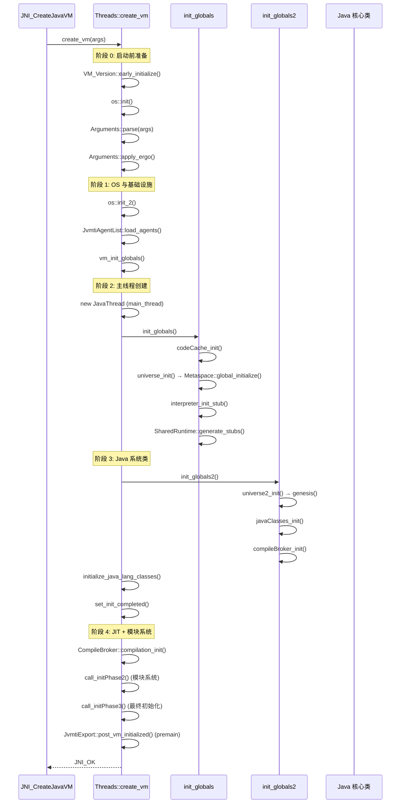

# JVM 完整初始化流程 (Threads::create_vm)

> 上次修改：2026-06-06 15:30
> 本文档对应源码文件：`src/hotspot/share/runtime/threads.cpp`

## 重点关注
- [ ] `Threads::create_vm()` 的 6 阶段执行流程
- [ ] `init_globals()` 中 27 项子系统的初始化顺序
- [ ] `init_globals2()` 中 Java 类加载和编译器初始化
- [ ] `vm_init_globals()` 中的互斥锁和全局数据
- [ ] 第一阶段标志验证（范围验证 + 约束验证）
- [ ] CPU 特性检测与 JIT 编译的影响
- [ ] Metaspace::post_initialize() 水位线重置
- [ ] 三维评估：关键子系统的设计权衡

`Threads::create_vm()` 是整个 JVM 初始化的核心函数，按严格顺序调用各子系统初始化。

## 初始化阶段概览



## 第一阶段：启动前准备

```cpp
VM_Version::early_initialize();        // CPU 特性检测
NonJavaThread::init();                 // 非 Java 线程基础结构
ThreadLocalStorage::init();            // TLS
ostream_init();                        // 输出流模块
Arguments::process_sun_java_launcher_properties(args);
os::init();                            // OS 模块 (页大小, 信号处理)
Arena::initialize_chunk_pool();        // CHeap Arena 内存池
Arguments::init_system_properties();
JDK_Version_init();
LogConfiguration::initialize();
Arguments::parse(args);                // ★ 解析 JVM 参数
MemTracker::initialize();
os::init_before_ergo();
Arguments::apply_ergo();               // ★ 人体工程学自动调优
JVMFlagLimit::check_all_ranges();
JVMFlagLimit::check_all_constraints(AfterErgo);
```

### CPU 特性检测 — VM_Version::early_initialize()

x86 平台的 `early_initialize()` 是空操作 — 实际 CPU 检测推迟到 `init_globals()` 中的 `VM_Version_init()`。通过 CPUID 指令读取寄存器的特征位并存储为位图 `_features` 和 `_cpu_features`。

**具体检测的特征（部分示例）:**

| 特征标志 | 位 | 说明 | 用途 |
|---------|----|------|------|
| CPU_SSE4_2 | 12 | SSE 4.2 流式扩展 | 字符串处理优化 |
| CPU_AVX | 18 | 高级向量扩展 (256-bit) | 数组拷贝, 填充 |
| CPU_AVX2 | 19 | AVX2 整型向量 | 更宽 SIMD |
| CPU_AES | 20 | AES-NI 指令 | 加密硬件加速 |
| CPU_AVX512F | 27 | AVX-512 基础 | 更宽向量化 |
| CPU_SHA | 34 | SHA-1/SHA-256 指令 | MessageDigest 加速 |
| CPU_AVX10_1 | 61 | AVX10.1 统一向量架构 | 统一 AVX-512 功能 |
| CPU_HYBRID | 64 | 混合架构 (P-core+E-core) | 调度策略 |

这些特征直接影响 JIT 编译器的指令选择: 如果检测到 AVX2，C2 编译器使用 256 位 YMM 寄存器；否则回退到 SSE 128 位 XMM 寄存器。

### 标志范围验证与标志约束验证

**源文件**: `src/hotspot/share/runtime/flags/jvmFlagLimit.cpp`

#### 范围验证 (Range Check)

验证标志的数值是否在声明的 `[min, max]` 区间内。

**例子 — `ObjectAlignmentInBytes`**:
```cpp
product(int, ObjectAlignmentInBytes, 8, ...)
         range(8, 256)
         constraint(ObjectAlignmentInBytesConstraintFunc, AtParse)
```

#### 约束验证 (Constraint Check)

约束是函数回调, 验证标志值的语义正确性。约束分阶段执行:

| 阶段 | 执行时机 |
|------|---------|
| `AtParse` | 参数解析时立即检查 |
| `AfterErgo` | `Arguments::apply_ergo()` 之后 |
| `AfterMemoryInit` | `universe_init()` 中元空间初始化后 |

**例子 — `ObjectAlignmentInBytesConstraintFunc`**:
```cpp
JVMFlag::Error ObjectAlignmentInBytesConstraintFunc(int value, bool verbose) {
  if (!is_power_of_2(value)) {
    return JVMFlag::VIOLATES_CONSTRAINT;  // 必须 2 的幂
  }
  if (value > os::vm_page_size()) {
    return JVMFlag::VIOLATES_CONSTRAINT;  // 不能超过页大小
  }
  return JVMFlag::SUCCESS;
}
```

**完整执行流程**:
```
Arguments::parse() → 解析每个标志
  └─ 如果有 range: check_range() → 值必须在 [min, max] 内
  └─ 如果有 AtParse 约束: check_constraint(AtParse)

Arguments::apply_ergo() → 自适应调整（可能修改标志值）

JVMFlagLimit::check_all_ranges()      → 二次验证所有标志范围
JVMFlagLimit::check_all_constraints(AfterErgo) → 执行 AfterErgo 约束
```

### 三维评估：参数系统三阶段设计

#### 这样实现的好处
- **分阶段验证**：早期（AtParse）快速发现配置错误，晚期（AfterErgo）允许自适应调整后再次验证
- **范围+约束分离**：简单范围用声明式 `range()`，复杂语义用回调函数 `constraint()`
- **自适应 (Ergo)**：自动选择最佳 GC、堆大小等，用户无需手动指定

#### 是否有更好的方案
- **单阶段全量验证**：简单但无法处理自适应参数调整
- **纯声明式约束**：减少代码但无法表达复杂条件（如 `value > os::vm_page_size()`）
- **延迟约束（AfterMemoryInit）**：某些约束（如压缩指针相关）需要等待堆和元空间初始化后才能验证

#### 不这么实现的问题
- **无验证**：错误参数值导致 JVM 在运行时意外 crash 或性能退化
- **无自适应**：用户需要手动指定所有参数，对初学者极不友好
- **无分阶段**：自适应调整后如果跳过二次验证，可能产生无效参数组合

## 第二阶段：核心初始化

```cpp
os::init_2();                             // OS 第二阶段 (mmap 限制, 随机化)
SafepointMechanism::initialize();         // SafePoint 机制
Arguments::adjust_after_os();             // OS 后参数调整
ostream_init_log();                       // 日志输出流
JvmtiAgentList::load_agents();            // 加载 -agentlib/-agentpath 代理
```

### os::init_2() — mmap 限制与随机化

**源文件**: `src/hotspot/os/linux/os_linux.cpp` line 4528

在 Linux 上执行:
1. `os::Posix::init_2()` — 检查 `CLOCK_MONOTONIC` 支持
2. `PosixSignals::init()` — 建立信号处理 (SIGSEGV, SIGBUS, SIGFPE)
3. `set_minimum_stack_sizes()` — 计算最小栈大小
4. `Linux::sched_getcpu_init()` — 检测 `getcpu()` 系统调用
5. NUMA 初始化: 如果启用 `UseNUMA`/`UseNUMAInterleaving`, 调用 `numa_init()`
6. mmap 地址随机化: `os::attempt_reserve_memory_between()` 使用 FastRandom 选择最多 32 个 attach 点

**mmap 随机化示例**:
```
未随机化时:
  Metaspace 类空间基址 = 固定 0x0000000800000000
  → 攻击者更易预测内存布局 → ASLR 失效

随机化后:
  Metaspace 类空间基址 = 0x00007f1234000000 (每次启动不同)
  → 地址空间布局随机化, 增强安全性
```

## 第三阶段：创建主线程

```cpp
_number_of_threads = 0;
_number_of_non_daemon_threads = 0;

vm_init_globals();                        // 全局互斥锁, 事件日志, 基本类型

JavaThread* main_thread = new JavaThread();  // 创建主 Java 线程
main_thread->set_thread_state(_thread_in_vm);
main_thread->initialize_thread_current();
main_thread->record_stack_base_and_size();
main_thread->set_active_handles(JNIHandleBlock::allocate_block());

ObjectMonitor::Initialize();              // 对象监视器
ObjectSynchronizer::initialize();         // 对象同步
```

### vm_init_globals() 详情

**源文件**: `src/hotspot/share/runtime/init.cpp` line 107

```cpp
void vm_init_globals() {
  check_ThreadShadow();           // 验证 ThreadShadow 大小
  basic_types_init();             // 基本类型大小验证
  eventlog_init();                // 事件日志环形缓冲区
  mutex_init();                   // 所有全局互斥锁 (50+ 个)
  universe_oopstorage_init();     // OopStorage 后端
  perfMemory_init();              // 性能计数器的 mmap 文件
  SuspendibleThreadSet_init();    // GC 可挂起线程集
  ExternalsRecorder_init();       // 外部地址记录器
}
```

#### basic_types_init()
Debug 模式下的静态断言，验证基本 JVM 类型大小与平台预期一致。
```
sizeof(intx) == 8, sizeof(jlong) == 8, sizeof(jint) == 4, ...
```

#### eventlog_init()
创建 10+ 个 `StringEventLog` 环形缓冲区（Events, Exceptions, Deoptimization, VM Operations, Class Loading 等）。

#### mutex_init()
创建 VM 内部 50+ 个互斥锁和 Monitor:
```cpp
DEFINE_MUTEX(Metaspace_lock)          // Metaspace Chunk 分配锁
DEFINE_MUTEX(Threads_lock)            // 线程列表修改锁
DEFINE_MUTEX(ClassLoaderDataGraph_lock) // CLD 图遍历锁
DEFINE_MUTEX(Compile_lock)            // 编译队列锁
DEFINE_MUTEX(SymbolTable_lock)        // 符号表锁
DEFINE_MONITOR(VMOperationQueue_lock) // VM 操作队列 Monitor
// ... 更多
```

## 第四阶段：全局初始化 (init_globals)

`init_globals()` 共调用 **27 项**子系统初始化:

```
init_globals()
  ├─ management_init()                     // JMX Management
  ├─ JvmtiExport::initialize_oop_storage() // JVMTI OopStorage
  ├─ bytecodes_init()                      // 字节码定义和属性
  ├─ classLoader_init1()                   // 类加载器第一阶段
  ├─ compilationPolicy_init()              // 编译策略
  ├─ codeCache_init()                      // 代码缓存 (3 个 CodeHeap)
  ├─ VM_Version_init()                     // ★ CPU 完整特性 (CPUID)
  ├─ icache_init2()                        // 指令缓存刷新
  ├─ initialize_stub_info()                // Stub 例程信息
  ├─ preuniverse_stubs_init()              // Universe 前的 Stub
  ├─ universe_init()                       // ★★ 堆 + Metaspace
  │    ├─ GCConfig::arguments()->initialize_heap_sizes()
  │    ├─ Universe::initialize_heap()
  │    ├─ Metaspace::global_initialize()   // ← ★ 元空间
  │    ├─ MetaspaceCounters
  │    ├─ StringTable::create_table()
  │    ├─ ClassLoaderData::init_null_class_loader_data()
  │    └─ SymbolTable::create_table()
  ├─ AOTCodeCache::init2()
  ├─ AsyncLogWriter::initialize()
  ├─ initial_stubs_init()
  ├─ AOTCodeCache::init_early_stubs_table()
  ├─ SharedRuntime::generate_initial_stubs()
  ├─ gc_barrier_stubs_init()               // GC 屏障 (G1 SATB, ZGC)
  ├─ continuations_init()                  // 虚拟线程支持
  ├─ continuation_stubs_init()
  ├─ SharedRuntime::generate_jfr_stubs()   // JFR Stub
  ├─ interpreter_init_stub()               // 解释器 Stub
  ├─ accessFlags_init()
  ├─ InterfaceSupport_init()
  ├─ VMRegImpl::set_regName()
  ├─ SharedRuntime::generate_stubs()       // 运行时完整 Stub
  ├─ AOTCodeCache::init_shared_blobs_table()
  └─ SharedRuntime::init_adapter_library()
```

## 第五阶段：init_globals2() + Java 系统类

```cpp
status = init_globals2();
```

`init_globals2()` 共 **17 项**:

```
init_globals2()
  ├─ universe2_init()                     // ★ 加载核心 Java 类
  ├─ javaClasses_init()                   // ★ 计算 Java 类字段偏移
  ├─ interpreter_init_code()              // 解释器代码生成
  ├─ referenceProcessor_init()            // 引用处理策略
  ├─ jni_handles_init()
  ├─ vmStructs_init()
  ├─ vtableStubs_init()
  ├─ compilerOracle_init()
  ├─ dependencyContext_init()
  ├─ dependencies_init()
  ├─ compileBroker_init()                 // ★ JIT 编译代理
  ├─ JVMCI::initialize_globals()
  ├─ TrainingData::initialize()
  ├─ universe_post_init()                 // 预分配异常等
  ├─ compiler_stubs_init()
  ├─ final_stubs_init()
  └─ MethodHandles::generate_adapters()   // 方法句柄适配器
```

### Java 类镜像 — javaClasses_init()

**什么是 "类镜像" (Class Mirror)?**

```
Metaspace (堆外)                    Java 堆
┌───────────────────┐           ┌──────────────────────┐
│  Klass 元数据       │           │  java.lang.Class oop  │ ← 镜像
│  - vtable           │  ──────→ │  - klass (注入字段)    │
│  - itable           │  指向     │  - 静态字段            │
│  - 方法元数据        │           │  - name, module       │
│  (C++ 对象,         │           │  (Java 对象,          │
│   不受 GC 管理)     │           │   受 GC 管理)          │
└───────────────────┘           └──────────────────────┘
```

### 引用处理 — referenceProcessor_init()

Java 有 4 种引用类型，由 `ReferenceProcessor` 在 GC 时处理:

| Java 类 | 内部标识 | 行为 |
|---------|---------|------|
| `SoftReference` | `REF_SOFT` | 内存不足时回收, LRU 策略控制 |
| `WeakReference` | `REF_WEAK` | 每次 GC 只被弱引用即回收 |
| `PhantomReference` | `REF_PHANTOM` | 对象已终结但内存尚未回收时入队 |
| `FinalReference` | `REF_FINAL` | finalize 机制内部引用 |

## 第六阶段：后初始化

```cpp
VMThread::create();                    // VM 线程 (GC 和 VM 操作)
initialize_java_lang_classes(main_thread); // 初始化 java.lang 核心类
set_init_completed();                  // 标记初始化完成

Metaspace::post_initialize();          // ← 重置 GC 水位线
LogConfiguration::post_initialize();

// 启动服务线程
os::initialize_jdk_signal_support();   // 信号处理
AttachListener::vm_start();            // JVM Attach 监听器
Management::initialize();              // JMX 管理
```

### Metaspace::post_initialize()

```cpp
void Metaspace::post_initialize() {
  MetaspaceGC::post_initialize();
}
```

将 `_capacity_until_GC` 从初始化期间的 `MaxMetaspaceSize` (禁止 GC) 重置为实际值:

```cpp
void MetaspaceGC::post_initialize() {
  _capacity_until_GC = MAX2(MetaspaceUtils::committed_bytes(), MetaspaceSize);
}
```

### 三维评估：后初始化水位线重置

#### 这样实现的好处
- **初始化期间禁止 GC**：类加载阶段的频繁 GC 会严重拖慢 JVM 启动
- **平滑过渡**：`post_initialize()` 使用 `MAX2(committed, MetaspaceSize)` 确保不会在第一次分配时立刻触发 GC
- **可预测行为**：第一次 GC 发生在 `committed > MetaspaceSize` 时，约 21MB

#### 是否有更好的方案
- **从 0 开始**：`_capacity_until_GC = 0` 导致每次分配都触发 GC，不可接受
- **基于经验公式**：根据应用类型（批处理、Web 服务）设置不同水位线
- **固定水位线**：简单但无法适应不同应用的元数据分配模式

#### 不这么实现的问题
- **永不触发 GC**：如果 `MaxMetaspaceSize` 无限大且不重置水位线，Metaspace 无限制增长
- **过早触发 GC**：如果 `post_initialize()` 设置过小的 `_capacity_until_GC`，刚启动就 GC

## 初始化阶段速查

| 阶段 | 行号 | 核心操作 |
|------|------|---------|
| 0: 预备 | 454-520 | CPU 检测, 参数解析, ergo 自适应 |
| 1: OS 与基础设施 | 521-555 | 信号处理, Agent 加载, 全局数据 |
| 2: 主线程创建 | 567-630 | 主线程对象, init_globals() |
| 3: Java 系统类 | 615-750 | init_globals2(), VMThread, 核心类 |
| 4: JIT + 模块系统 | 787-890 | 编译器初始化, 模块系统, premain |
| 5: 结尾 | 901-925 | JVM 初始化完成 |

## 引用代码索引

以下代码块中的引用文件路径使用**相对路径**（相对于工程根目录）:
- `src/hotspot/share/runtime/threads.cpp` — Threads::create_vm() 完整实现 (line 450)
- `src/hotspot/share/runtime/init.cpp` — vm_init_globals() (line 107), init_globals() (line 119), init_globals2() (line 172)
- `src/hotspot/share/runtime/flags/jvmFlagLimit.cpp` — 标志范围验证和约束验证
- `src/hotspot/cpu/x86/vm_version_x86.hpp` — CPU_FEATURE_FLAGS 枚举
- `src/hotspot/cpu/x86/vm_version_x86.cpp` — get_processor_features()
- `src/hotspot/os/linux/os_linux.cpp` — os::init_2() (line 4528)
- `src/hotspot/share/runtime/os.cpp` — os::attempt_reserve_memory_between()
- `src/hotspot/share/runtime/arguments.cpp` — Arguments::adjust_after_os()
- `src/hotspot/share/runtime/mutexLocker.cpp` — mutex_init()
- `src/hotspot/share/utilities/events.cpp` — Events::init()
- `src/hotspot/share/utilities/globalDefinitions.cpp` — basic_types_init()
- `src/hotspot/share/runtime/objectMonitor.cpp` — ObjectMonitor::Initialize()
- `src/hotspot/share/runtime/synchronizer.cpp` — ObjectSynchronizer::initialize()
- `src/hotspot/share/memory/metaspace.cpp` — Metaspace::post_initialize(), MetaspaceGC::post_initialize()
- `src/hotspot/share/classfile/javaClasses.cpp` — JavaClasses::compute_offsets()
- `src/hotspot/share/gc/shared/referenceProcessor.cpp` — ReferenceProcessor::init_statics()
