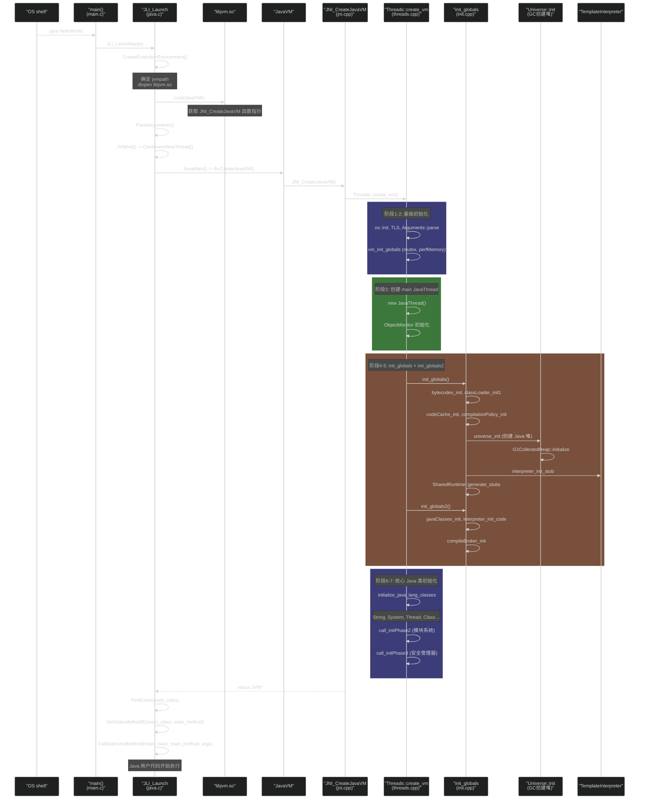
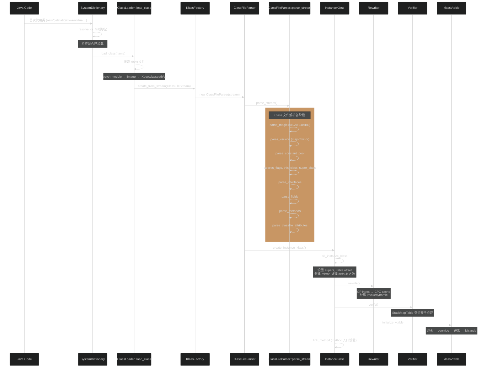
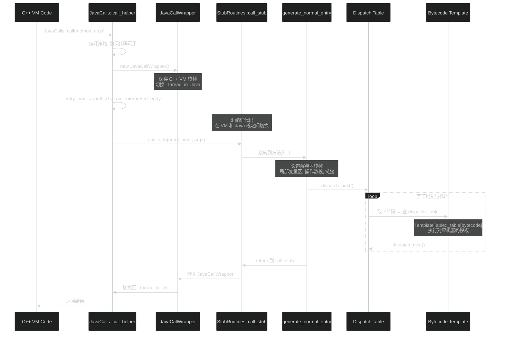
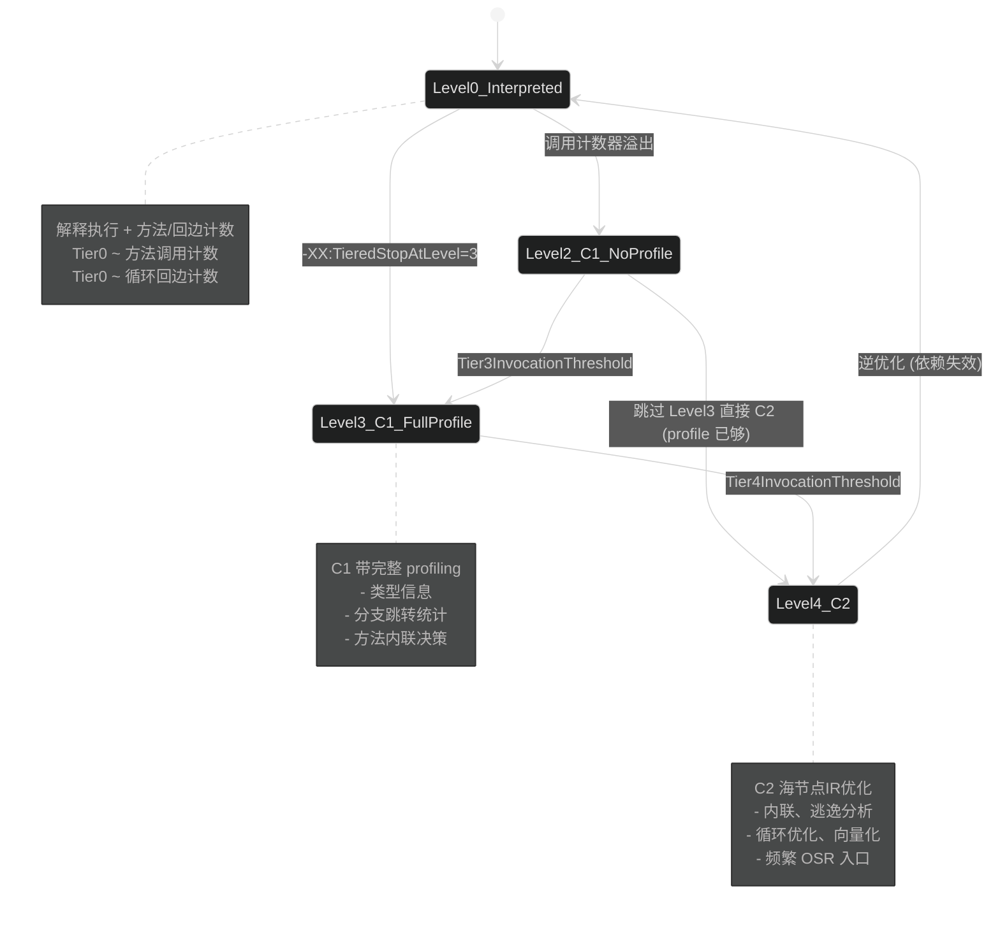
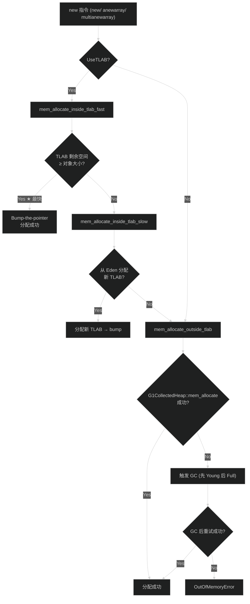
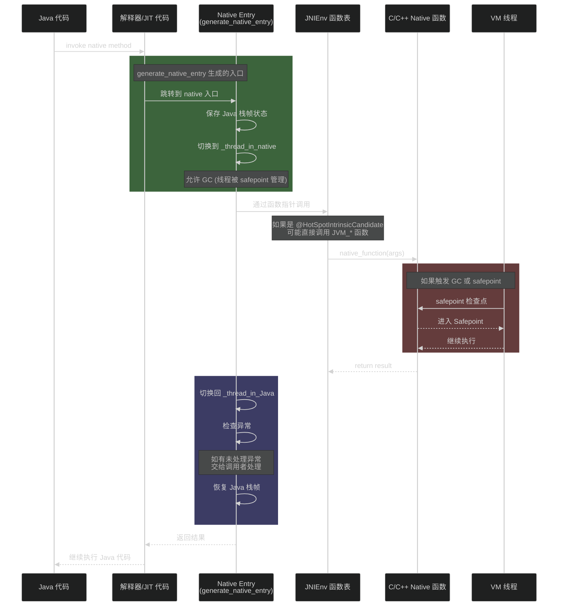
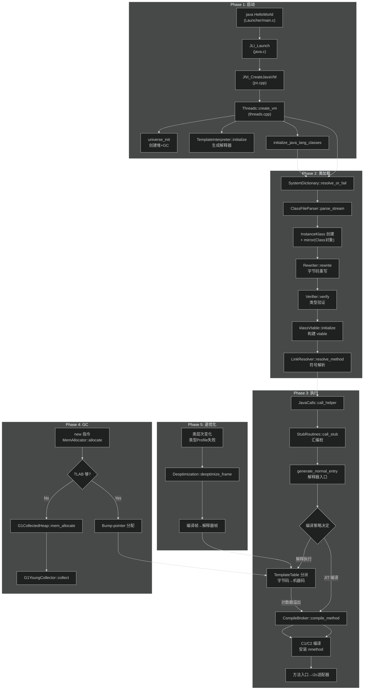

# 场景分析：Java 代码在 JVM 中的详细执行过程

> 上次修改：2026-06-14 10:37

- [x] JVM 启动阶段的 7 阶段初始化序列
- [x] 类加载：从 .class 文件解析到 InstanceKlass 构建
- [x] 字节码重写与验证
- [x] 链接：vtable/itable 构建与符号解析
- [x] TemplateInterpreter 表驱动解释执行
- [x] JIT 编译：Tiered 策略与 C2 编译管道
- [x] 对象分配与 G1 GC
- [x] Native 方法调用与 JNI 转换
- [x] 逆优化 (Deoptimization)

---

## 场景描述

Java 代码在 JVM 中的执行过程是一个多阶段、多层级的复杂系统工程。从用户编写一个 `.java` 源文件到实际在 CPU 上执行机器码，大致经历以下阶段：

1. **编译期**：`javac` 将 `.java` 源文件编译为 `.class` 字节码文件（JVM 规范定义的二进制格式）
2. **启动期**：`java` 命令的 C 语言 launcher 加载 `libjvm.so`，调用 `JNI_CreateJavaVM` 创建 JVM 实例
3. **类加载期**：JVM 通过 `ClassLoader` 加载 `.class` 文件，解析为 JVM 内部的数据结构 `InstanceKlass`
4. **链接期**：字节码重写、验证、vtable/itable 构建、常量池符号解析
5. **执行期**：方法通过 `TemplateInterpreter` 解释执行字节码，或由 JIT 编译器 (C1/C2) 编译为原生机器码执行
6. **GC 期**：JVM 自动管理内存，对象分配失败时触发垃圾收集

本文从 Hotspot JVM 源码层面，逐阶段追溯这一完整生命周期。

---

## 涉及模块

| 模块 | 角色 | 源码路径 |
|------|------|----------|
| Launcher (libjli) | 命令行解析、JVM 动态加载 | `src/java.base/share/native/libjli/` |
| Hotspot Prims (JNI) | JVM 创建入口、JNI/Native 桥接 | `src/hotspot/share/prims/jni.cpp` |
| Hotspot Runtime | 线程管理、初始化序列、JavaCalls | `src/hotspot/share/runtime/` |
| Hotspot Classfile | 类加载、解析、验证 | `src/hotspot/share/classfile/` |
| Hotspot Oops | 元数据模型 (Klass/Method/ConstantPool) | `src/hotspot/share/oops/` |
| Hotspot Interpreter | 解释器引擎、链接解析 | `src/hotspot/share/interpreter/` |
| Hotspot Compiler C2 | Sea-of-Nodes 优化编译器 | `src/hotspot/share/opto/` |
| Hotspot Compiler C1 | HIR 轻量编译器 | `src/hotspot/share/c1/` |
| Hotspot CompileBroker | 编译队列与调度 | `src/hotspot/share/compiler/` |
| Hotspot Code | nmethod、CodeCache、依赖管理 | `src/hotspot/share/code/` |
| Hotspot GC G1 | G1 垃圾收集器 | `src/hotspot/share/gc/g1/` |
| Hotspot CPU Port (x86) | x86 平台相关：模板、桩代码 | `src/hotspot/cpu/x86/` |

---

## 一、启动阶段：从 `java` 命令到 JVM 就绪

### 1.1 整体启动链路



### 1.2 核心源码解读：`JNI_CreateJavaVM`

`JNI_CreateJavaVM` 是 Hotspot 对外的 JVM 创建入口，定义在 `jni.cpp`：

```cpp
// src/hotspot/share/prims/jni.cpp ~ line 3706
_JNI_IMPORT_OR_EXPORT_ jint JNICALL
JNI_CreateJavaVM(JavaVM **vm, void **penv, void *args) {
  jint result = JNI_ERR;
  // 原子 CAS 防止重复创建 JVM
  if (Atomic::xchg(&vm_created, true) == true) {
    return JNI_EEXIST;
  }
  result = JNI_CreateJavaVM_inner(vm, penv, args);
  return result;
}
```

**三维评估：**

| 维度 | 分析 |
|------|------|
| **好处** | JNI Invocation API 是标准接口，与语言规范无关。通过 `Atomic::xchg` 原子操作确保单例创建，线程安全。 |
| **替代方案** | 可通过 JVMTI agent 或 `jvmti_env` 在 JVM 启动后介入，但创建入口必须是 `JNI_CreateJavaVM`。 |
| **风险** | 若 `Threads::create_vm` 中途失败，JVM 状态可能不一致。通过 `vm_created` 防止重复调用但未提供完整回滚机制。 |

### 1.3 `Threads::create_vm` 的 7 阶段初始化

这是 JVM 初始化的核心函数（`src/hotspot/share/runtime/threads.cpp`），按严格依赖顺序执行：

```
阶段1: 基础环境初始化
  ├── VM_Version::initialize()      ← CPU 特性检测
  ├── os::init()                     ← OS 抽象层
  ├── TLS (Thread Local Storage)    ← 线程局部存储
  ├── ostream_init()                ← 输出流
  ├── Arena::init()                 ← 内存 Arena
  ├── Arguments::parse(args)        ← JVM 参数解析
  └── os::init_2()                  ← OS 二级初始化

阶段2: vm_init_globals()
  ├── mutex_init()                  ← Mutex/Lock 初始化
  ├── perfMemory_init()             ← 性能计数器
  └── SuspendRetry_init()

阶段3: 创建 main JavaThread + 同步基础设施
  ├── new JavaThread(&thread_entry, ...)  ← 主 Java 线程
  ├── ObjectSynchronizer::initialize()    ← 偏置锁初始化
  └── Handshake::initialize()

阶段4: init_globals() — 核心子系统初始化
  ├── management_init()
  ├── bytecodes_init()              ← 字节码定义表
  ├── classLoader_init1()           ← ClassLoader 元数据
  ├── compilationPolicy_init()      ← 编译策略
  ├── codeCache_init()              ← CodeCache 初始化
  ├── VM_Version_init()             ← 再次检测 CPU 特性
  ├── icache_init2()                ← CPU 指令缓存
  ├── universe_init()               ← ★ Java 堆 + GC 启动
  ├── interpreter_init_stub()       ← 解释器桩代码
  ├── SharedRuntime::generate_stubs()← 运行时桩 (i2c/c2i 适配器)
  └── continuations_init()          ← 协程 (Project Loom)

阶段5: init_globals2() — 二级子系统
  ├── universe2_init()              ← 加载 Object, Class, String 等原始类
  ├── javaClasses_init()            ← Java ↔ C++ 类映射
  ├── interpreter_init_code()       ← 解释器完整代码生成
  ├── referenceProcessor_init()
  ├── compileBroker_init()          ← 编译线程启动
  ├── universe_post_init()
  └── MethodHandles::generate_adapters()

阶段6: initialize_java_lang_classes() — 核心 Java 类
  ├── java.lang.String
  ├── java.lang.System
  ├── java.lang.Class
  ├── java.lang.ThreadGroup / Thread
  ├── java.lang.Module
  └── 关键异常类 (OOM, NPE, CCE, SOE...)

阶段7: 模块系统 + 安全管理器
  ├── call_initPhase2()             ← java.lang.System.initPhase2()
  │   ├── 模块系统初始化
  │   ├── StackWalker, SecurityManager
  │   └── SystemClassLoader.initPhase2
  └── call_initPhase3()             ← java.lang.System.initPhase3()
      ├── 系统类加载器
      └── Thread.currentThread().setContextClassLoader()
```

---

## 二、类加载阶段：从 `.class` 文件到 `InstanceKlass`

### 2.1 类加载整体流程



### 2.2 核心源码解读

#### 2.2.1 `ClassFileParser::parse_stream` — Class 文件解析核心

```cpp
// src/hotspot/share/classfile/classFileParser.cpp ~ line 5477
void ClassFileParser::parse_stream(const ClassFileParserContext* ctx, ...) {
  // 1. 魔数检查
  u4 magic = cfs->get_u4();
  guarantee_property(magic == JAVA_CLASSFILE_MAGIC, "bad magic number");
  
  // 2. 版本号
  u2 minor_version = cfs->get_u2();
  u2 major_version = cfs->get_u2();
  
  // 3. 常量池 (核心数据结构)
  u2 cp_size = cfs->get_u2();
  parse_constant_pool(ctx, cp_size, ...);
  
  // 4. 基本类信息
  _access_flags.set_flags(cfs->get_u2() & JVM_ACC_WRITTEN_FLAGS);
  _this_class_index = cfs->get_u2();
  _super_class_index = cfs->get_u2();
  
  // 5. 接口
  u2 itfs_len = cfs->get_u2();
  parse_interfaces(ctx, itfs_len);
  
  // 6. 字段
  u2 fields_len = cfs->get_u2();
  parse_fields(ctx, fields_len, ...);
  
  // 7. 方法 (★ 包含 Code 属性 → 字节码)
  u2 methods_len = cfs->get_u2();
  parse_methods(ctx, methods_len, ...);
  
  // 8. 类属性
  parse_classfile_attributes(ctx, ...);
}
```

**三维评估：**

| 维度 | 分析 |
|------|------|
| **好处** | 严格按照 JVM 规范顺序解析，确保二进制兼容性。所有数据以 `u1/u2/u4` 格式读取，跨平台一致。 |
| **替代方案** | ASM/ByteBuddy 等外部库可以从外部解析 class 文件，但 JVM 内部必须从原始设计。 |
| **风险** | 恶意 class 文件可在解析阶段分配大量内存（如超长常量池），需要安全保障。 |

#### 2.2.2 `fill_instance_klass` — InstanceKlass 构建

```cpp
// src/hotspot/share/classfile/classFileParser.cpp ~ line 5045
void ClassFileParser::fill_instance_klass(InstanceKlass* ik, ...) {
  // 1. 设置类名
  ik->set_name(name());
  
  // 2. 将解析结果注册到 ClassLoaderData
  _loader_data->add_class(ik);
  
  // 3. 转移元数据 (字段、方法、常量池)
  apply_parsed_class_metadata(ik, ...);
  
  // 4. 建立父类关系
  ik->initialize_supers(super_klass, ...);
  
  // 5. 设置 itable 偏移量表
  ik->setup_itable_offset_table();
  
  // 6. 创建 Java 镜像 (java.lang.Class 实例)
  java_lang_Class::create_mirror(ik, ...);
  
  // 7. 生成 default 方法
  DefaultMethods::generate_default_methods(ik);
  
  // 8. 验证继承关系
  check_super_class_access(ik, ...);
  check_super_interface_access(ik, ...);
  check_final_method_override(ik, ...);
}
```

---

## 三、链接阶段

### 3.1 字节码重写

```cpp
// src/hotspot/share/interpreter/rewriter.cpp ~ line 568
void Rewriter::rewrite(InstanceKlass* klass, ...) {
  Rewriter rw(klass, ...);
  
  // 1. 为常量池创建常量池缓存 (Constant Pool Cache)
  rw.make_constant_pool_cache(klass);
  
  // 2. 遍历所有方法的字节码
  for (int i = 0; i < klass->methods()->length(); i++) {
    Method* method = klass->methods()->at(i);
    rw.rewrite_bytecodes(method, ...);
    rw.rewrite_jsrs(method, ...);  // 内联 jsr/ret 子例程
  }
}

void Rewriter::rewrite_bytecodes(Method* method, ...) {
  Bytecodes::Code code;
  // 将每条字节码操作数中的常量池索引替换为缓存索引
  while ((code = method->next_bytecode_or_null(bci)) != Bytecodes::_illegal) {
    switch (code) {
      case Bytecodes::_invokevirtual:
      case Bytecodes::_invokespecial:
      case Bytecodes::_invokestatic:
      case Bytecodes::_invokeinterface:
        // 替换 CP index → CPC index
        rewrite_an_invokeletter(method, bci, ...);
        break;
      // ... 其他指令
    }
  }
}
```

**目的**：重写后解释器在执行字节码时通过缓存的索引直接访问常量池缓存，避免每次从常量池索引解析符号引用。

### 3.2 vtable 构建

```cpp
// src/hotspot/share/oops/klassVtable.cpp ~ line 161
void klassVtable::initialize_vtable() {
  // 1. 从父类复制 vtable 条目
  initialize_from_super();
  
  // 2. 遍历本类方法
  for (int i = 0; i < ik->methods()->length(); i++) {
    Method* m = ik->methods()->at(i);
    if (m->is_private() || m->is_static() || m->is_final()) continue;
    
    // 检查是否 override 父类方法
    update_inherited_vtable(m);
  }
  
  // 3. 处理 default 方法 & Miranda 方法
  fill_in_mirandas();
}
```

### 3.3 方法符号解析 (`LinkResolver::resolve_method`)

```cpp
// src/hotspot/share/interpreter/linkResolver.cpp ~ line 753
void LinkResolver::resolve_method(...) {
  // 步骤1-2: invokevirtual 不能调用接口方法 + 常量池标签检查
  assert(byte == Bytecodes::_invokevirtual, "wrong bytecode");
  assert(cp->tag_at(index).is_method(), "wrong tag");
  
  // 步骤3: 在当前类层次中查找
  lookup_method_in_klasses(resolved_method, klass, name, signature, ...);
  
  // 步骤4: 未找到则在接口中查找
  if (resolved_method.is_null()) {
    lookup_method_in_interfaces(resolved_method, klass, name, signature, ...);
  }
  
  // 步骤5: polymorphic 方法 (MethodHandle)
  if (resolved_method.is_null()) {
    lookup_polymorphic_method(resolved_method, klass, name, signature, ...);
  }
  
  // 步骤6-7: 访问权限检查 + 类加载器约束
  check_method_accessability(resolved_method, ...);
  check_method_loader_constraints(resolved_method, ...);
}
```

---

## 四、字节码解释执行阶段

### 4.1 从 VM 到 Java 方法的调用桥



### 4.2 TemplateInterpreter 的核心机制

Hotspot 的模板解释器使用**表驱动执行**模式：

| 组件 | 作用 | 源码位置 |
|------|------|----------|
| `TemplateTable` | 为每个字节码生成机器码模板 | `src/hotspot/share/interpreter/templateTable.cpp` |
| `TemplateInterpreterGenerator` | 生成方法入口点 (normal/native/empty) | `src/hotspot/cpu/x86/templateInterpreterGenerator_x86_64.cpp` |
| `dispatch table` | 字节码 → 机器码地址的跳转表 | `TemplateInterpreter::_dispatch_table` |
| `TosState` | 栈顶类型状态，优化 dispatch | `templateTable.hpp` 中的枚举 |

**关键实现逻辑：**

```cpp
// src/hotspot/cpu/x86/templateTable_x86.cpp
// 以 _aload_0 (将局部变量0加载到栈顶) 为例
void TemplateTable::aload_0() {
  // 生成 x86 机器码指令
  __ movptr(rax, address(LocalInterpreter::local_addr_at(0, rsi)));  // rsi = locals pointer
  __ push(rax);  // 入栈到操作数栈
  __ dispatch_next(vtos);  // 分派下一指令 (vtos = void type on stack)
}
```

**dispatch table 的 10 个变体**：`vtos, atos, itos, stos, ctos, btos, ztos, ltos, ftos, dtos`，每种对应栈顶类型，在 dispatch_next 时跳过不必要的类型转换。

### 4.3 方法调用的字节码解析 (以 invokevirtual 为例)

```cpp
// src/hotspot/cpu/x86/templateTable_x86.cpp
void TemplateTable::invokevirtual(int byte_no) {
  // 解析运行时信息：方法索引、入口
  const int cache_index = ...;
  const methodData = ...;
  
  // 接收者空检查 (NPE)
  __ null_check(recv);
  
  // 获取接收者的实际 Klass
  __ load_klass(klass, recv);
  
  // vtable 分派: klass->_vtable[vtable_index]->method()
  __ lookup_virtual_method(klass, vtable_index, method_result);
  
  // 跳转到方法入口
  __ jump(method_result->_from_interpreted_entry);
}
```

---

## 五、JIT 编译阶段

### 5.1 Tiered 编译策略



### 5.2 CompilationPolicy — 编译决策

```cpp
// src/hotspot/share/compiler/compilationPolicy.cpp ~ line 852
CompLevel CompilationPolicy::event(...) {
  // 调用计数器和回边计数器
  InvocationCounter* ic = method->invocation_counter();
  InvocationCounter* bc = method->backedge_counter();
  
  if (CompilationMode::is_normal()) {
    if (is_compilation_enabled() && !method->is_not_compilable(CompLevel_full_optimization)) {
      // Tiered 编译决策
      switch (method->highest_tier_compilation()) {
        case CompLevel_none:
          // Tier2/Tier3 阈值检查
          if (threshold > 0 && invocations > threshold) {
            return CompLevel_limited_profile;   // → C1
          }
          break;
        case CompLevel_full_profile:
          if (threshold > 0 && invocations > threshold) {
            return CompLevel_full_optimization;  // → C2
          }
          break;
      }
    }
  }
  
  // 回边计数器 → OSR 编译
  if (backedge_event && ...) {
    return osr_comp_level(method);  // OSR 目标层
  }
  
  return CompLevel_none;  // 继续解释执行
}
```

### 5.3 CompileBroker — 编译任务调度

```cpp
// src/hotspot/share/compiler/compileBroker.cpp ~ line 2191
void CompileBroker::invoke_compiler_on_method(CompileTask* task) {
  Compiler* compiler = task->compiler();
  
  // 创建编译环境
  ciEnv env(task, ...);
  
  // 获取 ciMethod (编译器层面的方法表示)
  ciMethod* target = env.register_method(task->method());
  
  // 执行编译
  if (compiler->is_c2()) {
    CompLevel comp_level = task->comp_level();
    C2Compiler* c2 = (C2Compiler*)compiler;
    c2->compile_method(&env, target, ...);
  } else {
    // C1 编译
    compiler->compile_method(&env, target, ...);
  }
  
  // 成功 → nmethod 安装
  if (!env.failed()) {
    task->method()->set_code(env.code());   // 更新方法入口
    env.code()->make_alive();               // nmethod 变为存活状态
  } else {
    // 失败 → 编译错误处理
    task->method()->set_not_compilable(...);
  }
}
```

### 5.4 C2 编译管道

```
Compile::Compile() — C2 编译器主入口
│
├─ Init: 别名分析 (AliasAnalyzer)、全局值图初始化
│
├─ Parse: 字节码解析 → IR (Sea-of-Nodes) 构建
│   ├─ build_start_state()     ← 起始状态
│   └─ cg->generate()           ← 控制流图生成
│
├─ PhaseRemoveUseless          ← 死代码消除
│
├─ Optimize (main loop, 多次迭代):
│   ├─ PhaseCCP                ← 条件常量传播
│   ├─ PhaseIGVN               ← 全局值编号 (核心优化)
│   ├─ PhaseLoopOpts           ← 循环优化 (剥离/展开/向量化)
│   ├─ PhaseSplitting          ← 条件分裂
│   └─ PhaseMacroExpand        ← 宏展开 (锁消除、Intrinsic)
│
├─ Matcher + Register Allocation:
│   ├─ PhaseCFG                ← 控制流图构建
│   ├─ PhaseChaitin            ← 寄存器分配 (图着色)
│   └─ PhasePeephole           ← 窥孔优化
│
├─ Output: 代码发射
│   ├─ PhaseOutput::emit       ← 机器码生成
│   ├─ 重定位信息
│   ├─ OopMap / 异常表
│   └─ nmethod::new_nmethod    ← 安装
│
└─ 更新方法入口 → from_interpreted_entry = i2c 适配器
```

### 5.5 nmethod 安装

```cpp
// src/hotspot/share/code/nmethod.cpp ~ line 1116
nmethod* nmethod::new_nmethod(const methodHandle& method, ...) {
  // 计算 nmethod 总大小
  int nmethod_size = ...;
  
  // CodeCache 分配
  CodeCache_lock->lock();
  nmethod* nm = new (nmethod_size) nmethod(method, ...);
  
  // 注册编译依赖
  Dependencies::DepStream deps(nm);
  while (deps.next()) {
    if (deps.is_klass_dependency()) {
      klass_dependency->add_dependent_nmethod(nm);
    } else if (deps.is_call_site_dependency()) {
      call_site_dependency->add_dependent_nmethod(nm);
    }
  }
  
  nm->set_state(not_installed);
  CodeCache_lock->unlock();
  
  // 后续由安装流程设置为 alive
  return nm;
}
```

**依赖注册的目的**：当类层次变化（如加载新子类、改变继承关系）时，使依赖该假设的 nmethod 失效并触发逆优化。

### 5.6 OSR (栈上替换)

OSR 允许**正在解释执行的循环**直接切换为编译代码执行：

```
1. 回边计数器溢出 → CompilationPolicy 判定需要 OSR 编译
2. CompileBroker::compile_method(osr_bci=循环头字节码索引, ...)
3. C2 从指定 BCI 开始编译 (不是整个方法)
4. 安装 OSR nmethod (有专门的 OSR 入口)
5. 解释器执行到回边时获取到 OSR nmethod
6. 从回边直接跳转 → OSR 编译代码继续执行
7. 方法退出时正常返回到调用者
```

---

## 六、对象分配与 GC

### 6.1 对象分配三阶段策略



```cpp
// src/hotspot/share/gc/shared/memAllocator.cpp ~ line 326
HeapWord* MemAllocator::mem_allocate(Allocation& allocation) const {
  if (UseTLAB) {
    // 1. TLAB 快速分配 (最频繁路径, 仅 bump pointer)
    HeapWord* mem = mem_allocate_inside_tlab_fast();
    if (mem != nullptr) return mem;
    
    // 2. TLAB 慢速 (当前 TLAB 空间不足)
    mem = mem_allocate_inside_tlab_slow();
    if (mem != nullptr) return mem;
  }
  
  // 3. 堆外部分配 (可能在 GC 前直接分配, 或触发 GC)
  return mem_allocate_outside_tlab();
}
```

### 6.2 G1 Young GC

```cpp
// src/hotspot/share/gc/g1/g1YoungCollector.cpp ~ line 1126
void G1YoungCollector::collect() {
  // 1. Pre-evacuate: 准备收集集
  pre_evacuate_collection_set(...);
  
  // 2. 创建扫描线程状态
  G1ParScanThreadStateSet* per_thread_states = new G1ParScanThreadStateSet(...);
  
  // 3. 执行初始收集集 evacuate
  evacuate_initial_collection_set(per_thread_states);
  //    ├─ 根扫描 (GC roots, Thread stacks, JNI handles)
  //    ├─ 并行 Evacuation (多个线程同时复制存活对象)
  //    │   Eden → Survivor / Old
  //    │   Survivor → Survivor / Old
  //    └─ 更新引用 (G1ScanCard)
  
  // 4. 可选收集集 (超大对象)
  evacuate_optional_collection_set(per_thread_states);
  
  // 5. Post-evacuate
  post_evacuate_collection_set(...);
  
  // 6. IHOP 调节
  policy()->record_young_collection_end(...);
}
```

---

## 七、Native 方法调用与 JNI

### 7.1 调用流程



### 7.2 关键源码

对于 `native` 方法，解释器入口通过 `generate_native_entry` 生成：

```cpp
// src/hotspot/cpu/x86/templateInterpreterGenerator_x86_64.cpp
address TemplateInterpreterGenerator::generate_native_entry() {
  // 1. 保存 Java 栈帧 (callee_saved 寄存器)
  __ save_bcp();          // 字节码指针
  __ save_locals();       // 局部变量指针
  
  // 2. 切换到 _thread_in_native
  __ movl(Address(r15_thread, JavaThread::thread_state_offset()), _thread_in_native);
  
  // 3. JNI transition: 允许 GC/safepoint (TM)
  __ set_last_Java_frame(rsp, rbp, (address)__ pc(), /*r14*/ r13, ...);
  
  // 4. 调用实际的 native 函数
  __ call(RuntimeAddress(entry_point));
  
  // 5. 切换回 _thread_in_Java
  __ movl(Address(r15_thread, JavaThread::thread_state_offset()), _thread_in_Java);
  
  // 6. 异常检查
  __ cmpptr(Address(r15_thread, Thread::pending_exception_offset()), (int32_t)NULL);
  __ jcc(Assembler::notZero, StubRoutines::forward_exception_entry());
  
  // 7. 恢复 Java 帧并返回
  __ restore_locals();
  __ restore_bcp();
  ...
}
```

---

## 八、逆优化 (Deoptimization)

### 8.1 触发场景

| 场景 | 触发条件 | 后果 |
|------|----------|------|
| 类层次变化 | 加载新子类，vtable 假设失效 | 编译代码→解释器 |
| 类型 Profile 失败 | 实际类型与 C2 假设不符 | 编译代码→解释器 |
| Null 检查失败 | 编译代码消除的空检发生 | uncommon trap |
| 偏置锁撤销 | 对象锁竞争加剧 | 取消锁优化 |

### 8.2 核心流程

```cpp
// src/hotspot/share/runtime/deoptimization.cpp ~ line 1885
int Deoptimization::deoptimize_frame(JavaThread* thread, intptr_t* frame_id, ...) {
  RegisterMap reg_map(thread, ...);
  
  // 1. 找到要被逆优化的帧
  frame f = thread->last_frame();
  
  // 2. 收集回退信息
  DeoptInfo* info = fetch_unroll_info_helper(thread, &reg_map);
  //    - 从编译帧提取所有存活变量
  //    - 计算解释器帧布局
  //    - 构造新的解释器帧
  
  // 3. 逐帧转换
  deoptimize_single_frame(thread, f, &reg_map);
  
  // 4. 在解释器中继续执行
  thread->set_vframe_array_head(info->vframe_array_head());
  thread->set_last_Java_frame(...);
}
```

**三维评估：**

| 维度 | 分析 |
|------|------|
| **好处** | 编译代码可以大胆做假设优化（如类层次分析、类型 profile），出错时回退到解释器保证正确性。 |
| **替代方案** | 不做激进优化（C1 风格），或采用更多保护检查（安全但慢）。 |
| **风险** | 频繁逆优化导致性能抖动（"code cache 颠簸"），需要编译策略平衡。 |

---

## 全生命周期总览



---

## 术语表

| 术语 | 定义 |
|------|------|
| **InstanceKlass** | JVM 内部表示一个 Java 类的元数据对象，包含字段、方法、常量池、vtable/itable 等 |
| **ConstantPool / ConstantPoolCache** | 常量池存储类/方法/字段/字符串等符号引用；缓存将符号索引转换为直接索引加速访问 |
| **vtable** | 虚方法表，用于 `invokevirtual` 的快速动态分派 |
| **itable** | 接口方法表，用于 `invokeinterface` 的分派 |
| **TemplateInterpreter** | Hotspot 表驱动解释器，每个字节码预先生成独立的机器码模板 |
| **TosState** | 栈顶状态枚举 (v/a/i/l/f/d/b/c/s/z)，用于 dispatch 时减少类型转换 |
| **nmethod** | 编译后的原生方法代码，存储在 CodeCache 中，包含代码、重定位、OopMap、异常表 |
| **OSR** | 栈上替换，将正在解释循环中的执行切换到编译代码 |
| **TLAB** | 线程本地分配缓冲区，每个线程在 Eden 中预分配一块区域实现无锁分配 |
| **IHOP** | G1 的初始堆占用百分比，用于触发并发标记周期的阈值 |
| **Deoptimization** | 逆优化，从编译代码回退到解释器的机制，用于处理编译期假设失效 |
| **i2c / c2i 适配器** | interpreter-to-compiled / compiled-to-interpreter 的入口适配器，负责栈帧格式转换 |
| **Uncommon Trap** | C2 编译代码中遇到未预期的条件时执行的回退陷阱 |

  - java
  - hotspot
  - jvm
tags:
---

## 引用代码索引

| 文件 | 职责 | 关键函数/类 |
|------|------|-------------|
| `src/hotspot/share/prims/jni.cpp` | JNI 调用 API | `JNI_CreateJavaVM` |
| `src/hotspot/share/runtime/threads.cpp` | VM 初始化 | `Threads::create_vm` |
| `src/hotspot/share/runtime/init.cpp` | 子系统初始化 | `init_globals`, `init_globals2` |
| `src/hotspot/share/classfile/classFileParser.cpp` | Class 文件解析 | `parse_stream`, `fill_instance_klass` |
| `src/hotspot/share/classfile/verifier.cpp` | 字节码验证 | `Verifier::verify` |
| `src/hotspot/share/interpreter/rewriter.cpp` | 字节码重写 | `Rewriter::rewrite` |
| `src/hotspot/share/oops/klassVtable.cpp` | vtable 构建 | `initialize_vtable` |
| `src/hotspot/share/interpreter/linkResolver.cpp` | 方法符号解析 | `resolve_method` |
| `src/hotspot/share/runtime/javaCalls.cpp` | Java 方法调用 | `JavaCalls::call_helper` |
| `src/hotspot/share/interpreter/templateTable.cpp` | 字节码模板 | `TemplateTable::initialize` |
| `src/hotspot/cpu/x86/templateTable_x86.cpp` | x86 模板实现 | `aload_0`, `invokevirtual` 等 |
| `src/hotspot/share/compiler/compilationPolicy.cpp` | 编译策略 | `CompilationPolicy::event` |
| `src/hotspot/share/compiler/compileBroker.cpp` | 编译调度 | `compile_method`, `invoke_compiler_on_method` |
| `src/hotspot/share/opto/compile.cpp` | C2 编译主流程 | `Compile::Compile` |
| `src/hotspot/share/code/nmethod.cpp` | 编译代码管理 | `new_nmethod` |
| `src/hotspot/share/gc/shared/memAllocator.cpp` | 对象分配 | `MemAllocator::mem_allocate` |
| `src/hotspot/share/gc/g1/g1YoungCollector.cpp` | G1 Young GC | `G1YoungCollector::collect` |
| `src/hotspot/share/runtime/deoptimization.cpp` | 逆优化 | `deoptimize_frame` |
| `src/java.base/share/native/libjli/java.c` | Launcher 主流程 | `JLI_Launch`, `JavaMain` |
