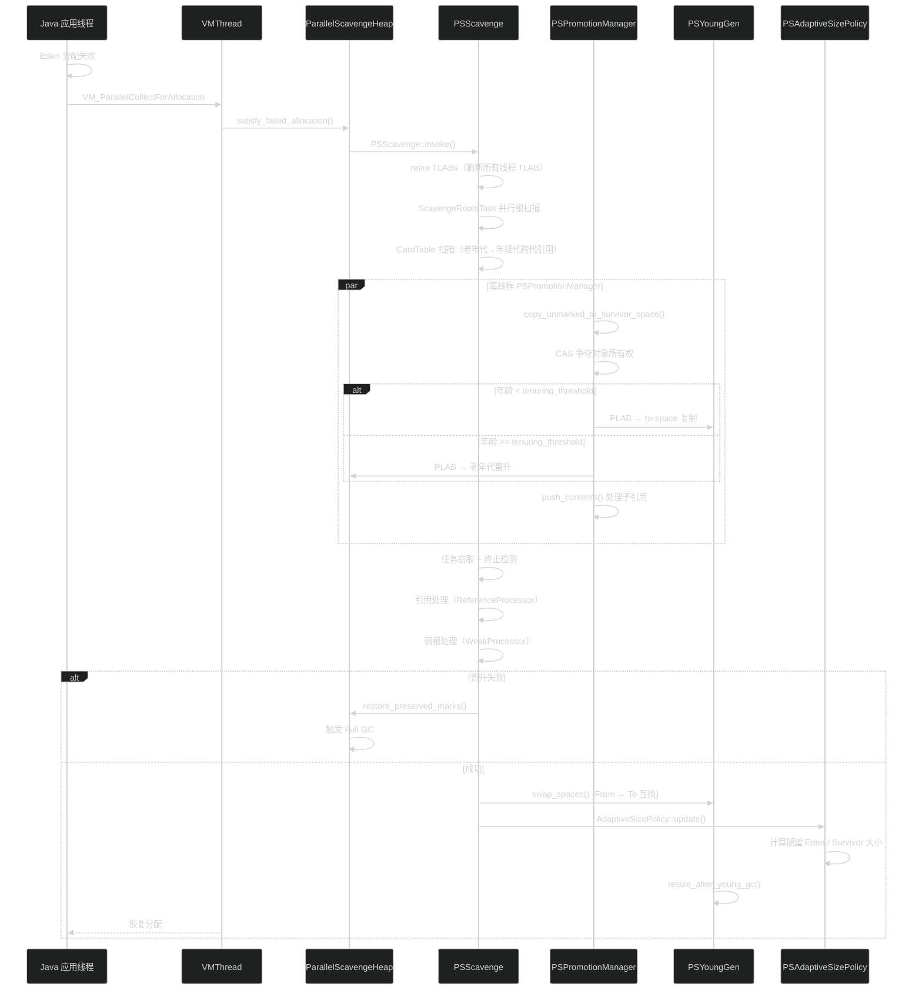
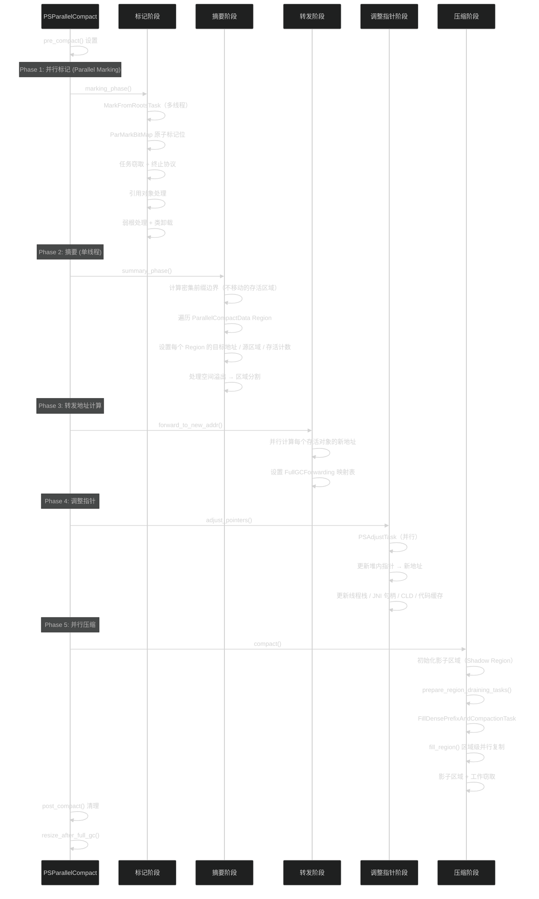
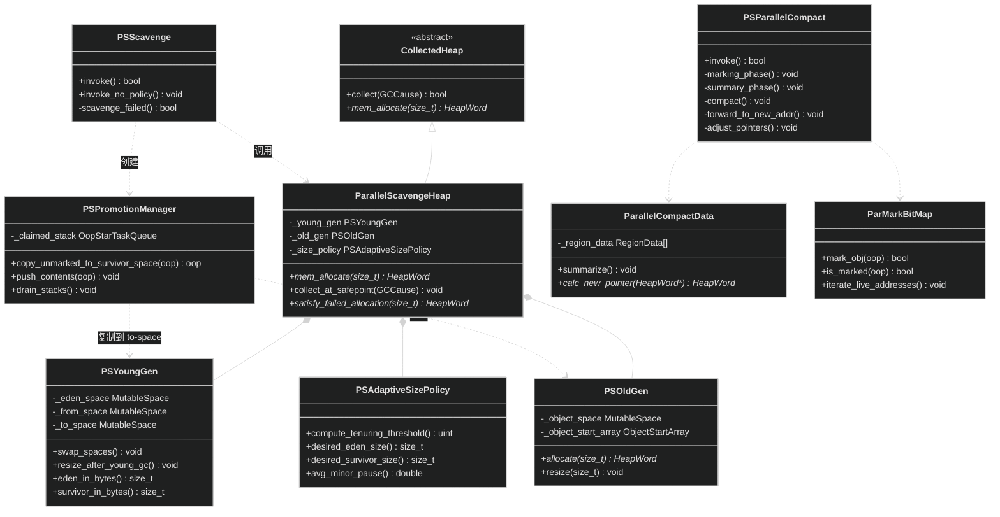

# Parallel GC

> 生成日期：2026-06-14 20:16
> 数据来源：JDK 26 Parallel GC 源码分析

---

## 重点关注

- [ ] PSScavenge::invoke() 中 ScavengeRootsTask 并行根扫描的负载均衡策略
- [ ] PSPromotionManager::copy_to_survivor_space 中 CAS + PLAB + 工作窃取的三重并发保障
- [ ] PSParallelCompact 五阶段算法中影子区域（Shadow Region）解决区域依赖的原理
- [ ] 密集前缀（Dense Prefix）优化在老年代压缩中的性能收益
- [ ] PSAdaptiveSizePolicy 基于吞吐量目标的代大小调整是否能在突变负载下收敛

---

## 功能概述

Parallel GC（Parallel Scavenge + Parallel Old）是 JDK 中吞吐量优先的默认垃圾回收器，面向多核处理器和大堆内存的批处理场景。它的核心设计理念是最大化应用吞吐量，即最小化 GC 时间占总运行时间的比例。

主要特征：
- **全并行架构**：Young GC 和 Full GC 均使用所有可用工作线程并行执行
- **固定代边界**：年轻代（Eden + From + To）与老年代在虚拟地址空间中连续排列，代间边界在启动后固定
- **自适应调整**：`PSAdaptiveSizePolicy` 根据吞吐量目标（`-XX:GCTimeRatio`）动态调整代大小
- **并行标记-压缩**：Full GC 使用五阶段并行标记-压缩算法，避免内存碎片

---

## 核心概念

### 1. ParallelScavengeHeap — 堆容器

**定义**：Parallel GC 的堆容器，管理年轻代（`PSYoungGen`）和老年代（`PSOldGen`）。

**作用**：
- 统一管理堆生命周期，代间共享内存池
- 提供分配入口，委托给各代的 MutableSpace
- 协调 Young GC 和 Full GC 的触发

**三维评估**：

| 维度 | 评估 |
|------|------|
| 好处 | 简单的两代设计，分配路径极短（TLAB → CAS bump-pointer） |
| 替代方案 | Region 化设计（如 G1），增加局部细化但引入额外开销 |
| 风险 | 固定代边界不灵活，大对象晋升过快可能触发不必要的 Full GC |

### 2. PSYoungGen — 年轻代

**定义**：包含 Eden、From Survivor、To Survivor 三块 MutableSpace 的年轻代管理器。

**作用**：
- 管理 Eden 分配和新对象晋升
- GC 后执行 From/To 空间互换（`swap_spaces()`）
- 根据 `PSAdaptiveSizePolicy` 动态调整三块空间比例

**三维评估**：

| 维度 | 评估 |
|------|------|
| 好处 | 三空间结构实现高效复制回收，无碎片产生 |
| 替代方案 | G1 的多个 Eden/Survivor Region；管理粒度更细但更复杂 |
| 风险 | Survivor 空间不足导致过早晋升到老年代 |

### 3. PSOldGen — 老年代

**定义**：存放长期存活对象的连续 MutableSpace。

**作用**：
- 接收 Young GC 中晋升的对象
- 在 Full GC 中通过并行标记-压缩回收和整理
- 支持大对象直接分配

**三维评估**：

| 维度 | 评估 |
|------|------|
| 好处 | 连续空间分配，访问局部性好 |
| 替代方案 | G1 的 Old Region 集合；打破连续性但便于并行回收 |
| 风险 | Full GC 前碎片化严重可能导致 `PromotionFailed` |

### 4. PSScavenge — Young GC 入口

**定义**：Parallel GC 年轻代回收的入口类和核心控制逻辑。

**作用**：
- `invoke()` 方法触发整轮 Young GC
- 并行根扫描（`ScavengeRootsTask`）——线程栈、JNI 句柄、CLD、CardTable 老年代跨代引用
- 引用处理、弱根处理、元空间阈值检查
- 失败时 `restore_preserved_marks()` 并触发 Full GC

**三维评估**：

| 维度 | 评估 |
|------|------|
| 好处 | 全并行 Scavenge 速度极快，多核下吞吐量高 |
| 替代方案 | G1 的 Young Collector；更复杂的 SATB 和 RSet 管理 |
| 风险 | 晋升失败时缺乏优雅降级，直接回退到 Full GC |

### 5. PSPromotionManager — 每线程晋升管理器

**定义**：每个 GC 工作线程私有的对象晋升管理器，使用 PLAB + 工作窃取。

**作用**：
- `copy_to_survivor_space()`：通过 CAS 获取对象所有权后复制到 to-space 或老年代
- `push_contents()`：将复制后对象的子引用压入本地栈
- 任务窃取（`TaskTerminator`）：空闲线程从繁忙线程窃取任务

**三维评估**：

| 维度 | 评估 |
|------|------|
| 好处 | CAS + PLAB 减少锁争用；工作窃取保证负载均衡 |
| 替代方案 | G1 的 G1ParScanThreadState；功能类似但集成度更高 |
| 风险 | 工作窃取末端检测的终止协议（Termination Protocol）存在活锁风险 |

### 6. PSParallelCompact — Full GC 入口

**定义**：并行老年代标记-压缩算法的入口和核心编排器。

**作用**：
- `invoke()` 驱动五阶段 Full GC
- Phase 1（并行标记）：`ParMarkBitMap` 标记存活对象
- Phase 2（摘要）：单线程计算压缩目标和密集前缀边界
- Phase 3（转发）：并行计算每个对象的新地址
- Phase 4（调整指针）：并行更新所有引用
- Phase 5（并行压缩）：影子区域 + 工作窃取实现区域级并行复制

**三维评估**：

| 维度 | 评估 |
|------|------|
| 好处 | 五阶段算法吞吐量极高，大堆压缩效率优越 |
| 替代方案 | G1 FullCollector 五阶段（类似但 Region 化）；Shenandoah FullGC 单线程 |
| 风险 | 单线程摘要阶段是大堆的瓶颈；STW 暂停时间与堆大小线性相关 |

### 7. ParallelCompactData — 区域级元数据

**定义**：Full GC 中用于管理压缩区域划分和目标的元数据结构。

**作用**：
- 将堆划分为等大小的 Region，记录每个 Region 的存活数据大小
- `summarize()` 计算每个 Region 的目标地址、源区域、存活计数
- 处理空间溢出和区域分割

**三维评估**：

| 维度 | 评估 |
|------|------|
| 好处 | 区域化元数据使压缩阶段高度并行化 |
| 替代方案 | Serial GC 的单线程滑动压缩；无需区域元数据 |
| 风险 | 分区粒度过细导致元数据膨胀；过粗降低并行度 |

### 8. ParMarkBitMap — 标记位图

**定义**：Full GC 标记阶段使用的并行安全位图，记录对象存活状态。

**作用**：
- `mark_obj()` / `is_marked()`：原子操作设置/查询标记位
- 并行标记任务并发操作不冲突
- 提供对象起始地址定位，支持压缩阶段的地址计算

**三维评估**：

| 维度 | 评估 |
|------|------|
| 好处 | 位图操作极快，原子 CAS 保证并发安全 |
| 替代方案 | SATB 位图（G1）；支持并发标记但复杂度更高 |
| 风险 | 位图遍历顺序影响压缩算法效率 |

### 9. PSAdaptiveSizePolicy — 自适应调整

**定义**：Parallel GC 专用的自适应调整策略，继承自 `AdaptiveSizePolicy`。

**作用**：
- 基于 GC 暂停时间、吞吐量、分配率等统计指标动态计算各代最优大小
- 调整 tenuring threshold 以避免 Survivor 溢出
- 调整 Eden / Survivor 比例以平衡 GC 频率和暂停时间

**三维评估**：

| 维度 | 评估 |
|------|------|
| 好处 | 复杂多变量优化自动权衡吞吐量和响应时间 |
| 替代方案 | 手动固定 `-Xmn`、`-XX:SurvivorRatio`；静态配置无法适应负载变化 |
| 风险 | 多目标优化可能不收敛（吞吐量 vs 暂停时间相互制约） |

---

## 关键流程

### Young GC

### Full GC（并行标记-压缩）

---

## 类继承关系

---

## 三维评估表

| 维度 | 好处 | 替代方案 | 风险 |
|------|------|----------|------|
| 吞吐量 | 多核全并行，吞吐量通常高于所有其他 GC | G1/ZGC 并发设计；吞吐量低于 Parallel | 大堆 Full GC STW 时间长 |
| 自适应调优 | `PSAdaptiveSizePolicy` 自动调优，减少人工干预 | 固定代大小；无法自适应负载变化 | 多目标优化可能不收敛 |
| 成熟稳定 | 20+ 年生产验证，行为可预测 | Serial 更简单但不可扩展 | 低概率的晋升失败/并发模式失败 |
| 内存布局 | 连续空间分配，TLAB 路径极短 | G1 Region 化；空间局部性更好 | 固定代边界不灵活 |
| 并行压缩 | 影子区域 + 工作窃取效率极高 | Serial 单线程压缩；无法并行 | 单线程摘要是大堆瓶颈 |

  - java
  - hotspot
  - jvm
tags:
---

## 核心文件说明

| 文件路径 | 核心类/结构 | 功能描述 |
|----------|------------|---------|
| `src/hotspot/share/gc/parallel/parallelScavengeHeap.hpp` | `ParallelScavengeHeap` | Parallel GC 堆容器，管理年轻代和老年代 |
| `src/hotspot/share/gc/parallel/psYoungGen.hpp` | `PSYoungGen` | 年轻代管理器（Eden + From + To） |
| `src/hotspot/share/gc/parallel/psOldGen.hpp` | `PSOldGen` | 老年代管理器（MutableSpace + ObjectStartArray） |
| `src/hotspot/share/gc/parallel/psScavenge.hpp` | `PSScavenge` | Young GC 入口和核心控制 |
| `src/hotspot/share/gc/parallel/psPromotionManager.hpp` | `PSPromotionManager` | 每线程晋升管理器（PLAB + 工作窃取） |
| `src/hotspot/share/gc/parallel/psParallelCompact.hpp` | `PSParallelCompact` | Full GC 五阶段并行标记-压缩入口 |
| `src/hotspot/share/gc/parallel/parallelCompact.hpp` | `ParallelCompactData` | 区域级元数据管理和压缩目标计算 |
| `src/hotspot/share/gc/parallel/parMarkBitMap.hpp` | `ParMarkBitMap` | 并行安全标记位图 |
| `src/hotspot/share/gc/parallel/psAdaptiveSizePolicy.hpp` | `PSAdaptiveSizePolicy` | 自适应代大小调整策略 |
