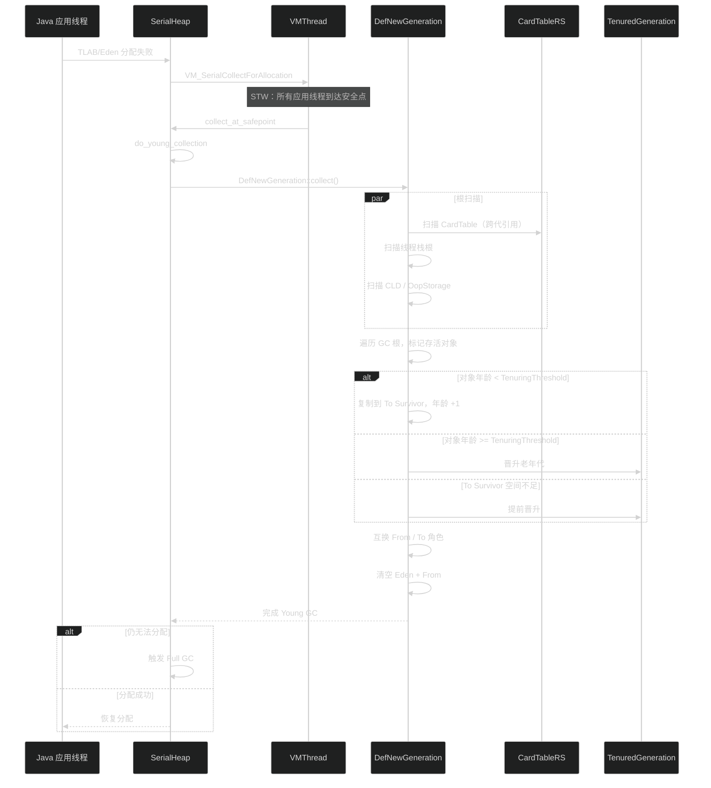
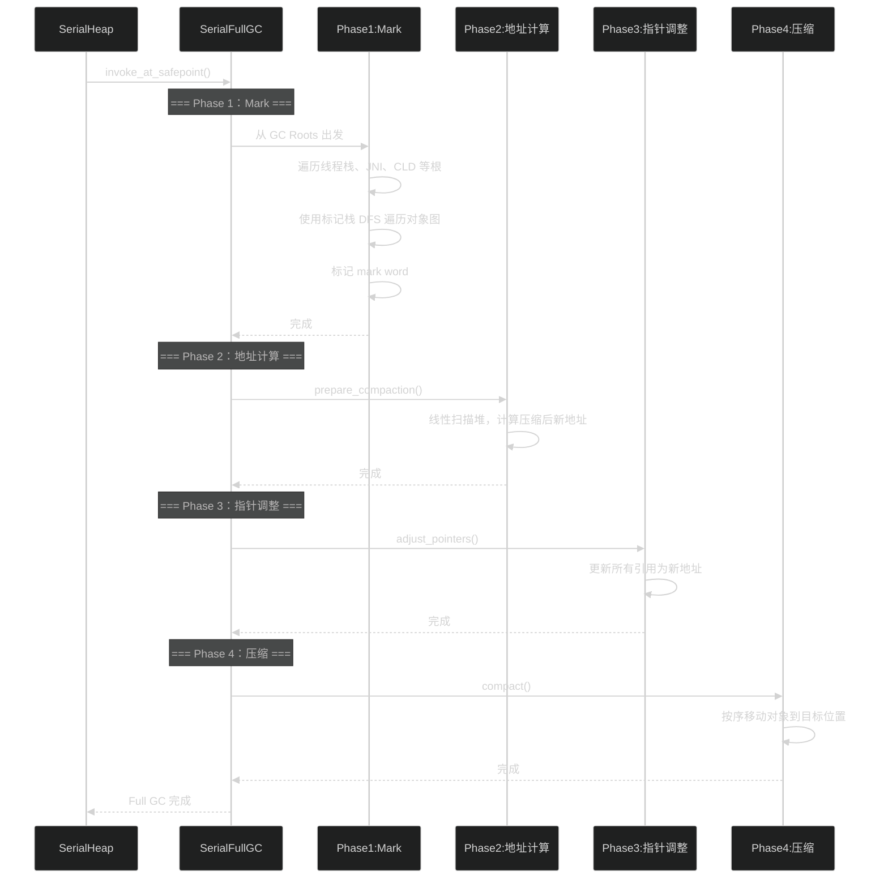
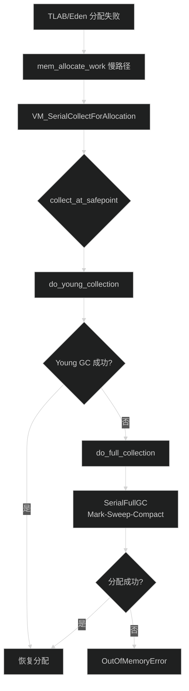
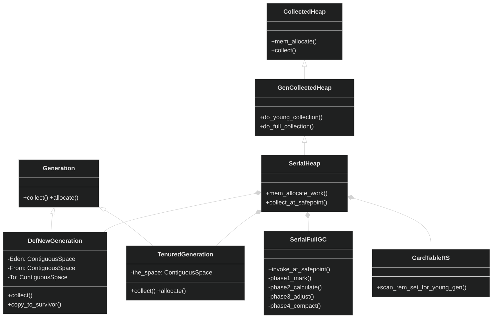

# Serial GC 工作流程分析

> 文档生成日期：2026-06-14 20:13

---

## 重点关注

- [x] **Serial GC 是单线程 Stop-The-World 垃圾回收器**：所有 GC 阶段（Young GC / Full GC）均在单线程中执行，应用线程在 GC 期间完全暂停。
- [x] **Young GC 采用复制算法**：DefNewGeneration 管理 Eden + From + To 三空间，存活对象从 Eden / From 复制到 To / Old。
- [x] **Full GC 采用四阶段 Mark-Sweep-Compact**：SerialFullGC 实现完整的标记-清除-压缩流程，消除老年代碎片。
- [x] **GC 触发路径**：TLAB / Eden 分配失败 → VM Thread → collect_at_safepoint 决策 Young GC 或 Full GC。
- [x] **CardTable Remembered Set**：记录跨代引用，避免 Young GC 时扫描整个老年代。
- [x] **Young GC 失败自动升级 Full GC**：当存活对象无法容纳于 To Survivor 或老年代时降级为 Full GC。

---

## 功能概述

Serial GC 是 HotSpot VM 中最简单、最成熟的垃圾回收器实现，面向单核/小堆场景。

| 特性 | 描述 |
|------|------|
| **线程模型** | 单线程 GC，无并行/并发 |
| **暂停特性** | 所有 GC 均为 Stop-The-World（STW） |
| **Young GC** | 复制算法（Copying）：Eden + From Survivor → To Survivor / Old |
| **Full GC** | 标记-清除-压缩（Mark-Sweep-Compact）：四阶段完成整堆回收 |
| **适用场景** | 单核 CPU、小堆（< 几百 MB）、客户端应用 |
| **堆结构** | 分代式：年轻代（DefNewGeneration）+ 老年代（TenuredGeneration） |
| **跨代引用** | CardTable Remembered Set（CardTableRS） |

---

## 核心概念

### 1. 堆布局

```
+------------------------------------------------------------------+
|                        Serial Heap                                |
+------------------------------------------------------------------+
|  Young Generation (DefNewGeneration)   |  Old Generation          |
|  +--------+---------+---------+       |  (TenuredGeneration)     |
|  |  Eden  |  From   |   To    |       |  +-------------------+   |
|  |        |Survivor | Survivor|       |  |  ContiguousSpace  |   |
|  +--------+---------+---------+       |  +-------------------+   |
+------------------------------------------------------------------+
```

- **Eden**：对象分配的主要区域（TLAB 或直接分配）。
- **From Survivor / To Survivor**：年龄递进区域，角色在每次 Young GC 后互换。
- **TenuredGeneration**：老年代，管理单一 `ContiguousSpace`，配合 `BlockOffsetTable` 和 `CardTable` 实现快速对象查找和跨代引用追踪。

### 2. 分代假设

- **弱代假设（Weak Generational Hypothesis）**：绝大多数对象在年轻代即消亡。
- Young GC 只处理年轻代，通过 CardTableRS 避免全堆扫描。
- 年龄阈值（Tenuring Threshold）控制对象何时晋升老年代。

---

## 关键流程

### 1. Young GC：复制算法

```
触发条件：Eden 已满，新对象分配失败

执行步骤：
  1. 将 Eden 和 From Survivor 中存活对象复制到 To Survivor
  2. 对象年龄 +1，超过阈值则晋升老年代
  3. 若 To Survivor 空间不足，直接晋升老年代
  4. 互换 From / To 角色
  5. 清空 Eden
```



### 2. Full GC：四阶段 Mark-Sweep-Compact

```
触发条件：
  - Young GC 后仍无法分配
  - 老年代分配失败
  - 主动 System.gc()

执行步骤：
  1. Phase 1（Mark）：标记所有存活对象
  2. Phase 2（地址计算）：计算压缩后的目标地址
  3. Phase 3（指针调整）：更新所有指针为目标地址
  4. Phase 4（压缩）：移动对象到目标位置
```



### 3. GC 触发与决策完整流程



---

## 类继承关系



---

## 三维评估

### 好处

| 维度 | 说明 |
|------|------|
| **简单可靠** | 无并发复杂度，实现最稳定，Bug 概率最低 |
| **无同步开销** | 单线程 GC 无需锁竞争 |
| **内存占用低** | 不需要 RSet 日志缓冲区等额外结构 |
| **CPU 开销小** | 无并行/并发的上下文切换和 cache 一致性开销 |
| **小堆吞吐量最佳** | 单核 + 小堆场景下吞吐量最高 |

### 替代方案

| 回收器 | 核心差异 | 适用场景 |
|--------|----------|----------|
| Parallel Scavenge + Parallel Old | 多线程并行 GC | 多核、高吞吐、大堆 |
| G1 GC | Region 化堆、并发标记、可预测暂停 | >4GB、需要可控暂停时间 |
| ZGC | 彩色指针、并发回收、<10ms 暂停 | 超低延迟、TB 级大堆 |
| Shenandoah | Brooks 指针、并发压缩、<10ms 暂停 | 超低延迟大堆 |

### 风险

| 风险 | 说明 |
|------|------|
| **长时间 STW 暂停** | Full GC 整堆扫描，大堆可达秒级 |
| **单线程瓶颈** | 多核 CPU 上无法利用并行能力 |
| **大堆不可用** | 堆 > 2GB 时暂停时间不可接受 |
| **无并发阶段** | GC 期间应用完全停滞 |

---

## 文件说明表

| 文件路径 | 职责 | 关键类 |
|----------|------|--------|
| `src/hotspot/share/gc/serial/serialHeap.hpp` | 核心堆管理器 | `SerialHeap` |
| `src/hotspot/share/gc/serial/defNewGeneration.hpp` | 年轻代三空间实现 | `DefNewGeneration` |
| `src/hotspot/share/gc/serial/tenuredGeneration.hpp` | 老年代实现 | `TenuredGeneration` |
| `src/hotspot/share/gc/serial/serialFullGC.hpp` | 四阶段 Full GC | `SerialFullGC` |
| `src/hotspot/share/gc/serial/cardTableRS.hpp` | Card Table RSet | `CardTableRS` |
| `src/hotspot/share/gc/serial/serialHeap.cpp` | 分配和 GC 调度实现 | 关键函数: mem_allocate_work, collect_at_safepoint |
| `src/hotspot/share/gc/serial/defNewGeneration.cpp` | Young GC 复制算法 | DefNewGeneration::collect |
| `src/hotspot/share/gc/serial/serialFullGC.cpp` | Full GC 四阶段 | invoke_at_safepoint |
| `src/hotspot/share/gc/serial/serialVMOperations.cpp` | VM Operation | VM_SerialCollectForAllocation |

  - java
  - hotspot
  - jvm
tags:
---

## 调用链

```
Java 线程分配失败
  └─ SerialHeap::mem_allocate_work          (serialHeap.cpp:304)
      └─ VMThread::execute                  (VM_SerialCollectForAllocation)
          └─ doit()                         (serialVMOperations.cpp:28)
              └─ satisfy_failed_allocation   (serialHeap.cpp:446)
                  └─ collect_at_safepoint    (serialHeap.cpp:515)
                      ├─ do_young_collection (serialHeap.cpp:398)
                      │   └─ DefNewGeneration::collect (defNewGeneration.cpp:619)
                      └─ do_full_collection  (serialHeap.cpp:584)
                          └─ SerialFullGC::invoke_at_safepoint (serialFullGC.cpp)
```

> 本文档基于 OpenJDK 26 源码分析生成。
