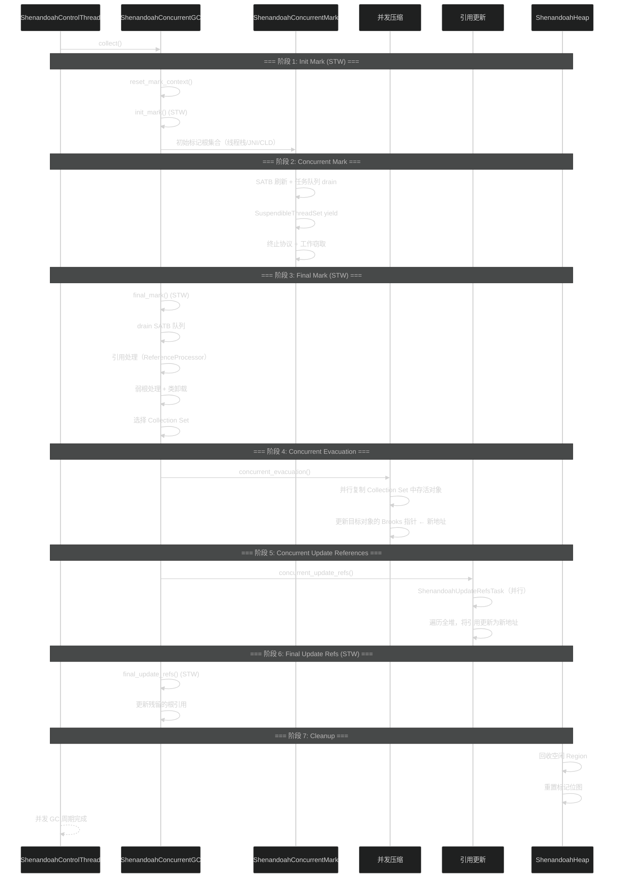
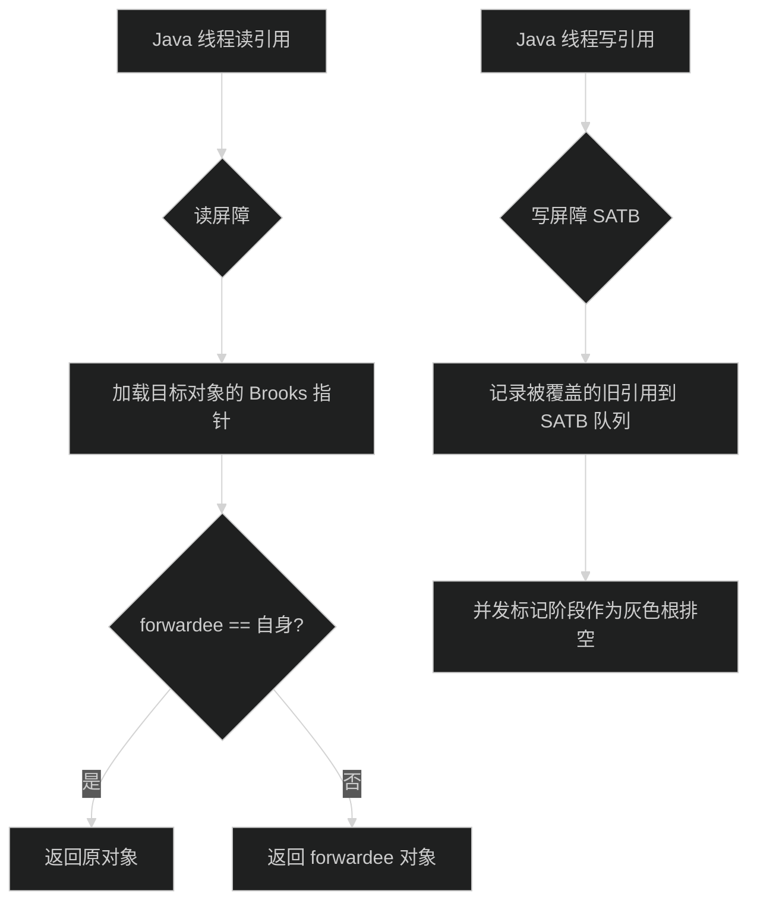
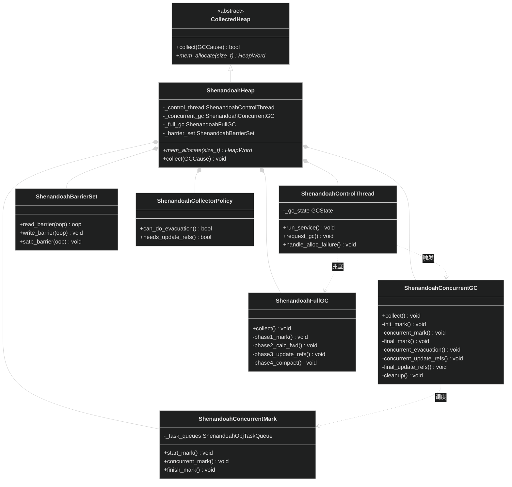

# Shenandoah GC

> 生成日期：2026-06-14 20:16
> 数据来源：JDK 26 Shenandoah GC 源码分析

---

## 重点关注

- [ ] ShenandoahConcurrentGC 完整 7 阶段并发周期中 Init Mark → Final Mark → Concurrent Evacuation → Final Update Refs 的 STW 退守边界
- [ ] ShenandoahBarrierSet 中读屏障（Brooks 指针检查）与写屏障（SATB 记录）的双重屏障开销
- [ ] Brooks 指针在对象头部的预留转发机制及与 ZGC 彩色指针的架构差异
- [ ] 退化 GC（Degen GC）从并发阶段失败到部分 STW 回退的决策路径
- [ ] `ShenandoahControlThread` 的调度策略在并发周期和退化路径之间的选择逻辑

---

## 功能概述

Shenandoah GC 是 Red Hat 开发的低延迟并发垃圾回收器，核心创新在于与 Mutator 线程并发执行对象压缩（Evacuation），而不仅限于并发标记。它使用 Brooks 指针（对象头部预留转发指针）和读屏障实现并发对象移动的透明性。

主要特征：
- **并发压缩**：与 ZGC 的关键区别在于 Shenandoah 使用软件 Brooks 指针而非硬件彩色指针
- **Brooks 指针**：每个对象头部预留一个字空间存储转发地址，初始指向自身
- **读/写屏障**：读屏障检查转发，写屏障 SATB 记录引用变更
- **退化路径**：并发 GC → Degen GC（部分 STW 回退）→ Full GC（STW mark-sweep-compact）
- **Region 化堆**：类似 G1 的 Region 结构，但更简化

---

## 核心概念

### 1. ShenandoahHeap — Region 堆

**定义**：Shenandoah GC 的堆容器，管理所有 Region、GC 调度和屏障集。

**作用**：
- 将堆划分为等大小 Region 用于分配和回收
- 持有 `ShenandoahControlThread`、`ShenandoahConcurrentGC` 等子系统
- 提供堆级别的分配和 GC 入口

**三维评估**：

| 维度 | 评估 |
|------|------|
| 好处 | Region 化设计支持大堆并发回收 |
| 替代方案 | G1 的 Region 系统；功能更丰富但维护成本更高 |
| 风险 | Region 管理开销在小型堆上不显著 |

### 2. ShenandoahControlThread — 调度线程

**定义**：Shenandoah GC 的中心调度线程，决策何时启动并发周期或退化路径。

**作用**：
- `run_service()` 循环监听 GC 请求
- 根据堆占用和分配率决定 GC 策略
- 在并发阶段失败时决定退化或 Full GC

**三维评估**：

| 维度 | 评估 |
|------|------|
| 好处 | 集中调度，决策逻辑清晰可追踪 |
| 替代方案 | G1ConcurrentMarkThread + G1Policy 分离设计；内聚性更强但灵活性低 |
| 风险 | 单点调度可能导致决策延迟 |

### 3. ShenandoahConcurrentGC — 并发周期

**定义**：Shenandoah 并发 GC 周期的核心编排器，实现完整的 7 阶段流程。

**作用**：
- `collect()` 驱动完整周期
- Init Mark（STW）→ Concurrent Mark → Final Mark（STW）→ Concurrent Evacuation → Concurrent Update References → Final Update Refs（STW）→ Cleanup

**三维评估**：

| 维度 | 评估 |
|------|------|
| 好处 | 7 阶段覆盖并发回收全生命周期，阶段边界清晰 |
| 替代方案 | ZGC 的 Minor/Major 8/10 步驱动；阶段更细但调度更复杂 |
| 风险 | 阶段数量多，任一阶段失败需走退化路径 |

### 4. ShenandoahConcurrentMark — 并发标记

**定义**：Shenandoah 的并发标记引擎，使用 SATB 保证标记完整性。

**作用**：
- 并行遍历存活对象图
- 使用 SATB 写屏障记录并发标记期间的引用变更
- 支持 `SuspendibleThreadSet` yield 机制避免线程饥饿

**三维评估**：

| 维度 | 评估 |
|------|------|
| 好处 | SATB 确保标记完整性，Suspendible yield 提高协作性 |
| 替代方案 | ZMark 无锁 stripe 标记；并发度更高 |
| 风险 | SATB 队列可能堆积，Final Mark 暂停可能超预期 |

### 5. ShenandoahBarrierSet — 屏障集

**定义**：Shenandoah 的屏障集合，包括读屏障（Brooks 指针检查）和写屏障（SATB）。

**作用**：
- 读屏障：从堆加载引用时，检查目标对象的 Brooks 指针是否指向新地址，是则返回新地址
- 写屏障（SATB）：在引用被覆盖前将旧引用记录到 SATB 队列
- JIT 在代码生成阶段插入屏障指令

**三维评估**：

| 维度 | 评估 |
|------|------|
| 好处 | Brooks 指针纯软件实现，无需硬件特殊支持，平台移植性好 |
| 替代方案 | ZGC 彩色指针 Load Barrier；fast-path 更快但需地址空间支持 |
| 风险 | 读写双重屏障开销（~5-15%）高于纯读屏障设计 |

### 6. ShenandoahFullGC — Full GC

**定义**：当无法执行并发 GC 或退化 GC 时的兜底机制，STW mark-sweep-compact。

**作用**：
- 并发阶段失败或退化 GC 失败时触发
- 全堆 STW 标记 → 计算转发 → 调整指针 → 压缩
- 暂停时间与堆大小线性相关

**三维评估**：

| 维度 | 评估 |
|------|------|
| 好处 | 兜底保障，任何情况下都能回收全部垃圾 |
| 替代方案 | G1FullCollector 支持并行压缩；暂停更短 |
| 风险 | Full GC 常发生则表明并发 GC 参数配置不当 |

---

## 关键流程

### 完整并发周期



### 屏障执行流程



### 退化路径

```mermaid
%%{init: {'theme':'dark'}}%%
flowchart TD
    A[并发 GC 阶段] --> B{阶段成功?}
    B -->|是| C[继续下一阶段]
    C --> D[完成周期]

    B -->|否| E[Degen GC 可行?]

    E -->|是| F[退化 GC (Degen GC)]
    F --> F1{退化原因}
    F1 -->|标记阶段失败| F2[退化: STW 完成标记]
    F1 -->|压缩阶段失败| F3[退化: STW 完成压缩]
    F1 -->|引用更新阶段失败| F4[退化: STW 完成引用更新]
    F2 --> G{成功?}
    F3 --> G
    F4 --> G
    G -->|是| C
    G -->|否| H

    E -->|否| H[Full GC]
    H --> H1[STW mark-sweep-compact]
    H1 --> C
```

---

## 类继承关系



---

## 三维评估表

| 维度 | 好处 | 替代方案 | 风险 |
|------|------|----------|------|
| 低延迟 | 暂停 < 10ms，与 ZGC 同级 | ZGC：彩色指针 + Load Barrier 更高效 | 读写屏障双重开销 |
| 并发压缩 | 与 Mutator 并发移动对象 | G1/Parallel：STW 复制/压缩 | 并发路径失败需退化 |
| Brooks 指针 | 纯软件实现，跨平台移植性好 | ZGC 彩色指针；fast-path 更快 | 每个对象额外一个字的头开销 |
| 可移植性 | 无需特殊硬件或地址空间支持 | ZGC 需 64 位 + 虚拟地址空间预留 | Runtime JIT 屏障注入复杂 |
| 退化路径 | 优雅降级，GC 三阶段逐步倒退 | ZGC：单路径并发，失败直接 Full GC | 退化决策逻辑复杂 |

  - java
  - hotspot
  - jvm
tags:
---

## 核心文件说明

| 文件路径 | 核心类/结构 | 功能描述 |
|----------|------------|---------|
| `src/hotspot/share/gc/shenandoah/shenandoahHeap.hpp` | `ShenandoahHeap` | Region 堆容器，管理所有子系统和 GC 调度 |
| `src/hotspot/share/gc/shenandoah/shenandoahControlThread.hpp` | `ShenandoahControlThread` | GC 调度线程，驱动并发/退化/Full GC 决策 |
| `src/hotspot/share/gc/shenandoah/shenandoahConcurrentGC.hpp` | `ShenandoahConcurrentGC` | 并发 GC 7 阶段周期编排器 |
| `src/hotspot/share/gc/shenandoah/shenandoahConcurrentMark.hpp` | `ShenandoahConcurrentMark` | 并发标记引擎（SATB） |
| `src/hotspot/share/gc/shenandoah/shenandoahBarrierSet.hpp` | `ShenandoahBarrierSet` | 读写屏障集（Brooks 指针 + SATB） |
| `src/hotspot/share/gc/shenandoah/shenandoahFullGC.hpp` | `ShenandoahFullGC` | Full GC（STW mark-sweep-compact） |
| `src/hotspot/share/gc/shenandoah/shenandoahCollectorPolicy.hpp` | `ShenandoahCollectorPolicy` | GC 策略决策（Evacuation/Update Refs 等） |
