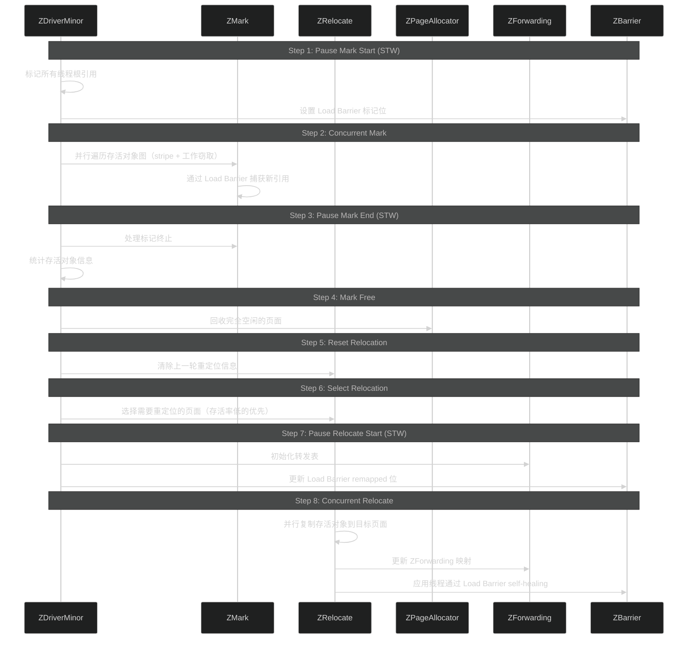
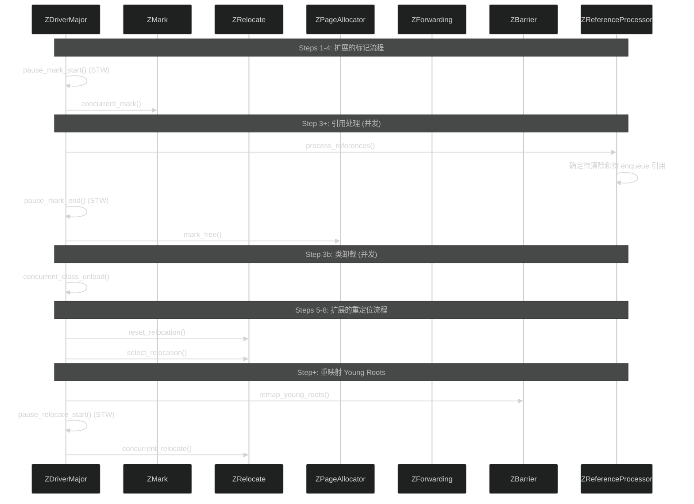
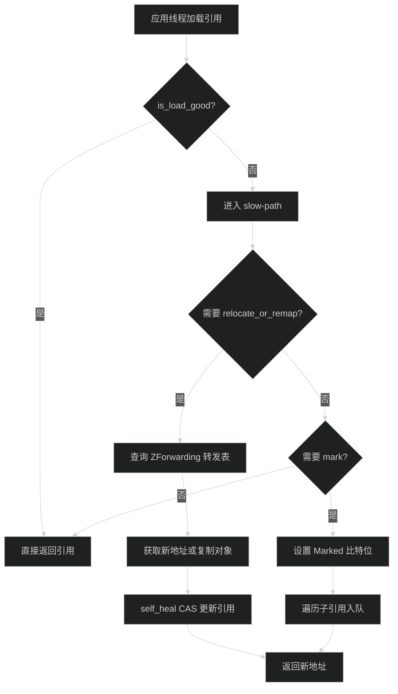
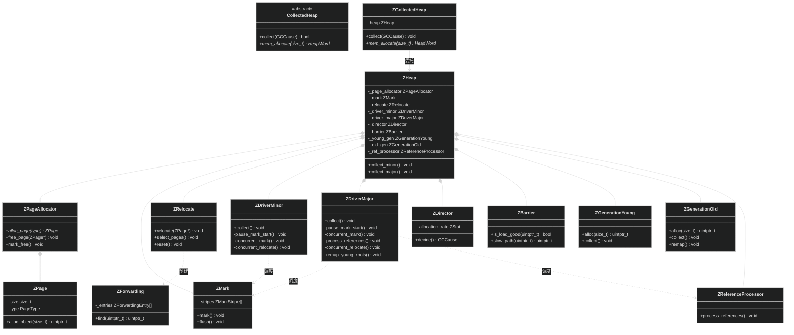

# ZGC

> 生成日期：2026-06-14 20:16
> 数据来源：JDK 26 ZGC 源码分析

---

## 重点关注

- [ ] 彩色指针（Colored Pointer）各比特位在并发标记和重定位中的具体协同机制
- [ ] ZDriverMinor/Major 并发 GC 循环的不同步数（8 步 vs 10 步）及其差异原因
- [ ] ZBarrier Load Barrier 的 fast-path（is_load_good 检查）与 slow-path 的执行路径
- [ ] ZMark 无锁 stripe 分片 + 工作窃取在超大堆下的并发性能
- [ ] ZPageAllocator 中三种 ZPage 大小（2MB / 32MB / N*2MB）的分配策略和碎片管理
- [ ] ZGenerationYoung/Old 分代设计对彩色指针的影响

---

## 功能概述

ZGC（Z Garbage Collector）是 JDK 中低延迟优先的垃圾回收器，设计目标为在任意堆大小下将 STW 暂停时间控制在 10ms 以内。它通过彩色指针（Colored Pointers）、读屏障（Load Barrier）和并发重定位技术实现了几乎完全并发的内存管理。

主要特征：
- **彩色指针技术**：在 64 位指针的高位编码标记/重定位状态，无需对象头修改
- **读屏障 + Self-Healing**：应用线程在读取引用时自动修复指针状态
- **分代并发 GC**（JDK 21+）：Minor GC（8 步）+ Major GC（10 步）
- **无锁并发标记**：Stripe 分片 + 工作窃取，应用线程无暂停
- **并发引用处理**：软引用/弱引用/虚引用在并发阶段处理

---

## 核心概念

### 1. ZCollectedHeap — ZGC 堆入口

**定义**：ZGC 堆的 JVM 接口层，继承 `CollectedHeap`。

**作用**：
- 负责 `collect()` / `mem_allocate()` 等 JVM 接口调用
- 委托所有操作给内部的 `ZHeap` 实例
- 协调 `ZDriver` 发起的 GC 循环

**三维评估**：

| 维度 | 评估 |
|------|------|
| 好处 | 薄封装层，GC 核心逻辑完全在 `ZHeap` 中，职责清晰 |
| 替代方案 | 直接在 ZCollectedHeap 中实现全部功能；但增加耦合 |
| 风险 | 代理层增加轻微调用开销 |

### 2. ZHeap — ZGC 核心

**定义**：ZGC 的中央管理类，持有所有子系统（`ZPageAllocator`、`ZMark`、`ZRelocate`、`ZDriver`）。

**作用**：
- 协调 GC 各阶段（标记/重定位/引用处理）
- 管理 `ZGenerationYoung/Old` 分代元数据
- 提供分配入口，委托 `ZPageAllocator` 实现

**三维评估**：

| 维度 | 评估 |
|------|------|
| 好处 | 集中管理各子系统依赖，GC 循环协调统一 |
| 替代方案 | 各子系统独立耦合；增加模块间通信复杂度 |
| 风险 | 所有子系统耦合在 ZHeap 上，修改某子系统可能影响全局 |

### 3. ZPageAllocator — 页面分配器

**定义**：管理 ZGC 虚拟地址空间和物理内存的分配器，使用三种页面大小。

**作用**：
- `ZPage` 大小：小页面 2MB、中页面 32MB、大页面 N*2MB
- 维护空闲页面的缓存和回收
- 支持并发分配和非阻塞分配路径

**三维评估**：

| 维度 | 评估 |
|------|------|
| 好处 | 多级页面减少碎片，虚拟地址空间管理灵活 |
| 替代方案 | 单一页面大小；分配效率高但碎片严重 |
| 风险 | 大页面分配失败时需要降级到中页面组合 |

### 4. ZPage — 内存页面

**定义**：ZGC 内存分配的基本单位，映射一段虚拟地址空间。

**作用**：
- 类型区分：小（2MB）、中（32MB）、大（N*2MB）
- 记录页面内对象分配状态
- 在重定位时作为迁移单位

**三维评估**：

| 维度 | 评估 |
|------|------|
| 好处 | 三种页面大小灵活适配不同对象尺寸 |
| 替代方案 | G1 等大小 Region（1-32MB）；更统一但灵活性低 |
| 风险 | 中页面 32MB 阈值可能导致大对象分配效率低 |

### 5. ZDriver — GC 循环驱动

**定义**：ZGC 并发 GC 循环的驱动调度器，分为 `ZDriverMinor` 和 `ZDriverMajor`。

**作用**：
- Minor（8 步）：Pause Mark Start → Concurrent Mark → Pause Mark End（循环）→ Mark Free → Reset Relocation → Select Relocation → Pause Relocate Start → Concurrent Relocate
- Major（10 步）：扩展的 Minor 流程 + 引用处理 + 类卸载 + 重映射 Young Roots

**三维评估**：

| 维度 | 评估 |
|------|------|
| 好处 | 并发循环 + 极短 STW 暂停（< 10ms） |
| 替代方案 | G1 混合并发 + STW；暂停更长但实现简单 |
| 风险 | 10 步 Major 流程协调复杂，异常处理路径多 |

### 6. ZDirector — GC 触发决策

**定义**：基于统计决策何时触发 Minor/Major GC 的策略组件。

**作用**：
- 根据分配率、堆占用、GC 频率等因素计算触发时机
- 决定触发 Minor GC 还是 Major GC
- 避免过于频繁或过晚的 GC

**三维评估**：

| 维度 | 评估 |
|------|------|
| 好处 | 智能触发策略，减少不必要的 GC 循环 |
| 替代方案 | 固定阈值触发；响应粗糙 |
| 风险 | 统计预测在负载突变时可能延迟 GC 触发 |

### 7. ZMark — 并发标记

**定义**：ZGC 的并发标记引擎，使用无锁 stripe 分片 + 工作窃取。

**作用**：
- 并发遍历存活对象图，支持多线程并行
- 使用 stripe 分片减少线程冲突（每个线程独立 stripe）
- 工作窃取实现负载均衡
- 通过彩色指针的 Marked 比特位记录标记状态

**三维评估**：

| 维度 | 评估 |
|------|------|
| 好处 | 无锁设计 + 分片策略使标记具有极佳的可伸缩性 |
| 替代方案 | G1 SATB 标记；有锁设计在极端多线程下可能受限 |
| 风险 | Stripe 分片参数配置不当影响并发性能 |

### 8. ZRelocate — 重定位

**定义**：ZGC 并发移动对象的引擎，负责将存活对象从源页面迁移到目标页面。

**作用**：
- 选择源页面（需要重定位的页面）
- 并发复制存活对象到目标页面
- 更新 `ZForwarding` 转发表

**三维评估**：

| 维度 | 评估 |
|------|------|
| 好处 | 并发重定位，应用线程无暂停 |
| 替代方案 | Parallel/Serial 的 STW 压缩；暂停时间与堆大小线性相关 |
| 风险 | 重定位过程中应用线程通过 Load Barrier 访问转发表可能增加延迟 |

### 9. ZBarrier — 负载屏障

**定义**：ZGC 的读屏障（Load Barrier），使用彩色指针实现无锁并发保护。

**作用**：
- **fast-path**：`is_load_good()` 检查指针彩色位状态，通过则直接返回
- **slow-path**：彩色位异常时触发 `relocate_or_remap()` + `mark()` + `self_heal CAS`
- Self-Healing：修复后对象的指针，后续访问无需再次进入 slow-path

**三维评估**：

| 维度 | 评估 |
|------|------|
| 好处 | 读屏障仅检查指针彩色位，fast-path 极快（单条指令） |
| 替代方案 | Shenandoah Brooks 指针（对象头额外字段）；读屏障需多一次间接访存 |
| 风险 | Slow-path 中的 relocate_or_remap 可能触发页面 I/O |

### 10. ZForwarding — 转发表

**定义**：重定位期间记录对象从旧地址到新地址映射的哈希表。

**作用**：
- 支持 Load Barrier 在 slow-path 中查询对象新地址
- 使用哈希表实现 O(1) 平均查询
- 每条记录包含旧地址到新地址的映射

**三维评估**：

| 维度 | 评估 |
|------|------|
| 好处 | 哈希表查询效率高，支持高并发访问 |
| 替代方案 | 顺序列表；在页面大小较大时查询效率低 |
| 风险 | 哈希冲突时退化为链表查询 |

### 11. ZGenerationYoung/Old — 分代管理

**定义**：ZGC 的分代管理组件，将堆分为年轻代和老年代。

**作用**：
- 年轻代对象使用 MarkedYoung 彩色位标记
- 老年代对象使用 MarkedOld 彩色位标记
- Minor GC 仅回收年轻代，Major GC 回收年轻代+老年代

**三维评估**：

| 维度 | 评估 |
|------|------|
| 好处 | 分代减少每次 GC 的扫描范围，提升吞吐量 |
| 替代方案 | 不分代 ZGC；每次 GC 全堆扫描，吞吐量更低 |
| 风险 | 分代增加了彩色指针的编码复杂度 |

### 12. ZReferenceProcessor — 引用处理器

**定义**：并发处理软引用、弱引用、虚引用、FinalReference 的组件。

**作用**：
- 在并发阶段（Major GC）确定引用对象的可达性
- 区分活跃引用和待清除引用
- 确保引用处理在无 STW 的情况下完成

**三维评估**：

| 维度 | 评估 |
|------|------|
| 好处 | 引用处理并发化，避免 STW |
| 替代方案 | G1/Parallel 在 STW 暂停中处理引用；增加暂停时间 |
| 风险 | 并发引用处理的设计复杂度高，需要处理好与标记阶段的时序 |

---

## 关键流程

### 彩色指针布局

```
彩色指针比特位编码（x86 平台）:
RR RR MM mm FF rr 00 00 (高 16 位)
 4  4  2  2  2  2  0  0

  RR (63-56) : Remapped (4 位) - 已重映射
  MM (55-54) : MarkedOld (2 位) - 老年代标记
  mm (53-52) : MarkedYoung (2 位) - 年轻代标记
  FF (51-50) : Finalizable (2 位) - Final 引用标记
  rr (49-48) : Remembered (2 位) - 跨代引用标记
  00 (47-32) : 保留位（零）
```

### Minor GC（8 步）



### Major GC（10 步）



### Load Barrier 路径



---

## 类继承关系



---

## 三维评估表

| 维度 | 好处 | 替代方案 | 风险 |
|------|------|----------|------|
| 低延迟 | STW < 10ms，任意堆大小 | G1：STW 暂停随堆大小增长 | Load Barrier 运行时开销约 5-15% |
| 彩色指针 | 无对象头修改，fast-path 单指令 | Shenandoah Brooks 指针 | 仅支持 64 位平台，虚拟地址消耗大 |
| 并发重定位 | 应用线程不暂停移动对象 | Parallel：STW 压缩 | 转发表查询增加访问延迟 |
| 并发标记 | 无锁 stripe + 工作窃取可伸缩性极佳 | G1 SATB：有锁设计 | 内存消耗高于非并发设计 |
| 分代设计 | 减少扫描范围，提升吞吐量 | 不分代 ZGC | 跨代指针 + 彩色位复杂度增加 |
| 无 GC 线程暂停 | 几乎所有阶段并发执行 | Serial/Parallel：全部 STW | 调度和同步复杂性高 |

  - java
  - hotspot
  - jvm
tags:
---

## 核心文件说明

| 文件路径 | 核心类/结构 | 功能描述 |
|----------|------------|---------|
| `src/hotspot/share/gc/z/zCollectedHeap.hpp` | `ZCollectedHeap` | ZGC 堆的 JVM 接口层 |
| `src/hotspot/share/gc/z/zHeap.hpp` | `ZHeap` | ZGC 核心管理类，协调所有子系统 |
| `src/hotspot/share/gc/z/zPageAllocator.hpp` | `ZPageAllocator` | 虚拟地址空间和物理内存分配器 |
| `src/hotspot/share/gc/z/zPage.hpp` | `ZPage` | 内存页（2MB / 32MB / N*2MB） |
| `src/hotspot/share/gc/z/zDriverMinor.hpp` | `ZDriverMinor` | Minor GC（8 步）驱动调度器 |
| `src/hotspot/share/gc/z/zDriverMajor.hpp` | `ZDriverMajor` | Major GC（10 步）驱动调度器 |
| `src/hotspot/share/gc/z/zDirector.hpp` | `ZDirector` | GC 触发决策策略 |
| `src/hotspot/share/gc/z/zMark.hpp` | `ZMark` | 无锁 stripe 并发标记引擎 |
| `src/hotspot/share/gc/z/zRelocate.hpp` | `ZRelocate` | 并发重定位引擎 |
| `src/hotspot/share/gc/z/zBarrier.hpp` | `ZBarrier` | Load Barrier（fast-path + slow-path） |
| `src/hotspot/share/gc/z/zForwarding.hpp` | `ZForwarding` | 重定位转发表（哈希表） |
| `src/hotspot/share/gc/z/zGeneration.hpp` | `ZGenerationYoung/Old` | 分代管理组件 |
| `src/hotspot/share/gc/z/zReferenceProcessor.hpp` | `ZReferenceProcessor` | 并发引用处理组件 |
