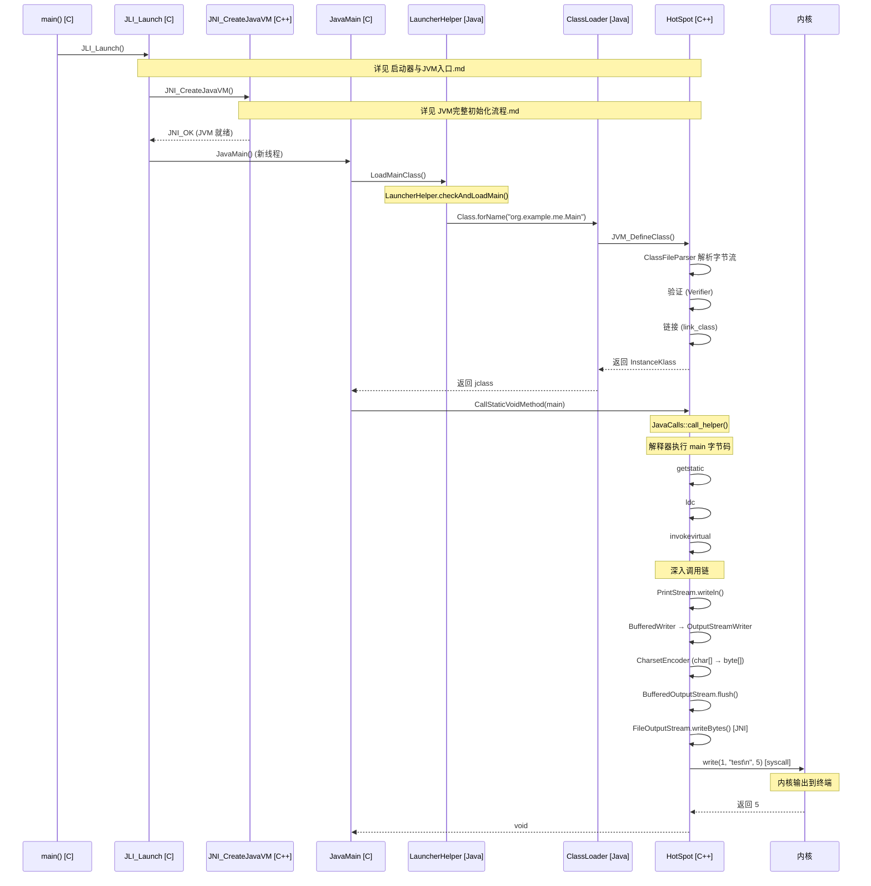
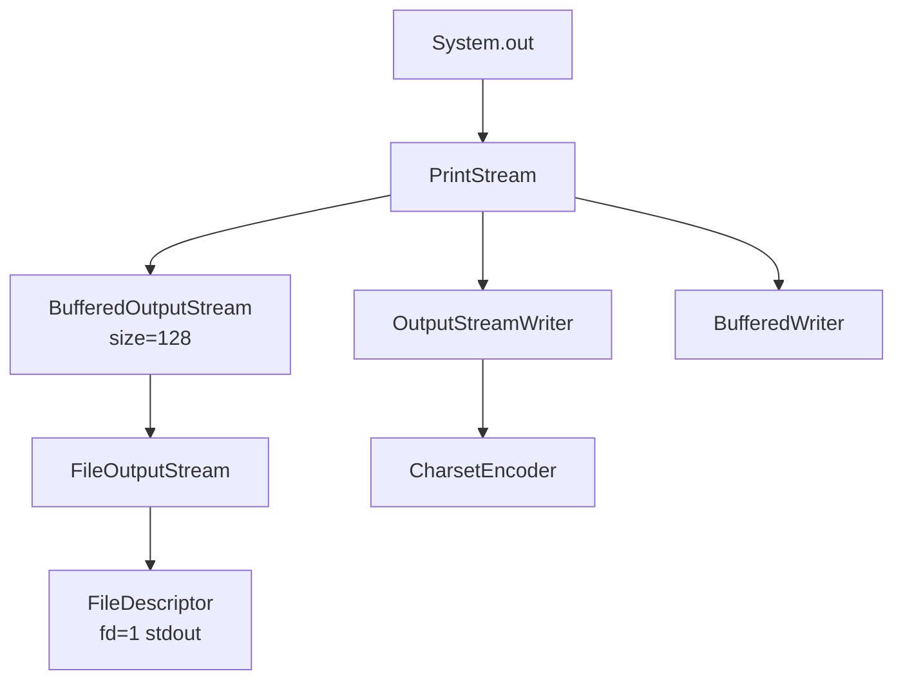
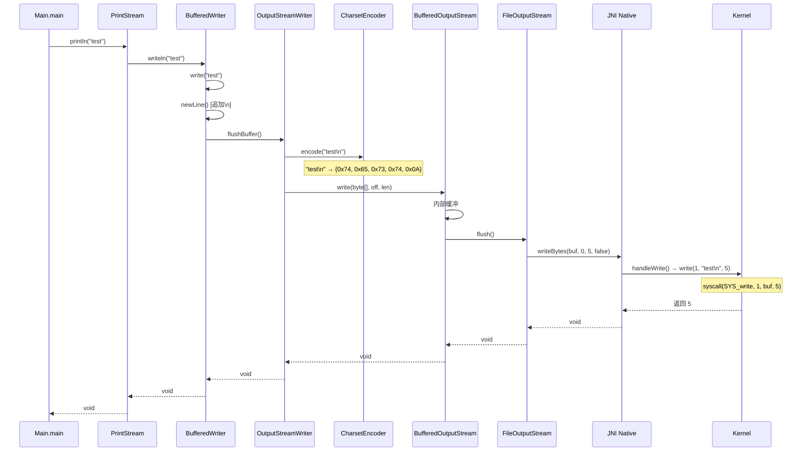

# 从 java 启动到代码执行的完整流程

> 上次修改：2026-06-06 15:30
> 分析场景：`java org.example.me.Main` → `System.out.println("test")` 执行的完整链路
> JDK 版本: OpenJDK 26, 主类 Java 8 (major version 52)

## 重点关注
- [ ] Launcher → JVM 初始化 → 主类加载 → 方法执行的完整链条
- [ ] `LoadMainClass()` C 端到 Java 端的桥接
- [ ] `ClassFileParser` 解析 .class 文件的逐字节流程
- [ ] 字节码验证（Type-Checking Verifier）
- [ ] `System.out.println("test")` 从 Java 到系统调用的完整数据流
- [ ] JIT 编译流水线与 Main 方法的编译状态

## 与其他文档的关系

本文档侧重于从 **JVM 初始化完成后** 到 **Java 代码执行** 的流程。关于 `Threads::create_vm()` 的完整 6 阶段分析请见 [JVM完整初始化流程.md](./JVM完整初始化流程.md)，启动器部分详见 [启动器与JVM入口.md](./启动器与JVM入口.md)。

## 全景流程



## 1. Launcher 阶段速览

*详细分析请见 [启动器与JVM入口.md](./启动器与JVM入口.md)*

```
main() [main.c:103]
  └─ JLI_Launch() [java.c:225]
       ├─ CreateExecutionEnvironment() — 定位 JDK，查找 jvm.cfg
       ├─ LoadJavaVM() — dlopen("libjvm.so")，解析 JNI_CreateJavaVM
       ├─ ParseArguments() — 解析 -cp org.example.me.Main
       └─ JVMInit() → ContinueInNewThread() → JavaMain()
```

### 关键点

1. `CallJavaMainInNewThread()` 通过 `pthread_create` 创建新线程执行 `JavaMain`
2. JVM 不是静态链接到 `java` 二进制，而是通过 `dlopen()` 运行时动态加载
3. `JNI_CreateJavaVM` 是从 `libjvm.so` 中 `dlsym` 解析的函数指针

## 2. JVM 初始化速览

*详细分析请见 [JVM完整初始化流程.md](./JVM完整初始化流程.md)*

`Threads::create_vm()` 是 JVM 初始化的核心函数，分 6 个阶段按严格顺序执行：

| 阶段 | 核心操作 |
|------|---------|
| 0: 预备 | CPU 检测、参数解析、ergo 自适应 |
| 1: OS 与基础设施 | 信号处理、Agent 加载、全局互斥锁 |
| 2: 主线程创建 | 主线程对象、init_globals()（含 Metaspace） |
| 3: Java 系统类 | init_globals2()（含 genesis）、VMThread、Java 核心类 |
| 4: JIT + 模块系统 | 编译器初始化、模块系统、premain |
| 5: 结尾 | 初始化完成 |

## 3. 主类加载阶段

### 3.1 LoadMainClass() — C 端 JNI 桥接

**文件**: `src/java.base/share/native/libjli/java.c:1584`

```c
static jclass LoadMainClass(JNIEnv *env, int mode, char *name) {
    jclass cls = GetLauncherHelperClass(env);
    jmethodID mid = (*env)->GetStaticMethodID(env, cls,
        "checkAndLoadMain", "(ZILjava/lang/String;)Ljava/lang/Class;");
    jstring str = NewPlatformString(env, name);
    jobject result = (*env)->CallStaticObjectMethod(env, cls, mid,
                                                     USE_STDERR, mode, str);
    return (jclass)result;
}
```

C 代码调用 Java 方法 `LauncherHelper.checkAndLoadMain(false, LM_CLASS, "org.example.me.Main")`。

### 3.2 LauncherHelper.checkAndLoadMain() — Java 端加载

**文件**: `src/java.base/share/classes/sun/launcher/LauncherHelper.java:747`

```java
static Class<?> checkAndLoadMain(boolean printToStderr, int mode, String what) {
    Class<?> mainClass = loadMainClass(mode, what);   // 加载主类
    validateMainMethod(mainClass);                     // 检查 main 方法
    return mainClass;
}
```

### 3.3 loadMainClass()

```java
private static Class<?> loadMainClass(int mode, String what) {
    ClassLoader scl = ClassLoader.getSystemClassLoader();
    Class<?> mainClass = Class.forName(cn, false, scl);
    return mainClass;
}
```

调用链进入 Java 标准类加载机制：
`Class.forName()` → `ClassLoader.loadClass()` → 找到 `org/example/me/Main.class` → 读取字节 → `JVM_DefineClass()` → 进入 HotSpot

### 3.4 类加载完整调用链

```
Class.forName()
  → JVM_FindClassFromClassLoader()
    → SystemDictionary::resolve_or_null()
      → load_instance_class_impl()
        → [App Loader]: JavaCalls::call_virtual(loadClass())
          → URLClassLoader.findClass()
            → JVM_DefineClass()
              → SystemDictionary::resolve_from_stream()
                → KlassFactory::create_from_stream()
                  → ClassFileParser(stream)
                  → create_instance_klass()
```

  - java
  - hotspot
  - jvm
tags:
---

## 4. 类文件解析 (ClassFileParser)

**文件**: `src/hotspot/share/classfile/classFileParser.cpp:5477`

对于 `Main.class`（约 538 字节），解析器按以下顺序逐字节读取：

### 4.1 Magic Number

```cpp
u4 magic = stream->get_u4();
if (magic != JAVA_CLASSFILE_MAGIC) { // 0xCAFEBABE
    classfile_error("wrong magic number");
}
```
✅ `Main.class` 的 magic number 是 `0xCAFEBABE`，通过。

### 4.2 版本号检查

```cpp
u2 minor = stream->get_u2();  // 0
u2 major = stream->get_u2();  // 52 (Java 8)

verify_class_version(major, minor, _class_name, CHECK);
```

验证逻辑：
```
major=52, minor=0
  52 >= 45 (最小支持) → 通过
  52 <= 70 (JDK 26 最大) → 通过
  52 < 56 (Java 12) → 直接通过，无需进一步检查
```
✅ 全部通过。

### 4.3 常量池解析

```
constant_pool_count = 34 (33 项 + 第 0 项保留)
```

Main.class 的常量池关键条目：

| 索引 | 类型 | 值 |
|------|------|----|
| #1 | Methodref | `Object."<init>":()V` |
| #2 | Fieldref | `System.out:Ljava/io/PrintStream;` |
| #3 | String | `test` |
| #4 | Methodref | `PrintStream.println:(Ljava/lang/String;)V` |
| #5 | Class | `org/example/me/Main` |
| #6 | Class | `java/lang/Object` |

### 4.4 方法解析：main 方法

**方法 1：`<init>()V`** — 编译器生成的构造器
- 字节码：`aload_0; invokespecial #1; return`

**方法 2：`main([Ljava/lang/String;)V`** — 程序入口
- `max_stack = 2`, `max_locals = 1`
- 字节码序列：
  ```
  0: getstatic     #2    // Field System.out:Ljava/io/PrintStream;
  3: ldc           #3    // String "test"
  5: invokevirtual #4    // Method PrintStream.println:(Ljava/lang/String;)V
  8: return
  ```

## 5. 类链接与验证

### 5.1 链接

`link_class()` 为 Main 类创建 vtable（1 个条目：从 Object 继承的虚方法），并为每个方法设置解释器入口点：

```cpp
void Method::link_method(TRAPS) {
    address entry = Interpreter::entry_for_method(h_method);
    set_interpreter_entry(entry);      // 设置 _i2i_entry
    make_adapters();                   // 生成 i2c/c2i 适配器
    _from_compiled_entry = adapter()->get_c2i_entry();
}
```

### 5.2 字节码验证

Main.class 的 `major_version = 52`（Java 6+），使用**类型检查验证器**：

```
ClassVerifier::verify_class()
  └─ verify_method(<init>)  ✅
  └─ verify_method(main)    ✅
       ├─ getstatic #2  → 验证 System.out 可访问，类型正确
       ├─ ldc #3        → 验证常量池 #3 是 String
       ├─ invokevirtual #4 → 验证 println 存在且签名匹配
       └─ return        → 验证表达式栈为空
```

## 6. 类初始化

Main 类没有显式的 `<clinit>`（无静态字段或静态初始化块），所以跳过。

但 `System` 类的初始化在 `Threads::create_vm()` 阶段已经完成。

## 7. Java 方法解释执行

### 7.1 调用入口

```c
// JNI 调用
(*env)->CallStaticVoidMethod(env, mainClass, mainID, mainArgs);
```

### 7.2 调用链

```
CallStaticVoidMethod
  → JavaCalls::call_static()
    → JavaCalls::call()
      → JavaCalls::call_helper()
        → StubRoutines::call_stub()  // C→Java 桥接汇编
          → generate_normal_entry()  // 解释器入口
            → 构建 Java 栈帧
            → 复制 mainArgs[] 到 locals[0]
            → generate_counter_incr()
            → dispatch_next()        // 开始解释执行
```

### 7.3 解释执行 main 字节码

```
字节码                             表达式栈变化                局部变量
─────────────────────────────────────────────────────────────────────
初始                               []                        args=[String[]]
getstatic #2 (System.out)          [PrintStream@ref]          不变
ldc #3 ("test")                    [PrintStream@ref, "test"]  不变
invokevirtual #4 (println)         → 进入 println
                                   返回后 []                  不变
return                             []                         不变
```

## 8. System.out.println("test") 深度追踪

### 8.1 对象层次



### 8.2 调用链

```java
// PrintStream.java:982
public void println(String x) {
    if (getClass() == PrintStream.class) {
        writeln(String.valueOf(x));     // 热路径
    } else {
        synchronized (this) { print(x); newLine(); }
    }
}

private void writeln(String s) {
    synchronized (this) {
        textOut.write(s);         // BufferedWriter.write("test")
        textOut.newLine();        // 追加 \n
        textOut.flushBuffer();    // 刷新到 OutputStreamWriter
        charOut.flushBuffer();    // 编码 char[] → byte[]
        if (autoFlush)            // true
            out.flush();          // → FileOutputStream.writeBytes()
    }
}
```

### 8.3 完整数据流



### 8.4 最终系统调用

**文件**: `src/java.base/unix/native/libjava/io_util_md.c:192`

```c
ssize_t handleWrite(FD fd, const void *buf, jint len) {
    ssize_t result;
    RESTARTABLE(write(fd, buf, len), result);  // write(1, "test\n", 5)
    return result;
}
```

`RESTARTABLE` 宏处理 `EINTR`（信号中断重试）:
```c
#define RESTARTABLE(_cmd, _result) do { \
    do { _result = _cmd; } \
    while((_result == -1) && (errno == EINTR)); \
} while(0)
```

### 三维评估：println 的对象层次设计

#### 这样实现的好处
- **缓冲减少系统调用**：BufferedOutputStream + BufferedWriter 将多次小写入聚合成一次大写入
- **编码可配置**：通过 `Charset.forName()` 支持多种字符编码
- **自动刷新**：`autoFlush = true` 确保 println 后立即输出，无需手动 flush

#### 是否有更好的方案
- **直接 write 系统调用**：绕过缓冲层，适合实时性要求高但吞吐量低的场景
- **直接内存映射 I/O**：将 stdout 映射到用户空间，消除系统调用，但实现复杂度高
- **异步 I/O**：非阻塞写入，适合高并发但可能丢失数据

#### 不这么实现的问题
- **多层同步开销**：`writeln` 使用 `synchronized(this)`，多线程 println 可能成为瓶颈
- **深层调用栈**：从 println 到 write 系统调用跨越约 10 层方法调用，解释执行时性能损耗大
- **缓冲区 flush 影响**：频繁小写入时缓冲区刷新开销占比高

## 9. JIT 编译流水线

### 9.1 Main 方法的编译状态

Main 类的 `main` 方法通常只会被调用 **1 次**，因此：

| 方法 | 调用频率 | 编译状态 |
|------|----------|---------|
| `Main.main(String[])` | 1 次 | 停留在 Level 0（解释器） |
| `PrintStream.println(String)` | 1 次 | 停留在 Level 0 |
| `PrintStream.writeln(String)` | 1 次 | 停留在 Level 0 |
| 整个 println 调用链 | 仅 1 次 | 全链条在解释器执行 |

### 9.2 编译触发条件

```
generate_normal_entry() → generate_counter_incr()
  → invocation_counter += 1
  → (1 & mask) != 0? → 否（阈值远大于 1）
  → 继续解释执行
```

### 9.3 热方法可达到的优化级别

```
Agent/应用的 hot 方法编译路径:

Level 0 (解释器)
  → 调用计数累积 (Tier3InvocationThreshold = 200)
  → Level 3 (C1 full profile)
    → 类型信息、分支概况累积到 MethodData
    → 计数累积 (Tier4InvocationThreshold = 5000)
    → Level 4 (C2 full optimization)
```

**关键**: Agent 的 Java 代码在分层编译下可达 **Level 4（C2 full_optimization）**，与普通 Java 代码享有的优化等级完全一致。

## 10. 完整字节码跟踪

```
Classfile org/example/me/Main.class
  Major version: 52 (Java 8)
  Flags: ACC_PUBLIC | ACC_SUPER

public static void main(java.lang.String[]);
  descriptor: ([Ljava/lang/String;)V
  Code:
    max_stack=2, max_locals=1, args_size=1

    0: getstatic     #2    // System.out (Ljava/io/PrintStream;)
    3: ldc           #3    // "test" (Ljava/lang/String;)
    5: invokevirtual #4    // PrintStream.println(String) ➝ V
    8: return              // void return
```

## 引用代码索引

以下代码块中的引用文件路径使用**相对路径**（相对于工程根目录）:
- `src/java.base/share/native/launcher/main.c` — `main()` 入口 (103)
- `src/java.base/share/native/libjli/java.c` — `JLI_Launch()` (225), `JavaMain()` (467), `LoadMainClass()` (1584), `InitializeJVM()` (1482)
- `src/java.base/unix/native/libjli/java_md.c` — `CreateExecutionEnvironment()` (275), `LoadJavaVM()` (521), `CallJavaMainInNewThread()` (667)
- `src/hotspot/share/prims/jni.cpp` — `JNI_CreateJavaVM()` (3706)
- `src/hotspot/share/runtime/threads.cpp` — `Threads::create_vm()` (450)
- `src/hotspot/share/runtime/javaCalls.cpp` — `call_helper()` (327)
- `src/hotspot/share/classfile/classFileParser.cpp` — `parse_stream()` (5477), `verify_class_version()` (4335), `create_instance_klass()` (5024)
- `src/hotspot/share/classfile/verifier.cpp` — `Verifier::verify()` (180)
- `src/hotspot/share/classfile/systemDictionary.cpp` — `resolve_instance_class_or_null()` (568)
- `src/hotspot/share/classfile/klassFactory.cpp` — `create_from_stream()` (172)
- `src/hotspot/share/oops/method.cpp` — `link_method()` (1252)
- `src/hotspot/share/compiler/compilerDefinitions.hpp` — `CompLevel` enum (55)
- `src/hotspot/share/compiler/compilationPolicy.cpp` — `compile_if_required()` (115)
- `src/hotspot/cpu/x86/templateInterpreterGenerator_x86.cpp` — `generate_normal_entry()` (1232), `generate_counter_incr()` (346)
- `src/java.base/share/classes/sun/launcher/LauncherHelper.java` — `checkAndLoadMain()` (747)
- `src/java.base/share/classes/java/lang/System.java` — `initPhase1()` (1775)
- `src/java.base/share/classes/java/io/PrintStream.java` — `println(String)` (982), `writeln(String)` (669)
- `src/java.base/share/native/libjava/FileOutputStream.c` — `Java_java_io_FileOutputStream_writeBytes()` (67)
- `src/java.base/share/native/libjava/io_util.c` — `writeBytes()` (146)
- `src/java.base/unix/native/libjava/io_util_md.c` — `handleWrite()` (192)
