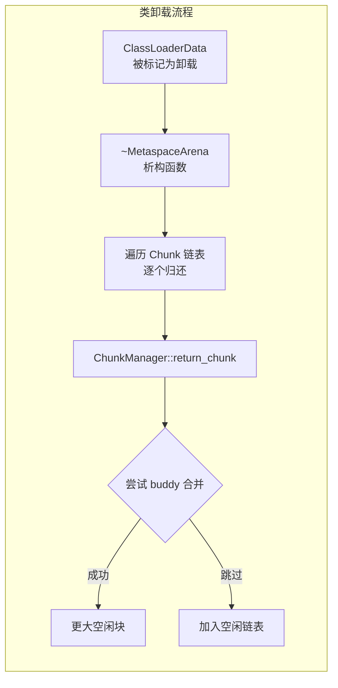
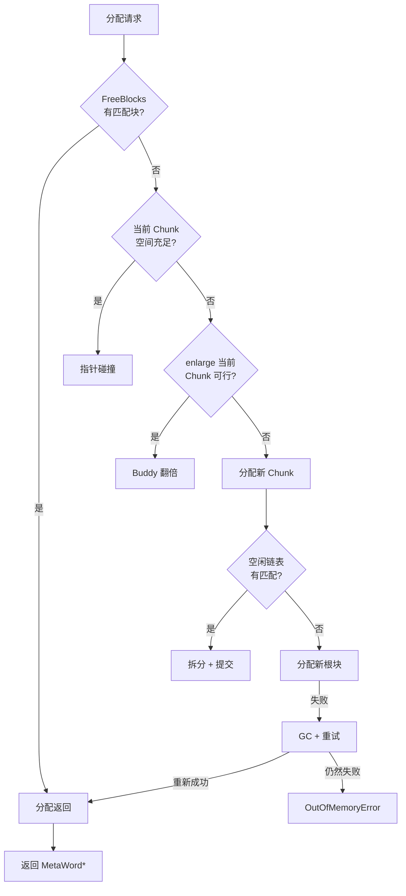

# Metaspace GC 与空间回收

> 上次修改：2026-06-06 15:30
> 本文档对应源码目录：`src/hotspot/share/memory/`

## 重点关注
- [ ] `_capacity_until_GC` 水位线动态调整机制
- [ ] 类卸载时的 Chunk 归还流程
- [ ] `ChunkManager::purge()` 空间回收
- [ ] 分配优先级决策树
- [ ] CDS 集成
- [ ] 诊断命令和日志

## Metaspace GC 触发机制

当 Metaspace 已提交内存达到 `_capacity_until_GC` 水位线时，触发 Metaspace GC。

### 水位线动态调整

```cpp
// 初始化时设为 MaxMetaspaceSize (禁止 GC)
_capacity_until_GC = MaxMetaspaceSize;

// post_initialize 后设为基础值
_capacity_until_GC = MAX2(committed_bytes(), MetaspaceSize);

// GC 后扩容 (在 GC 循环中调整)
_capacity_until_GC += MaxMetaspaceSize / 6;
```

### 分配路径上的检查

在 `ClassLoaderMetaspace` 分配时，通过 `CommitLimiter` 检查：

```cpp
bool CommitLimiter::possible_expansion_words() const {
  // 1. 检查 MaxMetaspaceSize
  // 2. 检查 GC 阈值 (_capacity_until_GC)
  // 3. 检查 CompressedClassSpaceSize (类分配)
  // 如果任一条件不满足，禁止扩展
}
```

如果分配因无法提交新内存而失败，并且 JVM 已经完全初始化，则：

```cpp
result = Universe::heap()->satisfy_failed_metadata_allocation(
           loader_data, word_size, mdtype);
```

这会触发一次 GC 循环（可能包括 Metaspace GC），然后重试分配。

### 三维评估：水位线机制

#### 这样实现的好处
- **懒 GC 触发**：初始化期间禁止 GC，避免类加载阶段的性能抖动
- **动态扩容**：每次 GC 后水位线自动提升 (`+ MaxMetaspaceSize / 6`)，自适应调节 GC 频率
- **原子操作**：`_capacity_until_GC` 是 `volatile size_t`，无锁读写在分配热路径上开销极小

#### 是否有更好的方案
- **固定水位线**：简单但无法适应不同应用的内存行为
- **使用 GC 的反馈调节**：类似 G1 IHOP（Initiating Heap Occupancy Percent）的预测模型，但实现复杂
- **完全不触发 Metaspace GC**：类卸载时才回收，但内存膨胀不受控

#### 不这么实现的问题
- **无 GC 机制**：Metaspace 膨胀无上限，最终 OOM 或耗尽物理内存
- **过于频繁的 GC**：如果 `_capacity_until_GC` 初始化值过小，类加载阶段频繁触发 Full GC，严重影响启动性能

## 类卸载时的元空间回收

当类加载器被回收时 (`ClassLoaderData::unload()`)，关联的 `ClassLoaderMetaspace` 对象被销毁。

`MetaspaceArena::~MetaspaceArena()` 将 Arena 中所有 Chunk 归还给 ChunkManager：

```cpp
MetaspaceArena::~MetaspaceArena() {
  Metachunk* c = _chunks.first();
  while (c) {
    Metachunk* c2 = c->next();
    _chunk_manager->return_chunk(c);
    c = c2;
  }
  delete _fbl;
}
```

归还是合并机会：`ChunkManager::return_chunk()` 尝试将 Chunk 与相邻空闲伙伴合并 (buddy merge)，形成更大的连续空闲块。



## ChunkManager::purge()

`purge()` 回收未使用的物理内存：

```cpp
void ChunkManager::purge() {
  // 1. 尝试完全释放空闲节点 (空闲 = 节点中所有根块都是空闲且合并的)
  vslist->purge_nodes();

  // 2. 取消提交空闲 Chunk 的物理内存
  for (每个 level 的空闲链表) {
    uncommit_free_chunks();
  }
}
```

**节点释放**: 如果 VirtualSpaceNode 的全部内存都被归还（所有根块合并且空闲），则整个节点被 unmapped，完全释放给操作系统。

**取消提交**: 空闲 Chunk 的内存被 `munmap` 或 `os::uncommit_memory()`，物理内存归还给操作系统。

### 三维评估：Purge 机制

#### 这样实现的好处
- **物理内存归还**：空闲 Chunk 取消提交后，物理内存可以被其他进程或堆使用
- **整节点释放**：`purge_nodes()` 可以完全释放一个 VirtualSpaceNode，大幅度减少地址空间和物理内存占用
- **批量操作**：`uncommit_free_chunks()` 批量处理，减少系统调用次数

#### 是否有更好的方案
- **Incremental uncommit**：逐块取消提交，更精细但系统调用更多
- **异步 purging**：在后台线程执行，不阻塞应用线程
- **madvise(MADV_DONTNEED)**：部分平台使用此方式替代 munmap，保留地址空间但释放物理内存

#### 不这么实现的问题
- **不 purge 的内存泄漏**：类卸载后空闲内存无法归还操作系统，进程 Rss 持续增长
- **频繁 purge 的性能开销**：每次 GC 后 purge 全部空闲链表，可能在 Metaspace 震荡场景下造成性能损失

## 空间退化优先级

```
Arena 分配请求
  │
  ├─ 1. FreeBlocks (提前释放的空间碎片)
  │      ↓ 最快，无锁 (Arena 本地)
  │
  ├─ 2. 当前 Chunk 指针碰撞
  │      ↓ O(1), 无锁
  │
  ├─ 3. Enlarge 当前 Chunk (翻倍)
  │      ↓ 避免分配新 Chunk
  │
  ├─ 4. 从 ChunkManager 空闲链表获取
  │      ↓ 重用已存在的内存
  │
  ├─ 5. 从 VirtualSpaceList 分配新根块
  │      ↓ 扩展保留地址空间
  │
  └─ 6. GC + 重试 (heap->satisfy_failed_metadata_allocation)
         ↓ 回收无引用的 ClassLoaderData
```



## CDS (Class Data Sharing) 集成

**源文件**: `src/hotspot/share/cds/`

当 CDS 激活时 (`Xshare:on`)，Metaspace 初始化路径有所不同：

1. CDS 归档从文件映射到内存 (`AOTMetaspace::initialize_runtime_shared_and_meta_spaces()`)
2. 类空间被映射在归档区域之上
3. 预计算的 Klass 对象直接从归档映射，无需分配
4. `CompressedKlassPointers` 编码基于归档基址

## 常见问题和诊断

### 诊断命令

```bash
# 打印 Metaspace 统计 (jcmd)
jcmd <pid> VM.metaspace

# 基本信息
jcmd <pid> VM.metaspace basic

# 详细统计 (所有 Arena)
jcmd <pid> VM.metaspace show-loaders

# 按类加载器分组
jcmd <pid> VM.metaspace by-chunktype
```

### 相关 JVM 日志

```bash
-XX:+UnlockDiagnosticVMOptions -Xlog:gc+metaspace*
-Xlog:metaspace*
-Xlog:gc+metaspace+freelist*
```

**`metaspace` 日志标签示例**:

```
[0.123s][info][gc,metaspace] Metaspace:  reserved (rs) = 2097152K, committed (cm) = 65536K,
  used (used) = 63872K, used% (cm) = 97.5%, used% (rs) = 3.0%
[0.123s][info][gc,metaspace]   class space:  reserved (rs) = 1048576K, committed (cm) = 32768K,
    used (used) = 31872K, used% (cm) = 97.3%, used% (rs) = 3.0%
```

## 引用代码索引

以下代码块中的引用文件路径使用**相对路径**（相对于工程根目录）:
- `src/hotspot/share/memory/metaspace.cpp` — MetaspaceGC::initialize(), post_initialize(), Metaspace::allocate()
- `src/hotspot/share/memory/metaspace/commitLimiter.hpp` — CommitLimiter::possible_expansion_words()
- `src/hotspot/share/memory/metaspace/metaspaceArena.hpp` — MetaspaceArena::~MetaspaceArena()
- `src/hotspot/share/memory/metaspace/chunkManager.hpp` — ChunkManager::purge(), return_chunk()
- `src/hotspot/share/cds/` — CDS 相关实现
