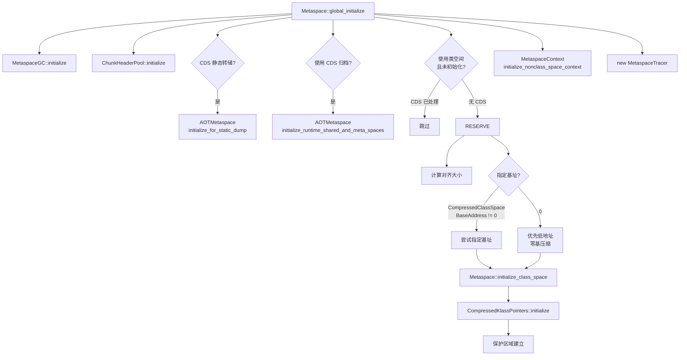

# 元空间初始化 (Metaspace::global_initialize)

> 上次修改：2026-06-06 15:30
> 本文档对应源码目录：`src/hotspot/share/memory/`

## 重点关注
- [ ] `Metaspace::global_initialize()` 的 5 个初始化步骤
- [ ] GC 水位线初始化（禁止 GC → 允许 GC）
- [ ] ChunkHeaderPool 对象池
- [ ] 压缩类空间初始化（CDS 激活 vs 无 CDS）
- [ ] 非类元空间上下文创建
- [ ] 初始化完成后的内存布局

## 初始化入口

**源文件**: `src/hotspot/share/memory/metaspace.cpp` line 718

```cpp
void Metaspace::global_initialize() {
  MetaspaceGC::initialize();
  metaspace::ChunkHeaderPool::initialize();

  // CDS 静态转储处理
  if (CDSConfig::is_dumping_static_archive()) {
    AOTMetaspace::initialize_for_static_dump();
  }

  // 压缩类空间初始化 (64-bit)
  // case a) CDS 激活 → AOTMetaspace 接管
  // case b) CDS 未激活 → 自主保留地址空间
  if (CDSConfig::is_using_archive()) {
    AOTMetaspace::initialize_runtime_shared_and_meta_spaces();
  }

  // case b) 无 CDS: 保留 CompressedClassSpaceSize 虚拟地址
  if (using_class_space() && !class_space_is_initialized()) {
    ReservedSpace rs;
    // ... 地址保留逻辑 ...
    Metaspace::initialize_class_space(rs);
    CompressedKlassPointers::initialize((address)rs.base(), rs.size());
  }

  // 初始化非类元空间
  MetaspaceContext::initialize_nonclass_space_context();

  _tracer = new MetaspaceTracer();
}
```



## 调用顺序

### 1. MetaspaceGC::initialize()

**源文件**: `src/hotspot/share/memory/metaspace.cpp` line 377

```cpp
void MetaspaceGC::initialize() {
  _capacity_until_GC = MaxMetaspaceSize;  // 初始化为 MaxMetaspaceSize
}
```

- `_capacity_until_GC` 是 Metaspace GC 的水位线。当已提交的 Metaspace 超过此值时触发 GC。
- 在初始化期间设为大值 (`MaxMetaspaceSize`) 以防止在 JDK 类加载阶段触发不必要的 GC。

### 2. ChunkHeaderPool::initialize()

**源文件**: `src/hotspot/share/memory/metaspace/chunkHeaderPool.cpp`

```cpp
static ChunkHeaderPool* _chunkHeaderPool = nullptr;

void ChunkHeaderPool::initialize() {
  assert(_chunkHeaderPool == nullptr, "already initialized");
  _chunkHeaderPool = new ChunkHeaderPool();
}
```

创建全局唯一的 `Metachunk` 对象池。Chunk 头与数据分离，此池管理 Metachunk 对象的分配和回收。

### 3. 压缩类空间 (Compressed Class Space) 初始化

仅在使用 `UseCompressedClassPointers` 时启用（64-bit 默认开启）。

**case a) CDS 激活**:

```cpp
if (CDSConfig::is_using_archive()) {
  AOTMetaspace::initialize_runtime_shared_and_meta_spaces();
}
```

CDS (Class Data Sharing) 从预先转储的归档文件映射共享元空间，包含类空间。如果映射失败，`UseSharedSpaces` 被重置为 false。

**case b) 无 CDS (自主保留)**:

```cpp
// 计算对齐后的类空间大小
const size_t size = align_up(CompressedClassSpaceSize, Metaspace::reserve_alignment());

// 尝试指定基址 (主要用于测试)
if (CompressedClassSpaceBaseAddress != 0) { ... }

// 让操作系统选择位置, 但优先低地址 (便于零基压缩编码)
rs = Metaspace::reserve_address_space_for_compressed_classes(size, true);

// 初始化类空间
Metaspace::initialize_class_space(rs);

// 建立压缩类指针编码
CompressedKlassPointers::initialize((address)rs.base(), rs.size());

// 防止零 nKlass ID 解码导致延迟错误
if (CompressedKlassPointers::base() == (address)rs.base()) {
  CompressedKlassPointers::establish_protection_zone(
    protzone, Settings::commit_granule_bytes());
}
```

### 4. 非类元空间初始化

```cpp
MetaspaceContext::initialize_nonclass_space_context();
```

创建非类元空间上下文：

```cpp
void MetaspaceContext::initialize_nonclass_space_context() {
  _nonclass_space_context = create_expandable_context("non-class-space",
                                                       CommitLimiter::globalLimiter());
}
```

创建一个可扩展的元空间上下文（可在需要时映射新的 VirtualSpaceNode）。

### 5. MetaspaceTracer

```cpp
_tracer = new MetaspaceTracer();
```

创建元空间事件追踪器（用于 JFR 事件）。

## Metaspace::initialize_class_space()

**源文件**: `src/hotspot/share/memory/metaspace.cpp` (static, near line 808)

```cpp
static void initialize_class_space(ReservedSpace rs) {
  MetaspaceContext::initialize_class_space_context(rs);
}
```

调用 MetaspaceContext 创建非可扩展上下文：

```cpp
void MetaspaceContext::initialize_class_space_context(ReservedSpace rs) {
  _class_space_context = create_nonexpandable_context("class-space",
                                                       rs,
                                                       CommitLimiter::globalLimiter());
}
```

非可扩展意味着 VirtualSpaceList 只能使用给定的 `rs` 这一块空间，不能映射新的虚拟内存区域。

## 初始化完成后的内存布局

```
高地址
  ┌──────────────────────────────┐
  │      非类元空间 VirtualSpaceList     │  ← 可扩展 (多个节点)
  │  ┌────────────────────────┐  │
  │  │ VirtualSpaceNode #0    │  │
  │  ├────────────────────────┤  │
  │  │ VirtualSpaceNode #1    │  │     ← 按需扩展
  │  └────────────────────────┘  │
  ├──────────────────────────────┤
  │  压缩类空间 (单个节点)         │  ← 固定大小 (CompressedClassSpaceSize)
  │  ┌──────────────────────────┐│
  │  │   16MB 根块区域           ││
  │  │   16MB 根块区域           ││
  │  │   ...                    ││
  │  └──────────────────────────┘│
  ├──────────────────────────────┤
  │    Java 堆                   │
  │    (取决于 GC 实现)            │
  │                              │
  └──────────────────────────────┘
  低地址
```

**注意**: 在 64-bit 上，压缩类空间通常位于 Java 堆之前（低位地址），以便窄 Klass 指针可以使用零基编码。实际布局取决于 ASLR 和 CDS 是否激活。

### 三维评估：类空间固定 vs 非类空间可扩展

#### 这样实现的好处
- **类空间固定便于压缩指针**：类空间位置和大小的确定性使 `CompressedKlassPointers` 可以使用简单的 base+shift 编码
- **非类空间弹性扩展**：非类元数据（方法、常量池等）数量不可预测，按需扩展避免浪费
- **故障隔离**：类空间溢出不会影响非类空间，反之亦然

#### 是否有更好的方案
- **统一空间**：类和非类不分离，简化分配器，但无法使用压缩类指针
- **类空间也可扩展**：允许类空间使用多个 VirtualSpaceNode，但压缩类指针需要更复杂的编码
- **全部分配在堆内**：将元数据移到 Java 堆（类似 Java 8 前的永久代），但 GC 复杂度增加

#### 不这么实现的问题
- **类空间固定上限**：如果 `CompressedClassSpaceSize` 太小（默认 1GB），动态生成大量类（如 Lambda、反射代理）的应用可能 OOM
- **非类空间无限增长**：无 `MaxMetaspaceSize` 限制时，内存泄漏只能靠 OS OOM Killer

## 引用代码索引

以下代码块中的引用文件路径使用**相对路径**（相对于工程根目录）：
- `src/hotspot/share/memory/metaspace.cpp` — `Metaspace::global_initialize()`, `MetaspaceGC::initialize()`, `Metaspace::initialize_class_space()`
- `src/hotspot/share/memory/metaspace/chunkHeaderPool.cpp` — `ChunkHeaderPool::initialize()`
- `src/hotspot/share/memory/metaspace/metaspaceContext.hpp` — `MetaspaceContext::initialize_nonclass_space_context()`, `initialize_class_space_context()`
