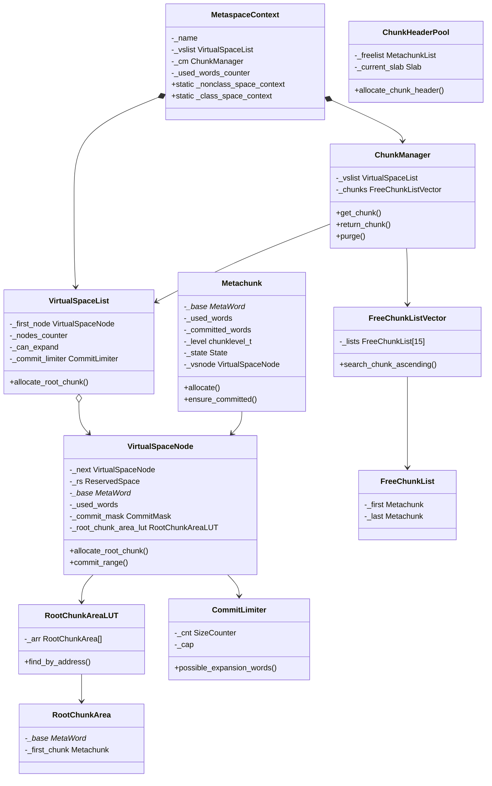
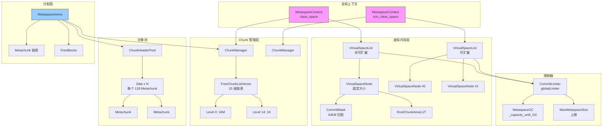

# 元空间核心数据结构

> 上次修改：2026-06-06 15:30
> 本文档对应源码目录：`src/hotspot/share/memory/metaspace/`

## 重点关注
- [ ] MetaspaceContext — 上下文包装器（类空间 vs 非类空间）
- [ ] VirtualSpaceList / VirtualSpaceNode — 虚拟空间管理（含提交位图）
- [ ] ChunkManager — Chunk 分配器（空闲链表管理 + Buddy 系统）
- [ ] Metachunk — 元数据块（分离式头 + 内部布局三区域）
- [ ] Chunk Level 体系 (16M ~ 1K)
- [ ] ChunkHeaderPool — Chunk 对象池
- [ ] CommitLimiter — 提交限制与 GC 触发
- [ ] RootChunkArea — 根块区域管理
- [ ] RunningCounters — 全局计数器

## 类继承关系图



## 1. MetaspaceContext — 元空间上下文

**源文件**: `src/hotspot/share/memory/metaspace/metaspaceContext.hpp`

```cpp
class MetaspaceContext : public CHeapObj<mtMetaspace> {
  const char* const _name;             // 名称: "class-space" / "non-class-space"
  VirtualSpaceList* const _vslist;     // 虚拟空间列表
  ChunkManager* const _cm;             // Chunk 管理器
  SizeAtomicCounter _used_words_counter; // 已用字计数 (原子操作)

  static MetaspaceContext* _nonclass_space_context;  // 全局非类空间
  static MetaspaceContext* _class_space_context;      // 全局类空间
};
```

**职责**: 一个 `MetaspaceContext` 将一个 `VirtualSpaceList`（底层虚拟内存）和一个 `ChunkManager`（上层 Chunk 分配）捆绑在一起。

全局有两个上下文：类空间和非类空间。如果 `UseCompressedClassPointers=false`，类空间不存在，所有分配走非类空间。

**初始化**:
- 类空间: `create_nonexpandable_context()` — 使用预保留的 `ReservedSpace`，不能扩展
- 非类空间: `create_expandable_context()` — 按需创建新节点

```
MetaspaceContext::create_nonexpandable_context()
  → new VirtualSpaceList(name, rs, commit_limiter)  // 单节点, 固定空间
  → new ChunkManager(name, vsl)

MetaspaceContext::create_expandable_context()
  → new VirtualSpaceList(name, commit_limiter)      // 空列表, 按需创建节点
  → new ChunkManager(name, vsl)
```

---

## 2. VirtualSpaceList — 虚拟空间列表

**源文件**: `src/hotspot/share/memory/metaspace/virtualSpaceList.hpp`

```cpp
class VirtualSpaceList : public CHeapObj<mtClass> {
  const char* const _name;                  // 名称
  VirtualSpaceNode* volatile _first_node;   // 链表头 (最新节点)
  IntCounter _nodes_counter;                // 节点数 (统计)
  const bool _can_expand;                   // 是否可扩展
  CommitLimiter* const _commit_limiter;     // 提交限制器
  SizeCounter _reserved_words_counter;      // 总保留字计数
  SizeCounter _committed_words_counter;     // 总提交字计数
};
```

**职责**: 管理一系列连续虚拟内存区域 (VirtualSpaceNode)。每个节点是一块连续的保留地址空间，根 Chunk (16MB) 从当前节点分配。

**关键行为**:
- 可扩展列表: 在需要新根 Chunk 时创建新节点，从 OS 保留更多地址空间
- 不可扩展列表 (类空间): 只使用初始化时给定的一个节点，用完即止（达到 `CompressedClassSpaceSize`）
- 头插法: `_first_node` 始终指向最新添加的节点，新根 Chunk 从中分配

```
VirtualSpaceList (可扩展)
  _first_node → VirtualSpaceNode #2 (最新, 当前分配)
                    ↓ next
                VirtualSpaceNode #1
                    ↓ next
                VirtualSpaceNode #0 (最老)
```

---

## 3. VirtualSpaceNode — 虚拟空间节点

**源文件**: `src/hotspot/share/memory/metaspace/virtualSpaceNode.hpp`

```cpp
class VirtualSpaceNode : public CHeapObj<mtClass> {
  VirtualSpaceNode* _next;                     // 链表下一节点
  ReservedSpace _rs;                           // 底层保留地址空间
  const bool _owns_rs;                         // 是否拥有 RetentionSpace
  MetaWord* const _base;                       // 区域起始地址
  const size_t _word_size;                     // 区域总大小 (words)
  size_t _used_words;                          // 已分配为根 Chunk 的区域
  CommitMask _commit_mask;                     // 提交粒度位图
  RootChunkAreaLUT _root_chunk_area_lut;       // 根块区域查找表
  CommitLimiter* const _commit_limiter;        // 提交限制器
  SizeCounter* const _total_reserved_words_counter;  // ⚡指向全局保留计数器
  SizeCounter* const _total_committed_words_counter; // ⚡指向全局提交计数器
};
```

**职责**: 管理一段连续的保留虚拟地址空间。这是实际内存操作的底层。

**关键属性**:
- `_commit_mask`: 跟踪每个 64KB 提交粒度的提交状态 (bitmap)
- `_root_chunk_area_lut`: 将节点内存按 16MB 根块划分，管理分块信息
- `_used_words`: 跟踪多少空间已经被分配为根 Chunk (未提交)

```
VirtualSpaceNode 内存布局:

| 根块区域 #0    | 根块区域 #1    | 根块区域 #2    | ...  (每个 16MB)
┌──────────────────────────────────────────────────────────────┐
│                                                              │
│                    连续虚拟地址空间                              │
│                                                              │
└──────────────────────────────────────────────────────────────┘
|x| |x|x|x| | | | |x|x|x| | | |x|x| | | |x|x|x|x| | | | | | |  ← 提交位图 (64KB 粒度)
 (x = 已提交内存)
```

**根 Chunk 分配**: `allocate_root_chunk()` 从 `_used_words` 偏移处分配一个 16MB 根块，只保留地址，不提交内存。返回的 `Metachunk*` 指向新创建的根块头。

---

## 4. ChunkManager — Chunk 管理器

**源文件**: `src/hotspot/share/memory/metaspace/chunkManager.hpp`

```cpp
class ChunkManager : public CHeapObj<mtMetaspace> {
  VirtualSpaceList* const _vslist;   // 关联的虚拟空间列表
  const char* const _name;          // 名称
  FreeChunkListVector _chunks;      // 空闲 Chunk 列表向量
};
```

**职责**: 作为 Chunk 分配的核心，ChunkManager:
- 维护按 level (大小) 分级的空闲 Chunk 链表 (FreeChunkListVector)
- 向 VirtualSpaceList 获取新根 Chunk，然后拆分为所需大小的 Chunk
- 接收 Arena 归还的 Chunk，尝试合并 (buddy 方式)
- 实现 Chunk 拆分 (split) 和 合并 (merge) 逻辑

```
ChunkManager 空闲链表:

Level 0 (16M):  [空闲根块] → [空闲根块] → ...
Level 1 (8M):   [空闲 8M] → ...
Level 2 (4M):   ...
...
Level 12 (4K):  ...
Level 13 (2K):  ...
Level 14 (1K):  ...
```

**关键方法**:

```cpp
// 获取 Chunk: 首选 preferred_level, 最大 max_level,
// 前 min_committed_words 必须已提交
Metachunk* get_chunk(chunklevel_t preferred_level,
                     chunklevel_t max_level,
                     size_t min_committed_words);

// 归还 Chunk (可能合并)
void return_chunk(Metachunk* c);

// 回收空闲空间: 释放空闲虚拟内存, 取消提交空闲 Chunk
void purge();
```

**get_chunk 内部流程**:
1. 在空闲链表中查找匹配的 Chunk
2. 如果未找到，从 VirtualSpaceList 分配新根块
3. 拆分根块（或大块）至目标 level
4. 确保前 `min_committed_words` 已提交（触发实际物理内存分配）
5. 返回满足条件的 Chunk

---

## 5. Metachunk — 元数据 Chunk

**源文件**: `src/hotspot/share/memory/metaspace/metachunk.hpp`

```cpp
class Metachunk {
  MetaWord* _base;              // Chunk 数据起始地址 (null = dead)
  size_t _used_words;           // 已使用字
  size_t _committed_words;      // 从 base 起已提交的字数
  chunklevel_t _level;          // 等级 (0=16M, 1=8M, ..., 14=1K)

  enum class State : uint8_t { Free = 0, InUse = 1, Dead = 2 };
  State _state;

  VirtualSpaceNode* _vsnode;    // 反向引用 → 所属 VirtualSpaceNode

  // 链表指针 (用在 Arena 或 FreeList)
  Metachunk* _prev;
  Metachunk* _next;

  // 物理内存顺序链表指针 (用于 buddy 查找邻居)
  Metachunk* _prev_in_vs;
  Metachunk* _next_in_vs;
};
```

**Chunk 头与数据分离**:

```
Metachunk 对象 (CHeap)                Chunk 数据 (Metaspace 内存)
┌─────────────────┐                  ┌──────────────────────┐
│ _base ───────────┼────────────────→│   (提交的内存)         │
│ _used_words = N  │                  │   ┌──────────┐       │
│ _committed_words │                  │   │ used     │       │
│ _level = 3      │                  │   ├──────────┤       │
│ _state = InUse  │                  │   │ free     │       │
│ _vsnode         │                  │   │ (未提交)   │       │
└─────────────────┘                  └──────────────────────┘
```

**Chunk 内部布局**:

```
             committed_top              end
                  v                      v
┌────────────┬────┴──────────────┬──────┴───────┐
│  已使用     │  已提交但未使用    │   未提交       │
│  (used)    │  (free_below_    │              │
│            │   committed)      │              │
└────────────┴──────────────────┴──────────────┘
↑                                  ↑
base (= start)                     base + word_size()
```

**关键操作**:
- `allocate(word_size)`: 指针碰撞分配，返回当前 top，增加 `_used_words`
- `ensure_committed(words)`: 确保前 N 个字已提交，否则调底层 `commit_range()`
- `commit_up_to(words)`: 实际执行提交，必须按提交粒度对齐 (64KB)
- `is_leader()`: 检查是否为 buddy 对中的前驱（用于合并）
- `in_use()/free()/dead()`: 状态机转换

**Buddy 分配器**:

```
leader (此 Chunk)         follower (伙伴)
┌────────────────────┬────────────────────┐
│                    │                    │
│     Chunk X       │    Chunk Y         │
│    level = n      │    level = n       │
└────────────────────┴────────────────────┘
                     ↓ 合并
┌─────────────────────────────────────────┐
│                                         │
│          Chunk Z (level = n-1)          │
│       size = 2 × Chunk X 大小            │
└─────────────────────────────────────────┘
```

### 三维评估：分离式 Chunk 头

#### 这样实现的好处
- **Buddy 操作高效**：合并/拆分只操作 `Metachunk` 对象（指针操作），不涉及数据移动
- **延迟提交**：Chunk 头创建时不提交物理内存，实际提交在分配时按需进行
- **头可重用**：Chunk 合并后不再需要的头对象返回 `ChunkHeaderPool` 复用，减少 malloc 调用

#### 是否有更好的方案
- **嵌入头**：Chunk 头内联在数据块起始处，减少指针引用，但 Buddy 操作时头会覆盖数据区
- **C 风格 struct**：Metachunk 直接 mmap 在数据区头部，简化代码但破坏分离式设计
- **两级头**：慢速路径使用嵌入头，快速路径使用分离头

#### 不这么实现的问题
- **额外指针间接**：每次访问 Metachunk 数据需要 `_base` 解引用，多一次内存读取
- **ChunkHeaderPool 管理开销**：需要额外的对象池维护
- **Dead 状态**：需要明确的 Dead 状态管理和回收

---

## 6. Chunk Level 体系

**源文件**: `src/hotspot/share/memory/metaspace/chunklevel.hpp`

```cpp
static const int NUM_CHUNK_LEVELS = 15;
static const size_t MAX_CHUNK_BYTE_SIZE = 16 * M;  // 根块 16MB
static const size_t MIN_CHUNK_BYTE_SIZE = 1 * K;   // 最小块 1KB

// level 0 = 16M, level 1 = 8M, ... level 14 = 1K
inline size_t word_size_for_level(chunklevel_t level) {
  return (MAX_CHUNK_BYTE_SIZE >> level) / BytesPerWord;
}
```

| Level | 大小 | 典型用途 |
|-------|------|---------|
| 0 | 16MB | 根块 |
| 1 | 8MB | |
| 2 | 4MB | Boot 类加载器非类空间 |
| 3 | 2MB | |
| 4 | 1MB | |
| 5 | 512KB | |
| 6 | 256KB | Boot 类加载器类空间 |
| 7 | 128KB | |
| 8 | 64KB | 提交粒度 |
| 9 | 32KB | |
| 10 | 16KB | 标准类加载器非类空间 |
| 11 | 8KB | 标准类加载器类空间 |
| 12 | 4KB | 标准类加载器初始步 |
| 13 | 2KB | |
| 14 | 1KB | 匿名类加载器大小 |

---

## 7. FreeChunkList / FreeChunkListVector — 空闲 Chunk 链表

**源文件**: `src/hotspot/share/memory/metaspace/freeChunkList.hpp`

**FreeChunkList** (单级双向链表):

```cpp
class FreeChunkList {
  Metachunk* _first;         // 头
  Metachunk* _last;          // 尾
  IntCounter _num_chunks;    // 计数
};
```

**FreeChunkListVector** (多级索引):

```cpp
class FreeChunkListVector {
  FreeChunkList _lists[chunklevel::NUM_CHUNK_LEVELS];  // 15 个链表
};
```

**插入策略**:
- 未提交 Chunk → 添加到链表尾部（惰性，避免搜索）
- 已部分/全部提交 Chunk → 添加到链表头部（加速下次查找）

**查找策略**:
- `search_chunk_ascending(level, max_level, min_committed)`: 从特定 level 向上搜索
- `first_minimally_committed(min)`: 在链表内找第一个满足提交阈值条件的 Chunk

---

## 8. RootChunkArea / RootChunkAreaLUT — 根块区域管理

**源文件**: `src/hotspot/share/memory/metaspace/rootChunkArea.hpp`

```cpp
class RootChunkArea {
  const MetaWord* const _base;     // 区域基址 (16MB 对齐)
  Metachunk* _first_chunk;         // 此区域中的第一个 Chunk
};

class RootChunkAreaLUT {
  const MetaWord* const _base;     // 查找表基址
  const int _num;                  // RootChunkArea 数量
  RootChunkArea* _arr;             // 数组
};
```

`RootChunkArea` 管理一个 16MB 的根块区域，可被 split 成更小的块。`RootChunkAreaLUT` 是一个位于 VirtualSpaceNode 内的查找表，根据地址快速定位所属的 `RootChunkArea`。

---

## 9. ChunkHeaderPool — Chunk 对象池

**源文件**: `src/hotspot/share/memory/metaspace/chunkHeaderPool.hpp`

```cpp
class ChunkHeaderPool : public CHeapObj<mtMetaspace> {
  static const int SlabCapacity = 128;      // 每个 slab 128 个 Metachunk

  struct Slab : public CHeapObj<mtMetaspace> {
    Slab* _next;
    int _top;
    Metachunk _elems[SlabCapacity];          // 预分配的 Metachunk 数组
  };

  IntCounter _num_slabs;
  Slab* _first_slab;
  Slab* _current_slab;
  IntCounter _num_handed_out;
  MetachunkList _freelist;                 // 被回收的 Metachunk 对象
};
```

**职责**: 高效管理 Metachunk 对象的分配与回收。由于 buddy split/merge 操作频繁创建和释放 Chunk 头，需要避免 malloc 开销。

**分配**: 先从 `_freelist` (returned/Dead chunks) 中获取；如果为空，从当前 slab 的预分配数组取下一个。

**回收**: Chunk 合并后，不再需要的小块 Chunk 头返回此池，标记为 Dead。

---

## 10. CommitLimiter — 提交限制器

**源文件**: `src/hotspot/share/memory/metaspace/commitLimiter.hpp`

```cpp
class CommitLimiter : public CHeapObj<mtMetaspace> {
  SizeCounter _cnt;         // 已提交总量
  const size_t _cap;        // 测试用上限 (正常 = 0)
};
```

通过 `CommitLimiter::globalLimiter()` 获取全局实例。`possible_expansion_words()` 检查:
1. **GC 阈值**: 如果当前提交量 + 需要量 > `_capacity_until_GC`，触发 Metaspace GC
2. **MaxMetaspaceSize**: 如果当前提交量 + 需要量 > `MaxMetaspaceSize`，拒绝分配 (OOM)
3. **CompressedClassSpaceSize** (类空间): 如果类空间提交量 > `CompressedClassSpaceSize`，拒绝类分配

---

## 11. MetaspaceGC — GC 触发机制

**源文件**: `src/hotspot/share/memory/metaspace.cpp` line 350-408

```cpp
static volatile size_t _capacity_until_GC;  // 原子变量

void MetaspaceGC::initialize() {
  _capacity_until_GC = MaxMetaspaceSize;
}

void MetaspaceGC::post_initialize() {
  _capacity_until_GC = MAX2(MetaspaceUtils::committed_bytes(), MetaspaceSize);
}
```

`_capacity_until_GC` 是动态调整的水位线:
- Metaspace 提交量超过此值 ⇒ 触发 GC
- GC 后会增大此值 (`_capacity_until_GC += MaxMetaspaceSize / 6`)
- 触发自动扩容: `can_expand()` 检查 GC 阈值、`MaxMetaspaceSize`、`CompressedClassSpaceSize`

  - java
  - hotspot
  - jvm
tags:
---

## 12. RunningCounters — 全局计数器

**源文件**: `src/hotspot/share/memory/metaspace/runningCounters.hpp`

```cpp
struct RunningCounters : public AllStatic {
  static size_t reserved_words();       // 总保留
  static size_t reserved_words_class();
  static size_t reserved_words_nonclass();
  static size_t committed_words();      // 总提交
  static size_t committed_words_class();
  static size_t committed_words_nonclass();
  static size_t used_words();           // 总使用 (由 Arena 中 Chunk 的 used 计数)
  static size_t used_words_class();
  static size_t used_words_nonclass();
  static size_t free_chunks_words();    // 空闲链表中的 Chunk 总量
};
```

这些计数聚合自 VirtualSpaceList (保留/提交) 和 MetaspaceContext (已用)。提供给 `MetaspaceUtils` 使用。

## 数据结构关系图



## 引用代码索引

以下代码块中的引用文件路径使用**相对路径**（相对于工程根目录）:
- `src/hotspot/share/memory/metaspace/metaspaceContext.hpp` — MetaspaceContext 定义
- `src/hotspot/share/memory/metaspace/virtualSpaceList.hpp` — VirtualSpaceList 定义
- `src/hotspot/share/memory/metaspace/virtualSpaceNode.hpp` — VirtualSpaceNode 定义（含 CommitMask）
- `src/hotspot/share/memory/metaspace/chunkManager.hpp` — ChunkManager 定义
- `src/hotspot/share/memory/metaspace/metachunk.hpp` — Metachunk 定义
- `src/hotspot/share/memory/metaspace/chunklevel.hpp` — Chunk Level 常量
- `src/hotspot/share/memory/metaspace/freeChunkList.hpp` — FreeChunkList, FreeChunkListVector
- `src/hotspot/share/memory/metaspace/chunkHeaderPool.hpp` — ChunkHeaderPool
- `src/hotspot/share/memory/metaspace/commitLimiter.hpp` — CommitLimiter
- `src/hotspot/share/memory/metaspace/rootChunkArea.hpp` — RootChunkArea, RootChunkAreaLUT
- `src/hotspot/share/memory/metaspace/metaspaceArena.hpp` — MetaspaceArena
- `src/hotspot/share/memory/metaspace/metaspaceArenaGrowthPolicy.hpp` — ArenaGrowthPolicy
- `src/hotspot/share/memory/metaspace/metaspaceSettings.hpp` — Settings
- `src/hotspot/share/memory/metaspace/runningCounters.hpp` — RunningCounters
- `src/hotspot/share/memory/metaspace.cpp` — MetaspaceGC
