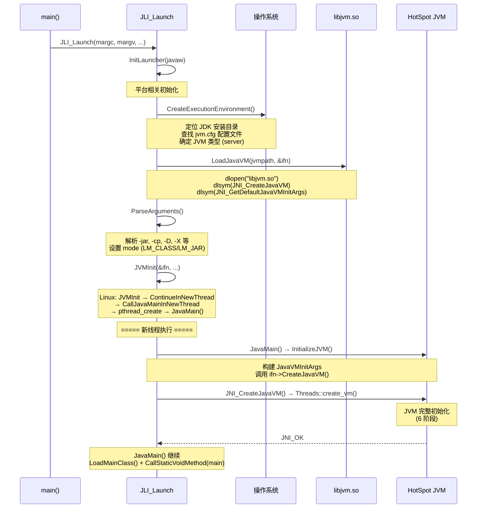

# 启动器与 JVM 入口流程

> 上次修改：2026-06-06 15:30
> 本文档对应源码目录：`src/java.base/share/native/launcher/` + `src/java.base/share/native/libjli/`

## 重点关注
- [ ] `main()` → `JLI_Launch()` → `JNI_CreateJavaVM()` 完整调用链
- [ ] `JLI_Launch()` 的 5 个关键步骤
- [ ] `JavaMain()` 在 JVM 创建后的执行
- [ ] 从 C 启动器到 C++ HotSpot 的控制权移交

## main() 入口

**源文件**: `src/java.base/share/native/launcher/main.c` line 103

```c
JNIEXPORT int main(int argc, char **argv) {
    const jboolean javaw = JNI_FALSE;
    // ... 参数预处理: JDK_JAVA_OPTIONS 环境变量、参数文件展开
    return JLI_Launch(margc, margv,
                      jargc, jargs,   // Java 参数 (如 -D 开头的选项)
                      0, NULL,        // 应用 classpath
                      VERSION_STRING, DOT_VERSION,
                      progname, launcher,
                      jargc > 0, cpwildcard, javaw, 0);
}
```

- `main.c` 是启动器的独立编译单元，引入 `java.h`/`jli_util.h`/`jni.h`
- 所有平台共享同一个 `main()`，Windows 下以 `WinMain` 代替
- `JLI_Launch` 定义在 `src/java.base/share/native/libjli/java.c` line 226

## JLI_Launch() — 启动器主流程

```
main()
  └─ JLI_Launch()
       ├─ InitLauncher(javaw)        // 平台相关初始化
       ├─ CreateExecutionEnvironment() // 定位 jvm.dll/libjvm.so, 解析 jvm.cfg
       ├─ LoadJavaVM(jvmpath, &ifn)   // dlopen JVM 共享库, 获取 JNI_CreateJavaVM 指针
       ├─ ParseArguments()            // 解析命令行 ( -jar, -cp, -X, -D 等)
       └─ JVMInit(&ifn, ...)          // 平台相关 → ContinueInNewThread → JavaMain
```



### 关键步骤

1. **CreateExecutionEnvironment**: 查找 `JAVA_HOME/jre/lib/<arch>/jvm.cfg`，解析可用 JVM 变体，确定 `libjvm.so` 路径。

2. **LoadJavaVM**: `dlopen("libjvm.so")` 加载 JVM 动态库，从符号表中提取：
   - `JNI_CreateJavaVM` → `ifn.CreateJavaVM`
   - `JNI_GetDefaultJavaVMInitArgs` → `ifn.GetDefaultJavaVMInitArgs`

3. **JVMInit → ContinueInNewThread**: 创建新线程执行 `JavaMain()`，主线程等待。（Linux 下直接调用 `JavaMain`）

## JavaMain() — JVM 启动线程

```
JavaMain()
  ├─ InitializeJVM(&vm, &env, &ifn)   // 调用 JNI_CreateJavaVM
  ├─ LoadMainClass(env, mode, what)    // 加载用户主类
  ├─ GetApplicationClass(env)          // JavaFX 辅助类处理
  ├─ PostJVMInit(env, appClass, vm)    // 平台后处理 (如 macOS 菜单)
  └─ invokeStaticMain(env, mainClass)  // 调用 main(String[]) 方法
```

## InitializeJVM → JNI_CreateJavaVM

`InitializeJVM()` 构建 `JavaVMInitArgs` 结构体（包含所有 `-D` 和 `-X` 选项），然后调用：

```c
r = ifn->CreateJavaVM(pvm, (void **)penv, &args);
```

这个函数指针指向 `libjvm.so` 导出的 `JNI_CreateJavaVM`（定义在 `src/hotspot/share/prims/jni.cpp` line 3706）。

## 进入 HotSpot

`JNI_CreateJavaVM` 调用 `JNI_CreateJavaVM_inner`，而后者调用：

```c
result = Threads::create_vm((JavaVMInitArgs*) args, &can_try_again);
```

至此控制权从启动器（C 语言，`libjli`）完全移交给 Hotspot JVM（C++，`libjvm`）。

### 三维评估：启动器架构

#### 这样实现的好处
- **模块分离**：启动器 (`libjli`) 和 JVM (`libjvm`) 是独立的共享库，可以独立升级
- **动态加载**：通过 `dlopen`/`dlsym` 动态解析 JVM 入口，同一个 `java` 二进制可以运行不同版本的 JVM
- **线程隔离**：`pthread_create` 创建独立线程执行 Java 代码，避免 primordial 线程的已知问题

#### 是否有更好的方案
- **静态链接 JVM**：启动器直接包含 JVM 代码，启动更快但灵活性差
- **exec 模式**：启动器 fork+exec 一个新进程执行 JVM（旧 JDK 方式），但进程间通信复杂
- **直接 JNI Invocation API**：用户程序通过 JNI Invocation API 直接嵌入 JVM，无需 `java` 二进制

#### 不这么实现的问题
- **启动延迟**：`dlopen` 和符号解析需要额外时间
- **`pthread_create` 失败处理**：在资源受限环境中线程创建可能失败，有 fallback 到当前线程执行的兜底机制
- **跨平台复杂性**：macOS 需要 `JVMInit` 处理 `​​AUX` 菜单和 `-Xdock` 参数，Windows 需要 `WinMain` 入口

## 调用链总结

```
main()                                [main.c]
  └─ JLI_Launch()                    [java.c]
       └─ JVMInit()                  [java_md.c / java_md_solinux.c]
            └─ ContinueInNewThread() [java.c]
                 └─ JavaMain()       [java.c]
                      └─ InitializeJVM()
                           └─ ifn->CreateJavaVM()
                                └─ JNI_CreateJavaVM()         [jni.cpp]
                                     └─ JNI_CreateJavaVM_inner()
                                          └─ Threads::create_vm() [threads.cpp]
                                               ├─ vm_init_globals()
                                               ├─ init_globals()
                                               │    └─ universe_init()
                                               │         └─ Metaspace::global_initialize()
                                               ├─ init_globals2()
                                               ├─ initialize_java_lang_classes()
                                               └─ Metaspace::post_initialize()
```

## 引用代码索引

以下代码块中的引用文件路径使用**相对路径**（相对于工程根目录）：
- `src/java.base/share/native/launcher/main.c` — `main()` 入口
- `src/java.base/share/native/libjli/java.c` — `JLI_Launch()`, `JavaMain()`, `InitializeJVM()`, `ParseArguments()`, `ContinueInNewThread()`
- `src/java.base/unix/native/libjli/java_md.c` — `CreateExecutionEnvironment()`, `LoadJavaVM()`, `JVMInit()`, `CallJavaMainInNewThread()`
- `src/hotspot/share/prims/jni.cpp` — `JNI_CreateJavaVM()`, `JNI_CreateJavaVM_inner()`
- `src/hotspot/share/runtime/threads.cpp` — `Threads::create_vm()`
