# OpenJDK 26 (JDK 26 GA) 源码阅读指南

> 上次修改：2026-06-14 20:18
> 仓库路径：`/home/haochuliu/Projects/workspaces/clion/jdk/jdk-26-ga/`
> 分析基于 OpenJDK 26 GA (tag: jdk-26-ga) 源码

## 项目概览

- **项目名称**：OpenJDK 26 (JDK 26 GA)
- **项目描述**：Java 开发工具包（JDK）的开源实现，包含 Java 虚拟机 (HotSpot VM)、Java 标准库 (Java SE API) 及开发工具
- **技术栈**：C/C++ (HotSpot JVM)、Java (标准库、工具)、汇编 (平台相关)、GNU Make + autoconf (构建系统)
- **构建方式**：`bash configure --with-boot-jdk=<path> [options]` → `make images`
- **项目规模**：
  - 源代码约 70+ Java 模块，1 个 C++ JVM 核心
  - HotSpot 约 2000+ 源文件（含 share/ + cpu/ + os/ + os_cpu/）
  - Java 标准库约 70+ 模块，数千个包
- **许可证**：GPL v2 with Classpath Exception

## 模块功能摘要

### 一、HotSpot JVM 核心 (C++)

| 模块 / 文档 | 主要功能 | 核心目录 | 文档链接 |
|------------|---------|---------|---------|
| JVM 入口与启动器 | 从 `main()` 到 `JLI_Launch()` 到 `JNI_CreateJavaVM()` | `src/java.base/share/native/launcher/` + `libjli/` | [启动器与JVM入口.md](./启动器与JVM入口.md) |
| JVM 完整初始化 | `Threads::create_vm()` 全流程分析（6 阶段） | `src/hotspot/share/runtime/threads.cpp` | [JVM完整初始化流程.md](./JVM完整初始化流程.md) |
| 元空间初始化 | `Metaspace::global_initialize()` | `src/hotspot/share/memory/metaspace.cpp` | [元空间初始化.md](./元空间初始化.md) |
| 元空间核心数据结构 | MetaspaceContext, VirtualSpaceList, ChunkManager, Metachunk 等 | `src/hotspot/share/memory/metaspace/` | [元空间核心数据结构.md](./元空间核心数据结构.md) |
| Arena 分配与完整路径 | MetaspaceArena, ClassLoaderMetaspace, 完整分配路径 | `src/hotspot/share/memory/metaspace/` | [Arena分配与完整路径.md](./Arena分配与完整路径.md) |
| 压缩类指针 | CompressedKlassPointers 编码/解码/保护区域 | `src/hotspot/share/oops/` | [压缩类指针.md](./压缩类指针.md) |
| 元空间设置与标志 | JVM flags, MetaspaceSettings, 内存模型 | `src/hotspot/share/memory/metaspace/` | [元空间设置与标志.md](./元空间设置与标志.md) |
| 元空间 GC 与回收 | GC 触发机制、类卸载、purge、CDS 集成 | `src/hotspot/share/memory/metaspace.cpp` | [元空间GC与回收.md](./元空间GC与回收.md) |
| 对象初始化分析 | Universe::genesis(), 内置类型 vs 普通对象 | `src/hotspot/share/memory/universe.cpp` + `oops/` | [对象初始化分析.md](./对象初始化分析.md) |
| Agent 加载全流程 | -javaagent/-agentlib 加载、premain/agentmain、JIT 编译 | `src/hotspot/share/prims/` + `java.instrument/` | [Agent加载全流程.md](./Agent加载全流程.md) |
| 从启动到代码执行 | 从 java 命令到 System.out.println 的完整链路 | 跨模块综合 | [从启动到代码执行.md](./从启动到代码执行.md) |
| JVM 同步与锁 | synchronized 底层实现：LockStack 轻量级锁 + ObjectMonitor 重量级锁 | `src/hotspot/share/runtime/` + `oops/` + `cpu/x86/` | [JVM synchronized 锁实现原理.md](./JVM%20synchronized%20锁实现原理.md) |
| Java 代码在 JVM 中的详细执行过程 | 全生命周期：启动→类加载→链接→解释执行→JIT→GC→Native→逆优化 | 跨模块综合 | [Java 代码在 JVM 中的详细执行过程.md](./Java%20代码在%20JVM%20中的详细执行过程.md) |

### 二、HotSpot 垃圾回收器 (GC)

| GC 模块 | 主要功能 | 核心目录 | 文档链接 |
|---------|---------|---------|---------|
| GC 共享基础设施 | GC 框架统一接口、选择工厂、触发原因、计时同步、自适应策略 | `src/hotspot/share/gc/shared/` | [GC 共享基础设施.md](./GC%20共享基础设施.md) |
| Serial GC | 单线程 STW 回收器，Young GC 复制 + Full GC Mark-Sweep-Compact | `src/hotspot/share/gc/serial/` | [Serial GC.md](./Serial%20GC.md) |
| Parallel GC | 多线程吞吐量优先回收器，并行 Young/Parallel Old 标记-压缩 | `src/hotspot/share/gc/parallel/` | [Parallel GC.md](./Parallel%20GC.md) |
| G1 GC | Region 化分代并发 GC，可预测暂停，JDK 9+ 默认回收器 | `src/hotspot/share/gc/g1/` | [G1 GC.md](./G1%20GC.md) |
| ZGC | 超低延迟并发 GC，彩色指针 + 负载屏障，<10ms 暂停 | `src/hotspot/share/gc/z/` | [ZGC.md](./ZGC.md) |
| Shenandoah GC | 超低延迟并发 GC，Brooks 指针 + 读写屏障，并发压缩 | `src/hotspot/share/gc/shenandoah/` | [Shenandoah GC.md](./Shenandoah%20GC.md) |
| Epsilon GC | 无操作 GC，只分配不回收，性能测试专用 | `src/hotspot/share/gc/epsilon/` | [Epsilon GC.md](./Epsilon%20GC.md) |

### 三、Java 标准库模块 (Java)

| 模块组 | 主要内容 | 数量 |
|--------|---------|------|
| `java.*` 标准模块 | java.base（核心）、java.compiler、java.desktop、java.management 等 | 22 个 |
| `jdk.*` 特有模块 | jdk.compiler (javac)、jdk.javadoc、jdk.jfr、jdk.graal.compiler 等 | ~47 个 |

### 四、HotSpot JVM 内部子系统

| 子系统 | 核心目录 | 功能 |
|--------|---------|------|
| 运行时系统 | `runtime/` | 线程管理、安全点、锁、虚拟线程、栈处理、参数系统 |
| 垃圾回收 | `gc/` | G1、ZGC、Shenandoah、Parallel、Serial、Epsilon（6 种 GC） |
| 类加载 | `classfile/` | class 文件解析、验证、字典、符号表 |
| OOPs | `oops/` | Klass 表示、方法、常量池、对象头 |
| 解释器 | `interpreter/` | Template Interpreter、字节码定义 |
| C1 编译器 | `c1/` | 快速编译、轻度优化（LIR、线性扫描） |
| C2 编译器 | `opto/` | 深度优化（Sea-of-Nodes、内联、向量化、逃逸分析） |
| 代码管理 | `code/` | CodeCache、nmethod、编译依赖 |
| JVMTI | `prims/` | JVM Tool Interface、JNI、Unsafe |
| JFR | `jfr/` | Flight Recorder 事件录制 |
| CDS | `cds/` | Class Data Sharing、AOT 缓存 |

## 各 GC 特征对比

| GC | 暂停类型 | 暂停时间 | 堆结构 | 并发阶段 | 核心机制 | 适用场景 |
|----|---------|---------|--------|---------|---------|---------|
| Serial | STW | 秒级 | 分代连续 | 无 | 复制+Mark-Sweep-Compact | 小堆、单核 |
| Parallel | STW | 秒级 | 分代连续 | 无 | 并行复制+并行标记-压缩 | 高吞吐、批处理 |
| G1 | STW+并发 | 数十ms | Region 1-32MB | 标记 | SATB+RSet+停顿预测 | 服务器、大堆 |
| ZGC | STW+并发 | <10ms | 页面 2MB/32MB | 全部 | 彩色指针+负载屏障 | 超低延迟 |
| Shenandoah | STW+并发 | <10ms | Region | 全部 | Brooks指针+读写屏障 | 超低延迟 |
| Epsilon | 无 | N/A | 连续 | 无 | Bump-Allocator | 性能测试 |

## GC 架构总览

```mermaid
%%{init: {'theme':'dark'}}%%
graph TB
    subgraph "GC 框架层 (gc/shared)"
        CC[GCConfig<br/>选择和工厂]
        CH[CollectedHeap<br/>抽象基类]
        VC[VM_GC_Operation<br/>VM操作封装]
        GC[GCCause<br/>触发原因约30种]
        GT[GCTimer<br/>阶段嵌套计时]
        GL[GCLocker<br/>JNI临界区同步]
    end

    subgraph "Serial GC (gc/serial)"
        SH[SerialHeap]
        DN[DefNewGeneration<br/>Young:复制算法]
        SF[SerialFullGC<br/>4阶段MS Compact]
    end

    subgraph "Parallel GC (gc/parallel)"
        PH[ParallelScavengeHeap]
        PS[PSScavenge<br/>Young:并行复制]
        PPC[PSParallelCompact<br/>5阶段并行标记压缩]
        PA[PSAdaptiveSizePolicy<br/>吞吐量自适应]
    end

    subgraph "G1 GC (gc/g1)"
        G1H[G1CollectedHeap]
        G1Y[G1YoungCollector<br/>Young/Mixed GC]
        G1CM[G1ConcurrentMark<br/>7阶段并发标记]
        G1F[G1FullCollector<br/>5阶段 Full GC]
        G1R[G1RemSet<br/>Card精度RSet]
        G1P[G1Policy<br/>停顿预测+IHOP]
    end

    subgraph "ZGC (gc/z)"
        ZH[ZCollectedHeap]
        ZD[ZDriverMinor/Major<br/>GC循环驱动]
        ZM[ZMark<br/>并发标记 无锁stripe]
        ZR[ZRelocate<br/>并发重定位]
        ZB[ZBarrier<br/>负载屏障+自愈合]
    end

    subgraph "Shenandoah GC (gc/shenandoah)"
        S1H[ShenandoahHeap]
        SC[ShenandoahConcurrentGC<br/>并发GC周期]
        SB[ShenandoahBarrierSet<br/>Brooks指针+读写屏障]
    end

    subgraph "Epsilon GC (gc/epsilon)"
        EH[EpsilonHeap]
        EB[EpsilonBarrierSet<br/>全空屏障]
    end

    CC -->|工厂创建| SH
    CC -->|工厂创建| PH
    CC -->|工厂创建| G1H
    CC -->|工厂创建| ZH
    CC -->|工厂创建| S1H
    CC -->|工厂创建| EH
    CH -->|继承| SH
    CH -->|继承| PH
    CH -->|继承| G1H
    CH -->|继承| ZH
    CH -->|继承| S1H
    CH -->|继承| EH
    VC -->|安全点执行| CH
```



## 源码阅读建议

### 阅读顺序（GC 部分）

1. **[GC 共享基础设施.md](./GC%20共享基础设施.md)** — 先了解 GC 框架的公共接口和设计模式
2. **[Serial GC.md](./Serial%20GC.md)** — 最简单的 GC 实现，适合作为起点
3. **[Parallel GC.md](./Parallel%20GC.md)** — 理解吞吐量优先的并行 GC 基本思路
4. **[G1 GC.md](./G1%20GC.md)** — 业界最广泛使用的 Region 化并发 GC
5. **[ZGC.md](./ZGC.md)** — 彩色指针 + 负载屏障的超低延迟 GC
6. **[Shenandoah GC.md](./Shenandoah%20GC.md)** — Brooks 指针 + 并发压缩的超低延迟 GC
7. **[Epsilon GC.md](./Epsilon%20GC.md)** — 极简实现，对比理解 GC 框架最小接口

### 总体阅读建议

**第一阶段（入门）：理解整体架构**
1. [摘要.md](./摘要.md) — 当前文档，建立整体认知
2. [启动器与JVM入口.md](./启动器与JVM入口.md) — 了解 JVM 如何启动
3. [从启动到代码执行.md](./从启动到代码执行.md) — 完整流程概览
4. [Java 代码在 JVM 中的详细执行过程.md](./Java%20代码在%20JVM%20中的详细执行过程.md) — 全生命周期深入

**第二阶段（元空间核心）：深入内存管理**
5. [元空间初始化.md](./元空间初始化.md) — 元空间如何初始化
6. [元空间核心数据结构.md](./元空间核心数据结构.md) — 关键数据结构
7. [Arena分配与完整路径.md](./Arena分配与完整路径.md) — 分配路径详解
8. [压缩类指针.md](./压缩类指针.md) — 指针压缩原理
9. [元空间设置与标志.md](./元空间设置与标志.md) — 配置和常量
10. [元空间GC与回收.md](./元空间GC与回收.md) — 垃圾回收机制

**第三阶段（GC 核心）：深入垃圾回收**
11. [GC 共享基础设施.md](./GC%20共享基础设施.md) — GC 框架核心
12. [Serial GC.md](./Serial%20GC.md) → [Parallel GC.md](./Parallel%20GC.md) → [G1 GC.md](./G1%20GC.md) → [ZGC.md](./ZGC.md) → [Shenandoah GC.md](./Shenandoah%20GC.md) → [Epsilon GC.md](./Epsilon%20GC.md)

**第四阶段（高级）：深入理解对象和同步**
13. [对象初始化分析.md](./对象初始化分析.md) — 对象创建的本质
14. [JVM完整初始化流程.md](./JVM完整初始化流程.md) — JVM 全部初始化阶段
15. [Agent加载全流程.md](./Agent加载全流程.md) — Agent 机制
16. [JVM synchronized 锁实现原理.md](./JVM%20synchronized%20锁实现原理.md) — 锁升级与 ObjectMonitor

### 重点关注章节

- [ ] GC 选择机制 — `GCConfig::select_gc()` 如何根据标志或自动检测选择 GC
- [ ] 并发 GC 对比 — ZGC（彩色指针+负载屏障）vs Shenandoah（Brooks指针+读写屏障）vs G1（SATB+RSet）
- [ ] GC 触发链路 — 从分配失败到 GC 暂停的完整链路：`mem_allocate` → VM Operation → `collect()`
- [ ] GC Locker — JNI 临界区与 GC 的 Dekker 同步协议
- [ ] 自适应调整 — `AdaptiveSizePolicy` 基于滑动窗口统计的动态调优

### 预备知识

- **C/C++ 基础**：HotSpot 核心约 150 万行 C++，需要理解虚函数、模板、RTTI
- **JVM 规范基础**：字节码指令集、类文件格式、运行时数据区
- **操作系统概念**：虚拟内存（mmap/保留/提交）、信号处理、线程/进程、NUMA
- **并发编程基础**：CAS、安全点（Safepoint）、工作窃取（Work-Stealing）、无锁队列
- **Java 模块系统**：JPMS 模块化设计
- **编译原理**：IR、SSA、寄存器分配（C2 编译器相关）

### 调试技巧

```bash
# 构建慢调试版本
bash configure --with-debug-level=slowdebug --with-native-debug-symbols=internal
make images

# GC 日志
./build/*/jdk/bin/java -Xlog:gc*=info -version
./build/*/jdk/bin/java -Xlog:gc+heap=debug -version
./build/*/jdk/bin/java -Xlog:gc*:file=gc.log -version

# GC 原因 + 阶段详情
./build/*/jdk/bin/java -Xlog:gc+phases=info,gc+cause=info -version

# 使用 jcmd 触发 GC 并打印详细日志
jcmd <pid> GC.run
jcmd <pid> GC.heap_info

# GDB 调试 GC
gdb --args ./build/*/jdk/bin/java -XX:+UseG1GC -version
# (gdb) break G1CollectedHeap::do_collection_pause_at_safepoint
# (gdb) run
```

### 扩展阅读

- **OpenJDK 官方指南**：https://openjdk.org/guide/
- **JVM 规范**：Java Virtual Machine Specification (Java SE 26 Edition)
- **HotSpot 术语表**：https://openjdk.org/groups/hotspot/docs/HotSpotGlossary.html
- **ZGC 论文**：The Z Garbage Collector: Low Latency GC for Terabytes of Memory
- **Shenandoah GC**：https://wiki.openjdk.org/display/shenandoah
- **G1 GC 论文**：Garbage-First Garbage Collection (PPT 2004)

## 关键调用链速查

### GC 触发路径（通用）

```
分配失败 → mem_allocate()
  └─ satisfy_failed_allocation()
       └─ collect_at_safepoint() (STW)
            ├─ do_young_collection() (Young GC)
            │    └─ 具体收集器
            └─ do_full_collection() (Full GC)
                 └─ 具体 Full GC 实现
```

### Serial GC

```
SerialHeap::mem_allocate_work          (serialHeap.cpp:304)
  └─ VMThread::execute(VM_SerialCollectForAllocation)
       └─ SerialHeap::satisfy_failed_allocation (serialHeap.cpp:446)
            └─ collect_at_safepoint (serialHeap.cpp:515)
                 ├─ do_young_collection → DefNewGeneration::collect
                 └─ do_full_collection → SerialFullGC::invoke_at_safepoint
                                         (4阶段: Mark → 计算 → 调整 → 压缩)
```

### Parallel GC

```
ParallelScavengeHeap::mem_allocate()   (parallelScavengeHeap.cpp:265)
  └─ VM_ParallelCollectForAllocation
       └─ ParallelScavengeHeap::satisfy_failed_allocation
            └─ PSScavenge::invoke() (Young GC)
            │    └─ ScavengeRootsTask (并行根扫描)
            │    └─ PSPromotionManager (CAS复制+PLAB+窃取)
            └─ PSParallelCompact::invoke() (Full GC)
                 (5阶段: 标记→摘要→转发→调整指针→压缩)
```

### G1 GC

```
G1CollectedHeap::mem_allocate → do_collection_pause_at_safepoint
  └─ G1YoungCollector::collect()
       ├─ pre_evacuate → evacuate_initial → evacuate_optional → post_evacuate
       └─ G1ConcurrentMarkThread::concurrent_mark_cycle_do() [异步]
            (7阶段: 根扫描→标记循环→重建RSet→MMU→Cleanup→CLD→位图)
  └─ G1FullCollector::collect() (5阶段: 标记→准备→调整→压缩→重置)
```

### ZGC

```
ZDirector::evaluate_rules() [异步, 100Hz]
  └─ ZDriverMinor::collect() (Minor GC 8步循环)
       └─ Pause Mark Start (STW) → Concurrent Mark → Pause Mark End (STW)
            → Mark Free → Reset Relocation → Select Relocation
            → Pause Relocate Start (STW) → Concurrent Relocate
  └─ ZDriverMajor::collect() (Major GC 10步循环: 含引用处理+类卸载+Remap Roots)

Load Barrier: mutator 加载 oop → is_load_good? → 是: uncolor返回
                                              → 否: relocate_or_remap → mark → self_heal(CAS)
```

### Shenandoah GC

```
ShenandoahControlThread [异步]
  └─ ShenandoahConcurrentGC::collect()
       └─ Init Mark (STW) → Concurrent Mark → Final Mark (STW)
            → Concurrent Evacuation (Brooks指针) → Concurrent Update Refs
            → Final Update Refs (STW) → Cleanup
```

### Epsilon GC

```
EpsilonHeap::allocate_work → ContiguousSpace::par_allocate (CAS bump-pointer)
  └─ 失败: VirtualSpace::expand_by (128MB步长)
       └─ 失败: OOM → ExitOnOutOfMemoryError
EpsilonHeap::collect → 无操作 (仅元空间阈值)
```

## 代码引用规范说明

- 本文档集中所有代码引用使用 **相对路径**（相对于工程根目录 `/home/haochuliu/Projects/workspaces/clion/jdk/jdk-26-ga/`）
- 超出此工程的代码（如系统库）使用绝对路径
- 每个子文档末尾统一列出所有引用文件路径
