# jdk8 源码

# 源码目录结构

## jdk 源码目录

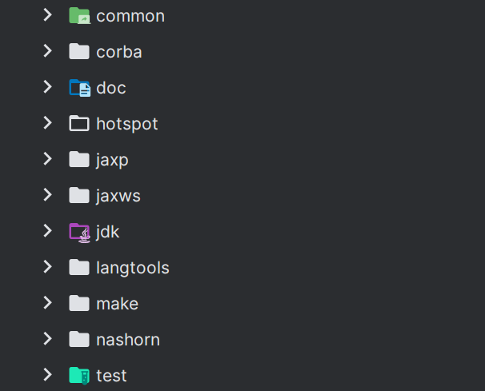

| 目录 | 说明 |
| --- | --- |
| common | 一些公共文件，比如下载源码的 shell 脚本、生成 make 的 autoconf 等文件 |
| corba | 不常用的多语言、分布式通讯接口。全称为 Common Object Request Broker Architecture（通用对象请求代理架构），基于对象-服务机制设计，类似于 JavaBean 和微软的 COM 技术 |
| doc | 文档目录（文档内容是各平台如何编译 jdk 源码的文档） |
| hotspot | hotspot 虚拟机源码 |
| jaxp | 提供 xml 处理 api |
| jaxws | 一组 XML Web Services 的 Java API。全称为 Java API for Web Services，JAX-WS 允许开发者选择面向 RPC（RPC-oriented）或是面向消息（Message-oriented）的方式来实现自己的 Web Services |
| jdk | 主要为 java 类库的源码 |
| langtools | 各种工具实现（这里的工具指的是 javac、javap 等） |
| make | 源码编译脚本目录 |
| nashorn | JVM 上的 JavaScript 运行时（类比 Google 的 v8） |
| test | 各类测试代码，主要是 java 代码 |

## jdk 目录

jdk 目录中重点为 src/share 目录其它均为各平台差异代码实现

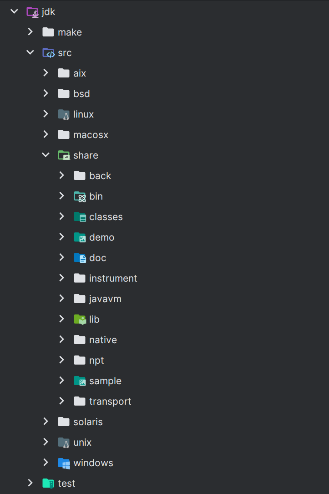

| 目录 | 说明 |
| --- | --- |
| back、instrument、javavm、npt、transport  | 这些目录包含了实现 java 命令实现的细节部分以及头文件 |
| bin | 该目录是 java 命令的入口实现，其中 main.c 中的 main 作为 java 命令的入口 |
| classes | java 基本类型，集合等类库的 java 源码 |
| demo、sample | 均为示例代码 |
| lib | 一些资源和配置文件目录 |
| native | java 源码中 native 方法的 C++ 声明及实现 |

## hotspot 目录

hotspot 中的重点目录为 src/share/vm，agent 目录主要是 java 的 swing 代码。cpu、os、os\_cpu 分别为各 cpu ，操作系统，cpu 和 操作系统 结合部分的差异化实现。

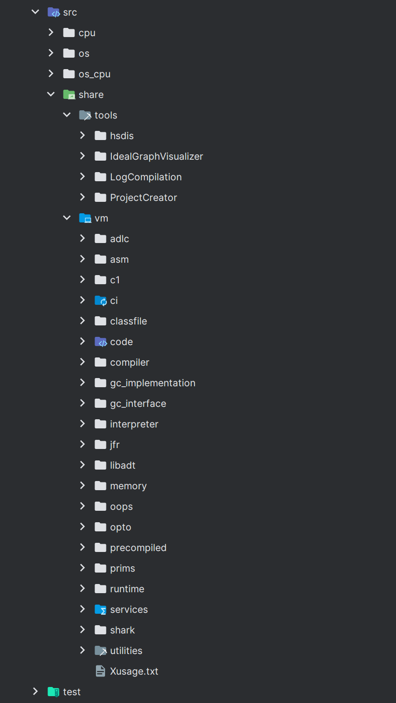

| 目录 | 说明 |
| --- | --- |
| tools/hsdis | 反汇编插件 |
| tools/IdealGraphVisualizer | 将 server 编译器的中间代码可视化的工具 |
| tools/LogCompilation | 将 -XX:+LogCompilation 输出的日志（hotspot.log）整理成更更具可读性格式的工具 |
| tools/ProjectCreator | 生成 Visual Studio 的 project 文件的工具 |
| vm/adlc | 平台描述文件（cpu 或 os\_cpu 目录中的 \*.ad 文件）的编译器 |
| vm/asm | 汇编器接口 |
| vm/c1 | Client 编译器（即 C1） |
| vm/ci | 动态编译器的公共服务（从动态编译器到 VM 的接口） |
| vm/classfile | 处理类文件（包括类加载和系统符号表等） |
| vm/code | 管理动态生成的代码 |
| vm/compiler | 从 VM 调用动态编译器的接口 |
| vm/gc\_implementation | 所有 GC 实现代码 |
| vm/gc\_interface | GC 接口 |
| vm/interpreter | 解释器，包括模板解释器（官方版使用）和 C++ 解释器（官方版未用） |
| vm/jfr | JFR（Java Flight Record）JVM 内置的基于事件的 JDK 监控记录框架代码实现 |
| vm/libadt | 一些抽象数据结构 |
| vm/memory | 内存管理相关实现（老的分代式 GC 框架也位于此处） |
| vm/oops | HotSpot VM 的对象系统的实现 |
| vm/opto | Server 编译器（即 C2） |
| vm/precompiled | C1、C2 编译器的 C++ 代码头文件（这里单开目录意义不明） |
| vm/prims | HotSpot VM 的对外接口，包括部分标准库的 native 部分实现和 JVMTI 实现 |
| vm/rumtime | 运行时支持库（包括线程管理、编译器调度、锁、反射等） |
| vm/services | 用于支持 JMX 之类的管理功能的接口 |
| vm/shark | 基于 LLVM 的 JIT 编译器（官方版未用） |
| vm/utilities | 内部工具类和函数 |

# hotspot 启动流程

java 程序是依赖 jdk 下的 java/javaw 命令运行的，该命令的入口在 `jdk/src/share/bin/main.c`中的 `main / WinMain`

## jvm 启动流程分析

以下是 jvm 启动流程图，也就是直接运行 java 命令流程。

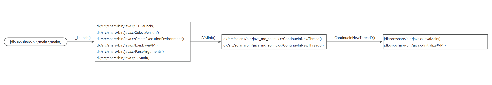

### 源码分析

* `jdk/src/share/bin/main.c`中的 `main / WinMain`主要是`java / javaw `命令的入口

```c
/*
 * Entry point.
 */
int
// argc 是参数个数 argv 是实际的参数
main(int argc, char **argv)
{
    int margc;
    char** margv;
    const jboolean const_javaw = JNI_FALSE;
    // 进一步调用 jdk/src/share/bin/java.c 中的 JLI_Launch 方法
    return JLI_Launch(margc, margv,
                   sizeof(const_jargs) / sizeof(char *), const_jargs,
                   sizeof(const_appclasspath) / sizeof(char *), const_appclasspath,
                   FULL_VERSION,
                   DOT_VERSION,
                   (const_progname != NULL) ? const_progname : *margv,
                   (const_launcher != NULL) ? const_launcher : *margv,
                   (const_jargs != NULL) ? JNI_TRUE : JNI_FALSE,
                   const_cpwildcard, const_javaw, const_ergo_class);
}
```

* `jdk/src/share/bin/java.c/JLI_Launch()`

该方法中有两个主要点：

1. 解析和初始化 jvm 参数
2. 加载核心的 libjvm.so 库，并绑定其中的核心方法到 InvocationFunctions 中，传递给后续方法进一步初始化

```c
/*
 * Entry point.
 */
int
JLI_Launch(int argc, char ** argv,              /* main argc, argc */
        int jargc, const char** jargv,          /* java args */
        int appclassc, const char** appclassv,  /* app classpath */
        const char* fullversion,                /* full version defined */
        const char* dotversion,                 /* dot version defined */
        const char* pname,                      /* program name */
        const char* lname,                      /* launcher name */
        jboolean javaargs,                      /* JAVA_ARGS */
        jboolean cpwildcard,                    /* classpath wildcard*/
        jboolean javaw,                         /* windows-only javaw */
        jint ergo                               /* ergonomics class policy */
)
{
    InvocationFunctions ifn;
    // 这里用于开启 javaw 的 trace 信息，由于基本不用 javaw 普通运行时并不会启用
    InitLauncher(javaw);
    // 用于输出 debug info
    DumpState();

    /*
     * Make sure the specified version of the JRE is running.
     *
     * There are three things to note about the SelectVersion() routine:
     *  1) If the version running isn't correct, this routine doesn't
     *     return (either the correct version has been exec'd or an error
     *     was issued).
     *  2) Argc and Argv in this scope are *not* altered by this routine.
     *     It is the responsibility of subsequent code to ignore the
     *     arguments handled by this routine.
     *  3) As a side-effect, the variable "main_class" is guaranteed to
     *     be set (if it should ever be set).  This isn't exactly the
     *     poster child for structured programming, but it is a small
     *     price to pay for not processing a jar file operand twice.
     *     (Note: This side effect has been disabled.  See comment on
     *     bugid 5030265 below.)
     */
    // 若选定 jre 则加载指定 jre，否则只是初始化一些环境变量
    SelectVersion(argc, argv, &main_class);
    // 这里是将传入参数初始化，分别是 jre 路径、jvm 路径、jvm 配置信息
    CreateExecutionEnvironment(&argc, &argv,
                               jrepath, sizeof(jrepath),
                               jvmpath, sizeof(jvmpath),
                               jvmcfg,  sizeof(jvmcfg));
    // 如果有 jvm 参数则修改
    if (!IsJavaArgs()) {
        SetJvmEnvironment(argc,argv);
    }

    ifn.CreateJavaVM = 0;
    ifn.GetDefaultJavaVMInitArgs = 0;
    /* 这里会通过 dlopen 加载 libjvm.so 库，也是 jvm 的核心实现，这里将 ifn 的地址传入
    libjvm.so 加载完成后，通过 dlsym 会找到库中的三个函数指针并绑定到 InvocationFunctions 
    结构体上，具体绑定关系如下（定义参考 hotspot/src/share/vm/prims/jni.cpp）：
    CreateJavaVM -> JNI_CreateJavaVM
    GetDefaultJavaVMInitArgs -> JNI_GetDefaultJavaVMInitArgs
    GetCreatedJavaVMs -> JNI_GetCreatedJavaVMs
    */
    if (!LoadJavaVM(jvmpath, &ifn)) {
        return(6);
    }

    // 以下都是在解析和初始化 jvm 参数
    if (IsJavaArgs()) {
        /* Preprocess wrapper arguments */
        TranslateApplicationArgs(jargc, jargv, &argc, &argv);
        if (!AddApplicationOptions(appclassc, appclassv)) {
            return(1);
        }
    } else {
        /* Set default CLASSPATH */
        cpath = getenv("CLASSPATH");
        if (cpath == NULL) {
            cpath = ".";
        }
        SetClassPath(cpath);
    }

    /* Parse command line options; if the return value of
     * ParseArguments is false, the program should exit.
     */
    if (!ParseArguments(&argc, &argv, &mode, &what, &ret, jrepath))
    {
        return(ret);
    }

    /* Override class path if -jar flag was specified */
    if (mode == LM_JAR) {
        SetClassPath(what);     /* Override class path */
    }

    /* set the -Dsun.java.command pseudo property */
    SetJavaCommandLineProp(what, argc, argv);

    /* Set the -Dsun.java.launcher pseudo property */
    SetJavaLauncherProp();

    /* set the -Dsun.java.launcher.* platform properties */
    SetJavaLauncherPlatformProps();
    // 调用 jdk/src/solaris/bin/java_md_solinux.c 中的 JVMInit() 方法
    return JVMInit(&ifn, threadStackSize, argc, argv, mode, what, ret);
}
```

* `jdk/src/solaris/bin/java_md_solinux.c/JVMInit()`

套壳方法，实际为了调用 `jdk/src/share/bin/java.c/ContinueInNewThread()`

```c
int
JVMInit(InvocationFunctions* ifn, jlong threadStackSize,
        int argc, char **argv,
        int mode, char *what, int ret)
{
    // 用于战术 jar 信息，若运行参数没加 -jar 则不展示
    ShowSplashScreen();
    // 进一步调用 jdk/src/share/bin/java.c 下的 ContinueInNewThread() 方法
    return ContinueInNewThread(ifn, threadStackSize, argc, argv, mode, what, ret);
}
```

* `jdk/src/share/bin/java.c/ContinueInNewThread()`

初始化 本地方法栈 大小后继续调用 `jdk/src/solaris/bin/java_md_solinux.c/ContinueInNewThread0()`

```c
int
ContinueInNewThread(InvocationFunctions* ifn, jlong threadStackSize,
                    int argc, char **argv,
                    int mode, char *what, int ret)
{

    /*
     * If user doesn't specify stack size, check if VM has a preference.
     * Note that HotSpot no longer supports JNI_VERSION_1_1 but it will
     * return its default stack size through the init args structure.
     */
    // 初始化线程栈大小，这里的指的是 jvm 本地方法栈大小
    if (threadStackSize == 0) {
      struct JDK1_1InitArgs args1_1;
      memset((void*)&args1_1, 0, sizeof(args1_1));
      args1_1.version = JNI_VERSION_1_1;
      ifn->GetDefaultJavaVMInitArgs(&args1_1);  /* ignore return value */
      if (args1_1.javaStackSize > 0) {
         threadStackSize = args1_1.javaStackSize;
      }
    }

    { /* Create a new thread to create JVM and invoke main method */
      JavaMainArgs args;
      int rslt;

      args.argc = argc;
      args.argv = argv;
      args.mode = mode;
      args.what = what;
      args.ifn = *ifn;
      // 进一步调用 jdk/src/solaris/bin/java_md_solinux.c 下的 ContinueInNewThread0() 方法 
      rslt = ContinueInNewThread0(JavaMain, threadStackSize, (void*)&args);
      /* If the caller has deemed there is an error we
       * simply return that, otherwise we return the value of
       * the callee
       */
      return (ret != 0) ? ret : rslt;
    }
}
```

* `jdk/src/solaris/bin/java_md_solinux.c/ContinueInNewThread0()`

该方法中使用 `pthread_create`创建线程用于执行实际的 jvm 初始化方法（`jdk/src/share/bin/java.c/JavaMain()`），如果线程创建失败则直接使用当前线程执行

```c
/*
 * Block current thread and continue execution in a new thread
 */
int
ContinueInNewThread0(int (JNICALL *continuation)(void *), jlong stack_size, void * args) {
    int rslt;
    pthread_t tid;
    pthread_attr_t attr;
    pthread_attr_init(&attr);
    pthread_attr_setdetachstate(&attr, PTHREAD_CREATE_JOINABLE);

    if (stack_size > 0) {
      pthread_attr_setstacksize(&attr, stack_size);
    }
    // 这里使用遵循 posix 规范的 pthread 库用于创建线程并执行相应的 jvm 创建方法。
    // pthread_create 接收 4 个参数，分别为 线程id、线程属性（这里主要修改线程栈大小）、
    // 需要用线程运行的函数地址（jdk/src/share/bin/java.c/JavaMain()）、运行函数的参数
    if (pthread_create(&tid, &attr, (void *(*)(void*))continuation, (void*)args) == 0) {
      void * tmp;
      // pthread_join 会一直等待线程执行完毕
      pthread_join(tid, &tmp);
      rslt = (int)tmp;
    } else {
     /*
      * Continue execution in current thread if for some reason (e.g. out of
      * memory/LWP)  a new thread can't be created. This will likely fail
      * later in continuation as JNI_CreateJavaVM needs to create quite a
      * few new threads, anyway, just give it a try..
      */
      // 如果线程创建失败则使用当前线程直接执行（jdk/src/share/bin/java.c/JavaMain()）
      rslt = continuation(args);
    }

    pthread_attr_destroy(&attr);
    return rslt;
}
```

* `jdk/src/share/bin/java.c/JavaMain()`

jvm 初始化和运行的入口方法，主要流程为：

1. 创建和初始化 jvm  并给 JavaVm 和 JNIEnv 赋值
2. 从 jar 或者 class 中加载指定的主类
3. 从主类中找到 main 方法 id
4. 将参数转为平台支持的数组
5. 开始调用 java 中的 main 方法（控制权会转移到 jvm 中）
6. main 方法结束，所有非守护线程均执行完毕后，开始销毁 jvm

```c
/*
 * Always detach the main thread so that it appears to have ended when
 * the application's main method exits.  This will invoke the
 * uncaught exception handler machinery if main threw an
 * exception.  An uncaught exception handler cannot change the
 * launcher's return code except by calling System.exit.
 *
 * Wait for all non-daemon threads to end, then destroy the VM.
 * This will actually create a trivial new Java waiter thread
 * named "DestroyJavaVM", but this will be seen as a different
 * thread from the one that executed main, even though they are
 * the same C thread.  This allows mainThread.join() and
 * mainThread.isAlive() to work as expected.
 */
// 主要就是先断开当前线程与 java 线程，然后等待所有的非守护线程结束，最后执行 DestroyJavaVM
// 结束当前线程（主线程）
#define LEAVE() \
    do { \
        if ((*vm)->DetachCurrentThread(vm) != JNI_OK) { \
            JLI_ReportErrorMessage(JVM_ERROR2); \
            ret = 1; \
        } \
        if (JNI_TRUE) { \
            (*vm)->DestroyJavaVM(vm); \
            return ret; \
        } \
    } while (JNI_FALSE)

#define CHECK_EXCEPTION_NULL_LEAVE(CENL_exception) \
    do { \
        if ((*env)->ExceptionOccurred(env)) { \
            JLI_ReportExceptionDescription(env); \
            LEAVE(); \
        } \
        if ((CENL_exception) == NULL) { \
            JLI_ReportErrorMessage(JNI_ERROR); \
            LEAVE(); \
        } \
    } while (JNI_FALSE)

#define CHECK_EXCEPTION_LEAVE(CEL_return_value) \
    do { \
        if ((*env)->ExceptionOccurred(env)) { \
            JLI_ReportExceptionDescription(env); \
            ret = (CEL_return_value); \
            LEAVE(); \
        } \
    } while (JNI_FALSE)

int JNICALL
JavaMain(void * _args)
{
    JavaMainArgs *args = (JavaMainArgs *)_args;
    int argc = args->argc;
    char **argv = args->argv;
    int mode = args->mode;
    char *what = args->what;
    InvocationFunctions ifn = args->ifn;

    JavaVM *vm = 0;
    JNIEnv *env = 0;
    jclass mainClass = NULL;
    jclass appClass = NULL; // actual application class being launched
    jmethodID mainID;
    jobjectArray mainArgs;
    int ret = 0;
    jlong start = 0, end = 0;

    RegisterThread();

    /* Initialize the virtual machine */
    start = CounterGet();
    // jvm 创建及初始化并给 JavaVm 和 JNIEnv 赋值
    if (!InitializeJVM(&vm, &env, &ifn)) {
        JLI_ReportErrorMessage(JVM_ERROR1);
        exit(1);
    }
    // 输出所有 java 参数设置
    if (showSettings != NULL) {
        ShowSettings(env, showSettings);
        CHECK_EXCEPTION_LEAVE(1);
    }
    // 输出 java 版本信息 java -version 命令会进入这里
    if (printVersion || showVersion) {
        PrintJavaVersion(env, showVersion);
        CHECK_EXCEPTION_LEAVE(0);
        if (printVersion) {
            LEAVE();
        }
    }

    // 如果 java 命令后面没有可运行的 class 或者 jar 
    /* If the user specified neither a class name nor a JAR file */
    if (printXUsage || printUsage || what == 0 || mode == LM_UNKNOWN) {
        PrintUsage(env, printXUsage);
        CHECK_EXCEPTION_LEAVE(1);
        LEAVE();
    }

    FreeKnownVMs();  /* after last possible PrintUsage() */
    ret = 1;

    /*
     * Get the application's main class.
     *
     * See bugid 5030265.  The Main-Class name has already been parsed
     * from the manifest, but not parsed properly for UTF-8 support.
     * Hence the code here ignores the value previously extracted and
     * uses the pre-existing code to reextract the value.  This is
     * possibly an end of release cycle expedient.  However, it has
     * also been discovered that passing some character sets through
     * the environment has "strange" behavior on some variants of
     * Windows.  Hence, maybe the manifest parsing code local to the
     * launcher should never be enhanced.
     *
     * Hence, future work should either:
     *     1)   Correct the local parsing code and verify that the
     *          Main-Class attribute gets properly passed through
     *          all environments,
     *     2)   Remove the vestages of maintaining main_class through
     *          the environment (and remove these comments).
     *
     * This method also correctly handles launching existing JavaFX
     * applications that may or may not have a Main-Class manifest entry.
     */
    // 加载 java 主类
    mainClass = LoadMainClass(env, mode, what);
    CHECK_EXCEPTION_NULL_LEAVE(mainClass);
    /*
     * In some cases when launching an application that needs a helper, e.g., a
     * JavaFX application with no main method, the mainClass will not be the
     * applications own main class but rather a helper class. To keep things
     * consistent in the UI we need to track and report the application main class.
     */
    // JavaFX 使用，这里不关注
    appClass = GetApplicationClass(env);
    NULL_CHECK_RETURN_VALUE(appClass, -1);
    /*
     * PostJVMInit uses the class name as the application name for GUI purposes,
     * for example, on OSX this sets the application name in the menu bar for
     * both SWT and JavaFX. So we'll pass the actual application class here
     * instead of mainClass as that may be a launcher or helper class instead
     * of the application class.
     */
    // 这里还是 JavaFX 
    PostJVMInit(env, appClass, vm);
    CHECK_EXCEPTION_LEAVE(1);
    /*
     * The LoadMainClass not only loads the main class, it will also ensure
     * that the main method's signature is correct, therefore further checking
     * is not required. The main method is invoked here so that extraneous java
     * stacks are not in the application stack trace.
     */
    // 从主类中得到 main 方法的 id
    mainID = (*env)->GetStaticMethodID(env, mainClass, "main",
                                       "([Ljava/lang/String;)V");
    CHECK_EXCEPTION_NULL_LEAVE(mainID);

    /* Build platform specific argument array */
    // 将 c 参数转为平台数组之后会传递给 main 方法
    mainArgs = CreateApplicationArgs(env, argv, argc);
    CHECK_EXCEPTION_NULL_LEAVE(mainArgs);

    /* Invoke main method. */
    // java 中的 main 方法调用（该方法调用后当前线程就进入到 jvm 运行字节码阶段了）
    (*env)->CallStaticVoidMethod(env, mainClass, mainID, mainArgs);

    /*
     * The launcher's exit code (in the absence of calls to
     * System.exit) will be non-zero if main threw an exception.
     */
    ret = (*env)->ExceptionOccurred(env) == NULL ? 0 : 1;
    LEAVE();
}
```

### 简化 JVM 启动

JVM 启动核心为 `jdk/src/share/bin/java.c`中的 `JavaMain`方法，但由于需要兼容平台差异和界面程序加入了很多代码，以下是简化后的 JVM 启动代码（只要程序正确的加载 libjvm.so 然后按照规则调用其中的方法并传入适当的参数，则使用其它语言也能启动 jvm）以下为 C++ 版实现

```c
#include <iostream>

#include "src/prims/jni.h"
#include <stdlib.h>
#include <string.h>
#include <stdio.h>
#include <unistd.h>
#include "dlfcn.h"

#include "src/include/jni.h"

typedef jint (JNICALL *CreateJavaVM_t)(JavaVM **pvm, void **env, void *args);
typedef jint (JNICALL *GetDefaultJavaVMInitArgs_t)(void *args);
typedef jint (JNICALL *GetCreatedJavaVMs_t)(JavaVM **vmBuf, jsize bufLen, jsize *nVMs);

typedef struct {
    CreateJavaVM_t CreateJavaVM;
    GetDefaultJavaVMInitArgs_t GetDefaultJavaVMInitArgs;
    GetCreatedJavaVMs_t GetCreatedJavaVMs;
} InvocationFunctions;

typedef jclass (JNICALL FindClassFromBootLoader_t(JNIEnv *env,
                                                  const char *name));
static FindClassFromBootLoader_t *findBootClass = NULL;

jclass FindBootStrapClass(JNIEnv *env, const char* classname){
    if (findBootClass == NULL) {
        findBootClass = (FindClassFromBootLoader_t *)dlsym(RTLD_DEFAULT,"JVM_FindClassFromBootLoader");
        if (findBootClass == NULL) {
            return NULL;
        }
    }
    return findBootClass(env, classname);
}


jboolean
LoadJavaVM(const char *jvmpath, InvocationFunctions *ifn){
    void *libjvm;

    // dlopen() 函数以指定模式打开指定的动态链接库文件
    libjvm = dlopen(jvmpath, RTLD_NOW + RTLD_GLOBAL);
    if (libjvm == NULL) {
        std::cout << ::dlerror() << std::endl;
        return JNI_FALSE;
    }

    // dlsym() 函数在动态链接库中查找指定的符号,并返回符号对应的地址
    ifn->CreateJavaVM = (CreateJavaVM_t)
            dlsym(libjvm, "JNI_CreateJavaVM");
    if (ifn->CreateJavaVM == NULL) {
        return JNI_FALSE;
    }

    ifn->GetDefaultJavaVMInitArgs = (GetDefaultJavaVMInitArgs_t)
            dlsym(libjvm, "JNI_GetDefaultJavaVMInitArgs");
    if (ifn->GetDefaultJavaVMInitArgs == NULL) {
        return JNI_FALSE;
    }

    ifn->GetCreatedJavaVMs = (GetCreatedJavaVMs_t)
            dlsym(libjvm, "JNI_GetCreatedJavaVMs");
    if (ifn->GetCreatedJavaVMs == NULL) {
        return JNI_FALSE;
    }

}
static jclass helperClass = NULL;

jclass GetLauncherHelperClass(JNIEnv *env){
    if (helperClass == NULL) {
        helperClass = FindBootStrapClass(env,"sun/launcher/LauncherHelper");
    }
    return helperClass;
}

static jclass GetApplicationClass(JNIEnv *env){
    jmethodID mid;
    jobject result;
    jclass cls = GetLauncherHelperClass(env);
    mid = env->GetStaticMethodID(cls,"getApplicationClass","()Ljava/lang/Class;");

    return static_cast<jclass>(env->CallStaticObjectMethod(cls, mid));
}

static jmethodID makePlatformStringMID = NULL;
static jstring NewPlatformString(JNIEnv *env, char *s)
{
    int len = (int)strlen(s);
    jbyteArray ary;
    jclass cls = GetLauncherHelperClass(env);
    if (s == NULL){
        return 0;
    }

    ary = (env)->NewByteArray(len);
    if (ary != 0) {
        jstring str = 0;
        (env)->SetByteArrayRegion(ary, 0, len, (jbyte *)s);
        if (!(env)->ExceptionOccurred()) {
            if (makePlatformStringMID == NULL) {
                makePlatformStringMID = (env)->GetStaticMethodID(cls, "makePlatformString", "(Z[B)Ljava/lang/String;");
            }
            str = static_cast<jstring>((env)->CallStaticObjectMethod(cls, makePlatformStringMID, JNI_TRUE, ary));
            (env)->DeleteLocalRef(ary);
            return str;
        }
    }
    return 0;
}

static jclass LoadMainClass(JNIEnv *env, int mode, char *name){
    jmethodID  mid;
    jstring    str;
    jobject    result;
    jlong      start, end;
    jclass     cls ;
    cls = GetLauncherHelperClass(env);
    mid = (env)->GetStaticMethodID(cls,"checkAndLoadMain","(ZILjava/lang/String;)Ljava/lang/Class;");

    str = NewPlatformString(env, name); // 这里的name为主类的名称，如com.test/Test
    result = env->CallStaticObjectMethod(cls, mid, JNI_TRUE, mode, str);

    return (jclass)result;
}

jobjectArray
NewPlatformStringArray(JNIEnv *env, char **strv, int strc)
{
    jclass cls;
    jobjectArray ary;
    int i;

    cls = FindBootStrapClass(env, "java/lang/String");
    ary = (env)->NewObjectArray( strc, cls, 0);
    for (i = 0; i < strc; i++) {
        jstring str = NewPlatformString(env, *strv++);
        (env)->SetObjectArrayElement(ary, i, str);
        (env)->DeleteLocalRef(str);
    }
    return ary;
}

int main() {
    int count = 5;
    JavaVMOption *options = (JavaVMOption *)malloc( count * sizeof(JavaVMOption));

    int numOptions = 0;
    options[numOptions].optionString =  "-Djava.class.path=.";
    options[numOptions++].extraInfo = NULL;   

    options[numOptions].optionString =  "-Djava.class.path=.:test/test-0.0.1-SNAPSHOT.jar";
    options[numOptions++].extraInfo = NULL;

    options[numOptions].optionString = "-Dsun.java.command=com.test/test";
    options[numOptions++].extraInfo = NULL;

    options[numOptions].optionString =  "-Dsun.java.launcher=SUN_STANDARD";
    options[numOptions++].extraInfo = NULL;

    char *substr = "-Dsun.java.launcher.pid=";
    char *pid_prop_str = (char *)malloc(strlen(substr) + 10 + 1);
    sprintf(pid_prop_str, "%s%d", substr, getpid());
    options[numOptions].optionString = substr;
    options[numOptions++].extraInfo = NULL;

    // 为启动虚拟机传递的参数
    JavaVMInitArgs  args = {
            65538,
            count,
            options,
            true
    };
    JavaVM *vm = 0;
    JNIEnv *env = 0;

    InvocationFunctions ifn;
    ifn.CreateJavaVM = 0;
    ifn.GetDefaultJavaVMInitArgs = 0;

    // 加载动态链接库并查找相关的符号
    char *jvmpath = "/home/lhc/workspace/jdk/jdk8u412-b08/build/linux-x86_64-normal-server-slowdebug/jdk/lib/amd64/server/libjvm.so";
    LoadJavaVM(jvmpath,&ifn);

    // 创建一个虚拟机实例，目录不能以直接调用的方式启动虚拟机HotSpot
//    jint r = JNI_CreateJavaVM(&vm, (void **)&env, &args);
    jint r = ifn.CreateJavaVM(&vm, (void **)&env, &args);
    free(options);
    if(r == JNI_OK){
        printf("success");
    }

    // 查找Java主类
    char* what = "com.test/test";
    jclass mainClass = LoadMainClass(env, 1, what);

    // 找到Java主类main()方法对应的唯一ID
    jmethodID mainID = env->GetStaticMethodID(mainClass, "main", "([Ljava/lang/String;)V");

    // 为应用程序传递的参数
    jobjectArray mainArgs = NewPlatformStringArray(env, 0, NULL);

    // 调用Java的main()方法
    env->CallStaticVoidMethod(mainClass, mainID, mainArgs);

    return 0;
}
```

# JVM 初始化流程分析

## JVM 创建流程（1）

jvm 创建流程如下，入口函数为 `jdk/src/share/bin/java.c/InitializeJVM()`

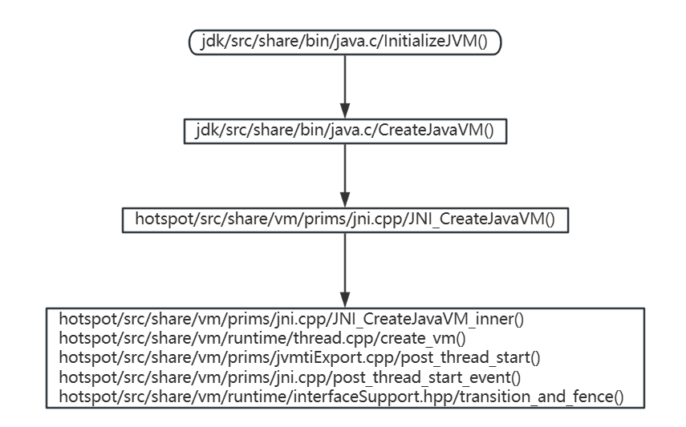

整条调用链需要注意的地方是 `jdk/src/share/bin/java.c/CreateJavaVM()`这里调用的是从 libjvm.so 中导出的函数`hotspot/src/share/vm/prims/jni.cpp/JNI_CreateJavaVM()`实现的 JVM 创建，可以说 JVM 核心的代码都在 libjvm.so 中，以下是 `hotspot/src/share/vm/prims/jni.cpp/JNI_CreateJavaVM_inner()`函数分析

```cpp
static jint JNI_CreateJavaVM_inner(JavaVM **vm, void **penv, void *args) {
  jint result = JNI_ERR;
  // 调用 hotspot/src/share/vm/runtime/thread.cpp/create_vm() 创建 jvm
  result = Threads::create_vm((JavaVMInitArgs*) args, &can_try_again);
  if (result == JNI_OK) {
    JavaThread *thread = JavaThread::current();
    /* thread is thread_in_vm here */
    // vm 初始化完成赋值
    *vm = (JavaVM *)(&main_vm);
    // penv 初始化完成赋值
    *(JNIEnv**)penv = thread->jni_environment();

    // Tracks the time application was running before GC
    // 在 GC 之前记录 jvm 启动时间点
    RuntimeService::record_application_start();

    // Notify JVMTI
    // JVMTI（这里用于 jvm 的各种信息获取和参数修改）一般不会进入这里
    if (JvmtiExport::should_post_thread_life()) {
       JvmtiExport::post_thread_start(thread);
    }
    // 提交 jvm 启动事件（用作性能分析和调试 jfr 等）
    post_thread_start_event(thread);

#ifndef PRODUCT
    // Check if we should compile all classes on bootclasspath
    // 是否编译系统类路径下所有的 class （默认不编译）
    if (CompileTheWorld) ClassLoader::compile_the_world();
    // 是否编译重放（默认不重放）
    if (ReplayCompiles) ciReplay::replay(thread);

    // Some platforms (like Win*) need a wrapper around these test
    // functions in order to properly handle error conditions.
    test_error_handler();
    execute_internal_vm_tests();
#endif

    // Since this is not a JVM_ENTRY we have to set the thread state manually before leaving.
    // 设置当前线程的状态
    ThreadStateTransition::transition_and_fence(thread, _thread_in_vm, _thread_in_native);
  } else {
    // 这里是创建失败的情况，重置 safe_to_recreate_vm、vm、penv 然后在启动线程内进行尝试
    if (can_try_again) {
      // reset safe_to_recreate_vm to 1 so that retrial would be possible
      safe_to_recreate_vm = 1;
    }

    // Creation failed. We must reset vm_created
    *vm = 0;
    *(JNIEnv**)penv = 0;
    // reset vm_created last to avoid race condition. Use OrderAccess to
    // control both compiler and architectural-based reordering.
    OrderAccess::release_store(&vm_created, 0);
  }

  return result;

}
```

## JVM 创建流程（2）

`hotspot/src/share/vm/runtime/thread.cpp/create_vm()`是 JVM 创建的核心，总体流程如下：

1. 初始化操作系统模块的内存页大小，获取物理内存大小，锁等参数
2. 系统参数初始化（JVM 信息等等）
3. JVM 参数解析
4. 初始化可用 CPU 核数，根据配置设置大内存页
5. 设置并校验 是否开启压缩指针、堆内存、偏向锁、gc 参数等（包含各类 gc 能否混用）
6. 操作系统模块的第二次初始化，包含线程锁的初始化，polling\_page 和 mem\_serialize\_page 分配内存，信号处理初始化，设置线程栈大小，libpthread 初始化，设置线程锁，线程优先级策略的初始化
7. 本地线程存储（TLS）初始化（这里只是创建对象）
8. 解析由 -Xrun 转换成 -agentlib 的参数
9. 初始化 Events，各种锁，ChunkPool，PerfMemory
10. 创建一个新的 JavaThread 并设置相关属性，将当前线程同 JavaThread 对象关联起来，通过 JavaThread 管理相关属性
11. 初始化 Java 中的 synchronized 锁
12. 全局模块初始化，如 Management、Bytecodes、ClassLoader、CodeCache、tubRoutines、Universe、Interpreter 等
13. JFR 初始化
14. 创建 JVM 线程和 JVM 操作队列（JVM 的操作以队列形式存储）
15. JVM 初始化完成，但未开始执行任何字节码，此时 dump 一次元空间
16. 通知 JVMTI 启动
17. 加载系统类，首先加载的是`java.lang.String`
18. 重设元空间 GC 阈值
19. 并发标记的初始化，会创建一个新的执行标记线程（前提是使用了 CMS 或 G1）
20. 加载 -Xrun 指定的 agent 库
21. C1 和 C2 初始化，并创建编译线程开始执行
22. 加载动态代理、Management 相关类
23. 偏向锁、事务锁（需要主动开启）初始化
24. 启动监控线程
25. JVM 初始化完成标记置为 true

以下为源码分析

```cpp
jint Threads::create_vm(JavaVMInitArgs* args, bool* canTryAgain) {
  // 初始化，可以由特定平台按需覆盖定义（默认为空实现）
  extern void JDK_Version_init();

  // Preinitialize version info.
  // 预初始化版本信息（默认为空实现）
  VM_Version::early_initialize();

  // Check version
  // 当前 jdk 最低支持的 jni 版本，jdk8 默认最低支持 1.2
  if (!is_supported_jni_version(args->version)) return JNI_EVERSION;

  // Initialize the output stream module
  // 初始化 output stream （这里只是创建了流模块，并未对其中的属性进行初始化）
  ostream_init();

  // Process java launcher properties.
  // 解析参数 -Dsun.java.launcher（用于指定 jvm 启动器，默认标准）
  // -Dsun.java.launcher.pid（jvm 的 pid）以上两个参数都不能通过命令行传入
  // 这是启动器自动生成的参数，在这里给 jvm 初始化使用 
  Arguments::process_sun_java_launcher_properties(args);

  // Initialize the os module before using TLS
  // 操作系统模块的初始化，包含设置内存页大小，获取物理内存大小，锁的初始化
  os::init();

  // Initialize system properties.
  // 系统参数初始化，vm 的版本信息等等
  Arguments::init_system_properties();

  // So that JDK version can be used as a discrimintor when parsing arguments
  // 调用 hotspot/src/share/vm/runtime/java.cpp/JDK_Version::initialize() 方法初始化
  // jvm 的详细版本信息和构建信息
  JDK_Version_init();

  // Update/Initialize System properties after JDK version number is known
  // 初始特定 jdk 版本的系统属性
  Arguments::init_version_specific_system_properties();

  // Parse arguments
  // Note: this internally calls os::init_container_support()
  // 解析可设置的 jvm 参数
  jint parse_result = Arguments::parse(args);
  if (parse_result != JNI_OK) return parse_result;
  // 初始化可用CPU核数，根据配置设置大内存页
  os::init_before_ergo();
  // 设置并校验 是否开启压缩指针、堆内存、偏向锁、gc 参数等（包含各类 gc 能否混用）
  jint ergo_result = Arguments::apply_ergo();
  if (ergo_result != JNI_OK) return ergo_result;

  // 用于调试使用，默认关闭，开启时会让程序停在下面的函数中等待用户输入
  if (PauseAtStartup) {
    os::pause();
  }
  // Record VM creation timing statistics
  TraceVmCreationTime create_vm_timer;
  // 记录 jvm 启动时间
  create_vm_timer.start();

  // Initialize the os module after parsing the args
  // 操作系统模块的第二次初始化，包含线程锁的初始化，polling_page 和 mem_serialize_page 
  // 分配内存，信号处理初始化，设置线程栈大小，libpthread 初始化，设置线程锁，
  // 线程优先级策略的初始化
  jint os_init_2_result = os::init_2();
  if (os_init_2_result != JNI_OK) return os_init_2_result;
  // UseNUMA 参数启用时额外设置
  jint adjust_after_os_result = Arguments::adjust_after_os();
  if (adjust_after_os_result != JNI_OK) return adjust_after_os_result;

  // intialize TLS
  // 本地线程存储初始化（这里只是创建对象）
  ThreadLocalStorage::init();

  // Initialize output stream logging
  // 初始化 GC 日志和 LoadedClass 日志的 fileStream 对象（这里是真实的设置输出文件）
  ostream_init_log();

  // Convert -Xrun to -agentlib: if there is no JVM_OnLoad
  // Must be before create_vm_init_agents()
  // 将参数 -Xrun 转换成 -agentlib 
  if (Arguments::init_libraries_at_startup()) {
    convert_vm_init_libraries_to_agents();
  }

  // Launch -agentlib/-agentpath and converted -Xrun agents
  // 根据 -agentlib/-agentpath 转换后 -Xrun 参数创建 agents
  if (Arguments::init_agents_at_startup()) {
    create_vm_init_agents();
  }

  // Initialize Threads state
  _thread_list = NULL;
  _number_of_threads = 0;
  _number_of_non_daemon_threads = 0;

  // Initialize global data structures and create system classes in heap
  // 初始化Events,各种锁，ChunkPool，PerfMemory
  vm_init_globals();

  // Attach the main thread to this os thread
  // 创建一个新的 JavaThread 并设置相关属性，注意这里并未创建一个新的线程，
  // 而是将当前线程同 JavaThread 对象关联起来，通过 JavaThread 管理相关属性
  JavaThread* main_thread = new JavaThread();
  main_thread->set_thread_state(_thread_in_vm);
  // must do this before set_active_handles and initialize_thread_local_storage
  // Note: on solaris initialize_thread_local_storage() will (indirectly)
  // change the stack size recorded here to one based on the java thread
  // stacksize. This adjusted size is what is used to figure the placement
  // of the guard pages.
  main_thread->record_stack_base_and_size();
  main_thread->initialize_thread_local_storage();

  main_thread->set_active_handles(JNIHandleBlock::allocate_block());

  if (!main_thread->set_as_starting_thread()) {
    vm_shutdown_during_initialization(
      "Failed necessary internal allocation. Out of swap space");
    delete main_thread;
    *canTryAgain = false; // don't let caller call JNI_CreateJavaVM again
    return JNI_ENOMEM;
  }

  // Enable guard page *after* os::create_main_thread(), otherwise it would
  // crash Linux VM, see notes in os_linux.cpp.
  main_thread->create_stack_guard_pages();

  // Initialize Java-Level synchronization subsystem
  // 初始化 java 中的 synchronize 锁
  ObjectMonitor::Initialize();

  // Initialize global modules
  // 全局模块初始化，如 Management、Bytecodes、ClassLoader、CodeCache、tubRoutines、
  // Universe、Interpreter 等
  jint status = init_globals();
  if (status != JNI_OK) {
    delete main_thread;
    *canTryAgain = false; // don't let caller call JNI_CreateJavaVM again
    return status;
  }
  // jfr 初始化
  JFR_ONLY(Jfr::on_vm_init();)

  // Should be done after the heap is fully created
  // 空方法体
  main_thread->cache_global_variables();

  HandleMark hm;

  { MutexLocker mu(Threads_lock);
    Threads::add(main_thread);
  }

  // Any JVMTI raw monitors entered in onload will transition into
  // real raw monitor. VM is setup enough here for raw monitor enter.
  // 将加载时创建的 raw monitors 转换成真正的 raw monitor
  JvmtiExport::transition_pending_onload_raw_monitors();

  // Create the VMThread
  // 创建 jvm 线程和 jvm 操作队列（jvm 的操作以队列形式存储）
  { TraceTime timer("Start VMThread", TraceStartupTime);
    VMThread::create();
    Thread* vmthread = VMThread::vm_thread();

    if (!os::create_thread(vmthread, os::vm_thread))
      vm_exit_during_initialization("Cannot create VM thread. Out of system resources.");

    // Wait for the VM thread to become ready, and VMThread::run to initialize
    // Monitors can have spurious returns, must always check another state flag
    // 等待 VMThread 初始化完成
    {
      MutexLocker ml(Notify_lock);
      os::start_thread(vmthread);
      while (vmthread->active_handles() == NULL) {
        Notify_lock->wait();
      }
    }
  }

  assert (Universe::is_fully_initialized(), "not initialized");
  // 验证 VMThread 的状态
  if (VerifyDuringStartup) {
    // Make sure we're starting with a clean slate.
    VM_Verify verify_op;
    VMThread::execute(&verify_op);
  }

  EXCEPTION_MARK;

  // At this point, the Universe is initialized, but we have not executed
  // any byte code.  Now is a good time (the only time) to dump out the
  // internal state of the JVM for sharing.
  // jvm 初始化完成，但未开始执行任何字节码，此时 dump 一次元空间
  if (DumpSharedSpaces) {
    MetaspaceShared::preload_and_dump(CHECK_0);
    ShouldNotReachHere();
  }

  // Always call even when there are not JVMTI environments yet, since environments
  // may be attached late and JVMTI must track phases of VM execution
  // 标记 JVMTI 启用
  JvmtiExport::enter_start_phase();

  // Notify JVMTI agents that VM has started (JNI is up) - nop if no agents.
  // 通知 JVMTI 启动
  JvmtiExport::post_vm_start();

  {
    TraceTime timer("Initialize java.lang classes", TraceStartupTime);

    // 根据 -agentlib/-agentpath 转换后 -Xrun 参数中指定的 lib 调用其中的 JVM_OnLoad 方法
    if (EagerXrunInit && Arguments::init_libraries_at_startup()) {
      create_vm_init_libraries();
    }
    // 开始初始化各个基础库下面的类
    initialize_class(vmSymbols::java_lang_String(), CHECK_0);

    // Initialize java_lang.System (needed before creating the thread)
    initialize_class(vmSymbols::java_lang_System(), CHECK_0);
    initialize_class(vmSymbols::java_lang_ThreadGroup(), CHECK_0);
    Handle thread_group = create_initial_thread_group(CHECK_0);
    Universe::set_main_thread_group(thread_group());
    initialize_class(vmSymbols::java_lang_Thread(), CHECK_0);
    oop thread_object = create_initial_thread(thread_group, main_thread, CHECK_0);
    // 将 main_thread 同 Java 中的 thread_object 关联起来
    main_thread->set_threadObj(thread_object);
    // Set thread status to running since main thread has
    // been started and running.
    // 设置 thread_object 的线程状态为正在运行
    java_lang_Thread::set_thread_status(thread_object,
                                        java_lang_Thread::RUNNABLE);

    // The VM creates & returns objects of this class. Make sure it's initialized.
    initialize_class(vmSymbols::java_lang_Class(), CHECK_0);

    // The VM preresolves methods to these classes. Make sure that they get initialized
    initialize_class(vmSymbols::java_lang_reflect_Method(), CHECK_0);
    initialize_class(vmSymbols::java_lang_ref_Finalizer(),  CHECK_0);
    call_initializeSystemClass(CHECK_0);

    // get the Java runtime name after java.lang.System is initialized
    JDK_Version::set_runtime_name(get_java_runtime_name(THREAD));
    JDK_Version::set_runtime_version(get_java_runtime_version(THREAD));

    // an instance of OutOfMemory exception has been allocated earlier
    initialize_class(vmSymbols::java_lang_OutOfMemoryError(), CHECK_0);
    initialize_class(vmSymbols::java_lang_NullPointerException(), CHECK_0);
    initialize_class(vmSymbols::java_lang_ClassCastException(), CHECK_0);
    initialize_class(vmSymbols::java_lang_ArrayStoreException(), CHECK_0);
    initialize_class(vmSymbols::java_lang_ArithmeticException(), CHECK_0);
    initialize_class(vmSymbols::java_lang_StackOverflowError(), CHECK_0);
    initialize_class(vmSymbols::java_lang_IllegalMonitorStateException(), CHECK_0);
    initialize_class(vmSymbols::java_lang_IllegalArgumentException(), CHECK_0);
  }

  // See        : bugid 4211085.
  // Background : the static initializer of java.lang.Compiler tries to read
  //              property"java.compiler" and read & write property "java.vm.info".
  //              When a security manager is installed through the command line
  //              option "-Djava.security.manager", the above properties are not
  //              readable and the static initializer for java.lang.Compiler fails
  //              resulting in a NoClassDefFoundError.  This can happen in any
  //              user code which calls methods in java.lang.Compiler.
  // Hack :       the hack is to pre-load and initialize this class, so that only
  //              system domains are on the stack when the properties are read.
  //              Currently even the AWT code has calls to methods in java.lang.Compiler.
  //              On the classic VM, java.lang.Compiler is loaded very early to load the JIT.
  // Future Fix : the best fix is to grant everyone permissions to read "java.compiler" and
  //              read and write"java.vm.info" in the default policy file. See bugid 4211383
  //              Once that is done, we should remove this hack.
  initialize_class(vmSymbols::java_lang_Compiler(), CHECK_0);

  // More hackery - the static initializer of java.lang.Compiler adds the string "nojit" to
  // the java.vm.info property if no jit gets loaded through java.lang.Compiler (the hotspot
  // compiler does not get loaded through java.lang.Compiler).  "java -version" with the
  // hotspot vm says "nojit" all the time which is confusing.  So, we reset it here.
  // This should also be taken out as soon as 4211383 gets fixed.
  reset_vm_info_property(CHECK_0);
  // 初始化 JNIEnv 中 GetField 相关接口
  quicken_jni_functions();

  // Set flag that basic initialization has completed. Used by exceptions and various
  // debug stuff, that does not work until all basic classes have been initialized.
  // 设置初始化完成标识
  set_init_completed();
  // 重设元空间 GC 阈值
  Metaspace::post_initialize();

  // record VM initialization completion time
  // 记录 JVM 初始化完成时间
#if INCLUDE_MANAGEMENT
  Management::record_vm_init_completed();
#endif // INCLUDE_MANAGEMENT

  // Compute system loader. Note that this has to occur after set_init_completed, since
  // valid exceptions may be thrown in the process.
  // Note that we do not use CHECK_0 here since we are inside an EXCEPTION_MARK and
  // set_init_completed has just been called, causing exceptions not to be shortcut
  // anymore. We call vm_exit_during_initialization directly instead.
  // 完成 SystemClassLoader 的加载
  SystemDictionary::compute_java_system_loader(THREAD);
  if (HAS_PENDING_EXCEPTION) {
    vm_exit_during_initialization(Handle(THREAD, PENDING_EXCEPTION));
  }

#if INCLUDE_ALL_GCS
  // Support for ConcurrentMarkSweep. This should be cleaned up
  // and better encapsulated. The ugly nested if test would go away
  // once things are properly refactored. XXX YSR
  // 并发标记的初始化，会创建一个新的执行标记的线程
  if (UseConcMarkSweepGC || UseG1GC) {
    if (UseConcMarkSweepGC) {
      ConcurrentMarkSweepThread::makeSurrogateLockerThread(THREAD);
    } else {
      ConcurrentMarkThread::makeSurrogateLockerThread(THREAD);
    }
    if (HAS_PENDING_EXCEPTION) {
      vm_exit_during_initialization(Handle(THREAD, PENDING_EXCEPTION));
    }
  }
#endif // INCLUDE_ALL_GCS

  // Always call even when there are not JVMTI environments yet, since environments
  // may be attached late and JVMTI must track phases of VM execution
  // 标记 JVMTI 已处于运行状态
  JvmtiExport::enter_live_phase();

  // Signal Dispatcher needs to be started before VMInit event is posted
  // 在 JVM 初始化完成事件发送前，创建一个新的线程处理信号
  os::signal_init();

  // Start Attach Listener if +StartAttachListener or it can't be started lazily
  if (!DisableAttachMechanism) {
    // 移除 .java_pid 文件，准备好初始化
    AttachListener::vm_start();
    if (StartAttachListener || AttachListener::init_at_startup()) {
      AttachListener::init();
    }
  }

  // Launch -Xrun agents
  // Must be done in the JVMTI live phase so that for backward compatibility the JDWP
  // back-end can launch with -Xdebug -Xrunjdwp.
  // 加载 -Xrun 执行的 agent 库
  if (!EagerXrunInit && Arguments::init_libraries_at_startup()) {
    create_vm_init_libraries();
  }

  // Notify JVMTI agents that VM initialization is complete - nop if no agents.
  // 通知 JVMTI JVM 初始化完成
  JvmtiExport::post_vm_initialized();
  // JFR 事件，JVM 启动 
  JFR_ONLY(Jfr::on_vm_start();)
  // 开启一个新的线程用于清理 ChunkPool
  if (CleanChunkPoolAsync) {
    Chunk::start_chunk_pool_cleaner_task();
  }

  // initialize compiler(s)
  // c1 和 c2 编译器初始化，并创建编译线程开始执行
#if defined(COMPILER1) || defined(COMPILER2) || defined(SHARK)
  CompileBroker::compilation_init();
#endif
  // 加载动态代理相关类
  if (EnableInvokeDynamic) {
    // Pre-initialize some JSR292 core classes to avoid deadlock during class loading.
    // It is done after compilers are initialized, because otherwise compilations of
    // signature polymorphic MH intrinsics can be missed
    // (see SystemDictionary::find_method_handle_intrinsic).
    initialize_class(vmSymbols::java_lang_invoke_MethodHandle(), CHECK_0);
    initialize_class(vmSymbols::java_lang_invoke_MemberName(), CHECK_0);
    initialize_class(vmSymbols::java_lang_invoke_MethodHandleNatives(), CHECK_0);
  }
  // 加载 Management 相关类
#if INCLUDE_MANAGEMENT
  Management::initialize(THREAD);
#endif // INCLUDE_MANAGEMENT

  if (HAS_PENDING_EXCEPTION) {
    // management agent fails to start possibly due to
    // configuration problem and is responsible for printing
    // stack trace if appropriate. Simply exit VM.
    vm_exit(1);
  }

  if (Arguments::has_profile())       FlatProfiler::engage(main_thread, true);
  if (MemProfiling)                   MemProfiler::engage();
  StatSampler::engage();
  if (CheckJNICalls)                  JniPeriodicChecker::engage();
  // 偏向锁的初始化
  BiasedLocking::init();
  // 事务锁初始化
#if INCLUDE_RTM_OPT
  RTMLockingCounters::init();
#endif

  if (JDK_Version::current().post_vm_init_hook_enabled()) {
    // 回调代码中的钩子函数，通知其 JVM 初始化完成
    call_postVMInitHook(THREAD);
    // The Java side of PostVMInitHook.run must deal with all
    // exceptions and provide means of diagnosis.
    if (HAS_PENDING_EXCEPTION) {
      CLEAR_PENDING_EXCEPTION;
    }
  }

  {
      MutexLockerEx ml(PeriodicTask_lock, Mutex::_no_safepoint_check_flag);
      // Make sure the watcher thread can be started by WatcherThread::start()
      // or by dynamic enrollment.
      // 确保 WatcherThread 可以通过 start() 的形式启动
      WatcherThread::make_startable();
      // Start up the WatcherThread if there are any periodic tasks
      // NOTE:  All PeriodicTasks should be registered by now. If they
      //   aren't, late joiners might appear to start slowly (we might
      //   take a while to process their first tick).
      // 如果有任何周期的监控任务则启动监控线程
      if (PeriodicTask::num_tasks() > 0) {
          WatcherThread::start();
      }
  }
  // 标记 JVM 启动完成
  create_vm_timer.end();
#ifdef ASSERT
  _vm_complete = true;
#endif
  return JNI_OK;
}
```

# JVM 对象与类

* 对象类二分模型

jvm 中使用 Klass（`hotspot/src/share/vm/oops/klass.hpp/Klass`）描述 java 中的类,，用 oop（实际应该叫 oopDesc，`hotspot/src/share/vm/oops/oop.hpp/oopDesc`其指针被 typedef 为 oop）描述实例化的 java 对象，这样的表述方式称为对象类二分模型。

一个 Klass 实例表示一个 java 类的元数据，主要提供以下两个功能：

1. 实现 java 语言层面的类
2. 通过 C++ 的虚函数表提供多态方法的支持

一个 oop 实例则对应一个 java 类的对象，主要包含以下两点：

1. oop 的继承链路中不包含任何的虚函数功能
2. oop 实例包含了对应的 Klass 指针

## 类

JVM 中类的关系如下图

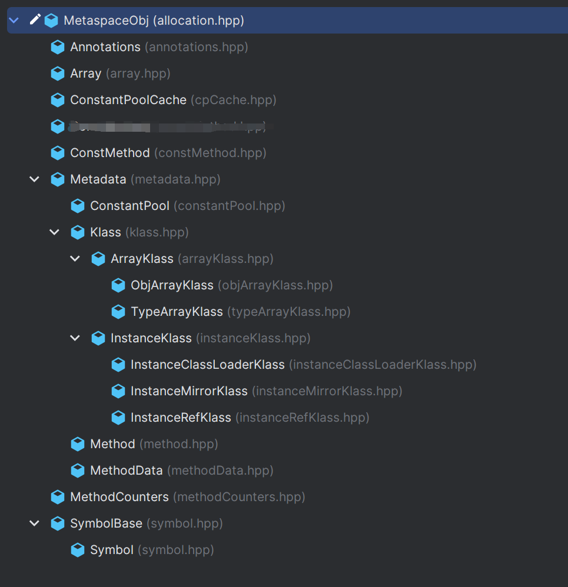

* 顶层的 MetaspaceObj 在`hotspot/src/share/vm/memory/allocation.hpp`中定义对象类型
* Metadata 用于表示元数据的基类，其中定义了多个虚函数（用于描述常量池、类、方法的基类）
* Klass 是用于描述 java 类型的抽象基类，其中定义了一些纯虚函数（接口），因此 java 中大部分的类（Test.class）由其子类 InstanceKlass 实现，但是也有一部分特例：
  * 对象类型数组（Test\[].class）是 ObjArrayKlass ；
  * 普通类型数组（int\[].class）是 TypeArraKlass；
  * 类加载器（java.lang.ClassLoader）是 InstanceClassLoaderKlass；
  * java 中的类（java.lang.Class）描述是 InstanceMirrorKlass；
  * 引用（java.lang.ref.Reference）是 InstanceRefKlass。

以下是 Klass 类中的属性注释

```cpp
class Klass : public Metadata {
  friend class VMStructs;
 protected:
  // note: put frequently-used fields together at start of klass structure
  // for better cache behavior (may not make much of a difference but sure won't hurt)
  enum { _primary_super_limit = 8 };

  // The "layout helper" is a combined descriptor of object layout.
  // For klasses which are neither instance nor array, the value is zero.
  //
  // For instances, layout helper is a positive number, the instance size.
  // This size is already passed through align_object_size and scaled to bytes.
  // The low order bit is set if instances of this class cannot be
  // allocated using the fastpath.
  //
  // For arrays, layout helper is a negative number, containing four
  // distinct bytes, as follows:
  //    MSB:[tag, hsz, ebt, log2(esz)]:LSB
  // where:
  //    tag is 0x80 if the elements are oops, 0xC0 if non-oops
  //    hsz is array header size in bytes (i.e., offset of first element)
  //    ebt is the BasicType of the elements
  //    esz is the element size in bytes
  // This packed word is arranged so as to be quickly unpacked by the
  // various fast paths that use the various subfields.
  //
  // The esz bits can be used directly by a SLL instruction, without masking.
  //
  // Note that the array-kind tag looks like 0x00 for instance klasses,
  // since their length in bytes is always less than 24Mb.
  //
  // Final note:  This comes first, immediately after C++ vtable,
  // because it is frequently queried.
  /*
  对象布局综合描述符，如果不是  InstanceKlass 或 ArrayKlass，值为 0.否则是一个组合数字
  （1）如果是 InstanceKlass 该值代表对象以字节为单位的内存占用量（也就是创建对应 java 
  类所需内存）
  （2）如果是 ArrayKlass 则组合数字包含 4 个部分 tag、hsz、ebt、esz
  tag：如果是 oop 那 tag 是 0x80 否则是 0xC0
  hsz：表示数组第一个元素的大小（单位：字节）
  ebt：数组中元素类型
  esz：数组中每个元素的大小（单位：字节）
  */
  jint        _layout_helper;

  // The fields _super_check_offset, _secondary_super_cache, _secondary_supers
  // and _primary_supers all help make fast subtype checks.  See big discussion
  // in doc/server_compiler/checktype.txt
  //
  // Where to look to observe a supertype (it is &_secondary_super_cache for
  // secondary supers, else is &_primary_supers[depth()].
  // 用于快速检索父类的偏移量，改偏移量指向 _primary_supers 数组中对应的当前类位置
  // 如果继承链路大于 8，则值和 _secondary_super_cache 一致
  juint       _super_check_offset;

  // Class name.  Instance classes: java/lang/String, etc.  Array classes: [I,
  // [Ljava/lang/String;, etc.  Set to zero for all other kinds of classes.
  // jvm 中显示的类名
  Symbol*     _name;

  // Cache of last observed secondary supertype
  // 保存上一次查询父类的结果
  Klass*      _secondary_super_cache;
  // Array of all secondary supertypes
  // Klass 指针数组，当继承链路过长存储多出 8 的部分
  Array<Klass*>* _secondary_supers;
  // Ordered list of all primary supertypes
  // 当前类的父类，这里用数组表示，默认大小为 8（可通过参数修改 -XX:FastSuperclassLimit=3）
  // 如果继承链过长，则将多出来的存储到 _secondary_supers 中
  Klass*      _primary_supers[_primary_super_limit];
  // java/lang/Class instance mirroring this class
  // 用于访问类的静态属性
  oop       _java_mirror;
  // Superclass
  // 父类指针
  Klass*      _super;
  // First subclass (NULL if none); _subklass->next_sibling() is next one
  // 直接子类指针
  Klass*      _subklass;
  // Sibling link (or NULL); links all subklasses of a klass
  // 如果由多个子类则会通过该字段串联起来
  Klass*      _next_sibling;

  // All klasses loaded by a class loader are chained through these links
  // classLoader 加载的下一个类
  Klass*      _next_link;

  // The VM's representation of the ClassLoader used to load this class.
  // Provide access the corresponding instance java.lang.ClassLoader.
  // 类加载器指针，用于找到当前类的类加载器
  ClassLoaderData* _class_loader_data;

  jint        _modifier_flags;  // Processed access flags, for use by Class.getModifiers.
  // 类的访问标识 public/private/static/abstract/native... 
  AccessFlags _access_flags;    // Access flags. The class/interface distinction is stored here.

  // Biased locking implementation and statistics
  // (the 64-bit chunk goes first, to avoid some fragmentation)
  jlong    _last_biased_lock_bulk_revocation_time;
  markOop  _prototype_header;   // Used when biased locking is both enabled and disabled for this type
  jint     _biased_lock_revocation_count;

  JFR_ONLY(DEFINE_TRACE_ID_FIELD;)

  // Remembered sets support for the oops in the klasses.
  jbyte _modified_oops;             // Card Table Equivalent (YC/CMS support)
  jbyte _accumulated_modified_oops; // Mod Union Equivalent (CMS support)
};
```

以下是 InstanceKlass 类中的属性注释

```cpp
class InstanceKlass: public Klass {
  friend class VMStructs;
  friend class ClassFileParser;
  friend class CompileReplay;
 public:
  static InstanceKlass* allocate_instance_klass(
                                          ClassLoaderData* loader_data,
                                          int vtable_len,
                                          int itable_len,
                                          int static_field_size,
                                          int nonstatic_oop_map_size,
                                          ReferenceType rt,
                                          AccessFlags access_flags,
                                          Symbol* name,
                                          Klass* super_klass,
                                          bool is_anonymous,
                                          TRAPS);

  // See "The Java Virtual Machine Specification" section 2.16.2-5 for a detailed description
  // of the class loading & initialization procedure, and the use of the states.
  enum ClassState {
    allocated,                          // allocated (but not yet linked)
    loaded,                             // loaded and inserted in class hierarchy (but not linked yet)
    linked,                             // successfully linked/verified (but not initialized yet)
    being_initialized,                  // currently running class initializer
    fully_initialized,                  // initialized (successfull final state)
    initialization_error                // error happened during initialization
  };

  static int number_of_instance_classes() { return _total_instanceKlass_count; }

 private:
  static volatile int _total_instanceKlass_count;

 protected:
  // Annotations for this class
  // Annotations 指针，该类使用的所有注解
  Annotations*    _annotations;
  // Array classes holding elements of this class.
  // 数组元素使用 obj 表示时，当前属性指向实际对应的数组类型指向
  Klass*          _array_klasses;
  // Constant pool for this class.
  // ConstantPool 指针，该类的常量池
  ConstantPool* _constants;
  // The InnerClasses attribute and EnclosingMethod attribute. The
  // _inner_classes is an array of shorts. If the class has InnerClasses
  // attribute, then the _inner_classes array begins with 4-tuples of shorts
  // [inner_class_info_index, outer_class_info_index,
  // inner_name_index, inner_class_access_flags] for the InnerClasses
  // attribute. If the EnclosingMethod attribute exists, it occupies the
  // last two shorts [class_index, method_index] of the array. If only
  // the InnerClasses attribute exists, the _inner_classes array length is
  // number_of_inner_classes * 4. If the class has both InnerClasses
  // and EnclosingMethod attributes the _inner_classes array length is
  // number_of_inner_classes * 4 + enclosing_method_attribute_size.
  // ushort 数组表示当前类的内部类属性和闭包（EnclosingMethod）属性
  Array<jushort>* _inner_classes;

  // the source debug extension for this klass, NULL if not specified.
  // Specified as UTF-8 string without terminating zero byte in the classfile,
  // it is stored in the instanceklass as a NULL-terminated UTF-8 string
  char*           _source_debug_extension;
  // Array name derived from this class which needs unreferencing
  // if this class is unloaded.
  // 当前类的数组名称，如果当前类是 java/lang/Object，那么这里的名称是 Ljava/lang/Object
  Symbol*         _array_name;

  // Number of heapOopSize words used by non-static fields in this klass
  // (including inherited fields but after header_size()).
  // 非静态字段的内存大小，以 heapOopSize 为单位，默认使用压缩指针时 heapOopSize 是 int 的大小
  int             _nonstatic_field_size;
  // 静态字段的内存大小，以字宽（HeapWordSize，实际是一个指针变量的内存大小）为单位
  int             _static_field_size;    // number words used by static fields (oop and non-oop) in this klass
  // Constant pool index to the utf8 entry of the Generic signature,
  // or 0 if none.
  // java 类签名在常量池中的索引
  u2              _generic_signature_index;
  // Constant pool index to the utf8 entry for the name of source file
  // containing this klass, 0 if not specified.
  // java 文件名在常量池中的索引
  u2              _source_file_name_index;
  // java 类中静态引用类型数量
  u2              _static_oop_field_count;// number of static oop fields in this klass
  // java 类字段的总数量
  u2              _java_fields_count;    // The number of declared Java fields
  // OopMapBlock 需要占用的内存空间
  int             _nonstatic_oop_map_size;// size in words of nonstatic oop map blocks

  // _is_marked_dependent can be set concurrently, thus cannot be part of the
  // _misc_flags.
  // 用于 jit 和 锁标记字段
  bool            _is_marked_dependent;  // used for marking during flushing and deoptimization
  bool            _is_being_redefined;   // used for locking redefinition
  bool            _has_unloaded_dependent;

  enum {
    _misc_rewritten                = 1 << 0, // methods rewritten.
    _misc_has_nonstatic_fields     = 1 << 1, // for sizing with UseCompressedOops
    _misc_should_verify_class      = 1 << 2, // allow caching of preverification
    _misc_is_anonymous             = 1 << 3, // has embedded _host_klass field
    _misc_is_contended             = 1 << 4, // marked with contended annotation
    _misc_has_default_methods      = 1 << 5, // class/superclass/implemented interfaces has default methods
    _misc_declares_default_methods = 1 << 6, // directly declares default methods (any access)
    _misc_has_been_redefined       = 1 << 7  // class has been redefined
  };
  u2              _misc_flags;
  // 类文件的次版本
  u2              _minor_version;        // minor version number of class file
  // 类文件的主版本
  u2              _major_version;        // major version number of class file
  // 执行此类初始化的 Thread 指针
  Thread*         _init_thread;          // Pointer to current thread doing initialization (to handle recursive initialization)
  // Java 虚函数表（vtable）的内存大小，以字宽为单位
  int             _vtable_len;           // length of Java vtable (in words)
  // Java 接口函数表（itable）的内存大小，以字宽为单位
  int             _itable_len;           // length of Java itable (in words)
  // OopMapCache 指针，该类的所有方法的 OopMapCache
  OopMapCache*    volatile _oop_map_cache;   // OopMapCache for all methods in the klass (allocated lazily)
  // MemberNameTable 指针，保存了成员名
  MemberNameTable* _member_names;        // Member names
  // 该类的第一个静态字段的 JNIid，可以根据其 _next 属性获取下一个字段的 JNIid
  JNIid*          _jni_ids;              // First JNI identifier for static fields in this class
  // java 方法的 ID 列表
  jmethodID*      _methods_jmethod_ids;  // jmethodIDs corresponding to method_idnum, or NULL if none
  // 依赖的本地方法，以根据其 _next 属性获取下一个 nmethod
  nmethodBucket*  _dependencies;         // list of dependent nmethods
  // 栈上替换的本地方法链表的头元素
  nmethod*        _osr_nmethods_head;    // Head of list of on-stack replacement nmethods for this class
  BreakpointInfo* _breakpoints;          // bpt lists, managed by Method*
  // Linked instanceKlasses of previous versions
  InstanceKlass* _previous_versions;
  // JVMTI fields can be moved to their own structure - see 6315920
  // JVMTI: cached class file, before retransformable agent modified it in CFLH
  // class文件的内容，JVMTI retransform 时使用
  JvmtiCachedClassFileData* _cached_class_file;
  // 已经分配的方法的 idnum 的个数，可以根据该 ID 找到对应的方法，如果 JVMTI 有新增的方法，已分配的 ID 不会变
  volatile u2     _idnum_allocated_count;         // JNI/JVMTI: increments with the addition of methods, old ids don't change

  // Class states are defined as ClassState (see above).
  // Place the _init_state here to utilize the unused 2-byte after
  // _idnum_allocated_count.
  /* 类的状态，是一个枚举值（hotspot/src/share/vm/oops/instanceKlass.hpp/ClassState）
      allocated（已分配内存）
      loaded（从class文件读取加载到内存中）
      linked（已经成功链接和校验）
      being_initialized（正在初始化）
      fully_initialized（已经完成初始化）
      initialization_error（初始化异常）
  */
  u1              _init_state;                    // state of class
  /*
  当前实例是 InstanceRefKlass 时，该字段才有意义（hotspot/src/share/vm/memory/referenceType.hpp）
  ReferenceType 有 6 个枚举值，分别代表的含义如下
  REF_NONE,      // 非引用类型
  REF_OTHER,     // java/lang/ref/Reference 的子类但不是以下的任何一种
  REF_SOFT,      // java/lang/ref/SoftReference 及其子类
  REF_WEAK,      // java/lang/ref/WeakReference 及其子类
  REF_FINAL,     // java/lang/ref/FinalReference 及其子类
  REF_PHANTOM    // java/lang/ref/PhantomReference 及其子类
  */ 
  u1              _reference_type;                // reference type

  JvmtiCachedClassFieldMap* _jvmti_cached_class_field_map;  // JVMTI: used during heap iteration

  NOT_PRODUCT(int _verify_count;)  // to avoid redundant verifies

  // Method array.
  // 方法指针数组
  Array<Method*>* _methods;
  // Default Method Array, concrete methods inherited from interfaces
  // 从接口继承的默认方法数组
  Array<Method*>* _default_methods;
  // Interface (Klass*s) this class declares locally to implement.
  // 直接实现的接口数组（Klass[]）
  Array<Klass*>* _local_interfaces;
  // Interface (Klass*s) this class implements transitively.
  // 所有实现的接口数组（Klass[]），包含_local_interfaces 和通过继承间接实现的接口
  Array<Klass*>* _transitive_interfaces;
  // Int array containing the original order of method in the class file (for JVMTI).
  // int 数组，保存类中方法声明时的顺序，JVMTI 使用
  Array<int>*     _method_ordering;
  // Int array containing the vtable_indices for default_methods
  // offset matches _default_methods offset
  // 默认方法在虚函数表中的索引
  Array<int>*     _default_vtable_indices;

  // Instance and static variable information, starts with 6-tuples of shorts
  // [access, name index, sig index, initval index, low_offset, high_offset]
  // for all fields, followed by the generic signature data at the end of
  // the array. Only fields with generic signature attributes have the generic
  // signature data set in the array. The fields array looks like following:
  //
  // f1: [access, name index, sig index, initial value index, low_offset, high_offset]
  // f2: [access, name index, sig index, initial value index, low_offset, high_offset]
  //      ...
  // fn: [access, name index, sig index, initial value index, low_offset, high_offset]
  //     [generic signature index]
  //     [generic signature index]
  //     ...
  /*
    类的字段属性，每个字段有 个属性：
    access、name index、sig index、initial value index、low_offset、high_offset，
    6 个组成一个数组：
    access 表示访问控制属性
    name index 可以获取属性名
    initial value index 可以获取初始值
    low_offset, high_offset 可以获取该属性在内存中的偏移量
    如果是泛型字段还有额外在后面保存泛型签名
  */
  Array<u2>*      _fields;
  /*
  接下来几个属性是内嵌的在类中的，没有对应的属性名，只能通过指针和偏移量的方式访问
  Java vtable：Java 虚函数表，大小等于_vtable_len
  Java itables：Java 接口函数表，大小等于 _itable_len
  非静态 oop-map blocks ，大小等于 _nonstatic_oop_map_size
  接口的实现类，仅当前类表示一个接口时存在，如果接口没有任何实现类则为 NULL，
  如果只有一个实现类则为该实现类的 Klass 指针，如果有多个实现类，为当前类本身
  host klass，只在匿名类中存在，为了支持 JSR 292 中的动态语言特性，
  会给匿名类生成一个 host klass
  */

  // embedded Java vtable follows here
  // embedded Java itables follows here
  // embedded static fields follows here
  // embedded nonstatic oop-map blocks follows here
  // embedded implementor of this interface follows here
  //   The embedded implementor only exists if the current klass is an
  //   iterface. The possible values of the implementor fall into following
  //   three cases:
  //     NULL: no implementor.
  //     A Klass* that's not itself: one implementor.
  //     Itself: more than one implementors.
  // embedded host klass follows here
  //   The embedded host klass only exists in an anonymous class for
  //   dynamic language support (JSR 292 enabled). The host class grants
  //   its access privileges to this class also. The host class is either
  //   named, or a previously loaded anonymous class. A non-anonymous class
  //   or an anonymous class loaded through normal classloading does not
  //   have this embedded field.
  //
};
```

InstanceMirrorKlass 中新增静态属性 `_offset_of_static_fields`用于表示静态字段的起始偏移量，InstanceClassLoaderKlass 中新增了oop的遍历方法用于在垃圾回收阶段遍历类加载器加载的所有类用于标记其引用的所有对象。

以下为 Klass 类实例创建过程`hotspot/src/share/vm/oops/instanceKlass.cpp/allocate_instance_klass`

```cpp
InstanceKlass* InstanceKlass::allocate_instance_klass(
                                              ClassLoaderData* loader_data,
                                              int vtable_len,
                                              int itable_len,
                                              int static_field_size,
                                              int nonstatic_oop_map_size,
                                              ReferenceType rt,
                                              AccessFlags access_flags,
                                              Symbol* name,
                                              Klass* super_klass,
                                              bool is_anonymous,
                                              TRAPS) {
  // 获取创建 InstanceKlass 实例时需要分配的内存空间
  // 内存占用按照 InstanceKlass 本身占用空间 + 虚函数表 + 接口函数表 + 
  // 非静态对象 map + 接口实现类 + 匿名类
  // 其中每一步运算的结果都会进行内存对齐
  int size = InstanceKlass::size(vtable_len, itable_len, nonstatic_oop_map_size,
                                 access_flags.is_interface(), is_anonymous);

  // Allocation
  InstanceKlass* ik;
  /* 按照不同的类型创建不用的实例对象
  其中的 new 运算符在 MetaspaceObj 中重写，调用 
  hotspot/src/share/vm/memory/metaspace.cpp/Metaspace::allocate() 方法在堆中申请空间
  如果申请内存失败则会进行垃圾回收然后再次尝试，如果还是失败则抛出元空间 oom
  */  
  if (rt == REF_NONE) {
    if (name == vmSymbols::java_lang_Class()) {
      ik = new (loader_data, size, THREAD) InstanceMirrorKlass(
        vtable_len, itable_len, static_field_size, nonstatic_oop_map_size, rt,
        access_flags, is_anonymous);
    } else if (name == vmSymbols::java_lang_ClassLoader() ||
          (SystemDictionary::ClassLoader_klass_loaded() &&
          super_klass != NULL &&
          super_klass->is_subtype_of(SystemDictionary::ClassLoader_klass()))) {
      ik = new (loader_data, size, THREAD) InstanceClassLoaderKlass(
        vtable_len, itable_len, static_field_size, nonstatic_oop_map_size, rt,
        access_flags, is_anonymous);
    } else {
      // normal class
      ik = new (loader_data, size, THREAD) InstanceKlass(
        vtable_len, itable_len, static_field_size, nonstatic_oop_map_size, rt,
        access_flags, is_anonymous);
    }
  } else {
    // reference klass
    ik = new (loader_data, size, THREAD) InstanceRefKlass(
        vtable_len, itable_len, static_field_size, nonstatic_oop_map_size, rt,
        access_flags, is_anonymous);
  }

  // Check for pending exception before adding to the loader data and incrementing
  // class count.  Can get OOM here.
  if (HAS_PENDING_EXCEPTION) {
    return NULL;
  }

  // Add all classes to our internal class loader list here,
  // including classes in the bootstrap (NULL) class loader.
  loader_data->add_class(ik);

  Atomic::inc(&_total_instanceKlass_count);
  return ik;
}
```

ArrayKlass 是所有数组类的基类，其内部字段如下

```cpp
class ArrayKlass: public Klass {
  friend class VMStructs;
 private:
  // 数组维度
  int      _dimension;         // This is n'th-dimensional array.
  // 表示 n + 1 维的数组引用（前提是存在）
  Klass* volatile _higher_dimension;  // Refers the (n+1)'th-dimensional array (if present).
  // 表示 n - 1 维的数组引用（前提是存在）
  Klass* volatile _lower_dimension;   // Refers the (n-1)'th-dimensional array (if present).
  // 虚函数表长度
  int      _vtable_len;        // size of vtable for this klass
  // 表示数组类型对应的 oop 类型
  oop      _component_mirror;  // component type, as a java/lang/Class
};
```

TypeArrayKlass 用于表示所有基本类型数组，其只添加了一个属性`_max_length` 用于表示数组的最大长度，由于数组没有对应的 class 文件，因此 jvm 在初始化时就会调用 `Universe::genesis()`创建所有基本类型（八大基本类型）的一维数组实例

ObjArrayKlass类新增了以下两个属性：

1. \_element\_klass ：数组的组件类型，该属性保存的是数组元素的组件类型而不是元素类型
2. \_bottom\_klass：数组的元素类型，一维基本类型数组使用 TypeArrayKlass 表示，二维基本类型数组使用 ObjArrayKlass 来表示，此时的 ObjArrayKlass 的 \_bottom\_klass 是 TypeArrayKlass

## 对象

jvm 中对象关系如下图

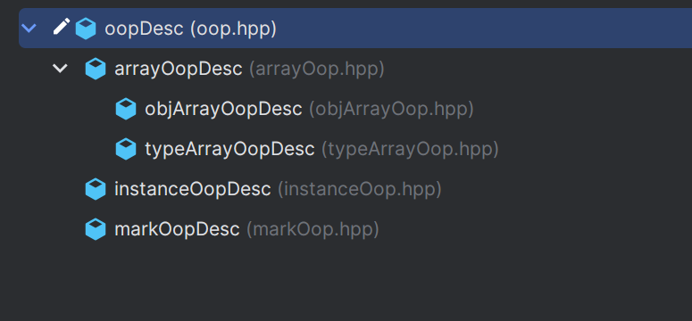

Java 中的对象在 JVM 里都使用 oopDesc 表示，作为基类在源码中经常见到的是 oop，这是 oopDesc\* 的别名。由于 JVM 要兼顾垃圾回收和锁，继承关系中 markOopDesc 表示的是对象头信息；instanceOopDesc 表示除数组外的所有对象；objArrayOopDesc 表示除基本类型以外的所有数组对象；typeArrayOopDesc 表示所有基本类型的数组对象。

以下是 oopDesc（`hotspot/src/share/vm/oops/oop.hpp`）它只有三个字段，java 对象的 fields 没有在oopDesc 类中定义相应的属性来存储，因此只能申请一定的内存空间，然后按一定的布局规则进行存储。对象字段存放在紧跟着 oopDesc 实例本身占用的内存空间之后，在获取时只能通过偏移来取值。

```cpp
class oopDesc {
  friend class VMStructs;
 private:
  // 对象头信息，用于保存锁状态、GC 分代年龄等
  volatile markOop  _mark;
  // 对象对应的类元数据信息，这里使用联合体是为了在 64 位机器上能实现压缩指针
  union _metadata {
    // 对象元数据指针
    Klass*      _klass;
    // 使用压缩指针时该属性才有值
    narrowKlass _compressed_klass;
  } _metadata;

  // Fast access to barrier set.  Must be initialized.
  // BarrierSet 提供了屏障实现和系统其它部分之间的接口，是静态属性，必须初始化
  static BarrierSet* _bs;
};
```

除属性相关的方法外，oopDesc 定义了如下几类方法：

* 根据偏移量获取不同类型的Java字段的地址，如 byte\_field\_addr，int\_field\_addr，obj\_field\_addr 等
* 指针压缩和解压缩的方法，如 decode\_heap\_oop，encode\_heap\_oop 等
* 加载存储堆外对象的方法，如 load\_heap\_oop，store\_heap\_oop 等，堆外对象应该是指元空间中的对象
* 根据偏移量获取和设置不同类型的 java 字段的方法，如 byte\_field，byte\_field\_put 等
* 与 GC 相关的方法，如 age，incr\_age，is\_gc\_marked 等

markOopDesc 用于描述对象头，oopDesc 中的 \_mark 属性引用的并不是一个真实存在的 markOopDesc 实例，只是一个字宽大小的无效内存地址，对象状态不同，不同位数对应的含义各不相同，如下图：

```cpp
//  32 bits:
//  --------
//             hash:25 ------------>| age:4    biased_lock:1 lock:2 (normal object)
//             JavaThread*:23 epoch:2 age:4    biased_lock:1 lock:2 (biased object)
//             size:32 ------------------------------------------>| (CMS free block)
//             PromotedObject*:29 ---------->| promo_bits:3 ----->| (CMS promoted object)
//
//  64 bits:
//  --------
//  unused:25 hash:31 -->| unused:1   age:4    biased_lock:1 lock:2 (normal object)
//  JavaThread*:54 epoch:2 unused:1   age:4    biased_lock:1 lock:2 (biased object)
//  PromotedObject*:61 --------------------->| promo_bits:3 ----->| (CMS promoted object)
//  size:64 ----------------------------------------------------->| (CMS free block)
//
//  unused:25 hash:31 -->| cms_free:1 age:4    biased_lock:1 lock:2 (COOPs && normal object)
//  JavaThread*:54 epoch:2 cms_free:1 age:4    biased_lock:1 lock:2 (COOPs && biased object)
//  narrowOop:32 unused:24 cms_free:1 unused:4 promo_bits:3 ----->| (COOPs && CMS promoted object)
//  unused:21 size:35 -->| cms_free:1 unused:7 ------------------>| (COOPs && CMS free block)
```

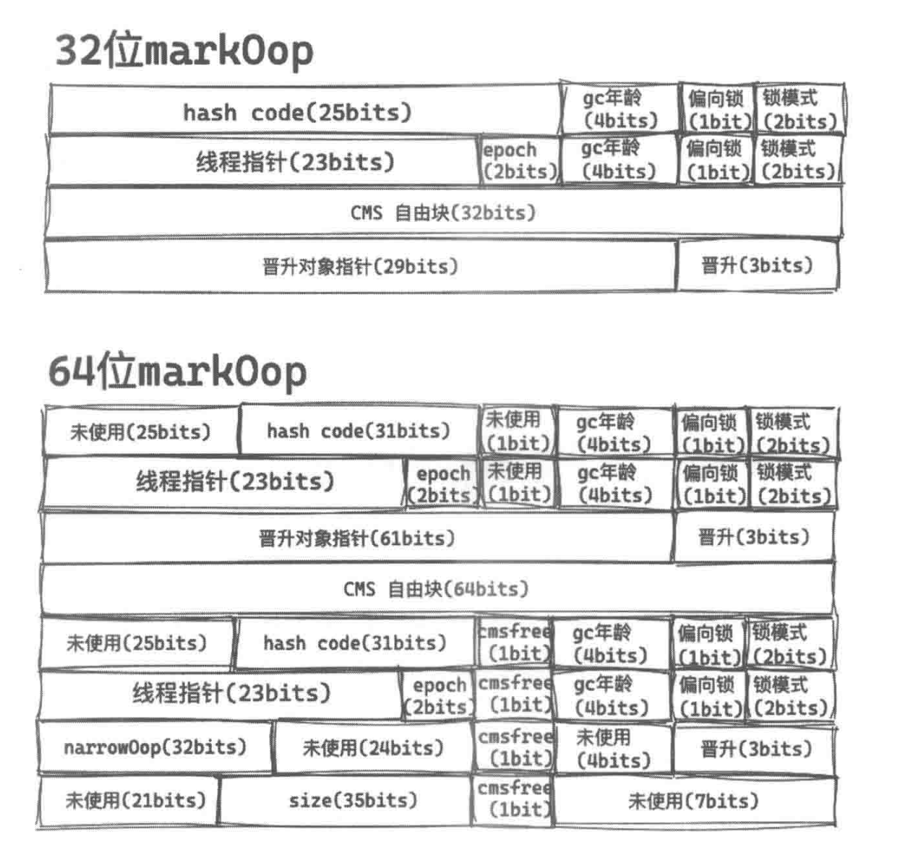

JVM 默认开始压缩指针用于节省内存空间，但分以下三种情况

* JVM 堆内存在 4GB 以下，直接忽略高32位，以避免编码、解码过程
* JVM 堆内存在 4GB 以上 32GB 以下，则默认启用 -XX:+UseCompressedOops 命令
* JVM 堆内存大于 32GB，压缩指针的命令失效，使用原来的 64 位 HotSpot VM

instanceOopDesc 类的实例表示除数组对象外的其他对象。在 HotSpot 虚拟机中，对象在内存中存储的布局可以分三个区域：对象头（header）、对象字段数据（field data）和对齐填充（padding） 源码中有获取对象头偏移的方法

```cpp
class instanceOopDesc : public oopDesc {
 public:
  // aligned header size.
  static int header_size() { return sizeof(instanceOopDesc)/HeapWordSize; }

  // If compressed, the offset of the fields of the instance may not be aligned.
  static int base_offset_in_bytes() {
    // offset computation code breaks if UseCompressedClassPointers
    // only is true
    return (UseCompressedOops && UseCompressedClassPointers) ?
             klass_gap_offset_in_bytes() :
             sizeof(instanceOopDesc);
  }

  static bool contains_field_offset(int offset, int nonstatic_field_size) {
    int base_in_bytes = base_offset_in_bytes();
    return (offset >= base_in_bytes &&
            (offset-base_in_bytes) < nonstatic_field_size * heapOopSize);
  }
};
```

以下为详细内容：

1. 对象头分为两部分，一部分是 MarkWord，另一部分是存储指向元数据区对象类型数据的指针 \_klass 或\_compressed\_klass
2. Java 对象中的字段数据存储了 Java 源代码中定义的各种类型的字段内容，具体包括父类继承及子类定义的字段。存储顺序受 JVM 布局策略命令 -XX:FieldsAllocationStyle 和字段在 Java 源代码中定义的顺序的影响，默认布局策略的顺序为 long/double、int、short/char、boolean、oop（对象指针，32 位系统占用 4 字节，64 位系统占用 8 字节），相同宽度的字段总被分配到一起。如果虚拟机的 -XX:+CompactFields 参数为 true，则子类中较窄的变量可能插入空隙中，以节省使用的内存空间。例如，当布局 long/double 类型的字段时，由于对齐的原因，可能会在 header 和 long/double 字段之间形成空隙，如 64 位系统开启压缩指针，header占 12 字节，剩下的 4 字节就是空隙，这时就可以将一些短类型插入 long/double 和 header 之间的空隙中。
3. 对齐填充不是必需的，只起到占位符的作用，没有其他含义。JVM 要求对象所占的内存必须是 8 字节的整数倍，对象头刚好是 8 字节的整数倍，因此填充是对实例数据没有对齐的情况而言的。对象所占的内存如果是以 8 字节对齐，那么对象在内存中进行线性分配时，对象头的地址就是以 8 字节对齐的，这时候就为对象指针压缩提供了条件，可以将地址缩小 8 倍进行存储

arrayOopDesc 作为数组对象的基类，需要保存数组的长度，长度属性在子类中定义，该类只是多了几个关于数组长度的方法。同样 objArrayOopDesc 用于表示所有除了基本数据类型的一维数组，typeArrayOopDesc 用于表示所有一维基本类型数组

## 操作句柄（Handle）

Handle（`hotspot/src/share/vm/runtime/handles.hpp`）——垃圾回收时对象可能被移动（对象地址发生改变），通过 Handle 访问对象可以对使用者屏蔽垃圾回收细节。HotSpot 通过 Handle 间接操作 oop、Klass 该类只有一个属性 \*oop 其继承关系如下：

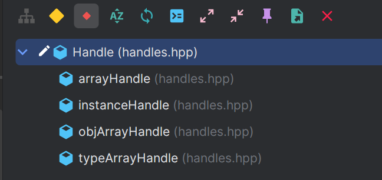

Handle 只会在每个线程的对象的 HandleArea 中进行分配（也就是线程对象的 \_handle\_area  属性）HandleArea 定义如下（`hotspot/src/share/vm/runtime/handles.hpp/HandleArea`）：

```cpp
// Thread local handle area
class HandleArea: public Arena {
  friend class HandleMark;
  friend class NoHandleMark;
  friend class ResetNoHandleMark;
  // 指向上一个 HandleArea 的指针（单链表）
  HandleArea* _prev;          // link to outer (older) area
 public:
  // Constructor
  HandleArea(HandleArea* prev) : Arena(mtThread, Chunk::tiny_size) {
    _prev = prev;
  }

  // Handle allocation
 private:
  // 分配内存并存储 obj 对象
  oop* real_allocate_handle(oop obj) {
    oop* handle = (oop*) Amalloc_4(oopSize);
    *handle = obj;
    return handle;
  }
 public:

  // Garbage collection support
  void oops_do(OopClosure* f);

  // Number of handles in use
  size_t used() const     { return Arena::used() / oopSize; }

};
```

在执行 Java 方法调用前会先构建一个 JavaCallWrapper 实例，然后再构造一个 HandleMark（`hotspot/src/share/vm/runtime/handles.hpp`）实例。HandleMark 主要用于记录当前线程的 HandleArea 的内存地址 top，执行方法调用后，HandleMark 实例自动销毁，在 HandleMark 的析构函数中会将 HandleArea 的当前内存地址到方法调用前的内存地址 top 之间的所有分配的 oop 都销毁掉，然后恢复当前线程的 HandleArea 的内存地址 top 到方法调用前的状态。HandleMark 一般情况下直接在线程栈内存上分配，应该继承自 StackObj，但是部分情况下 HandleMark 也需要在堆内存上分配，所以没有继承自 StackObj，并且为了支持在堆内存上分配，重载了 new 和 delete 方法。

创建一个新的 HandleMark 以后，新的 HandleMark 保存当前线程的area 的当前 chunk，\_hwm ，\_max 等属性，执行方法期间新创建的 Handle 实例是在当前线程的 area 中分配内存，这会导致当前线程的 area 的当前 chunk，\_hwm ，\_max 等属性发生变更，因此方法执行完成需要将这些属性恢复成方法调用前的状态，并把方法调用过程中新创建的 Handle 实例的内存给释放掉。

源码如下：

```cpp
//------------------------------------------------------------------------------------------------------------------------
// Handles are allocated in a (growable) thread local handle area. Deallocation
// is managed using a HandleMark. It should normally not be necessary to use
// HandleMarks manually.
//
// A HandleMark constructor will record the current handle area top, and the
// desctructor will reset the top, destroying all handles allocated in between.
// The following code will therefore NOT work:
//
//   Handle h;
//   {
//     HandleMark hm;
//     h = Handle(obj);
//   }
//   h()->print();       // WRONG, h destroyed by HandleMark destructor.
//
// If h has to be preserved, it can be converted to an oop or a local JNI handle
// across the HandleMark boundary.

// The base class of HandleMark should have been StackObj but we also heap allocate
// a HandleMark when a thread is created. The operator new is for this special case.

class HandleMark {
 private:
  // 将当前线程的 _area 属性保存到新的 HandleMark 实例中
  Thread *_thread;              // thread that owns this mark
  // 保存当前线程的 area
  HandleArea *_area;            // saved handle area
  // 保存 HandleArea 的 Chunk
  Chunk *_chunk;                // saved arena chunk
  // 保存的 HandleArea 的信息（也就是已分配内存地址和最大内存地址）
  char *_hwm, *_max;            // saved arena info
  // 保存的 HandleArea 的大小
  size_t _size_in_bytes;        // size of handle area
  // Link to previous active HandleMark in thread
  // 当前线程的上一个活跃的 HandleMark 实例
  HandleMark* _previous_handle_mark;

  void initialize(Thread* thread);                // common code for constructors
  void set_previous_handle_mark(HandleMark* mark) { _previous_handle_mark = mark; }
  HandleMark* previous_handle_mark() const        { return _previous_handle_mark; }

  size_t size_in_bytes() const { return _size_in_bytes; }
 public:
  HandleMark();                            // see handles_inline.hpp
  HandleMark(Thread* thread)                      { initialize(thread); }
  ~HandleMark();

  // Functions used by HandleMarkCleaner
  // called in the constructor of HandleMarkCleaner
  void push();
  // called in the destructor of HandleMarkCleaner
  void pop_and_restore();
  // overloaded operators
  void* operator new(size_t size) throw();
  void* operator new [](size_t size) throw();
  void operator delete(void* p);
  void operator delete[](void* p);
};
```

Arena 是一个支持快速分配内存的基类，最终内存分配是通过 Chunk 完成的，以下是对 Arena 定义：

* 除了 Java 堆管理器和垃圾回收器维护的 Java 堆之外，HotSpot 还使用了 C/C++ 堆（也称为动态内存分配堆）用于存储虚拟机内部的对象和数据。一些从 Arena 继承而来的 C++ 类用于管理 C++ 堆操作。
* Arena 是使用 malloc 分配的一块内存。当退出范围或离开代码区域时，内存会从这些块中大量释放出来。这些块可以在其他子系统中重复使用，以保持临时内存，例如线程前分配。Arena malloc 策略确保没有内存泄漏。因此Arena 是作为一个整体而不是单个对象进行跟踪的。有些初始内存无法跟踪。
* Arena 和它的子类在 malloc/free 之上提供了一层快速分配层。每个 Arena 从三个全局的 ChunkPool 中分配内存块（或称 Chunks ）。每个 ChunkPool 满足不同大小区间的分配需求。例如，一个需要 1k 内存的请求将从“小”ChunkPool 中分配，而一个 10k 内存请求将从“中”ChunkPool 中分配。这样做是为了避免内存碎片化造成的浪费。
* Arena 系统也提供比纯 malloc/free 更好的性能。后者操作可能需要获取操作系统全局锁，从而影响扩展性和降低性能。Arena 是些线程专属的对象，缓存了一定量的存储空间，于是在快速路径分配的情形下，不需要锁。类似地，Arena 执行释放操作时通常也不需要锁。
* Arena 也用来做线程专属资源管理（ResourceArea）和句柄管理（Handle Area）。它们也用在客户端和服务器端编译器的编译中。

`real_allocate_handle()`函数在 HandleArea 中分配内存并存储 obj 对象，该函数调用父类 Arena 中定义的`Amalloc_4()`函数分配内存。Arena 类（`hotspot/src/share/vm/memory/allocation.hpp/Arena`）的定义如下：

```cpp
class Arena : public CHeapObj<mtNone> {
protected:
  friend class ResourceMark;
  friend class HandleMark;
  friend class NoHandleMark;
  friend class VMStructs;
  // 表示内存的类型（hotspot/src/share/vm/memory/allocation.hpp/MemoryType）
  MEMFLAGS    _flags;           // Memory tracking flags
  // 指向单链表的第一个 Chunk
  Chunk *_first;                // First chunk
  // 指向正在使用的 Chunk
  Chunk *_chunk;                // current chunk
  // _hwm（Chunk 已分配的地址） 和 _max（当前 Chunk 最大空间地址）
  char *_hwm, *_max;            // High water mark and max in current chunk

 public:
  Arena(MEMFLAGS memflag);
  Arena(MEMFLAGS memflag, size_t init_size);
  ~Arena();
  
  // Further assume size is padded out to words
  // 用于分配内存（不够就扩容）
  void *Amalloc_4(size_t x, AllocFailType alloc_failmode = AllocFailStrategy::EXIT_OOM) {
    if (_hwm + x > _max) {
      return grow(x, alloc_failmode);
    } else {
      char *old = _hwm;
      _hwm += x;
      return old;
    }
  }
};
```

Chunk（hotspot/src/share/vm/memory/allocation.hpp）表示一个空白的内存块，其定义如下：

```cpp
class Chunk: CHeapObj<mtChunk> {
friend class VMStructs;

protected:
// 单链表的下一个 Chunk
Chunk*       _next;     // Next Chunk in list
// 当前 Chunk 大小
const size_t _len;      // Size of this Chunk
public:
// Chunk 块默认从 ChunkPool 进行分配，分配不在枚举中的空间大小时默认使用操作系统分配内存
void* Chunk::operator new (size_t requested_size, AllocFailType alloc_failmode, size_t length) throw() {
    // requested_size is equal to sizeof(Chunk) but in order for the arena
    // allocations to come out aligned as expected the size must be aligned
    // to expected arena alignment.
    // expect requested_size but if sizeof(Chunk) doesn't match isn't proper size we must align it.
    size_t bytes = ARENA_ALIGN(requested_size) + length;
    switch (length) {
        case Chunk::size:        return ChunkPool::large_pool()->allocate(bytes, alloc_failmode);
        case Chunk::medium_size: return ChunkPool::medium_pool()->allocate(bytes, alloc_failmode);
        case Chunk::init_size:   return ChunkPool::small_pool()->allocate(bytes, alloc_failmode);
        case Chunk::tiny_size:   return ChunkPool::tiny_pool()->allocate(bytes, alloc_failmode);
        default: {
            void* p = os::malloc(bytes, mtChunk, CALLER_PC);
            if (p == NULL && alloc_failmode == AllocFailStrategy::EXIT_OOM) {
                vm_exit_out_of_memory(bytes, OOM_MALLOC_ERROR, "Chunk::new");
            }
            return p;
        }
    }
}
// 释放内存时枚举大小直接归还到 ChunkPool，否则直接 free
void Chunk::operator delete(void* p) {
  Chunk* c = (Chunk*)p;
  switch (c->length()) {
   case Chunk::size:        ChunkPool::large_pool()->free(c); break;
   case Chunk::medium_size: ChunkPool::medium_pool()->free(c); break;
   case Chunk::init_size:   ChunkPool::small_pool()->free(c); break;
   case Chunk::tiny_size:   ChunkPool::tiny_pool()->free(c); break;
   default:                 os::free(c, mtChunk);
  }
}
Chunk(size_t length);
/* 创建新的 Chunk 时优先使用枚举中定义的适合的 size，每个 size 都有一个对应的 
  ChunkPool 负责管理 Chunk，可避免重新想操作系统申请内存的损耗，避免内存碎片
*/
enum {
// default sizes; make them slightly smaller than 2**k to guard against
// buddy-system style malloc implementations
#ifdef _LP64
slack      = 40,            // [RGV] Not sure if this is right, but make it
//       a multiple of 8.
#else
slack      = 20,            // suspected sizeof(Chunk) + internal malloc headers
#endif

tiny_size  =  256  - slack, // Size of first chunk (tiny)
init_size  =  1*K  - slack, // Size of first chunk (normal aka small)
medium_size= 10*K  - slack, // Size of medium-sized chunk
size       = 32*K  - slack, // Default size of an Arena chunk (following the first)
non_pool_size = init_size + 32 // An initial size which is not one of above
};

void chop();                  // Chop this chunk
void next_chop();             // Chop next chunk
static size_t aligned_overhead_size(void) { return ARENA_ALIGN(sizeof(Chunk)); }
static size_t aligned_overhead_size(size_t byte_size) { return ARENA_ALIGN(byte_size); }

size_t length() const         { return _len;  }
Chunk* next() const           { return _next;  }
void set_next(Chunk* n)       { _next = n;  }
// Boundaries of data area (possibly unused)
// //因为 new 方法中分配利内存实际是 aligned_overhead_size() + length，
// 所以这里计算可用内存的底部时需要在 this 指针加上 aligned_overhead_size()
char* bottom() const          { return ((char*) this) + aligned_overhead_size();  }
char* top()    const          { return bottom() + _len; }
bool contains(char* p) const  { return bottom() <= p && p <= top(); }

// Start the chunk_pool cleaner task
static void start_chunk_pool_cleaner_task();

static void clean_chunk_pool();
};
```

ChunkPool（`hotspot/src/share/vm/memory/allocation.cpp`）表示负责 Chunk 分配和释放的对象池，该类不对外暴露仅作为 Chunk 内部实现，在 JVM 初始化时会调用其`initialize()` 方法，创建各种大小类型的 ChunkPool ，以下为部分源码：

```cpp
// ChunkPool implementation

// MT-safe pool of chunks to reduce malloc/free thrashing
// NB: not using Mutex because pools are used before Threads are initialized
class ChunkPool: public CHeapObj<mtInternal> {
// ChunkPool 缓存的第一个 Chunk 实例
Chunk*       _first;        // first cached Chunk; its first word points to next chunk
// ChunkPool 中未使用的 Chunk 实例数
size_t       _num_chunks;   // number of unused chunks in pool
// ChunkPool 中已使用的 Chunk 实例数
size_t       _num_used;     // number of chunks currently checked out
// ChunkPool 中单个 Chunk 大小
const size_t _size;         // size of each chunk (must be uniform)

public:
// All chunks in a ChunkPool has the same size
ChunkPool(size_t size) : _size(size) { _first = NULL; _num_chunks = _num_used = 0; }

// Allocate a new chunk from the pool (might expand the pool)
_NOINLINE_ void* allocate(size_t bytes, AllocFailType alloc_failmode) {
    assert(bytes == _size, "bad size");
    void* p = NULL;
    // No VM lock can be taken inside ThreadCritical lock, so os::malloc
    // should be done outside ThreadCritical lock due to NMT
    // 分配内存应该在该线程锁的范围外执行
    { ThreadCritical tc;
     _num_used++;
     p = get_first();
    }
    if (p == NULL) p = os::malloc(bytes, mtChunk, CURRENT_PC);
    if (p == NULL && alloc_failmode == AllocFailStrategy::EXIT_OOM) {
        vm_exit_out_of_memory(bytes, OOM_MALLOC_ERROR, "ChunkPool::allocate");
    }
    return p;
}

// Return a chunk to the pool
void free(Chunk* chunk) {
    assert(chunk->length() + Chunk::aligned_overhead_size() == _size, "bad size");
    ThreadCritical tc;
    _num_used--;

    // Add chunk to list
    chunk->set_next(_first);
    _first = chunk;
    _num_chunks++;
}

// Prune the pool
void free_all_but(size_t n) {
    Chunk* cur = NULL;
    Chunk* next;
    {
        // if we have more than n chunks, free all of them
        // 进入全局线程锁，当前方法执行结束则释放锁
        ThreadCritical tc;
        if (_num_chunks > n) {
            // free chunks at end of queue, for better locality
            cur = _first;
            for (size_t i = 0; i < (n - 1) && cur != NULL; i++) cur = cur->next();

            if (cur != NULL) {
                next = cur->next();
                cur->set_next(NULL);
                cur = next;

                _num_chunks = n;
            }
        }
    }

    // Free all remaining chunks, outside of ThreadCritical
    // to avoid deadlock with NMT
    while(cur != NULL) {
        next = cur->next();
        os::free(cur, mtChunk);
        cur = next;
    }
}

// 默认每种类型的 ChunkPool 都要创建一个
static void initialize() {
    _large_pool  = new ChunkPool(Chunk::size        + Chunk::aligned_overhead_size());
    _medium_pool = new ChunkPool(Chunk::medium_size + Chunk::aligned_overhead_size());
    _small_pool  = new ChunkPool(Chunk::init_size   + Chunk::aligned_overhead_size());
    _tiny_pool   = new ChunkPool(Chunk::tiny_size   + Chunk::aligned_overhead_size());
}

// 只保留 5 个 Chunk，其余的全部释放
static void clean() {
    enum { BlocksToKeep = 5 };
    _tiny_pool->free_all_but(BlocksToKeep);
    _small_pool->free_all_but(BlocksToKeep);
    _medium_pool->free_all_but(BlocksToKeep);
    _large_pool->free_all_but(BlocksToKeep);
}
};
```

# class 文件结构

## 整体结构

按照 JVMS（Java Virtual Machine Specification）class 文件结构需要按照[规范](https://docs.oracle.com/javase/specs/jvms/se8/html/jvms-4.html#jvms-4.1)组成，具体如下：

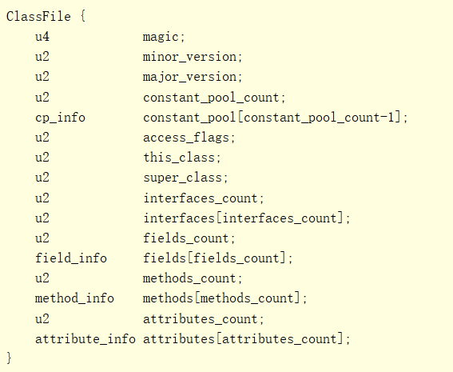

其中 u`<n>` 表示 n 个无符号字节，如 u4 magic 表示 magic 的取值用 4 个无符号字节表示；cp\_info 描述常量池的结构，field\_info 描述字段的数据结构，method\_info 描述方法的数据结构，attribute\_info 描述属性的数据结构。ClassFile 结构各项的含义如下：

| 字段名 | 说明 |
| --- | --- |
| magic | 用于标识当前Class文件的文件格式，JVM可据此判断该文件是否可以被解析，目前固定为0xCAFEBABE |
| minor\_version | 次版本号（大多数情况下为 0） |
| major\_version | 主版本号（由 jdk8 编译而来的 class 文件为 52） |
| constant\_pool\_count | 常量池数量，等于常量池中的成员数加 1（C/CPP 数组没有长度，需要有一个长度字段来表示边界，下面所有的 xxx\_count 都是如此） |
| constant\_pool | 常量池，是一种表结构，包含 class 文件结构和子结构中引用的所有字符串常量，类或者接口名，字段名和其他常量，其有效索引范围是 1 ~ (constant\_pool\_count - 1)。其中类和接口名采用全限定形式，即在整个 JVM 中的绝对名称，如 java.lang.Object，方法名，字段名、局部变量名和形参名都采用非限定名，即在源代码文件中使用相对名称，如属性名 name |
| access\_flags | 用于表示类或者接口的访问权限和属性 |
| this\_class | 类索引，该值必须是对常量池中某个常量的一个有效索引值，该索引处的成员必须是一个CONSTANT\_Class\_info 类型的结构体，表示这个class 文件所定义的类和接口 |
| super\_class | 父类索引，同 this\_class，该值必须是对常量池中CONSTANT\_Class\_info 类型常量的一个有效索引值，如果该值为0，则只能表示 java.lang.Object类，因为该类是唯一一个没有父类的类 |
| interfaces\_count | 接口数量 |
| interfaces | 接口表，是一个表结构，每个成员同 this\_class，必须是对常量池中 CONSTANT\_Class\_info 类型常量的一个有效索引值，其有效索引范围为 0~interfaces\_count，接口表中成员的顺序与源代码中给定的接口顺序是一致的，interfaces\[0] 表示源代码中最左边的接口 |
| fields\_count | 字段数量 |
| fields | 字段表，是一个表结构，表中每个成员必须是 filed\_info 数据结构，用于表示当前类或者接口的某个字段的完整描述，不包含从父类或者父接口继承的字段 |
| methods\_count | 方法数量 |
| methods | 方法表，是一个表结构，表中每个成员必须是 method\_info 数据结构，用于表示当前类或者接口的某个方法的完整描述，包含当前类或者接口定义的所有方法，如实例方法、类方法、实例初始化方法等，不包含从父类或者父接口继承的方法 |
| attributes\_count | 属性数量 |
| attributes | 属性表，是一个表结构，表中每个成员必须是attribute\_info 数据结构，这里的属性是对 class 文件本身，方法或者字段的补充描述，如SourceFile 属性用于表示 class 文件的源代码文件名 |

access\_flags 可选属性如下表：

| 标记 | 值 | 说明 |
| --- | --- | --- |
| ACC\_PUBLIC | 0x0001 | 声明为 public |
| ACC\_FINAL | 0x0010 | 声明为 final，不可被继承 |
| ACC\_SUPER | 0x0020 | invokespecial  指令会调用父类的方法 |
| ACC\_INTERFACE | 0x0200 | 声明为接口 |
| ACC\_ABSTRACT | 0x0400 | 声明为抽象类，不可被实例化 |
| ACC\_SYNTHETIC | 0x1000 | 表示当前类是由编译器直接生成，而不是由用户编写的程序源代码经过编译器编译生成（lambda 和匿名类） |
| ACC\_ANNOTATION | 0x2000 | 声明为注释类型 |
| ACC\_ENUM | 0x4000 | 声明为枚举类型 |

class 文件的 access\_flags 遵顼以下规则：

* 接口类必须设置 ACC\_INTERFACE，否则是普通类
* 接口类必须同时包含 ACC\_INTERFACE、ACC\_ABSTRACT，当一个类是接口类时，不可以以下三种标记 ACC\_FINAL、ACC\_SUPER、ACC\_ENUM
* 当一个类不为接口类时，除了 ACC\_ANNOTATION，或同时设置 ACC\_ABSTRACT 和 ACC\_FINAL，其它标记均可设置
* ACC\_SUPER 表示如果 invokespecial 指令出现在这个类或接口中，invokespecial  指令会调用父类的方法。在 Java SE 8 及以上版本中，Java 虚拟机考虑在每个类文件中设置 ACC\_SUPER 标志，而不管该标志在类文件中的实际值和类文件的版本如何。
* ACC\_SUPER 标志的存在是为了与 Java 编程语言的旧编译器编译的代码向后兼容。在 JDK1.0.2 之前的版本中，编译器生成了 access\_flags，其中表示 ACC\_SUPER 的标志没有指定的含义，如果设置了标志，Oracle的 Java 虚拟机实现将忽略该标志。
* ACC\_ANNOTATION 表示注释类，它必须和 ACC\_INTERFACE 一同出现
* 未使用的标识位应被设置为 0 作为以后拓展使用，根据 JVM 规范即使读取到值也应该忽略

## 描述符

描述符有两种，字段描述符和方法描述符，本质就是一个基于特定规则的字符串，其中字段描述符用来表示类，实例和局部变量的类型，`Ljava.lang.Object` 表示一个 Object 实例，`[[I`表示一个二维 int 数组实例。方法描述符包含一个或者多个参数描述符合一个返回值描述符，参数描述符和返回值描述符都是上面的字段描述符，再加一个特殊的 V，表示该方法不返回任何值。如方法 `Object m(int i, double d, Thread t) {...}`对应的方法描述符就是`(IDLjava/lang/Thread;)Ljava/lang/Object;`具体如下：

| FieldType 中的字符 | 类型 | 说明 |
| --- | --- | --- |
| B | byte | 有符号字节整数 |
| C | char | Unicode 编码（UTF 16） |
| D | double | 双精度浮点数 |
| F | float | 单精度浮点数 |
| I | int | 有符号整数 |
| J | long | 有符号长整数 |
| L ClassName  | reference | ClassName 类的实例 |
| S | short | 有符号短整数 |
| Z | boolean | 布尔值 |
| \[ | reference | 一维数组 |

## cp\_info

Java 虚拟机指令不依赖类，接口，类实例或数组的运行时内存布局，而是依赖依赖常量池表中的符号信息（也就说类属性均在常量池中表示），常量池表中所有项都有如下通用格式：

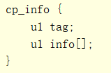

其中 tag 作为类型标记，用于确定后面的 info 的格式，tag 是一个字节，info 是两个或者多个字节，取决于 tag的值，如下图：

| 常量类型 | 值 |
| --- | --- |
| CONSTANT\_Class | 7 |
| CONSTANT\_Fieldref | 9 |
| CONSTANT\_Methodref | 10 |
| CONSTANT\_InterfaceMethodref | 11 |
| CONSTANT\_String | 8 |
| CONSTANT\_Integer | 3 |
| CONSTANT\_Float | 4 |
| CONSTANT\_Long | 5 |
| CONSTANT\_Double | 6 |
| CONSTANT\_NameAndType | 12 |
| CONSTANT\_Utf8 | 1 |
| CONSTANT\_MethodHandle | 15 |
| CONSTANT\_MethodType | 16 |
| CONSTANT\_InvokeDynamic | 18 |

name\_index、class\_index、name\_and\_type\_index 是对常量池的有效索引，分别表示常量池的CONSTANT\_Utf8\_info 结构、CONSTANT\_Class\_info 结构、CONSTANT\_NameAndType\_info 结构。以下为各类型结构：

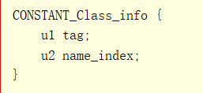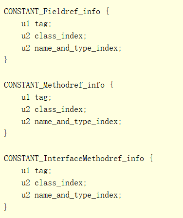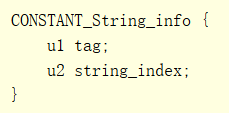

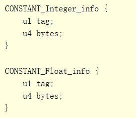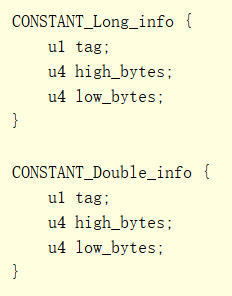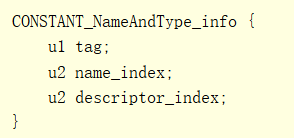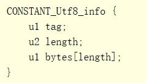

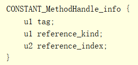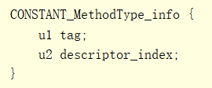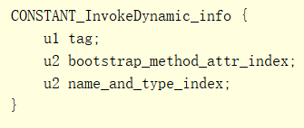

CONSTANT\_MethodHandle\_info 用于表示方法句柄，CONSTANT\_MethodType\_info 用于记录方法的类型信息，即方法描述符，CONSTANT\_InvokeDynamic\_info 用于表示 invokedynamic 指令使用的动态调用名，参数和返回值等系列静态参数的常量

## field\_info

name\_index、descriptor\_index  表示常量池中一个类型为CONSTANT\_Utf8\_info的有效索引。字段表的成员用field\_info结构表示，该结构如下图：

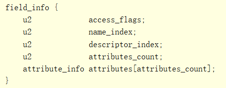

其中 access\_flags 表示字段的访问权限和属性，是由标识构成的掩码（标识就是某个特定的二进制位，取值为1表示开启，0表示关闭）各标识开启后的含义如下：

| 标记名称 | 值 | 描述 |
| --- | --- | --- |
| ACC\_PUBLIC | 0x0001 | 声明为 public，可包外访问 |
| ACC\_PRIVATE | 0x0002 | 声明为 private，只能在当前类中访问 |
| ACC\_PROTECTED | 0x0004 | 声明为 PROTECTED，只能在子类中访问 |
| ACC\_STATIC | 0x0008 | 声明为 static |
| ACC\_FINAL | 0x0010 | 声明为 final，在构造函数后不可再进行赋值（这里是 JLS 定义的，JVM 并未对此有定义） |
| ACC\_VOLATILE | 0x0040 | 声明为 volatile，不可被缓存 |
| ACC\_TRANSIENT | 0x0080 | 声明为 transient，不会被持久化对象管理器写入或读取 |
| ACC\_SYNTHETIC | 0x1000 | 表示为编译器添加，不在源代码中 |
| ACC\_ENUM | 0x4000 | 该字段为枚举类型的成员 |

field\_info 中的 access\_flags 遵顼以下规则：

* ACC\_FINAL 和  ACC\_VOLATILE 不可同时在一个字段上设置
* 接口中的字段必须设置 ACC\_PUBLIC、ACC\_STATIC、 ACC\_FINAL 最多再有 ACC\_SYNTHETIC ，其它标识都是不被允许的
* ACC\_ENUM 表明当前字段表示的是一个枚举类中的字段
* 未使用的标识位应被设置为 0 作为以后拓展使用，根据 JVM 规范即使读取到值也应该忽略

## method\_info

基本和 field\_info 一致，该结构如下图：

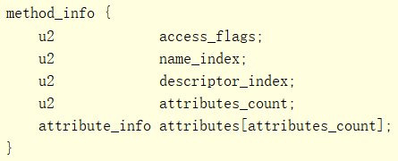

各标识含义如下：

| 标记名称 | 值 | 描述 |
| --- | --- | --- |
| ACC\_PUBLIC | 0x0001 | 声明为 public，可包外访问 |
| ACC\_PRIVATE | 0x0002 | 声明为 private，只能在当前类中访问 |
| ACC\_PROTECTED | 0x0004 | 声明为 PROTECTED，只能在子类中访问 |
| ACC\_STATIC | 0x0008 | 声明为 static |
| ACC\_FINAL | 0x0010 | 声明为 final，不可被子类覆盖 |
| ACC\_SYNCHRONIZED | 0x0020 | 声明为 synchronized，对该方法的调用将包装在同步锁（monitor）中 |
| ACC\_BRIDGE | 0x0040 | 声明为 bridge 方法，有编译器产生（多为泛型适配时产生） |
| ACC\_VARARGS | 0x0080 | 表示方法有可变参数 |
| ACC\_NATIVE | 0x0100 | 声明为 native，表示方法不由 Java 实现 |
| ACC\_ABSTRACT | 0x0400 | 声明为 abstract，该方法没有实现代码 |
| ACC\_STRICT | 0x0800 | 声明为 strictfp，使用 FP-strict 浮点模式 |
| ACC\_SYNTHETIC | 0x1000 | 该方法由编译器直接生成 |

method\_info 中的 access\_flags 遵顼以下规则：

* 类中的方法只能包含其中之一的访问标识符 ACC\_PUBLIC、ACC\_PRIVATE、ACC\_PROTECTED
* 接口中的方法不可设置 ACC\_PROTECTED、ACC\_FINAL、ACC\_SYNCHRONIZED 和 ACC\_NATIVE。在版本号小于 52.0 的类文件中，接口的每个方法必须设置 ACC\_PUBLIC和ACC\_ABSTRACT 标识; 在版本号为 52.0 或更高版本的类文件中，接口的每个方法必须只设置 ACC\_PUBLIC 和 ACC\_PRIVATE 标识中的一个
* 如果类或接口中的方法有 ACC\_ABSTRACT 表示，则 CC\_PRIVATE、ACC\_STATIC、ACC\_FINAL、ACC\_SYNCHRONIZED、ACC\_NATIVE 或 ACC\_STRICT 均不能设置
* 构造方法最多可以设置一个 ACC\_PUBLIC，ACC\_PRIVATE和ACC\_PROTECTED 标识，并且还可以设置其 ACC\_VARARGS，ACC\_STRICT 和 ACC\_SYNTHETIC 标识，但不得具有任何其他标识
* 类和接口的初始化方法由 Java 虚拟机隐式调用。 除了 ACC\_STRICT 标志的设置外，它们的 access\_flags 项的值被忽略
* ACC\_SYNTHETIC 表示此方法是由编译器生成的，并且不会出现在源代码中，除非它是类的初始化方法或枚举类的 `Enum.values()、Enum.valueOf()`
* 未使用的标识位应被设置为 0 作为以后拓展使用，根据 JVM 规范即使读取到值也应该忽略

## attribute\_info

ClassFile、filed\_info、method\_info 结构和 Code 属性都有属性表，所有的属性都通过 attribute\_info 结构表示，其通用格式如下：

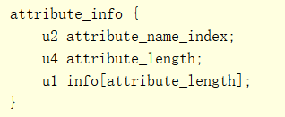

其中 attribute\_name\_index 是常量池中一个类型为 CONSTANT\_Utf8\_info 的有效索引，表示该属性的属性名，attribute\_length 表示后面的 info 信息的字节长度，这个长度不包括 attribute\_name\_index 和 attribute\_length 的 6 字节。Java8 预定义了 23 种属性，用户在编译源代码文件时可以添加新的属性，只要 JVM 实现能够正确识别该属性即可，注意用户自定义的属性不能使用这些预定义属性的属性名，预定义的属性根据其用途分为三组：

1. Java 虚拟机正确解释类文件至关重要 5 个属性：

* ConstantValue：位于filed\_info 的属性表中，表示 static 字段的初始值，非对象类型的常量值
* Code：位于 method\_info 的属性表中，表示该方法的虚拟机指令及辅助信息，method\_info 中有且仅有一个 Code 属性，其结构如下：

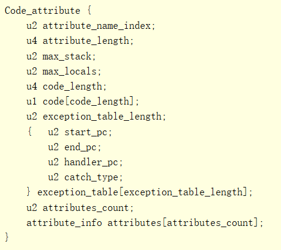

其中 max\_stack 表示当前方法操作数栈的最大深度；max\_locals 表示此方法引用局部变量表中的局部变量的个数，包含传递方法入参的局部变量；code\_length 表示后面的 code 数组的字节长度；code 数组表示当前方法的虚拟机指令的数据；exception\_table\_length 表示后面的 exception\_table 数组的长度；exception\_table 中表示此方法的捕获的各异常的异常处理逻辑，每个成员对应一个异常类型，每个成员包含 4 个属性，start\_pc, end\_pc 表示 try/catch 的代码范围，具体来说是起止代码对应的虚拟机指令在 code 数组中的索引，handler\_pc 是异常处理逻辑的代码的虚拟机指令在 code 数组中的索引，catch\_type 是常量池中一个类型为CONSTANT\_Class\_info 的有效索引，表示捕获的异常类型。

* StackMapTable：位于 Code 属性的属性表中，最多只能包含一个，用于虚拟机的类型检查验证阶段，验证某个局部变量的类型与操作数栈顶所需的核查类型是否一致
* Exceptions：位于 method\_info 的属性表，表示该方法可能抛出的受检异常的异常类型
* BootstrapMethods：位于 ClassFile 结构的属性表中，用于保存 invokedynamic 指令引用的引导方法限定符，如果常量池中包含 CONSTANT\_InvokeDynamic\_info 成员，则 ClassFile 的属性表中必须包含且只能包含一个 BootstrapMethods 属性

2. Java SE 平台类库对类文件的正确解释的 12 个属性：

* InnerClasses：位于 ClassFile 的属性表中，表示该类定义的内部类信息，如果有内部类，则有且仅有一个 InnerClasses 属性
* EnclosingMethod：位于 ClassFile 的属性表中，如果当前类是局部类或者匿名类时才有 EnclosingMethod 属性，表示该类的闭包方法
* Synthetic：位于 ClassFile，method\_info 或者 filed\_info 结构的属性表中，表示该成员没有在源文件中出现，如编译器自动添加的默认构造方法
* Signature：位于 ClassFile，method\_info 或者 filed\_info 结构的属性表中，表示该成员使用的参数化类型的签名信息
* RuntimeVisibleAnnotations：位于 ClassFile，method\_info 或者 filed\_info 结构的属性表中，最多只能含有一个，表示加在此成员声明上面的运行时可见的注解，注解用a nnotation 结构表示，保存了注解的多个键值对属性
* RuntimeInvisibleAnnotations：与 RuntimeVisibleAnnotations 相对，表示加在此成员声明上面的运行时不可见的注解
* RuntimeVisibleParameterAnnotations：位于 method\_info 结构的属性表中，最多只能含有一个，表示方法入参的运行时可见的注解
* RuntimeInvisibleParameterAnnotations：与 RuntimeVisibleParameterAnnotations 相对，表示方法入参的运行时不可见的注解
* RuntimeVisibleTypeAnnotations：位于 ClassFile，method\_info、filed\_info 或者 Code 结构的属性表中，记录了标注在对应类声明，字段声明或者方法声明所使用的类型上面的运行时可见注解，如某个类 implements 的各个接口的所有注解都会记录在该类 ClassFile 结构中的 RuntimeVisibleTypeAnnotations 属性中，某个字段的字段类型的所有注解都会记录在该字段对应的 filed\_info 结构体的 RuntimeVisibleTypeAnnotations 属性中
* RuntimeInvisibleTypeAnnotations：与 RuntimeVisibleTypeAnnotations 相对，表示运行时不可见注解
* AnnotationDefault：位于 method\_info 结构的属性表中，用来记录注解类型的元素的默认值
* MethodParameters：位于 method\_info 结构的属性表中，用来记录方法的形参的个数，形参名，形参是否 final 等

3. 对于 Java 虚拟机或 Java SE 平台的类库来说，6 个属性对正确解释类文件并不重要，但对工具很有用：

* SourceFile：位于 ClassFile 的属性表中，表示该 class 文件对应的源代码文件的文件名
* SourceDebugExtension：位于 ClassFile 的属性表中，表示该类的扩展调试信息
* LineNumberTable：位于 Code 的属性表中，表示虚拟机指令同源文件代码行的对应关系，注意LineNumberTable 与源文件的代码行没有一一对应关系，可能多个 LineNumberTable 属性对应同一个代码行，且 LineNumberTable 的属性顺序是任意的
* LocalVariableTable：位于 Code 的属性表中，表示方法的局部变量，每个局部变量最多对应一个LocalVariableTable 属性，Code 中的多个 LocalVariableTable 属性的顺序是任意的。每个局部变量通过 5 个属性表示，start\_pc 和 length 表示该局部变量的作用域范围，start\_pc 是 Code 数组的索引，name\_index 属性表示局部变量的变量名，descriptor\_index 表示该变量的字段描述符，index 表示该变量在局部变量表中的索引
* LocalVariableTypeTable：位于 Code 的属性表中，只针对参数化类型的变量，用于提供该变量参数化类型的签名信息，这类变量会同时出现在 LocalVariableTable和LocalVariableTypeTable 中，其他的变量只在 LocalVariableTable 中出现
* Deprecated：位于 ClassFile，method\_info 或者 filed\_info 结构的属性表中，表示此成员在未来版本中被取代

# JVM 类加载

JVM 加载类分三步，加载、链接、初始化，其中链接分为：验证、准备、解析

## 运行时常量池

每个 class 文件都包含一个表结构的常量池（constant\_pool），该常量池的功能跟 C/C++ 编译过程中用到的符号表是一样的，主要用于保存源代码文件中的各种字面常量（如字符串常量，字段名，方法名等）和符号引用（如对其他某个类的方法调用）。当类或者接口创建时，常量池表会被用来构造运行时常量池，如 new 对象时使用的类的符号引用来自于 CONSTANT\_Class\_info 结构，读取对象字段值时使用的字段的符号引用来自于CONSTANT\_Fieldref\_info，方法调用中使用的方法的符号引用来自于 CONSTANT\_Methordref\_info 结构。运行时常量池是二进制形式的常量池表在 Hotspot 中的对应 C++ 实现，即 oops 模块下的 ConstantPool 类（`hotspot/src/share/vm/oops/constantPool.hpp`）运行时常量池所有引用最初都是符号引用，在链接阶段会将符号引用解析成对应的内存地址。

符号引用在 JVM 中使用 Symbol（`hotspot/src/share/vm/oops/symbol.hpp`）表示，所有的 Symbol 统一存储到 SymbolTable 中（本质是一个并发哈希表）SymbolTable 采用引用计数管理 Symbol（假设两个类中含相同的 Symbol，当这两个类被卸载时，该 Symbol 计数为 0，且下一次垃圾回收不再会做可达性分析而是直接清除）

## 类加载器

类加载器主要负责加载类的，按照给定的全限定类名如 java/lang/String，从文件或者网络中读取二进制形式的类，将其转化成 JVM 能够识别并直接使用的 Klass 模型。JDK提供了三种标准类加载器：

* 启动（Bootstrap）类加载器：是 Java 类加载层次中最顶层的 JVM 内置的类加载器，负责加载 \<JAVA\_HOME>/lib 路径或者 -Xbootclasspath 参数指定的路径下的核心类库，如：rt.jar、resources.jar、charsets.jar 等，由 C++ 语言实现，在 Java 程序中无法直接访问（`hotspot/src/share/vm/classfile/classLoader.hpp/ClassLoader`）注意 JVM会 对加载的核心类库做强校验，避免非法篡改
* 扩展（Extension）类加载器：即 sun.misc.Launcher$ExtClassLoader 类，由 Java 语言实现，是 Launcher 的静态内部类，负责加载 \<JAVA\_HOME>/lib/ext 目录下或者由系统变量 -Djava.ext.dir 指定位路径中的类库
* 应用（App）类加载器：即 sun.misc.Launcher$AppClassLoader 类，由 Java 语言实现，是 Launcher 的静态内部类，负责加载系统类路径 java -classpath 或 -D java.class.path 指定路径下的类库，通过ClassLoader#getSystemClassLoader() 方法可以获取到该类加载器，是应用程序的默认类加载器

每个类的 Class 都包含有加载该 Class 的类加载器的引用，可调 Class#getClassLoader() 获取，JDK 核心类库中的类除外，因为这部分类是由启动类加载器加载的。因为数组类的 Class 不是由类加载器生成的，而是 JVM 根据数组元素类型自动生成的，所以调用 Class#getClassLoader() 返回的是数组元素类的类加载器的引用。类加载器采用委托模型加载类或者其他资源，发出加载请求的类加载器和最终完成加载并定义类的类加载器不需要是同一个类加载器。每个类加载器实例都有一个关联的父类加载器，该父类加载器就是被委托对象，可调用ClassLoader#getParent()方法获取（启动类加载器没有父类加载器，而是作为其他类加载器的父类加载器存在）

即 AppClassLoader 的父类加载器是 ExtClassLoader，ExtClassLoader 的父类加载器为空（这里的为空仅是父类加载器引用为空，在逻辑上启动加载器是 ExtClassLoader 的父加载器）本身他们之间也不存在实际的继承关系，只是逻辑上的继承关系。

编译期间无法区分不同 ClassLoader 加载的相同 Class 对象，因此如果出现此情况时对类进行强转会失败。因此实际编码过程中不可进行强转，遇到相应的情况时一般有两种解决方案：

1. 直接通过反射访问其中的字段、方法
2. 通过新建一个公共的接口或抽象类，定义字段和方法，使用时强转为接口或抽象类再进行使用（Tomcat 热部署 以及 热部署插件 JRebel 等 ）

```java
package org.example.me.ex;

import java.io.ByteArrayOutputStream;
import java.io.File;
import java.io.InputStream;
import java.nio.file.Files;

public class MainTest {

    public static void main(String[] args) throws InstantiationException, IllegalAccessException {
        MainTest mainTest = new MainTest();
        MyClassLoader myClassLoader = new MyClassLoader();
        Class<?> aClass = myClassLoader.findClass("org.example.me.ex.MainTest");
        Object o = aClass.newInstance();
        // 以下注释的代码会出现转换失败异常
        // MainTest a = (MainTest) aClass.newInstance();
        System.out.println(mainTest.getClass() == o.getClass());
    }
}


class MyClassLoader extends ClassLoader {

    @Override
    public Class<?> findClass(String name) {
        String filepath = MainTest.class.getResource("MainTest.class").getPath();
        File file = new File(filepath);
        if (file.exists()) {
            try (InputStream ins = Files.newInputStream(file.toPath())) {
                ByteArrayOutputStream baos = new ByteArrayOutputStream();
                byte[] buffer = new byte[4096];
                int bytesNumRead = 0;
                while ((bytesNumRead = ins.read(buffer)) != -1) {
                    baos.write(buffer, 0, bytesNumRead);
                }
                byte[] classData = baos.toByteArray();
                return defineClass(name, classData, 0, classData.length);
            } catch (Exception e) {

            }
        }
        return null;
    }
}
```

## 加载

JVM 进行类加载时，主要是对 class 文件格式进行校验，验证的事项如下：

* 前4个字节必须是正确的魔数
* 能够辨识出来的所有属性都必须具备合适的长度
* class文件内容的必选项不能缺失，尾部也不能有多余的字节
* 常量池必须符合class文件格式，如CONSTANT\_class\_info结构的name\_index项必须是指向常量池中CONSTANT\_Utf8\_info结构的有效索引
* 常量池中所有的字段和方法引用都必须具备有效的名称，类和描述符

## 链接

链接类或者接口包括验证和准备类或接口，它的直接父类，直接父接口，元素类型（如果是数组类型），而解析这个类的符号引用如对某个类的方法调用则是链接过程中可选的部分。Java虚拟机规范允许灵活的选择链接的时机，但必须保证以下几点成立：

* 在类或者接口被链接之前，它被成功的加载过
* 在类或者接口被初始化之前，它被成功的验证及准备过
* 若程序触发了一个需要直接或者间接链接某一个类或接口的动作，如使用了某个未解析的符号引用时，在链接过程中出现异常则必须触发链接动作的地方抛出异常，即必须指明触发链接异常的动作是啥

Java 虚拟机实现可以选择在只有用到类或者接口的符号引用时才去逐一解析，称为延迟解析，也可以在验证类的时候就解析每个符号引用，称为预先解析，Hotspot 为了节省内存占用选择延迟解析，也只有在解析需要某个类时才会加载对应的 class 文件。链接包含三个步骤，验证、准备和解析。

### 验证

验证用于保证类或者接口的二进制表示是否符合静态约束和结构化约束，验证过程会导致某些额外的类或者接口被加载进来，但是不一定导致他们也需要验证或者准备。

静态约束主要是指一系列用来定义文件是否良好编排的约束，加载过程中执行的格式检查就是静态约束的一部分，验证环节验证的静态约束主要包含对虚拟机指令的验证，包括虚拟机指令在 Code 数组中是否正确排列，部分特殊的指令是否带上了必要的操作数，如：

* code 数组中不允许出现保留的或者规范中未定义的虚拟机指令
* code 数组中第一条指令的操作码是从数组中索引为 0 处开始的
* 对于 code 数组中除最后一条指令外的其他指令，下一条指令的操作码的索引等于当前指令的操作码的索引加上当前指令的长度（包含指令带有的操作数），即虚拟机指令之间都是紧密排列的，不允许有多余的字节
* 所有跳转和分支指令必须的跳转目标必须是本方法内某个指令的操作码
* anewarray 指令不能创建维度超过 255 维的数组

结构化约束主要是为了限定虚拟机指令之间的关系，如：

* 所有指令都只能在操作数栈和局部变量表中具备类型和数量合适的操作数时执行，但不用关心调用它的执行路径
* 如果某个指令可以通过不同的执行路径执行，则指令执行前，操作数栈必须具有相同的深度
* 在执行过程中不允许操作数栈增长到超过 max\_stack 项的值的深度
* 所有方法调用的参数，其类型必须与方法描述符相兼容
* 所有返回指令必须与方法的返回类型相同

除检查虚拟机指令是否满足上述两种约束外，还需验证：

* final 类没有子类
* final 方法没有被其他方法覆写
* 除 Object 之外的其他类都有直接父类

### 准备

准备阶段的任务是创建类或者接口的静态字段，并用默认值初始化这些字段，这个阶段不会执行任何的虚拟机指令，在初始化阶段会有显示的初始化器来初始化这些字段，所以准备阶段不做初始化。除此之外，JVM 会在准备阶段强制实施加载约束，具体的约束规则参考虚拟机规范。执行完类验证后，任何时间都可以执行准备，但一定要保证在初始化阶段前完成。

### 解析

解析是根据运行时常量池里的符号引用来动态决定具体值的过程，如果某个符号引用解析过程出现异常，则应该在直接或者间接使用该符号引用的地方抛出异常。对类 D 引用的类或者接口 C 的符号引用解析时，大体解析流程如下：

* 解析 C 的类或者接口符号引用时，会使用D的类加载器来加载类 C，并检查 D 对 C 的访问权限。
* 解析 C 的某个字段符号引用时，会先解析 C 的类符号引用，然后在 C 或者 C 的父类中查找目标字段是否存在，检查目标字段对 D 是否可见
* 解析 C 的普通方法的符号引用时，先解析 C 的类符号引用，检查 C 是否是接口，如果不是检查 C 和他的父类是否包含此方法
* 解析 C 的接口方法的符号引用时，先解析 C 的类符号引用，检查 C 是否是接口，如果是检查 C 和他的父接口是否包含此方法
* 方法类型和方法句柄的解析比较复杂，方法类型解析的结果是得到一个 java.lang.invoke.MethodType 的实例的引用，方法句柄解析的结果是得到一个指向 java.lang.invoke.MethodHandler 实例的引用，详情参考虚拟机规范
* 调用点限定符解析，需依次解析调用点中的方法句柄，方法类型的符号引用，再解析静态参数的符号引用，当通过反射调用 Java 方法时会出现此类解析。

## 初始化

初始化对类和接口来说就是执行它的初始化方法，只有在发生下列行为时，类或者接口才会被初始化：

* 执行 new，getstatic,putstatic,invokestatic 指令时
* 初次调用方法句柄 java.lang.invoke.MethodHanlder 实例，该实例的种类是REF\_getstatic, REF\_putstatic, REF\_invokestatic
* 调用 Class 类或者反射类库中的某些反射方法
* 对类的某个子类进行初始化时
* 该类被选定为 Java 虚拟机启动时的初始类

因为 JVM 支持多线程，所以存在并发初始化某个类或者接口的问题，JVM 实现需要处理好线程同步和递归初始化，通常采用与某个类或者接口唯一关联的全局初始化锁来控制，参考 ClassLoader 类中的getClassLoadingLock 的实现。

## JVM 类加载源码分析

### 符号信息源码

类加载时需要解析符号信息，这些符号信息在 JVM 中均使用 Symbol 进行存储。所有的 Symbol 实例通过保存在全局的 SymbolTable 中，SymbolTable 即符号表，基于此实现符号引用计数功能。当有一个新的指针指向该Symbol 实例，则引用计数加 1，当该指针销毁时需要将引用计数减 1，当一个 Symbol 的引用计数为 0，垃圾回收器就会从 SymbolTabl e中删除该 Symbol 并回收内存。在之前类的继承关系图中展示 Symbol 的父类是 SymbolBase（`hotspot/src/share/vm/oops/symbol.hpp`）源码如下：

```cpp
class SymbolBase : public MetaspaceObj {
 public:
  ATOMIC_SHORT_PAIR(
    // 支持原子操作的short变量，表示该 Symbol 的引用计数
    volatile short _refcount,  // needs atomic operation
    // UTF8 字符串长度
    unsigned short _length     // number of UTF8 characters in the symbol (does not need atomic op)
  );
  // hash 标识
  int            _identity_hash;
};
```

Symbol（`hotspot/src/share/vm/oops/symbol.hpp`）只多了一个字段 \_body，虽然是数组但也只是存储的字符串基址，具体还是通过长度进行偏移。源码如下：

```cpp
class Symbol : private SymbolBase {
friend class VMStructs;
friend class SymbolTable;
friend class MoveSymbols;
private:
// 实际存储描述符对应的字符串的基地址，不是直接存储在数组中，而是使用 
// 基地址 + 偏移量的形式进行存储
// 这里能这么申请的前提是具体依赖 Chunk 进行分配的内存
jbyte _body[1];

enum {
// max_symbol_length is constrained by type of _length
max_symbol_length = (1 << 16) -1
};

static int size(int length) {
    size_t sz = heap_word_size(sizeof(SymbolBase) + (length > 0 ? length : 0));
    return align_object_size(sz);
}

void byte_at_put(int index, int value) {
    assert(index >=0 && index < _length, "symbol index overflow");
    _body[index] = value;
}

// 构造方法直接在基址后面添加字符串
Symbol::Symbol(const u1* name, int length, int refcount) {
    _refcount = refcount;
    _length = length;
    _identity_hash = os::random();
    for (int i = 0; i < _length; i++) {
        byte_at_put(i, name[i]);
    }
}
// new 操作符均进行重写从 常量池中申请内存
void* operator new(size_t size, int len, TRAPS) throw();
void* operator new(size_t size, int len, Arena* arena, TRAPS) throw();
void* operator new(size_t size, int len, ClassLoaderData* loader_data, TRAPS) throw();

void  operator delete(void* p);

public:
// Low-level access (used with care, since not GC-safe)
const jbyte* base() const { return &_body[0]; }
};
```

SymbolTable（`hotspot/src/share/vm/classfile/symbolTable.hpp`）用于存储 Symbol （`hotspot/src/share/vm/classfile/symbolTable.hpp`）实例，它还有个极其类似的 StringTable，就是 Java 特有的字符串常量池。SymbolTable 和 StringTable 实际是一个支持自动扩容的 HashMap，源码如下：

```cpp
class SymbolTable : public RehashableHashtable<Symbol*, mtSymbol> {
  friend class VMStructs;
  friend class ClassFileParser;

private:
  // The symbol table
  // SymbolTable 指针，即全局实际保存 Symbol 实例的地方
  static SymbolTable* _the_table;

  // Set if one bucket is out of balance due to hash algorithm deficiency
  // 是否需要重新 hash
  static bool _needs_rehashing;

  // For statistics
  // 已经被移除的 Symbol 数量
  static int _symbols_removed;
  // 当前的 Symbol 总数量
  static int _symbols_counted;

  // Arena for permanent symbols (null class loader) that are never unloaded
  // 表示从未被加载过的描述符
  static Arena*  _arena;
};
```

```cpp
class StringTable : public RehashableHashtable<oop, mtSymbol> {
  friend class VMStructs;

private:
  // The string table
  // 全局实际保存字符串的地方
  static StringTable* _the_table;

  // Set if one bucket is out of balance due to hash algorithm deficiency
  // 是否需要重新 hash
  static bool _needs_rehashing;

  // Claimed high water mark for parallel chunked scanning
  // 并发标记时使用
  static volatile int _parallel_claimed_idx;
};
```

### ConstantPool 源码

ConstantPool 用于表示 每个 class 文件的常量池，常量池大部分数据是在 class 文件解析时写入的。常量池的每项数据都通过类 CPSlot 表示，其定义跟 ConstantPool（`hotspot/src/share/vm/oops/constantPool.hpp`）类位于同一个文件中，只有一个属性，解析结果 Klass 或者 Symbol 的地址，如果未解析则地址是 0，可以将该地址转换成 Klass 或者 Symbol 类的指针。源码如下：

```cpp
class ConstantPool : public Metadata {
  friend class VMStructs;
  friend class BytecodeInterpreter;  // Directly extracts an oop in the pool for fast instanceof/checkcast
  friend class Universe;             // For null constructor
 private:
  // 单字节数组指针，描述常量池所有数据的类型的 tag 数组，每个 tag 用一个单字节表示
  Array<u1>*           _tags;        // the tag array describing the constant pool's contents
  // 保存解释器运行时用到的动态调用相关信息的缓存
  ConstantPoolCache*   _cache;       // the cache holding interpreter runtime information
  // 当前常量池所属的 Klass 实例
  InstanceKlass*       _pool_holder; // the corresponding class
  // 两字节的数组指针，为大小可变的常量池数据项使用，通常为空
  Array<u2>*           _operands;    // for variable-sized (InvokeDynamic) nodes, usually empty

  // Array of resolved objects from the constant pool and map from resolved
  // object index to original constant pool index
  // jobject 类型，实际是 _jobject 指针的别名，_jobject 等同于 C++ 层面的 Java Object 对象，
  // 表示已经解析的对象数组
  jobject              _resolved_references;
  // 两字节的数组指针，表示已经解析的对象的索引到原始的常量池的索引的映射关系
  Array<u2>*           _reference_map;
};
```

```cpp
// A constantPool is an array containing class constants as described in the
// class file.
//
// Most of the constant pool entries are written during class parsing, which
// is safe.  For klass types, the constant pool entry is
// modified when the entry is resolved.  If a klass constant pool
// entry is read without a lock, only the resolved state guarantees that
// the entry in the constant pool is a klass object and not a Symbol*.
class CPSlot VALUE_OBJ_CLASS_SPEC {
  // 解析结果 Klass 或者 Symbol 的地址，如果未解析则地址是 0
  intptr_t _ptr;
 public:
  CPSlot(intptr_t ptr): _ptr(ptr) {}
  CPSlot(Klass* ptr): _ptr((intptr_t)ptr) {}
  CPSlot(Symbol* ptr): _ptr((intptr_t)ptr | 1) {}

  intptr_t value()   { return _ptr; }
  bool is_resolved()   { return (_ptr & 1) == 0; }
  bool is_unresolved() { return (_ptr & 1) == 1; }

  Symbol* get_symbol() {
    assert(is_unresolved(), "bad call");
    return (Symbol*)(_ptr & ~1);
  }
  Klass* get_klass() {
    assert(is_resolved(), "bad call");
    return (Klass*)_ptr;
  }
};
```

### 已加载类缓存

SystemDictionary（`hotspot/src/share/vm/classfile/systemDictionary.hpp`）用于保存所有已经加载完成的类，通过一个支持自动扩容的 HashMap 保存，key 是表示类名Symbol 指针和对应的类加载器 oop 指针，value 是对应的 Klass 指针，当一个新的类加载完成后就会在SystemDictionary 中添加一个新的键值对，其源码如下：

```cpp
class SystemDictionary : AllStatic {
  friend class VMStructs;
  friend class SystemDictionaryHandles;

 protected:

  enum Constants {
    _loader_constraint_size = 107,                     // number of entries in constraint table
    _resolution_error_size  = 107,                     // number of entries in resolution error table
    _invoke_method_size     = 139,                     // number of entries in invoke method table
    _nof_buckets            = 1009,                    // number of buckets in hash table for placeholders
    _old_default_sdsize     = 1009,                    // backward compat for system dictionary size
    _prime_array_size       = 8,                       // array of primes for system dictionary size
    _average_depth_goal     = 3                        // goal for lookup length
  };


  // Static variables

  // hashtable sizes for system dictionary to allow growth
  // prime numbers for system dictionary size
  // 保存已加载类的 HashMap 的容量
  static int                     _sdgeneration;

  static const int               _primelist[_prime_array_size];

  // Hashtable holding loaded classes.
  // 实际保存已加载类的 HashMap
  static Dictionary*            _dictionary;

  // Hashtable holding placeholders for classes being loaded.
  // 当类加载的过程中临时存储键值对的地方，底层数据结构同 Dictionary 类
  static PlaceholderTable*       _placeholders;

  // Hashtable holding classes from the shared archive.
  // 共享架构下用于保存已加载类的 HashMap
  static Dictionary*             _shared_dictionary;

  // Monotonically increasing counter which grows with
  // _number_of_classes as well as hot-swapping and breakpoint setting
  // and removal.
  // 发生修改的次数，类加载或者删除都会增加该计数器
  static int                     _number_of_modifications;

  // Lock object for system class loader
  // 系统类加载器的对象锁
  static oop                     _system_loader_lock_obj;

  // Constraints on class loaders
  // 保存类加载器加载约束的 HashTable
  static LoaderConstraintTable*  _loader_constraints;

  // Resolution errors
  // 保存类解析错误的 HashTable
  static ResolutionErrorTable*   _resolution_errors;

  // Invoke methods (JSR 292)
  // 保存 MethodHandle 调用的解析结果
  static SymbolPropertyTable*    _invoke_method_table;

protected:
  static Klass* find_shared_class(Symbol* class_name);

  // Setup link to hierarchy
  static void add_to_hierarchy(instanceKlassHandle k, TRAPS);

  // We pass in the hashtable index so we can calculate it outside of
  // the SystemDictionary_lock.

  // Basic find on loaded classes
  static Klass* find_class(int index, unsigned int hash,
                             Symbol* name, ClassLoaderData* loader_data);
  static Klass* find_class(Symbol* class_name, ClassLoaderData* loader_data);

  // Basic find on classes in the midst of being loaded
  static Symbol* find_placeholder(Symbol* name, ClassLoaderData* loader_data);

  // Updating entry in dictionary
  // Add a completely loaded class
  static void add_klass(int index, Symbol* class_name,
                        ClassLoaderData* loader_data, KlassHandle obj);

  // Add a placeholder for a class being loaded
  static void add_placeholder(int index,
                              Symbol* class_name,
                              ClassLoaderData* loader_data);
  static void remove_placeholder(int index,
                                 Symbol* class_name,
                                 ClassLoaderData* loader_data);

  // Performs cleanups after resolve_super_or_fail. This typically needs
  // to be called on failure.
  // Won't throw, but can block.
  static void resolution_cleanups(Symbol* class_name,
                                  ClassLoaderData* loader_data,
                                  TRAPS);

  // Initialization
  static void initialize_preloaded_classes(TRAPS);

  // Class loader constraints
  static void check_constraints(int index, unsigned int hash,
                                instanceKlassHandle k, Handle loader,
                                bool defining, TRAPS);
  static void update_dictionary(int d_index, unsigned int d_hash,
                                int p_index, unsigned int p_hash,
                                instanceKlassHandle k, Handle loader,
                                TRAPS);

  // Variables holding commonly used klasses (preloaded)
  static Klass* _well_known_klasses[];

  // Lazily loaded klasses
  static Klass* volatile _abstract_ownable_synchronizer_klass;

  // table of box klasses (int_klass, etc.)
  static Klass* _box_klasses[T_VOID+1];
  // 应用类加载器
  static oop  _java_system_loader;

  static bool _has_loadClassInternal;
  static bool _has_checkPackageAccess;
};
```

### ClassLoader 源码

引导类加载器由 ClassLoader（`hotspot/src/share/vm/classfile/classLoader.hpp`）实现，用于加载Java核心类文件如rt.jar，ClassLoader 定义的属性大都是用于统计类加载性能的计数器，其源码如下：

```cpp
class ClassLoader: AllStatic {
public:
enum SomeConstants {
package_hash_table_size = 31  // Number of buckets
};
protected:
friend class LazyClassPathEntry;

// First entry in linked list of ClassPathEntry instances
// ClassPathEntry 用于表示单个 classpath 路径，所有的 ClassPathEntry 实例以链表的
// 形式关联起来，_first_entry 表示链表的第一个实例
static ClassPathEntry* _first_entry;
// Last entry in linked list of ClassPathEntry instances
// 表示链表的最后一个实例
static ClassPathEntry* _last_entry;
// 表示 ClassPathEntry 链表中 ClassPathEntry 实例的个数
static int _num_entries;

// Hash table used to keep track of loaded packages
// 用于保存已经加载过的包名
static PackageHashtable* _package_hash_table;
static const char* _shared_archive;

// Initialize the class loader's access to methods in libzip.  Parse and
// process the boot classpath into a list ClassPathEntry objects.  Once
// this list has been created, it must not change order (see class PackageInfo)
// it can be appended to and is by jvmti and the kernel vm.
void ClassLoader::initialize() {
    // lookup zip library entry points
    // 加载读写zip文件的动态链接库
    load_zip_library();
    // 设置加载核心jar包的搜索路径，从系统参数Arguments中获取
    setup_bootstrap_search_path();
        // 如果是惰性启动加载（默认为 true 可通过参数 LazyBootClassLoader 进行修改），
        // 即启动时不加载 rt.jar 等文件
        if (LazyBootClassLoader) {
            // set up meta index which makes boot classpath initialization lazier
            // 设置 meta_index_path，设置完成后会触发对 meta_index_path 下文件的解析
            setup_bootstrap_meta_index();
        }
    }
};

instanceKlassHandle ClassLoader::load_classfile(Symbol* h_name, TRAPS) {
    ResourceMark rm(THREAD);
    const char* class_name = h_name->as_C_string();
    EventMark m("loading class %s", class_name);
    ThreadProfilerMark tpm(ThreadProfilerMark::classLoaderRegion);

    // 根据符号信息获取文件名称
    stringStream st;
    // st.print() uses too much stack space while handling a StackOverflowError
    // st.print("%s.class", h_name->as_utf8());
    st.print_raw(h_name->as_utf8());
    st.print_raw(".class");
    const char* file_name = st.as_string();
    ClassLoaderExt::Context context(class_name, file_name, THREAD);

    // Lookup stream for parsing .class file
    // 根据文件名称查找 class 文件
    ClassFileStream* stream = NULL;
    int classpath_index = 0;
    ClassPathEntry* e = NULL;
    instanceKlassHandle h;
    {
        PerfClassTraceTime vmtimer(perf_sys_class_lookup_time(),
        ((JavaThread*) THREAD)->get_thread_stat()->perf_timers_addr(),
        PerfClassTraceTime::CLASS_LOAD);
        // 从第一个 ClassPathEntry 开始查找
        e = _first_entry;
        while (e != NULL) {
            stream = e->open_stream(file_name, CHECK_NULL);
            if (!context.check(stream, classpath_index)) {
                return h; // NULL
            }
            if (stream != NULL) {
                break;
            }
            e = e->next();
            ++classpath_index;
        }
    }
    // 如果找到了目标 Class 文件，则加载并解析
    if (stream != NULL) {
        // class file found, parse it
        // 初始化 ClassFileParser
        ClassFileParser parser(stream);
        ClassLoaderData* loader_data = ClassLoaderData::the_null_class_loader_data();
        Handle protection_domain;
        TempNewSymbol parsed_name = NULL;
        // Callers are expected to declare a ResourceMark to determine
        // the lifetime of any updated (resource) allocated under
        // this call to parseClassFile
        // We do not declare another ResourceMark here, reusing the one declared
        // at the start of the method
        /*
        parseClassFile() 函数首先解析 Class 文件中的
        类、字段和常量池等信息，然后将其转换为 C++ 内部的
        对等表示形式，如将类元信息存储在 InstanceKlass 实
        例中，将常量池信息存储在 ConstantPool 实例中
        */
        // 加载并解析 Class 文件，注意此时并未开始连接
        instanceKlassHandle result = parser.parseClassFile(h_name,
        loader_data,
        protection_domain,
        parsed_name,
        context.should_verify(classpath_index),
        THREAD);
        if (HAS_PENDING_EXCEPTION) {
            ResourceMark rm;
            if (DumpSharedSpaces) {
                tty->print_cr("Preload Error: Failed to load %s", class_name);
            }
            return h;
        }

        #if INCLUDE_JFR
        {
            InstanceKlass* ik = result();
            ON_KLASS_CREATION(ik, parser, THREAD);
            result = instanceKlassHandle(ik);
        }
        #endif
        //调用 ClassLoader 的 add_package 方法，把当前类的包名加入到 _package_hash_table 中
        h = context.record_result(classpath_index, e, result, THREAD);
    } else {
        if (DumpSharedSpaces) {
            tty->print_cr("Preload Warning: Cannot find %s", class_name);
        }
    }

    return h;
}
```

JVM 在进入主类中的 main 方法之前需要加载主类，主类一般是通过应用类加载器加载。因此 JVM 需要能直接调用 Java 中的应用类加载器，为此 JVM 在启动时会初始化 SystemDictionary（`hotspot/src/share/vm/classfile/systemDictionary.hpp`）中的 \_java\_system\_loader 用于保存应用类加载器。该属性的初始化是通过`SystemDictionary::compute_java_system_loader(TRAPS)`进行初始化的。

```cpp
void SystemDictionary::compute_java_system_loader(TRAPS) {
  KlassHandle system_klass(THREAD, WK_KLASS(ClassLoader_klass));
  JavaValue result(T_OBJECT);
  // 该方法表示 调用 java.lang.ClassLoader 类的 getSystemClassLoader() 方法
  JavaCalls::call_static(&result,
                         KlassHandle(THREAD, WK_KLASS(ClassLoader_klass)),
                         vmSymbols::getSystemClassLoader_name(),
                         vmSymbols::void_classloader_signature(),
                         CHECK);

  _java_system_loader = (oop)result.get_jobject();
}
```

Java 中的类加载器最终都是调用 native 方法（`jdk/src/share/native/java/lang/ClassLoader.c`）实现的类搜索和加载，主要为以下 4 个方法：

1. findLoadedClass0

本质调用的是`hotspot/src/share/vm/prims/jvm.cpp/JVM_FindLoadedClass`因为垃圾回收等原因，JNI 函数不能直接访问 Klass 和 oop 实例，只能借助 jobject 和 jclass 等来访问，所以会调用`JNIHandles::resolve_non_null()、JNIHandles::resolve()`与`JNIHandles::mark_local()`等函数进行转换。

```cpp
JVM_ENTRY(jclass, JVM_FindLoadedClass(JNIEnv *env, jobject loader, jstring name))
  ResourceMark rm(THREAD);

  Handle h_name (THREAD, JNIHandles::resolve_non_null(name));
  // 获取类名对应的 Handle
  Handle string = java_lang_String::internalize_classname(h_name, CHECK_NULL);

  const char* str   = java_lang_String::as_utf8_string(string());
  // Sanity check, don't expect null
  // 检查类名是否为空
  if (str == NULL) return NULL;

  const int str_len = (int)strlen(str);
  // 检查类名是否过长 65535
  if (str_len > Symbol::max_length()) {
    // It's impossible to create this class;  the name cannot fit
    // into the constant pool.
    return NULL;
  }
  // 创建一个临时的 Symbol 实例
  TempNewSymbol klass_name = SymbolTable::new_symbol(str, str_len, CHECK_NULL);

  // Security Note:
  //   The Java level wrapper will perform the necessary security check allowing
  //   us to pass the NULL as the initiating class loader.
  // 获取类加载器对应的 Handle
  Handle h_loader(THREAD, JNIHandles::resolve(loader));
  // 查找目标类是否存在 SystemDictionary 更像是个工具类，实际是在 Dictionary 中进行查找
  Klass* k = SystemDictionary::find_instance_or_array_klass(klass_name,
                                                              h_loader,
                                                              Handle(),
                                                              CHECK_NULL);
#if INCLUDE_CDS
  if (k == NULL) {
    // If the class is not already loaded, try to see if it's in the shared
    // archive for the current classloader (h_loader).
    instanceKlassHandle ik = SystemDictionaryShared::find_or_load_shared_class(
        klass_name, h_loader, CHECK_NULL);
    k = ik();
  }
#endif
  // 将 Klass 实例转换成 java.lang.Class 对象
  return (k == NULL) ? NULL :
            (jclass) JNIHandles::make_local(env, k->java_mirror());
JVM_END
```

```cpp
// Look for a loaded instance or array klass by name.  Do not do any loading.
// return NULL in case of error.
Klass* SystemDictionary::find_instance_or_array_klass(Symbol* class_name,
Handle class_loader,
Handle protection_domain,
TRAPS) {
    Klass* k = NULL;
    // 数组查找逻辑
    if (FieldType::is_array(class_name)) {
        // The name refers to an array.  Parse the name.
        // dimension and object_key in FieldArrayInfo are assigned as a
        // side-effect of this call
        FieldArrayInfo fd;
        BasicType t = FieldType::get_array_info(class_name, fd, CHECK_(NULL));
        // 对象数组
        if (t != T_OBJECT) {
            k = Universe::typeArrayKlassObj(t);
        // 普通类型数组
        } else {
            k = SystemDictionary::find(fd.object_key(), class_loader, protection_domain, THREAD);
        }
        if (k != NULL) {
            k = k->array_klass_or_null(fd.dimension());
        }
    // 二维数组及其它类型 
    } else {
        k = find(class_name, class_loader, protection_domain, THREAD);
    }
    return k;
}
```

2. findBootstrapClass()

本质是调用 JVM\_FindClassFromBootLoader（`hotspot/src/share/vm/prims/jvm.cpp`）方法来查找启动类加载器。

```cpp
// Returns a class loaded by the bootstrap class loader; or null
// if not found.  ClassNotFoundException is not thrown.
//
// Rationale behind JVM_FindClassFromBootLoader
// a> JVM_FindClassFromClassLoader was never exported in the export tables.
// b> because of (a) java.dll has a direct dependecy on the  unexported
//    private symbol "_JVM_FindClassFromClassLoader@20".
// c> the launcher cannot use the private symbol as it dynamically opens
//    the entry point, so if something changes, the launcher will fail
//    unexpectedly at runtime, it is safest for the launcher to dlopen a
//    stable exported interface.
// d> re-exporting JVM_FindClassFromClassLoader as public, will cause its
//    signature to change from _JVM_FindClassFromClassLoader@20 to
//    JVM_FindClassFromClassLoader and will not be backward compatible
//    with older JDKs.
// Thus a public/stable exported entry point is the right solution,
// public here means public in linker semantics, and is exported only
// to the JDK, and is not intended to be a public API.

JVM_ENTRY(jclass, JVM_FindClassFromBootLoader(JNIEnv* env,
const char* name))

// Java libraries should ensure that name is never null...
if (name == NULL || (int)strlen(name) > Symbol::max_length()) {
    // It's impossible to create this class;  the name cannot fit
    // into the constant pool.
    return NULL;
}

TempNewSymbol h_name = SymbolTable::new_symbol(name, CHECK_NULL);
// 最终会调用 SystemDictionary::resolve_instance_class_or_null
Klass* k = SystemDictionary::resolve_or_null(h_name, CHECK_NULL);
if (k == NULL) {
    return NULL;
}

return (jclass) JNIHandles::make_local(env, k->java_mirror());
JVM_END
```

```cpp
Klass* SystemDictionary::resolve_instance_class_or_null(Symbol* name,
Handle class_loader,
Handle protection_domain,
TRAPS) {

    EventClassLoad class_load_start_event;

    // UseNewReflection
    // Fix for 4474172; see evaluation for more details
    class_loader = Handle(THREAD, java_lang_ClassLoader::non_reflection_class_loader(class_loader()));
    ClassLoaderData *loader_data = register_loader(class_loader, CHECK_NULL);

    // Do lookup to see if class already exist and the protection domain
    // has the right access
    // This call uses find which checks protection domain already matches
    // All subsequent calls use find_class, and set has_loaded_class so that
    // before we return a result we call out to java to check for valid protection domain
    // to allow returning the Klass* and add it to the pd_set if it is valid
    // 直接在字典中进行查找,若未找到则进行初始化
    unsigned int d_hash = dictionary()->compute_hash(name, loader_data);
    int d_index = dictionary()->hash_to_index(d_hash);
    Klass* probe = dictionary()->find(d_index, d_hash, name, loader_data,
    protection_domain, THREAD);
    if (probe != NULL) return probe;


    // Non-bootstrap class loaders will call out to class loader and
    // define via jvm/jni_DefineClass which will acquire the
    // class loader object lock to protect against multiple threads
    // defining the class in parallel by accident.
    // This lock must be acquired here so the waiter will find
    // any successful result in the SystemDictionary and not attempt
    // the define
    // ParallelCapable Classloaders and the bootstrap classloader,
    // or all classloaders with UnsyncloadClass do not acquire lock here
    bool DoObjectLock = true;
    if (is_parallelCapable(class_loader)) {
        DoObjectLock = false;
    }

    unsigned int p_hash = placeholders()->compute_hash(name, loader_data);
    int p_index = placeholders()->hash_to_index(p_hash);

    // Class is not in SystemDictionary so we have to do loading.
    // Make sure we are synchronized on the class loader before we proceed
    // 加载类时需要获取全局 synchronized 锁
    Handle lockObject = compute_loader_lock_object(class_loader, THREAD);
    check_loader_lock_contention(lockObject, THREAD);
    ObjectLocker ol(lockObject, THREAD, DoObjectLock);

    // Check again (after locking) if class already exist in SystemDictionary
    // 获取锁之后再检查一遍类是否已经加载
    bool class_has_been_loaded   = false;
    bool super_load_in_progress  = false;
    bool havesupername = false;
    instanceKlassHandle k;
    PlaceholderEntry* placeholder;
    Symbol* superclassname = NULL;

    {
        MutexLocker mu(SystemDictionary_lock, THREAD);
        Klass* check = find_class(d_index, d_hash, name, loader_data);
        if (check != NULL) {
            // Klass is already loaded, so just return it
            class_has_been_loaded = true;
            k = instanceKlassHandle(THREAD, check);
        } else {
            placeholder = placeholders()->get_entry(p_index, p_hash, name, loader_data);
            if (placeholder && placeholder->super_load_in_progress()) {
                super_load_in_progress = true;
                if (placeholder->havesupername() == true) {
                    superclassname = placeholder->supername();
                    havesupername = true;
                }
            }
        }
    }

    // If the class is in the placeholder table, class loading is in progress
    // 如果类正在加载中,则直接并发加载返回
    if (super_load_in_progress && havesupername==true) {
        k = SystemDictionary::handle_parallel_super_load(name, superclassname,
            class_loader, protection_domain, lockObject, THREAD);
        if (HAS_PENDING_EXCEPTION) {
            return NULL;
        }
        if (!k.is_null()) {
            class_has_been_loaded = true;
        }
    }
    // 如果类未加载则需要进行加载
    bool throw_circularity_error = false;
    if (!class_has_been_loaded) {
        bool load_instance_added = false;

        // add placeholder entry to record loading instance class
        // Five cases:
        // All cases need to prevent modifying bootclasssearchpath
        // in parallel with a classload of same classname
        // Redefineclasses uses existence of the placeholder for the duration
        // of the class load to prevent concurrent redefinition of not completely
        // defined classes.
        // case 1. traditional classloaders that rely on the classloader object lock
        //   - no other need for LOAD_INSTANCE
        // case 2. traditional classloaders that break the classloader object lock
        //    as a deadlock workaround. Detection of this case requires that
        //    this check is done while holding the classloader object lock,
        //    and that lock is still held when calling classloader's loadClass.
        //    For these classloaders, we ensure that the first requestor
        //    completes the load and other requestors wait for completion.
        // case 3. UnsyncloadClass - don't use objectLocker
        //    With this flag, we allow parallel classloading of a
        //    class/classloader pair
        // case4. Bootstrap classloader - don't own objectLocker
        //    This classloader supports parallelism at the classloader level,
        //    but only allows a single load of a class/classloader pair.
        //    No performance benefit and no deadlock issues.
        // case 5. parallelCapable user level classloaders - without objectLocker
        //    Allow parallel classloading of a class/classloader pair
        /*
        重定义类时需要使用一个 placeholder 作为临时占位项来防止并发的类重定义和加载
        主要分以下 5 种情况:
传统的类加载需要持有全局类加载器锁因此是不存在类正在加载中的情况的
为了避免死锁,传统类加载时需要按照顺序进行加载未持有锁的线程进入队列继续等待
未使用同步器进行加载也是可行的
启动类加载器由于只需要一个线程处理,其它线程均进入等待
并发加载类时,即使未持有锁也允许加载
        */
        {
            MutexLocker mu(SystemDictionary_lock, THREAD);
            if (class_loader.is_null() || !is_parallelCapable(class_loader)) {
                PlaceholderEntry* oldprobe = placeholders()->get_entry(p_index, p_hash, name, loader_data);
                if (oldprobe) {
                    // only need check_seen_thread once, not on each loop
                    // 6341374 java/lang/Instrument with -Xcomp
                    if (oldprobe->check_seen_thread(THREAD, PlaceholderTable::LOAD_INSTANCE)) {
                        throw_circularity_error = true;
                    } else {
                        // case 1: traditional: should never see load_in_progress.
                        while (!class_has_been_loaded && oldprobe && oldprobe->instance_load_in_progress()) {

                            // case 4: bootstrap classloader: prevent futile classloading,
                            // wait on first requestor
                            if (class_loader.is_null()) {
                                SystemDictionary_lock->wait();
                            } else {
                                // case 2: traditional with broken classloader lock. wait on first
                                // requestor.
                                double_lock_wait(lockObject, THREAD);
                            }
                            // Check if classloading completed while we were waiting
                            Klass* check = find_class(d_index, d_hash, name, loader_data);
                            if (check != NULL) {
                                // Klass is already loaded, so just return it
                                k = instanceKlassHandle(THREAD, check);
                                class_has_been_loaded = true;
                            }
                            // check if other thread failed to load and cleaned up
                            oldprobe = placeholders()->get_entry(p_index, p_hash, name, loader_data);
                        }
                    }
                }
            }
            // All cases: add LOAD_INSTANCE holding SystemDictionary_lock
            // case 3: UnsyncloadClass || case 5: parallelCapable: allow competing threads to try
            // LOAD_INSTANCE in parallel
            if (!throw_circularity_error && !class_has_been_loaded) {
                PlaceholderEntry* newprobe = placeholders()->find_and_add(p_index, p_hash, name, loader_data, PlaceholderTable::LOAD_INSTANCE, NULL, THREAD);
                load_instance_added = true;
                // For class loaders that do not acquire the classloader object lock,
                // if they did not catch another thread holding LOAD_INSTANCE,
                // need a check analogous to the acquire ObjectLocker/find_class
                // i.e. now that we hold the LOAD_INSTANCE token on loading this class/CL
                // one final check if the load has already completed
                // class loaders holding the ObjectLock shouldn't find the class here
                Klass* check = find_class(d_index, d_hash, name, loader_data);
                if (check != NULL) {
                    // Klass is already loaded, so return it after checking/adding protection domain
                    k = instanceKlassHandle(THREAD, check);
                    class_has_been_loaded = true;
                }
            }
        }

        // must throw error outside of owning lock
        if (throw_circularity_error) {
            assert(!HAS_PENDING_EXCEPTION && load_instance_added == false,"circularity error cleanup");
            ResourceMark rm(THREAD);
            THROW_MSG_NULL(vmSymbols::java_lang_ClassCircularityError(), name->as_C_string());
        }

        if (!class_has_been_loaded) {

            // Do actual loading
            k = load_instance_class(name, class_loader, THREAD);

            // For UnsyncloadClass only
            // If they got a linkageError, check if a parallel class load succeeded.
            // If it did, then for bytecode resolution the specification requires
            // that we return the same result we did for the other thread, i.e. the
            // successfully loaded InstanceKlass
            // Should not get here for classloaders that support parallelism
            // with the new cleaner mechanism, even with AllowParallelDefineClass
            // Bootstrap goes through here to allow for an extra guarantee check
            if (UnsyncloadClass || (class_loader.is_null())) {
                if (k.is_null() && HAS_PENDING_EXCEPTION
                    && PENDING_EXCEPTION->is_a(SystemDictionary::LinkageError_klass())) {
                    MutexLocker mu(SystemDictionary_lock, THREAD);
                    Klass* check = find_class(d_index, d_hash, name, loader_data);
                    if (check != NULL) {
                        // Klass is already loaded, so just use it
                        k = instanceKlassHandle(THREAD, check);
                        CLEAR_PENDING_EXCEPTION;
                        guarantee((!class_loader.is_null()), "dup definition for bootstrap loader?");
                    }
                }
            }

            // If everything was OK (no exceptions, no null return value), and
            // class_loader is NOT the defining loader, do a little more bookkeeping.
            if (!HAS_PENDING_EXCEPTION && !k.is_null() &&
                k->class_loader() != class_loader()) {

                check_constraints(d_index, d_hash, k, class_loader, false, THREAD);

                // Need to check for a PENDING_EXCEPTION again; check_constraints
                // can throw but we may have to remove entry from the placeholder table below.
                if (!HAS_PENDING_EXCEPTION) {
                    // Record dependency for non-parent delegation.
                    // This recording keeps the defining class loader of the klass (k) found
                    // from being unloaded while the initiating class loader is loaded
                    // even if the reference to the defining class loader is dropped
                    // before references to the initiating class loader.
                    loader_data->record_dependency(k(), THREAD);
                }

                if (!HAS_PENDING_EXCEPTION) {
                    { // Grabbing the Compile_lock prevents systemDictionary updates
                        // during compilations.
                        MutexLocker mu(Compile_lock, THREAD);
                        update_dictionary(d_index, d_hash, p_index, p_hash,
                            k, class_loader, THREAD);
                    }

                    if (JvmtiExport::should_post_class_load()) {
                        Thread *thread = THREAD;
                        assert(thread->is_Java_thread(), "thread->is_Java_thread()");
                        JvmtiExport::post_class_load((JavaThread *) thread, k());
                    }
                }
            }
        } // load_instance_class loop

        if (load_instance_added == true) {
            // clean up placeholder entries for LOAD_INSTANCE success or error
            // This brackets the SystemDictionary updates for both defining
            // and initiating loaders
            MutexLocker mu(SystemDictionary_lock, THREAD);
            placeholders()->find_and_remove(p_index, p_hash, name, loader_data, PlaceholderTable::LOAD_INSTANCE, THREAD);
            SystemDictionary_lock->notify_all();
        }
    }

    if (HAS_PENDING_EXCEPTION || k.is_null()) {
        return NULL;
    }

    post_class_load_event(class_load_start_event, k, class_loader);

    #ifdef ASSERT
    {
        ClassLoaderData* loader_data = k->class_loader_data();
        MutexLocker mu(SystemDictionary_lock, THREAD);
        Klass* kk = find_class(name, loader_data);
        assert(kk == k(), "should be present in dictionary");
    }
    #endif

    // return if the protection domain in NULL
    if (protection_domain() == NULL) return k();

    // Check the protection domain has the right access
    {
        MutexLocker mu(SystemDictionary_lock, THREAD);
        // Note that we have an entry, and entries can be deleted only during GC,
        // so we cannot allow GC to occur while we're holding this entry.
        // We're using a No_Safepoint_Verifier to catch any place where we
        // might potentially do a GC at all.
        // Dictionary::do_unloading() asserts that classes in SD are only
        // unloaded at a safepoint. Anonymous classes are not in SD.
        No_Safepoint_Verifier nosafepoint;
        if (dictionary()->is_valid_protection_domain(d_index, d_hash, name,
            loader_data,
            protection_domain)) {
            return k();
        }
    }

    // Verify protection domain. If it fails an exception is thrown
    validate_protection_domain(k, class_loader, protection_domain, CHECK_NULL);

    return k();
}
```

3. resolveClass0

该方法的本意是解析类，但实际并不会调用，只是兼容 JDK1.1 而保留了下来。该方法会调用 JVM\_ResolveClass完成解析，OpenJDK 只是提供了一个空实现。

4. defineClass0、defineClass1、defineClass2

defineClass0 实际调用 defineClass1 的实现，defineClass1 和 defineClass2 的区别就在于保存字节数据的数组是位于堆内存的普通数组还是位于元空间堆外内存的`java.nio.ByteBuffer`，两者的处理逻辑基本一致，就是将对应数组的数据拷贝到 C++ 的字节数组中，然后调用 JVM\_DefineClassWithSource 方法，最终调用jvm\_define\_class\_common（`hotspot/src/share/vm/prims/jvm.cpp`）方法，该方法的关键代码如下：

```cpp
// common code for JVM_DefineClass() and JVM_DefineClassWithSource()
// and JVM_DefineClassWithSourceCond()
static jclass jvm_define_class_common(JNIEnv *env, const char *name,
                                      jobject loader, const jbyte *buf,
                                      jsize len, jobject pd, const char *source,
                                      jboolean verify, TRAPS) {
  if (source == NULL)  source = "__JVM_DefineClass__";

  JavaThread* jt = (JavaThread*) THREAD;

  // Since exceptions can be thrown, class initialization can take place
  // if name is NULL no check for class name in .class stream has to be made.
  TempNewSymbol class_name = NULL;
  if (name != NULL) {
    const int str_len = (int)strlen(name);
    if (str_len > Symbol::max_length()) {
      // It's impossible to create this class;  the name cannot fit
      // into the constant pool.
      THROW_MSG_0(vmSymbols::java_lang_NoClassDefFoundError(), name);
    }
    class_name = SymbolTable::new_symbol(name, str_len, CHECK_NULL);
  }

  ResourceMark rm(THREAD);
  ClassFileStream st((u1*) buf, len, (char *)source);
  Handle class_loader (THREAD, JNIHandles::resolve(loader));
  Handle protection_domain (THREAD, JNIHandles::resolve(pd));
  // 这里是直接解析 class 文件并加载
  Klass* k = SystemDictionary::resolve_from_stream(class_name, class_loader,
                                                     protection_domain, &st,
                                                     verify != 0,
                                                     CHECK_NULL);
  return (jclass) JNIHandles::make_local(env, k->java_mirror());
}
```

### 预加载类

`Universe::genesis()` 函数中有对数组及核心类的加载逻辑。数组类没有对应的 Class 文件，因此在类加载阶段，基本类型的一维数组会被 HotSpot VM 直接创建，并且不需要进行验证、准备和初始化等操作。类加载就是通过宏来定义一些需要加载的核心类，然后正常使用类加载器方法来加载类。

HotSpot VM 在启动过程中会预加载一些核心类，如 Object 和 String 等。需要预加载的类在文件中定义（`hotspot/src/share/vm/classfile/systemDictionary.hpp`）其中的`#define WK_KLASSES_DO`

Java 中并没有表示数组的对应类，但是在 HotSpot VM 内部却定义了相关的类来表示 Java 数组。在`Universe::genesis()`（`hotspot/src/share/vm/memory/universe.cpp`）函数中创建元素类型为基本类型的一维数组。

### Java 主类加载

Java 主类通过`LoadMainClass()`（`jdk/src/share/bin/java.c`）进行加载，源码如下：

```cpp
/*
 * Loads a class and verifies that the main class is present and it is ok to
 * call it for more details refer to the java implementation.
 */
static jclass
LoadMainClass(JNIEnv *env, int mode, char *name)
{
    jmethodID mid;
    jstring str;
    jobject result;
    jlong start = 0, end = 0;
    // 加载 sun.launcher.LauncherHelper 类
    jclass cls = GetLauncherHelperClass(env);
    NULL_CHECK0(cls);
    if (JLI_IsTraceLauncher()) {
        start = CounterGet();
    }
    // 获取 sun.launcher.LauncherHelper 类中定义的 checkAndLoadMain() 方法的指针
    NULL_CHECK0(mid = (*env)->GetStaticMethodID(env, cls,
                "checkAndLoadMain",
                "(ZILjava/lang/String;)Ljava/lang/Class;"));
    str = NewPlatformString(env, name);
    // 调用 sun.launcher.LauncherHelper 类中的 checkAndLoadMain() 方法
    CHECK_JNI_RETURN_0(
        result = (*env)->CallStaticObjectMethod(
            env, cls, mid, USE_STDERR, mode, str));

    if (JLI_IsTraceLauncher()) {
        end = CounterGet();
        printf("%ld micro seconds to load main class\n",
               (long)(jint)Counter2Micros(end-start));
        printf("----%s----\n", JLDEBUG_ENV_ENTRY);
    }

    return (jclass)result;
}
```

### 触发类加载的 5 种情况

以下 5 种情况下会导致类初始化，因此必须在发生这 5 种情况之前对类进行加载：

1. 当虚拟机启动时加载主类
2. 使用`java.lang.reflect`包的方法对类进行反射调用时，如果类还没有初始化，则需要进行初始化
3. new 一个类的对象，调用类的静态成员（除了由 final 修饰的常量外）和静态方法，无论是解析执行还是编译执行的情况下，都会在处理 new、getstatic、putstatic 或 invokestatic 字节码指令时对类进行初始化
4. 当初始化一个类时，如果其父类没有被初始化，则先初始化其父类
5. 如果一个`java.lang.invoke.MethodHandle`对象最后的解析结果是 REF\_getStatic、REF\_putStatic 和REF\_invokeStatic 的方法句柄，并且这个方法句柄所对应的类没有进行初始化，则需要先进行初始化

可以通过调用 ClassLoader 类的`loadClass()`方法加载类，还可以调用`java.lang.Class.forName()`方法通过反射的方式完成装载类。`loadClass()`方法只是将 Class 文件加载到 HotSpot VM 中，而`forName()`方法会完成类的装载、链接和初始化过程（实际上该方法还有一个 initialize 参数，为 true 时才会初始化类。默认为 true）。

## class 文件解析

首先解析的是 class 的魔术和版本号，然后是类的常量池（常量池解析非常古朴，基本就是先从元空间申请空间然后按照 class 文件结构进行解析）然后才是 class 文件解析（`hotspot/src/share/vm/classfile/classFileParser.cpp/ClassFileParser::parseClassFile`）源码如下：

```cpp
instanceKlassHandle ClassFileParser::parseClassFile(Symbol* name,
ClassLoaderData* loader_data,
Handle protection_domain,
KlassHandle host_klass,
GrowableArray<Handle>* cp_patches,
TempNewSymbol& parsed_name,
bool verify,
TRAPS) {

    // When a retransformable agent is attached, JVMTI caches the
    // class bytes that existed before the first retransformation.
    // If RedefineClasses() was used before the retransformable
    // agent attached, then the cached class bytes may not be the
    // original class bytes.
    JvmtiCachedClassFileData *cached_class_file = NULL;
    Handle class_loader(THREAD, loader_data->class_loader());
    bool has_default_methods = false;
    bool declares_default_methods = false;
    // JDK-8252904:
    // The stream (resource) attached to the instance klass may
    // be reallocated by this method. When JFR is included the
    // stream may need to survive beyond the end of the call. So,
    // the caller is expected to declare the ResourceMark that
    // determines the lifetime of resources allocated under this
    // call.
    // cfs 表示 class 文件字节流
    ClassFileStream* cfs = stream();
    // Timing
    assert(THREAD->is_Java_thread(), "must be a JavaThread");
    JavaThread* jt = (JavaThread*) THREAD;
    // 初始化 ClassFileParser 属性，除 ClassLoaderData 外大多都是直接赋 0
    init_parsed_class_attributes(loader_data);
    // 这里是通过 JVMTI 触发了类的重定义
    if (JvmtiExport::should_post_class_file_load_hook()) {
        // Get the cached class file bytes (if any) from the class that
        // is being redefined or retransformed. We use jvmti_thread_state()
        // instead of JvmtiThreadState::state_for(jt) so we don't allocate
        // a JvmtiThreadState any earlier than necessary. This will help
        // avoid the bug described by 7126851.
        JvmtiThreadState *state = jt->jvmti_thread_state();
        if (state != NULL) {
            KlassHandle *h_class_being_redefined =
            state->get_class_being_redefined();
            if (h_class_being_redefined != NULL) {
                instanceKlassHandle ikh_class_being_redefined =
                instanceKlassHandle(THREAD, (*h_class_being_redefined)());
                cached_class_file = ikh_class_being_redefined->get_cached_class_file();
            }
        }

        unsigned char* ptr = cfs->buffer();
        unsigned char* end_ptr = cfs->buffer() + cfs->length();

        JvmtiExport::post_class_file_load_hook(name, class_loader(), protection_domain,
            &ptr, &end_ptr, &cached_class_file);

        if (ptr != cfs->buffer()) {
            // JVMTI agent has modified class file data.
            // Set new class file stream using JVMTI agent modified
            // class file data.
            cfs = new ClassFileStream(ptr, end_ptr - ptr, cfs->source());
            set_stream(cfs);
        }
    }

    _host_klass = host_klass;
    _cp_patches = cp_patches;

    instanceKlassHandle nullHandle;

    // Figure out whether we can skip format checking (matching classic VM behavior)
    if (DumpSharedSpaces) {
        // verify == true means it's a 'remote' class (i.e., non-boot class)
        // Verification decision is based on BytecodeVerificationRemote flag
        // for those classes.
        _need_verify = (verify) ? BytecodeVerificationRemote :
            BytecodeVerificationLocal;
    } else {
        _need_verify = Verifier::should_verify_for(class_loader(), verify);
    }

    // Set the verify flag in stream
    cfs->set_verify(_need_verify);

    // Save the class file name for easier error message printing.
    _class_name = (name != NULL) ? name : vmSymbols::unknown_class_name();
    // guarantee_more 用于判断 cfs 是否还能读取预期字符数
    cfs->guarantee_more(8, CHECK_(nullHandle));  // magic, major, minor
    // Magic value
    // 获取 CAFEBABE 魔术
    u4 magic = cfs->get_u4_fast();
    guarantee_property(magic == JAVA_CLASSFILE_MAGIC,
        "Incompatible magic value %u in class file %s",
        magic, CHECK_(nullHandle));

    // Version numbers
    // 主、子版本号
    u2 minor_version = cfs->get_u2_fast();
    u2 major_version = cfs->get_u2_fast();

    if (DumpSharedSpaces && major_version < JAVA_1_5_VERSION) {
        ResourceMark rm;
        warning("Pre JDK 1.5 class not supported by CDS: %u.%u %s",
            major_version,  minor_version, name->as_C_string());
        Exceptions::fthrow(
            THREAD_AND_LOCATION,
            vmSymbols::java_lang_UnsupportedClassVersionError(),
            "Unsupported major.minor version for dump time %u.%u",
            major_version,
            minor_version);
    }

    // Check version numbers - we check this even with verifier off
    // 校验当前虚拟机是否支持对应版本的字节码
    if (!is_supported_version(major_version, minor_version)) {
        if (name == NULL) {
            Exceptions::fthrow(
                THREAD_AND_LOCATION,
                vmSymbols::java_lang_UnsupportedClassVersionError(),
                "Unsupported class file version %u.%u, "
                "this version of the Java Runtime only recognizes class file versions up to %u.%u",
                major_version,
                minor_version,
                JAVA_MAX_SUPPORTED_VERSION,
                JAVA_MAX_SUPPORTED_MINOR_VERSION);
        } else {
            ResourceMark rm(THREAD);
            Exceptions::fthrow(
                THREAD_AND_LOCATION,
                vmSymbols::java_lang_UnsupportedClassVersionError(),
                "%s has been compiled by a more recent version of the Java Runtime (class file version %u.%u), "
                "this version of the Java Runtime only recognizes class file versions up to %u.%u",
                name->as_C_string(),
                major_version,
                minor_version,
                JAVA_MAX_SUPPORTED_VERSION,
                JAVA_MAX_SUPPORTED_MINOR_VERSION);
        }
        return nullHandle;
    }

    _major_version = major_version;
    _minor_version = minor_version;


    // Check if verification needs to be relaxed for this class file
    // Do not restrict it to jdk1.0 or jdk1.1 to maintain backward compatibility (4982376)
    _relax_verify = relax_format_check_for(_loader_data);

    // Constant pool
    // class 文件的常量池初始化（首先验证常量池格式，然后进行解析）
    constantPoolHandle cp = parse_constant_pool(CHECK_(nullHandle));
    // 获取解析后的常量池大小
    int cp_size = cp->length();

    cfs->guarantee_more(8, CHECK_(nullHandle));  // flags, this_class, super_class, infs_len

    // Access flags
    // 解析类的访问标识
    AccessFlags access_flags;
    jint flags = cfs->get_u2_fast() & JVM_RECOGNIZED_CLASS_MODIFIERS;
    // 低版本适配
    if ((flags & JVM_ACC_INTERFACE) && _major_version < JAVA_6_VERSION) {
        // Set abstract bit for old class files for backward compatibility
        flags |= JVM_ACC_ABSTRACT;
    }
    verify_legal_class_modifiers(flags, CHECK_(nullHandle));
    access_flags.set_flags(flags);

    // This class and superclass
    // 获取当前类的名称在常量池中的索引
    _this_class_index = cfs->get_u2_fast();
    check_property(
        valid_cp_range(_this_class_index, cp_size) &&
        cp->tag_at(_this_class_index).is_unresolved_klass(),
        "Invalid this class index %u in constant pool in class file %s",
        _this_class_index, CHECK_(nullHandle));
    // 获取类名在常量池中的索引
    Symbol*  class_name  = cp->unresolved_klass_at(_this_class_index);
    assert(class_name != NULL, "class_name can't be null");

    // It's important to set parsed_name *before* resolving the super class.
    // (it's used for cleanup by the caller if parsing fails)
    parsed_name = class_name;
    // parsed_name is returned and can be used if there's an error, so add to
    // its reference count.  Caller will decrement the refcount.
    parsed_name->increment_refcount();

    // Update _class_name which could be null previously to be class_name
    _class_name = class_name;

    // Don't need to check whether this class name is legal or not.
    // It has been checked when constant pool is parsed.
    // However, make sure it is not an array type.
    if (_need_verify) {
        guarantee_property(class_name->byte_at(0) != JVM_SIGNATURE_ARRAY,
            "Bad class name in class file %s",
            CHECK_(nullHandle));
    }

    Klass* preserve_this_klass;   // for storing result across HandleMark

    // release all handles when parsing is done
    { HandleMark hm(THREAD);

     // Checks if name in class file matches requested name
     if (name != NULL && class_name != name) {
         ResourceMark rm(THREAD);
         Exceptions::fthrow(
             THREAD_AND_LOCATION,
             vmSymbols::java_lang_NoClassDefFoundError(),
             "%s (wrong name: %s)",
             name->as_C_string(),
             class_name->as_C_string()
             );
         return nullHandle;
     }
     // 获取父类在常量池中的索引
     u2 super_class_index = cfs->get_u2_fast();
     instanceKlassHandle super_klass = parse_super_class(super_class_index,
     CHECK_NULL);

     // Interfaces
     // 解析实现的接口，java 中可以实现多个接口，这里用数组保存（顺序与代码中的一致）
     u2 itfs_len = cfs->get_u2_fast();
     Array<Klass*>* local_interfaces =
     parse_interfaces(itfs_len, protection_domain, _class_name,
     &has_default_methods, CHECK_(nullHandle));

     u2 java_fields_count = 0;
     // Fields (offsets are filled in later)
     FieldAllocationCount fac;
     Array<u2>* fields = parse_fields(class_name,
     access_flags.is_interface(),
     &fac, &java_fields_count,
     CHECK_(nullHandle));
     // Methods
     bool has_final_method = false;
     AccessFlags promoted_flags;
     promoted_flags.set_flags(0);
     // 解析方法
     Array<Method*>* methods = parse_methods(access_flags.is_interface(),
     &promoted_flags,
     &has_final_method,
     &declares_default_methods,
     CHECK_(nullHandle));
     if (declares_default_methods) {
         has_default_methods = true;
     }

     // Additional attributes
     ClassAnnotationCollector parsed_annotations;
     // 解析类属性
     parse_classfile_attributes(&parsed_annotations, CHECK_(nullHandle));

     // Finalize the Annotations metadata object,
     // now that all annotation arrays have been created.
     create_combined_annotations(CHECK_(nullHandle));

     // save super klass for error handling.
     _super_klass = super_klass;

     // Compute the transitive list of all unique interfaces implemented by this class
     _transitive_interfaces =
         compute_transitive_interfaces(super_klass, local_interfaces, CHECK_(nullHandle));

     // sort methods
     // 解析出来的方法要放到 vtable 中，需要进行排序，
     // 这里的排序是按照方法指针的地址进行快速排序
     intArray* method_ordering = sort_methods(methods);

     // promote flags from parse_methods() to the klass' flags
     access_flags.add_promoted_flags(promoted_flags.as_int());

     // Size of Java vtable (in words)
     int vtable_size = 0;
     int itable_size = 0;
     int num_miranda_methods = 0;
     /*
     关于 mirandas 解释：
     通常情况下接口的方法子类必须提供实现（除非是默认方法）但是 JVM 没有此项规定，只是 Java
     编译不通过。因此 JVM 就需要为此提供默认的实现方法，就是 mirandas。子类中如果没有实现
     接口中方法（默认方法除外）JVM 会自动生成一个抽象方法（直接抛出 AbstractMethodError）
     使得加载类时通过，所有接口中未实现的方法（也没有默认实现）均放置在 vtable 的末端
     */
     GrowableArray<Method*> all_mirandas(20);
     // 计算 vtable 大小需要加上 mirandas 方法
     klassVtable::compute_vtable_size_and_num_mirandas(
         &vtable_size, &num_miranda_methods, &all_mirandas, super_klass(), methods,
         access_flags, class_loader, class_name, local_interfaces,
         CHECK_(nullHandle));

     // Size of Java itable (in words)
     // 计算 itable 大小，接口没有此项所以置为 0 
     itable_size = access_flags.is_interface() ? 0 : klassItable::compute_itable_size(_transitive_interfaces);

     FieldLayoutInfo info;
     // 解析字段信息，JVM 会把父类中非 static 字段全部拷贝到子类中
     layout_fields(class_loader, &fac, &parsed_annotations, &info, CHECK_NULL);
     // 非 static 的非基本类型字段由于不直接分配内存需要统一使用 OopMapBlock 保存
     // 这里是计算大小
     int total_oop_map_size2 =
     InstanceKlass::nonstatic_oop_map_size(info.total_oop_map_count);

     // Compute reference type
     ReferenceType rt;
     if (super_klass() == NULL) {
         rt = REF_NONE;
     } else {
         rt = super_klass->reference_type();
     }
}
```

## 字段解析

JVM 字段类型只有 5 种（`hotspot/src/share/vm/classfile/classFileParser.cpp/FieldAllocationType`枚举类的前 10 种分别区分静态、非静态字段，倒数第二项是初始化值，最后一项是特殊标识）Java 中的类型不止这些，具体定义在`hotspot/src/share/vm/utilities/globalDefinitions.hpp/BasicType`这些类型在解析时需要进行转换，转换规则定于在数组中`hotspot/src/share/vm/classfile/classFileParser.cpp/_basic_type_to_atype[2 * (T_CONFLICT + 1)]`以下为字段解析源码（`hotspot/src/share/vm/classfile/classFileParser.cpp/ClassFileParser::parse_fields`）

```cpp
Array<u2>* ClassFileParser::parse_fields(Symbol* class_name,
bool is_interface,
FieldAllocationCount *fac,
u2* java_fields_count_ptr, TRAPS) {
    ClassFileStream* cfs = stream();
    cfs->guarantee_more(2, CHECK_NULL);  // length
    u2 length = cfs->get_u2_fast();
    *java_fields_count_ptr = length;

    int num_injected = 0;
    // 获取一些特殊类中由 JVM 注入的字段（java.lang.Object）
    InjectedField* injected = JavaClasses::get_injected(class_name, &num_injected);
    int total_fields = length + num_injected;

    // The field array starts with tuples of shorts
    // [access, name index, sig index, initial value index, byte offset].
    // A generic signature slot only exists for field with generic
    // signature attribute. And the access flag is set with
    // JVM_ACC_FIELD_HAS_GENERIC_SIGNATURE for that field. The generic
    // signature slots are at the end of the field array and after all
    // other fields data.
    //
    //   f1: [access, name index, sig index, initial value index, low_offset, high_offset]
    //   f2: [access, name index, sig index, initial value index, low_offset, high_offset]
    //       ...
    //   fn: [access, name index, sig index, initial value index, low_offset, high_offset]
    //       [generic signature index]
    //       [generic signature index]
    //       ...
    //
    // Allocate a temporary resource array for field data. For each field,
    // a slot is reserved in the temporary array for the generic signature
    // index. After parsing all fields, the data are copied to a permanent
    // array and any unused slots will be discarded.
    ResourceMark rm(THREAD);
    u2* fa = NEW_RESOURCE_ARRAY_IN_THREAD(
    THREAD, u2, total_fields * (FieldInfo::field_slots + 1));

    // The generic signature slots start after all other fields' data.
    int generic_signature_slot = total_fields * FieldInfo::field_slots;
    int num_generic_signature = 0;
    // 开始循环解析字段
    for (int n = 0; n < length; n++) {
        cfs->guarantee_more(8, CHECK_NULL);  // access_flags, name_index, descriptor_index, attributes_count

        AccessFlags access_flags;
        jint flags = cfs->get_u2_fast() & JVM_RECOGNIZED_FIELD_MODIFIERS;
        verify_legal_field_modifiers(flags, is_interface, CHECK_NULL);
        access_flags.set_flags(flags);

        u2 name_index = cfs->get_u2_fast();
        int cp_size = _cp->length();
        check_property(valid_symbol_at(name_index),
            "Invalid constant pool index %u for field name in class file %s",
            name_index,
            CHECK_NULL);
        Symbol*  name = _cp->symbol_at(name_index);
        verify_legal_field_name(name, CHECK_NULL);

        u2 signature_index = cfs->get_u2_fast();
        check_property(valid_symbol_at(signature_index),
            "Invalid constant pool index %u for field signature in class file %s",
            signature_index, CHECK_NULL);
        Symbol*  sig = _cp->symbol_at(signature_index);
        verify_legal_field_signature(name, sig, CHECK_NULL);

        u2 constantvalue_index = 0;
        bool is_synthetic = false;
        u2 generic_signature_index = 0;
        bool is_static = access_flags.is_static();
        FieldAnnotationCollector parsed_annotations(_loader_data);

        u2 attributes_count = cfs->get_u2_fast();
        if (attributes_count > 0) {
            parse_field_attributes(attributes_count, is_static, signature_index,
                &constantvalue_index, &is_synthetic,
                &generic_signature_index, &parsed_annotations,
                CHECK_NULL);
            if (parsed_annotations.field_annotations() != NULL) {
                if (_fields_annotations == NULL) {
                    _fields_annotations = MetadataFactory::new_array<AnnotationArray*>(
                        _loader_data, length, NULL,
                        CHECK_NULL);
                }
                _fields_annotations->at_put(n, parsed_annotations.field_annotations());
                parsed_annotations.set_field_annotations(NULL);
            }
            if (parsed_annotations.field_type_annotations() != NULL) {
                if (_fields_type_annotations == NULL) {
                    _fields_type_annotations = MetadataFactory::new_array<AnnotationArray*>(
                        _loader_data, length, NULL,
                        CHECK_NULL);
                }
                _fields_type_annotations->at_put(n, parsed_annotations.field_type_annotations());
                parsed_annotations.set_field_type_annotations(NULL);
            }

            if (is_synthetic) {
                access_flags.set_is_synthetic();
            }
            if (generic_signature_index != 0) {
                access_flags.set_field_has_generic_signature();
                fa[generic_signature_slot] = generic_signature_index;
                generic_signature_slot ++;
                num_generic_signature ++;
            }
        }

        FieldInfo* field = FieldInfo::from_field_array(fa, n);
        field->initialize(access_flags.as_short(),
            name_index,
            signature_index,
            constantvalue_index);
        BasicType type = _cp->basic_type_for_signature_at(signature_index);

        // Remember how many oops we encountered and compute allocation type
        FieldAllocationType atype = fac->update(is_static, type);
        field->set_allocation_type(atype);

        // After field is initialized with type, we can augment it with aux info
        if (parsed_annotations.has_any_annotations())
            parsed_annotations.apply_to(field);
    }

    int index = length;
    // 解析注入的字段
    if (num_injected != 0) {
        for (int n = 0; n < num_injected; n++) {
            // Check for duplicates
            if (injected[n].may_be_java) {
                Symbol* name      = injected[n].name();
                Symbol* signature = injected[n].signature();
                bool duplicate = false;
                for (int i = 0; i < length; i++) {
                    FieldInfo* f = FieldInfo::from_field_array(fa, i);
                    if (name      == _cp->symbol_at(f->name_index()) &&
                        signature == _cp->symbol_at(f->signature_index())) {
                        // Symbol is desclared in Java so skip this one
                        duplicate = true;
                        break;
                    }
                }
                if (duplicate) {
                    // These will be removed from the field array at the end
                    continue;
                }
            }

            // Injected field
            FieldInfo* field = FieldInfo::from_field_array(fa, index);
            field->initialize(JVM_ACC_FIELD_INTERNAL,
                injected[n].name_index,
                injected[n].signature_index,
                0);

            BasicType type = FieldType::basic_type(injected[n].signature());

            // Remember how many oops we encountered and compute allocation type
            FieldAllocationType atype = fac->update(false, type);
            field->set_allocation_type(atype);
            index++;
        }
    }

    // Now copy the fields' data from the temporary resource array.
    // Sometimes injected fields already exist in the Java source so
    // the fields array could be too long.  In that case the
    // fields array is trimed. Also unused slots that were reserved
    // for generic signature indexes are discarded.
    Array<u2>* fields = MetadataFactory::new_array<u2>(
    _loader_data, index * FieldInfo::field_slots + num_generic_signature,
    CHECK_NULL);
    _fields = fields; // save in case of error
    {
        int i = 0;
        for (; i < index * FieldInfo::field_slots; i++) {
            fields->at_put(i, fa[i]);
        }
        for (int j = total_fields * FieldInfo::field_slots;
            j < generic_signature_slot; j++) {
                fields->at_put(i++, fa[j]);
            }
        assert(i == fields->length(), "");
    }

    if (_need_verify && length > 1) {
        // Check duplicated fields
        ResourceMark rm(THREAD);
        NameSigHash** names_and_sigs = NEW_RESOURCE_ARRAY_IN_THREAD(
        THREAD, NameSigHash*, HASH_ROW_SIZE);
        initialize_hashtable(names_and_sigs);
        bool dup = false;
        Symbol* name = NULL;
        Symbol* sig = NULL;
        {
            debug_only(No_Safepoint_Verifier nsv;)
            for (AllFieldStream fs(fields, _cp); !fs.done(); fs.next()) {
                name = fs.name();
                sig = fs.signature();
                // If no duplicates, add name/signature in hashtable names_and_sigs.
                if (!put_after_lookup(name, sig, names_and_sigs)) {
                    dup = true;
                    break;
                }
            }
        }
        if (dup) {
            classfile_parse_error("Duplicate field name \"%s\" with signature \"%s\" in class file %s",
                name->as_C_string(), sig->as_klass_external_name(), CHECK_NULL);
        }
    }

    return fields;
}
```

## 方法解析

HotSpot 通过 Method（`hotspot/src/share/vm/oops/method.hpp`）与 ConstMethod（`hotspot/src/share/vm/oops/constMethod.hpp`）保存方法的元信息。Method 用来保存方法中的一些常见信息，如运行时的解释入口和编译入口，而 ConstMethod 用来保存方法中的不可变信息，如 Java 方法的字节码。

```cpp
class Method : public Metadata {
friend class VMStructs;
private:
// 用于保存方法中不可变的部分，如：方法ID、字节码、方法名在常量池的索引等
ConstMethod*      _constMethod;                // Method read-only data.
// 用作运行时统计信息（主要用于统计信息供给解释器优化）
MethodData*       _method_data;
// 用于运行时编译器优化计数
MethodCounters*   _method_counters;
// 访问标识
AccessFlags       _access_flags;               // Access flags
// 虚函数表下标
int               _vtable_index;               // vtable index of this method (see VtableIndexFlag)
// note: can have vtables with >2**16 elements (because of inheritance)
// 方法的大小
u2                _method_size;                // size of this object
// 固有的方法 ID，一些经典的方法（java.lang.Math#sqrt()）可通过 CPU 特殊指令实现则不再需要
// 解释器对其进行优化（intrinsic 方法定义在 hotspot/src/share/vm/classfile/vmSymbols.hpp/VM_INTRINSICS_DO）
u1                _intrinsic_id;               // vmSymbols::intrinsic_id (0 == _none)
u1                _jfr_towrite          : 1,   // Flags
_caller_sensitive     : 1,
_force_inline         : 1,
_hidden               : 1,
_running_emcp         : 1,
_dont_inline          : 1,
_has_injected_profile : 1,
: 2;

JFR_ONLY(DEFINE_TRACE_FLAG;)

#ifndef PRODUCT
int               _compiled_invocation_count;  // Number of nmethod invocations so far (for perf. debugging)
#endif
// Entry point for calling both from and to the interpreter.
// 定点解释器入口。方法调用会通过它进入解释器，该字段一经设置后面不再改变。通过它一定能进入解释器
address _i2i_entry;           // All-args-on-stack calling convention
// Adapter blob (i2c/c2i) for this Method*. Set once when method is linked.
// 指向该 Java 方法的签名（signature）所对应的 i2c2i adapter stub
AdapterHandlerEntry* _adapter;
// Entry point for calling from compiled code, to compiled code if it exists
// or else the interpreter.
// 编译器入口。最开始指向 c2i 适配器入口，在字节码经过编译后会改变地址，指向编译好的代码
volatile address _from_compiled_entry;        // Cache of: _code ? _code->entry_point() : _adapter->c2i_entry()
// The entry point for calling both from and to compiled code is
// "_code->entry_point()".  Because of tiered compilation and de-opt, this
// field can come and go.  It can transition from NULL to not-null at any
// time (whenever a compile completes).  It can transition from not-null to
// NULL only at safepoints (because of a de-opt).
// 代码入口。当编译器完成编译后会指向编译后的本地代码
nmethod* volatile _code;                       // Points to the corresponding piece of native code
// 解释器入口。最开始与 _i2i_entry 指向同一个地方，在字节码经过 JIT 编译成机器代码后会改变，
// 指向 i2c 适配器入口
volatile address           _from_interpreted_entry; // Cache of _code ? _adapter->i2c_entry() : _i2i_entry

// Inlined elements
// native 方法固定调用地址
address* native_function_addr() const          { assert(is_native(), "must be native"); return (address*) (this+1); }
// native 方法固定签名
address* signature_handler_addr() const        { return native_function_addr() + 1; }
};
```

方法解析也是按部就班 class 文件结构进行，按照次序解析 静态方法、非静态方法、虚方法。需要注意的是：子类会完全拷贝父类的 vtable（只有在子类中对父类进行重写的方法才是虚方法，才会添加到 vtable 中），一旦子类重写则将方法指针指向当前类的非静态方法实现，其中比较特殊的是 miranda 方法。这类方法本意是为了解决早期 Java 的 bug，即子类并未完全实现接口中的方法（按照 JVM 规定子类需要实现接口中的所有方法，但是如果子类是抽象类时可不实现）因此解析时子类将无法解析到接口中的方法（方法解析时，只会解析父类方法，接口方法并不解析）从而造成方法调用失败。这时则需要编译器在抽象类中生成 miranda 方法，使其能正常调用。

## 链接

类在加载完成后便会进行链接，在对类执行连接的相关操作时，使用ObjectLocker锁保证任何时候只有一个线程在执行某个类的连接操作，执行完成后更新类的状态 。源码（`hotspot/src/share/vm/oops/instanceKlass.cpp/InstanceKlass::link_class_impl`）如下：

```cpp
bool InstanceKlass::link_class_impl(
instanceKlassHandle this_oop, bool throw_verifyerror, TRAPS) {
    // check for error state.
    // This is checking for the wrong state.  If the state is initialization_error,
    // then this class *was* linked.  The CDS code does a try_link_class and uses
    // initialization_error to mark classes to not include in the archive during
    // DumpSharedSpaces.  This should be removed when the CDS bug is fixed.
    if (this_oop->is_in_error_state()) {
        ResourceMark rm(THREAD);
        THROW_MSG_(vmSymbols::java_lang_NoClassDefFoundError(),
            this_oop->external_name(), false);
    }
    // return if already verified
    // 由于是递归处理因此如果当前类已经链接则直接返回
    if (this_oop->is_linked()) {
        return true;
    }

    // Timing
    // timer handles recursion
    assert(THREAD->is_Java_thread(), "non-JavaThread in link_class_impl");
    JavaThread* jt = (JavaThread*)THREAD;

    // link super class before linking this class
    // 首先要对父类进行链接（这一步是递归实现）
    instanceKlassHandle super(THREAD, this_oop->super());
    if (super.not_null()) {
        if (super->is_interface()) {  // check if super class is an interface
            ResourceMark rm(THREAD);
            Exceptions::fthrow(
                THREAD_AND_LOCATION,
                vmSymbols::java_lang_IncompatibleClassChangeError(),
                "class %s has interface %s as super class",
                this_oop->external_name(),
                super->external_name()
                );
            return false;
        }

        link_class_impl(super, throw_verifyerror, CHECK_false);
    }

    // link all interfaces implemented by this class before linking this class
    // 在连接当前类之前连接当前类实现的所有接口
    Array<Klass*>* interfaces = this_oop->local_interfaces();
    int num_interfaces = interfaces->length();
    for (int index = 0; index < num_interfaces; index++) {
        HandleMark hm(THREAD);
        instanceKlassHandle ih(THREAD, interfaces->at(index));
        link_class_impl(ih, throw_verifyerror, CHECK_false);
    }

    // in case the class is linked in the process of linking its superclasses
    // 在处理父类连接的过程中可能会导致当前类被连接，如果当前类已经连接，则直接返回
    if (this_oop->is_linked()) {
        return true;
    }

    // trace only the link time for this klass that includes
    // the verification time
    PerfClassTraceTime vmtimer(ClassLoader::perf_class_link_time(),
    ClassLoader::perf_class_link_selftime(),
    ClassLoader::perf_classes_linked(),
    jt->get_thread_stat()->perf_recursion_counts_addr(),
    jt->get_thread_stat()->perf_timers_addr(),
    PerfClassTraceTime::CLASS_LINK);

    // verification & rewriting
    // 以下是类的验证和重写逻辑
    {
        oop init_lock = this_oop->init_lock();
        ObjectLocker ol(init_lock, THREAD, init_lock != NULL);
        // rewritten will have been set if loader constraint error found
        // on an earlier link attempt
        // don't verify or rewrite if already rewritten

        if (!this_oop->is_linked()) {
            if (!this_oop->is_rewritten()) {
                {
                    // Timer includes any side effects of class verification (resolution,
                    // etc), but not recursive entry into verify_code().
                    PerfClassTraceTime timer(ClassLoader::perf_class_verify_time(),
                    ClassLoader::perf_class_verify_selftime(),
                    ClassLoader::perf_classes_verified(),
                    jt->get_thread_stat()->perf_recursion_counts_addr(),
                    jt->get_thread_stat()->perf_timers_addr(),
                    PerfClassTraceTime::CLASS_VERIFY);
                    // 验证字节码
                    bool verify_ok = verify_code(this_oop, throw_verifyerror, THREAD);
                    if (!verify_ok) {
                        return false;
                    }
                }

                // Just in case a side-effect of verify linked this class already
                // (which can sometimes happen since the verifier loads classes
                // using custom class loaders, which are free to initialize things)
                // 有时候在验证的过程中会导致类的连接，不过并不会进行类的初始化
                if (this_oop->is_linked()) {
                    return true;
                }

                // also sets rewritten
                // 重写类
                this_oop->rewrite_class(CHECK_false);
            } else if (this_oop()->is_shared()) {
                ResourceMark rm(THREAD);
                char* message_buffer; // res-allocated by check_verification_dependencies
                Handle loader = this_oop()->class_loader();
                Handle pd     = this_oop()->protection_domain();
                bool verified = SystemDictionaryShared::check_verification_dependencies(this_oop(),
                loader, pd, &message_buffer, THREAD);
                if (!verified) {
                    THROW_MSG_(vmSymbols::java_lang_VerifyError(), message_buffer, false);
                }
            }

            // relocate jsrs and link methods after they are all rewritten
            // 类重写完成后开始连接方法
            this_oop->link_methods(CHECK_false);

            // Initialize the vtable and interface table after
            // methods have been rewritten since rewrite may
            // fabricate new Method*s.
            // also does loader constraint checking
            //
            // Initialize_vtable and initialize_itable need to be rerun for
            // a shared class if the class is not loaded by the NULL classloader.
            ClassLoaderData * loader_data = this_oop->class_loader_data();
            // 初始化 vtable 和 itable
            if (!(this_oop()->is_shared() &&
                loader_data->is_the_null_class_loader_data())) {
                ResourceMark rm(THREAD);
                this_oop->vtable()->initialize_vtable(true, CHECK_false);
                this_oop->itable()->initialize_itable(true, CHECK_false);
            }
                #ifdef ASSERT
            else {
                ResourceMark rm(THREAD);
                this_oop->vtable()->verify(tty, true);
                // In case itable verification is ever added.
                // this_oop->itable()->verify(tty, true);
            }
            #endif
            // 设置类状态为链接完成
            this_oop->set_init_state(linked);
            if (JvmtiExport::should_post_class_prepare()) {
                Thread *thread = THREAD;
                assert(thread->is_Java_thread(), "thread->is_Java_thread()");
                JvmtiExport::post_class_prepare((JavaThread *) thread, this_oop());
            }
        }
    }
    return true;
}
```

### 验证

HotSpot VM 会遵守 Java 虚拟机的规范，对 Class 文件中包含的信息进行合法性验证，以保证 HotSpot VM 的安全。从整体上看，大致进行如下 4 方面的验证：

1. 文件格式验证：包括魔数和版本号等
2. 元数据验证：对程序进行语义分析，如是否有父类，是否继承了不被继承的类，是否实现了父类或者接口中所有要求实现的方法
3. 字节码验证：指令级别的语义验证，如跳转指令不会跳转到方法体以外的代码上
4. 符号引用验证：符号引用转化为直接引用的时候，可以看作对类自身以外的信息进行匹配验证，如通过全限定名是否能找到对应的类等

只有第 3 步的字节码验证是在链接阶段进行的，其它均在加载阶段便已经完成。另外验证这步动作并不是必须的，可以通过参数`-Xverify:none`关闭类的验证（可以些许加快虚拟机的启动速度）。验证的实现方法均在`hotspot/src/share/vm/classfile/verifier.cpp`下的`xxx_verify`方法中。

### 重写

JVM 会在首次链接类时重写部分字节码，重写字节码大多是为了在解释执行字节码过程中提高程序运行的效率。具体源码（`hotspot/src/share/vm/interpreter/rewriter.cpp/Rewriter::Rewriter`）如下：

```cpp
// 使用成员表达式初始化列表对 _klass、_pool、_methods 进行初始化
Rewriter::Rewriter(instanceKlassHandle klass, constantPoolHandle cpool, Array<Method*>* methods, TRAPS)
: _klass(klass),
_pool(cpool),
_methods(methods)
{

    // Rewrite bytecodes - exception here exits.
    // 重写字节码（在重写字节码之前会先生成常量池缓存项索引）
    rewrite_bytecodes(CHECK);

    // Stress restoring bytecodes
    if (StressRewriter) {
        restore_bytecodes();
        rewrite_bytecodes(CHECK);
    }

    // allocate constant pool cache, now that we've seen all the bytecodes
    // 创建常量池缓存
    make_constant_pool_cache(THREAD);

    // Restore bytecodes to their unrewritten state if there are exceptions
    // rewriting bytecodes or allocating the cpCache
    // 如果重写字节码异常则需要进行恢复
    if (HAS_PENDING_EXCEPTION) {
        restore_bytecodes();
        return;
    }

    // Relocate after everything, but still do this under the is_rewritten flag,
    // so methods with jsrs in custom class lists in aren't attempted to be
    // rewritten in the RO section of the shared archive.
    // Relocated bytecodes don't have to be restored, only the cp cache entries
    int len = _methods->length();
    for (int i = len-1; i >= 0; i--) {
        methodHandle m(THREAD, _methods->at(i));

        if (m->has_jsrs()) {
            m = rewrite_jsrs(m, THREAD);
            // Restore bytecodes to their unrewritten state if there are exceptions
            // relocating bytecodes.  If some are relocated, that is ok because that
            // doesn't affect constant pool to cpCache rewriting.
            if (HAS_PENDING_EXCEPTION) {
                restore_bytecodes();
                return;
            }
            // Method might have gotten rewritten.
            methods->at_put(i, m());
        }
    }
}
```

首先要生成常量池缓存项索引且同时要保证常量池项索引和常量池缓存项索引之间的映射关系，这么做是因为对于某些使用常量池索引作为操作数的字节码指令来说，当重写字节码指令后，原常量池索引会更改为指向常量池缓存项的索引。重写有可能失败，失败后需要恢复原来的索引项，因此需要保存两者之间的对应关系。

### 方法连接

## 初始化

初始化过程主要分以下几个步骤：

1. 在初始化之前，通过 ObjectLocker 加锁，防止多个线程并发初始化
2. 如果当前 instanceKlassHandle 正在初始化且初始化线程不是当前线程，则等待其他线程初始化完成后通知
3. （状态判断）当前类正在被当前线程初始化。例如，如果 X 类有静态变量指向 new Y 类实例，Y 类中又有静态变量指向 new X 类实例，这样外部在调用 X 时需要初始化 X 类，初始化过程中又要触发 Y 类的初始化，而 Y 类初始化又再次触发 X 类的初始化（也就是类的循环依赖）
4. （状态判断）类已经初始化完成
5. （状态判断）类的初始化出错，抛出 `NoClassDefFoundError` 异常
6. 设置类的初始化状态为 `being_initialized`，设置初始化的线程为当前线程
7. 如果当前初始化的不是接口和父类不为空并且父类未初始化，则初始化其父类
8. 执行类或接口的初始化方法`<clinit>`（也就是类中的静态代码快和非 final 修饰的变量）
9. 如果初始化过程没有异常，说明已经完成了初始化。设置类的状态为`full_initialized`，并通知其他线程初始化已经完成

# JNI 源码解析

Java 中对于自定义的 jni 方法均由`System.loadLibrary()`和`System.load()`加载对应的库文件，两者最终都调用`static void loadLibrary(Class<?> fromClass, String name, boolean isAbsolute)`源码实现如下：

```java
// Invoked in the java.lang.Runtime class to implement load and loadLibrary.
static void loadLibrary(Class<?> fromClass, String name,
                        boolean isAbsolute) {
    ClassLoader loader =
    (fromClass == null) ? null : fromClass.getClassLoader();
    if (sys_paths == null) {
        // 用户自定义的库路径
        usr_paths = initializePath("java.library.path");
        // 系统库路径
        sys_paths = initializePath("sun.boot.library.path");
    }
    // 如果时绝对路径则调用
    if (isAbsolute) {
        if (loadLibrary0(fromClass, new File(name))) {
            return;
        }
        throw new UnsatisfiedLinkError("Can't load library: " + name);
    }
    // 该分支代表的是加载 lib/ext 下的库文件，因为下面的 loader.findLibrary
    // 方法只有扩展类加载器实现了
    if (loader != null) {
        String libfilename = loader.findLibrary(name);
        if (libfilename != null) {
            File libfile = new File(libfilename);
            if (!libfile.isAbsolute()) {
                throw new UnsatisfiedLinkError(
                    "ClassLoader.findLibrary failed to return an absolute path: " + libfilename);
            }
            if (loadLibrary0(fromClass, libfile)) {
                return;
            }
            throw new UnsatisfiedLinkError("Can't load " + libfilename);
        }
    }
    // 在 sun.boot.library.path 下查找对应的库，这里的 System.mapLibraryName
    // 作为本地方法,其实就是把库文件名称加上 lib 前缀和平台相关的 .so 或 .dll 后缀
    for (int i = 0 ; i < sys_paths.length ; i++) {
        File libfile = new File(sys_paths[i], System.mapLibraryName(name));
        if (loadLibrary0(fromClass, libfile)) {
            return;
        }
        libfile = ClassLoaderHelper.mapAlternativeName(libfile);
        if (libfile != null && loadLibrary0(fromClass, libfile)) {
            return;
        }
    }
    // 在 sun.boot.library.path 下查找对应的库并进行加载
    if (loader != null) {
        for (int i = 0 ; i < usr_paths.length ; i++) {
            File libfile = new File(usr_paths[i],
                                    System.mapLibraryName(name));
            if (loadLibrary0(fromClass, libfile)) {
                return;
            }
            libfile = ClassLoaderHelper.mapAlternativeName(libfile);
            if (libfile != null && loadLibrary0(fromClass, libfile)) {
                return;
            }
        }
    }
    // Oops, it failed
    throw new UnsatisfiedLinkError("no " + name + " in java.library.path");
}
```

```java
private static boolean loadLibrary0(Class<?> fromClass, final File file) {
    // Check to see if we're attempting to access a static library
    // 检查是否是内置的动态链接库，findBuiltinLib 是本地方法
    String name = findBuiltinLib(file.getName());
    boolean isBuiltin = (name != null);
    // 如果不是则检查文件是否存在
    if (!isBuiltin) {
        boolean exists = AccessController.doPrivileged(
            new PrivilegedAction<Object>() {
                public Object run() {
                    return file.exists() ? Boolean.TRUE : null;
                }})
        != null;
        if (NativeLibrary.loadLibraryOnlyIfPresent && !exists) {
            return false;
        }
        try {
            name = file.getCanonicalPath();
        } catch (IOException e) {
            return false;
        }
    }
    ClassLoader loader =
    (fromClass == null) ? null : fromClass.getClassLoader();
    // nativeLibraries 表示该 ClassLoader 已经加载过的共享库缓存
    Vector<NativeLibrary> libs =
    loader != null ? loader.nativeLibraries : systemNativeLibraries;
    synchronized (libs) {
        // //如果找到同名的说明已经加载过了
        int size = libs.size();
        for (int i = 0; i < size; i++) {
            NativeLibrary lib = libs.elementAt(i);
            if (name.equals(lib.name)) {
                return true;
            }
        }
        //loadedLibraryNames 是 ClassLoader的静态属性，Vector<String> 类型，
        // 表示全局的所有 ClassLoader 实例已加载的共享库的文件名的缓存
        // 两层 synchronized 控制保证极端并发情况下只有一个线程加载共享库
        synchronized (loadedLibraryNames) {
            if (loadedLibraryNames.contains(name)) {
                throw new UnsatisfiedLinkError
                ("Native Library " +
                 name +
                 " already loaded in another classloader");
            }
            /* If the library is being loaded (must be by the same thread,
                 * because Runtime.load and Runtime.loadLibrary are
                 * synchronous). The reason is can occur is that the JNI_OnLoad
                 * function can cause another loadLibrary invocation.
                 *
                 * Thus we can use a static stack to hold the list of libraries
                 * we are loading.
                 *
                 * If there is a pending load operation for the library, we
                 * immediately return success; otherwise, we raise
                 * UnsatisfiedLinkError.
                 */
            // nativeLibraryContext 表示正在加载或者卸载的共享库缓存
            int n = nativeLibraryContext.size();	
            for (int i = 0; i < n; i++) {
                NativeLibrary lib = nativeLibraryContext.elementAt(i);
                if (name.equals(lib.name)) {
                    if (loader == lib.fromClass.getClassLoader()) {
                        return true;
                    } else {
                        throw new UnsatisfiedLinkError
                        ("Native Library " +
                         name +
                         " is being loaded in another classloader");
                    }
                }
            }
            NativeLibrary lib = new NativeLibrary(fromClass, name, isBuiltin);
            // nativeLibraryContext 是栈数据结构
            // 先入缓存
            nativeLibraryContext.push(lib);
            try {
                // 执行实际的加载任务
                lib.load(name, isBuiltin, NativeLibrary.loadLibraryOnlyIfPresent);
            } finally {
                // 无论加载是否成功都在加载结束后从缓存中移除
                nativeLibraryContext.pop();
            }
            // 如果加载成功则将其添加到已加载库的集合进行记录
            if (lib.loaded) {
                loadedLibraryNames.addElement(name);
                libs.addElement(lib);
                return true;
            }
            return false;
        }
    }
}
```

以上 Java 源码分析中发现库文件加载涉及三个本地方法`String mapLibraryName(String libname)，String findBuiltinLib(String name)`和`load(String name, boolean isBuiltin)`下面是其详解

```c
// 该方法比较简单就是把 libname 拼上 lib 前缀, .so 或 .dll 平台相关的后缀
JNIEXPORT jstring JNICALL
Java_java_lang_System_mapLibraryName(JNIEnv *env, jclass ign, jstring libname)
{
    int len;
    int prefix_len = (int) strlen(JNI_LIB_PREFIX);
    int suffix_len = (int) strlen(JNI_LIB_SUFFIX);

    jchar chars[256];
    if (libname == NULL) {
        JNU_ThrowNullPointerException(env, 0);
        return NULL;
    }
    len = (*env)->GetStringLength(env, libname);
    if (len > 240) {
        JNU_ThrowIllegalArgumentException(env, "name too long");
        return NULL;
    }
    cpchars(chars, JNI_LIB_PREFIX, prefix_len);
    (*env)->GetStringRegion(env, libname, 0, len, chars + prefix_len);
    len += prefix_len;
    cpchars(chars + len, JNI_LIB_SUFFIX, suffix_len);
    len += suffix_len;

    return (*env)->NewString(env, chars, len);
}
```

```c
/*
 * Class:     java_lang_ClassLoader
 * Method:    findBuiltinLib
 * Signature: (Ljava/lang/String;)Ljava/lang/String;
 */
JNIEXPORT jstring JNICALL
Java_java_lang_ClassLoader_findBuiltinLib
  (JNIEnv *env, jclass cls, jstring name)
{
    const char *cname;
    char *libName;
    int prefixLen = (int) strlen(JNI_LIB_PREFIX);
    int suffixLen = (int) strlen(JNI_LIB_SUFFIX);
    int len;
    jstring lib;
    void *ret;
    const char *onLoadSymbols[] = JNI_ONLOAD_SYMBOLS;

    if (name == NULL) {
        JNU_ThrowInternalError(env, "NULL filename for native library");
        return NULL;
    }
    // procHandle，实际是一个 dlopen 函数指针
    procHandle = getProcessHandle();
    // 将 name 中的字符串拷贝到 cname 中
    cname = JNU_GetStringPlatformChars(env, name, 0);
    if (cname == NULL) {
        return NULL;
    }
    // Copy name Skipping PREFIX
    len = strlen(cname);
    // 校验 cname 的长度是否大于前缀长度加上后缀长度
    if (len <= (prefixLen+suffixLen)) {
        JNU_ReleaseStringPlatformChars(env, name, cname);
        return NULL;
    }
    // libName 初始化
    libName = malloc(len + 1); //+1 for null if prefix+suffix == 0
    if (libName == NULL) {
        JNU_ReleaseStringPlatformChars(env, name, cname);
        JNU_ThrowOutOfMemoryError(env, NULL);
        return NULL;
    }
    // 跳过前缀将 cname 复制到 libName 中
    if (len > prefixLen) {
        strcpy(libName, cname+prefixLen);
    }
    // 释放 cname 对应的内存
    JNU_ReleaseStringPlatformChars(env, name, cname);

    // Strip SUFFIX
    // 将后缀起始字符置为 \0，标记字符串结束，相当于去掉了后缀
    libName[strlen(libName)-suffixLen] = '\0';

    // Check for JNI_OnLoad_libname function
    // 查找该 ibname 是否存在
    ret = findJniFunction(env, procHandle, libName, JNI_TRUE);
    if (ret != NULL) {
        // 如果存在返回，用 libname 构造一 个java String 并返回
        lib = JNU_NewStringPlatform(env, libName);
        // 释放 libName 的内存
        free(libName);
        return lib;
    }
    //如果不存在，释放 libName 的内存，返回 NULL
    free(libName);
    return NULL;
}

/*
 * Support for finding JNI_On(Un)Load_<lib_name> if it exists.
 * If cname == NULL then just find normal JNI_On(Un)Load entry point
 */
static void *findJniFunction(JNIEnv *env, void *handle,
                             const char *cname, jboolean isLoad) {
    // 字符串指针数组，实际是 {"JNI_OnLoad"}  
    const char *onLoadSymbols[] = JNI_ONLOAD_SYMBOLS;
    // 实际是 {"JNI_OnUnload"}
    const char *onUnloadSymbols[] = JNI_ONUNLOAD_SYMBOLS;
    const char **syms;
    int symsLen;
    void *entryName = NULL;
    char *jniFunctionName;
    int i;
    int len;

    // Check for JNI_On(Un)Load<_libname> function
    // 根据 isLoad 判断 JNI_On(Un)Load<_libname>
    if (isLoad) {
        syms = onLoadSymbols;
        symsLen = sizeof(onLoadSymbols) / sizeof(char *);
    } else {
        syms = onUnloadSymbols;
        symsLen = sizeof(onUnloadSymbols) / sizeof(char *);
    }
    for (i = 0; i < symsLen; i++) {
        // cname + sym + '_' + '\0'
        // 检查拼起来的 JNI_On(Un)Load<_libname> 的长度是否大于最大值 FILENAME_MAX
        if ((len = (cname != NULL ? strlen(cname) : 0) + strlen(syms[i]) + 2) >
            FILENAME_MAX) {
            goto done;
        }
        jniFunctionName = malloc(len);
        if (jniFunctionName == NULL) {
            JNU_ThrowOutOfMemoryError(env, NULL);
            goto done;
        }
        //拼成 JNI_On(Un)Load<_libname>，拼成的字符串作为底层 dll 查找的参数，
        // libname 就是要查找的库文件，JNI_OnLoad 就是在库文件中查找的目标函数名
        buildJniFunctionName(syms[i], cname, jniFunctionName);
        // 查找该方法是否已加载
        entryName = JVM_FindLibraryEntry(handle, jniFunctionName);
        free(jniFunctionName);
        // 如果不为空则终止循环，直到返回 entryName
        if(entryName) {
            break;
        }
    }

    done:
    return entryName;
}
```

```c
/*
 * Class:     java_lang_ClassLoader_NativeLibrary
 * Method:    load
 * Signature: (Ljava/lang/String;Z)V
 */
JNIEXPORT void JNICALL
Java_java_lang_ClassLoader_00024NativeLibrary_load
  (JNIEnv *env, jobject this, jstring name, jboolean isBuiltin)
{
    const char *cname;
    jint jniVersion;
    jthrowable cause;
    void * handle;
    // jniVersionID 等初始化
    if (!initIDs(env))
        return;

    cname = JNU_GetStringPlatformChars(env, name, 0);
    if (cname == 0)
        return;
    // 如果未加载则加载该库文件, JVM_LoadLibrary 是与平台相关的加载链接库文件方法
    // linux 下是 dlopen
    handle = isBuiltin ? procHandle : JVM_LoadLibrary(cname);
    // 如果加载完成
    if (handle) {
        JNI_OnLoad_t JNI_OnLoad;
        // 获取该库文件中的 JNI_OnLoad 函数
        JNI_OnLoad = (JNI_OnLoad_t)findJniFunction(env, handle,
                                                   isBuiltin ? cname : NULL,
                                                   JNI_TRUE);
        // 如果库文件包含了 JNI_OnLoad 函数
        if (JNI_OnLoad) {
            JavaVM *jvm;
            // 通过 JNIEnv 获取对应的 JavaVM
            (*env)->GetJavaVM(env, &jvm);
            // 获取库文件要求的 jniVersion（这里也是 JNI_OnLoad 函数的回调）
            jniVersion = (*JNI_OnLoad)(jvm, NULL);
        } else {
            jniVersion = 0x00010001;
        }
        // 如果出现异常
        cause = (*env)->ExceptionOccurred(env);
        if (cause) {
            (*env)->ExceptionClear(env);
            (*env)->Throw(env, cause);
            if (!isBuiltin) {
                JVM_UnloadLibrary(handle);
            }
            goto done;
        }
        // 如果库文件要求的 jniVersion 不支持则抛出异常
        if (!JVM_IsSupportedJNIVersion(jniVersion) ||
            (isBuiltin && jniVersion < JNI_VERSION_1_8)) {
            char msg[256];
            jio_snprintf(msg, sizeof(msg),
                         "unsupported JNI version 0x%08X required by %s",
                         jniVersion, cname);
            JNU_ThrowByName(env, "java/lang/UnsatisfiedLinkError", msg);
            if (!isBuiltin) {
                JVM_UnloadLibrary(handle);
            }
            goto done;
        }
        // 如果库文件要求的 jniVersion 支持则设置 NativeLibrary 实例的 jniVersion 属性
        (*env)->SetIntField(env, this, jniVersionID, jniVersion);
    } else {
        cause = (*env)->ExceptionOccurred(env);
        if (cause) {
            (*env)->ExceptionClear(env);
            (*env)->SetLongField(env, this, handleID, (jlong)0);
            (*env)->Throw(env, cause);
        }
        goto done;
    }
    // 如果加载成功，则设置 NativeLibrary 实例的 handle 属性和 loaded 属性
    (*env)->SetLongField(env, this, handleID, ptr_to_jlong(handle));
    (*env)->SetBooleanField(env, this, loadedID, JNI_TRUE);

    done:
    JNU_ReleaseStringPlatformChars(env, name, cname);
}

/*handleID, jniVersionID, loadedID 都是静态全局变量，表示 NativeLibrary 类的 handle，
jniVersion，loaded 三个属性的属性 ID 可通过属性 ID 设置实例的属性
当第一次加载库文件的时候会根据 NativeLibrary 类初始化这些静态属性
*/
static jboolean initIDs(JNIEnv *env)
{
    if (handleID == 0) {
        jclass this =
            (*env)->FindClass(env, "java/lang/ClassLoader$NativeLibrary");
        if (this == 0)
            return JNI_FALSE;
        handleID = (*env)->GetFieldID(env, this, "handle", "J");
        if (handleID == 0)
            return JNI_FALSE;
        jniVersionID = (*env)->GetFieldID(env, this, "jniVersion", "I");
        if (jniVersionID == 0)
            return JNI_FALSE;
        loadedID = (*env)->GetFieldID(env, this, "loaded", "Z");
        if (loadedID == 0)
            return JNI_FALSE;
        procHandle = getProcessHandle();
    }
    return JNI_TRUE;
}
```

JDK 标准类中的 native 方法则是通过`os::native_java_library()`在 JVM 初始化时调用注册的。

# 运行时数据区

JVM 运行时数据区大体如下图所示：


其中栈空间线程私有，其它均为线程公有。

## 元空间

### Metaspace

元空间中主要存放类的元数据信息，如常量池、方法等。在 JVM 中使用 Metaspace 类（`hotspot/src/share/vm/memory/metaspace.hpp`）表示元空间。包括以下几类信息：

* Klass 结构：可以理解为类在HotSpot VM内部的对等表示
* Method 与 ConstMethod：保存Java方法的相关信息，包括方法的字节码、局部变量表、异常表和参数信息等
* ConstantPool：保存常量池信息
* 注解：提供与程序有关的元数据信息，但是这些信息并不属于程序本身
* 方法计数器：记录方法被执行的次数，用来辅助 JIT 决策

除了以上最主要的 5 项信息外，还有一些占用内存比较小的元数据信息也存放在 Metaspace 里。虽然每个 Java 类都关联了一个 java.lang.Class 对象，而且是一个保存在堆中的 Java 对象，但是类的元数据信息不是一个 Java 对象，它不在堆中而是在 Metaspace 中。每个 ClassLoader 实例包括启动类加载器都会创建一个对应的 Metaspace 实例，每个 Metaspace 实例都有一个 SpaceManager 实例，通过 SpaceManager 完成内存分配与管理。Metaspace 定义的属性如下：

```cpp
// Metaspaces each have a  SpaceManager and allocations
// are done by the SpaceManager.  Allocations are done
// out of the current Metachunk.  When the current Metachunk
// is exhausted, the SpaceManager gets a new one from
// the current VirtualSpace.  When the VirtualSpace is exhausted
// the SpaceManager gets a new one.  The SpaceManager
// also manages freelists of available Chunks.
//
// Currently the space manager maintains the list of
// virtual spaces and the list of chunks in use.  Its
// allocate() method returns a block for use as a
// quantum of metadata.

class Metaspace : public CHeapObj<mtClass> {
friend class VMStructs;
friend class SpaceManager;
friend class VM_CollectForMetadataAllocation;
friend class MetaspaceGC;
friend class MetaspaceAux;

public:
enum MetadataType {
ClassType,
NonClassType,
MetadataTypeCount
};
enum MetaspaceType {
StandardMetaspaceType,
BootMetaspaceType,
ROMetaspaceType,
ReadWriteMetaspaceType,
AnonymousMetaspaceType,
ReflectionMetaspaceType
};

private:
static void verify_global_initialization();
// 初始化_vsm 和 _class_vsm，分配第一个 Chunk
void initialize(Mutex* lock, MetaspaceType type);

// Initialize the first chunk for a Metaspace.  Used for
// special cases such as the boot class loader, reflection
// class loader and anonymous class loader.
void initialize_first_chunk(MetaspaceType type, MetadataType mdtype);
Metachunk* get_initialization_chunk(MetaspaceType type, MetadataType mdtype);

// Align up the word size to the allocation word size
static size_t align_word_size_up(size_t);

// Aligned size of the metaspace.
// compressed class 对应的 Metaspace 大小
static size_t _compressed_class_space_size;

static size_t compressed_class_space_size() {
    return _compressed_class_space_size;
}

static void set_compressed_class_space_size(size_t size) {
    _compressed_class_space_size = size;
}
// 第一个 NonClassType 类型的 MetaChunk 的大小
static size_t _first_chunk_word_size;
// 第一个 ClassType 类型的 MetaChunk 的大小
static size_t _first_class_chunk_word_size;
// commit 内存的粒度
static size_t _commit_alignment;
// reserve 内存的粒度
static size_t _reserve_alignment;
// NonClassType 类型的元数据对应的 SpaceManager
SpaceManager* _vsm;
SpaceManager* vsm() const { return _vsm; }
// ClassType 类型的元数据对应的 SpaceManager
SpaceManager* _class_vsm;
SpaceManager* class_vsm() const { return _class_vsm; }
SpaceManager* get_space_manager(MetadataType mdtype) {
    assert(mdtype != MetadataTypeCount, "MetadaTypeCount can't be used as mdtype");
    return mdtype == ClassType ? class_vsm() : vsm();
}

// Allocate space for metadata of type mdtype. This is space
// within a Metachunk and is used by
//   allocate(ClassLoaderData*, size_t, bool, MetadataType, TRAPS)
MetaWord* allocate(size_t word_size, MetadataType mdtype);

// Virtual Space lists for both classes and other metadata
// 单链表结构，用于管理内存空间，节点为 VirtualSpaceNode 数据结构
// NonClassType 类型的元数据对应的 VirtualSpaceList
static VirtualSpaceList* _space_list;
// ClassType 类型的元数据对应的 VirtualSpaceList
static VirtualSpaceList* _class_space_list;
// NonClassType 类型的元数据对应的 ChunkManager
static ChunkManager* _chunk_manager_metadata;
// 管理空闲内存块
static ChunkManager* _chunk_manager_class;
// 打印日志使用
static const MetaspaceTracer* _tracer;

public:
static VirtualSpaceList* space_list()       { return _space_list; }
static VirtualSpaceList* class_space_list() { return _class_space_list; }
static VirtualSpaceList* get_space_list(MetadataType mdtype) {
    assert(mdtype != MetadataTypeCount, "MetadaTypeCount can't be used as mdtype");
    return mdtype == ClassType ? class_space_list() : space_list();
}

static ChunkManager* chunk_manager_metadata() { return _chunk_manager_metadata; }
static ChunkManager* chunk_manager_class()    { return _chunk_manager_class; }
static ChunkManager* get_chunk_manager(MetadataType mdtype) {
    assert(mdtype != MetadataTypeCount, "MetadaTypeCount can't be used as mdtype");
    return mdtype == ClassType ? chunk_manager_class() : chunk_manager_metadata();
}

static const MetaspaceTracer* tracer() { return _tracer; }

private:
// These 2 methods are used by DumpSharedSpaces only, where only _vsm is used. So we will
// maintain a single list for now.
void record_allocation(void* ptr, MetaspaceObj::Type type, size_t word_size);
void record_deallocation(void* ptr, size_t word_size);

#ifdef _LP64
static void set_narrow_klass_base_and_shift(address metaspace_base, address cds_base);

// Returns true if can use CDS with metaspace allocated as specified address.
static bool can_use_cds_with_metaspace_addr(char* metaspace_base, address cds_base);

static void allocate_metaspace_compressed_klass_ptrs(char* requested_addr, address cds_base);

static void initialize_class_space(ReservedSpace rs);
#endif

// 用于记录内存分配结果的数据结构
class AllocRecord : public CHeapObj<mtClass> {
public:
AllocRecord(address ptr, MetaspaceObj::Type type, int byte_size)
: _next(NULL), _ptr(ptr), _type(type), _byte_size(byte_size) {}
AllocRecord *_next;
address _ptr;
MetaspaceObj::Type _type;
int _byte_size;
};
// AllocRecord 链表的头部元素
AllocRecord * _alloc_record_head;
// AllocRecord 链表的尾部元素
AllocRecord * _alloc_record_tail;

size_t class_chunk_size(size_t word_size);

public:

Metaspace(Mutex* lock, MetaspaceType type);
~Metaspace();
// 用于初始化 Metaspace 的各种参数，如 MetaspaceSize，MaxMetaspaceSize，
// MinMetaspaceExpansion 等
static void ergo_initialize();
// 用于初始化 _first_chunk_word_size，_space_list，_chunk_manager_metadata 等静态属性
static void global_initialize();
// 调用用 MetaspaceGC::post_initialize 方法
static void post_initialize();

static size_t first_chunk_word_size() { return _first_chunk_word_size; }
static size_t first_class_chunk_word_size() { return _first_class_chunk_word_size; }

static size_t reserve_alignment()       { return _reserve_alignment; }
static size_t reserve_alignment_words() { return _reserve_alignment / BytesPerWord; }
static size_t commit_alignment()        { return _commit_alignment; }
static size_t commit_alignment_words()  { return _commit_alignment / BytesPerWord; }

char*  bottom() const;
size_t used_words_slow(MetadataType mdtype) const;
size_t free_words_slow(MetadataType mdtype) const;
size_t capacity_words_slow(MetadataType mdtype) const;

size_t used_bytes_slow(MetadataType mdtype) const;
size_t capacity_bytes_slow(MetadataType mdtype) const;

size_t allocated_blocks_bytes() const;
size_t allocated_chunks_bytes() const;
// 用于从 Metaspace 分配内存
static MetaWord* allocate(ClassLoaderData* loader_data, size_t word_size,
bool read_only, MetaspaceObj::Type type, TRAPS);
/*
因为 Metaspace 分配的都是元数据，一般不会被释放，除非对应的 ClassLoade r被垃圾回收掉了，
所以该方法很少被调用，当对应的 ClassLoader 会垃圾回收掉了，对应的 Metaspace 的
SpaceManager 使用的 MetaChunk 会被整体归还到 ChunkManager 中重新分配给其他的 Metaspace
*/
void deallocate(MetaWord* ptr, size_t byte_size, bool is_class);
// 用于 GC 结束后尝试扩展 Metaspace 的空间并从扩展后的 Metaspace 分配内存
MetaWord* expand_and_allocate(size_t size,
MetadataType mdtype);

static bool contains(const void* ptr);

void dump(outputStream* const out) const;

// Free empty virtualspaces
// purge 方法是 Metaspace 关联的 ClassLoaderData 因为垃圾回收或者被主动释放时用来释放
// Metaspace 曾经使用过的因为 SpaceManager 被销毁导致空闲的 VirtualSpaceNode
static void purge(MetadataType mdtype);
static void purge();

static void report_metadata_oome(ClassLoaderData* loader_data, size_t word_size,
MetaspaceObj::Type type, MetadataType mdtype, TRAPS);

static const char* metadata_type_name(Metaspace::MetadataType mdtype);

void print_on(outputStream* st) const;
// Debugging support
void verify();

static void print_compressed_class_space(outputStream* st, const char* requested_addr = 0) NOT_LP64({});

class AllocRecordClosure :  public StackObj {
public:
virtual void doit(address ptr, MetaspaceObj::Type type, int byte_size) = 0;
};

void iterate(AllocRecordClosure *closure);

// Return TRUE only if UseCompressedClassPointers is True and DumpSharedSpaces is False.
static bool using_class_space() {
    return NOT_LP64(false) LP64_ONLY(UseCompressedClassPointers && !DumpSharedSpaces);
}

static bool is_class_space_allocation(MetadataType mdType) {
    return mdType == ClassType && using_class_space();
}

};
```

元空间还有类指针压缩空间（Compressed Class Pointer Space），这两部分是相互独立的。只有当 64 位平台上启用了类指针压缩后才会存在这个区域。对于 64 位平台，为了压缩 JVM 对象中的 \_klass 指针的大小，引入了类指针压缩空间（Compressed Class Pointer Space）。对象中指向类元数据的指针会被压缩成 32 位。ClassType 类型的 ChunkManager 和 VirtualSpaceList 具体是指开启 UseCompressedClassPointers 下用来存储 Class 等元数据的元空间。元空间和类指针压缩空间的区别如下：

* 类指针压缩空间只包含类的元数据，如 InstanceKlass 和 ArrayKlass，虚拟机仅在打开了 UseCompressedClassPointers 选项时才生效。为了提高性能，Java 中的虚方法表也存放到这里
* 元空间包含的是类里比较大的元数据，如方法、字节码和常量池等

内存结构如图：

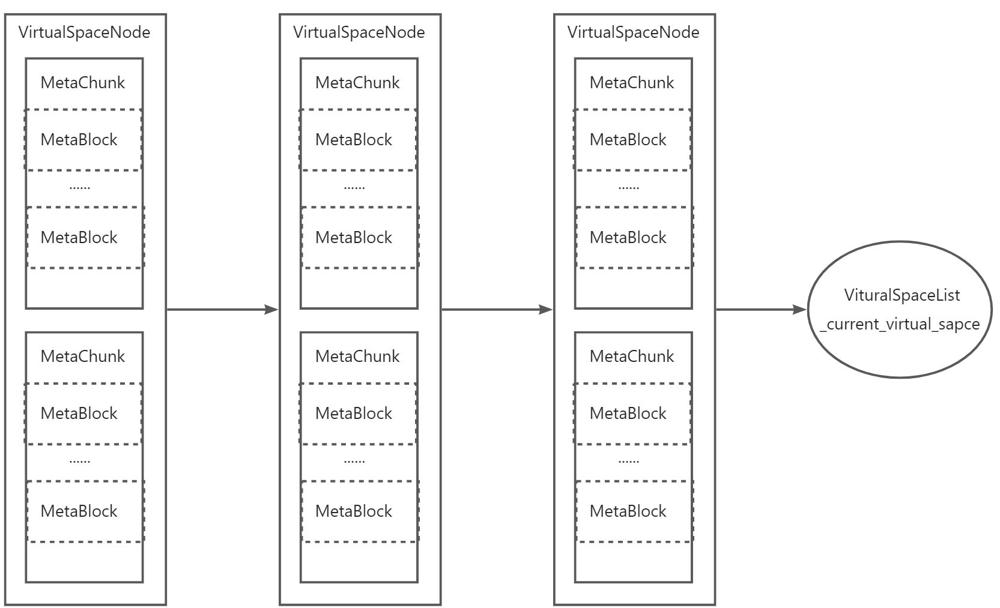

每个 VirtualSpaceNode 都对应一个表示一段连续内存空间的 ReservedSpace 和 VirtualSpace，VirtualSpaceNode 负责分配满足大小的 Metachunk。VirtualSpaceList 首先从当前使用的 VirtualSpaceNode即 \_current\_virtual\_space 中分配，当其空间不足时，VirtualSpaceList 会创建一个新的 VirtualSpaceNode，将旧的 VirtualSpaceNode 的剩余空间分配成若干个标准大小的 Metachunk，保证其空间不浪费，然后将其插入到VirtualSpaceList 的 \_virtual\_space\_list 链表中，将其作为新的 VirtualSpaceNode 的 next 节点，新的VirtualSpaceNode 变成 \_current\_virtual\_space，然后从新节点中分配 Metachunk。

创建 Klass 等需要从 Metaspace 中分配内存场景都是从 Metachunk 中分配，如果当前 Metachunk 内存空间不够了会申请一个新的 MetaChunk，从新的 MetaChunk 中分配。当需要释放 Klass 等元数据占用的内存时，这些元数据对应的内存块会作为 MetaBlock 放到 SpaceManager 中的 \_block\_freelists 链表中被重复利用。

类数据结构如下：

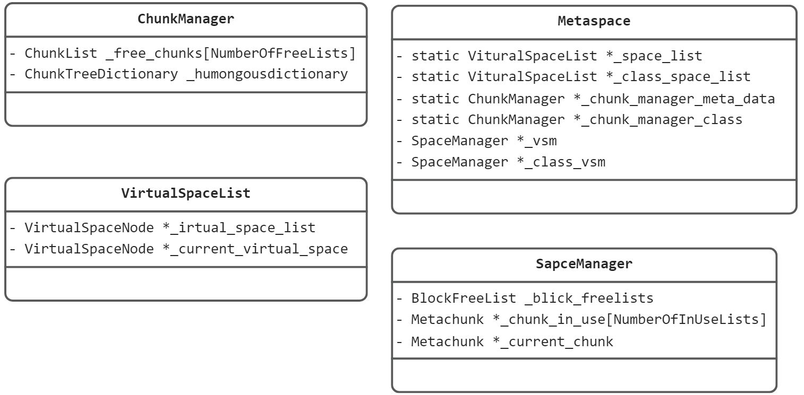

Metaspace 根据 MetadataType 分别建立了对应的静态的 VirtualSpaceList 和 ChunkManager，这两个是全局的负责管理所有 Metaspace 实例的 VirtualSpaceNode 分配和空闲的 Metachunk。每个 Metaspace 实例根据 MetadataType 分别有一个对应的 SpaceManager，SpaceManager 是内存分配和释放的总的入口，分配内存时首先从 \_block\_freelists 中分配，如果内存不足会尝试从 \_current\_chunk 中分配，如果分配失败会从尝试从对应类型的全局 ChunkManager 获取一个新的满足大小的 Chunk，如果获取失败再从对应类型的全局VirtualSpaceList 中获取一个新的 Metachunk。获取新的 Metachunk 后，将其加入到合适的 \_chunks\_in\_use 列表中，然后从新的 Metachunk 中分配内存。释放内存时则是将对应的内存块作为 MetaBlock 归还到 \_block\_freelists 中从而被重复利用。

### VirtualSpaceList

VirtualSpaceList 在`hotspot/src/share/vm/memory/metaspace.cpp`中，表示一个 VirtualSpaceNode 链表，负责创建和维护所有的 VirtualSpaceNode。属性如下：

```cpp
// List of VirtualSpaces for metadata allocation.
class VirtualSpaceList : public CHeapObj<mtClass> {
friend class VirtualSpaceNode;

enum VirtualSpaceSizes {
VirtualSpaceSize = 256 * K
};

// Head of the list
// 链表头节点
VirtualSpaceNode* _virtual_space_list;
// virtual space currently being used for allocations
// 链表当前节点
VirtualSpaceNode* _current_virtual_space;

// Is this VirtualSpaceList used for the compressed class space
// 是否开启压缩指针
bool _is_class;

// Sum of reserved and committed memory in the virtual spaces
size_t _reserved_words;
size_t _committed_words;
};
```

* 构造和析构函数

```cpp
VirtualSpaceList::VirtualSpaceList(size_t word_size) :
_is_class(false),
_virtual_space_list(NULL),
_current_virtual_space(NULL),
_reserved_words(0),
_committed_words(0),
_virtual_space_count(0) {
    // 获取锁 expand_lock
    MutexLockerEx cl(SpaceManager::expand_lock(),
    Mutex::_no_safepoint_check_flag);
    // 创建一个新的 virtual_space     
    create_new_virtual_space(word_size);
}

bool VirtualSpaceList::create_new_virtual_space(size_t vs_word_size) {
    assert_lock_strong(SpaceManager::expand_lock());
    //创建 compressed class 的 VirtualSpace 不会走到此分支
    if (is_class()) {
        assert(false, "We currently don't support more than one VirtualSpace for"
            " the compressed class space. The initialization of the"
            " CCS uses another code path and should not hit this path.");
        return false;
    }

    if (vs_word_size == 0) {
        assert(false, "vs_word_size should always be at least _reserve_alignment large.");
        return false;
    }

    size_t vs_byte_size = vs_word_size * BytesPerWord;
    // 内存取整
    assert_is_size_aligned(vs_byte_size, Metaspace::reserve_alignment());

    // 创建一个新的节点
    VirtualSpaceNode* new_entry = new VirtualSpaceNode(vs_byte_size);
    if (!new_entry->initialize()) {
        //初始化失败，返回false
        delete new_entry;
        return false;
    } else {
        // 初始化成功，校验结果
        assert(new_entry->reserved_words() == vs_word_size,
            "Reserved memory size differs from requested memory size");
        // 同步结果
        OrderAccess::storestore();
        link_vs(new_entry);
        return true;
    }
}

void VirtualSpaceList::link_vs(VirtualSpaceNode* new_entry) {
    // 插入到链表中
    if (virtual_space_list() == NULL) {
        set_virtual_space_list(new_entry);
    } else {
        current_virtual_space()->set_next(new_entry);
    }
    set_current_virtual_space(new_entry);
    // 增加计数
    inc_reserved_words(new_entry->reserved_words());
    inc_committed_words(new_entry->committed_words());
    inc_virtual_space_count();

    if (TraceMetavirtualspaceAllocation && Verbose) {
        // 打印日志
        VirtualSpaceNode* vsl = current_virtual_space();
        vsl->print_on(gclog_or_tty);
    }
}

void VirtualSpaceList::inc_reserved_words(size_t v) {
    assert_lock_strong(SpaceManager::expand_lock());
    _reserved_words = _reserved_words + v;
}

void VirtualSpaceList::inc_committed_words(size_t v) {
    assert_lock_strong(SpaceManager::expand_lock());
    _committed_words = _committed_words + v;

    assert_committed_below_limit();
}

#define assert_committed_below_limit()                             \
assert(MetaspaceAux::committed_bytes() <= MaxMetaspaceSize,      \
err_msg("Too much committed memory. Committed: " SIZE_FORMAT \
" limit (MaxMetaspaceSize): " SIZE_FORMAT,           \
MetaspaceAux::committed_bytes(), MaxMetaspaceSize));

void VirtualSpaceList::inc_virtual_space_count() {
    assert_lock_strong(SpaceManager::expand_lock());
    _virtual_space_count++;
}

VirtualSpaceList::VirtualSpaceList(ReservedSpace rs) :
_is_class(true),
_virtual_space_list(NULL),
_current_virtual_space(NULL),
_reserved_words(0),
_committed_words(0),
_virtual_space_count(0) {
    MutexLockerEx cl(SpaceManager::expand_lock(),
    Mutex::_no_safepoint_check_flag);                 
    VirtualSpaceNode* class_entry = new VirtualSpaceNode(rs);
    bool succeeded = class_entry->initialize();
    if (succeeded) {
        link_vs(class_entry);
    }
}


VirtualSpaceList::~VirtualSpaceList() {
    // 从链表头元素开始遍历，释放所有的 VirtualSpaceNode
    VirtualSpaceListIterator iter(virtual_space_list());
    while (iter.repeat()) {
        VirtualSpaceNode* vsl = iter.get_next();
        delete vsl;
    }
}
```

* `SpaceManager::get_new_chunk(size_t chunk_word_size)`用于获取一个新的满足大小要求的 Metachunk，是 VirtualSpaceList 的核心方法

```cpp
Metachunk* VirtualSpaceList::get_new_chunk(size_t chunk_word_size, size_t suggested_commit_granularity) {

    // 从当前的 VirtualSpaceNode 节点分配一个 Metachunk
    Metachunk* next = current_virtual_space()->get_chunk_vs(chunk_word_size);

    if (next != NULL) {
        // 分配成功则返回
        return next;
    }

    // 当前节点内存不足，需要扩展创建一个新的节点，扩展的量是根据要求分配的 chunk_word_size 
    // 内存大小计算的，而不是当前节点剩余的已提交内存
    // 对 chunk_word_size 做内存取整
    size_t min_word_size       = align_size_up(chunk_word_size,              Metaspace::commit_alignment_words());
    size_t preferred_word_size = align_size_up(suggested_commit_granularity, Metaspace::commit_alignment_words());
    if (min_word_size >= preferred_word_size) {
        // Can happen when humongous chunks are allocated.
        preferred_word_size = min_word_size;
    }
    // 按照 min_word_size 重新创建一个新的 VirtualSpaceNode
    bool expanded = expand_by(min_word_size, preferred_word_size);
    if (expanded) {
        // 如果创建成功，则使用新的节点创建一个 Metachunk
        next = current_virtual_space()->get_chunk_vs(chunk_word_size);
        assert(next != NULL, "The allocation was expected to succeed after the expansion");
    }

    return next;
}


bool VirtualSpaceList::expand_by(size_t min_words, size_t preferred_words) {
    // 校验参数
    assert_is_size_aligned(min_words,       Metaspace::commit_alignment_words());
    assert_is_size_aligned(preferred_words, Metaspace::commit_alignment_words());
    assert(min_words <= preferred_words, "Invalid arguments");

    // MetaspaceGC 根据当前已经提交的总内存量和 Metaspace 最大内存量判断能否扩展
    if (!MetaspaceGC::can_expand(min_words, this->is_class())) {
        return  false;
    }
    size_t allowed_expansion_words = MetaspaceGC::allowed_expansion();
    if (allowed_expansion_words < min_words) {
        return false;
    }

    // 因为 preferred_words 和 allowed_expansion_words 都是大于或者等于 min_words，
    // 所以取两者的最小值也能满足要求
    size_t max_expansion_words = MIN2(preferred_words, allowed_expansion_words);

    // 尝试当前节点扩展
    bool vs_expanded = expand_node_by(current_virtual_space(),
    min_words,
    max_expansion_words);
    // 扩展成功
    if (vs_expanded) {
        return true;
    }
    // 节点创建时申请的 reserved_size 的剩余空间不足导致扩展失败，回收当前节点
    retire_current_virtual_space();

    // 取两者间的最大值，并做内存取整
    size_t grow_vs_words = MAX2((size_t)VirtualSpaceSize, preferred_words);
    grow_vs_words = align_size_up(grow_vs_words, Metaspace::reserve_alignment_words());
    // 创建一个新的节点
    if (create_new_virtual_space(grow_vs_words)) {
        // pre_committed 即创建的时候已经完成 commited
        if (current_virtual_space()->is_pre_committed()) {
            // The memory was pre-committed, so we are done here.
            assert(min_words <= current_virtual_space()->committed_words(),
                "The new VirtualSpace was pre-committed, so it"
                "should be large enough to fit the alloc request.");
            return true;
        }
        //非 pre_committed，需要手动 commited
        return expand_node_by(current_virtual_space(),
            min_words,
            max_expansion_words);
    }

    return false;
}

bool VirtualSpaceList::expand_node_by(VirtualSpaceNode* node,
size_t min_words,
size_t preferred_words) {
    size_t before = node->committed_words();
    // 节点 expand 事前调用 VirtualSpace::expand_by 方法扩展，如果成功返回 true
    bool result = node->expand_by(min_words, preferred_words);

    size_t after = node->committed_words();

    // after and before can be the same if the memory was pre-committed.
    assert(after >= before, "Inconsistency");
    // 增加已提交的内存量
    inc_committed_words(after - before);

    return result;
}

void VirtualSpaceList::retire_current_virtual_space() {
    assert_lock_strong(SpaceManager::expand_lock());

    VirtualSpaceNode* vsn = current_virtual_space();

    ChunkManager* cm = is_class() ? Metaspace::chunk_manager_class() :
    Metaspace::chunk_manager_metadata();
    // 回收当前节点
    vsn->retire(cm);
}
```

`VirtualSpaceNode::purge(ChunkManager* chunk_manager)`方法用于清理掉VirtualSpaceList中空闲的即没有任何Metachunk的VirtualSpaceNode节点，当VirtualSpaceList关联的ClassLoaderData被垃圾回收器清理掉了就会触发此方法

```cpp
void VirtualSpaceList::purge(ChunkManager* chunk_manager) {
    // 校验是否在安全点
    assert(SafepointSynchronize::is_at_safepoint(), "must be called at safepoint for contains to work");
    // 校验获取锁
    assert_lock_strong(SpaceManager::expand_lock());

    VirtualSpaceNode* purged_vsl = NULL;
    // 链表头
    VirtualSpaceNode* prev_vsl = virtual_space_list();
    VirtualSpaceNode* next_vsl = prev_vsl;
    while (next_vsl != NULL) {
        VirtualSpaceNode* vsl = next_vsl;
        next_vsl = vsl->next();
        // 如果不包含任何 Metachunk 且不是当前节点，因为当前节点可能会被使用
        if (vsl->container_count() == 0 && vsl != current_virtual_space()) {
            // 从链表中移除
            if (prev_vsl == vsl) {
                // 如果是头节点，将头结点的下一个节点作为头结点
                // This is the case of the current node being the first node.
                assert(vsl == virtual_space_list(), "Expected to be the first node");
                set_virtual_space_list(vsl->next());
            } else {
                prev_vsl->set_next(vsl->next());
            }
            // 回收该节点
            vsl->purge(chunk_manager);
            // 减少计数器
            dec_reserved_words(vsl->reserved_words());
            dec_committed_words(vsl->committed_words());
            dec_virtual_space_count();
            purged_vsl = vsl;
            // 释放节点
            delete vsl;
        } else {
            prev_vsl = vsl;
        }
    }
}
```

### ChunkManager

ChunkManager 用来管理全局的所有空闲 Metachunk，与之类似的 BlockFreelist 用来管理所有的空闲 Metablock。其定位在`hotspot/src/share/vm/memory/metaspace.cpp`

```cpp
typedef class FreeList<Metachunk> ChunkList;
// Manages the global free lists of chunks.
class ChunkManager : public CHeapObj<mtInternal> {
friend class TestVirtualSpaceNodeTest;

// Free list of chunks of different sizes.
//   SpecializedChunk
//   SmallChunk
//   MediumChunk
//   HumongousChunk
// 用于保存各种大小的 Metachunk 数组 NumberOfFreeLists 为 3
ChunkList _free_chunks[NumberOfFreeLists];

//   HumongousChunk
// 用于支持查找和排序的二叉树模板
ChunkTreeDictionary _humongous_dictionary;

// ChunkManager in all lists of this type
size_t _free_chunks_total;
size_t _free_chunks_count;

void dec_free_chunks_total(size_t v) {
    assert(_free_chunks_count > 0 &&
        _free_chunks_total > 0,
        "About to go negative");
    Atomic::add_ptr(-1, &_free_chunks_count);
    jlong minus_v = (jlong) - (jlong) v;
    Atomic::add_ptr(minus_v, &_free_chunks_total);
}

// Debug support

size_t sum_free_chunks();
size_t sum_free_chunks_count();

void locked_verify_free_chunks_total();
void slow_locked_verify_free_chunks_total() {
    if (metaspace_slow_verify) {
        locked_verify_free_chunks_total();
    }
}
void locked_verify_free_chunks_count();
void slow_locked_verify_free_chunks_count() {
    if (metaspace_slow_verify) {
        locked_verify_free_chunks_count();
    }
}
void verify_free_chunks_count();

public:

ChunkManager(size_t specialized_size, size_t small_size, size_t medium_size)
: _free_chunks_total(0), _free_chunks_count(0) {
    _free_chunks[SpecializedIndex].set_size(specialized_size);
    _free_chunks[SmallIndex].set_size(small_size);
    _free_chunks[MediumIndex].set_size(medium_size);
}

// add or delete (return) a chunk to the global freelist.
Metachunk* chunk_freelist_allocate(size_t word_size);

// Map a size to a list index assuming that there are lists
// for special, small, medium, and humongous chunks.
ChunkIndex list_index(size_t size);

// Remove the chunk from its freelist.  It is
// expected to be on one of the _free_chunks[] lists.
void remove_chunk(Metachunk* chunk);

// Add the simple linked list of chunks to the freelist of chunks
// of type index.
void return_chunks(ChunkIndex index, Metachunk* chunks);

// Total of the space in the free chunks list
size_t free_chunks_total_words();
size_t free_chunks_total_bytes();

// Number of chunks in the free chunks list
size_t free_chunks_count();

void inc_free_chunks_total(size_t v, size_t count = 1) {
    Atomic::add_ptr(count, &_free_chunks_count);
    Atomic::add_ptr(v, &_free_chunks_total);
}
ChunkTreeDictionary* humongous_dictionary() {
    return &_humongous_dictionary;
}

ChunkList* free_chunks(ChunkIndex index);

// Returns the list for the given chunk word size.
ChunkList* find_free_chunks_list(size_t word_size);

// Remove from a list by size.  Selects list based on size of chunk.
Metachunk* free_chunks_get(size_t chunk_word_size);

#define index_bounds_check(index)                                         \
assert(index == SpecializedIndex ||                                     \
index == SmallIndex ||                                           \
index == MediumIndex ||                                          \
index == HumongousIndex, err_msg("Bad index: %d", (int) index))

size_t num_free_chunks(ChunkIndex index) const {
    index_bounds_check(index);

    if (index == HumongousIndex) {
        return _humongous_dictionary.total_free_blocks();
    }

    ssize_t count = _free_chunks[index].count();
    return count == -1 ? 0 : (size_t) count;
}

size_t size_free_chunks_in_bytes(ChunkIndex index) const {
    index_bounds_check(index);

    size_t word_size = 0;
    if (index == HumongousIndex) {
        word_size = _humongous_dictionary.total_size();
    } else {
        const size_t size_per_chunk_in_words = _free_chunks[index].size();
        word_size = size_per_chunk_in_words * num_free_chunks(index);
    }

    return word_size * BytesPerWord;
}

MetaspaceChunkFreeListSummary chunk_free_list_summary() const {
    return MetaspaceChunkFreeListSummary(num_free_chunks(SpecializedIndex),
        num_free_chunks(SmallIndex),
        num_free_chunks(MediumIndex),
        num_free_chunks(HumongousIndex),
        size_free_chunks_in_bytes(SpecializedIndex),
        size_free_chunks_in_bytes(SmallIndex),
        size_free_chunks_in_bytes(MediumIndex),
        size_free_chunks_in_bytes(HumongousIndex));
}

// Debug support
void verify();
void slow_verify() {
    if (metaspace_slow_verify) {
        verify();
    }
}
void locked_verify();
void slow_locked_verify() {
    if (metaspace_slow_verify) {
        locked_verify();
    }
}
void verify_free_chunks_total();

void locked_print_free_chunks(outputStream* st);
void locked_print_sum_free_chunks(outputStream* st);

void print_on(outputStream* st) const;
};
```

### SpaceManager

SpaceManager 定义位于`hotspot/src/share/vm/memory/metaspace.cpp`中，用于给 Metaspace 提供内存管理接口，源码如下：

```cpp
//  SpaceManager - used by Metaspace to handle allocations
class SpaceManager : public CHeapObj<mtClass> {
friend class Metaspace;
friend class Metadebug;

private:

// protects allocations
// 内存分配锁
Mutex* const _lock;

// Type of metadata allocated.
// 元空间类型
Metaspace::MetadataType _mdtype;

// List of chunks in use by this SpaceManager.  Allocations
// are done from the current chunk.  The list is used for deallocating
// chunks when the SpaceManager is freed.
// SpaceManager 使用 Metachunk 的数组，总共有 4 个元素，即 3 种标准规格，
// 加上一个特殊规格的 chunk，每个 chunk 通过 next 属性构成一个链表，链表中的 chunk
// 如果不是当前 chunk 都会被 retire，即把剩余空间分配成 MetaBlock 放入 BlockFreelist 中
Metachunk* _chunks_in_use[NumberOfInUseLists];
// SpaceManager 当前使用的 Metachunk
Metachunk* _current_chunk;

// Number of small chunks to allocate to a manager
// If class space manager, small chunks are unlimited
// SpaceManager 所能分配的 small chunks 的数量上限，ClassType 类型的 Metaspace 没有此限制
static uint const _small_chunk_limit;

// Sum of all space in allocated chunks
// 已分配的所有 block 的内存大小
size_t _allocated_blocks_words;

// Sum of all allocated chunks
// 已分配的 chunk 的内存大小
size_t _allocated_chunks_words;
// 已分配 chunk 的个数
size_t _allocated_chunks_count;

// Free lists of blocks are per SpaceManager since they
// are assumed to be in chunks in use by the SpaceManager
// and all chunks in use by a SpaceManager are freed when
// the class loader using the SpaceManager is collected.
// 负责管理空闲 block 的 BlockFreelist
BlockFreelist _block_freelists;

// protects virtualspace and chunk expansions
// _expand_lock 的 name 属性
static const char*  _expand_lock_name;
// _expand_lock 的 rank 属性
static const int    _expand_lock_rank;
static Mutex* const _expand_lock;

private:
// Accessors
Metachunk* chunks_in_use(ChunkIndex index) const { return _chunks_in_use[index]; }
void set_chunks_in_use(ChunkIndex index, Metachunk* v) {
    _chunks_in_use[index] = v;
}

BlockFreelist* block_freelists() const {
    return (BlockFreelist*) &_block_freelists;
}

Metaspace::MetadataType mdtype() { return _mdtype; }

VirtualSpaceList* vs_list()   const { return Metaspace::get_space_list(_mdtype); }
ChunkManager* chunk_manager() const { return Metaspace::get_chunk_manager(_mdtype); }

Metachunk* current_chunk() const { return _current_chunk; }
void set_current_chunk(Metachunk* v) {
    _current_chunk = v;
}

Metachunk* find_current_chunk(size_t word_size);

// Add chunk to the list of chunks in use
void add_chunk(Metachunk* v, bool make_current);
void retire_current_chunk();

Mutex* lock() const { return _lock; }

const char* chunk_size_name(ChunkIndex index) const;

protected:
void initialize();

public:
SpaceManager(Metaspace::MetadataType mdtype,
Mutex* lock);
~SpaceManager();

enum ChunkMultiples {
MediumChunkMultiple = 4
};

static size_t specialized_chunk_size(bool is_class) { return is_class ? ClassSpecializedChunk : SpecializedChunk; }
static size_t small_chunk_size(bool is_class)       { return is_class ? ClassSmallChunk : SmallChunk; }
static size_t medium_chunk_size(bool is_class)      { return is_class ? ClassMediumChunk : MediumChunk; }

static size_t smallest_chunk_size(bool is_class)    { return specialized_chunk_size(is_class); }

// Accessors
bool is_class() const { return _mdtype == Metaspace::ClassType; }

size_t specialized_chunk_size() const { return specialized_chunk_size(is_class()); }
size_t small_chunk_size()       const { return small_chunk_size(is_class()); }
size_t medium_chunk_size()      const { return medium_chunk_size(is_class()); }

size_t smallest_chunk_size()    const { return smallest_chunk_size(is_class()); }

size_t medium_chunk_bunch()     const { return medium_chunk_size() * MediumChunkMultiple; }

size_t allocated_blocks_words() const { return _allocated_blocks_words; }
size_t allocated_blocks_bytes() const { return _allocated_blocks_words * BytesPerWord; }
size_t allocated_chunks_words() const { return _allocated_chunks_words; }
size_t allocated_chunks_bytes() const { return _allocated_chunks_words * BytesPerWord; }
size_t allocated_chunks_count() const { return _allocated_chunks_count; }

bool is_humongous(size_t word_size) { return word_size > medium_chunk_size(); }

static Mutex* expand_lock() { return _expand_lock; }

// Increment the per Metaspace and global running sums for Metachunks
// by the given size.  This is used when a Metachunk to added to
// the in-use list.
void inc_size_metrics(size_t words);
// Increment the per Metaspace and global running sums Metablocks by the given
// size.  This is used when a Metablock is allocated.
void inc_used_metrics(size_t words);
// Delete the portion of the running sums for this SpaceManager. That is,
// the globals running sums for the Metachunks and Metablocks are
// decremented for all the Metachunks in-use by this SpaceManager.
void dec_total_from_size_metrics();

// Adjust the initial chunk size to match one of the fixed chunk list sizes,
// or return the unadjusted size if the requested size is humongous.
static size_t adjust_initial_chunk_size(size_t requested, bool is_class_space);
size_t adjust_initial_chunk_size(size_t requested) const;

// Get the initial chunks size for this metaspace type.
size_t get_initial_chunk_size(Metaspace::MetaspaceType type) const;

size_t sum_capacity_in_chunks_in_use() const;
size_t sum_used_in_chunks_in_use() const;
size_t sum_free_in_chunks_in_use() const;
size_t sum_waste_in_chunks_in_use() const;
size_t sum_waste_in_chunks_in_use(ChunkIndex index ) const;

size_t sum_count_in_chunks_in_use();
size_t sum_count_in_chunks_in_use(ChunkIndex i);

Metachunk* get_new_chunk(size_t chunk_word_size);

// Block allocation and deallocation.
// Allocates a block from the current chunk
MetaWord* allocate(size_t word_size);

// Helper for allocations
MetaWord* allocate_work(size_t word_size);

// Returns a block to the per manager freelist
void deallocate(MetaWord* p, size_t word_size);

// Based on the allocation size and a minimum chunk size,
// returned chunk size (for expanding space for chunk allocation).
size_t calc_chunk_size(size_t allocation_word_size);

// Called when an allocation from the current chunk fails.
// Gets a new chunk (may require getting a new virtual space),
// and allocates from that chunk.
MetaWord* grow_and_allocate(size_t word_size);

// Notify memory usage to MemoryService.
void track_metaspace_memory_usage();

// debugging support.

void dump(outputStream* const out) const;
void print_on(outputStream* st) const;
void locked_print_chunks_in_use_on(outputStream* st) const;

void verify();
void verify_chunk_size(Metachunk* chunk);
NOT_PRODUCT(void mangle_freed_chunks();)
#ifdef ASSERT
void verify_allocated_blocks_words();
#endif

size_t get_raw_word_size(size_t word_size) {
    size_t byte_size = word_size * BytesPerWord;

    size_t raw_bytes_size = MAX2(byte_size, sizeof(Metablock));
    raw_bytes_size = align_size_up(raw_bytes_size, Metachunk::object_alignment());

    size_t raw_word_size = raw_bytes_size / BytesPerWord;
    assert(raw_word_size * BytesPerWord == raw_bytes_size, "Size problem");

    return raw_word_size;
}
};
```

### MetaspaceGC

MetaspaceGC 并不是像类名一样用来对 Metaspace 执行 GC 的，仅仅用来维护属性 \_capacity\_until\_GC，当Metaspace 的已分配内存值达到该属性就会触发 GC，GC 结束后 \_capacity\_until\_GC 的值会增加直到达到参数MaxMetaspaceSize 设置的 Metaspace 的最大值。MetaspaceGC 的定义在`hotspot/src/share/vm/memory/metaspace.hpp`中：

```cpp
// Metaspace are deallocated when their class loader are GC'ed.
// This class implements a policy for inducing GC's to recover
// Metaspaces.

class MetaspaceGC : AllStatic {

// The current high-water-mark for inducing a GC.
// When committed memory of all metaspaces reaches this value,
// a GC is induced and the value is increased. Size is in bytes.
// GC 触发阈值
static volatile intptr_t _capacity_until_GC;

// For a CMS collection, signal that a concurrent collection should
// be started.
// CMS 垃圾收集器标识（G1）
static bool _should_concurrent_collect;

static uint _shrink_factor;

static size_t shrink_factor() { return _shrink_factor; }
void set_shrink_factor(uint v) { _shrink_factor = v; }

public:

// 以下两个方法均用于设置 GC 阈值
static void initialize();
static void post_initialize();

static size_t capacity_until_GC();
static bool inc_capacity_until_GC(size_t v,
size_t* new_cap_until_GC = NULL,
size_t* old_cap_until_GC = NULL,
bool* can_retry = NULL);
static size_t dec_capacity_until_GC(size_t v);

static bool should_concurrent_collect() { return _should_concurrent_collect; }
static void set_should_concurrent_collect(bool v) {
    _should_concurrent_collect = v;
}

// The amount to increase the high-water-mark (_capacity_until_GC)
static size_t delta_capacity_until_GC(size_t bytes);

// Tells if we have can expand metaspace without hitting set limits.
static bool can_expand(size_t words, bool is_class);

// Returns amount that we can expand without hitting a GC,
// measured in words.
static size_t allowed_expansion();

// Calculate the new high-water mark at which to induce
// a GC.
static void compute_new_size();
};
```

### MetaspaceAux

MetaspaceAux 同样定义在`hotspot/src/share/vm/memory/metaspace.hpp`中，它定义的属性和方法都是静态的，主要用于外部类获取 Metaspace 的内存使用情况，如获取 Metaspace 的当前最大容量的 capacity\_bytes 方法，获取已使用空间大小的 used\_bytes 方法，获取空闲的空间大小的 free\_bytes 方法，获取已经分配内存的量的 committed\_bytes 方法，获取保留的未分配内存的量的 reserved\_bytes 方法

```cpp
class MetaspaceAux : AllStatic {
static size_t free_chunks_total_words(Metaspace::MetadataType mdtype);

// These methods iterate over the classloader data graph
// for the given Metaspace type.  These are slow.
static size_t used_bytes_slow(Metaspace::MetadataType mdtype);
static size_t free_bytes_slow(Metaspace::MetadataType mdtype);
static size_t capacity_bytes_slow(Metaspace::MetadataType mdtype);
static size_t capacity_bytes_slow();

// Running sum of space in all Metachunks that has been
// allocated to a Metaspace.  This is used instead of
// iterating over all the classloaders. One for each
// type of Metadata
static size_t _capacity_words[Metaspace:: MetadataTypeCount];
// Running sum of space in all Metachunks that
// are being used for metadata. One for each
// type of Metadata.
static size_t _used_words[Metaspace:: MetadataTypeCount];

public:
// Decrement and increment _allocated_capacity_words
static void dec_capacity(Metaspace::MetadataType type, size_t words);
static void inc_capacity(Metaspace::MetadataType type, size_t words);

// Decrement and increment _allocated_used_words
static void dec_used(Metaspace::MetadataType type, size_t words);
static void inc_used(Metaspace::MetadataType type, size_t words);

// Total of space allocated to metadata in all Metaspaces.
// This sums the space used in each Metachunk by
// iterating over the classloader data graph
static size_t used_bytes_slow() {
    return used_bytes_slow(Metaspace::ClassType) +
        used_bytes_slow(Metaspace::NonClassType);
}

// Used by MetaspaceCounters
static size_t free_chunks_total_words();
static size_t free_chunks_total_bytes();
static size_t free_chunks_total_bytes(Metaspace::MetadataType mdtype);

static size_t capacity_words(Metaspace::MetadataType mdtype) {
    return _capacity_words[mdtype];
}
static size_t capacity_words() {
    return capacity_words(Metaspace::NonClassType) +
        capacity_words(Metaspace::ClassType);
}
static size_t capacity_bytes(Metaspace::MetadataType mdtype) {
    return capacity_words(mdtype) * BytesPerWord;
}
static size_t capacity_bytes() {
    return capacity_words() * BytesPerWord;
}

static size_t used_words(Metaspace::MetadataType mdtype) {
    return _used_words[mdtype];
}
static size_t used_words() {
    return used_words(Metaspace::NonClassType) +
        used_words(Metaspace::ClassType);
}
static size_t used_bytes(Metaspace::MetadataType mdtype) {
    return used_words(mdtype) * BytesPerWord;
}
static size_t used_bytes() {
    return used_words() * BytesPerWord;
}

static size_t free_bytes();
static size_t free_bytes(Metaspace::MetadataType mdtype);

static size_t reserved_bytes(Metaspace::MetadataType mdtype);
static size_t reserved_bytes() {
    return reserved_bytes(Metaspace::ClassType) +
        reserved_bytes(Metaspace::NonClassType);
}

static size_t committed_bytes(Metaspace::MetadataType mdtype);
static size_t committed_bytes() {
    return committed_bytes(Metaspace::ClassType) +
        committed_bytes(Metaspace::NonClassType);
}

static size_t min_chunk_size_words();
static size_t min_chunk_size_bytes() {
    return min_chunk_size_words() * BytesPerWord;
}

static bool has_chunk_free_list(Metaspace::MetadataType mdtype);
static MetaspaceChunkFreeListSummary chunk_free_list_summary(Metaspace::MetadataType mdtype);

// Print change in used metadata.
static void print_metaspace_change(size_t prev_metadata_used);
static void print_on(outputStream * out);
static void print_on(outputStream * out, Metaspace::MetadataType mdtype);

static void print_class_waste(outputStream* out);
static void print_waste(outputStream* out);
static void dump(outputStream* out);
static void verify_free_chunks();
// Checks that the values returned by allocated_capacity_bytes() and
// capacity_bytes_slow() are the same.
static void verify_capacity();
static void verify_used();
static void verify_metrics();
};
```

### Metachunk/Metablock

* Metachunk 表示从一段连续的内存空间 Virtualspace 中分配的一小块内存，当 Metachunk 不再使用时会被添加到空闲链表中，从而被重新使用而不是释放其占用的内存。Metachunk 和 SpaceManager 的关联关系不是固定的，即当 Metachunk 被重新使用时可能分配给一个新的 SpaceManager。 
* Metablock 是从 Metachunk 中分配内存的单位，即从 Metachunk 中分配出去的内存块都是以 Metablock的形式存在，Metablock 可以被负责管理它的 SpaceManager 重复利用，并且与 Metachunk 不同的是，Metablock 与 SpaceManager 的关联关系不会改变。

两者均定义在`hotspot/src/share/vm/memory/metachunk.hpp`中，其中的 Metabase 定义了两者添加到链表和字典的公共方法

```cpp
//  Metachunk - Quantum of allocation from a Virtualspace
//    Metachunks are reused (when freed are put on a global freelist) and
//    have no permanent association to a SpaceManager.

//            +--------------+ <- end    --+       --+
//            |              |             |         |
//            |              |             | free    |
//            |              |             |         |
//            |              |             |         | size | capacity
//            |              |             |         |
//            |              | <- top   -- +         |
//            |              |             |         |
//            |              |             | used    |
//            |              |             |         |
//            |              |             |         |
//            +--------------+ <- bottom --+       --+

class Metachunk : public Metabase<Metachunk> {
friend class TestMetachunk;
// The VirtualSpaceNode containing this chunk.
// 表示包含这个 Metachunk 的 VirtualSpaceNode，即从哪个 VirtualSpaceNode 中分配的
VirtualSpaceNode* _container;

// Current allocation top.
// 表示未分配内存区域的起始地址，注意这里是以字段为单位，而不是字节
MetaWord* _top;

DEBUG_ONLY(bool _is_tagged_free;)

MetaWord* initial_top() const { return (MetaWord*)this + overhead(); }
MetaWord* top() const         { return _top; }

public:
// Metachunks are allocated out of a MetadataVirtualSpace and
// and use some of its space to describe itself (plus alignment
// considerations).  Metadata is allocated in the rest of the chunk.
// This size is the overhead of maintaining the Metachunk within
// the space.

// Alignment of each allocation in the chunks.
static size_t object_alignment();

// Size of the Metachunk header, including alignment.
static size_t overhead();

Metachunk(size_t word_size , VirtualSpaceNode* container);

MetaWord* allocate(size_t word_size);

VirtualSpaceNode* container() const { return _container; }

MetaWord* bottom() const { return (MetaWord*) this; }

// Reset top to bottom so chunk can be reused.
void reset_empty() { _top = initial_top(); clear_next(); clear_prev(); }
bool is_empty() { return _top == initial_top(); }

// used (has been allocated)
// free (available for future allocations)
size_t word_size() const { return size(); }
size_t used_word_size() const;
size_t free_word_size() const;

#ifdef ASSERT
bool is_tagged_free() { return _is_tagged_free; }
void set_is_tagged_free(bool v) { _is_tagged_free = v; }
#endif

bool contains(const void* ptr) { return bottom() <= ptr && ptr < _top; }

NOT_PRODUCT(void mangle();)

void print_on(outputStream* st) const;
void verify();
};

// Metablock is the unit of allocation from a Chunk.
//
// A Metablock may be reused by its SpaceManager but are never moved between
// SpaceManagers.  There is no explicit link to the Metachunk
// from which it was allocated.  Metablock may be deallocated and
// put on a freelist but the space is never freed, rather
// the Metachunk it is a part of will be deallocated when it's
// associated class loader is collected.

class Metablock : public Metabase<Metablock> {
friend class VMStructs;
public:
Metablock(size_t word_size) : Metabase<Metablock>(word_size) {}
};
```

### BlockFreelist

BlockFreelist 用来管理空闲的 Metablock，其定义在同目录下的`hotspot/src/share/vm/memory/metaspace.cpp`中。所有空闲的 Metablock 都被添加到支持按照空闲空间大小排序和查找的二叉树 BlockTreeDictionary 中，BlockTreeDictionary 实际是模板类 BinaryTreeDictionary 的别名

```cpp
// Used to manage the free list of Metablocks (a block corresponds
// to the allocation of a quantum of metadata).
class BlockFreelist VALUE_OBJ_CLASS_SPEC {
  BlockTreeDictionary* _dictionary;

  // Only allocate and split from freelist if the size of the allocation
  // is at least 1/4th the size of the available block.
  const static int WasteMultiplier = 4;

  // Accessors
  BlockTreeDictionary* dictionary() const { return _dictionary; }

 public:
  BlockFreelist();
  ~BlockFreelist();

  // Get and return a block to the free list
  MetaWord* get_block(size_t word_size);
  void return_block(MetaWord* p, size_t word_size);

  size_t total_size() {
  if (dictionary() == NULL) {
    return 0;
  } else {
    return dictionary()->total_size();
  }
}

  void print_on(outputStream* st) const;
};
```

### VirtualSpaceNode

VirtualSpaceNode 是 VirtualSpaceList 的一个节点，用来表示一大段连续的内存空间，一个 VirtualSpaceNode 对应一个单独的 ReservedSpace 和 VirtualSpace，其定义在`hotspot/src/share/vm/memory/metaspace.cpp`VirtualSpaceNode 定义的方法大部分是获取这段连续内存空闲的属性的相关方法，如bottom，end，reserved\_words 等，实际是对 VirtualSpace 方法的包装

```cpp
// A VirtualSpaceList node.
class VirtualSpaceNode : public CHeapObj<mtClass> {
friend class VirtualSpaceList;

// Link to next VirtualSpaceNode
VirtualSpaceNode* _next;

// total in the VirtualSpace
// 保留的未向操作系统申请内存的一块区域
MemRegion _reserved;
ReservedSpace _rs;
VirtualSpace _virtual_space;
// 未分配内存的起始地址
MetaWord* _top;
// count of chunks contained in this VirtualSpace
// 非空闲 Metatrunk 个数
uintx _container_count;

// Convenience functions to access the _virtual_space
char* low()  const { return virtual_space()->low(); }
char* high() const { return virtual_space()->high(); }

// The first Metachunk will be allocated at the bottom of the
// VirtualSpace
Metachunk* first_chunk() { return (Metachunk*) bottom(); }

// Committed but unused space in the virtual space
size_t free_words_in_vs() const;
public:

VirtualSpaceNode(size_t byte_size);
VirtualSpaceNode(ReservedSpace rs) : _top(NULL), _next(NULL), _rs(rs), _container_count(0) {}
~VirtualSpaceNode();

// Convenience functions for logical bottom and end
MetaWord* bottom() const { return (MetaWord*) _virtual_space.low(); }
MetaWord* end() const { return (MetaWord*) _virtual_space.high(); }

bool contains(const void* ptr) { return ptr >= low() && ptr < high(); }

size_t reserved_words() const  { return _virtual_space.reserved_size() / BytesPerWord; }
size_t committed_words() const { return _virtual_space.actual_committed_size() / BytesPerWord; }

bool is_pre_committed() const { return _virtual_space.special(); }

// address of next available space in _virtual_space;
// Accessors
VirtualSpaceNode* next() { return _next; }
void set_next(VirtualSpaceNode* v) { _next = v; }

void set_reserved(MemRegion const v) { _reserved = v; }
void set_top(MetaWord* v) { _top = v; }

// Accessors
MemRegion* reserved() { return &_reserved; }
VirtualSpace* virtual_space() const { return (VirtualSpace*) &_virtual_space; }

// Returns true if "word_size" is available in the VirtualSpace
bool is_available(size_t word_size) { return word_size <= pointer_delta(end(), _top, sizeof(MetaWord)); }

MetaWord* top() const { return _top; }
void inc_top(size_t word_size) { _top += word_size; }

uintx container_count() { return _container_count; }
void inc_container_count();
void dec_container_count();
#ifdef ASSERT
uint container_count_slow();
void verify_container_count();
#endif

// used and capacity in this single entry in the list
size_t used_words_in_vs() const;
size_t capacity_words_in_vs() const;

bool initialize();

// get space from the virtual space
Metachunk* take_from_committed(size_t chunk_word_size);

// Allocate a chunk from the virtual space and return it.
Metachunk* get_chunk_vs(size_t chunk_word_size);

// Expands/shrinks the committed space in a virtual space.  Delegates
// to Virtualspace
bool expand_by(size_t min_words, size_t preferred_words);

// In preparation for deleting this node, remove all the chunks
// in the node from any freelist.
void purge(ChunkManager* chunk_manager);

// If an allocation doesn't fit in the current node a new node is created.
// Allocate chunks out of the remaining committed space in this node
// to avoid wasting that memory.
// This always adds up because all the chunk sizes are multiples of
// the smallest chunk size.
void retire(ChunkManager* chunk_manager);

#ifdef ASSERT
// Debug support
void mangle();
#endif

void print_on(outputStream* st) const;
};
```

## 堆空间

JVM 中堆空间的分布与对应使用的垃圾回收密切相关

### Serial/Serial Old

CollectedHeap 是内存堆管理器的抽象基类，如果是分代管理堆，那么每个代都是一个 Generation 实例。在代中还会划分不同的区间，比如对于采用复制算法回收年轻代的 Serial 收集器来说，年轻代划分为 Eden 空间、From Survivor 空间和 To Survivor 空间，每个空间都可以用 Space 实例来表示。

CollectedHeap 是一个抽象基类，表示一个 Java 堆，定义了各种垃圾收集器必须实现的公共接口，这些接口就是上层用来创建 Java 对象、分配 TLAB、获取 Java 堆使用情况的统一 API。GenCollectedHeap 是一种基于内存分代管理的内存堆管理器。它不仅负责 Java 对象的内存分配，而且负责垃圾对象的回收，也是 Serial 收集器使用的内存堆管理器。源码在`hotspot/src/share/vm/gc_interface/collectedHeap.hpp`中定义：

```cpp
//
// CollectedHeap
//   SharedHeap
//     GenCollectedHeap
//     G1CollectedHeap
//   ParallelScavengeHeap
//
class CollectedHeap : public CHeapObj<mtInternal> {
friend class VMStructs;
friend class IsGCActiveMark; // Block structured external access to _is_gc_active

#ifdef ASSERT
static int       _fire_out_of_memory_count;
#endif

// Used for filler objects (static, but initialized in ctor).
static size_t _filler_array_max_size;

GCHeapLog* _gc_heap_log;

// Used in support of ReduceInitialCardMarks; only consulted if COMPILER2 is being used
bool _defer_initial_card_mark;

protected:
// 当前堆分配的内存区域
MemRegion _reserved;
// 用于标记脏卡
BarrierSet* _barrier_set;
bool _is_gc_active;
uint _n_par_threads;

unsigned int _total_collections;          // ... started
unsigned int _total_full_collections;     // ... started
NOT_PRODUCT(volatile size_t _promotion_failure_alot_count;)
NOT_PRODUCT(volatile size_t _promotion_failure_alot_gc_number;)

// Reason for current garbage collection.  Should be set to
// a value reflecting no collection between collections.
GCCause::Cause _gc_cause;
GCCause::Cause _gc_lastcause;
PerfStringVariable* _perf_gc_cause;
PerfStringVariable* _perf_gc_lastcause;

// Constructor
CollectedHeap();

// Do common initializations that must follow instance construction,
// for example, those needing virtual calls.
// This code could perhaps be moved into initialize() but would
// be slightly more awkward because we want the latter to be a
// pure virtual.
void pre_initialize();

// Create a new tlab. All TLAB allocations must go through this.
virtual HeapWord* allocate_new_tlab(size_t size);

// Accumulate statistics on all tlabs.
virtual void accumulate_statistics_all_tlabs();

// Reinitialize tlabs before resuming mutators.
virtual void resize_all_tlabs();

// Allocate from the current thread's TLAB, with broken-out slow path.
inline static HeapWord* allocate_from_tlab(KlassHandle klass, Thread* thread, size_t size);
static HeapWord* allocate_from_tlab_slow(KlassHandle klass, Thread* thread, size_t size);

// Allocate an uninitialized block of the given size, or returns NULL if
// this is impossible.
inline static HeapWord* common_mem_allocate_noinit(KlassHandle klass, size_t size, TRAPS);

// Like allocate_init, but the block returned by a successful allocation
// is guaranteed initialized to zeros.
inline static HeapWord* common_mem_allocate_init(KlassHandle klass, size_t size, TRAPS);

// Helper functions for (VM) allocation.
inline static void post_allocation_setup_common(KlassHandle klass, HeapWord* obj);
inline static void post_allocation_setup_no_klass_install(KlassHandle klass,
HeapWord* objPtr);

inline static void post_allocation_setup_obj(KlassHandle klass, HeapWord* obj, int size);

inline static void post_allocation_setup_array(KlassHandle klass,
HeapWord* obj, int length);

// Clears an allocated object.
inline static void init_obj(HeapWord* obj, size_t size);

// Filler object utilities.
static inline size_t filler_array_hdr_size();
static inline size_t filler_array_min_size();

DEBUG_ONLY(static void fill_args_check(HeapWord* start, size_t words);)
DEBUG_ONLY(static void zap_filler_array(HeapWord* start, size_t words, bool zap = true);)

// Fill with a single array; caller must ensure filler_array_min_size() <=
// words <= filler_array_max_size().
static inline void fill_with_array(HeapWord* start, size_t words, bool zap = true);

// Fill with a single object (either an int array or a java.lang.Object).
static inline void fill_with_object_impl(HeapWord* start, size_t words, bool zap = true);

virtual void trace_heap(GCWhen::Type when, GCTracer* tracer);

// Verification functions
virtual void check_for_bad_heap_word_value(HeapWord* addr, size_t size)
PRODUCT_RETURN;
virtual void check_for_non_bad_heap_word_value(HeapWord* addr, size_t size)
PRODUCT_RETURN;
debug_only(static void check_for_valid_allocation_state();)

public:
enum Name {
Abstract,
SharedHeap,
GenCollectedHeap,
ParallelScavengeHeap,
G1CollectedHeap
};

static inline size_t filler_array_max_size() {
    return _filler_array_max_size;
}

virtual CollectedHeap::Name kind() const { return CollectedHeap::Abstract; }

/**
   * Returns JNI error code JNI_ENOMEM if memory could not be allocated,
   * and JNI_OK on success.
   */
virtual jint initialize() = 0;

// In many heaps, there will be a need to perform some initialization activities
// after the Universe is fully formed, but before general heap allocation is allowed.
// This is the correct place to place such initialization methods.
virtual void post_initialize() = 0;

// Stop any onging concurrent work and prepare for exit.
virtual void stop() {}

MemRegion reserved_region() const { return _reserved; }
address base() const { return (address)reserved_region().start(); }

virtual size_t capacity() const = 0;
virtual size_t used() const = 0;

// Return "true" if the part of the heap that allocates Java
// objects has reached the maximal committed limit that it can
// reach, without a garbage collection.
virtual bool is_maximal_no_gc() const = 0;

// Support for java.lang.Runtime.maxMemory():  return the maximum amount of
// memory that the vm could make available for storing 'normal' java objects.
// This is based on the reserved address space, but should not include space
// that the vm uses internally for bookkeeping or temporary storage
// (e.g., in the case of the young gen, one of the survivor
// spaces).
virtual size_t max_capacity() const = 0;

// Returns "TRUE" if "p" points into the reserved area of the heap.
bool is_in_reserved(const void* p) const {
    return _reserved.contains(p);
}

bool is_in_reserved_or_null(const void* p) const {
    return p == NULL || is_in_reserved(p);
}

// Returns "TRUE" iff "p" points into the committed areas of the heap.
// Since this method can be expensive in general, we restrict its
// use to assertion checking only.
virtual bool is_in(const void* p) const = 0;

bool is_in_or_null(const void* p) const {
    return p == NULL || is_in(p);
}

bool is_in_place(Metadata** p) {
    return !Universe::heap()->is_in(p);
}
bool is_in_place(oop* p) { return Universe::heap()->is_in(p); }
bool is_in_place(narrowOop* p) {
    oop o = oopDesc::load_decode_heap_oop_not_null(p);
    return Universe::heap()->is_in((const void*)o);
}

// Let's define some terms: a "closed" subset of a heap is one that
//
// 1) contains all currently-allocated objects, and
//
// 2) is closed under reference: no object in the closed subset
//    references one outside the closed subset.
//
// Membership in a heap's closed subset is useful for assertions.
// Clearly, the entire heap is a closed subset, so the default
// implementation is to use "is_in_reserved".  But this may not be too
// liberal to perform useful checking.  Also, the "is_in" predicate
// defines a closed subset, but may be too expensive, since "is_in"
// verifies that its argument points to an object head.  The
// "closed_subset" method allows a heap to define an intermediate
// predicate, allowing more precise checking than "is_in_reserved" at
// lower cost than "is_in."

// One important case is a heap composed of disjoint contiguous spaces,
// such as the Garbage-First collector.  Such heaps have a convenient
// closed subset consisting of the allocated portions of those
// contiguous spaces.

// Return "TRUE" iff the given pointer points into the heap's defined
// closed subset (which defaults to the entire heap).
virtual bool is_in_closed_subset(const void* p) const {
    return is_in_reserved(p);
}

bool is_in_closed_subset_or_null(const void* p) const {
    return p == NULL || is_in_closed_subset(p);
}

#ifdef ASSERT
// Returns true if "p" is in the part of the
// heap being collected.
virtual bool is_in_partial_collection(const void *p) = 0;
#endif

// An object is scavengable if its location may move during a scavenge.
// (A scavenge is a GC which is not a full GC.)
virtual bool is_scavengable(const void *p) = 0;

void set_gc_cause(GCCause::Cause v) {
    if (UsePerfData) {
        _gc_lastcause = _gc_cause;
        _perf_gc_lastcause->set_value(GCCause::to_string(_gc_lastcause));
        _perf_gc_cause->set_value(GCCause::to_string(v));
    }
    _gc_cause = v;
}
GCCause::Cause gc_cause() { return _gc_cause; }

// Number of threads currently working on GC tasks.
uint n_par_threads() { return _n_par_threads; }

// May be overridden to set additional parallelism.
virtual void set_par_threads(uint t) { _n_par_threads = t; };

// General obj/array allocation facilities.
inline static oop obj_allocate(KlassHandle klass, int size, TRAPS);
inline static oop array_allocate(KlassHandle klass, int size, int length, TRAPS);
inline static oop array_allocate_nozero(KlassHandle klass, int size, int length, TRAPS);

// Raw memory allocation facilities
// The obj and array allocate methods are covers for these methods.
// mem_allocate() should never be
// called to allocate TLABs, only individual objects.
virtual HeapWord* mem_allocate(size_t size,
bool* gc_overhead_limit_was_exceeded) = 0;

// Utilities for turning raw memory into filler objects.
//
// min_fill_size() is the smallest region that can be filled.
// fill_with_objects() can fill arbitrary-sized regions of the heap using
// multiple objects.  fill_with_object() is for regions known to be smaller
// than the largest array of integers; it uses a single object to fill the
// region and has slightly less overhead.
static size_t min_fill_size() {
    return size_t(align_object_size(oopDesc::header_size()));
}

static void fill_with_objects(HeapWord* start, size_t words, bool zap = true);

static void fill_with_object(HeapWord* start, size_t words, bool zap = true);
static void fill_with_object(MemRegion region, bool zap = true) {
    fill_with_object(region.start(), region.word_size(), zap);
}
static void fill_with_object(HeapWord* start, HeapWord* end, bool zap = true) {
    fill_with_object(start, pointer_delta(end, start), zap);
}

// Return the address "addr" aligned by "alignment_in_bytes" if such
// an address is below "end".  Return NULL otherwise.
inline static HeapWord* align_allocation_or_fail(HeapWord* addr,
HeapWord* end,
unsigned short alignment_in_bytes);

// Some heaps may offer a contiguous region for shared non-blocking
// allocation, via inlined code (by exporting the address of the top and
// end fields defining the extent of the contiguous allocation region.)

// This function returns "true" iff the heap supports this kind of
// allocation.  (Default is "no".)
virtual bool supports_inline_contig_alloc() const {
    return false;
}
// These functions return the addresses of the fields that define the
// boundaries of the contiguous allocation area.  (These fields should be
// physically near to one another.)
virtual HeapWord** top_addr() const {
guarantee(false, "inline contiguous allocation not supported");
return NULL;
}
virtual HeapWord** end_addr() const {
guarantee(false, "inline contiguous allocation not supported");
return NULL;
}

// Some heaps may be in an unparseable state at certain times between
// collections. This may be necessary for efficient implementation of
// certain allocation-related activities. Calling this function before
// attempting to parse a heap ensures that the heap is in a parsable
// state (provided other concurrent activity does not introduce
// unparsability). It is normally expected, therefore, that this
// method is invoked with the world stopped.
// NOTE: if you override this method, make sure you call
// super::ensure_parsability so that the non-generational
// part of the work gets done. See implementation of
// CollectedHeap::ensure_parsability and, for instance,
// that of GenCollectedHeap::ensure_parsability().
// The argument "retire_tlabs" controls whether existing TLABs
// are merely filled or also retired, thus preventing further
// allocation from them and necessitating allocation of new TLABs.
virtual void ensure_parsability(bool retire_tlabs);

// Section on thread-local allocation buffers (TLABs)
// If the heap supports thread-local allocation buffers, it should override
// the following methods:
// Returns "true" iff the heap supports thread-local allocation buffers.
// The default is "no".
virtual bool supports_tlab_allocation() const = 0;

// The amount of space available for thread-local allocation buffers.
virtual size_t tlab_capacity(Thread *thr) const = 0;

// The amount of used space for thread-local allocation buffers for the given thread.
virtual size_t tlab_used(Thread *thr) const = 0;

virtual size_t max_tlab_size() const;

// An estimate of the maximum allocation that could be performed
// for thread-local allocation buffers without triggering any
// collection or expansion activity.
virtual size_t unsafe_max_tlab_alloc(Thread *thr) const {
guarantee(false, "thread-local allocation buffers not supported");
return 0;
}

// Can a compiler initialize a new object without store barriers?
// This permission only extends from the creation of a new object
// via a TLAB up to the first subsequent safepoint. If such permission
// is granted for this heap type, the compiler promises to call
// defer_store_barrier() below on any slow path allocation of
// a new object for which such initializing store barriers will
// have been elided.
virtual bool can_elide_tlab_store_barriers() const = 0;

// If a compiler is eliding store barriers for TLAB-allocated objects,
// there is probably a corresponding slow path which can produce
// an object allocated anywhere.  The compiler's runtime support
// promises to call this function on such a slow-path-allocated
// object before performing initializations that have elided
// store barriers. Returns new_obj, or maybe a safer copy thereof.
virtual oop new_store_pre_barrier(JavaThread* thread, oop new_obj);

// Answers whether an initializing store to a new object currently
// allocated at the given address doesn't need a store
// barrier. Returns "true" if it doesn't need an initializing
// store barrier; answers "false" if it does.
virtual bool can_elide_initializing_store_barrier(oop new_obj) = 0;

// If a compiler is eliding store barriers for TLAB-allocated objects,
// we will be informed of a slow-path allocation by a call
// to new_store_pre_barrier() above. Such a call precedes the
// initialization of the object itself, and no post-store-barriers will
// be issued. Some heap types require that the barrier strictly follows
// the initializing stores. (This is currently implemented by deferring the
// barrier until the next slow-path allocation or gc-related safepoint.)
// This interface answers whether a particular heap type needs the card
// mark to be thus strictly sequenced after the stores.
virtual bool card_mark_must_follow_store() const = 0;

// If the CollectedHeap was asked to defer a store barrier above,
// this informs it to flush such a deferred store barrier to the
// remembered set.
virtual void flush_deferred_store_barrier(JavaThread* thread);

// Does this heap support heap inspection (+PrintClassHistogram?)
virtual bool supports_heap_inspection() const = 0;

// Perform a collection of the heap; intended for use in implementing
// "System.gc".  This probably implies as full a collection as the
// "CollectedHeap" supports.
virtual void collect(GCCause::Cause cause) = 0;

// Perform a full collection
virtual void do_full_collection(bool clear_all_soft_refs) = 0;

// This interface assumes that it's being called by the
// vm thread. It collects the heap assuming that the
// heap lock is already held and that we are executing in
// the context of the vm thread.
virtual void collect_as_vm_thread(GCCause::Cause cause);

// Returns the barrier set for this heap
BarrierSet* barrier_set() { return _barrier_set; }

// Returns "true" iff there is a stop-world GC in progress.  (I assume
// that it should answer "false" for the concurrent part of a concurrent
// collector -- dld).
bool is_gc_active() const { return _is_gc_active; }

// Total number of GC collections (started)
unsigned int total_collections() const { return _total_collections; }
unsigned int total_full_collections() const { return _total_full_collections;}

// Increment total number of GC collections (started)
// Should be protected but used by PSMarkSweep - cleanup for 1.4.2
void increment_total_collections(bool full = false) {
_total_collections++;
if (full) {
increment_total_full_collections();
}
}

void increment_total_full_collections() { _total_full_collections++; }

// Return the AdaptiveSizePolicy for the heap.
virtual AdaptiveSizePolicy* size_policy() = 0;

// Return the CollectorPolicy for the heap
virtual CollectorPolicy* collector_policy() const = 0;

void oop_iterate_no_header(OopClosure* cl);

// Iterate over all the ref-containing fields of all objects, calling
// "cl.do_oop" on each.
virtual void oop_iterate(ExtendedOopClosure* cl) = 0;

// Iterate over all objects, calling "cl.do_object" on each.
virtual void object_iterate(ObjectClosure* cl) = 0;

// Similar to object_iterate() except iterates only
// over live objects.
virtual void safe_object_iterate(ObjectClosure* cl) = 0;

// NOTE! There is no requirement that a collector implement these
// functions.
//
// A CollectedHeap is divided into a dense sequence of "blocks"; that is,
// each address in the (reserved) heap is a member of exactly
// one block.  The defining characteristic of a block is that it is
// possible to find its size, and thus to progress forward to the next
// block.  (Blocks may be of different sizes.)  Thus, blocks may
// represent Java objects, or they might be free blocks in a
// free-list-based heap (or subheap), as long as the two kinds are
// distinguishable and the size of each is determinable.

// Returns the address of the start of the "block" that contains the
// address "addr".  We say "blocks" instead of "object" since some heaps
// may not pack objects densely; a chunk may either be an object or a
// non-object.
virtual HeapWord* block_start(const void* addr) const = 0;

// Requires "addr" to be the start of a chunk, and returns its size.
// "addr + size" is required to be the start of a new chunk, or the end
// of the active area of the heap.
virtual size_t block_size(const HeapWord* addr) const = 0;

// Requires "addr" to be the start of a block, and returns "TRUE" iff
// the block is an object.
virtual bool block_is_obj(const HeapWord* addr) const = 0;

// Returns the longest time (in ms) that has elapsed since the last
// time that any part of the heap was examined by a garbage collection.
virtual jlong millis_since_last_gc() = 0;

// Perform any cleanup actions necessary before allowing a verification.
virtual void prepare_for_verify() = 0;

// Generate any dumps preceding or following a full gc
void pre_full_gc_dump(GCTimer* timer);
void post_full_gc_dump(GCTimer* timer);

VirtualSpaceSummary create_heap_space_summary();
GCHeapSummary create_heap_summary();

MetaspaceSummary create_metaspace_summary();

// Print heap information on the given outputStream.
virtual void print_on(outputStream* st) const = 0;
// The default behavior is to call print_on() on tty.
virtual void print() const {
print_on(tty);
}
// Print more detailed heap information on the given
// outputStream. The default behavior is to call print_on(). It is
// up to each subclass to override it and add any additional output
// it needs.
virtual void print_extended_on(outputStream* st) const {
print_on(st);
}

virtual void print_on_error(outputStream* st) const {
st->print_cr("Heap:");
print_extended_on(st);
st->cr();

_barrier_set->print_on(st);
}

// Print all GC threads (other than the VM thread)
// used by this heap.
virtual void print_gc_threads_on(outputStream* st) const = 0;
// The default behavior is to call print_gc_threads_on() on tty.
void print_gc_threads() {
print_gc_threads_on(tty);
}
// Iterator for all GC threads (other than VM thread)
virtual void gc_threads_do(ThreadClosure* tc) const = 0;

// Print any relevant tracing info that flags imply.
// Default implementation does nothing.
virtual void print_tracing_info() const = 0;

void print_heap_before_gc();
void print_heap_after_gc();

// Registering and unregistering an nmethod (compiled code) with the heap.
// Override with specific mechanism for each specialized heap type.
virtual void register_nmethod(nmethod* nm);
virtual void unregister_nmethod(nmethod* nm);

void trace_heap_before_gc(GCTracer* gc_tracer);
void trace_heap_after_gc(GCTracer* gc_tracer);

// Heap verification
virtual void verify(bool silent, VerifyOption option) = 0;

// Non product verification and debugging.
#ifndef PRODUCT
// Support for PromotionFailureALot.  Return true if it's time to cause a
// promotion failure.  The no-argument version uses
// this->_promotion_failure_alot_count as the counter.
inline bool promotion_should_fail(volatile size_t* count);
inline bool promotion_should_fail();

// Reset the PromotionFailureALot counters.  Should be called at the end of a
// GC in which promotion failure occurred.
inline void reset_promotion_should_fail(volatile size_t* count);
inline void reset_promotion_should_fail();
#endif  // #ifndef PRODUCT

#ifdef ASSERT
static int fired_fake_oom() {
return (CIFireOOMAt > 1 && _fire_out_of_memory_count >= CIFireOOMAt);
}
#endif

public:
// This is a convenience method that is used in cases where
// the actual number of GC worker threads is not pertinent but
// only whether there more than 0.  Use of this method helps
// reduce the occurrence of ParallelGCThreads to uses where the
// actual number may be germane.
static bool use_parallel_gc_threads() { return ParallelGCThreads > 0; }

// Copy the current allocation context statistics for the specified contexts.
// For each context in contexts, set the corresponding entries in the totals
// and accuracy arrays to the current values held by the statistics.  Each
// array should be of length len.
// Returns true if there are more stats available.
virtual bool copy_allocation_context_stats(const jint* contexts,
jlong* totals,
jbyte* accuracy,
jint len) {
return false;
}

/////////////// Unit tests ///////////////

NOT_PRODUCT(static void test_is_in();)
};
```

```cpp
// Note on use of FlexibleWorkGang's for GC.
// There are three places where task completion is determined.
// In
//    1) ParallelTaskTerminator::offer_termination() where _n_threads
//    must be set to the correct value so that count of workers that
//    have offered termination will exactly match the number
//    working on the task.  Tasks such as those derived from GCTask
//    use ParallelTaskTerminator's.  Tasks that want load balancing
//    by work stealing use this method to gauge completion.
//    2) SubTasksDone has a variable _n_threads that is used in
//    all_tasks_completed() to determine completion.  all_tasks_complete()
//    counts the number of tasks that have been done and then reset
//    the SubTasksDone so that it can be used again.  When the number of
//    tasks is set to the number of GC workers, then _n_threads must
//    be set to the number of active GC workers. G1RootProcessor and
//    GenCollectedHeap have SubTasksDone.
//    3) SequentialSubTasksDone has an _n_threads that is used in
//    a way similar to SubTasksDone and has the same dependency on the
//    number of active GC workers.  CompactibleFreeListSpace and Space
//    have SequentialSubTasksDone's.
//
// Examples of using SubTasksDone and SequentialSubTasksDone:
//  G1RootProcessor and GenCollectedHeap::process_roots() use
//  SubTasksDone* _process_strong_tasks to claim tasks for workers
//
//  GenCollectedHeap::gen_process_roots() calls
//      rem_set()->younger_refs_iterate()
//  to scan the card table and which eventually calls down into
//  CardTableModRefBS::par_non_clean_card_iterate_work().  This method
//  uses SequentialSubTasksDone* _pst to claim tasks.
//  Both SubTasksDone and SequentialSubTasksDone call their method
//  all_tasks_completed() to count the number of GC workers that have
//  finished their work.  That logic is "when all the workers are
//  finished the tasks are finished".
//
//  The pattern that appears  in the code is to set _n_threads
//  to a value > 1 before a task that you would like executed in parallel
//  and then to set it to 0 after that task has completed.  A value of
//  0 is a "special" value in set_n_threads() which translates to
//  setting _n_threads to 1.
//
//  Some code uses _n_terminiation to decide if work should be done in
//  parallel.  The notorious possibly_parallel_oops_do() in threads.cpp
//  is an example of such code.  Look for variable "is_par" for other
//  examples.
//
//  The active_workers is not reset to 0 after a parallel phase.  It's
//  value may be used in later phases and in one instance at least
//  (the parallel remark) it has to be used (the parallel remark depends
//  on the partitioning done in the previous parallel scavenge).

class SharedHeap : public CollectedHeap {
friend class VMStructs;

friend class VM_GC_Operation;
friend class VM_CGC_Operation;

protected:
// There should be only a single instance of "SharedHeap" in a program.
// This is enforced with the protected constructor below, which will also
// set the static pointer "_sh" to that instance.
// 静态变量，在整个应用中只有一个 SharedHeap 实例
static SharedHeap* _sh;

// and the Gen Remembered Set, at least one good enough to scan the perm
// gen.
// 记忆集，用来保存老年代指向年轻代的引用
GenRemSet* _rem_set;

// A gc policy, controls global gc resource issues
// 保存堆的回收策略（全局垃圾收集策略）
CollectorPolicy *_collector_policy;

// See the discussion below, in the specification of the reader function
// for this variable.
int _strong_roots_parity;

// If we're doing parallel GC, use this gang of threads.
FlexibleWorkGang* _workers;

// Full initialization is done in a concrete subtype's "initialize"
// function.
SharedHeap(CollectorPolicy* policy_);

// Returns true if the calling thread holds the heap lock,
// or the calling thread is a par gc thread and the heap_lock is held
// by the vm thread doing a gc operation.
bool heap_lock_held_for_gc();
// True if the heap_lock is held by the a non-gc thread invoking a gc
// operation.
bool _thread_holds_heap_lock_for_gc;

public:
static SharedHeap* heap() { return _sh; }

void set_barrier_set(BarrierSet* bs);

// Does operations required after initialization has been done.
virtual void post_initialize();

// Initialization of ("weak") reference processing support
virtual void ref_processing_init();

// This function returns the "GenRemSet" object that allows us to scan
// generations in a fully generational heap.
GenRemSet* rem_set() { return _rem_set; }

// Iteration functions.
void oop_iterate(ExtendedOopClosure* cl) = 0;

// Iterate over all spaces in use in the heap, in an undefined order.
virtual void space_iterate(SpaceClosure* cl) = 0;

// A SharedHeap will contain some number of spaces.  This finds the
// space whose reserved area contains the given address, or else returns
// NULL.
virtual Space* space_containing(const void* addr) const = 0;

bool no_gc_in_progress() { return !is_gc_active(); }

// Some collectors will perform "process_strong_roots" in parallel.
// Such a call will involve claiming some fine-grained tasks, such as
// scanning of threads.  To make this process simpler, we provide the
// "strong_roots_parity()" method.  Collectors that start parallel tasks
// whose threads invoke "process_strong_roots" must
// call "change_strong_roots_parity" in sequential code starting such a
// task.  (This also means that a parallel thread may only call
// process_strong_roots once.)
//
// For calls to process_roots by sequential code, the parity is
// updated automatically.
//
// The idea is that objects representing fine-grained tasks, such as
// threads, will contain a "parity" field.  A task will is claimed in the
// current "process_roots" call only if its parity field is the
// same as the "strong_roots_parity"; task claiming is accomplished by
// updating the parity field to the strong_roots_parity with a CAS.
//
// If the client meats this spec, then strong_roots_parity() will have
// the following properties:
//   a) to return a different value than was returned before the last
//      call to change_strong_roots_parity, and
//   c) to never return a distinguished value (zero) with which such
//      task-claiming variables may be initialized, to indicate "never
//      claimed".
public:
int strong_roots_parity() { return _strong_roots_parity; }

// Call these in sequential code around process_roots.
// strong_roots_prologue calls change_strong_roots_parity, if
// parallel tasks are enabled.
class StrongRootsScope : public MarkingCodeBlobClosure::MarkScope {
SharedHeap*   _sh;

public:
StrongRootsScope(SharedHeap* heap, bool activate = true);
};
friend class StrongRootsScope;

private:
void change_strong_roots_parity();

public:
FlexibleWorkGang* workers() const { return _workers; }

// The functions below are helper functions that a subclass of
// "SharedHeap" can use in the implementation of its virtual
// functions.

public:

// Do anything common to GC's.
virtual void gc_prologue(bool full) = 0;
virtual void gc_epilogue(bool full) = 0;

// Sets the number of parallel threads that will be doing tasks
// (such as process roots) subsequently.
virtual void set_par_threads(uint t);

//
// New methods from CollectedHeap
//

// Some utilities.
void print_size_transition(outputStream* out,
size_t bytes_before,
size_t bytes_after,
size_t capacity);
};
```

```cpp
// A "GenCollectedHeap" is a SharedHeap that uses generational
// collection.  It is represented with a sequence of Generation's.
class GenCollectedHeap : public SharedHeap {
friend class GenCollectorPolicy;
friend class Generation;
friend class DefNewGeneration;
friend class TenuredGeneration;
friend class ConcurrentMarkSweepGeneration;
friend class CMSCollector;
friend class GenMarkSweep;
friend class VM_GenCollectForAllocation;
friend class VM_GenCollectFull;
friend class VM_GenCollectFullConcurrent;
friend class VM_GC_HeapInspection;
friend class VM_HeapDumper;
friend class HeapInspection;
friend class GCCauseSetter;
friend class VMStructs;
public:
enum SomeConstants {
max_gens = 10
};

friend class VM_PopulateDumpSharedSpace;

protected:
// Fields:
static GenCollectedHeap* _gch;

private:
int _n_gens;
Generation* _gens[max_gens];
GenerationSpec** _gen_specs;

// The generational collector policy.
// 分代垃圾的回收策略
GenCollectorPolicy* _gen_policy;

// Indicates that the most recent previous incremental collection failed.
// The flag is cleared when an action is taken that might clear the
// condition that caused that incremental collection to fail.
bool _incremental_collection_failed;

// In support of ExplicitGCInvokesConcurrent functionality
unsigned int _full_collections_completed;

// Data structure for claiming the (potentially) parallel tasks in
// (gen-specific) roots processing.
SubTasksDone* _process_strong_tasks;

// In block contents verification, the number of header words to skip
NOT_PRODUCT(static size_t _skip_header_HeapWords;)

protected:
// Helper functions for allocation
HeapWord* attempt_allocation(size_t size,
bool   is_tlab,
bool   first_only);

// Helper function for two callbacks below.
// Considers collection of the first max_level+1 generations.
void do_collection(bool   full,
bool   clear_all_soft_refs,
size_t size,
bool   is_tlab,
int    max_level);

// Callback from VM_GenCollectForAllocation operation.
// This function does everything necessary/possible to satisfy an
// allocation request that failed in the youngest generation that should
// have handled it (including collection, expansion, etc.)
HeapWord* satisfy_failed_allocation(size_t size, bool is_tlab);

// Callback from VM_GenCollectFull operation.
// Perform a full collection of the first max_level+1 generations.
virtual void do_full_collection(bool clear_all_soft_refs);
void do_full_collection(bool clear_all_soft_refs, int max_level);

// Does the "cause" of GC indicate that
// we absolutely __must__ clear soft refs?
bool must_clear_all_soft_refs();

public:
GenCollectedHeap(GenCollectorPolicy *policy);

GCStats* gc_stats(int level) const;

// Returns JNI_OK on success
virtual jint initialize();
char* allocate(size_t alignment,
size_t* _total_reserved, int* _n_covered_regions,
ReservedSpace* heap_rs);

// Does operations required after initialization has been done.
void post_initialize();

// Initialize ("weak") refs processing support
virtual void ref_processing_init();

virtual CollectedHeap::Name kind() const {
    return CollectedHeap::GenCollectedHeap;
}

// The generational collector policy.
GenCollectorPolicy* gen_policy() const { return _gen_policy; }
virtual CollectorPolicy* collector_policy() const { return (CollectorPolicy*) gen_policy(); }

// Adaptive size policy
virtual AdaptiveSizePolicy* size_policy() {
    return gen_policy()->size_policy();
}

// Return the (conservative) maximum heap alignment
static size_t conservative_max_heap_alignment() {
    return Generation::GenGrain;
}

size_t capacity() const;
size_t used() const;

// Save the "used_region" for generations level and lower.
void save_used_regions(int level);

size_t max_capacity() const;

HeapWord* mem_allocate(size_t size,
bool*  gc_overhead_limit_was_exceeded);

// We may support a shared contiguous allocation area, if the youngest
// generation does.
bool supports_inline_contig_alloc() const;
HeapWord** top_addr() const;
HeapWord** end_addr() const;

// Does this heap support heap inspection? (+PrintClassHistogram)
virtual bool supports_heap_inspection() const { return true; }

// Perform a full collection of the heap; intended for use in implementing
// "System.gc". This implies as full a collection as the CollectedHeap
// supports. Caller does not hold the Heap_lock on entry.
void collect(GCCause::Cause cause);

// The same as above but assume that the caller holds the Heap_lock.
void collect_locked(GCCause::Cause cause);

// Perform a full collection of the first max_level+1 generations.
// Mostly used for testing purposes. Caller does not hold the Heap_lock on entry.
void collect(GCCause::Cause cause, int max_level);

// Returns "TRUE" iff "p" points into the committed areas of the heap.
// The methods is_in(), is_in_closed_subset() and is_in_youngest() may
// be expensive to compute in general, so, to prevent
// their inadvertent use in product jvm's, we restrict their use to
// assertion checking or verification only.
bool is_in(const void* p) const;

// override
bool is_in_closed_subset(const void* p) const {
    if (UseConcMarkSweepGC) {
        return is_in_reserved(p);
    } else {
        return is_in(p);
    }
}

// Returns true if the reference is to an object in the reserved space
// for the young generation.
// Assumes the the young gen address range is less than that of the old gen.
bool is_in_young(oop p);

#ifdef ASSERT
virtual bool is_in_partial_collection(const void* p);
#endif

virtual bool is_scavengable(const void* addr) {
    return is_in_young((oop)addr);
}

// Iteration functions.
void oop_iterate(ExtendedOopClosure* cl);
void object_iterate(ObjectClosure* cl);
void safe_object_iterate(ObjectClosure* cl);
Space* space_containing(const void* addr) const;

// A CollectedHeap is divided into a dense sequence of "blocks"; that is,
// each address in the (reserved) heap is a member of exactly
// one block.  The defining characteristic of a block is that it is
// possible to find its size, and thus to progress forward to the next
// block.  (Blocks may be of different sizes.)  Thus, blocks may
// represent Java objects, or they might be free blocks in a
// free-list-based heap (or subheap), as long as the two kinds are
// distinguishable and the size of each is determinable.

// Returns the address of the start of the "block" that contains the
// address "addr".  We say "blocks" instead of "object" since some heaps
// may not pack objects densely; a chunk may either be an object or a
// non-object.
virtual HeapWord* block_start(const void* addr) const;

// Requires "addr" to be the start of a chunk, and returns its size.
// "addr + size" is required to be the start of a new chunk, or the end
// of the active area of the heap. Assumes (and verifies in non-product
// builds) that addr is in the allocated part of the heap and is
// the start of a chunk.
virtual size_t block_size(const HeapWord* addr) const;

// Requires "addr" to be the start of a block, and returns "TRUE" iff
// the block is an object. Assumes (and verifies in non-product
// builds) that addr is in the allocated part of the heap and is
// the start of a chunk.
virtual bool block_is_obj(const HeapWord* addr) const;

// Section on TLAB's.
virtual bool supports_tlab_allocation() const;
virtual size_t tlab_capacity(Thread* thr) const;
virtual size_t tlab_used(Thread* thr) const;
virtual size_t unsafe_max_tlab_alloc(Thread* thr) const;
virtual HeapWord* allocate_new_tlab(size_t size);

// Can a compiler initialize a new object without store barriers?
// This permission only extends from the creation of a new object
// via a TLAB up to the first subsequent safepoint.
virtual bool can_elide_tlab_store_barriers() const {
    return true;
}

virtual bool card_mark_must_follow_store() const {
    return UseConcMarkSweepGC;
}

// We don't need barriers for stores to objects in the
// young gen and, a fortiori, for initializing stores to
// objects therein. This applies to {DefNew,ParNew}+{Tenured,CMS}
// only and may need to be re-examined in case other
// kinds of collectors are implemented in the future.
virtual bool can_elide_initializing_store_barrier(oop new_obj) {
    // We wanted to assert that:-
    // assert(UseParNewGC || UseSerialGC || UseConcMarkSweepGC,
    //       "Check can_elide_initializing_store_barrier() for this collector");
    // but unfortunately the flag UseSerialGC need not necessarily always
    // be set when DefNew+Tenured are being used.
    return is_in_young(new_obj);
}

// The "requestor" generation is performing some garbage collection
// action for which it would be useful to have scratch space.  The
// requestor promises to allocate no more than "max_alloc_words" in any
// older generation (via promotion say.)   Any blocks of space that can
// be provided are returned as a list of ScratchBlocks, sorted by
// decreasing size.
ScratchBlock* gather_scratch(Generation* requestor, size_t max_alloc_words);
// Allow each generation to reset any scratch space that it has
// contributed as it needs.
void release_scratch();

// Ensure parsability: override
virtual void ensure_parsability(bool retire_tlabs);

// Time in ms since the longest time a collector ran in
// in any generation.
virtual jlong millis_since_last_gc();

// Total number of full collections completed.
unsigned int total_full_collections_completed() {
    assert(_full_collections_completed <= _total_full_collections,
        "Can't complete more collections than were started");
    return _full_collections_completed;
}

// Update above counter, as appropriate, at the end of a stop-world GC cycle
unsigned int update_full_collections_completed();
// Update above counter, as appropriate, at the end of a concurrent GC cycle
unsigned int update_full_collections_completed(unsigned int count);

// Update "time of last gc" for all constituent generations
// to "now".
void update_time_of_last_gc(jlong now) {
    for (int i = 0; i < _n_gens; i++) {
        _gens[i]->update_time_of_last_gc(now);
    }
}

// Update the gc statistics for each generation.
// "level" is the level of the lastest collection
void update_gc_stats(int current_level, bool full) {
    for (int i = 0; i < _n_gens; i++) {
        _gens[i]->update_gc_stats(current_level, full);
    }
}

// Override.
bool no_gc_in_progress() { return !is_gc_active(); }

// Override.
void prepare_for_verify();

// Override.
void verify(bool silent, VerifyOption option);

// Override.
virtual void print_on(outputStream* st) const;
virtual void print_gc_threads_on(outputStream* st) const;
virtual void gc_threads_do(ThreadClosure* tc) const;
virtual void print_tracing_info() const;
virtual void print_on_error(outputStream* st) const;

// PrintGC, PrintGCDetails support
void print_heap_change(size_t prev_used) const;

// The functions below are helper functions that a subclass of
// "CollectedHeap" can use in the implementation of its virtual
// functions.

class GenClosure : public StackObj {
public:
virtual void do_generation(Generation* gen) = 0;
};

// Apply "cl.do_generation" to all generations in the heap
// If "old_to_young" determines the order.
void generation_iterate(GenClosure* cl, bool old_to_young);

void space_iterate(SpaceClosure* cl);

// Return "true" if all generations have reached the
// maximal committed limit that they can reach, without a garbage
// collection.
virtual bool is_maximal_no_gc() const;

// Return the generation before "gen".
Generation* prev_gen(Generation* gen) const {
    int l = gen->level();
    guarantee(l > 0, "Out of bounds");
    return _gens[l-1];
}

// Return the generation after "gen".
Generation* next_gen(Generation* gen) const {
    int l = gen->level() + 1;
    guarantee(l < _n_gens, "Out of bounds");
    return _gens[l];
}

Generation* get_gen(int i) const {
    guarantee(i >= 0 && i < _n_gens, "Out of bounds");
    return _gens[i];
}

int n_gens() const {
    assert(_n_gens == gen_policy()->number_of_generations(), "Sanity");
    return _n_gens;
}

// Convenience function to be used in situations where the heap type can be
// asserted to be this type.
static GenCollectedHeap* heap();

void set_par_threads(uint t);
void set_n_termination(uint t);

// Invoke the "do_oop" method of one of the closures "not_older_gens"
// or "older_gens" on root locations for the generation at
// "level".  (The "older_gens" closure is used for scanning references
// from older generations; "not_older_gens" is used everywhere else.)
// If "younger_gens_as_roots" is false, younger generations are
// not scanned as roots; in this case, the caller must be arranging to
// scan the younger generations itself.  (For example, a generation might
// explicitly mark reachable objects in younger generations, to avoid
// excess storage retention.)
// The "so" argument determines which of the roots
// the closure is applied to:
// "SO_None" does none;
enum ScanningOption {
SO_None                =  0x0,
SO_AllCodeCache        =  0x8,
SO_ScavengeCodeCache   = 0x10
};

private:
void process_roots(bool activate_scope,
ScanningOption so,
OopClosure* strong_roots,
OopClosure* weak_roots,
CLDClosure* strong_cld_closure,
CLDClosure* weak_cld_closure,
CodeBlobToOopClosure* code_roots);

void gen_process_roots(int level,
bool younger_gens_as_roots,
bool activate_scope,
ScanningOption so,
OopsInGenClosure* not_older_gens,
OopsInGenClosure* weak_roots,
OopsInGenClosure* older_gens,
CLDClosure* cld_closure,
CLDClosure* weak_cld_closure,
CodeBlobClosure* code_closure);

public:
static const bool StrongAndWeakRoots = false;
static const bool StrongRootsOnly    = true;

void gen_process_roots(int level,
bool younger_gens_as_roots,
bool activate_scope,
ScanningOption so,
bool only_strong_roots,
OopsInGenClosure* not_older_gens,
OopsInGenClosure* older_gens,
CLDClosure* cld_closure);

// Apply "root_closure" to all the weak roots of the system.
// These include JNI weak roots, string table,
// and referents of reachable weak refs.
void gen_process_weak_roots(OopClosure* root_closure);

// Set the saved marks of generations, if that makes sense.
// In particular, if any generation might iterate over the oops
// in other generations, it should call this method.
void save_marks();

// Apply "cur->do_oop" or "older->do_oop" to all the oops in objects
// allocated since the last call to save_marks in generations at or above
// "level".  The "cur" closure is
// applied to references in the generation at "level", and the "older"
// closure to older generations.
#define GCH_SINCE_SAVE_MARKS_ITERATE_DECL(OopClosureType, nv_suffix)    \
void oop_since_save_marks_iterate(int level,                          \
OopClosureType* cur,                \
OopClosureType* older);

ALL_SINCE_SAVE_MARKS_CLOSURES(GCH_SINCE_SAVE_MARKS_ITERATE_DECL)

#undef GCH_SINCE_SAVE_MARKS_ITERATE_DECL

// Returns "true" iff no allocations have occurred in any generation at
// "level" or above since the last
// call to "save_marks".
bool no_allocs_since_save_marks(int level);

// Returns true if an incremental collection is likely to fail.
// We optionally consult the young gen, if asked to do so;
// otherwise we base our answer on whether the previous incremental
// collection attempt failed with no corrective action as of yet.
bool incremental_collection_will_fail(bool consult_young) {
    // Assumes a 2-generation system; the first disjunct remembers if an
    // incremental collection failed, even when we thought (second disjunct)
    // that it would not.
    assert(heap()->collector_policy()->is_two_generation_policy(),
        "the following definition may not be suitable for an n(>2)-generation system");
    return incremental_collection_failed() ||
        (consult_young && !get_gen(0)->collection_attempt_is_safe());
}

// If a generation bails out of an incremental collection,
// it sets this flag.
bool incremental_collection_failed() const {
    return _incremental_collection_failed;
}
void set_incremental_collection_failed() {
    _incremental_collection_failed = true;
}
void clear_incremental_collection_failed() {
    _incremental_collection_failed = false;
}

// Promotion of obj into gen failed.  Try to promote obj to higher
// gens in ascending order; return the new location of obj if successful.
// Otherwise, try expand-and-allocate for obj in both the young and old
// generation; return the new location of obj if successful.  Otherwise, return NULL.
oop handle_failed_promotion(Generation* old_gen,
oop obj,
size_t obj_size);

private:
// Accessor for memory state verification support
NOT_PRODUCT(
static size_t skip_header_HeapWords() { return _skip_header_HeapWords; }
)

// Override
void check_for_non_bad_heap_word_value(HeapWord* addr,
size_t size) PRODUCT_RETURN;

// For use by mark-sweep.  As implemented, mark-sweep-compact is global
// in an essential way: compaction is performed across generations, by
// iterating over spaces.
void prepare_for_compaction();

// Perform a full collection of the first max_level+1 generations.
// This is the low level interface used by the public versions of
// collect() and collect_locked(). Caller holds the Heap_lock on entry.
void collect_locked(GCCause::Cause cause, int max_level);

// Returns success or failure.
bool create_cms_collector();

// In support of ExplicitGCInvokesConcurrent functionality
bool should_do_concurrent_full_gc(GCCause::Cause cause);
void collect_mostly_concurrent(GCCause::Cause cause);

// Save the tops of the spaces in all generations
void record_gen_tops_before_GC() PRODUCT_RETURN;

protected:
virtual void gc_prologue(bool full);
virtual void gc_epilogue(bool full);
};
```
