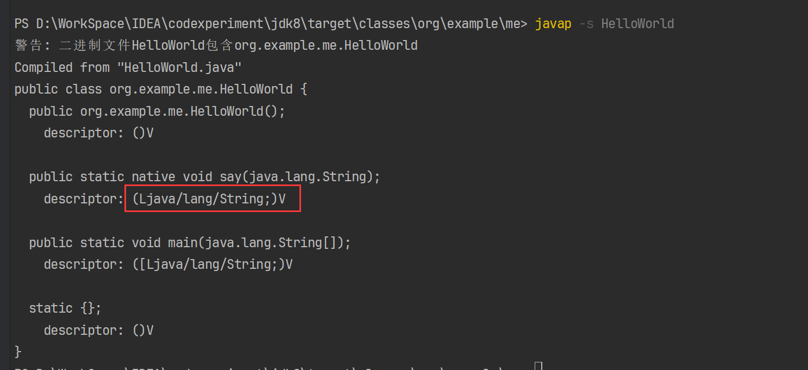

JNI（Java Native Interface）通过 Java 方法调用使用本地代码如 C/C++ 实现的方法

# JDK8 生成 JNI 步骤
1. 首先要在 java 文件中定义一个 native 方法

```java
package org.example.me;

public class HelloWorld {

    static {
        System.loadLibrary("libHelloWorld");
    }

    public native static void say(String content);

    public static void main(String[] args) {
        HelloWorld.say("JNI native Hello World!");
    }
}

```

2. 通过 javah 命令生成对应 C++ 的头文件`javah -encoding utf-8 -v -o Helloworld.h org.example.me.Helloworld`（这里需要使用全限定名）`-o`表示指定生成的头文件名称，否则会把全限定中的`.`改为`_`最后加上`.h`命名，参数`-encoding utf-8`用于指明文件编码防止出现编码映射错误
3. 然后根据头文件自己创建一个 C/C++ 文件，并实现其中的方法（这里如果要正式开发则需要有 `jni.h` 文件作为参考，该文件在`JAVA_HOME/include`下。已将其复制到开发工程中）

```java
#include "HelloWorld.h"
#include <stdio.h>

//生成的头文件中方法定义是省略了参数名的，实现方法时需要加上参数名
JNIEXPORT void JNICALL Java_org_example_me_HelloWorld_say
  (JNIEnv * env, jclass arg, jstring instring)
 {
   //将java的String对象指向的字符串拷贝一份
   const jbyte *str =
        (const jbyte *)env->GetStringUTFChars(instring, JNI_FALSE);
   //打印字符串
    printf("Java_org_example_me_HelloWorld_say->%s\n",str);
    //释放str指向的字符串内存
    env->ReleaseStringUTFChars(instring, (const char *)str);
    return;
 }
```

4. 编写完成后开始生成`dll`或`so`文件，这里需要 gcc/g++（Windows 下可使用 MingGW，Linux 下可使用 GCC）执行命令`g++ -m64 -shared -I $Env:JAVA_HOME/include -I $Env:JAVA_HOME/include/win32 HelloWorld.cpp -o HelloWorld.dll`（g++ 会判断 cpp 中需要的头文件自动将同一目录下的引入进来，由于头文件中需要`jni.h`而 jni.h 又需要`jni_md.h`因此需要指定这些文件所在的位置）
5. 生成最终文件后需要在对应类加载时就提前加载`dll、so`文件，可通过以下两组 API 加载（<font style="color:#DF2A3F;">第一种方式严格要求库文件名称为</font>`<font style="color:#DF2A3F;">libxxx.dll / libxxx.so</font>`）

```java
// 该方法能加载的前提是在 JVM 启动参数上添加 -Djava.library.path=D:\WorkSpace\IDEA\codexperiment\jdk8\src\main\java
// 并且对应的库文件名称必须以 lib 开头
System.loadLibrary("libHelloWorld");
// 该方法需要使用绝对路径指定库位置
System.load("D:\\WorkSpace\\IDEA\\codexperiment\\jdk8\\src\\main\\java\\libHelloWorld.dll");
```

通过 javah 生成的头文件中 C 函数名数固定的，还必须符合特定的规范。可以通过 JNIEnv 对象的`RegisterNatives`方法（`jdk/src/share/javavm/export/jni.h`）

```c
jint (JNICALL *RegisterNatives)
    (JNIEnv *env, jclass clazz, const JNINativeMethod *methods,
     jint nMethods);
/*
 * used in RegisterNatives to describe native method name, signature,
 * and function pointer.
 */

typedef struct {
    char *name;
    char *signature;
    void *fnPtr;
} JNINativeMethod;
```

按照函数签名，主要是 JNINativeMethod 参数需要确认。其中 name 表示 Java 方法名字符串的指针，signature 表示方法描述符字符串的指针，fnPtr 是该 Java 方法对应的本地方法实现的函数指针。signature 如果自己推断会显得比较麻烦可通`javap -s class文件`找到对应的 signature。



RegisterNatives 有两种用法，一种是 JDK 的标准用法，在 Java 类中定义一个本地 registerNatives 方法，用javah 生成对应的本地方法头文件（这里指的是生成 registerNatives 方法头文件），在 registerNatives 方法中完成其他本地方法的注册，典型的如`java.lang.Object`，其定义的 registerNatives 方法如下：

```java
private static native void registerNatives();
static {
    registerNatives();
}
```

本地方法实现在`jdk/src/share/native/java/lang/Object.c`中（通过`Java_java_lang_Object_registerNatives`一连注册了 5 个 native 方法）：

```c
#include <stdio.h>
#include <signal.h>
#include <limits.h>

#include "jni.h"
#include "jni_util.h"
#include "jvm.h"

#include "java_lang_Object.h"

static JNINativeMethod methods[] = {
    {"hashCode",    "()I",                    (void *)&JVM_IHashCode},
    {"wait",        "(J)V",                   (void *)&JVM_MonitorWait},
    {"notify",      "()V",                    (void *)&JVM_MonitorNotify},
    {"notifyAll",   "()V",                    (void *)&JVM_MonitorNotifyAll},
    {"clone",       "()Ljava/lang/Object;",   (void *)&JVM_Clone},
};

JNIEXPORT void JNICALL
Java_java_lang_Object_registerNatives(JNIEnv *env, jclass cls)
{
    (*env)->RegisterNatives(env, cls,
                            methods, sizeof(methods)/sizeof(methods[0]));
}

JNIEXPORT jclass JNICALL
Java_java_lang_Object_getClass(JNIEnv *env, jobject this)
{
    if (this == NULL) {
        JNU_ThrowNullPointerException(env, NULL);
        return 0;
    } else {
        return (*env)->GetObjectClass(env, this);
    }
}
```

第二种不通过`javah`生成头文件， 利用 JVM 加载库文件会回调库文件中的 JNI_OnLoad 方法来实现本地方法的注册，JNI_OnLoad 方法的定义在`jdk/src/share/javavm/export/jni.h`。改造后的`HelloWorld.cpp`实现如下（不再需要头文件，其它照旧）

```cpp

#include "jni.h"
#include <stdio.h>

JNIEXPORT void JNICALL say_hello_world
  (JNIEnv * env, jclass arg, jstring instring);

JNIEXPORT jint JNICALL
JNI_OnLoad(JavaVM *vm, void *reserved){
	    JNIEnv* env;
	    //判断当前JDK判断是否大于1.6
		if (vm->GetEnv((void **)&env, JNI_VERSION_1_6) != JNI_OK) {
			 return -1;
		}
		JNINativeMethod nm[1];
		nm[0].name = "say";
		nm[0].signature = "(Ljava/lang/String;)V";
		nm[0].fnPtr = (void*)say_hello_world;
		//查找特定类
		jclass cls = env->FindClass("org/example/me/HelloWorld");
		if (cls == NULL){
		    return JNI_ERR;
		}
		//注册本地方法
		if(env->RegisterNatives(cls, nm, 1)<0){
			return JNI_ERR;
		}
		//返回当前库文件要求的最低JDK版本
		return JNI_VERSION_1_6;
}

JNIEXPORT void JNICALL say_hello_world
  (JNIEnv * env, jclass arg, jstring instring)
 {
   //将java的String对象指向的字符串拷贝一份
   const jbyte *str =
        (const jbyte *)env->GetStringUTFChars(instring, JNI_FALSE);
   //打印字符串
    printf("Java_org_example_me_HelloWorld_say->%s\n",str);
    //释放str指向的字符串内存
    env->ReleaseStringUTFChars(instring, (const char *)str);
    return;
 }
```

# JNI API
## Java 数据类型
Java的数据类型分为基本类型（primitive type，又称原生类型或者原始类型）和引用类型（reference type）,其中基本类型又分为数值类型，boolean 类型和 returnAddress 类型三类。returnAddress 类型在 Java 语言中没有对应的数据类型，由 JVM 使用表示指向某个字节码的指针。JVM 定义了 boolean 类型，但没有任何专供boolean 值使用的字节码指令，Java 语言表达式操作 boolea n值，都是使用 int 类型对应的字节码指令完成的，boolean 数组的访问修改共用 byte 数组的 baload 和 bstore 指令；JVM 规范中明确了 1 表示true，0 表示 false，但是未明确 boolean 类型的长度，Hotspot 使用 C++ 中无符号的 char 类型表示 boolean 类型，即boolean 类型占 8 位。数值类型分为整数类型和浮点数类型，如下：

整数类型：

+ byte 类型：值为 8 位有符号二进制补码整数
+ short 类型：值为 16 位有符号二进制补码整数
+ int 类型：值为 32 位有符号二进制补码整数
+ long 类型：值为 64 位有符号二进制补码整数
+ char 类型：值为 16 位无符号整数，用于表示指向多文种平面的 Unicode 码点，默认值是 Unicode 的 null码点（\u0000）

浮点类型：

+ float 类型：值为单精度浮点数集合中的元素（32 位）
+ double 类型：值为双精度浮点数集合中的元素（64 位）

引用类型在 JVM 中有三种，类类型（class type），数组类型（array type）和接口类型（interface type），数组类型最外面的一维元素的类型称为该数组的组件类型，组件类型也可以是数组类型，如果组件类型不是元素类型则称为该数组的元素类型，引用类型其实就是 C++ 中的指针。默认开始压缩指针的情况下时 32 位，否则是 64 位。

JVM 规范中并没有强引用，软引用，弱引用和虚引用的概念，JVM 定义的引用就是强引用，软引用，弱引用和虚引用是 JDK 结合垃圾回收机制提供的功能支持而已。

## JNI 数据类型
JNI 数据类型其实就是 Java 数据类型在 Hotspot 中的具体表示或者对应的 C/C++ 类型，类型的定义参考`hotspot/src/share/vm/prims/jni.h`中（从以下定义中可以看到所有的类型都继承自 _jobject）

```c
/*
 * JNI Types
 */

#ifndef JNI_TYPES_ALREADY_DEFINED_IN_JNI_MD_H

typedef unsigned char   jboolean;
typedef unsigned short  jchar;
typedef short           jshort;
typedef float           jfloat;
typedef double          jdouble;

typedef jint            jsize;

class _jobject {};
class _jclass : public _jobject {};
class _jthrowable : public _jobject {};
class _jstring : public _jobject {};
class _jarray : public _jobject {};
class _jbooleanArray : public _jarray {};
class _jbyteArray : public _jarray {};
class _jcharArray : public _jarray {};
class _jshortArray : public _jarray {};
class _jintArray : public _jarray {};
class _jlongArray : public _jarray {};
class _jfloatArray : public _jarray {};
class _jdoubleArray : public _jarray {};
class _jobjectArray : public _jarray {};

typedef _jobject *jobject;
typedef _jclass *jclass;
typedef _jthrowable *jthrowable;
typedef _jstring *jstring;
typedef _jarray *jarray;
typedef _jbooleanArray *jbooleanArray;
typedef _jbyteArray *jbyteArray;
typedef _jcharArray *jcharArray;
typedef _jshortArray *jshortArray;
typedef _jintArray *jintArray;
typedef _jlongArray *jlongArray;
typedef _jfloatArray *jfloatArray;
typedef _jdoubleArray *jdoubleArray;
typedef _jobjectArray *jobjectArray;

typedef jobject jweak;

typedef union jvalue {
    jboolean z;
    jbyte    b;
    jchar    c;
    jshort   s;
    jint     i;
    jlong    j;
    jfloat   f;
    jdouble  d;
    jobject  l;
} jvalue;

struct _jfieldID;
typedef struct _jfieldID *jfieldID;

struct _jmethodID;
typedef struct _jmethodID *jmethodID;

/* Return values from jobjectRefType */
typedef enum _jobjectType {
     JNIInvalidRefType    = 0,
     JNILocalRefType      = 1,
     JNIGlobalRefType     = 2,
     JNIWeakGlobalRefType = 3
} jobjectRefType;


#endif /* JNI_TYPES_ALREADY_DEFINED_IN_JNI_MD_H */

/*
 * jboolean constants
 */

#define JNI_FALSE 0
#define JNI_TRUE 1
```

对应关系如下表：

| Java 数据类型 | JNI 数据类型 | x86 C++ 类型 | 长度 |
| --- | --- | --- | --- |
| boolean | jboolean | unsigned char | 8 |
| byte | jbyte | signed char | 8 |
| char | jchar | unsigned short | 16 |
| short | jshort | short | 16 |
| int  | jint | int | 16 |
| long | jlong | long | 64 |
| float | jfloat | float | 32 |
| double | jdouble | double | 64 |
| String | jstring | _jstring * | 32/64（类指针,在64位机器上默认开启指针压缩，指针长度是32位，否则是64位，不过被压缩的指针仅限于指向堆对象的指针） |
| Class | jclass | _jclass * | |
| Throwable | jthrowable | _jthrowable * | |
| boolean[] | jbooleanArray | _jbooleanArray * | |
| byte[] | jbyteArray | _jbyteArray * | |
| char[] | jcharArray | _jcharArray * | |
| short[] | jshortArray | _jshortArray * | |
| int[] | jintArray | _jintArray * | |
| long[] | jlongArray | _jlongArray * | |
| float[] | jfloatArray | _jfloatArray * | |
| double[] | jdoubleArray | _jdoubleArray * | |
| Object[] | jobjectArray | _jobjectArray * | |


## API 定义
本地代码调用 JNI API 的入口只有两个 JNIEnv 和 JavaVM 类，这两个都在`hotspot/src/share/vm/prims/jni.h`中定义。两者的实现其实是对结构体 JNINativeInterface_ 和 JNIInvokeInterface_ 的简单包装。注意 JVM 规范要求同一个线程内多次 JNI 调用接收的 JNIEnv 或者 JavaVM 指针都是同一个指针，且该指针只在该线程内有效，因此本地代码不能将该指针从当前线程传递到另一个线程中。

## 异常处理
所有的 JNI 方法同大多数的 C 库函数一样不检查传入的参数的正确性，这点由调用方负责检查，如果参数错误可能导致 JVM 直接宕机。大多数情况下，JNI 方法通过返回一个特定的错误码或者抛出一个 Java 异常的方式报错，调用方可以通过`ExceptionOccurred()`方法判断是否发生了异常，如本地方法调用 Java 方法，判断 Java 方法执行期间是否发生了异常，并通过该方法获取异常的详细信息。

JNI 允许本地方法抛出或者捕获 Java 异常，未被本地方法捕获的异常会向上传递给方法的调用方。本地方法有两种方式处理异常，一种是直接返回，导致异常在调用本地方法的 Java 方法中被抛出；一种是调用`ExceptionClear()`方法清除这个异常，然后继续执行本地方法的逻辑。当异常产生，本地方法必须先清除该异常才能调用其他的JNI方法，当异常尚未处理时，只有下列方法可以被安全调用：

+ ExceptionOccurred()
+ ExceptionDescribe()
+ ExceptionClear()
+ ExceptionCheck()
+ ReleaseStringChars()
+ ReleaseStringUTFChars()
+ ReleaseStringCritical()
+ Release&lt;Type>ArrayElements()
+ ReleasePrimitiveArrayCritical()
+ DeleteLocalRef()
+ DeleteGlobalRef()
+ DeleteWeakGlobalRef()
+ MonitorExit()
+ PushLocalFrame()
+ PopLocalFrame()

异常处理相关 API 如下：

+ jint Throw(JNIEnv *env, jthrowable obj); 重新抛出Java异常
+ jint ThrowNew(JNIEnv *env, jclass clazz,const char *message); 抛出一个指定类型和错误提示的异常
+ jthrowable ExceptionOccurred(JNIEnv *env); 判断当前线程是否存在未捕获的异常，如果存在则返回该异常对象，不存在返回 NULL，仅限于 A 方法调用 B 方法接受后，A 方法调用此方法判断 B 方法是否抛出异常的场景，B 方法可以本地或者 Java 方法。
+ void ExceptionDescribe(JNIEnv *env); 将当前线程的未捕获异常打印到系统标准错误输出流中如 stderr，如果该异常是 Throwable 的子类则实际调用该类的 printStackTrace 方法打印。注意执行过程中获取到异常实例 jthrowable 后就会调用 ExceptionClear 清除
+ void ExceptionClear(JNIEnv *env); 清除当前线程的未捕获异常
+ void FatalError(JNIEnv *env, const char *msg); 抛出一个致命异常，会直接导致 JVM 宕机
+ jboolean ExceptionCheck(JNIEnv *env); 检查当前线程是否存在异常，不返回具体的异常对象，若存在返回 true

以下是一个 JNI 异常示例测试，dll 生成参考上一节步骤。

```java
package org.example.me;

public class ThrowTest {

    static {
        System.load("D:\\WorkSpace\\IDEA\\codexperiment\\jdk8\\src\\main\\java\\ThrowTest.dll");
    }

    public static native void rethrowException(Exception e);

    public static native void handlerException();

    public static void main(String[] args) {
        handlerException();
        rethrowException(new UnsupportedOperationException("Unsurpported ThrowTest"));
    }
}
```

```cpp
#include "ThrowTest.h"
#include <stdio.h>

JNIEXPORT void JNICALL Java_org_example_me_ThrowTest_rethrowException(JNIEnv * env,
		jclass cls, jthrowable e) {
	printf("Java_jni_ThrowTest_rethrowException\n");
	env->Throw(e);
}

void throwNewException(JNIEnv * env) {
	printf("throwNewException\n");
	jclass unsupportedExceptionCls = env->FindClass(
			"java/lang/UnsupportedOperationException");
	env->ThrowNew(unsupportedExceptionCls, "throwNewException Test\n");
}

JNIEXPORT void JNICALL Java_org_example_me_ThrowTest_handlerException(JNIEnv * env,
		jclass cls) {
	throwNewException(env);
	jboolean result = env->ExceptionCheck();
	printf("ExceptionCheck result->%d\n", result);
	env->ExceptionDescribe();
	result = env->ExceptionCheck();
	printf("ExceptionCheck for ExceptionDescribe result->%d\n", result);
	throwNewException(env);
	jthrowable e = env->ExceptionOccurred();
	if (e) {
		printf("ExceptionOccurred not null\n");
	} else {
		printf("ExceptionOccurred null\n");
	}
	env->ExceptionClear();
	printf("ExceptionClear\n");
	e = env->ExceptionOccurred();
	if (e) {
		printf("ExceptionOccurred not null\n");
	} else {
		printf("ExceptionOccurred null\n");
	}
}
```

## 引用类型操作 API
JNI 中关于引用只有一个枚举类型`hotspot/src/share/vm/prims/jni.h/_jobjectType`jobjectRefType 表示引用类型，仅限于本地方法使用，具体如下：

+ JNIInvalidRefType 表示无效引用
+ JNILocalRefType 表示本地引用，当本地方法返回后这些引用会自动回收掉，JVM在开始执行一个新的本地方法前会先执行 EnsureLocalCapacity 评估当前线程能否创建至少 16 个本地引用，然后调用 PushLocalFrame 创建一个新的用于保存该方法执行过程中的本地引用的 Frame，当本地方法结束调用 PopLocalFram 释放调用该 Frame，同时释放 Frame 中保存的即该本地方法执行过程中创建的所有本地引用。本地方法接受的 Java 对象类型参数或者返回值都是 JNILocalRefType 类型，JNI 允许开发者根据 JNILocalRefType 类型引用创建一个 JNIGlobalRefType 类型引用。大部分情形开发者依赖程序自动回收掉本地引用即可，但是部分情形下需要开发者手动显示释放本地引用，比如本地方法中访问了一个大的 Java 对象，这时会创建一个指向该对象的本地引用，如果本地方法已经不在使用该引用了，需要手动释放该引用，否则该引用会阻止垃圾回收器回收掉该对象；再比如通过本地方法遍历某个包含大量 Java 对象的数组，遍历的时候会为每个需要访问的 Java 对象创建一个本地引用，如果这些引用不手动释放而是等到方法结束才释放就会导致内存溢出问题。JNI 允许开发者在本地方法执行的任意时点删除本地引用从而允许垃圾回收器回收该引用指向的对象，为了确保这点，所有的 JNI 方法要求不能创建额外的本地引用，除非它是作为返回值。创建的本地引用只在当前线程内有效，因此不能将一个本地引用传递到另一个线程中
+ JNIGlobalRefType 表示全局引用，必须通过 DeleteGlobalRef 方法删除才能释放该全局引用，从而允许垃圾回收器回收该引用指向的对象
+ JNIWeakGlobalRefType 表示全局弱应用，只在 JVM 内部使用，跟 Java 中的弱引用一样，当垃圾回收器运行的时候，如果一个对象仅被弱全局引用所引用，则这个对象将会被回收，如果指向的对象被回收掉了，全局弱引用会指向 NULL，开发者可以通过 IsSameObject 方法判断弱引用是否等于 NULL 从而判断指向的对象是否被回收掉了。全局弱引用比 Java 中的 SoftReference 或者 WeakReference都要弱，如果都指向了同一个对象，则只有 SoftReference 或者 WeakReference 都被回收了，全局弱引用才会等于 NULL。全局弱应用跟 PhantomReferences 的交互不明确，应该避免两者间的交互

综上，这里的引用其实就是 Java 中 new 一个对象返回的引用，本地引用相当于 Java 方法中的局部变量对 Java 对象实例的引用，全局引用相当于 Java 类的静态变量对Java对象实例的引用，其本质跟 C++ 智能指针模板一样，是对象指针的二次包装，通过包装避免了该指针指向的对象被垃圾回收器回收掉，因此 JNI 中通过隐晦的引用访问 Java 对象的消耗比通过指针直接访问要高点，但是这是 JVM 对象和内存管理所必须的。

相关API如下：

+ jobject NewGlobalRef(JNIEnv *env, jobject obj); 创建一个指向 obj 的全局引用，obj 可以是本地或者全局引用，全局引用只能通过显示调用 DeleteGlobalRef() 释放。
+ void DeleteGlobalRef(JNIEnv *env, jobject globalRef); 删除一个全局引用
+ jobject NewLocalRef(JNIEnv *env, jobject ref); 创建一个指向对象ref的本地引用
+ void DeleteLocalRef(JNIEnv *env, jobject localRef); 删除一个本地引用
+ jint EnsureLocalCapacity(JNIEnv *env, jint capacity); 评估当前线程是否能够创建指定数量的本地引用，如果可以返回 0，否则返回负数并抛出 OutOfMemoryError 异常。在执行本地方法前 JVM 会自动评估当前线程能否创建至少 16 个本地引用。JVM 允许创建超过评估数量的本地引用，如果创建过多导致 JVM 内存不足 JVM 会抛出一个 FatalError。
+ jint PushLocalFrame(JNIEnv *env, jint capacity); 创建一个新的支持创建给定数量的本地引用的 Frame，如果可以返回 0，否则返回负数并抛出 OutOfMemoryError 异常。注意在之前的 Frame 中创建的本地引用在新的 Frame 中依然有效。
+ jobject PopLocalFrame(JNIEnv *env, jobject result); POP 掉当前的本地引用 Frame，然后释放其中的所有本地引用，如果 result 不为 NULL，则返回该对象在前一个即当前 Frame 之前被 push 的 Frame 中的本地引用
+ jweak NewWeakGlobalRef(JNIEnv *env, jobject obj); 创建一个指向对象 obj 的弱全局引用，jweak 是 jobject 的别名，如果 obj 是 null 则返回 NULL，如果内存不足则抛出 OutOfMemoryError 异常
+ void DeleteWeakGlobalRef(JNIEnv *env, jweak obj); 删除弱全局引用
+ jobjectRefType GetObjectRefType(JNIEnv* env, jobject obj); 获取某个对象引用的引用类型，JDK1.6 引入

PushLocalFrame 和 PopLocalFrame 两个都是配合使用，常见于 JNI 方法执行过程中产生的本地引用需要尽快释放掉。 NewGlobalRef 的使用场景通常是初始化 C/C++ 的全局属性，需要通过全局引用确保该属性指向的某个 Java 对象实例不被垃圾回收器回收掉，使用频次不多。

## 类和对象操作 API
类操作 API ：

+ jint GetVersion(JNIEnv *env);  获取当前 JVM 的 JNI 接口版本，该版本在 jni.cpp 中通过全局变量 CurrentVersion 指定
+ jclass DefineClass(JNIEnv *env, const char *name, jobject loader,const jbyte *buf, jsize bufLen);  加载某个类，name 表示类名，loader 表示类加载器实例，buf 表示 class 文件的字节数据，bufLen 表示具体的字节数，此方法跟 ClassLoader 的实现基本一致
+ jclass FindClass(JNIEnv *env, const char *name); 根据类名查找某个类，如果该类未加载则会调用合适的类加载器加载并链接该类。会优先使用定义了调用 FindClass 的本地方法的类的类加载器加载指定类名的类，如果是 JDK 标准类没有对应的类加载器则使用 ClassLoader.getSystemClassLoader 返回的系统类加载器加载。
+ jclass GetSuperclass(JNIEnv *env, jclass clazz); 获取父类，如果该类是某个接口或者是 Object 则返回 NULL
+ jboolean IsAssignableFrom(JNIEnv *env, jclass clazz1,jclass clazz2); 判断 clazz1 能否安全的类型转换成 clazz2

对象操作 API：

+ jobject AllocObject(JNIEnv *env, jclass clazz); 分配一个 Java 对象并返回该对象的本地引用，注意该方法并未调用任何构造方法
+ jobject NewObject(JNIEnv *env, jclass clazz,jmethodID methodID, ...); 调用指定的构造方法创建一个 Java 对象并返回该对象的本地引用，最后的三个点表示该构造方法的多个参数
+ jobject NewObjectA(JNIEnv *env, jclass clazz,jmethodID methodID, const jvalue *args); 同上，不过构造方法的入参是一个参数数组的指针
+ jobject NewObjectV(JNIEnv *env, jclass clazz,jmethodID methodID, va_list args);同上，不过构造参数被放在va_list列表中
+ jclass GetObjectClass(JNIEnv *env, jobject obj);获取Java对象所属的Java类
+ jboolean IsInstanceOf(JNIEnv *env, jobject obj,jclass clazz); 判断某个对象是否是某个类的实例
+ jboolean IsSameObject(JNIEnv *env, jobject ref1,jobject ref2); 判断两个引用是否引用相同的对象

以下是一个 JNI 类和对象测试，dll 生成参考上一节步骤。

```java
package org.example.me;


class A {

}

public class ObjTest extends A {

    static {
        System.load("D:\\WorkSpace\\IDEA\\codexperiment\\jdk8\\src\\main\\java\\ObjTest.dll");
    }

    public ObjTest() {
        System.out.println("default");
    }

    public ObjTest(int age) {
        System.out.println("param Construtor,age->" + age);
    }

    public native static void test(Object a);

    public static void main(String[] args) {
        test(new ObjTest());
    }
}
```

```cpp
#include "ObjTest.h"
#include <stdio.h>


JNIEXPORT void JNICALL Java_org_example_me_ObjTest_test
  (JNIEnv * env, jclass jcl,jobject obj){

	jcl=env->GetObjectClass(obj);
	jclass objACls=env->FindClass("org/example/me/A");
	jboolean result=env->IsAssignableFrom(jcl,objACls);
	printf("IsAssignableFrom result->%d\n",result);

	jobject objTest=env->AllocObject(jcl);
	printf("AllocObject succ \n");

	jmethodID defaultConst=env->GetMethodID(jcl,"<init>","()V");
	objTest=env->NewObject(jcl,defaultConst);
	printf("default construct new succ \n");

	jmethodID paramConst=env->GetMethodID(jcl,"<init>","(I)V");
	objTest=env->NewObject(jcl,paramConst,12);
	printf("param construct succ new \n");

	jclass superCls=env->GetSuperclass(jcl);
	jobject superObj=env->AllocObject(superCls);
	result=env->IsInstanceOf(superObj,objACls);
	printf("IsInstanceOf result->%d\n",result);

	jobject objTest2=env->NewLocalRef(objTest);
	result=env->IsSameObject(objTest2,objTest);
	printf("IsSameObject result->%d\n",result);

}
```

## 字段和方法操作 API
JNI 中使用 jfieldID 来标识一个某个类的字段，jmethodID 来标识一个某个类的方法，jfieldID 和 jmethodID 都是根据他们的字段名（方法名）和描述符确定的，通过 jfieldID 读写字段或者通过 jmethodID 调用方法都会避免二次查找，但是这两个 ID 不能阻止该字段或者方法所属的类被卸载，如果类被卸载了则 jfieldID 和 jmethodID 失效了需要重新计算，因此如果希望长期使用 jfieldID 和 jmethodID 则需要保持对该类的持续引用，即建立对该类的全局引用，两者的定义在`hotspot/src/share/vm/prims/jni.h`中，这两个并非常规的字符串或者数字形式的 ID，而是一个指针，指向实际保存字段信息和方法的该类的 Klass，如下：

```c
struct _jfieldID;
typedef struct _jfieldID *jfieldID;

struct _jmethodID;
typedef struct _jmethodID *jmethodID;
```

相关的API如下：

+ jfieldID GetFieldID(JNIEnv *env, jclass clazz,const char *name, const char *sig); 获取某个类的指定字段的jfieldID，如果该类未初始化则 GetFieldID 会触发其完成初始化，注意不能用该方法获取数组长度对应的jfieldID 进而获取数组长度而应该直接使用`GetArrayLength()`方法获取
+ NativeType Get&lt;type>Field(JNIEnv *env, jobject obj,jfieldID fieldID); 读取某个实例指定字段的值， NativeType 和 type 是一一对应的，具体如下：

| Get&lt;type>Field Routine Name | Native Type |
| --- | --- |
| GetObjectField() | jobject |
| GetBooleanField() | jboolean |
| GetByteField() | jbyte |
| GetCharField() | jchar |
| GetShortField() | jshort |
| GetIntField() | jint |
| GetLongField() | jlong |
| GetFloatField() | jfloat |
| GetDoubleField() | jdouble |


+ void Set&lt;type>Field(JNIEnv *env, jobject obj, jfieldID fieldID,NativeType value); 改写某个实例指定字段的值，type 与 NativeType 的对应关系同上
+ jmethodID GetMethodID(JNIEnv *env, jclass clazz,const char *name, const char *sig); 获取某个类的指定方法的 jmethodID，如果该类未初始化则此方法会触发该类完成初始化，获取的方法可以是该类从父类继承的方法。获取构造方法时，方法名必须是 <init>，返回类型必须是 void (V)
+ NativeType Call&lt;type>Method(JNIEnv *env, jobject obj,jmethodID methodID, ...)
+ NativeType Call&lt;type>MethodA(JNIEnv *env, jobject obj,jmethodID methodID, const jvalue *args)
+ NativeType Call&lt;type>MethodV(JNIEnv *env, jobject obj,jmethodID methodID, va_list args); 上述三个都是调用指定实例对象的指定方法，不同的是方法入参的传递方法，同之前的 NewObject 系列方法。注意如果调用的方法是从父类继承的，无论是构造方法还是普通方法，使用的 jmethodID 都必须是从 obj 获取的，而不是从父类实例获取的。NativeType 和 type 是一一对应的，如下：

| Call&lt;type>Method Routine Name | Native Type |
| --- | --- |
| CallVoidMethod() CallVoidMethodA() CallVoidMethodV()  | void |
| CalObjectMethod() CalObjectMethodA() CallObjectMethodV()  | jobject |
| CallBooleanMethod() CallBooleanMethodA() CallBooleanMethodV()  | jboolean |
| CallByteMethod() CalByteMethodA() CallByteMethodV()  | jbyte |
| CallCharMethod() CallCharMethodA() CallCharMethodV()  | jchar |
| CallShortMethod() CalShortMethodA() CallShortMethodV()  | jshort |
| CallIntMethod() CallIntMethodA() CalIntMethodV()  | jint |
| CallLongMethod() CallLongMethodA() CallLongMethodV()  | jlong |
| CallFloatMethod() CallFloatMethodA() CallFloatMethodV()  | jfloat |
| CallDoubleMethod() CallDoubleMethodA() CalDoubleMethodV()  | jdouble |


+ NativeType CallNonvirtual<type>Method(JNIEnv *env, jobject obj,jclass clazz, jmethodID methodID, ...);
+ NativeType CallNonvirtual<type>MethodA(JNIEnv *env, jobject obj,jclass clazz, jmethodID methodID, const jvalue *args);
+ NativeType CallNonvirtual<type>MethodV(JNIEnv *env, jobject obj,jclass clazz, jmethodID methodID, va_list args); 同 Call&lt;type>Method 都是调用指定类实例的指定方法，jmethodID 必须是从类实例的 jclass 获取，CallNonvirtual<type>Method 多了一个参数 jclass，但是 jclass 不一定是 obj 的 jclass，也可以是 obj 的父类的 jclass，无论哪一个，jmethodID 都是从指定的 jclass clazz获取的，最终调用的方法实现取决于 jmethodID。简单的说如果子类继承并改写了父类的方法，Call&lt;type>Method 只能调用改写后的方法，而 CallNonvirtual<type>Method 即可以调用父类的原始方法，也可以调用子类的改写方法。这里的虚方法是 C++ 中的概念，C++ 中如果一个方法不是虚方法，子类继承并改写了该方法，则当子类实例向上强转成父类实例时调用的就是父类而非子类的改写方法。如果子类继承并改写的方法被定义成虚方法，则会通过虚函数表的方式保证当子类实例向上强转成父类实例时调用的依然是子类的改写方法，即所谓的多态。NativeType 和 type 的对应关系同 Call&lt;type>Method

注意上述方法和字段操作都是针对非静态的方法和字段的，对静态的方法和字段操作的 API 如下：

+ jfieldID GetStaticFieldID(JNIEnv *env, jclass clazz,const char *name, const char *sig); 获取指定静态方法的 ID，同上会触发未初始化类的初始化
+ NativeType GetStatic<type>Field(JNIEnv *env, jclass clazz,jfieldID fieldID);读取指定静态字段的值， NativeType 和 type 的对应关系同 Get&lt;type>Field
+ void SetStatic<type>Field(JNIEnv *env, jclass clazz,jfieldID fieldID, NativeType value); 改写指定静态字段的值，NativeType 和 type 的对应关系同 Set&lt;type>Field
+ jmethodID GetStaticMethodID(JNIEnv *env, jclass clazz,const char *name, const char *sig); 获取指定静态方法的 ID，会导致未初始化类的初始化
+ NativeType CallStatic<type>Method(JNIEnv *env, jclass clazz,jmethodID methodID, ...);
+ NativeType CallStatic<type>MethodA(JNIEnv *env, jclass clazz,jmethodID methodID, jvalue *args);
+ NativeType CallStatic<type>MethodV(JNIEnv *env, jclass clazz,jmethodID methodID, va_list args); 上述三个方法都是调用指定静态方法

注意在调用方法或者设置属性传参数时，需要密切关注参数类型，尤其是基本类型，只有字段或者方法声明明确使用了基本类型传参才能使用基本类型，否则必须通过 Integer 等包装类的构造方法将基本类型转换为对应包装类的对象；另一个需要注意的就是可变参数类型，Java 中可以传入数量可变的参数，这些参数最终会被编译器转换成一个数组，即这类参数类型实际是一个数组，因此传参时不能跟 Java 一样，而需要显示的传入一个数组类型。以下是一个 JNI 字段和方法测试，dll 生成参考上一节步骤。

```java
package org.example.me;


import java.util.Arrays;
import java.util.List;

class SuperA {

    public void say() {
        System.out.println("say SuperA");
    }

    public void add(int a, int b) {
        System.out.println("SuperA add a->" + a + ",b->" + b + ",result->" + (a + b));
    }

}

public class FiledMethodTest extends SuperA {

    static {
        System.load("D:\\WorkSpace\\IDEA\\codexperiment\\jdk8\\src\\main\\java\\FiledMethodTest.dll");
    }

    private List<Integer> list;

    private boolean boolField;

    private byte byteField;

    private char charField;

    private short shortField;

    private int intField;

    private long longField;

    private float floatField;

    private double doubleField;

    private static int staticFiled;

    public FiledMethodTest() {
        list = Arrays.asList(1, 2);
        boolField = false;
        byteField = 11;
        charField = 'c';
        shortField = 12;
        intField = 13;
        longField = 14;
        floatField = 15.0f;
        doubleField = 16.0;
        staticFiled = 17;
    }

    @Override
    public void say() {
        System.out.println("say FiledMethodTest");
    }


    public List<Integer> getList() {
        return list;
    }

    private static void printList(List list) {
        if (list == null) {
            System.out.println("list is null");
        } else {
            System.out.println("list->" + list);
        }
    }

    private void printObj() {
        System.out.println("FiledMethodTest{" +
                "list=" + list +
                ", boolField=" + boolField +
                ", byteField=" + byteField +
                ", charField=" + charField +
                ", shortField=" + shortField +
                ", intField=" + intField +
                ", longField=" + longField +
                ", floatField=" + floatField +
                ", doubleField=" + doubleField +
                ", staticFiled=" + staticFiled +
                '}');
    }

    public native static void test(FiledMethodTest a);

    public static void main(String[] args) throws Exception {
        FiledMethodTest a = new FiledMethodTest();
        System.out.println("start test");
        test(a);
    }
}
```

```cpp
#include "FiledMethodTest.h"
#include <stdio.h>

JNIEXPORT void JNICALL Java_org_example_me_FiledMethodTest_test(JNIEnv * env, jclass jcl,
		jobject obj) {

    // 注意字段和方法描述符中如果是其他的类，必须带上后面的分号
	jfieldID listId = env->GetFieldID(jcl, "list", "Ljava/util/List;");
	jfieldID boolFieldId = env->GetFieldID(jcl, "boolField", "Z");
	jfieldID byteFieldId = env->GetFieldID(jcl, "byteField", "B");
	jfieldID charFieldId = env->GetFieldID(jcl, "charField", "C");
	jfieldID shortFieldId = env->GetFieldID(jcl, "shortField", "S");
	jfieldID intFieldId = env->GetFieldID(jcl, "intField", "I");
	jfieldID longFieldId = env->GetFieldID(jcl, "longField", "J");
	jfieldID floatFieldId = env->GetFieldID(jcl, "floatField", "F");
	jfieldID doubleFieldId = env->GetFieldID(jcl, "doubleField", "D");
	jfieldID staticFiledId = env->GetStaticFieldID(jcl, "staticFiled", "I");

	jmethodID printListId = env->GetStaticMethodID(jcl, "printList",
			"(Ljava/util/List;)V");
	jmethodID printObjId = env->GetMethodID(jcl, "printObj", "()V");
	jmethodID getListId = env->GetMethodID(jcl, "getList",
			"()Ljava/util/List;");
	jmethodID sayId=env->GetMethodID(jcl,"say","()V");
	jmethodID addId=env->GetMethodID(jcl,"add","(II)V");

	jclass arrayListCls = env->FindClass("java/util/ArrayList");
	jmethodID list_costruct = env->GetMethodID(arrayListCls, "<init>", "()V");
	jmethodID listAddId = env->GetMethodID(arrayListCls, "add",
			"(Ljava/lang/Object;)Z");

	jclass arraysCls=env->FindClass("java/util/Arrays");
	jmethodID asListId=env->GetStaticMethodID(arraysCls,"asList","([Ljava/lang/Object;)Ljava/util/List;");

	jclass intergerCls = env->FindClass("java/lang/Integer");
	jmethodID interger_costruct = env->GetMethodID(intergerCls, "<init>",
			"(I)V");

	// 如果找不到方法或者字段不会直接报错，需要手动执行异常检查
	if (env->ExceptionCheck()) {
		jthrowable err = env->ExceptionOccurred();
		env->Throw(err);
	}

	jobject listObj = env->GetObjectField(obj, listId);
	env->CallStaticVoidMethod(jcl, printListId, listObj);

	jobject listObj2 = env->CallObjectMethod(obj, getListId);
	jboolean issame = env->IsSameObject(listObj, listObj2);
	printf("issame->%d\n", issame);

	jboolean boolField = env->GetBooleanField(obj, boolFieldId);
	printf("boolField->%d\n", boolField);

	jbyte byteField = env->GetByteField(obj, byteFieldId);
	printf("byteField->%d\n", byteField);

	jchar charField = env->GetCharField(obj, charFieldId);
	printf("charField->%d\n", charField);

	jshort shortField = env->GetShortField(obj, shortFieldId);
	printf("shortField->%d\n", shortField);

	jint intField = env->GetIntField(obj, intFieldId);
	printf("intField->%d\n", intField);

	jlong longField = env->GetLongField(obj, longFieldId);
	printf("longField->%d\n", longField);

	jfloat floatField = env->GetFloatField(obj, floatFieldId);
	printf("floatField->%f\n", floatField);

	jdouble doubleField = env->GetDoubleField(obj, doubleFieldId);
	printf("doubleField->%f\n", doubleField);

	jint staticFiled = env->GetStaticIntField(jcl, staticFiledId);
	printf("staticFiled->%d\n", staticFiled);

	// JNI中没有对基本类型的自动装箱拆箱机制，必要时需要手动包装
	jobject intObj = env->NewObject(intergerCls, interger_costruct, 3);
	jobject intObj2 = env->NewObject(intergerCls, interger_costruct, 4);

    // jobject newList = env->NewObject(arrayListCls, list_costruct);
	// add方法接受的参数实际是一个对象，因此需要手动包装
    // env->CallBooleanMethod(newList, listAddId, intObj);
    // env->CallBooleanMethod(newList, listAddId, intObj2);
	// Arrays.asList方法在Java中是不可变参数，实际多个参数最终会被转变成数组，因此这里的入参必须是数组
	jobjectArray objArray=env->NewObjectArray(2,intergerCls,intObj);
	env->SetObjectArrayElement(objArray,1,intObj2);
	jobject newList=env->CallStaticObjectMethod(arraysCls,asListId,objArray);

	env->SetObjectField(obj, listId, newList);
	env->SetBooleanField(obj, boolFieldId, 1);
	env->SetByteField(obj, byteFieldId, 21);
	env->SetCharField(obj, charFieldId, 'd');
	env->SetShortField(obj, shortFieldId, 22);
	env->SetIntField(obj, intFieldId, 23);
	env->SetLongField(obj, longFieldId, 24);
	env->SetFloatField(obj, floatFieldId, 25.0);
	env->SetDoubleField(obj, doubleFieldId, 26.0);
	env->SetStaticIntField(jcl, staticFiledId, 27);

	env->CallVoidMethod(obj, printObjId);

	jclass superCls=env->GetSuperclass(jcl);
	jmethodID superSayId=env->GetMethodID(superCls,"say","()V");
	// 如果子类没有覆写则使用父类的实现，否则使用子类覆写的实现
	env->CallVoidMethod(obj,sayId);
	env->CallVoidMethod(obj,addId,3,4);
	// 使用 jclass 的方法实现，可以是子类的也可以是父类的,取决于后面的 methodId
	env->CallNonvirtualVoidMethod(obj,jcl,sayId);
	env->CallNonvirtualVoidMethod(obj,jcl,superSayId);
	env->CallNonvirtualVoidMethod(obj,superCls,sayId);
	env->CallNonvirtualVoidMethod(obj,superCls,superSayId);

}
```

上述示例中 printObj 和 printList 方法都是私有方法，但是通过 JNI 接口一样可以正常调用，说明 JNI 无视 Java的访问权限控制，可以访问任何方法和字段。

## 字符串 API
Java 内部使用 UTF-16 来表示字符，JNI 允许使用 UTF-16 的字符串构建 java.lang.String 对象，也允许使用 UTF-8 字符串构建 java.lang.String 对象。但是 JNI 使用改良版的 UTF-8 字符串，与标准 UTF-8 主要有两个不同，第一个表示 null 的 char 0 被编译成 2 个字节而非一个字节，这表示改良版的 UTF-8 编码不会有嵌入的 null 字符；第二个，改良版的 UTF-8 只使用 1 个，2 个或者 3个 字节形式的 UTF-8 字符编码，不支持 4 字节形式的，会使用替代的 1 或者 2 或者 3 字节形式的编码。

相关 API 如下：

+ jstring NewString(JNIEnv *env, const jchar *unicodeChars,jsize len); 用 UTF-16 字符数组构建一个 jstringjsize
+ GetStringLength(JNIEnv *env, jstring string); 获取 UTF-16 字符串的字符数量
+ const jchar * GetStringChars(JNIEnv *env, jstring string,jboolean *isCopy); 获取 UTF-16字 符串的字符数组，如果 isCopy 不是 NULL，则当 JVM 返回的字符数组是复制自字符串时，isCopy 被置为 TRUE，如果是返回指向字符串的一个指针时，则 isCopy 被置为 FALSE
+ void ReleaseStringChars(JNIEnv *env, jstring string,const jchar *chars); 通知 JVM 释放 chars 指向的字符数组
+ void GetStringRegion(JNIEnv *env, jstring str, jsize start, jsize len, jchar *buf);将 str 中指定范围的字符复制到 buf 中
+ const jchar * GetStringCritical(JNIEnv *env, jstring string, jboolean *isCopy);
+ void ReleaseStringCritical(JNIEnv *env, jstring string, const jchar *carray); 这两个方法的用途同 GetStringChars 和 ReleaseStringCritical，不同的是这两个方法的使用更严格。这两个方法中间的区域称为关键区，关键区内不能调用其他的 JNI 方法，不能执行类似读取文件这类会阻塞当前线程的操作

上面的 API 都是针对 UTF-16 字符串，针对通用的 UTF-8 字符串的 API 如下，函数的功能都一样，最大的变化就是从 jchar 换成了 char：

+ jstring NewStringUTF(JNIEnv *env, const char *bytes); 使用 UTF-8 编码后的 char 数组构建一个新的 java.lang.String 对象
+ jsize GetStringUTFLength(JNIEnv *env, jstring string); 返回一个字符串用 UTF-8 编码后的字符数组的长度，因为 UTF-8 是变长的，所以字符数组的长度不一定等于字符的长度
+ const char * GetStringUTFChars(JNIEnv *env, jstring string,jboolean *isCopy); 获取一个字符串用 UTF-8 编码后的字符数组，同 GetStringChars，可以通过 isCopy 判断返回的字符数组是否复制自原数组
+ void ReleaseStringUTFChars(JNIEnv *env, jstring string,const char *utf); 通知 JVM 释放 utf 指向的字符数组
+ void GetStringUTFRegion(JNIEnv *env, jstring str, jsize start, jsize len, char *buf); 将 str 中指定范围的 UTF-16 字符用 UTF-8 编码后复制到 buf 中

以下是一个 JNI 字符串测试，dll 生成参考上一节步骤。

```java
package org.example.me;

public class StringTest {

    static {
        System.load("D:\\WorkSpace\\IDEA\\codexperiment\\jdk8\\src\\main\\java\\StringTest.dll");
    }

    public static native void stringTest(String test);

    public static void printStr(String test) {
        System.out.println("str length:" + test.length());
        System.out.println("str:" + test);
    }

    public static void main(String[] args) {
        String test = "Hello World 中文测试";
        stringTest(test);
        printStr(test);
    }

}
```

```cpp
#include "StringTest.h"
#include <stdio.h>
#include <stdlib.h>

typedef unsigned char u_char;

int unicode_length(const char* str);

void convert_to_unicode(const char* utf8_str, jchar* unicode_str, int unicode_length);

char* next(const char* str, jchar* value);

int utf8_length(const jchar* base, int length);

u_char* utf8_write(u_char* base, jchar ch);

char* convert_to_utf8(const jchar* base, u_char* result,int length);


JNIEXPORT void JNICALL Java_org_example_me_StringTest_stringTest
  (JNIEnv * env, jclass jcl, jstring jstr){

	jsize size=env->GetStringLength(jstr);
	printf("GetStringLength length->%d\n",size);

	jsize size2=env->GetStringUTFLength(jstr);
	printf("GetStringUTFLength length->%d\n",size2);

	jboolean isCopy=1;
	const jchar* jcharStr=env->GetStringChars(jstr, &isCopy);
    jstring testStr=env->NewString(jcharStr+2, size-4);
	const char* charStr=env->GetStringUTFChars(testStr,&isCopy);
	printf("GetStringChars str->%s,isCopy->%d\n",charStr,isCopy);

    int utf8_len=utf8_length(jcharStr, (int)size)+1;
    u_char * utf8Char=(u_char*)malloc(sizeof(u_char)*utf8_len);
    convert_to_utf8(jcharStr, utf8Char, size);
    printf("convert_to_utf8 Test str->%s\n",utf8Char);
    free(utf8Char);

    //ReleaseStringChars底层调用的还是free，因此jcharStr不会变成NULL，只是其指向的内存被标记成释放了，继续访问结果不确定
	env->ReleaseStringChars(jstr, jcharStr);
	printf("ReleaseStringChars str->%d\n",jcharStr==NULL);

	jstring testStr2=env->NewStringUTF(charStr+2);
	//释放charStr原来指向的字符串
	env->ReleaseStringUTFChars(testStr, charStr);
	//重新赋值
	charStr=env->GetStringUTFChars(testStr2,&isCopy);
	printf("GetStringUTFChars str->%s,isCopy->%d\n",charStr,isCopy);
	env->ReleaseStringUTFChars(testStr2, charStr);
	printf("ReleaseStringUTFChars str->%s\n",charStr);

	jchar newJcharStr[4]={};
	env->GetStringRegion(jstr, 11, 4, newJcharStr);
	testStr=env->NewString(newJcharStr, 4);
    charStr=env->GetStringUTFChars(testStr,&isCopy);
	printf("GetStringRegion str->%s,isCopy->%d\n",charStr,isCopy);
	env->ReleaseStringUTFChars(testStr, charStr);

	char newCharStr[4]={};
	//注意底层实现不会校验newCharStr的长度是否够，调用方需要确保足够的容量
	env->GetStringUTFRegion(jstr, 11, 4, newCharStr);
	printf("GetStringUTFRegion str->%s\n",newCharStr);

	jmethodID printTestId=env->GetStaticMethodID(jcl, "printStr", "(Ljava/lang/String;)V");

	char* newStr="NewStringTest 中文测试";
	//创建新字符串,可执行编码必须是UTF-8,否则打印的是乱码
	jstring test=env->NewStringUTF(newStr);
	env->CallStaticVoidMethod(jcl, printTestId,test);
	int len=unicode_length(newStr);
	jchar* unicodeChar=(jchar*)malloc(len*sizeof(jchar));
	convert_to_unicode(newStr, unicodeChar, len);
	//使用NewString的话需要手动将UTF-8字符串转换成UTF-16字符串
	test=env->NewString(unicodeChar,(jsize)len);
	printf("convert_to_unicode test\n");
	env->CallStaticVoidMethod(jcl, printTestId,test);
	free(unicodeChar);


	if(env->ExceptionCheck()){
		env->ExceptionDescribe();
	}
}

int unicode_length(const char* str) {
  int num_chars = 0;
  for (const char* p = str; *p; p++) {
    if (((*p) & 0xC0) != 0x80) {
      num_chars++;
    }
  }
  return num_chars;
}

void convert_to_unicode(const char* utf8_str, jchar* unicode_str, int unicode_length) {
  unsigned char ch;
  const char *ptr = utf8_str;
  int index = 0;

  /* ASCII case loop optimization */
  for (; index < unicode_length; index++) {
    if((ch = ptr[0]) > 0x7F) { break; }
    unicode_str[index] = ch;
    ptr = (const char *)(ptr + 1);
  }

  for (; index < unicode_length; index++) {
    ptr = next(ptr, &unicode_str[index]);
  }
}

char* next(const char* str, jchar* value) {
  unsigned const char *ptr = (const unsigned char *)str;
  unsigned char ch, ch2, ch3;
  int length = -1;              /* bad length */
  jchar result;
  switch ((ch = ptr[0]) >> 4) {
    default:
    result = ch;
    length = 1;
    break;

  case 0x8: case 0x9: case 0xA: case 0xB: case 0xF:
    /* Shouldn't happen. */
    break;

  case 0xC: case 0xD:
    /* 110xxxxx  10xxxxxx */
    if (((ch2 = ptr[1]) & 0xC0) == 0x80) {
      unsigned char high_five = ch & 0x1F;
      unsigned char low_six = ch2 & 0x3F;
      result = (high_five << 6) + low_six;
      length = 2;
      break;
    }
    break;

  case 0xE:
    /* 1110xxxx 10xxxxxx 10xxxxxx */
    if (((ch2 = ptr[1]) & 0xC0) == 0x80) {
      if (((ch3 = ptr[2]) & 0xC0) == 0x80) {
        unsigned char high_four = ch & 0x0f;
        unsigned char mid_six = ch2 & 0x3f;
        unsigned char low_six = ch3 & 0x3f;
        result = (((high_four << 6) + mid_six) << 6) + low_six;
        length = 3;
      }
    }
    break;
  } /* end of switch */

  if (length <= 0) {
    *value = ptr[0];    /* default bad result; */
    return (char*)(ptr + 1); // make progress somehow
  }

  *value = result;

  // The assert is correct but the .class file is wrong
  // assert(UNICODE::utf8_size(result) == length, "checking reverse computation");
  return (char *)(ptr + length);
}

int utf8_length(const jchar* base, int length) {
  int result = 0;
  for (int index = 0; index < length; index++) {
    jchar c = base[index];
    if ((0x0001 <= c) && (c <= 0x007F)) result += 1;
    else if (c <= 0x07FF) result += 2;
    else result += 3;
  }
  return result;
}

u_char* utf8_write(u_char* base, jchar ch) {
  if ((ch != 0) && (ch <=0x7f)) {
    base[0] = (u_char) ch;
    return base + 1;
  }

  if (ch <= 0x7FF) {
    /* 11 bits or less. */
    unsigned char high_five = ch >> 6;
    unsigned char low_six = ch & 0x3F;
    base[0] = high_five | 0xC0; /* 110xxxxx */
    base[1] = low_six | 0x80;   /* 10xxxxxx */
    return base + 2;
  }
  /* possibly full 16 bits. */
  char high_four = ch >> 12;
  char mid_six = (ch >> 6) & 0x3F;
  char low_six = ch & 0x3f;
  base[0] = high_four | 0xE0; /* 1110xxxx */
  base[1] = mid_six | 0x80;   /* 10xxxxxx */
  base[2] = low_six | 0x80;   /* 10xxxxxx */
  return base + 3;
}

char* convert_to_utf8(const jchar* base, u_char* result,int length) {
  u_char* p = result;
  for (int index = 0; index < length; index++) {
    p = utf8_write(p, base[index]);
  }
  *p = '\0';
  return (char*) result;
}
```

上述示例中 UTF-16 编码和 UTF-8 编码之间的转换的代码参考`hotspot/src/share/vm/utilities/utf8.cpp`

## 数组操作 API
数组 API 说明如下：

+ jsize GetArrayLength(JNIEnv *env, jarray array);  获取字符串长度，适用于所有元素类型的数组
+ jobjectArray NewObjectArray(JNIEnv *env, jsize length,jclass elementClass, jobject initialElement); 创建一个指定长度 length 和指定类型 elementClass 的数组，initialElement 为该数组的 0 号元素
+ jobject GetObjectArrayElement(JNIEnv *env,jobjectArray array, jsize index); 获取指定索引 index 处的数组元素
+ void SetObjectArrayElement(JNIEnv *env, jobjectArray array,jsize index, jobject value); 将数组的指定索引 index 的元素设置为指定对象 value

注意上述 API 除 GetArrayLength 外都是针对对象数组，对 int 等基本类型的数组的 API 如下：

+ ArrayType New<PrimitiveType>Array(JNIEnv *env, jsize length); 创建一个指定长度 length 的基本类型数组，ArrayType 与 PrimitiveType 的对应关系如下：

| New<PrimitiveType>Array Routine | Array type |
| --- | --- |
| NewBooleanArray() | jbooleanArray |
| NewByteArray() | jbyteArray |
| NewCharArray() | jcharArray |
| NewShortArray() | jhortArray |
| NewIntArray() | jntArray |
| NewLongArray() | jlongArray |
| NewFloatArray() | jfloatArray |
| NewDoubleArray() | jdoubleArray |


+ NativeType *Get&lt;PrimitiveType>ArrayElements(JNIEnv *env,ArrayType array, jboolean *isCopy); 获取基本类型数组的元素数组，isCopy 表示返回的元素数组是否复制自原数组，如果是复制自原数组则 isCopy 被设置成 1，否则设置成 false。返回的数组指针一直是有效的，直到调用了Release&lt;PrimitiveType>ArrayElements() 方法。对返回的数组元素的修改不会同步到原数组，除非调用了 Releas&lt;PrimitiveType>ArrayElements 方法。NativeType，PrimitiveType 和 ArrayType 三者的对应关系如下：

| New<PrimitiveType>Array Routine | Array type | Native type |
| --- | --- | --- |
| GetBooleanArrayElements() | jbooleanArray | jboolean |
| GetByteArrayElements() | jbyteArray | jbyte |
| GetCharArrayElements() | jcharArray | jchar |
| GetShortArrayElements() | jshortArray | jshort |
| GetIntArrayElements() | jntArray | jnt |
| GetLongArrayElements() | jlongArray | jlong |
| GetFloatArrayElements() | jfloatArray | jfloat |
| GetDoubleArrayElements() | jdoubleArray | jdouble |


+ void Release&lt;PrimitiveType>ArrayElements(JNIEnv *env,ArrayType array, NativeType *elems, jint mode); 通知 JVM 本地代码不在需要 elems 指向的数组，如果 elems 不是原数组 array 的一份复制则后面的 mode 参数无效。mode 有三个取值，通常传递 0，这时程序会将 elems 指向的数组元素写回到原数组 array，即对 elems 的修改会同步到原数组 array，然后释放掉 elems 占用的内存。mode 另外两个选项分别是 JNI_COMMIT 和 JNI_ABORT，JNI_COMMIT 也会将 elems 写回到 array 中，但是不会释放 elems 占用的内存，JNI_ABORT 与之相反，会释放 elems 占用的内存，但是不会将 elems 写回到 array 中。NativeType，PrimitiveType 和 ArrayType 三者的对应关系同上。
+ void Get&lt;PrimitiveType>ArrayRegion(JNIEnv *env, ArrayType array,jsize start, jsize len, NativeType *buf); 将基本类型数组的一部分元素拷贝到对应的 JNI 元素类型数组中。NativeType，PrimitiveType 和ArrayType 三者的对应关系如下：

| Get&lt;PrimitiveType>ArrayRegion Routine | Array type | Native type |
| --- | --- | --- |
| GetBooleanArrayRegion() | jbooleanArray | jboolean |
| GetByteArrayRegion() | jbyteArray | jbyte |
| GetCharArrayRegion() | jcharArray | jchar |
| GetShortArrayRegion() | jshortArray | jshort |
| GetIntArrayRegion() | jntArray | jnt |
| GetLongArrayRegion() | jlongArray | jlong |
| GetFloatArrayRegion() | jfloatArray | jfloat |
| GetDoubleArrayRegion() | jdoubleArray | jdouble |


+ void Set&lt;PrimitiveType>ArrayRegion(JNIEnv *env, ArrayType array,jsize start, jsize len, const NativeType *buf); 将与基本类型元素数组对应的 JNI 元素类型数组的值写回到基本类型元素数组中。 NativeType，PrimitiveType 和 ArrayType 三者的对应关系同上。
+ void * GetPrimitiveArrayCritical(JNIEnv *env, jarray array, jboolean *isCopy);
+ void ReleasePrimitiveArrayCritical(JNIEnv *env, jarray array, void *carray, jint mode); 这两个函数的功能和 Get/Release&lt;primitivetype>ArrayElements 基本一样，不过跟字符串操作 Get/ReleaseStringCritical 一样，这两个函数必须配合使用，这两个函数构成一个关键区，在关键区内的代码不能调用其他的 JNI 函数，也不能执行任何可能导致当前线程阻塞的操作，如读取文件等。

以下是一个 JNI 数组测试，dll 生成参考上一节步骤。

```java
package org.example.me;

public class ArrayTest {
    static {
        System.load("D:\\WorkSpace\\IDEA\\codexperiment\\jdk8\\src\\main\\java\\ArrayTest.dll");
    }

    public native static void primArrayTest(int[] a);

    public native static void objArrayTest(String[] a);

    public static void main(String[] args) {
        primArrayTest(new int[]{1, 2, 3, 4, 5, 6, 7, 8, 9});
        System.out.println("================================");
        objArrayTest(new String[]{"a", "b", "c", "d", "e"});
    }
}
```

```cpp
#include "ArrayTest.h"
#include <stdio.h>

JNIEXPORT void JNICALL Java_org_example_me_ArrayTest_primArrayTest
  (JNIEnv * env, jclass jcl, jintArray intArray){

	jboolean iscopy=1;

    jsize len=env->GetArrayLength(intArray);
    printf("GetArrayLength len->%d\n",len);

    jint * intptr=env->GetIntArrayElements(intArray,&iscopy);
    printf("GetIntArrayElements int[2]->%d,iscopy->%d\n",intptr[2],iscopy);

    intptr[2]=22;
    jclass arraysCls=env->FindClass("java/util/Arrays");
    jmethodID convertIntArraysId=env->GetStaticMethodID(arraysCls,"toString","([I)Ljava/lang/String;");
    jstring result=(jstring)env->CallStaticObjectMethod(arraysCls,convertIntArraysId,intArray);
    const char* resultStr=env->GetStringUTFChars(result,&iscopy);
    printf("no release modify result->%s,iscopy->%d\n",resultStr,iscopy);

    //释放完后intptr对应的复制数组被释放了，但是依然可以通过intptr访问
    env->ReleaseIntArrayElements(intArray,intptr,0);
    printf("ReleaseIntArrayElements int[2]->%d\n",intptr[2]);

    result=(jstring)env->CallStaticObjectMethod(arraysCls,convertIntArraysId,intArray);
    resultStr=env->GetStringUTFChars(result,&iscopy);
    printf("ReleaseIntArrayElements modify result->%s\n",resultStr);


    jint intArrayTest[4]={};
    env->GetIntArrayRegion(intArray,3,4,intArrayTest);
    jintArray jintArrayTest=env->NewIntArray(4);
    env->SetIntArrayRegion(jintArrayTest,0,4,intArrayTest);

    result=(jstring)env->CallStaticObjectMethod(arraysCls,convertIntArraysId,jintArrayTest);
    resultStr=env->GetStringUTFChars(result,&iscopy);
    printf("SetIntArrayRegion result->%s\n",resultStr);
}


JNIEXPORT void JNICALL Java_org_example_me_ArrayTest_objArrayTest
  (JNIEnv * env, jclass jcl, jobjectArray objArray){
	 jboolean iscopy=1;

	 jsize len=env->GetArrayLength(objArray);
	 printf("GetArrayLength len->%d\n",len);

	 jobject obj=env->GetObjectArrayElement(objArray,0);
	 jclass stringCls=env->FindClass("java/lang/String");
	 jboolean result=env->IsInstanceOf(obj,stringCls);
	 printf("IsInstanceOf result->%d\n",result);

	 if(result){
		 jstring str=(jstring)obj;
		 const char* charStr=env->GetStringUTFChars(str,&iscopy);
		 printf("str[0] result->%s,iscopy->%d\n",charStr,iscopy);

		 jstring s=env->NewStringUTF("test");
		 jstring s2=env->NewStringUTF("test2");
		 env->SetObjectArrayElement(objArray,2,s);
		 env->SetObjectArrayElement(objArray,3,s2);

		 jclass arraysCls=env->FindClass("java/util/Arrays");
		 jmethodID convertIntArraysId=env->GetStaticMethodID(arraysCls,"toString","([Ljava/lang/Object;)Ljava/lang/String;");
		 jstring result=(jstring)env->CallStaticObjectMethod(arraysCls,convertIntArraysId,objArray);
		 const char* resultStr=env->GetStringUTFChars(result,&iscopy);
		 printf("modify result->%s\n",resultStr);

		 jobjectArray newObjArray=env->NewObjectArray(2,stringCls,s);
		 env->SetObjectArrayElement(newObjArray,1,s2);
		 result=(jstring)env->CallStaticObjectMethod(arraysCls,convertIntArraysId,newObjArray);
		 resultStr=env->GetStringUTFChars(result,&iscopy);
		 printf("newObjArray result->%s,iscopy->%d\n",resultStr,iscopy);

	 }
}
```

## Monitor 操作 API
Monitor 相关 API 如下：

+ jint MonitorEnter(JNIEnv *env, jobject obj); 获取一个对象监视锁，obj 不能为空，返回 0 表示获取成功，返回负数表示获取失败。如果 obj 的对象监视锁已经被占用，则当前线程会一直等待直到锁被释放并抢占成功。获取成功后可以重复获取，对象监视锁会维护一个成功获取次数，每次成功获取都会增加该次数，调用 MonitorExit 会减少该次数，当次数变成 0 会释放该对象监视锁。注意通过 MonitorEnter 获取的对象监视锁不能通过 monitorexit 指令（该指令对应 synchronized 关键字）释放，只能通过 MonitorExit 或者 DetachCurrentThread 释放。
+ jint MonitorExit(JNIEnv *env, jobject obj); 减少当前线程成功获取对象监视锁的次数，当次数变成 0 时，释放当前线程占用的对象监视锁。注意不能使用 MonitorExit 释放通过 synchronized 关键字或者monitorenter 虚拟机指令获取的对象监视锁。

以下是一个 JNI Monitor 测试，dll 生成参考上一节步骤。

```java
package org.example.me;

import java.util.concurrent.CountDownLatch;
import java.util.concurrent.CyclicBarrier;

public class MonitorTest {
    static {
        System.load("D:\\WorkSpace\\IDEA\\codexperiment\\jdk8\\src\\main\\java\\MonitorTest.dll");
    }

    public static native void monitorTest(Object test);

    public static void main(String[] args) throws Exception {
        CyclicBarrier cyclicBarrier = new CyclicBarrier(5);
        CountDownLatch countDownLatch = new CountDownLatch(5);
        Object monitor = new Object();
        System.out.println("begin test");
        for (int i = 0; i < 5; i++) {
            MonitorTest.Worker worker = new Worker(monitor, cyclicBarrier, countDownLatch);
            worker.start();
        }
        countDownLatch.await();
        System.out.println("end test");
    }

    static class Worker extends Thread {

        private Object monitor;

        private CyclicBarrier cyclicBarrier;

        private CountDownLatch countDownLatch;

        public Worker(Object monitor, CyclicBarrier cyclicBarrier, CountDownLatch countDownLatch) {
            this.monitor = monitor;
            this.cyclicBarrier = cyclicBarrier;
            this.countDownLatch = countDownLatch;
        }

        @Override
        public void run() {
            super.run();
            try {
                System.out.println("等待执行，thread ID->" + Thread.currentThread().getName());
                cyclicBarrier.await();
                System.out.println("开始执行，thread ID->" + Thread.currentThread().getName());
                monitorTest(monitor);
                System.out.println("执行完成，thread ID->" + Thread.currentThread().getName());
            } catch (Exception e) {
                e.printStackTrace();
            } finally {
                countDownLatch.countDown();
            }
        }
    }
}
```

```cpp
#include "MonitorTest.h"
#include <stdio.h>

JNIEXPORT void JNICALL Java_org_example_me_MonitorTest_monitorTest(JNIEnv * env,
		jclass jcl, jobject obj) {
	jclass threadJcl = env->FindClass("java/lang/Thread");
	jmethodID currentThreadId = env->GetStaticMethodID(threadJcl,
						"currentThread", "()Ljava/lang/Thread;");
	jmethodID getNameId=env->GetMethodID(threadJcl, "getName", "()Ljava/lang/String;");
	jmethodID sleepId = env->GetStaticMethodID(threadJcl, "sleep",
									"(J)V");
	jobject currentThreadObj=env->CallStaticObjectMethod(threadJcl, currentThreadId);
	jstring threadName=(jstring)env->CallObjectMethod(currentThreadObj, getNameId);
	const char * threadNameStr=env->GetStringUTFChars(threadName, NULL);
	for (int i = 0; i < 5; i++) {
		jint result = env->MonitorEnter(obj);
		if (result == 0) {
			printf("MonitorEnter succ,result->%d,threadName->%s\n", result,threadNameStr);
			env->CallStaticVoidMethod(jcl, sleepId, 1000);
			result = env->MonitorExit(obj);
			printf("MonitorExit,result->%d,threadName->%s\n", result,threadNameStr);
			break;
		}
	}
}
```

## NIO 操作 API
NIO 相关 API 一共 3 个，是 JDK1.4 引入的，所有 JVM 实现必须提供这三个方法，但是不一定实现了，如果未实现则返回 NULL 或者 -1。这三个方法只能操作 DirectByteBuffer，只有他才有保存对应内存地址的 address 属性，GetDirectBufferAddress 方法返回的实际就是该属性的值。具体如下：

+ jobject NewDirectByteBuffer(JNIEnv* env, void* address, jlong capacity); 使用指定内存地址和内存大小的一块内存创建一个 java.nio.ByteBuffer 对象，该对象可以返回给 Java 代码，允许 Java 代码读写该内存。如果该块内存是无效的则 Java 代码读写该内存的行为是不确定的，有可能抛出异常，也可能无任何影响。该方法的底层实际 DirectByteBuffer(long addr, int cap) 构造方法。
+ void* GetDirectBufferAddress(JNIEnv* env, jobject buf); 获取 java.nio.Buffer 对应内存的内存地址，此方法允许本地代码直接操作 Buffer 对应的内存，该方法的底层实际返回 DirectByteBuffer 的 address 的属性值。
+ jlong GetDirectBufferCapacity(JNIEnv* env, jobject buf); 获取 java.nio.Buffer 对应内存的内存容量，此方法的底层实际返回 DirectByteBuffer 的 capacity 属性值。

以下是一个 JNI NIO 测试，dll 生成参考上一节步骤。

```java
package org.example.me;

import java.nio.Buffer;
import java.nio.ByteBuffer;
import java.nio.ByteOrder;

public class NIOTest {
    static {
        System.load("D:\\WorkSpace\\IDEA\\codexperiment\\jdk8\\src\\main\\java\\NIOTest.dll");
    }

    public static native void test(Buffer test);

    public static void print(ByteBuffer test) {
        test.order(ByteOrder.LITTLE_ENDIAN);
        System.out.println("position->" + test.position() + ",limit->" + test.limit());
        while (test.hasRemaining()) {
            System.out.println(test.getInt());
        }
    }

    public static void main(String[] args) {
        ByteBuffer byteBuffer = ByteBuffer.allocateDirect(4 * 5);
        //put时默认按照BIG_ENDIAN的方式存储，读取的时候必须保持一致，否则读取的值是错误的
        //这里为了跟本地代码的默认行为保持一致，使用LITTLE_ENDIAN存储
        byteBuffer.order(ByteOrder.LITTLE_ENDIAN);
        byteBuffer.putInt(1);
        byteBuffer.putInt(2);
        byteBuffer.putInt(3);
        byteBuffer.putInt(4);
        byteBuffer.putInt(5);
        byteBuffer.flip();
        print(byteBuffer);
        byteBuffer.flip();
        test(byteBuffer);
    }

}
```

```cpp
#include <stdio.h>
#include "NIOTest.h"

JNIEXPORT void JNICALL Java_org_example_me_NIOTest_test
  (JNIEnv * env, jclass jcl, jobject obj){
    jlong size=env->GetDirectBufferCapacity(obj);
    printf("GetDirectBufferCapacity size->%d\n",size);

    //C/C++默认是按照小端的方式存储，而java.nio.ByteBuffer默认按照大端的方式存储，参考ByteBuffer的注释
    //为了确保两者一致，应该在Java中对ByteBuffer实例执行order(ByteOrder.LITTLE_ENDIAN);
	int * test=(int *)env->GetDirectBufferAddress(obj);
    test[0]=11;
    test[1]=12;
    test[2]=13;
    test[3]=14;
    test[4]=15;
    jmethodID printId=env->GetStaticMethodID(jcl, "print", "(Ljava/nio/ByteBuffer;)V");
    printf("GetDirectBufferAddress\n");
    env->CallStaticVoidMethod(jcl, printId,obj);

    int test2[]={21,22,23,24};
    //底层调用的是DirectByteBuffer(long addr, int cap)构造方法，该方法自动将cap设置为limit，position设置为0
    jobject obj2=env->NewDirectByteBuffer(test2, sizeof(int)*4);
    printf("NewDirectByteBuffer\n");
    env->CallStaticVoidMethod(jcl, printId,obj2);

}
```

## 反射操作 API
这些API是提供给 Java 反射核心 API 使用的工具方法，用于将 Java 反射的类转换成 jmethodID 或者 jfieldID，具体如下：

+ jmethodID FromReflectedMethod(JNIEnv *env, jobject method); 将 java.lang.reflect.Method 或者java.lang.reflect.Constructor 类实例转换成 jmethodID
+ jfieldID FromReflectedField(JNIEnv *env, jobject field); 将 java.lang.reflect.Field 转换成 jfieldID
+ jobject ToReflectedMethod(JNIEnv *env, jclass cls,jmethodID methodID, jboolean isStatic); 将某个类的 jmethodID 转换成 java.lang.reflect.Method 或者 java.lang.reflect.Constructor 类实例，如果该方法是静态方法则 isStatic 传 JNI_TRUE，否则传入 JNI_FALSE
+ jobject ToReflectedField(JNIEnv *env, jclass cls,jfieldID fieldID, jboolean isStatic); 将某个类的 jfieldID  转换成 java.lang.reflect.Field，如果该字段是静态字段则 isStatic 传 JNI_TRUE，否则传入 JNI_FALSE

以下是一个 JNI 反射 测试，dll 生成参考上一节步骤。

```java
package org.example.me;

import java.lang.reflect.Field;
import java.lang.reflect.Method;

public class ReflectTest {
    static {
        System.load("D:\\WorkSpace\\IDEA\\codexperiment\\jdk8\\src\\main\\java\\ReflectTest.dll");
    }

    public int a;
    public static int a2;

    public void say() {
        System.out.println("say");
    }

    public static void say2() {
        System.out.println("static say2");
    }

    public void print(ReflectTest test) {
        System.out.println("ReflectTest a->" + test.a);
    }

    public native Method test(Method test);

    public native Field test(Field test);

    public static void main(String[] args) throws Exception {
        ReflectTest reflectTest = new ReflectTest();
        Method method = ReflectTest.class.getMethod("say");
        method = reflectTest.test(method);
        method.invoke(null);
        Field field = ReflectTest.class.getField("a");
        field = reflectTest.test(field);
        field.setInt(null, 21);
        System.out.println(ReflectTest.a2);
    }

}
```

```cpp
#include <stdio.h>
#include "ReflectTest.h"

JNIEXPORT jobject JNICALL Java_org_example_me_ReflectTest_test__Ljava_lang_reflect_Method_2
  (JNIEnv * env, jobject obj, jobject param){
	jmethodID sayId=env->FromReflectedMethod(param);
	printf("FromReflectedMethod\n");
	env->CallVoidMethod(obj, sayId);

	jclass jcl=env->GetObjectClass(obj);
	jmethodID say2Id=env->GetStaticMethodID(jcl, "say2", "()V");
	jobject result= env->ToReflectedMethod(jcl, say2Id, JNI_TRUE);
	printf("ToReflectedMethod\n");

	return result;
}


JNIEXPORT jobject JNICALL Java_org_example_me_ReflectTest_test__Ljava_lang_reflect_Field_2
  (JNIEnv *env, jobject obj, jobject param){

	jfieldID aId=env->FromReflectedField(param);
	env->SetIntField(obj, aId, 12);
	printf("FromReflectedField\n");

	jclass jcl=env->GetObjectClass(obj);
	jmethodID printId=env->GetMethodID(jcl, "print", "(Lorg/example/me/ReflectTest;)V");
	env->CallVoidMethod(obj, printId,obj);

	jfieldID a2Id=env->GetStaticFieldID(jcl, "a2", "I");
	jobject result=env->ToReflectedField(jcl, a2Id, JNI_TRUE);
	printf("ToReflectedField\n");

	return result;
}
```

