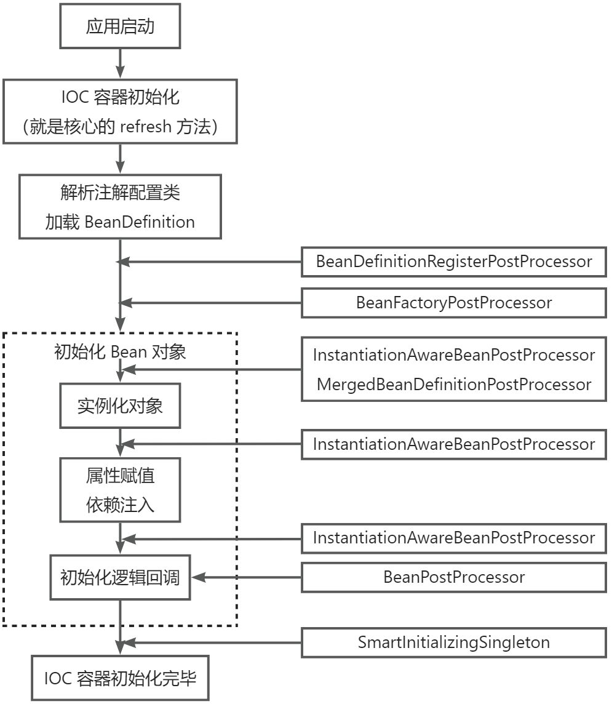

# SpringBoot 自动装配
## 自动装配
SpringBoot 的自动装配主要通过注解`@Import`完成。该注解作用在自动配置类上，只有一个属性，可填写被`@Configuration、@Component`标注的类以及实现了`org.springframework.context.annotation.ImportSelector、org.springframework.context.annotation.ImportBeanDefinitionRegistrar`接口的子类。

+ 实现 ImportSelector 接口时需要实现`selectImports`方法，该方法用于向容器中注入一个组件或者配置。以下为示例：

```java
public class BarImportSelector implements ImportSelector {
    @Override
    public String[] selectImports(AnnotationMetadata annotationMetadata) {
        return new String[] {Bar.class.getName(), BarConfiguration.class.getName()};
    }
}

@Configuration
public class BarConfiguration {
    @Bean
    public Bar bbbar() {
        return new Bar();
    }
}
```

+ ImportBeanDefinitionRegistrar 用于向 spring 容器中注入新的组件（该组件可以是临时自行定义的）。这个新的组件指的是`BeanDefinition`也就是 bean 的元数据，以下为示例：

```java
public class WaiterRegister implements ImportBeanDefinitionRegistrar {
    @Override
    public void registerBeanDefinitions(AnnotationMetadata importingClassMetadata, BeanDefinitionRegistry registry) {
        registry.registerBeanDefinition("waiter", new RootBeanDefinition(Waiter.class));
    }
}
```

+ `DeferredImportSelector`主要用于实现条件装配，实现该接口的类加载时机位于 ImportSelector 之后 ImportBeanDefinitionRegistrar 之前。示例如下：

```java
public class WaiterDeferredImportSelector implements DeferredImportSelector {
    @Override
    public String[] selectImports(AnnotationMetadata annotationMetadata) {
        return new String[] {Waiter.class.getName()};
    }
}
```

## 条件装配
Spring Boot 的条件装配主要依赖`@Profile`和`@Condition`两大注解。

+ `@Profile`注解用于标注在`@Component`类上，其属性填写需要生效的环境名称（可填写多个），缺点是过于宽泛
+ `@Conditional`提供了更为精细的控制。它与实现了`org.springframework.context.annotation.Condition`接口的类进行关联，在实现类中可手写是否需要生效逻辑。基于此注解，Spring Boot 扩展实现了 ConditionalOnxxx 等注解用于判断组件是否需要自动引入

## SPI
SPI（Service Provider Interface）即通过接口定义来加载具体的实现类，由于 JDK 自身的 SPI 定义过于简陋，因此大部分的三方框架都有自定义的 SPI，Spring 也是

+ JDK SPI：JDK 的 SPI 实现需要先定义接口（抽象类也行）以及实现类，然后在 META-INF/services 目录下新建文件名同接口（抽象类）的全限定名，文件内写实现类的全限定名，如有多个按行展开即可。最后通过指定的方法进行加载

```java
import java.util.ServiceLoader;
import java.util.stream.Stream;

public static void main(String[] args) {
    ServiceLoader<Bar> load = ServiceLoader.load(Bar.class);
    load.forEach(System.out::println);
}
```

+ Spring SPI：Spring 的 SPI 则是通过在 META-INF 目录下新建 spring.factories 文件，其书写规则为：类/接口/注解的全限定名 为 key，实现类为 value 的全限定名，多个实现类以`,`进行分隔。参考 spring-boot-autoconfiguration

```properties
org.springframework.context.ApplicationContextInitializer=\
org.springframework.boot.autoconfigure.SharedMetadataReaderFactoryContextInitializer,\
org.springframework.boot.autoconfigure.logging.ConditionEvaluationReportLoggingListener

org.springframework.context.ApplicationListener=\
org.springframework.boot.autoconfigure.BackgroundPreinitializer
```

加载时通过 Spring 提供的方法进行加载

```java
import org.springframework.core.io.support.SpringFactoriesLoader;
public static void main(String[] args) {
    // 加载 bean
    List<Bar> beans = SpringFactoriesLoader.loadFactories(Bar.class, Thread.currentThread().getContextClassLoader());
    // 加载 bean 名称
    List<String> beanNames = SpringFactoriesLoader.loadFactoryNames(Bar.class, Thread.currentThread().getContextClassLoader());
}
```

Spring SPI 在加载配置类时底层缓存了所有加载过的类，因此重复调用也不存在性能问题，具体实现如下：

```java
public static <T> List<T> loadFactories(Class<T> factoryType, @Nullable ClassLoader classLoader) {
    ClassLoader classLoaderToUse = classLoader;
    if (classLoaderToUse == null) {
        classLoaderToUse = SpringFactoriesLoader.class.getClassLoader();
    }
    // 获取加载指定 bean 类型的全限定名
    List<String> factoryImplementationNames = loadFactoryNames(factoryType, classLoaderToUse);
    if (logger.isTraceEnabled()) {
        logger.trace("Loaded [" + factoryType.getName() + "] names: " + factoryImplementationNames);
    }
    List<T> result = new ArrayList<>(factoryImplementationNames.size());
    // 前面以及得到了类的全限定名，这里直接通过反射加载生成实例
    for (String factoryImplementationName : factoryImplementationNames) {
        result.add(instantiateFactory(factoryImplementationName, factoryType, classLoaderToUse));
    }
    // 排序后进行返回
    AnnotationAwareOrderComparator.sort(result);
    return result;
}

public static List<String> loadFactoryNames(Class<?> factoryType, @Nullable ClassLoader classLoader) {
    String factoryTypeName = factoryType.getName();
    return loadSpringFactories(classLoader).getOrDefault(factoryTypeName, Collections.emptyList());
}

private static Map<String, List<String>> loadSpringFactories(@Nullable ClassLoader classLoader) {
    // 缓存中有则直接返回
    MultiValueMap<String, String> result = cache.get(classLoader);
    if (result != null) {
        return result;
    }
    // 通过类加载器加载所有 jar 下的 META-INF/spring.factories 文件 
    try {
        Enumeration<URL> urls = (classLoader != null ?
                                 classLoader.getResources(FACTORIES_RESOURCE_LOCATION) :
                                 ClassLoader.getSystemResources(FACTORIES_RESOURCE_LOCATION));
        result = new LinkedMultiValueMap<>();
        // 循环遍历并解析成 properties，这里使用的是 MultiValueMap，对应一个 key 有多个 value
        while (urls.hasMoreElements()) {
            URL url = urls.nextElement();
            UrlResource resource = new UrlResource(url);
            Properties properties = PropertiesLoaderUtils.loadProperties(resource);
            for (Map.Entry<?, ?> entry : properties.entrySet()) {
                String factoryTypeName = ((String) entry.getKey()).trim();
                for (String factoryImplementationName : StringUtils.commaDelimitedListToStringArray((String) entry.getValue())) {
                    result.add(factoryTypeName, factoryImplementationName.trim());
                }
            }
        }
        // 放入缓存中
        cache.put(classLoader, result);
        return result;
    }
    catch (IOException ex) {
        throw new IllegalArgumentException("Unable to load factories from location [" +
                                           FACTORIES_RESOURCE_LOCATION + "]", ex);
    }
}

private static <T> T instantiateFactory(String factoryImplementationName, Class<T> factoryType, ClassLoader classLoader) {
    try {
        // 通过反射加载类（这里底层用的还是 Class.forName，Spring 这里多了缓存和数组类生成机制）
        Class<?> factoryImplementationClass = ClassUtils.forName(factoryImplementationName, classLoader);
        if (!factoryType.isAssignableFrom(factoryImplementationClass)) {
            throw new IllegalArgumentException(
                "Class [" + factoryImplementationName + "] is not assignable to factory type [" + factoryType.getName() + "]");
        }
        // 反射生成新的实例（本质用的还是 java 的反射实现，Spring 这里多了对构造方法的访问权限判断）
        return (T) ReflectionUtils.accessibleConstructor(factoryImplementationClass).newInstance();
    }
    catch (Throwable ex) {
        throw new IllegalArgumentException(
            "Unable to instantiate factory class [" + factoryImplementationName + "] for factory type [" + factoryType.getName() + "]",
            ex);
    }
}
```

## @SpringBootApplication 注解分析
`@SpringBootApplication`是一个复合注解，它是由`@SpringBootConfiguration、@EnableAutoConfiguration、@ComponentScan`组合而成。在 1.2.0 版本之前需要用户主动在 Spring Boot 的主启动类上声明这三个注解。以下为这三个注解作用详解

+ @ComponentScan 用于扫描主启动类以及其下子包中的所有组件。Spring Boot 的主启动类默认在所有类包的最外层（只有这样才能扫描到所有的组件，当然也可通过注解属性对扫描包进行自定义）它默认使用了两个过滤器
    1. TypeExcludeFilter：通过类型判断排除需要加载的组件
    2. AutoConfigurationExcludeFilter 用于排除在 spring.factories 中定义的需要自动装配的配置类
+ @SpringBootConfiguration 乍一看只是 @Configuration 注解的别名，实际用于 Spring Boot Test 运行时寻找配置类的入口（被 @SpringBootConfiguration、@SpringBootApplication 标注的类）
+ @EnableAutoConfiguration 是 Spring Boot 实现自动装配的核心，该注解用于启用 Spring Boot 的自动装配，根据导入的依赖和配置合理的加载所需内容。该注解同样是一个复合注解，由`@AutoConfigurationPackage、@Import(AutoConfigurationImportSelector.class)`组合而来
    1. @AutoConfigurationPackage 相当于 @Import(AutoConfigurationPackages.Registrar.class) 注解的别名（该注解在 2.3.0 之前不可指定包路径和类路径），AutoConfigurationPackages.Registrar.class 类用于将主启动类子路径注册到容器中。该路径主要由两个用途：提供给 Spring Boot 自身使用以及提供给三方的 starters 使用，以下为注册实现：

```java
static class Registrar implements ImportBeanDefinitionRegistrar, DeterminableImports {
    @Override
    public void registerBeanDefinitions(AnnotationMetadata metadata, BeanDefinitionRegistry registry) {
        // 直接向容器中注册 bean，通过注解的 AnnotationMetadata 可获取到标注类的包名
        register(registry, new PackageImports(metadata).getPackageNames().toArray(new String[0]));
    }
    @Override
    public Set<Object> determineImports(AnnotationMetadata metadata) {
        return Collections.singleton(new PackageImports(metadata));
    }
}

PackageImports(AnnotationMetadata metadata) {
    // 获取被 AutoConfigurationPackage 注解标注的类
    AnnotationAttributes attributes = AnnotationAttributes
    .fromMap(metadata.getAnnotationAttributes(AutoConfigurationPackage.class.getName(), false));
    List<String> packageNames = new ArrayList<>();
    // 提取 basePackages 属性的值（多个）
    for (String basePackage : attributes.getStringArray("basePackages")) {
        packageNames.add(basePackage);
    }
    // 提取 basePackageClasses 属性的值（多个）
    for (Class<?> basePackageClass : attributes.getClassArray("basePackageClasses")) {
        packageNames.add(basePackageClass.getPackage().getName());
    }
    // 如果未手动指定基础包名或者类则使用被 @SpringBootApplication 标注的主启动类子包
    if (packageNames.isEmpty()) {
        packageNames.add(ClassUtils.getPackageName(metadata.getClassName()));
    }
    this.packageNames = Collections.unmodifiableList(packageNames);
}

public static void register(BeanDefinitionRegistry registry, String... packageNames) {
    // 如果容器中已经有了 AutoConfigurationPackages.class（BEAN 就是）那就修改该 bean
    // 的构造方法，传入子包路径
    if (registry.containsBeanDefinition(BEAN)) {
        BeanDefinition beanDefinition = registry.getBeanDefinition(BEAN);
        ConstructorArgumentValues constructorArguments = beanDefinition.getConstructorArgumentValues();
        constructorArguments.addIndexedArgumentValue(0, addBasePackages(constructorArguments, packageNames));
    }
    // 如果没有包含则创建一个新的 beanDefinition，构造方法同样传入子包路径
    else {
        GenericBeanDefinition beanDefinition = new GenericBeanDefinition();
        beanDefinition.setBeanClass(BasePackages.class);
        beanDefinition.getConstructorArgumentValues().addIndexedArgumentValue(0, packageNames);
        beanDefinition.setRole(BeanDefinition.ROLE_INFRASTRUCTURE);
        registry.registerBeanDefinition(BEAN, beanDefinition);
    }
}
```

    2. @Import(AutoConfigurationImportSelector.class) 用于加载自动配置类，AutoConfigurationImportSelector 重写了 DeferredImportSelector 接口的 getImportGroup 方法，其核心实现都在`org.springframework.boot.autoconfigure.AutoConfigurationImportSelector.AutoConfigurationGroup#process`中

```java
@Override
public void process(AnnotationMetadata annotationMetadata, DeferredImportSelector deferredImportSelector) {
    Assert.state(deferredImportSelector instanceof AutoConfigurationImportSelector,
                 () -> String.format("Only %s implementations are supported, got %s",
                                     AutoConfigurationImportSelector.class.getSimpleName(),
                                     deferredImportSelector.getClass().getName()));
    // 获取需要加载的配置类
    AutoConfigurationEntry autoConfigurationEntry = ((AutoConfigurationImportSelector) deferredImportSelector)
    .getAutoConfigurationEntry(annotationMetadata);
    this.autoConfigurationEntries.add(autoConfigurationEntry);
    for (String importClassName : autoConfigurationEntry.getConfigurations()) {
        this.entries.putIfAbsent(importClassName, annotationMetadata);
    }
}

protected AutoConfigurationEntry getAutoConfigurationEntry(AnnotationMetadata annotationMetadata) {
    if (!isEnabled(annotationMetadata)) {
        return EMPTY_ENTRY;
    }
    AnnotationAttributes attributes = getAttributes(annotationMetadata);
    // 通过 SPI 加载自动配置类 
    List<String> configurations = getCandidateConfigurations(annotationMetadata, attributes);
    // 去除重复的配置类 
    configurations = removeDuplicates(configurations);
    // 获取要显示移除的配置类
    Set<String> exclusions = getExclusions(annotationMetadata, attributes);
    // 校验这些类是存在的
    checkExcludedClasses(configurations, exclusions);
    // 去除无需引入的配置类
    configurations.removeAll(exclusions);
    // 这里是配置需要过滤的配置类
    configurations = getConfigurationClassFilter().filter(configurations);
    // 广播 AutoConfigurationImportEvent 事件
    fireAutoConfigurationImportEvents(configurations, exclusions);
    return new AutoConfigurationEntry(configurations, exclusions);
}
```

## WebMVC 场景下自动装配
### Servlet 装配
在引入 spring-boot-starter-web 组件后，Spring Boot 将自动启用 WebMvc 环境的自动装配，该组件的核心配置类为`org.springframework.boot.autoconfigure.web.servlet.WebMvcAutoConfiguration`要使该配置类生效需满足以下几个条件：

+ 当前环境必须是 WebMvc（Servlet 环境）导入 WebMvc 依赖后自动生效（若同时导入 WebFlux 则 WebMvc 生效）
+ 当前类的路径下必须有`Servlet、DispatcherServlet、WebMvcConfigurer`
+ 项目中未自定义注册 WebMvcConfigurationSupport 的类或者子类

```java
@Configuration(proxyBeanMethods = false)
@ConditionalOnWebApplication(type = Type.SERVLET)
@ConditionalOnClass({ Servlet.class, DispatcherServlet.class, WebMvcConfigurer.class })
@ConditionalOnMissingBean(WebMvcConfigurationSupport.class)
@AutoConfigureOrder(Ordered.HIGHEST_PRECEDENCE + 10)
@AutoConfigureAfter({ DispatcherServletAutoConfiguration.class, TaskExecutionAutoConfiguration.class,
		ValidationAutoConfiguration.class })
public class WebMvcAutoConfiguration {
                     
}

@AutoConfigureOrder(Ordered.HIGHEST_PRECEDENCE)
@Configuration(proxyBeanMethods = false)
@ConditionalOnWebApplication(type = Type.SERVLET)
@ConditionalOnClass(DispatcherServlet.class)
@AutoConfigureAfter(ServletWebServerFactoryAutoConfiguration.class)
public class DispatcherServletAutoConfiguration {
 
}

@Configuration(proxyBeanMethods = false)
@AutoConfigureOrder(Ordered.HIGHEST_PRECEDENCE)
@ConditionalOnClass(ServletRequest.class)
@ConditionalOnWebApplication(type = Type.SERVLET)
@EnableConfigurationProperties(ServerProperties.class)
@Import({ ServletWebServerFactoryAutoConfiguration.BeanPostProcessorsRegistrar.class,
ServletWebServerFactoryConfiguration.EmbeddedTomcat.class,
ServletWebServerFactoryConfiguration.EmbeddedJetty.class,
ServletWebServerFactoryConfiguration.EmbeddedUndertow.class })
public class ServletWebServerFactoryAutoConfiguration {
    // 用于传入默认的配置
	@Bean
	public ServletWebServerFactoryCustomizer servletWebServerFactoryCustomizer(ServerProperties serverProperties) {
		return new ServletWebServerFactoryCustomizer(serverProperties);
	}
    // 用于传入默认的配置
	@Bean
	@ConditionalOnClass(name = "org.apache.catalina.startup.Tomcat")
	public TomcatServletWebServerFactoryCustomizer tomcatServletWebServerFactoryCustomizer(
			ServerProperties serverProperties) {
		return new TomcatServletWebServerFactoryCustomizer(serverProperties);
	}
    // 添加转发头过滤器
	@Bean
	@ConditionalOnMissingFilterBean(ForwardedHeaderFilter.class)
	@ConditionalOnProperty(value = "server.forward-headers-strategy", havingValue = "framework")
	public FilterRegistrationBean<ForwardedHeaderFilter> forwardedHeaderFilter() {
		ForwardedHeaderFilter filter = new ForwardedHeaderFilter();
		FilterRegistrationBean<ForwardedHeaderFilter> registration = new FilterRegistrationBean<>(filter);
		registration.setDispatcherTypes(DispatcherType.REQUEST, DispatcherType.ASYNC, DispatcherType.ERROR);
		registration.setOrder(Ordered.HIGHEST_PRECEDENCE);
		return registration;
	}
}
```

根据注解中体现的先后顺序可知，WebMvc 自动装配环节为：Servlet 装配 -> DispatcherServlet 装配 -> WebMvc 装配。EmbeddedTomcat、EmbeddedJetty、EmbeddedUndertow 这三个类用于判断该实例化哪个容器（默认是 tomcat）BeanPostProcessorsRegistrar 用于向容器中注册两个后置处理器（主要用于定制化容器内容），源码如下：

```java
@Override
public void registerBeanDefinitions(AnnotationMetadata importingClassMetadata,
                                    BeanDefinitionRegistry registry) {
    if (this.beanFactory == null) {
        return;
    }
    // 用于定制化 WebServer 配置，例如自定义一些额外的路由
    registerSyntheticBeanIfMissing(registry, "webServerFactoryCustomizerBeanPostProcessor",
                                   WebServerFactoryCustomizerBeanPostProcessor.class);
    // 用于自定义错误页面
    registerSyntheticBeanIfMissing(registry, "errorPageRegistrarBeanPostProcessor",
                                   ErrorPageRegistrarBeanPostProcessor.class);
}
```

tomcat 的配置的默认值可以在 spring-boot-autoconfigure 包下的 META-INF/spring-configuration-metadata.json 中找到

### DispatcherServlet 装配
Spring Boot 项目默认使用 Servlet 3.0 以上的规范，即不再使用 web.xml 进行配置转而引入`@WebServlet、@WebFilter、@WebListener`注解进行配置。Spring Boot 本身并不支持扫描 Servlet 三大组件（Servlet、Filter、Listener）它提供了另外的两种注册方式：

1. 在主启动类上添加 @ServletComponentScan，该注解用于扫项目中的自定义 Servlet 原生组件
2. 借助辅助注册器 RegistrationsBean，该方式一般用于引入三方 jar 包中存在的 Servlet 原生组件。本质是通过实现 ServletContextInitializer 接口注册 bean 的方式使得，Servlet 上下文初始化后调用钩子方法完成注册。

DispatchServlet 注册流程为：首先通过 DispatcherServletConfiguration 注册 DispatcherServlet 自己（本质就是 HttpServlet）-> 通过 DispatcherServletRegistrationConfiguration （上面的第二种方法）注册到 Spring Boot 中

```java
public static final String DEFAULT_DISPATCHER_SERVLET_BEAN_NAME = "dispatcherServlet";

/**
	 * The bean name for a ServletRegistrationBean for the DispatcherServlet "/".
	 */
public static final String DEFAULT_DISPATCHER_SERVLET_REGISTRATION_BEAN_NAME = "dispatcherServletRegistration";

@Configuration(proxyBeanMethods = false)
@Conditional(DefaultDispatcherServletCondition.class)
@ConditionalOnClass(ServletRegistration.class)
@EnableConfigurationProperties(WebMvcProperties.class)
protected static class DispatcherServletConfiguration {

    @Bean(name = DEFAULT_DISPATCHER_SERVLET_BEAN_NAME)
    public DispatcherServlet dispatcherServlet(WebMvcProperties webMvcProperties) {
        // 注册自己
        DispatcherServlet dispatcherServlet = new DispatcherServlet();
        dispatcherServlet.setDispatchOptionsRequest(webMvcProperties.isDispatchOptionsRequest());
        dispatcherServlet.setDispatchTraceRequest(webMvcProperties.isDispatchTraceRequest());
        dispatcherServlet.setThrowExceptionIfNoHandlerFound(webMvcProperties.isThrowExceptionIfNoHandlerFound());
        dispatcherServlet.setPublishEvents(webMvcProperties.isPublishRequestHandledEvents());
        dispatcherServlet.setEnableLoggingRequestDetails(webMvcProperties.isLogRequestDetails());
        return dispatcherServlet;
    }

    @Bean
    @ConditionalOnBean(MultipartResolver.class)
    @ConditionalOnMissingBean(name = DispatcherServlet.MULTIPART_RESOLVER_BEAN_NAME)
    public MultipartResolver multipartResolver(MultipartResolver resolver) {
        // Detect if the user has created a MultipartResolver but named it incorrectly
        return resolver;
    }

}

@Configuration(proxyBeanMethods = false)
@Conditional(DispatcherServletRegistrationCondition.class)
@ConditionalOnClass(ServletRegistration.class)
@EnableConfigurationProperties(WebMvcProperties.class)
@Import(DispatcherServletConfiguration.class)
protected static class DispatcherServletRegistrationConfiguration {

    @Bean(name = DEFAULT_DISPATCHER_SERVLET_REGISTRATION_BEAN_NAME)
    @ConditionalOnBean(value = DispatcherServlet.class, name = DEFAULT_DISPATCHER_SERVLET_BEAN_NAME)
    public DispatcherServletRegistrationBean dispatcherServletRegistration(DispatcherServlet dispatcherServlet,
                                                                           WebMvcProperties webMvcProperties, ObjectProvider<MultipartConfigElement> multipartConfig) {
        // 注册到 spring boot 中
        DispatcherServletRegistrationBean registration = new DispatcherServletRegistrationBean(dispatcherServlet,
                                                                                               webMvcProperties.getServlet().getPath());
        registration.setName(DEFAULT_DISPATCHER_SERVLET_BEAN_NAME);
        registration.setLoadOnStartup(webMvcProperties.getServlet().getLoadOnStartup());
        multipartConfig.ifAvailable(registration::setMultipartConfig);
        return registration;
    }
}
```

### SpringMvc 装配
当 Serverlet 和 DispatcherServlet 都装配完成后，就是 SpringMvc 的装配了。SpringMvc 的装配主要依赖其下的两个子类`WebMvcAutoConfigurationAdapter、EnableWebMvcConfiguration`

+ WebMvcAutoConfigurationAdapter 用于配置消息转换器、异步支持、 url 匹配、视图解析、国际化支持等
+ EnableWebMvcConfiguration 用于注册 HandleMapping（url 映射）、HandleAdapter（url 对应的处理逻辑）、全局异常处理、静态资源解析、欢迎页面、index 页面等

具体定义可查看`org.springframework.boot.autoconfigure.web.servlet.WebMvcAutoConfiguration`

# IOC 容器
## Spring IOC 容器
+ BeanFactory 作为 IOC 容器的顶层抽象，它定义了最基础的 bean 对象管理，主要有以下几方面的特性：
    - 基础的容器
    - 定义了作用域的概念
    - 集成环境配置
    - 支持多种类型的配置源
    - 层次性设计
    - 完整的生命周期控制机制
+ HierarchicalBeanFactory 作为 BeanFactory 的直接子类仅仅多了父子结构。对于父子结构就是对多个 Spring 上下文的关系描述

```java
public static void main(String[] args) {
    AnnotationConfigApplicationContext ctx1 = new AnnotationConfigApplicationContext(BeanDefinitionConfiguration.class);
    AnnotationConfigApplicationContext ctx2 = new AnnotationConfigApplicationContext(BeanDefinitionConfiguration.class);
    // 这里 ctx2 就是 ctx1 的父容器
    ctx1.setParent(ctx2);
}
```

+ ListableBeanFactory 同样作为 BeanFactory 的直接子类实现了容器中 bean 的可选择性列举。可选择性列举表示为两点：
    1. 不会列举父容器中的 bean
    2. 不会列举通过`beanFactory.registerSingleton()`注册的 bean（主要用于向外部隐藏 Spring 的内部组件）
+ AutowireCapableBeanFactory 用于提供给那些没有被 Spring Framework 管理的 bean 自动注入支持，通常用于与第三方框架进行集成（通过该接口注入 bean 时 Spring 将无法控制 bean 的生命周期，这里很好理解毕竟是三方的 bean 无法预知）
+ ConfigurableBeanFactory 接口提供了对容器中 bean 的写入操作（Spring 的类起名都非常规范，一般带有 Configurable 表示这个类提供 set 方法可以进行修改，反之则只读）但是获取 ConfigurableBeanFactory 已经是在 Spring 上下文初始化完成了，文档也强烈不推荐使用该接口提供的方法对容器中的 bean 进行修改
+ DefaultListableBeanFactory 是目前底层唯一在使用 BeanFactory 落地实现，它完成了注册 bean 定义信息的动作，由此可见完整的 BeanFactory 对 bean 管理应该是：先注册 bean 的定义信息再完成 bean 的创建和初始化动作
+ ApplicationContext 是基于 BeanFactory 的拓展接口，它提供了更为强大功能具体体现在：更多访问 bean 的方法、加载文件资源、事件发布、国际化支持、层级关系支持（这里的层级关系指的是动态增强、资源记载、事件监听机制等多方面扩展功能）这些拓展主要是通过继承对应的接口实现的
+ ConfigurableApplicationContext 继承 ApplicationContext 接口提供了修改能力，它会被绝大多数的 ApplicationContext 最终实现类实现。该类提供了对 Spring 上下文进行刷新的 refresh 方法，主要流程为：注册新的 bean -> 调用 refresh 方法 -> 销毁上下文方法
+ AbstractApplicationContext 中对 refresh 流程进行了定义（<font style="color:#DF2A3F;">Spring 上下文初始化核心流程，非常重要</font>）同时也会将自己作为一个 bean 注册到容器中以支持不同类型组件注入
+ GenericApplicationContext 用于实现注解驱动 IOC 容器，作为通用的 ApplicationContext 实现，它只被允许刷新一次上下文，xml 配置文件之类的实现可实现重复刷新。除此之外它还聚合了 DefaultListableBeanFactory 用于自定义 bean 之类的操作

实际项目开发时应该选择 ApplicationContext，而不是 BeanFactory。前者提供了 bean 的生命周期管理、bean 后置处理器、 beanFactory 后置处理器、国际化以及事件发布机制

## Spring Boot IOC 容器
Spring Boot 本身没有直接使用 Spring 现有的 IOC 容器，而是针对嵌入式 Web 容器这块拓展出更为强大的 IOC 容器，在 Spring Boot2.x 版本中额外添加了 WebFlux 与 WebMvc 平级提供了响应式的 Web 编程实现

+ WebServerApplicationContext 直接对 ApplicationContext 进行拓展，添加了`getWebServer`之一重要方法
+ AnnotationConfigServletWebServerApplicationContext 用于整合 WebMvc 的最终落地实现
+ ReactiveWebServerApplicationContext 和 AnnotationConfigReactiveWebServerApplicationContext 则主要针对 WebFlux 进行拓展和最终落地实现

## BeanDefinition
该接口用于定义描述 bean 的元信息，其中主要包含以下几个部分（`org.springframework.beans.factory.config.BeanDefinition`）：

+ Bean 的类信息：全限定名（beanClassName）
+ Bean 的属性：作用域（scope）、是否默认 Bean（primary）、描述信息（description）等
+ Bean 的行为特性：是否延迟加载（lazy）、是否自动注入（autoWireCandidate）、初始化/销毁方法（initMethod/destroyMethod）等
+ Bean 与其它 Bean 的关系：父 Bean 名称（parentName）、依赖的 Bean（dependOn）等
+ Bean 的配置属性：构造方法参数（constructorArgumentValues）、属性变量值（PropertyValues）等

BeanDefinition 并非顶级接口，其上下均有父接口和实现。以下列举一些比较重要的类：

+ AttributeAccessor 用于提供对 Bean 属性进行增、删、改、查的方法
+ BeanMetadataElement 用于获取容器中 Bean 的加载来源，大多数情况是从 URL 中进行加载
+ AbstractBeanDefinition 用于提取具体实现类的公共实现（实现模板方法）其实已经实现了绝大多数的方法
+ GenericBeanDefinition 具有层次性，其作为默认的 BeanDefinition，支持在后置处理器中动态的变更父 BeanDefinition
+ ChildBeanDefinition 则必须指定父 BeanDefinition
+ RootBeanDefinition 只能单独作为 BeanDefinition 或者父 BeanDefinition 出现，绝大多是情况下不允许变更父 BeanDefinition

BeanDefinitionRegistry 用于管理所有的 BeanDefinition，具体实现为`org.springframework.beans.factory.support.DefaultListableBeanFactory`

## 后置处理器
Spring 中的后置处理器主要分为两种类型：

1. BeanPostProcessor 用于对 Bean 对象进行后置处理，其切入时机是在 Bean 对象初始化阶段前后。一般用于在 Bean 对象初始化阶段前后添加自定义逻辑
2. BeanFactoryPostProcessor 用于对 BeanDefinition 进行后置处理，切入时机是在所有 BeanDefinition 都注册到 BeanDefinitionRegistry 后。一般用于修改已经存在的 BeanDefinition

上述两种类型只是主要接口，除此之外还有一些拓展子接口，其切入时机分布在 IOC 容器生命周期的各个阶段，如下图所示：



以下是一些重要的后置处理器方法调用时机说明：

```java
public interface BeanPostProcessor {
    // 属性赋值&依赖注入之后初始化逻辑回调之前（也就是 @PostContruct 之前）
	@Nullable
	default Object postProcessBeforeInitialization(Object bean, String beanName) throws BeansException {
		return bean;
	}
    // 初始化逻辑之后，也就是 init-method 之后
	@Nullable
	default Object postProcessAfterInitialization(Object bean, String beanName) throws BeansException {
		return bean;
	}
}
```

```java
public interface InstantiationAwareBeanPostProcessor extends BeanPostProcessor {
    // 实例化 Bean 对象之前
	@Nullable
	default Object postProcessBeforeInstantiation(Class<?> beanClass, String beanName) throws BeansException {
		return null;
	}
    // 实例化对象之后
	default boolean postProcessAfterInstantiation(Object bean, String beanName) throws BeansException {
		return true;
	}
    // 实例化对象之后
	@Nullable
	default PropertyValues postProcessProperties(PropertyValues pvs, Object bean, String beanName)
			throws BeansException {
		return null;
	}

}
```

```java
@FunctionalInterface
public interface BeanFactoryPostProcessor {
    // 初始化 Bean 对象之前
	void postProcessBeanFactory(ConfigurableListableBeanFactory beanFactory) throws BeansException;
}
```

```java
public interface BeanDefinitionRegistryPostProcessor extends BeanFactoryPostProcessor {
    // 初始化 Bean 对象之前（位于 BeanFactoryPostProcessor 之前）
	void postProcessBeanDefinitionRegistry(BeanDefinitionRegistry registry) throws BeansException;
}
```

# SpringApplicationRunListener
在对 Spring Boot 做一些系统级别的事件监听时，通常不能使用`@Component`注解等常规的 Bean 注册方法实现。原因很简单：Spring 在广播事件时通过注解实现的这些监听器还未注册，解决方法有两种：

1. 通过实现`org.springframework.boot.SpringApplicationRunListener`接口对应的方法，然后配置到 spring.factories 中通过 SPI 机制自动加载
2. 实现`org.springframework.boot.SpringApplicationRunListener`接口对应的方法，然后通过手动编程对监听器进行注册

```java
@SpringBootApplication
public class Demo03Application {
    public static void main(String[] args) {
        // 1. 直接创建 SpringApplication
        SpringApplication springApplication = new SpringApplication(Demo03Application.class);
        springApplication.addListeners(event -> {
        });
        springApplication.run(args);
        // 2. 链式调用，本质和 1 一样
        SpringApplicationBuilder springApplicationBuilder = new SpringApplicationBuilder();
        springApplicationBuilder.main(Demo03Application.class).listeners(event -> {}).run(args);
    }
}
```

上述代码是通过 lambda 直接实现的 ApplicationListener 接口，如果是实现 SpringApplicationRunListener 接口则必须在实现类中定义一个两个参数的构造方法，如下所示：

```java
public class Demo03Application implements SpringApplicationRunListener {
    public Demo03Application(SpringApplication application, String[] args) {
    }
}
```

下表为 SpringApplicationRunListener 接口可监听事件说明：

| 接口方法 | 事件类型 | 可获得的组件 | 回调时机 |
| --- | --- | --- | --- |
| starting | ApplicationStartingEvent | 无 | 调用 SpringApplication 的 run 方法时立刻调用 |
| environmentPrepared | ApplicationEnvironmentPreparedEvent | ConfigurableEnvironment | Environment 构建完成，但在创建 ApplicationContext 之前 |
| contextPrepared | ConfigurableApplicationContext | ApplicationContextInitializedEvent | 创建和准备 ApplicationContext 之后，但在加载之前 |
| contextLoaded | ConfigurableApplicationContext | ApplicationPreparedEvent | ApplicationContext 已加载，但尚未刷新容器时 |
| started | ConfigurableApplicationContext | ApplicationStartedEvent | IOC 容器已刷新。但未调用 CommandLineRunners 和 ApplicationRunners 时 |
| running | ConfigurableApplicationContext | ApplicationReadyEvent | 在 run 方法彻底完成之前 |
| failed | ConfigurableApplicationContext，Throwable | ApplicationFailedEvent | run 方法执行过程中抛出异常时 |


# Spring Boot 启动流程
Spring Boot 启动流程如下：

## 创建 Application
大多数情况下 Spring Boot 应用启动类都是上面标注`@SpringBootApplication`然后在 main 方法中直接调用`SpringApplication.run`运行，在 run 之前首先要创建 SpringApplication，源码如下：

```java
// 将主启动类包装成数组
public static ConfigurableApplicationContext run(Class<?> primarySource, String... args) {
    return run(new Class<?>[] { primarySource }, args);
}
// 创建 SpringApplication 然后调用 run 方法，这里先只看 SpringApplication 创建
public static ConfigurableApplicationContext run(Class<?>[] primarySources, String[] args) {
    return new SpringApplication(primarySources).run(args);
}
// 重载调用
public SpringApplication(Class<?>... primarySources) {
    this(null, primarySources);
}
// SpringApplication 构造方法
public SpringApplication(ResourceLoader resourceLoader, Class<?>... primarySources) {
    this.resourceLoader = resourceLoader;
    Assert.notNull(primarySources, "PrimarySources must not be null");
    // 记录主启动类
    this.primarySources = new LinkedHashSet<>(Arrays.asList(primarySources));
    // 判断应用环境
    this.webApplicationType = WebApplicationType.deduceFromClasspath();
    // 设置重对象预初始化器，该初始化器从 2.4.0 版本开始引入，目的是通过 BootstrapRegistryInitializer
    // 提前注册一些创建耗时的重对象，这些注册的对象会在 ApplicationContext 初始化之前进行预创建
    this.bootstrapRegistryInitializers = new ArrayList<>(
        getSpringFactoriesInstances(BootstrapRegistryInitializer.class));
    // 设置应用初始化器
    setInitializers((Collection) getSpringFactoriesInstances(ApplicationContextInitializer.class));
    // 设置监听器（原理同上）
    setListeners((Collection) getSpringFactoriesInstances(ApplicationListener.class));
    // 确认主启动类
    this.mainApplicationClass = deduceMainApplicationClass();
}
```

<font style="color:#DF2A3F;">按照环境判断逻辑，同时引入 webMvc 和 webFlux 环境时，将只有 webFlux 环境生效</font>

```java
private static final String[] SERVLET_INDICATOR_CLASSES = { "javax.servlet.Servlet",
                                                           "org.springframework.web.context.ConfigurableWebApplicationContext" };

private static final String WEBMVC_INDICATOR_CLASS = "org.springframework.web.servlet.DispatcherServlet";

private static final String WEBFLUX_INDICATOR_CLASS = "org.springframework.web.reactive.DispatcherHandler";

private static final String JERSEY_INDICATOR_CLASS = "org.glassfish.jersey.servlet.ServletContainer";

private static final String SERVLET_APPLICATION_CONTEXT_CLASS = "org.springframework.web.context.WebApplicationContext";

private static final String REACTIVE_APPLICATION_CONTEXT_CLASS = "org.springframework.boot.web.reactive.context.ReactiveWebApplicationContext";

static WebApplicationType deduceFromClasspath() {
    // 首先判断 REACTIVE 环境
    // 判断逻辑为必须包含 WEBFLUX 核心文件且同时不含 WEBMVC 和JERSEY
    if (ClassUtils.isPresent(WEBFLUX_INDICATOR_CLASS, null) && !ClassUtils.isPresent(WEBMVC_INDICATOR_CLASS, null)
        && !ClassUtils.isPresent(JERSEY_INDICATOR_CLASS, null)) {
        return WebApplicationType.REACTIVE;
    }
    // 判断既不是 REACTIVE 也不是 SERVLET
    // 判断逻辑为，均不包含 SERVLET 核心包
    for (String className : SERVLET_INDICATOR_CLASSES) {
        if (!ClassUtils.isPresent(className, null)) {
            return WebApplicationType.NONE;
        }
    }
    // 最后只能是 SERVLET
    return WebApplicationType.SERVLET;
}
```

```java
// 方法包装
private <T> Collection<T> getSpringFactoriesInstances(Class<T> type) {
    return getSpringFactoriesInstances(type, new Class<?>[] {});
}

private <T> Collection<T> getSpringFactoriesInstances(Class<T> type, Class<?>[] parameterTypes, Object... args) {
    // 获取类加载器，这里获取到的是线程上下文类加载器
    ClassLoader classLoader = getClassLoader();
    // 通过 SPI 加载 ApplicationContextInitializer 类型的配置类
    // ApplicationContextInitializer 用于在刷新容器之前初始化 ConfigurableApplicationContext
    // 一般用于根据上下文环境激活配置文件
    Set<String> names = new LinkedHashSet<>(SpringFactoriesLoader.loadFactoryNames(type, classLoader));
    // 通过反射创建实例
    List<T> instances = createSpringFactoriesInstances(type, parameterTypes, classLoader, args, names);
    // 按照 Order 进行排序
    AnnotationAwareOrderComparator.sort(instances);
    return instances;
}
```

```java
private Class<?> deduceMainApplicationClass() {
    try {
        // 通过创建异常获取当前调用堆栈
        StackTraceElement[] stackTrace = new RuntimeException().getStackTrace();
        // 遍历堆栈返回 main 方法所在的主类
        for (StackTraceElement stackTraceElement : stackTrace) {
            if ("main".equals(stackTraceElement.getMethodName())) {
                return Class.forName(stackTraceElement.getClassName());
            }
        }
    }
    catch (ClassNotFoundException ex) {
        // Swallow and continue
    }
    return null;
}
```

## 启动 SpringApplication
启动就是 run 方法的执行，源码如下：

```java
public ConfigurableApplicationContext run(String... args) {
    // 记录启动时间
    long startTime = System.nanoTime();
    // 重对象初始化
    // 这里的创建其实就是在调用在创建 SpringApplication 是注册的 
    // bootstrapRegistryInitializers
    DefaultBootstrapContext bootstrapContext = createBootstrapContext();
    ConfigurableApplicationContext context = null;
    // 设置 Spring Boot 启动无需依赖显示器
    configureHeadlessProperty();
    // 获取 SpringApplicationRunListeners 实现 SpringApplication 启动阶段的事件发布、监听
    // 这里由于之前已经在 SpringApplication 构造方法中获取了 SpringApplicationListeners
    // 因此这里是从缓存中获取的
    SpringApplicationRunListeners listeners = getRunListeners(args);
    // 发布 ApplicationStartingEvent 事件（第一个事件）
    listeners.starting(bootstrapContext, this.mainApplicationClass);
    try {
        // 封装并解析命令行传入的参数 args 并将其注册到容器中
        ApplicationArguments applicationArguments = new DefaultApplicationArguments(args);
        // 创建并将环境参数绑定到容器的 Bean 中（这里的环境会根据之前 SpringApplication 构造
        // 方法中判定的环境动态创建）同时发布 ApplicationEnvironmentPreparedEvent 事件
        ConfigurableEnvironment environment = prepareEnvironment(listeners, bootstrapContext, applicationArguments);
        // 这里只是判断并设置是否需要忽略指定的 Bean
        configureIgnoreBeanInfo(environment);
        // 根据 environment 输出 Banner
        Banner printedBanner = printBanner(environment);
        // 这里会根据之前判断的环境创建相应的 IOC 容器（注意这里只是创建，并未初始化）
        // servlet -> AnnotationConfigServletWebServerApplicationContext
        // reactive -> AnnotationConfigReactiveWebServerApplicationContext
        context = createApplicationContext();
        // 用作 spring boot 启动性能分析，提供给 metrics 使用需要配合 actator starter 使用。
        // 同时也支持提供 JFR 事件
        context.setApplicationStartup(this.applicationStartup);
        // 上下文环境准备，主要内容如下：
        // 1. 为 context 设置 environment
        // 2. IOC 容器后置处理，主要是设置 资源和类加载器
        // 3. 调用之前注册的 ApplicationContextInitializer 中的 initialize 方法
        // 4. 发布 ApplicationContextInitializedEvent 事件
        // 5. 发布 BootstrapContextClosedEvent 事件
        // 6. 将 Banner 和 参数 封装成 Bean 注册到容器中
        // 7. 加载配置源（这里就是按照扫描主类和其子包下的组件，获取其元数据 BeanDefinition）
        // 8. 发布 ApplicationPreparedEvent 事件
        prepareContext(bootstrapContext, context, environment, listeners, applicationArguments, printedBanner);
        // 刷新上下文，这里是 Spring 的核心方法
        refreshContext(context);
        // 空方法，留给以后的子类拓展使用
        afterRefresh(context, applicationArguments);
        // 记录启动过程耗费时间
        Duration timeTakenToStartup = Duration.ofNanos(System.nanoTime() - startTime);
        if (this.logStartupInfo) {
            new StartupInfoLogger(this.mainApplicationClass).logStarted(getApplicationLog(), timeTakenToStartup);
        }
        // 发布 ApplicationStartedEvent 事件
        listeners.started(context, timeTakenToStartup);
        // 调用注册的 ApplicationRunner 和 CommandLineRunner（这两个接口用于在 1.x 版本给
        // 开发者提供 Spring Boot 启动后的回调，但是现在不再使用。以后的版本都通过事件监听实现
        // ApplicationStartedEvent）
        callRunners(context, applicationArguments);
    }
    // 所有的异常都会发布 ApplicationFailedEvent 事件
    catch (Throwable ex) {
        handleRunFailure(context, ex, listeners);
        throw new IllegalStateException(ex);
    }
    try {
        Duration timeTakenToReady = Duration.ofNanos(System.nanoTime() - startTime);
        // 发布 ApplicationReadyEvent 事件
        listeners.ready(context, timeTakenToReady);
    }
    catch (Throwable ex) {
        handleRunFailure(context, ex, null);
        throw new IllegalStateException(ex);
    }
    return context;
}
```

以下是流程逐步拆解（<font style="color:#DF2A3F;">refresh 过于核心将单独进行拆解</font>）

```java
private ConfigurableEnvironment prepareEnvironment(SpringApplicationRunListeners listeners,
                                                   DefaultBootstrapContext bootstrapContext, ApplicationArguments applicationArguments) {
    // Create and configure the environment
    // 获取或者创建 ConfigurableEnvironment
    ConfigurableEnvironment environment = getOrCreateEnvironment();
    // 组合环境配置
    configureEnvironment(environment, applicationArguments.getSourceArgs());
    // 将 PropertySource 调整为 ConfigurationPropertySource，使其可用 
    // PropertySourcesPropertyResolver 进行解析
    ConfigurationPropertySources.attach(environment);
    listeners.environmentPrepared(bootstrapContext, environment);
    // 将默认配置移到最后
    DefaultPropertiesPropertySource.moveToEnd(environment);
    Assert.state(!environment.containsProperty("spring.main.environment-prefix"),
                 "Environment prefix cannot be set via properties.");
    // 这里是将配置文件中的 spring.main 开头的属性绑定到 SpringApplication 中
    bindToSpringApplication(environment);
    // 如果没有自定义占位符解析器就使用默认解析器解析
    if (!this.isCustomEnvironment) {
        EnvironmentConverter environmentConverter = new EnvironmentConverter(getClassLoader());
        environment = environmentConverter.convertEnvironmentIfNecessary(environment, deduceEnvironmentClass());
    }
    // 解析后可能会引入新的 Property 需要再次 attach 使其生效
    ConfigurationPropertySources.attach(environment);
    return environment;
}
private ConfigurableEnvironment getOrCreateEnvironment() {
    if (this.environment != null) {
        return this.environment;
    }
    // 这里会根据 Web 环境动态创建 ConfigurableEnvironment
    ConfigurableEnvironment environment = this.applicationContextFactory.createEnvironment(this.webApplicationType);
    if (environment == null && this.applicationContextFactory != ApplicationContextFactory.DEFAULT) {
        environment = ApplicationContextFactory.DEFAULT.createEnvironment(this.webApplicationType);
    }
    return (environment != null) ? environment : new ApplicationEnvironment();
}
protected void configureEnvironment(ConfigurableEnvironment environment, String[] args) {
    // 这里默认添加一个变量解析转换器
    if (this.addConversionService) {
        environment.setConversionService(new ApplicationConversionService());
    }
    // 读取配置文件，和命令行参数。后者会覆盖前者
    configurePropertySources(environment, args);
    // 这里只有通过编程式的添加 profiles 才会生效
    configureProfiles(environment, args);
}
protected void configurePropertySources(ConfigurableEnvironment environment, String[] args) {
    // 获取配置信息
    MutablePropertySources sources = environment.getPropertySources();
    // 与默认的配置整合（缺少的补充，这里相同的不会覆盖）
    if (!CollectionUtils.isEmpty(this.defaultProperties)) {
        DefaultPropertiesPropertySource.addOrMerge(this.defaultProperties, sources);
    }
    // 解析命令行参数，相同的直接覆盖
    if (this.addCommandLineProperties && args.length > 0) {
        String name = CommandLinePropertySource.COMMAND_LINE_PROPERTY_SOURCE_NAME;
        if (sources.contains(name)) {
            PropertySource<?> source = sources.get(name);
            CompositePropertySource composite = new CompositePropertySource(name);
            composite
            .addPropertySource(new SimpleCommandLinePropertySource("springApplicationCommandLineArgs", args));
            composite.addPropertySource(source);
            sources.replace(name, composite);
        }
        else {
            sources.addFirst(new SimpleCommandLinePropertySource(args));
        }
    }
}
```

```java
private Banner printBanner(ConfigurableEnvironment environment) {
    // 判断是否输出 Banner
    if (this.bannerMode == Banner.Mode.OFF) {
        return null;
    }
    // 获取资源类加载器
    ResourceLoader resourceLoader = (this.resourceLoader != null) ? this.resourceLoader
    : new DefaultResourceLoader(null);
    // 创建 SpringApplicationBannerPrinter 对象用于保存 Banner 配置
    SpringApplicationBannerPrinter bannerPrinter = new SpringApplicationBannerPrinter(resourceLoader, this.banner);
    // 至少输出到控制台如果赔了日志则输出到日志
    if (this.bannerMode == Mode.LOG) {
        return bannerPrinter.print(environment, this.mainApplicationClass, logger);
    }
    return bannerPrinter.print(environment, this.mainApplicationClass, System.out);
}

Banner print(Environment environment, Class<?> sourceClass, PrintStream out) {
    // 通过配置获取 Banner
    Banner banner = getBanner(environment);
    // 这里会把所以定义的 Banner 都输出
    banner.printBanner(environment, sourceClass, out);
    // 包装后返回，Banner 最后要注册到容器中
    return new PrintedBanner(banner, sourceClass);
}

private Banner getBanner(Environment environment) {
    // 这个 Banners 是继承 Banner 的（其实就是用 List 包了多个 Banner）
    Banners banners = new Banners();
    // 获取图片 Banner 通过 spring.banner.image.location 指定，如未指定则加载 resources 下
    // gif, jpg, png 后缀的文件
    banners.addIfNotNull(getImageBanner(environment));
    // 如果指定了 spring.banner.location 则首先加载，否则默认加载 resources 下 的 banner.txt
    banners.addIfNotNull(getTextBanner(environment));
    if (banners.hasAtLeastOneBanner()) {
        return banners;
    }
    if (this.fallbackBanner != null) {
        return this.fallbackBanner;
    }
    // 如果都为定义，则返回默认的 banner，就是什么都不配置的那款（它是直接在类中用字符串定义的）
    return DEFAULT_BANNER;
}
```

```java
private void prepareContext(DefaultBootstrapContext bootstrapContext, ConfigurableApplicationContext context,
                            ConfigurableEnvironment environment, SpringApplicationRunListeners listeners,
                            ApplicationArguments applicationArguments, Banner printedBanner) {
    // 设置环境
    context.setEnvironment(environment);
    // 这里并没有触发钩子调用，这是注册 Spring 内部需要的 Bean 以及设置类加载器
    postProcessApplicationContext(context);
    // 调用注册的 ApplicationContextInitializer 中的 initialize 方法
    applyInitializers(context);
    // 发布 ApplicationContextInitializedEvent 事件
    listeners.contextPrepared(context);
    // 通过发布事件 BootstrapContextClosedEvent 关闭 BootstrapRegistry
    bootstrapContext.close(context);
    // 输出启动性能分析日志
    if (this.logStartupInfo) {
        logStartupInfo(context.getParent() == null);
        logStartupProfileInfo(context);
    }
    // Add boot specific singleton beans
    ConfigurableListableBeanFactory beanFactory = context.getBeanFactory();
    // 将启动参数 Bean 注册到容器中
    beanFactory.registerSingleton("springApplicationArguments", applicationArguments);
    // 将 Banner 注册到容器中
    if (printedBanner != null) {
        beanFactory.registerSingleton("springBootBanner", printedBanner);
    }
    // 如果允许循环依赖
    if (beanFactory instanceof AbstractAutowireCapableBeanFactory) {
        ((AbstractAutowireCapableBeanFactory) beanFactory).setAllowCircularReferences(this.allowCircularReferences);
        if (beanFactory instanceof DefaultListableBeanFactory) {
            ((DefaultListableBeanFactory) beanFactory)
            .setAllowBeanDefinitionOverriding(this.allowBeanDefinitionOverriding);
        }
    }
    // 如果是懒加载则添加懒加载处理 BeanFactoryPostProcessor
    if (this.lazyInitialization) {
        context.addBeanFactoryPostProcessor(new LazyInitializationBeanFactoryPostProcessor());
    }
    // 添加资源文件顺序处理 BeanFactoryPostProcessor
    context.addBeanFactoryPostProcessor(new PropertySourceOrderingBeanFactoryPostProcessor(context));
    // Load the sources
    // 获取主类、子包和自定义的包作为扫描点
    Set<Object> sources = getAllSources();
    Assert.notEmpty(sources, "Sources must not be empty");
    // 加载主类、子包和自定义的包下的所有 Bean 将其注册为 BeanDefinition
    load(context, sources.toArray(new Object[0]));
    // 发布 ApplicationPreparedEvent 事件
    listeners.contextLoaded(context);
}


public static final String CONFIGURATION_BEAN_NAME_GENERATOR =
"org.springframework.context.annotation.internalConfigurationBeanNameGenerator";

protected void postProcessApplicationContext(ConfigurableApplicationContext context) {
    // 注册 Bean 的别名生成器
    if (this.beanNameGenerator != null) {
        context.getBeanFactory()
        .registerSingleton(AnnotationConfigUtils.CONFIGURATION_BEAN_NAME_GENERATOR, this.beanNameGenerator);
    }
    // 设置资源类加载器和类加载器
    if (this.resourceLoader != null) {
        if (context instanceof GenericApplicationContext) {
            ((GenericApplicationContext) context).setResourceLoader(this.resourceLoader);
        }
        if (context instanceof DefaultResourceLoader) {
            ((DefaultResourceLoader) context).setClassLoader(this.resourceLoader.getClassLoader());
        }
    }
    // 设置类型转换器
    if (this.addConversionService) {
        context.getBeanFactory().setConversionService(context.getEnvironment().getConversionService());
    }
}

protected void load(ApplicationContext context, Object[] sources) {
    if (logger.isDebugEnabled()) {
        logger.debug("Loading source " + StringUtils.arrayToCommaDelimitedString(sources));
    }
    // 创建 BeanDefinition 加载器
    BeanDefinitionLoader loader = createBeanDefinitionLoader(getBeanDefinitionRegistry(context), sources);
    if (this.beanNameGenerator != null) {
        loader.setBeanNameGenerator(this.beanNameGenerator);
    }
    if (this.resourceLoader != null) {
        loader.setResourceLoader(this.resourceLoader);
    }
    if (this.environment != null) {
        loader.setEnvironment(this.environment);
    }
    // 使用上面创建的加载器对不同的资源进行加载
    loader.load();
}

protected BeanDefinitionLoader createBeanDefinitionLoader(BeanDefinitionRegistry registry, Object[] sources) {
    return new BeanDefinitionLoader(registry, sources);
}

BeanDefinitionLoader(BeanDefinitionRegistry registry, Object... sources) {
    Assert.notNull(registry, "Registry must not be null");
    Assert.notEmpty(sources, "Sources must not be empty");
    this.sources = sources;
    // 读取注解
    this.annotatedReader = new AnnotatedBeanDefinitionReader(registry);
    // 读取 xml
    this.xmlReader = (XML_ENABLED ? new XmlBeanDefinitionReader(registry) : null);
    // 读取 groovy 脚本
    this.groovyReader = (isGroovyPresent() ? new GroovyBeanDefinitionReader(registry) : null);
    // 读取类文件
    this.scanner = new ClassPathBeanDefinitionScanner(registry);
    // 标注哪些类无需读取的过滤器
    this.scanner.addExcludeFilter(new ClassExcludeFilter(sources));
}
```

# IOC 容器刷新
refreshContext 首先会通过 Java API 注册一个 JVM 停机之前调用的钩子函数，然后才是实际的 refresh

```java
private void refreshContext(ConfigurableApplicationContext context) {
    // 注册钩子方法
    if (this.registerShutdownHook) {
        shutdownHook.registerApplicationContext(context);
    }
    // 实际刷新动作
    refresh(context);
}

void registerApplicationContext(ConfigurableApplicationContext context) {
    // 如果没有注册 ShutdownHook 则注册
    addRuntimeShutdownHookIfNecessary();
    // 添加 Spring Boot 应用停机监听器 ApplicationContextClosedListener
    synchronized (SpringApplicationShutdownHook.class) {
        assertNotInProgress();
        context.addApplicationListener(this.contextCloseListener);
        this.contexts.add(context);
    }
}

private void addRuntimeShutdownHookIfNecessary() {
    // CAS 添加防止注册多个
    if (this.shutdownHookAdded.compareAndSet(false, true)) {
        addRuntimeShutdownHook();
    }
}

void addRuntimeShutdownHook() {
    try {
        // 调用 API 添加当前类，那么实际运行的就是 run 方法
        Runtime.getRuntime().addShutdownHook(new Thread(this, "SpringApplicationShutdownHook"));
    }
    catch (AccessControlException ex) {
        // Not allowed in some environments
    }
}

@Override
public void run() {
    // 流程很简单就是将注册的上下文和定义好的管不上下文函数都循环执行一遍
    Set<ConfigurableApplicationContext> contexts;
    Set<ConfigurableApplicationContext> closedContexts;
    Set<Runnable> actions;
    synchronized (SpringApplicationShutdownHook.class) {
        this.inProgress = true;
        contexts = new LinkedHashSet<>(this.contexts);
        closedContexts = new LinkedHashSet<>(this.closedContexts);
        actions = new LinkedHashSet<>(this.handlers.getActions());
    }
    contexts.forEach(this::closeAndWait);
    closedContexts.forEach(this::closeAndWait);
    actions.forEach(Runnable::run);
}
```

refresh 核心：

```java
protected void refresh(ConfigurableApplicationContext applicationContext) {
    // 这里是 org.springframework.context.support.AbstractApplicationContext
    applicationContext.refresh();
}

@Override
public void refresh() throws BeansException, IllegalStateException {
    // 加锁初始化（该方法可能被多个线程在不同的时期调用）
    synchronized (this.startupShutdownMonitor) {
        // 记录开始初始化
        StartupStep contextRefresh = this.applicationStartup.start("spring.context.refresh");
        // 初始化前的预处理
        prepareRefresh();
        // 获取 BeanFactory 加载所有的 BeanDefinition（就是设置了一下 BeanFactory 的序列化 
        // ID 然后返回了）
        ConfigurableListableBeanFactory beanFactory = obtainFreshBeanFactory();
        // 设置 BeanFactory 预处理配置
        prepareBeanFactory(beanFactory);
        try {
            // 准备 BeanFactory 完成后进行的后置处理
            postProcessBeanFactory(beanFactory);
            // 记录 beanPostProcess 开始调用
            StartupStep beanPostProcess = this.applicationStartup.start("spring.context.beans.post-process");
            // 执行 BeanFactory 创建后的后置处理
            invokeBeanFactoryPostProcessors(beanFactory);
            // 注册 Bean 的后置处理器
            registerBeanPostProcessors(beanFactory);
            // 记录 beanPostProcess 完成
            beanPostProcess.end();
            // 初始化 MessageSource（国际化使用）
            initMessageSource();
            // 初始化事件广播器
            initApplicationEventMulticaster();
            // 提供给子类进行拓展的 onRefresh 方法
            onRefresh();
            // 注册监听器
            registerListeners();
            // 到这里 BeanFactory 创建完成
            // 初始化所有剩下的非标记延迟初始化的单例 Bean 对象
            finishBeanFactoryInitialization(beanFactory);
            // 完成容器创建（通过发布事件通知）
            finishRefresh();
        }
        catch (BeansException ex) {
            if (logger.isWarnEnabled()) {
                logger.warn("Exception encountered during context initialization - " +
                            "cancelling refresh attempt: " + ex);
            }
            // 如果有异常则销毁所有创建的 Bean
            destroyBeans();
            // 取消刷新
            cancelRefresh(ex);
            // 抛出异常终止
            throw ex;
        }
        finally {
            // 清除缓存
            resetCommonCaches();
            // 记录容器刷新完成
            contextRefresh.end();
        }
    }
}
```

```java
protected void prepareRefresh() {
    // 记录容器开始刷新的时间戳
    this.startupDate = System.currentTimeMillis();
    // 标记当前 IOC 容器已经激活
    this.closed.set(false);
    this.active.set(true);
    if (logger.isDebugEnabled()) {
        if (logger.isTraceEnabled()) {
            logger.trace("Refreshing " + this);
        }
        else {
            logger.debug("Refreshing " + getDisplayName());
        }
    }
    // 初始化属性配置
    initPropertySources();
    // 属性校验（基本没有什么具体操作）
    getEnvironment().validateRequiredProperties();
    // 监听器初始化（一些 IOC 容器可以反复刷新，所以要重置监听器）
    if (this.earlyApplicationListeners == null) {
        this.earlyApplicationListeners = new LinkedHashSet<>(this.applicationListeners);
    }
    else {
        this.applicationListeners.clear();
        this.applicationListeners.addAll(this.earlyApplicationListeners);
    }
    // 初始化早期事件的集合
    this.earlyApplicationEvents = new LinkedHashSet<>();
}

@Override
protected void initPropertySources() {
    ConfigurableEnvironment env = getEnvironment();
    if (env instanceof ConfigurableWebEnvironment) {
        // 将 servletContex 和 servletConfig 包装成 PropertySource 方便统一读取
        ((ConfigurableWebEnvironment) env).initPropertySources(this.servletContext, null);
    }
}
```

```java
protected ConfigurableListableBeanFactory obtainFreshBeanFactory() {
    // 实际啥也没干，只是设置了一下 BeanFactory 的序列化 ID 
    refreshBeanFactory();
    return getBeanFactory();
}

// 这里是 org.springframework.context.support.GenericApplicationContext#refreshBeanFactory
// 也就是不允许重复刷新的 ApplicationContext
// 如果是 xml 驱动的，则调用 org.springframework.context.support.AbstractRefreshableApplicationContext#refreshBeanFactory
// 可以重复刷新，具体流程是先销毁已有的 BeanFactory 然后再重新组合父 BeanFactory 创建新的 BeanFactory
// 接着加载 xml 的 Bean 形成 BeanDefinition
@Override
protected final void refreshBeanFactory() throws IllegalStateException {
    // CAS 修改刷新标识 
    if (!this.refreshed.compareAndSet(false, true)) {
        throw new IllegalStateException(
            "GenericApplicationContext does not support multiple refresh attempts: just call 'refresh' once");
    }
    // 设置序列化 ID
    this.beanFactory.setSerializationId(getId());
}
```

```java

private static final boolean shouldIgnoreSpel = SpringProperties.getFlag("spring.spel.ignore");

protected void prepareBeanFactory(ConfigurableListableBeanFactory beanFactory) {
    // 设置 BanFactory 类加载器 
    beanFactory.setBeanClassLoader(getClassLoader());
    // 设置表达式解析器（spring.spel.ignore 通过参数开关）
    if (!shouldIgnoreSpel) {
        beanFactory.setBeanExpressionResolver(new StandardBeanExpressionResolver(beanFactory.getBeanClassLoader()));
    }
    // 设置属性编译器
    beanFactory.addPropertyEditorRegistrar(new ResourceEditorRegistrar(this, getEnvironment()));
    // 添加 BeanPostProcessor 注入对应的 ApplicationContext
    beanFactory.addBeanPostProcessor(new ApplicationContextAwareProcessor(this));
    // 下面这些类既有 BeanPostProcessor 增强方法，又有 BeanFactory 的自动注入，调用
    // ignoreDependencyInterface 后表示忽略自动注入方法
    // 实现比较简单，就是将这些类添加到集合中，待到触发调用时按照对集合进行匹配忽略（Set 集合）
    beanFactory.ignoreDependencyInterface(EnvironmentAware.class);
    beanFactory.ignoreDependencyInterface(EmbeddedValueResolverAware.class);
    beanFactory.ignoreDependencyInterface(ResourceLoaderAware.class);
    beanFactory.ignoreDependencyInterface(ApplicationEventPublisherAware.class);
    beanFactory.ignoreDependencyInterface(MessageSourceAware.class);
    beanFactory.ignoreDependencyInterface(ApplicationContextAware.class);
    beanFactory.ignoreDependencyInterface(ApplicationStartupAware.class);
    // 这里相当于快速解析直接把 BeanFactory、ResourceLoader、ApplicationEventPublisher
    // ApplicationContext 都解析成自身，用于支持自动注入时快速判断，实际就是添加到
    // ConcurrentHashMap 中建立映射
    beanFactory.registerResolvableDependency(BeanFactory.class, beanFactory);
    beanFactory.registerResolvableDependency(ResourceLoader.class, this);
    beanFactory.registerResolvableDependency(ApplicationEventPublisher.class, this);
    beanFactory.registerResolvableDependency(ApplicationContext.class, this);
    // 用于加载监听器（当前 ApplicationContext 如果是 Listener 则直接添加到 Listener 集合）
    // 这里分两种：一种是纯粹的 Listener，另一种是 ApplicationEventMulticaster（即是监听器
    // 也是事件发布器）
    beanFactory.addBeanPostProcessor(new ApplicationListenerDetector(this));
    // LoadTimeWeaver 支持
    if (!NativeDetector.inNativeImage() && beanFactory.containsBean(LOAD_TIME_WEAVER_BEAN_NAME)) {
        beanFactory.addBeanPostProcessor(new LoadTimeWeaverAwareProcessor(beanFactory));
        beanFactory.setTempClassLoader(new ContextTypeMatchClassLoader(beanFactory.getBeanClassLoader()));
    }
    // 将 Environment、系统配置、系统环境 也注册成为 Bean
    if (!beanFactory.containsLocalBean(ENVIRONMENT_BEAN_NAME)) {
        beanFactory.registerSingleton(ENVIRONMENT_BEAN_NAME, getEnvironment());
    }
    if (!beanFactory.containsLocalBean(SYSTEM_PROPERTIES_BEAN_NAME)) {
        beanFactory.registerSingleton(SYSTEM_PROPERTIES_BEAN_NAME, getEnvironment().getSystemProperties());
    }
    if (!beanFactory.containsLocalBean(SYSTEM_ENVIRONMENT_BEAN_NAME)) {
        beanFactory.registerSingleton(SYSTEM_ENVIRONMENT_BEAN_NAME, getEnvironment().getSystemEnvironment());
    }
    if (!beanFactory.containsLocalBean(APPLICATION_STARTUP_BEAN_NAME)) {
        beanFactory.registerSingleton(APPLICATION_STARTUP_BEAN_NAME, getApplicationStartup());
    }
}
```

```java
// 这里实际调用的是 org.springframework.boot.web.servlet.context.AnnotationConfigServletWebApplicationContext#postProcessBeanFactory
// AnnotationConfigServletWebApplicationContext 之前在 ApplicationContext 创建时就确认了
// 其构造方法添加了 AnnotatedBeanDefinitionReader 和 ClassPathBeanDefinitionScanner
@Override
protected void postProcessBeanFactory(ConfigurableListableBeanFactory beanFactory) {
    // 触发父类回调
    super.postProcessBeanFactory(beanFactory);
    // 通过指定类路径扫描组件
    if (!ObjectUtils.isEmpty(this.basePackages)) {
        this.scanner.scan(this.basePackages);
    }
    // 解析配置类
    if (!this.annotatedClasses.isEmpty()) {
        this.reader.register(ClassUtils.toClassArray(this.annotatedClasses));
    }
}

@Override
protected void postProcessBeanFactory(ConfigurableListableBeanFactory beanFactory) {
    // 注册 ServletContext 注册回调
    beanFactory.addBeanPostProcessor(new WebApplicationContextServletContextAwareProcessor(this));
    beanFactory.ignoreDependencyInterface(ServletContextAware.class);
    // 注册 Web 相关作用域
    registerWebApplicationScopes();
}

// 回调注入 ServletContext、ServletConfig
@Override
public Object postProcessBeforeInitialization(Object bean, String beanName) throws BeansException {
    if (getServletContext() != null && bean instanceof ServletContextAware) {
        ((ServletContextAware) bean).setServletContext(getServletContext());
    }
    if (getServletConfig() != null && bean instanceof ServletConfigAware) {
        ((ServletConfigAware) bean).setServletConfig(getServletConfig());
    }
    return bean;
}

// 注册 WebApplication 应用作用域
private void registerWebApplicationScopes() {
    ExistingWebApplicationScopes existingScopes = new ExistingWebApplicationScopes(getBeanFactory());
    WebApplicationContextUtils.registerWebApplicationScopes(getBeanFactory());
    existingScopes.restore();
}

public ExistingWebApplicationScopes(ConfigurableListableBeanFactory beanFactory) {
    this.beanFactory = beanFactory;
    for (String scopeName : SCOPES) {
        // 获取已经定义过的作用域
        Scope scope = beanFactory.getRegisteredScope(scopeName);
        // 添加已经定义过的作用域
        if (scope != null) {
            this.scopes.put(scopeName, scope);
        }
    }
}

public static void registerWebApplicationScopes(ConfigurableListableBeanFactory beanFactory,
                                                @Nullable ServletContext sc) {
    // 注册默认 Web 应用作用域策略
    beanFactory.registerScope(WebApplicationContext.SCOPE_REQUEST, new RequestScope());
    beanFactory.registerScope(WebApplicationContext.SCOPE_SESSION, new SessionScope());
    // 默认情况下 APPLICATION 作用域不会注册
    if (sc != null) {
        ServletContextScope appScope = new ServletContextScope(sc);
        beanFactory.registerScope(WebApplicationContext.SCOPE_APPLICATION, appScope);
        // Register as ServletContext attribute, for ContextCleanupListener to detect it.
        sc.setAttribute(ServletContextScope.class.getName(), appScope);
    }
    // 依赖注入支持
    beanFactory.registerResolvableDependency(ServletRequest.class, new RequestObjectFactory());
    beanFactory.registerResolvableDependency(ServletResponse.class, new ResponseObjectFactory());
    beanFactory.registerResolvableDependency(HttpSession.class, new SessionObjectFactory());
    beanFactory.registerResolvableDependency(WebRequest.class, new WebRequestObjectFactory());
    if (jsfPresent) {
        FacesDependencyRegistrar.registerFacesDependencies(beanFactory);
    }
}
```

```java
protected void invokeBeanFactoryPostProcessors(ConfigurableListableBeanFactory beanFactory) {
    // 执行 BeanFactory 后置处理器
    PostProcessorRegistrationDelegate.invokeBeanFactoryPostProcessors(beanFactory, getBeanFactoryPostProcessors());
    // AOP 支持（后续单独详解）
    if (!NativeDetector.inNativeImage() && beanFactory.getTempClassLoader() == null &&
        beanFactory.containsBean(LOAD_TIME_WEAVER_BEAN_NAME)) {
        beanFactory.addBeanPostProcessor(new LoadTimeWeaverAwareProcessor(beanFactory));
        beanFactory.setTempClassLoader(new ContextTypeMatchClassLoader(beanFactory.getBeanClassLoader()));
    }
}

// 参数中的 beanFactoryPostProcessors 指的是通过编程的方式注入的
public static void invokeBeanFactoryPostProcessors(
    ConfigurableListableBeanFactory beanFactory, List<BeanFactoryPostProcessor> beanFactoryPostProcessors) {
    // 已经触发过回调的 Bean 名称
    Set<String> processedBeans = new HashSet<>();
    // 这里必为 true，因为当前的 BeanFactory 只有一个落地实现 DefaultListableBeanFactory
    if (beanFactory instanceof BeanDefinitionRegistry) {
        BeanDefinitionRegistry registry = (BeanDefinitionRegistry) beanFactory;
        // 通过注解、配置文件等手段注入的常规类型 BeanFactoryPostProcessor
        List<BeanFactoryPostProcessor> regularPostProcessors = new ArrayList<>();
        // 通过编程式注入的 BeanDefinitionRegistryPostProcessor
        List<BeanDefinitionRegistryPostProcessor> registryProcessors = new ArrayList<>();
        // 如果是编程式注入的 BeanDefinitionRegistryPostProcessor 则直接触发 postProcessBeanDefinitionRegistry
        // 调用，说明编程式优先级是最高的
        for (BeanFactoryPostProcessor postProcessor : beanFactoryPostProcessors) {
            if (postProcessor instanceof BeanDefinitionRegistryPostProcessor) {
                BeanDefinitionRegistryPostProcessor registryProcessor =
                (BeanDefinitionRegistryPostProcessor) postProcessor;
                // 触发 BeanDefinitionRegistryPostProcessor 的 postProcessBeanDefinitionRegistry 回调
                registryProcessor.postProcessBeanDefinitionRegistry(registry);
                registryProcessors.add(registryProcessor);
            }
            else {
                regularPostProcessors.add(postProcessor);
            }
        }
        // 用于保存 BeanDefinitionRegistryPostProcessor 方便之后的排序，排序规则如下：
        // 按照实现 PriorityOrdered、Ordered、普通 接口依次触发回调
        List<BeanDefinitionRegistryPostProcessor> currentRegistryProcessors = new ArrayList<>();
        // 首先调用了实现 PriorityOrdered 接口的 BeanDefinitionRegistryPostProcessors
        // 这里直接从 beanFactory 中获取 BeanDefinitionRegistryPostProcessor
        String[] postProcessorNames =
        beanFactory.getBeanNamesForType(BeanDefinitionRegistryPostProcessor.class, true, false);
        // 添加 PriorityOrdered 级别的 BeanDefinitionRegistryPostProcessor 到 currentRegistryProcessors 中
        // 之后要排序
        for (String ppName : postProcessorNames) {
            if (beanFactory.isTypeMatch(ppName, PriorityOrdered.class)) {
                // 添加到当前调用集合
                currentRegistryProcessors.add(beanFactory.getBean(ppName, BeanDefinitionRegistryPostProcessor.class));
                // 添加到历史记录中
                processedBeans.add(ppName);
            }
        }
        // 按照从小到大的顺序排列（PriorityOrdered 继承 Ordered）
        sortPostProcessors(currentRegistryProcessors, beanFactory);
        // 该阶段可能注册新的 BeanDefinitionRegistryPostProcessor，需要添加到集合保存
        registryProcessors.addAll(currentRegistryProcessors);
        // 触发 BeanDefinitionRegistryPostProcessor 的 postProcessBeanDefinitionRegistry 方法回调
        // 这里是实现 PriorityOrdered 接口的
        invokeBeanDefinitionRegistryPostProcessors(currentRegistryProcessors, registry, beanFactory.getApplicationStartup());
        // 触发调用后清空当前记录（用于下阶段复用）
        currentRegistryProcessors.clear();
        // 获取实现 Ordered 接口的 BeanDefinitionRegistryPostProcessors
        postProcessorNames = beanFactory.getBeanNamesForType(BeanDefinitionRegistryPostProcessor.class, true, false);
        // 添加 Ordered 级别的 BeanDefinitionRegistryPostProcessor 到 currentRegistryProcessors 中
        // 之后要排序
        for (String ppName : postProcessorNames) {
            if (!processedBeans.contains(ppName) && beanFactory.isTypeMatch(ppName, Ordered.class)) {
                // 添加到当前调用集合中
                currentRegistryProcessors.add(beanFactory.getBean(ppName, BeanDefinitionRegistryPostProcessor.class));
                // 添加到历史记录中
                processedBeans.add(ppName);
            }
        }
        // 按照从小到大的顺序排列（Ordered）
        sortPostProcessors(currentRegistryProcessors, beanFactory);
        // 该阶段可能注册新的 BeanDefinitionRegistryPostProcessor，需要添加到集合保存
        registryProcessors.addAll(currentRegistryProcessors);
        // 触发 BeanDefinitionRegistryPostProcessor 的 postProcessBeanDefinitionRegistry 方法回调
        // 这里是实现 Ordered 接口的
        invokeBeanDefinitionRegistryPostProcessors(currentRegistryProcessors, registry, beanFactory.getApplicationStartup());
        // 触发调用后清空当前记录（用于下阶段复用）
        currentRegistryProcessors.clear();
        // 最后调用没有实现 PriorityOrdered、Ordered 接口以及调用阶段新注册的 BeanDefinitionRegistryPostProcessors
        // 知道全部 BeanDefinitionRegistryPostProcessors 的 postProcessBeanDefinitionRegistry 方法
        // 都调用完成（BeanDefinitionRegistryPostProcessors 的 postProcessBeanDefinitionRegistry 可能
        // 会注册新的 BeanDefinitionRegistryPostProcessor 这里需要将新加入的 BeanDefinitionRegistryPostProcessor
        // 也一并触发 postProcessBeanDefinitionRegistry 调用）
        // reiterate 用于标记在调用 postProcessBeanDefinitionRegistry 方法时是否有新的
        // BeanDefinitionRegistryPostProcessor 注册
        boolean reiterate = true;
        while (reiterate) {
            reiterate = false;
            postProcessorNames = beanFactory.getBeanNamesForType(BeanDefinitionRegistryPostProcessor.class, true, false);
            for (String ppName : postProcessorNames) {
                // processedBeans 保存了所有执行过的 BeanDefinitionRegistryPostProcessor
                // 这里只添加未执行的
                if (!processedBeans.contains(ppName)) {
                    currentRegistryProcessors.add(beanFactory.getBean(ppName, BeanDefinitionRegistryPostProcessor.class));
                    processedBeans.add(ppName);
                    reiterate = true;
                }
            }
            // 依旧按照 PriorityOrdered、Ordered 进行排序
            sortPostProcessors(currentRegistryProcessors, beanFactory);
            // 该阶段可能注册新的 BeanDefinitionRegistryPostProcessor，需要添加到集合保存
            registryProcessors.addAll(currentRegistryProcessors);
            // 触发调用后清空当前记录（直到没有新的 BeanDefinitionRegistryPostProcessor 注册）
            invokeBeanDefinitionRegistryPostProcessors(currentRegistryProcessors, registry, beanFactory.getApplicationStartup());
            currentRegistryProcessors.clear();
        }

        // registryProcessors 都是排好序的 BeanDefinitionRegistryPostProcessor
        // BeanFactoryPostProcessor 只涉及修改不会有新的 BeanDefinitionRegistryPostProcessor
        // 添加，这里直接触发 postProcessBeanFactory 方法调用（手动注册依旧优先级最高）
        invokeBeanFactoryPostProcessors(registryProcessors, beanFactory);
        // 这里的 regularPostProcessors 是通过注解或者 xml 等形式引入的，优先级低于手动编程注册
        invokeBeanFactoryPostProcessors(regularPostProcessors, beanFactory);
    }

    else {
        // 仅调用编程式注册的 beanFactoryPostProcessor（Spring Boot 下走不到这个分支）
        invokeBeanFactoryPostProcessors(beanFactoryPostProcessors, beanFactory);
    }

    // 上面调用的都是通过注册 BeanDefinitionRegistryPostProcessor 接口的，也有可能单独注册
    // BeanFactoryPostProcessor 的，需要再提取出来
    String[] postProcessorNames =
    beanFactory.getBeanNamesForType(BeanFactoryPostProcessor.class, true, false);
    // 这里直接按照优先级 PriorityOrdered、Ordered 进行提取
    // 首先是优先级最高的 PriorityOrdered
    List<BeanFactoryPostProcessor> priorityOrderedPostProcessors = new ArrayList<>();
    // 其次是 Ordered
    List<String> orderedPostProcessorNames = new ArrayList<>();
    // 最后是没有实现优先级接口的
    List<String> nonOrderedPostProcessorNames = new ArrayList<>();
    for (String ppName : postProcessorNames) {
        // 过滤之前已经调用过的
        if (processedBeans.contains(ppName)) {
            // skip - already processed in first phase above
        }
        else if (beanFactory.isTypeMatch(ppName, PriorityOrdered.class)) {
            priorityOrderedPostProcessors.add(beanFactory.getBean(ppName, BeanFactoryPostProcessor.class));
        }
        else if (beanFactory.isTypeMatch(ppName, Ordered.class)) {
            orderedPostProcessorNames.add(ppName);
        }
        else {
            nonOrderedPostProcessorNames.add(ppName);
        }
    }
    // 首先调用 PriorityOrdered
    sortPostProcessors(priorityOrderedPostProcessors, beanFactory);
    invokeBeanFactoryPostProcessors(priorityOrderedPostProcessors, beanFactory);
    // 其次调用 Ordered
    List<BeanFactoryPostProcessor> orderedPostProcessors = new ArrayList<>(orderedPostProcessorNames.size());
    for (String postProcessorName : orderedPostProcessorNames) {
        orderedPostProcessors.add(beanFactory.getBean(postProcessorName, BeanFactoryPostProcessor.class));
    }
    sortPostProcessors(orderedPostProcessors, beanFactory);
    invokeBeanFactoryPostProcessors(orderedPostProcessors, beanFactory);
    // 最后调用没有实现优先级接口的
    List<BeanFactoryPostProcessor> nonOrderedPostProcessors = new ArrayList<>(nonOrderedPostProcessorNames.size());
    for (String postProcessorName : nonOrderedPostProcessorNames) {
        nonOrderedPostProcessors.add(beanFactory.getBean(postProcessorName, BeanFactoryPostProcessor.class));
    }
    invokeBeanFactoryPostProcessors(nonOrderedPostProcessors, beanFactory);
    // 清空缓存
    beanFactory.clearMetadataCache();
}
```

```java
public static void registerBeanPostProcessors(
    ConfigurableListableBeanFactory beanFactory, AbstractApplicationContext applicationContext) {

    // WARNING: Although it may appear that the body of this method can be easily
    // refactored to avoid the use of multiple loops and multiple lists, the use
    // of multiple lists and multiple passes over the names of processors is
    // intentional. We must ensure that we honor the contracts for PriorityOrdered
    // and Ordered processors. Specifically, we must NOT cause processors to be
    // instantiated (via getBean() invocations) or registered in the ApplicationContext
    // in the wrong order.
    //
    // Before submitting a pull request (PR) to change this method, please review the
    // list of all declined PRs involving changes to PostProcessorRegistrationDelegate
    // to ensure that your proposal does not result in a breaking change:
    // https://github.com/spring-projects/spring-framework/issues?q=PostProcessorRegistrationDelegate+is%3Aclosed+label%3A%22status%3A+declined%22

    String[] postProcessorNames = beanFactory.getBeanNamesForType(BeanPostProcessor.class, true, false);

    // Register BeanPostProcessorChecker that logs an info message when
    // a bean is created during BeanPostProcessor instantiation, i.e. when
    // a bean is not eligible for getting processed by all BeanPostProcessors.
    int beanProcessorTargetCount = beanFactory.getBeanPostProcessorCount() + 1 + postProcessorNames.length;
    beanFactory.addBeanPostProcessor(new BeanPostProcessorChecker(beanFactory, beanProcessorTargetCount));

    // Separate between BeanPostProcessors that implement PriorityOrdered,
    // Ordered, and the rest.
    List<BeanPostProcessor> priorityOrderedPostProcessors = new ArrayList<>();
    List<BeanPostProcessor> internalPostProcessors = new ArrayList<>();
    List<String> orderedPostProcessorNames = new ArrayList<>();
    List<String> nonOrderedPostProcessorNames = new ArrayList<>();
    for (String ppName : postProcessorNames) {
        if (beanFactory.isTypeMatch(ppName, PriorityOrdered.class)) {
            BeanPostProcessor pp = beanFactory.getBean(ppName, BeanPostProcessor.class);
            priorityOrderedPostProcessors.add(pp);
            if (pp instanceof MergedBeanDefinitionPostProcessor) {
                internalPostProcessors.add(pp);
            }
        }
        else if (beanFactory.isTypeMatch(ppName, Ordered.class)) {
            orderedPostProcessorNames.add(ppName);
        }
        else {
            nonOrderedPostProcessorNames.add(ppName);
        }
    }

    // First, register the BeanPostProcessors that implement PriorityOrdered.
    sortPostProcessors(priorityOrderedPostProcessors, beanFactory);
    registerBeanPostProcessors(beanFactory, priorityOrderedPostProcessors);

    // Next, register the BeanPostProcessors that implement Ordered.
    List<BeanPostProcessor> orderedPostProcessors = new ArrayList<>(orderedPostProcessorNames.size());
    for (String ppName : orderedPostProcessorNames) {
        BeanPostProcessor pp = beanFactory.getBean(ppName, BeanPostProcessor.class);
        orderedPostProcessors.add(pp);
        if (pp instanceof MergedBeanDefinitionPostProcessor) {
            internalPostProcessors.add(pp);
        }
    }
    sortPostProcessors(orderedPostProcessors, beanFactory);
    registerBeanPostProcessors(beanFactory, orderedPostProcessors);

    // Now, register all regular BeanPostProcessors.
    List<BeanPostProcessor> nonOrderedPostProcessors = new ArrayList<>(nonOrderedPostProcessorNames.size());
    for (String ppName : nonOrderedPostProcessorNames) {
        BeanPostProcessor pp = beanFactory.getBean(ppName, BeanPostProcessor.class);
        nonOrderedPostProcessors.add(pp);
        if (pp instanceof MergedBeanDefinitionPostProcessor) {
            internalPostProcessors.add(pp);
        }
    }
    registerBeanPostProcessors(beanFactory, nonOrderedPostProcessors);

    // Finally, re-register all internal BeanPostProcessors.
    sortPostProcessors(internalPostProcessors, beanFactory);
    registerBeanPostProcessors(beanFactory, internalPostProcessors);

    // Re-register post-processor for detecting inner beans as ApplicationListeners,
    // moving it to the end of the processor chain (for picking up proxies etc).
    beanFactory.addBeanPostProcessor(new ApplicationListenerDetector(applicationContext));
}
```

