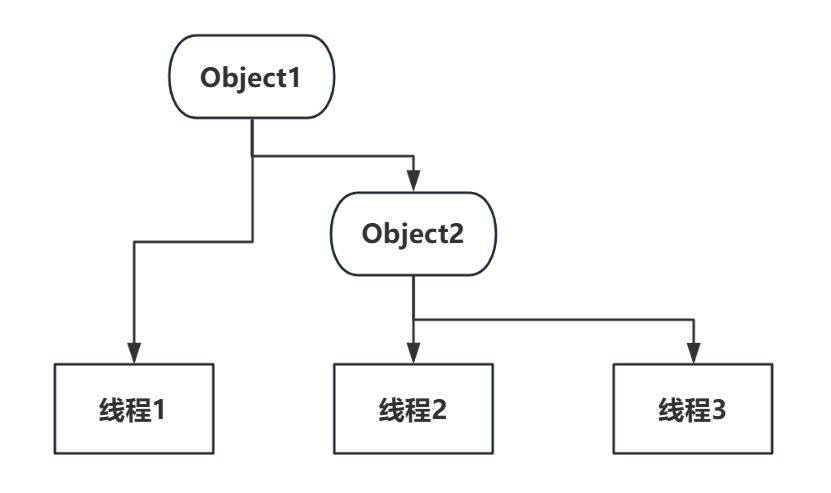

# wait / notify 交替输出 100 以内的数
实现如下：

1. 该版本的实现完全依赖 wait / notify 

```java
class Test {
    public static int i = 0;
    public static Object object = new Object();
    public static void main(String[] args) {
        Thread[] t = new Thread[3];
        Thread t1 = new Thread(()-> {
            while (i < 100) {
                synchronized (object) {
                    try {
                        object.wait();
                        // t2 线程唤醒 t1 线程后理应等待进入 wait，但是如果在 t2 线程进入 wait
                        // 的这段时间内 t1 线程迅速输出并 notify 则此时会让 t1、t2 两个线程都
                        // 进入 wait 造成活锁。因此 t1 线程 notify 之前必须保证 t2 线程状态
                        // 是 wait
                        while (!Thread.State.WAITING.equals(t[2].getState())) {
                            object.wait(1);
                        }
                        System.out.println("t2：B" + i++);
                        object.notify();
                    } catch (Exception e) {
                    }
                }
            }
        });
        Thread t2 = new Thread(() -> {
            while (i < 100) {
                synchronized (object) {
                    try {
                        while (!Thread.State.WAITING.equals(t[1].getState())) {
                            object.wait(1);
                        }
                        System.out.println("t1：A" + i++);
                        object.notify();
                        object.wait();
                    } catch (Exception e) {
                    }
                }
            }
        });
        t[1] = t1;
        t[2] = t2;
        t1.start();	
        t2.start();
    }
}
```

2. 也可以不使用 wait / notify，以下代码需要在 jvm 启动参数上添加 `-Xint`使 jvm 仅在解释器模式下运行，不触发 c1、c2 的代码优化。以下代码在不加参数 `-Xint`时也能~~得到期望的结果~~，但是一旦把循环次数加到 2000 以上就会开始频繁出现线程安全问题，本质还是需要注意 c1、c2 对代码的优化。

```java
public class Test {
    private static int i = 0;
    public static void main(String[] args) {
        new Thread(() -> {
            while (i < 99) {
                if (i % 2 == 0) {
                    System.out.println("t1: A");
                    i++;
                }
            }
        }).start();
        new Thread(() -> {
            while (i < 100) {
                if (i % 2 == 1) {
                    System.out.println("t2: B");
                    i++;
                }
            }
        }).start();
    }
}

```

# wait / notify 顺序输出 A、B、C
解决方案：既然两个线程可用 wait / notify 交替输出，那么把3个线程当作 2 个线程问题即可解决，将线程 1 视为 1 个整体，2、3视为一个整体。此时需要两个对象监视器分别为 object1、object2，object1 控制 1、2，object2 控制 2，3。具体如图所示：





一个循环流程如下表：

| 时刻 | t1线程状态 | t2线程状态 | t3线程状态 |
| :--- | :--- | :--- | :--- |
| `0` | `runing` | `wait(object1)` | `wait(object2)` |
| `1` | `nofity(object1)` | `wait(object1)` | `wait(object2)` |
| `2` | `wait(object1)` | `runing` | `wait(object2)` |
| `3` | `wait(object1)` | `notify(object2)` | `wait(object2)` |
| `4` | `wait(object1)` | `wait(object2)` | `runing` |
| `5` | `wait(object1)` | `wait(object2)` | `notify(object2)` |
| `6` | `wait(object1)` | `notify(object1)` | `wait(object2)` |
| `7` | `runing` | `wait(object1)` | `wait(object2)` |


代码如下：


```java
class test {
    public static int i = 0;
    public static Object object1 = new Object();
    public static Object object2 = new Object();
    public static void main(String[] args) {
        Thread[] t = new Thread[4];
        Thread t1 = new Thread(()-> {
            while (i < 10000) {
                synchronized (object2) {
                    try {
                        object2.wait();
                        System.out.println("t3：" + i++);
                        while (!Thread.State.WAITING.equals(t[2].getState())) {
                            object2.wait(1);
                        }
                        object2.notify();
                    } catch (Exception e) {
                    }
                }
            }
        });
        Thread t2 = new Thread(()-> {
            while (i < 10000) {
                synchronized (object1) {
                    try {
                        object1.wait();
                        synchronized (object2) {
                            System.out.println("t2：" + i++);
                            while (!Thread.State.WAITING.equals(t[1].getState())) {
                                object2.wait(1);
                            }
                            object2.notify();
                            object2.wait();
                        }
                        while (!Thread.State.WAITING.equals(t[3].getState())) {
                            object1.wait(1);
                        }
                        object1.notify();
                    } catch (Exception e) {
                    }
                }
            }
        });
        Thread t3 = new Thread(()-> {
            while (i < 10000) {
                synchronized (object1) {
                    try {
                        System.out.println("t1：" + i++);
                        while (!Thread.State.WAITING.equals(t[2].getState())) {
                            object1.wait(1);
                        }
                        object1.notify();
                        object1.wait();
                    } catch (Exception e) {
                    }
                }
            }
        });
        t[1] = t1;
        t[2] = t2;
        t[3] = t3;
        t3.start();
        t2.start();
        t1.start();
    }
}
```


