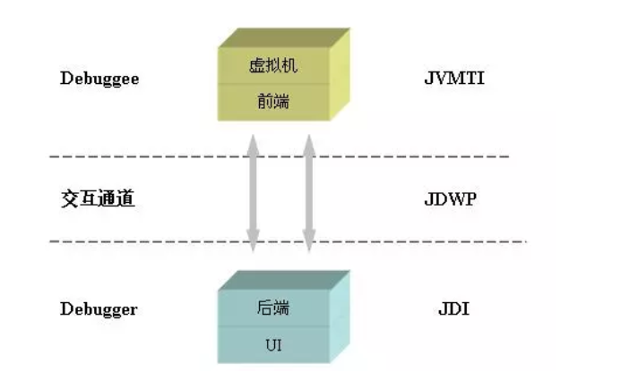
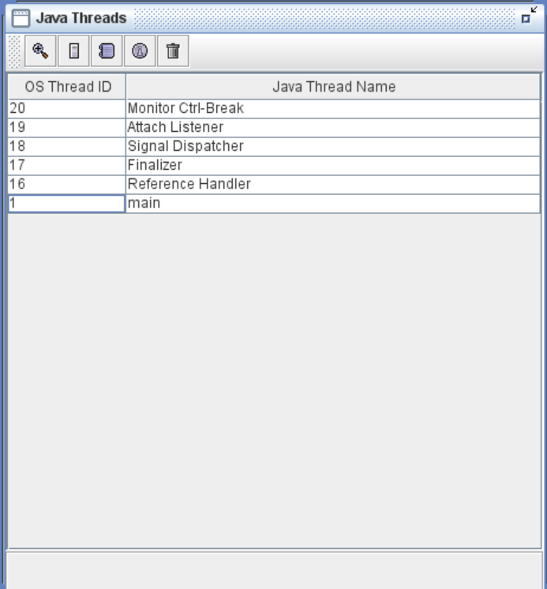
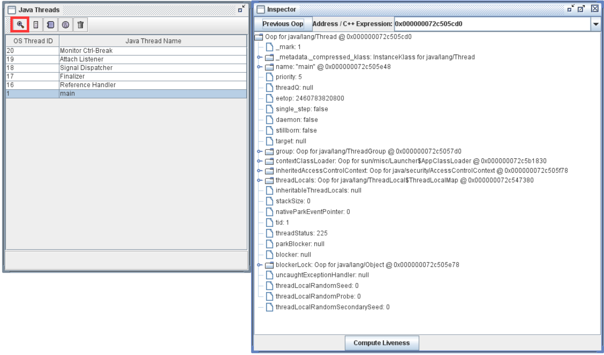
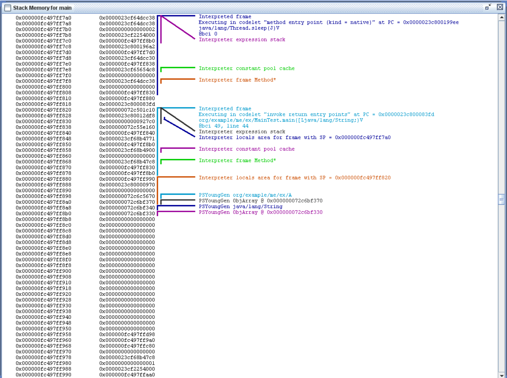
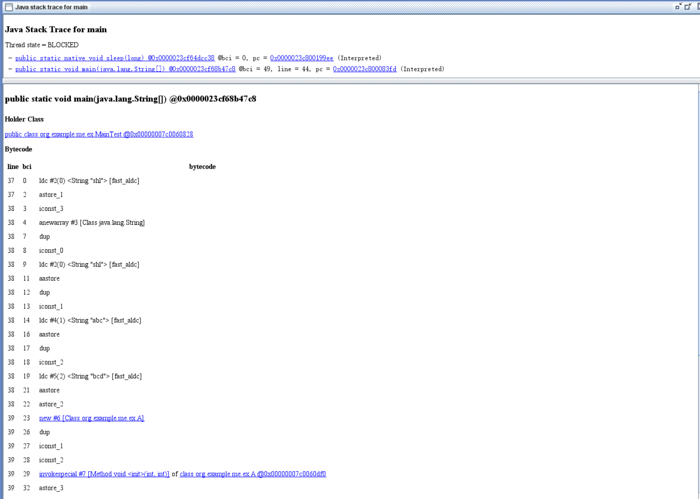
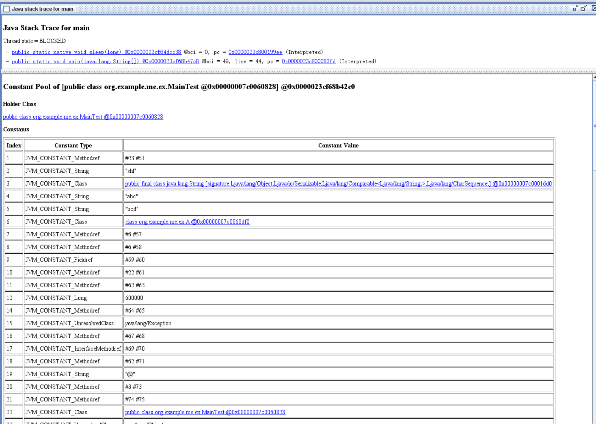
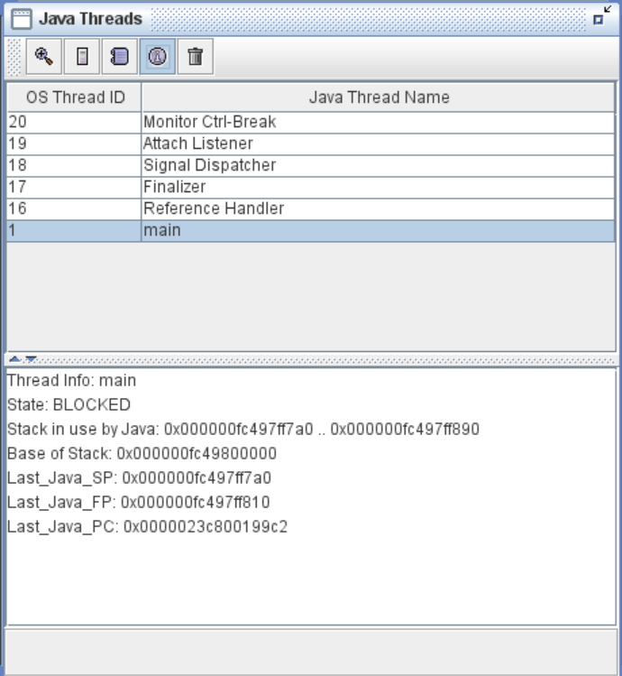

# JDB
JDB（The Java Debugger）用于调试程序使用，作为 JPDA 的实现，它被用于调试端实现。JPDA将调试过程分为两部分：被调试的程序 和 JDI（调试者）。JDI 一般是一个调试应用程序的用户接口，结构图如下：

从开发者的角度，一个调试应用程序可进入任何 JPDA 层面。只要 JDI 基于 JDWP，就可以 debug 任何厂商实现的 JVM。

JDWP 有两种基本的包（packet）类型：命令包（command packet）和回复包（reply packet）。

+ JDB 通过socket 向本地的 JVM 发送 JDWP 请求
+ Debugger 和 target Java 虚拟机都有可能发送 command packet
+ Debugger 通过发送 command packet 获取 target Java 虚拟机的信息以及控制程序的执行
+ Target Java 虚拟机通过发送 command packet 通知 debugger 某些事件的发生，如到达断点或是产生异常
+ Reply packet 用于回复 command packet 命令是否执行成功，如果成功 reply packet 还有可能包含 command packet 请求的数据，比如当前的线程信息或者变量的值。从 target Java 虚拟机发送的事件消息是不需要回复的

以下是对图中三个模块功能的详解：

+ JVMTI（Java Virtual Machine Tool Interface）  
JVMTI 即指 Java 虚拟机工具接口，它是一套由虚拟机直接提供的 native 接口，它处于整个 JPDA 体系的最底层，所有调试功能本质上都需要通过 JVMTI 来提供。通过这些接口，开发人员不仅调试在该虚拟机上运行的 Java 程序，还能查看它们运行的状态，设置回调函数，控制某些环境变量，从而优化程序性能。JVMTI 的前身是 JVMDI 和 JVMPI，它们原来分别被用于提供调试 Java 程序以及 Java 程序调节性能的功能。在 J2SE 5.0 之后 JDK 取代了 JVMDI 和 JVMPI 这两套接口，JVMDI 在最新的 Java SE 6 中已经不提供支持，而 JVMPI 也计划在 Java SE 7 后被彻底取代。
+ JDWP（Java Debug Wire Protocol）  
JDWP 是一个为 Java 调试而设计的一个通讯交互协议，它定义了调试器和被调试程序之间传递的信息的格式。在 JPDA 体系中，作为前端（front-end）的调试者（debugger）进程和后端（back-end）的被调试程序（debuggee）进程之间的交互数据的格式就是由 JDWP 来描述的，它详细完整地定义了请求命令、回应数据和错误代码，保证了前端和后端的 JVMTI 和 JDI 的通信通畅。比如在 Sun 公司提供的实现中，它提供了一个名为 jdwp.dll（jdwp.so）的动态链接库文件，这个动态库文件实现了一个 Agent，它会负责解析前端发出的请求或者命令，并将其转化为 JVMTI 调用，然后将 JVMTI 函数的返回值封装成 JDWP 数据发还给后端。JDWP 本身并不包括传输层的实现，传输层需要独立实现，但是 JDWP 包括了和传输层交互的严格的定义。在 Sun 公司提供的 JDK 中，在传输层上，它提供了 socket 方式，以及在 Windows 上的 shared memory 方式。传输层本身就是本机内进程间通信方式和远端通信方式，用户可以按 JDWP 的标准自己实现。
+ JDI（Java Debug Interface）  
是三个模块中最高层的接口，在多数的 JDK 中，它是由 Java 语言实现的。 JDI 由针对前端定义的接口组成，通过它，调试工具开发人员就能通过前端虚拟机上的调试器来远程操控后端虚拟机上被调试程序的运行，JDI 不仅能帮助开发人员格式化 JDWP 数据，而且还能为 JDWP 数据传输提供队列、缓存等优化服务。从理论上说，开发人员只需使用 JDWP 和 JVMTI 即可支持跨平台的远程调试，但是直接编写 JDWP 程序费时费力，而且效率不高。因此基于 Java 的 JDI 层的引入，简化了操作，提高了开发人员开发调试程序的效率。

模块不同点比较：

| 模块 | 层次 | 编程语言 | 作用 |
| --- | --- | --- | --- |
| JVMTI | 底层 | C | 获取以及控制 JVM 状态 |
| JDWP | 中介层 | C | 定义 JVMTI 与 JDI 交互的数据格式 |
| JDI | 高层 | Java | 提供 Java API 用于远程控制被调试的 JVM |

现在主流的 IDE（IDEA）就是使用这一套框架对 Java 程序进行调试

# JHSDB
jhsdb（Java HotSpot Debugger）顾名思义用于调试和查看 HotSpot JVM 运行时信息和 JVM core dump 文件，该工具正式发版在 jdk9+ 的 bin 目录下

jdk8 以下时该工具包含在 JDK_HOME/lib/sa-jdi.jar 中，该工具包含 GUI 和命令行，以下为启动命令（本质是通过 attach remote）：

+ jdk8- GUI`java -cp $JAVA_HOME/lib/sa-jdi.jar sun.jvm.hotspot.HSDB` CLI`java -cp $JAVA_HOME/lib/sa-jdi.jar sun.jvm.hotspot.CLHSDB`（这里的 JAVA_HOME 如果没配置环境变量就写路径）
+ jdk9+ GUI `jshdb hsdb`CLI`jshdb clihsdb`

使用流程如下（只介绍 GUI，CLI 可通过 help 命令查看）：

1. 通过 jps 命令查看目标 java 进程 pid（不可远程连接）
2. GUI 直接左上角连接进程填 pid 或者 core dump 文件，CLI 直接 `attatch pid`
3. 连接上以后会展示当前 JVM 所有的非守护线程

+ 双击，或者选中线程后点击第一个按钮（Inspect Thread）可查看当前对象的属性

+ 第二个按钮（Stack Memery）可查看当前线程的堆栈信息：第一列是虚拟内存地址；第二列是该地址上的数据（单位：字——64 位下是 8 字节）；第三列是对内存数据的注释，同颜色的竖线表示范围，横线或斜线连接范围与注释文字，Interpreted frame表示一个调用栈帧，最下面的是main方法创建的局部变量的地址

+ 第三个按钮（Show Java Stack Trace）是显示当前线程的调用链路，点击具体的方法可查看对应的字节码（native 方法没有字节码，故无法查看）pc 表示具体方法的首条字节码指令地址（方法入口地址）最下面的 Constant Pool，可以查看常量池中的具体内容

+ 第四个按钮（Show Thread Infomation）可用于查看指定线程的信息，State 是线程的状态，Stack in use 是线程调用栈占用的内存的起始地址，Base of Stack 是调用栈的基地址，Last_Java_SP 是调用栈的当前栈帧的栈顶地址，Last_Java_SP 表示调用栈的当前栈帧的栈基地址，Last_Java_PC 是上一次执行的字节码指令的地址

+ 最后一个按钮（Find Crashes）是查找崩溃的线程
+ Tools 下的选项功能如下：
    - Class Browser：用于查看类，需要用完整的类名的来查询
    - Code Viewer：可根据内存地址查看该地址的Kclass信息或者Method信息或者字节码指令信息
    - Computes Reserves ptrs：用于执行反向指针的分析，所谓反向指针是指根据对象地址查找指向该对象的引用的地址
    - Deadlock Detection：用于死锁检测
    - Find Object by Query：用于通过对象查询语言（OQL，可通过 jhat 命令在本地启动的 webserver 查看 http://localhost:7000/oqlhelp  jdk9 以后移除 jhat 命令）查询对象
    - Find Pointer：查找指针
    - Find value in heap：在堆内存中查找值，输入查找的起始地址，返回堆中保存的对象信息
    - Find value in CodeCache：在代码缓存中查找值
    - Heap Paramters：显示年轻代和老年代的内存地址范围，如eden区有三个值，分别表示起始内存地址，当前已经分配的内存地址和可分配的最大内存地址
    - Memory Viewer：内存信息
    - Monitor Cache Dump：查看当前进程使用的 ObjectMonitor（用于synchronized 同步）的情况
    - Object Histogram：对象直方图，即所有对象的对象数量及其占用的内存空间的统计，可搜索指定类
    - Show System Properties：显示系统属性
    - Show VM Version：显示 VM 版本
    - Show –XX flags：显示 VM 选项
+ windows 选项下包含两个，console 和 Debugger console，前者是 hsdb 命令行控制台，后者是 hsdb 自身调试用的控制台。前者实际是调用了 hsdb 的命令行版本 CLHSDB，提供了更丰富强大灵活的命令，输入help，查看所有的命令

