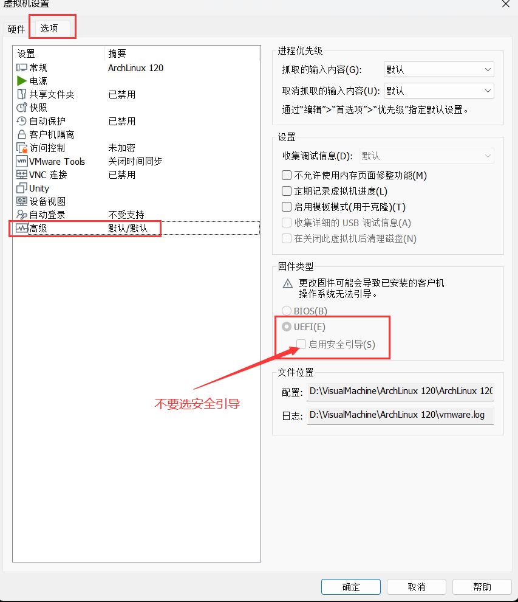

# ArchLinux 安装
archlinux 需要网络才能安装

1. 首先下载最新的 archlinux，这里使用国内速度比较快的 [清华源](https://mirrors.tuna.tsinghua.edu.cn/archlinux/iso/latest/archlinux-x86_64.iso)
2. 如果是虚拟机安装需要设置一下启动方式，arch 不支持安全引导的 UEFI 启动，如果是 BIOS 启动那么后面在安装引导时只能对应 i386 模式，UEFI 对应 x86_64 模式



3. 挂载镜像后先择第一个开始安装，如果在此时无法连接网络则 archlinux 无法继续安装
4. 首先 `ip a`看一下网卡名称，然后开始配置网卡信息`vim /etc/systemd/network/10-cloud-init-ens33.network`（这里是虚拟机选用 NAT 连接网络等同于直接插网线，如果是用 WIFI 联网则参考步骤 7）

```plain
[Match]
# 地址需要随机
MACAddress=00:0c:29:70:a1:c8
# 网卡名称
Name=ens33

[Network]
Address=192.168.6.120/24
Gateway=192.168.6.1
DNS=223.5.5.5
```

5. 重启一下网卡 `systemctl restart systemd-networkd`测试网络 `ping baidu.com`
6. archlinux 提供图形化安装，这里联网成功后直接跳到 12 步，修改镜像源之后执行命令 `archinstall`即可开始 GUI 安装
7. 如果是虚拟安装这里开启下远程登陆，首先设置密码 `passwd root`然后设置 ssh `vim /etc/ssh/sshd_config`添加设置后保存，然后可以用 xshell 等工具连接操作

```plain
PasswordAuthentication yes
PermitRootLogin yes
```

8. 如果是 WIFI 连接还是首先 `ip a` 查看设备名称，然后执行命令进行连接 `wpa_supplicant -D wext -B-i wlp3s0(网卡名称)-c <(wpa_passphrase wifi-name wifi-password)`
9. 设置时区 `timedatectl set-timezone Asia/Shanghai`查看是否设置成功 `timedatectl status`
10. 对磁盘分区时首先执行命令查看设备挂载路径 `fdisk -l`然后开始分区：fdisk 只能创建 mbr 分区，cfdisk 二者皆可，而且是图形化比较方便。这里的 60G 磁盘打算分三个区：1G EFI  System、512M SWAP Linux Swap、剩余都挂载到根 Linux LVM，执行命令开始进行分区 `cfdisk /dev/sda`选择 gpt 后开始创建分区（记得修改分区类型），最后挂载的根文件类型可以选择 ext4。然后开始格式化分区

```bash
# 格式化EFI分区
mkfs.fat -F 32 /dev/sda1
# 格式化交换分区
mkswap /dev/sda2
# 格式化系统分区
mkfs.ext4 /dev/sda3
```

11. 开始挂载分区（当前还是在启动引导下因此实际的系统根目录要挂载到 /mnt）然后检查下挂载情况 `df -hT`

```bash
# 启动交换分区
swapon /dev/sda2
# 挂载系统分区
mount /dev/sda3 /mnt
mkdir /mnt/boot
# 挂载EFI分区
mount /dev/sda1 /mnt/boot
```

12. 之后要开始下载内核以及其它安装文件，因此先修改一下镜像源 `vim /etc/pacman.d/mirrorlist`修改后执行命令更新包 `pacman -Syy`

```bash
# 直接删除原来的全部镜像源换成下面的即可
Server = https://mirrors.tuna.tsinghua.edu.cn/archlinux/$repo/os/$arch
Server = https://mirrors.ustc.edu.cn/archlinux/$repo/os/$arch
Server = https://repo.huaweicloud.com/archlinux/$repo/os/$arch
```

13. 下载且安装内核及工具

```bash
# lts 为稳定版本，要尝鲜可以去掉 -lts
pacstrap /mnt base base-devel linux-lts linux-lts-headers linux-firmware
```

14. 创建 fstab 文件（fstab用来定义磁盘分区，主要用于系统启动时自动挂载分区，是linux重要文件之一。使用genfstab自动根据当前挂载情况生成并写入fstab文件）

```bash
# efi + gpt 使用此命令，-U 使用uuid -L 使用卷标
genfstab -U /mnt >> /mnt/etc/fstab
# bios + mbr 使用此命令
genfstab -p /mnt >> /mnt/etc/fstab
```

15. 开始配置系统

```bash
# 切换根目录
arch-chroot /mnt

# 安装软件
pacman -S networkmanager openssh vim git grub efibootmgr amd-ucode man-db man-pages ntfs-3g bash bash-completion sudo net-tools wget tree
# networkmanager    网络管理，建议安装
# grub efibootmgr    grub2引导管理，必装；efi+gpt引导的安装grub、efibootmgr；bios+mbr引导的安装grub、efivar
# os-prober    双系统必装；os-prober 可以检查其他硬盘上的其他系统引导，如果不安装并启用，可能无法识别其他系统
# intel-ucode    cpu微码，必装；intel安装intel-ucode,amd安装amd-ucode
# bash bash-completions    终端，必装；如果喜欢使用zsh，可更换为zsh zsh-completions
# sudo    提权用，必装
systemctl enable NetworkManager

# 设置时区
ln -sf /usr/share/zoneinfo/Asia/Shanghai /etc/localtime
# 同步硬件时钟
hwclock --systohc


# 本地化
vim /etc/locale.gen
# 去掉 en_US.UTF-8 UTF-8 以及 zh_CN.UTF-8 UTF-8 行前的注释符号
# 使用命令修改
# sed -i 's/^#en_US.UTF-8/en_US.UTF-8/' /etc/locale.gen
# sed -i 's/^#zh_CN.UTF-8/zh_CN.UTF-8/' /etc/locale.gen
# 更新locale信息
locale-gen
# 创建 locale.conf 文件，并设定 LANG 变量
echo 'LANG=en_US.UTF-8' >> /etc/locale.conf
# 不建议在这里将 en_US.UTF-8 改为 zh_CN.UTF-8 ，这样会导致终端乱码

# 修改主机名
echo 'haochuliu' >> /etc/hostname

# 设置root密码
passwd root

# 创建新用户
useradd -m haochuliu
# 修改密码
passwd haochuliu
# 将当前用户加入 wheel 组
usermod -a -G wheel $USER
# 新用户提权
chmod +w /etc/sudoers && vim /etc/sudoers
%whell ALL=(ALL:ALL) ALL
或
haochuliu ALL=(ALL:ALL) ALL


# 创建引导，使用efi+gpt引导
grub-install --target=x86_64-efi --efi-directory=/boot --bootloader-id=GRUB
# --target=x86_64-efi 目标架构 x86 架构 64 位，efi 启动方式
# --efi-directory=/boot 是硬盘挂载的 /boot 位置，将 grubx64.efi 安装到之前的指定位置（EFI 分区）
# --bootloader-id=name 其中 name 可以更改为自己想要的名称，建议简短明确；可忽略不写
# 使用 bios+mbr 引导
# grub-install --target=i386-pc /dev/sda1
# grub2 默认禁用了 os-prober，如果你是双系统或多系统安装，需要手动开启该选项
vim /etc/default/grub
GRUB_DISABLE_OS_PROBER=false
#生成引导配置文件
grub-mkconfig -o /boot/grub/grub.cfg

# 退出重启进入系统
exit
reboot
```

16. 重启后网络需要重新配置，这里使用之前安装好的 NetworkManager 进行配置。网络配置完成后参考步骤 7 再配置一次 ssh，然后执行命令开启 sshd 并添加到开机启动 `systemctl start sshd && systemctl enable sshd`

```bash
# 查看设备，主要是找到 Name
nmcli c
# 配置静态地址
nmcli c m 'Wired connection 1' ipv4.address 192.168.6.120/24
# manual 为静态 ip
nmcli c m 'Wired connection 1' ipv4.method manual
# 网关
nmcli c m 'Wired connection 1' ipv4.gateway 192.168.6.1
nmcli c m 'Wired connection 1' ipv4.dns 223.5.5.5
# 这里是再添加一个 DNS
nmcli c m 'Wired connection 1' +ipv4.dns 114.114.114.114
# 禁用 ipv6
nmcli c m 'Wired connection 1' ipv6.method disabled
# 更新设备信息
nmcli d r ens33
# 测试网络
ping baidu.com
```

17. 进行系统配置

```bash
# 添加中文源
vim /etc/pacman.conf
# 添加以下内容
[multilib]
Include = /etc/pacman.d/mirrorlist
[archlinuxcn]
SigLevel = Optional TrustAll
#The Chinese Arch Linux communities packages.
Server = https://mirrors.tuna.tsinghua.edu.cn/archlinuxcn/$arch
[blackarch]
SigLevel = Never
Server = https://mirrors.tuna.tsinghua.edu.cn/blackarch/$repo/os/$arch

# 添加完成后更新一下
pacman -Syyu

# 配置密钥环
pacman -Sy archlinuxcn-keyring archlinux-keyring
# 如果出现密钥环报错的问题可以运行以下命令尝试处理
# rm -rf /etc/pacman.d/gnupg/
# pacman-key --init
# pacman-key --populate archlinux
# pacman-key --populate archlinuxcn

# 安装 paru 和 yay
pacman -Sy paru
pacman -Sy yay

# 安装 kde 桌面
pacman -Sy plasma-meta konsole dolphin ark okular gwenview kate spectacle packagekit-qt5 appstream-qt appstream kcalc
# 桌面管理器
pacman -Sy sddm
systemctl enable sddm && systemctl start sddm

# 安装字体（部分字体需要去 github 下载，需要梯子）
pacman -Sy adobe-source-han-serif-cn-fonts adobe-source-han-sans-cn-fonts
yay -Sy ttf-fira-code ttf-meslo-nerd-font-powerlevel10k jetbrains-mono-fonts

# 安装及配置中文输入法
pacman -Sy fcitx5-im fcitx5-chinese-addons fcitx5-material-color
# 词库
pacman -Sy fcitx5-pinyin-zhwiki fcitx5-pinyin-moegirl fcitx5-pinyin-moegirl-rime rime-pinyin-zhwiki
# 配置中文输入法
vim /etc/environment
# 写入以下内容
GTK_IM_MODULE=fcitx
QT_IM_MODULE=fcitx
XMODIFIERS=@im=fcitx
SDL_IM_MODULE=fcitx
GLFW_IM_MODULE=ibus

# kde 桌面中文化
# 打开：System Settings --> Regional Settings--> Language -->Add Languages

# 安装dock栏
pacman -Sy latte-dock
# 安装 neofetch
pacman -Sy neofetch
```

18. 安装 vm-tools

```bash
pacman -Sy open-vm-tools
# 启动 vm-tools
systemctl start vmtoolsd.service && systemctl start vmware-vmblock-fuse.service
# 设置开机启动
systemctl enable vmtoolsd.service && systemctl enable vmware-vmblock-fuse.service
```

# pacman 更新失败
使用命令重新生成`keyring`并更新包`sudo pacman -S archlinux-keyring && sudo pacman -Syu`

