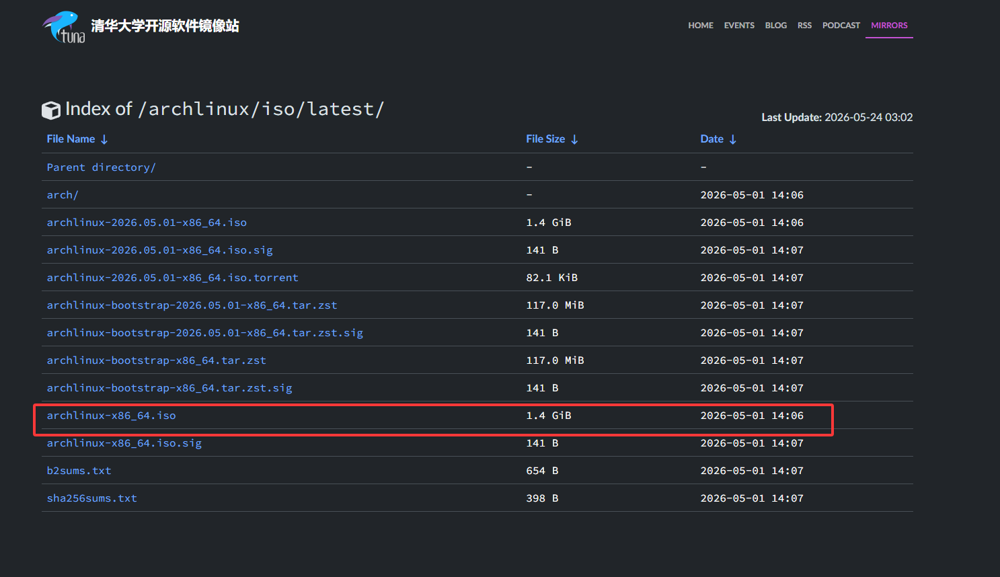

# archlinux安装

## 准备

1. 直接去 [清华源](https://mirrors.tuna.tsinghua.edu.cn/archlinux/iso/latest/) 下载对应的 ISO 镜像



2. U 盘刻录一下，一般用 ventory
3. 开机进入 bios 然后选择镜像，选择第一项即可

## 联网

1. 查看当前网卡设备名称`ip a`
2. 依次执行一下命令连接网络

```plain
iwctl #进入 iwc 控制台
device list #列出设备
station wlan0 scan #扫描网络
station wlan0 get-networks #列出所有扫描的的wifi
station wlan0 connect 【此处是你的wifi名字（不能是中文，这个时候没法输入中文）】
exit # 推出 iwc 控制台
```

## 设置远程登陆

1. 可能需要安装 ssh`pacman -S openssh`
2. 设置允许远程登陆`vim /etc/ssh/sshd_config`重点放开以下三行

```plain
PermitRootLogin yes
PasswordAuthentication yes
#PermitEmptyPasswords ues # no 改 yes
```

3. 执行命令重启`systemctl restart sshd`
4. 在同一局域网的其它主机下远程登陆，这里使用`root`登陆不需要密码

## 设置时间同步，更新源

```plain
timedatectl set-ntp true
# 自动设置源
reflector -p https -a 12 -c cn --v --sort rate --save /etc/pacman.d/mirrorlist
# 同步一下
pacman -Sy
```

## 分区

1. 分区前首先看一下分区的物理磁盘设备路径，别搞错了

```plain
lsblk -pf #查看分区情况
fdisk -l /dev/想要查询详细情况的硬盘  #小写字母l，查看详细分区信息
```

2. 开始分区`cfdisk /dev/nvme0n1`（ 选择自己要使用的硬盘进行分区）如果是新硬盘的话会弹出选项，选GPT。一般分两个区
3. 首先是`EFI` 分区，如果套用 Win 的 EFI 分区这里就不用操作了。不然的话上下方向键选中空闲空间，左右方向键选择 NEW 创建 512M 的分区，类型（type）选择EFI System。如果你的类型里没有EFI System 说明你的硬盘不是 GPT 分区表，可以使用`cfdisk -z 设备名`以空分区表打开硬盘，然后选择GPT。（推荐给Linux单独新建EFI分区，更可控）
4. 其余空间全部分到一个分区里，类型`linux filesystem`不需要更改
5. 选择`write`，输入`yes`保存。`quit`退出
6. 再次查看分区情况

```plain
lsblk -pf #查看分区情况
fdisk -l /dev/想要查询详细情况的硬盘  #小写字母l，查看详细分区信息
```

7. 格式化分区（如果套用  Win 的 EFI 分区这里不用格式化 EFI 分区）

```plain
mkfs.fat -F 32 /dev/nvme0n1p1（EFI分区名）
mkfs.btrfs /dev/nvme0n1p2（根分区名）#加上-f参数可以强制格式化
```

## 创建BTRFS子卷

1. 挂载

```plain
mount -t btrfs /dev/nvme0n1p2（根分区名） /mnt
```

2. 创建子卷

```plain
btrfs subvolume create /mnt/@
btrfs subvolume create /mnt/@home
btrfs subvolume create /mnt/@swap #如果你的内存大于等于16G且不需要休眠到硬盘功能的话跳过这个
```

3. 执行命令查看创捷结果`btrfs subvolume list /mnt`
4. 取消挂载`umount /mnt`
5. 挂载 root 子卷`mount -t btrfs -o subvol=/@,compress=zstd /dev/nvme0n1p2 /mnt`
6. 挂载swap子卷（如果你的内存大于等于16G且不需要休眠功能的话跳过这一步）

```plain
mount --mkdir -t btrfs -o subvol=/@swap,compress=zstd /dev/nvme0n1p2 /mnt/swap
```

7. 挂载efi分区（这里如果套用 win 的 efi 则需要注意 efi 的分区名）

```plain
mount --mkdir /dev/nvme0n1p1（如果套用 win 的 efi 这里是它的路径） /mnt/efi
```

8. 复查挂载情况`df -h`

## swap 交换空间

swap大小参考：

| 内存(GB) | 不需要休眠(GB) | 需要休眠（GB） | 不建议超过（GB） |
| --- | --- | --- | --- |
| 1 | 1 | 2 | 2 |
| 2 | 2 | 3 | 4 |
| 3 | 3 | 5 | 6 |
| 4 | 4 | 6 | 8 |
| 5 | 2 | 7 | 10 |
| 6 | 2 | 8 | 12 |
| 8 | 3 | 11 | 16 |
| 12 | 3 | 15 | 24 |
| 16 | 4 | 20 | 32 |
| 24 | 5 | 29 | 48 |
| 32 | 6 | 38 | 64 |
| 64 | 8 | 72 | 128 |
| 128 | 11 | 139 | 256 |
| 256 | 16 | 272 | 512 |

1. 创建swap文件

此处的`38g`应该是你实际需求的swap大小

```plain
btrfs filesystem mkswapfile --size 64g --uuid clear /mnt/swap/swapfile
```

2. 启动swap

```plain
swapon /mnt/swap/swapfile
```

## 安装系统

1. 执行以下命令安装系统，注意`CPU`平台

```plain
pacstrap -K /mnt base base-devel linux linux-firmware btrfs-progs networkmanager vim sudo amd-ucode

# -K 初始化密钥
# base-devel是编译其他软件的时候用的
# linux是内核，可以更换
# linux-firmware是固件
# btrfs-progs是btrfs文件系统的管理工具
# networkmanager 是联网用的，是各个桌面环境标配的联网工具
# vim 是文本编辑器，也可以换成别的，比如nano、neovim
# sudo 和权限管理有关
# amd-ucode 是微码，用来修复和优化cpu，intel用户安装intel-ucode
```

2. 生成fstab文件

系统会根据fstab中的内容自动进行挂载

```plain
genfstab -U /mnt > /mnt/etc/fstab


# genfstab（生成文件系统表）
# -U 用uuid指定分区
# > 大于号代表输出结果覆盖写入到有右边的文件里
# 如果是>>两个大于号则代表追加写入
```

3. 更换根目录`arch-chroot /mnt`
4. 设置时间和时区`timedatectl set-timezone Asia/Shanghai && hwclock --systohc`

除了`timedatectl`命令，还可以手动创建链接

```plain
ln -sf /usr/share/zoneinfo/Asia/Shanghai /etc/localtime

# ln 是link的缩写
# -s代表跨文件系统的软链接
# -f代表强制执行
```

5. 语言设置

```plain
vim /etc/locale.gen
```

左斜杠键进行搜索；`x键`剪贴掉`en_US.UTF-8 UTF-8`和`zh_CN.UTF-8 UTF-8`的前面代表注释的井号；`:wq`保存并退出。

6. 生成本地化配置

```plain
locale-gen
```

7. 设置系统语言

```plain
vim /etc/locale.conf
```

写入`LANG=en_US.UTF-8`设置系统语言为英文；

```plain
LANG=en_US.UTF-8
```

8. 设置主机名

```plain
vim /etc/hostname
```

9. 设置root密码

```plain
passwd
```

## 安装引导程序

1. 安装必要的软件包

```plain
pacman -S grub efibootmgr os-prober exfat-utils
```

如果这里这里 EFI 也用 btrfs 管理备份，则需要额外执行

```plain
pacman -S snapper btrfs-assistant grub-btrfs inotify-tools
```

2. 安装grub

```plain
grub-install --target=x86_64-efi --efi-directory=/efi --boot-directory=/efi --bootloader-id=ARCH
```

`grub-install`安装grub；

`--target` 指定架构；

`--efi-directory` 指定ESP位置；

`--boot-directory` 指定grub的安装目录；

`--bootloader-id` 任意取一个启动项名字；

PS：如果是移动设备或者主板只支持默认的efi路径要加上`--removable`选项。

3. 编辑grub的源文件

```plain
vim /etc/default/grub
```

这是生成grub的配置文件时需要用到的东西。

```
- 启动项记忆功能`GRUB_DEFAULT=0`改成`=saved`，再取消`GRUB_SAVEDEFAULT=true`的注释。
- 显示开机日志`GRUB_CMDLINE_LINUX_DEFAULT`里面去掉`quiet`以显示开机日志。再设置`loglevel=5`把日志等级为5。`loglevel`共7级，5级是一个信息量的平衡点。
- 禁用watchdog`GRUB_CMDLINE_LINUX_DEFAULT`里添加`nowatchdog`以及`modprobe.blacklist=sp5100_tco`。intelcpu用户把`sp5100_tco`换成`iTCO_wdt`watchdog的目的简单来说是在系统死机的时候自动重启系统。对个人用户来说没有意义，禁用以节省系统资源、提高开机和关机速度。
- 取消最后一行`GRUB_DISABLE_OS_PROBER=false`的注释。
```

改动参考如下

```plain
GRUB_DEFAULT=saved
GRUB_TIMEOUT=3
GRUB_CMDLINE_LINUX_DEFAULT="loglevel=5 nowatchdog modprobe.blacklist=sp5100_tco"
GRUB_SAVEDEFAULT=true
GRUB_DISABLE_OS_PROBER=false
```

4. 如果这里不需要 btrfs 管理备份 EFI，则直接执行

```plain
ln -sf /efi/grub /boot/grub
grub-mkconfig -o /boot/grub/grub.cfg
```

5. 如果这里需要 btrfs 管理备份 EFI，则执行（下面都是需要  btrfs 管理备份 EFI 的步骤）

```plain
mkdir -p /boot/grub
```

6. 查找根分区的UUID

```plain
findmnt / -n -o UUID #列出根目录挂载信息
```

7. 编辑存根`vim /efi/grub/grub.cfg`找到与第一行相似的内容（只有最后的随机字符串是不一样的）然后删除其它行，最后添加下面的第二行（最终和下面的内容一致，除了第一行后面的随机字符串）

```plain
search --no-floppy --fs-uuid --set=root 1b77e9f9-2ef8-4dce-87a8-eb6716ab96fb
configfile /@/boot/grub/grub.cfg
```

8. 修改`btrfs`启动项`vim /etc/default/grub-btrfs/config`

```plain
找到下面这段内容：
# GRUB_BTRFS_GBTRFS_SEARCH_DIRNAME="\${prefix}"
改成：
GRUB_BTRFS_GBTRFS_SEARCH_DIRNAME="/@/boot/grub"
注意，/@必须是你实际的根子卷
```

9. 生成`grub.cfg`

```plain
grub-mkconfig -o /boot/grub/grub.cfg
```

## 启用网络服务

开启新系统的NetworkManager服务，注意大小写

```plain
systemctl enable NetworkManager
```

`systemctl`调用systemd进行操作

`enbale`代表从下一次开机开始自动启动

* 可选：替换网络后端为`iwd`

NetworkManager的无线网默认后端是`wpa_supplicant`，可以更换为更现代的`iwd`。注意：部分设备更换`iwd`后端可能无法正常联网。

```
安装`iwd`
```

```plain
pacman -S iwd
```

`impala`是`iwd`的tui

```
编辑配置文件
```

```plain
# 创建配置文件目录，-p代表如果已经存在就跳过
mkdir -p /etc/NetworkManager/conf.d

# 新建文件并用vim进行编辑
vim /etc/NetworkManager/conf.d/iwd.conf
```

写入：

```plain
[device]
wifi.backend=iwd
```

## 重启

依次执行以下命令重启

```plain
exit
reboot
```

记得拔掉 U 盘

## 登录root账户，连接网络

1. 连接wifi

```plain
nmtui
```

`nmtui`是networkmanager提供的TUI（终端用户交互程序）。

```
- 选择activate a connection
- 选择自己的wifi进行连接
- esc退出
- Ctrl+L或者`clear`清屏
```

2\. 这里参考 设置远程登陆 重新设置一下，继续远程操作
