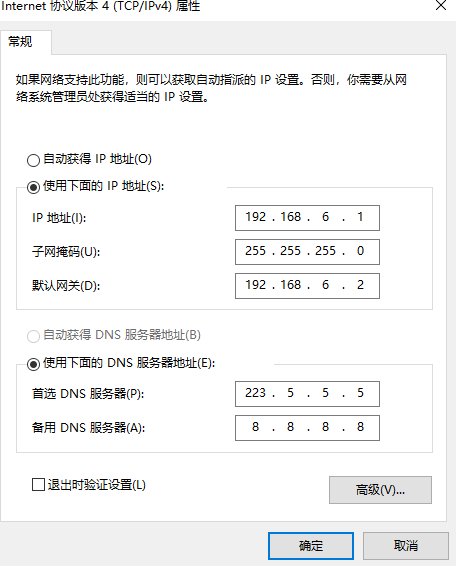

# centos

# CentOS7/8 虚拟机 NAT 网络配置

修改网卡信息 `vi /etc/sysconfig/network-scripts/ifcfg-ens33`（最后的网卡可能不同，注意识别）

```plain
TYPE=Ethernet
BOOTPROTO=static # NAT 采用手动分配，如果是动态获取改成 dhcp 然后删除 8 ~ 11 行
DEFROUTE=yes
NAME=ens33
UUID=d92f0efa-782f-4b06-9039-24fc8089c4b1 # 随机数，随便写一下
DEVICE=ens33
ONBOOT=yes # 如果是动态获取改成 no
IPADDR=192.168.6.11 # 这里要和 VMWare 的 NAT 在一个网段上
PREFIX=24 # 这里就代表子网掩码是 255.255.255.0
GATEWAY=192.168.6.2 # 网关 和 VMWare 一致
DNS1=223.5.5.5 # 阿里的 DNS 网关
```

如果要 windows 能通过 xshell 登录就修改下 VMnat8 网卡信息



# CentOS 修改 yum 源

1. 首先下载 wget `yum install -y wget`
2. 进入 yum 原配置文件夹 `cd /etc/yum.repos.d/`
3. 删除文件 `rm -rf ./*`
4. 下载阿里源 `wget -O /etc/yum.repos.d/CentOS-Base.repo http://mirrors.aliyun.com/repo/Centos-7.repo`
5. 生成缓存并更新源 `yum makecache && yum update -y`

# CentOS7 安装 Docker-CE

1. docker 安装要求 linux 内核不能低于 3.10
2. 卸载之前安装过的 docker

```bash
yum remove docker \
docker-client \
docker-client-latest \
docker-common \
docker-latest \
docker-latest-logrotate \
docker-logrotate \
docker-selinux \
docker-engine-selinux \
docker-engine \
docker-ce
```

3. 安装 docker 依赖环境

```bash
yum install -y yum-utils \
device-mapper-persistent-data \
lvm2 --skip-broken
```

4. 更新本地镜像源，设置 docker 镜像源

```bash
yum-config-manager \
--add-repo \
https://mirrors.aliyun.com/docker-ce/linux/centos/docker-ce.repo \
&& \
sed -i 's/download.docker.com/mirrors.aliyun.com\/docker-ce/g' /etc/yum.repos.d/docker-ce.repo \
&& \
yum makecache
```

5. 安装 docker-ce

```bash
yum install -y docker-ce && systemctl start docker 
```

6. 关闭防火墙

```bash
systemctl stop firewalld && systemctl disable firewalld 
```

7. 修改 docker 拉取镜像源，[阿里云镜像源](https://cr.console.aliyun.com/cn-hangzhou/instances/mirrors)（data-root 可指定存储本地镜像路径——需要有读写权限）

```bash
# 也可以换腾讯云镜像
# https://mirror.ccs.tencentyun.com

mkdir -p /etc/docker && \
tee /etc/docker/daemon.json <<-'EOF'
{
  "data-root": "/data/var/lib/docker",
  "registry-mirrors": ["https://h2mt1cyr.mirror.aliyuncs.com"]
}
EOF

systemctl daemon-reload && systemctl restart docker
```

8. 安装 docker-compose（docker compose 最后的一个版本是 1.29.2，自此以后由于 docker 自带 compose 无需再单独安装，通过命令 docker compose 可尝试运行）

```bash
curl -L https://github.com/docker/compose/releases/latest/download/docker-compose-`uname -s | awk '{print tolower($0)}'`-`uname -m` > /usr/local/bin/docker-compose
chmod 755 /usr/local/bin/docker-compose
# Bash 自动补全命令
curl -L https://raw.githubusercontent.com/docker/compose/master/contrib/completion/bash/docker-compose > /etc/bash_completion.d/docker-compose
```

9. 添加用户到 Docker 组（不用每次切到 root 用户也能使用 docker 命令, docker 组在安装 docker 时已经自动创建完成）

```bash
usermod -aG docker mpsp
# 退出到 mpsp 用户执行以下命令, 或者重启服务器
newgrp docker
```

# CentOS 修改 IP 地址

1. 进入路径 `cd /etc/sysconfig/network-scripts`
2. 进行编辑（一般是：ifcfg-ens33）

```plain
TYPE="Ethernet"
PROXY_METHOD="none"
BROWSER_ONLY="no"
BOOTPROTO="static"
DEFROUTE="yes"
NAME="ens33"
UUID="26548f0d-c39a-4a76-ad25-17350b6d4064"
DEVICE="ens33"
ONBOOT="yes"
IPADDR=192.168.109.13
GATEWAY=192.168.109.2
DNS1=223.5.5.5
NETMASK=255.255.255.0
```

3. 重启网卡 `systemctl restart network`
4. 查看一下 `ip a`

# CentOS 安装 JDK

下载 `jdk`，可以采用 `wget` 或者 自行下载后上传。 [OracleJDK](https://www.oracle.com/java/technologies/downloads/archive/)、[OpenJDK](https://jdk.java.net/archive/)

建议在 `/etc/profile.d/` 目录下新建一个 `.sh` 后缀的文件自行写入指定的环境变量，原本的 `/etc/profile` 会在系统启动时加载 `/etc/profile.d/` 所有以 `.sh` 结尾的文件。

```bash
#!/bin/bash
# JAVA_HOME export 表示变量需要全局声明，否则是局部变量
export JAVA_HOME=/opt/softs/jdk1.8
export PATH=$PATH:$JAVA_HOME/bin
```

然后刷新下环境变量 `source /etc/profile`

# CentOS 永久关闭防火墙

```bash
# 查看防火墙状态
systemctl status firewalld.service
# 暂时关闭防火墙
systemctl stop firewalld.service
# 取消开机启动
systemctl disable firewalld.service
```

# TCP 内核参数修改

```bash
vim /etc/sysctl.conf

#kernel.sysrq=438
net.ipv4.ip_forward = 0
# Controls source route verification
net.ipv4.conf.default.rp_filter = 1
# Do not accept source routing
net.ipv4.conf.default.accept_source_route = 0
# Controls the System Request debugging functionality of the kernel
kernel.sysrq = 0
# Controls whether core dumps will append the PID to the core filename.
# Useful for debugging multi-threaded applications.
kernel.core_uses_pid = 1
# Controls the use of TCP syncookies
net.ipv4.tcp_syncookies = 1
# Controls the default maxmimum size of a mesage queue
kernel.msgmnb = 65536
# Controls the maximum size of a message, in bytes
kernel.msgmax = 65536
# Controls the maximum shared segment size, in bytes
kernel.shmmax = 68719476736
# Controls the maximum number of shared memory segments, in pages
kernel.shmall = 4294967296
net.ipv4.tcp_tw_reuse = 1
# net.ipv4.tcp_tw_recycle = 1
net.ipv4.ip_local_port_range = 10000 65000
net.ipv4.tcp_fin_timeout = 30
net.ipv4.tcp_keepalive_time = 1200
net.ipv4.tcp_keepalive_intvl = 30
net.ipv4.tcp_keepalive_probes = 3
net.ipv4.tcp_fintimeout = 8
net.ipv4.tcp_max_tw_buckets = 20000
net.ipv4.tcp_timestamps = 0

net.core.netdev_max_backlog = 2048
net.core.somaxconn = 2048
```

应用修改 `sysctl -p`

# Bochs 安装

1. 直接下载最新版本的 [bochs](https://sourceforge.net/projects/bochs/files/bochs/2.7/README-bochs-2.7/download)，直接解压
2. 安装 bochs 依赖的环境 <code>yum install -y gtk2 gtk2-devel gtk2-devel-docs gcc cc cl</code>
3. 配置安装所有依赖 

```bash
./configure --prefix=/opt/softs/bochs \
--with-x11 --with-wx --enable-plugins --enable-debugger \
--enable-debugger-gui --enable-readline --enable-cpp \
--enable-idle-hack --enable-cpu-level=6 --enable-x86-64 \
--enable-smp --enable-vmx=2 --enable-svm --enable-avx \
--enable-x86-debugger --enable-monitor-mwait --enable-configurable-msrs \
--enable-long-phy-address --enable-repeat-speedups \
--enable-fast-function-calls --enable-trace-linking \
--enable-ltdl-install --enable-assert-checks \
--enable-3dnow --enable-evex --enable-usb --enable-voodoo --with-all-libs
```

4. 将解压目录下的 <code>config.h</code>、<code>osdep.h</code>移动到 <code>bx_debug</code>目录下
5. 执行以下命令修改文件后缀为 cc 

```bash
cp iodev/hdimage/hdimage.cpp iodev/hdimage/hdimage.cc
cp iodev/hdimage/vmware3.cpp iodev/hdimage/vmware3.cc
cp iodev/hdimage/vmware4.cpp iodev/hdimage/vmware4.cc
cp iodev/hdimage/vpc.cpp iodev/hdimage/vpc.cc
cp iodev/hdimage/vbox.cpp iodev/hdimage/vbox.cc
```

6. 执行命令开始编译`make && make install`

# CentOS7 离线安装 Docker-CE

1. 首先需要去 [Docker](https://download.docker.com/linux/centos/7/x86_64/stable/Packages/) 官网下载安装包，需要七个 `containerd.io-1.6.9-3.1.el7.x86_64.rpm、docker-ce-25.0.3-1.el7.x86_64.rpm 、docker-ce-cli-25.0.3-1.el7.x86_64.rpm 、container-selinux-2.119.1-1.c57a6f9.el7.noarch.rpm、docker-compose-plugin-2.6.0-3.el7.x86_64.rpm、docker-buildx-plugin-0.12.1-1.el7.x86_64.rpm、`（其中 container-selinux 需要[单独搜索](https://pkgs.org/)下载，docker-ce-selinux 高版本已被废弃，由 container-selinux 取代）
2. 上传到服务器上然后使用 root 用户或者 sudo 执行命令（一定要按序执行）如果遇到依赖包缺少则先去[下载](https://pkgs.org/)依赖包安装，依赖包安装时有包冲突可以添加参数 <code>--force</code>或者<code>–replacefiles</code>替换掉冲突包

```bash
rpm -ivh container-selinux-2.119.1-1.c57a6f9.el7.noarch.rpm
rpm -ivh containerd.io-1.6.9-3.1.el7.x86_64.rpm
rpm -ivh docker-compose-plugin-2.6.0-3.el7.x86_64.rpm
rpm -ivh docker-buildx-plugin-0.12.1-1.el7.x86_64.rpm
rpm -ivh docker-ce-cli-25.0.3-1.el7.x86_64.rpm
rpm -ivh docker-ce-25.0.3-1.el7.x86_64.rpm
```

3. Centos 7.4.1708 缺少以下依赖：`selinux-policy、selinux-policy-targeted、libsemanage、policycoreutils、libsepol、libselinux、libselinux-utils`
