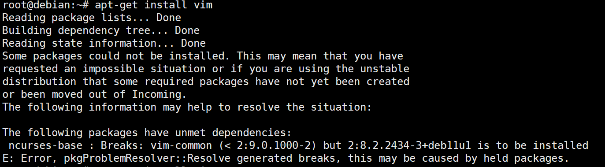

# Debian 修改 IP 开放 Root 远程登录
修改 IP：

1. 进入路径 `cd /etc/network`
2. 进行编辑 `interfaces`

```plain
# This file describes the network interfaces available on your system
# and how to activate them. For more information, see interfaces(5).

source /etc/network/interfaces.d/*

# The loopback network interface
# 这里配置静态地址的话把 ens33 也加上
auto lo ens33
iface lo inet loopback

# The primary network interface
allow-hotplug ens33
#iface ens33 inet dhcp
iface ens33 inet static
address 192.168.109.50
netmask 255.255.255.0
gateway 192.168.109.2
# 顺便配置域名解析服务
dns-nameservers 223.5.5.5, 192.168.109.2
```

3. 重启网卡 `systemctl restart networking`

开放 Root 远程登录：

1. 进入路径 `cd /etc/ssh`
2. 编辑文件 `sshd_config`添加或者取消注释 `PermitRootLogin yes` `PasswordAuthentication yes`分别在 33、57 行左右位置
3. 重启 ssh 服务 `/etc/init.d/ssh restart`

# Debian11 修改 apt-get 源
使用命令 apt-get 安装包时有时会出现 `Media change: please insert the disc labeled`错误，这个是源没有选对，直接修改源 `vi /etc/apt/sources.list`。参考以下：

+ debian11 源

```plain
deb https://mirrors.huaweicloud.com/debian/ bullseye main non-free contrib
deb https://mirrors.huaweicloud.com/debian/ bullseye-updates main non-free contrib
deb https://mirrors.huaweicloud.com/debian/ bullseye-backports main non-free contrib
deb https://mirrors.tuna.tsinghua.edu.cn/debian-security/ bullseye-security main non-free contrib
deb https://security.debian.org/debian-security bullseye-security main non-free contrib
deb-src https://mirrors.huaweicloud.com/debian/ bullseye main non-free contrib
deb-src https://mirrors.huaweicloud.com/debian/ bullseye-updates main contrib
deb-src https://mirrors.huaweicloud.com/debian/ bullseye-backports main non-free contrib
deb-src https://mirrors.tuna.tsinghua.edu.cn/debian-security/ bullseye-security main non-free contrib
deb-src https://security.debian.org/debian-security bullseye-security main non-free contrib
```

+ debian12 源

```plain
deb https://mirrors.tuna.tsinghua.edu.cn/debian/ bookworm main contrib non-free non-free-firmware 
deb-src https://mirrors.tuna.tsinghua.edu.cn/debian/ bookworm main contrib non-free non-free-firmware 
deb https://mirrors.tuna.tsinghua.edu.cn/debian/ bookworm-updates main contrib non-free non-free-firmware 
deb-src https://mirrors.tuna.tsinghua.edu.cn/debian/ bookworm-updates main contrib non-free non-free-firmware 
deb https://mirrors.tuna.tsinghua.edu.cn/debian/ bookworm-backports main contrib non-free non-free-firmware 
deb-src https://mirrors.tuna.tsinghua.edu.cn/debian/ bookworm-backports main contrib non-free non-free-firmware
deb https://mirrors.tuna.tsinghua.edu.cn/debian-security bookworm-security main contrib non-free non-free-firmware 
deb-src https://mirrors.tuna.tsinghua.edu.cn/debian-security bookworm-security main contrib non-free non-free-firmware
```

运行命令更新源 `rm -rf sources.list~ sources.list.d && apt update`

# Debian11 安装 Docker-CE
1. Docker 安装要求 linux 内核不能低于 3.10
2. 安装 Docker 依赖环境

```bash
apt-get install -y apt-transport-https ca-certificates curl gnupg lsb-release
```

3. <font style="color:rgb(51, 51, 51);">添加 Docker 官方的 GPT 密钥</font>

```bash
curl -fsSL https://download.docker.com/linux/debian/gpg | sudo gpg --dearmor -o /usr/share/keyrings/docker-archive-keyring.gpg
```

4. <font style="color:rgb(51, 51, 51);">安装 Docker 源（命令中的 lsb_release -cs 返回 bullseye，也就是debian11 的代号）</font>

```bash
mkdir -p /etc/apt/sources.list.d && touch /etc/apt/sources.list.d/docker.list && echo "deb [arch=amd64 signed-by=/usr/share/keyrings/docker-archive-keyring.gpg] https://download.docker.com/linux/debian $(lsb_release -cs) stable" | sudo tee /etc/apt/sources.list.d/docker.list > /dev/null
```

5. 更新下 apt 源

```bash
apt-get -y update
```

6. 安装 Docker 引擎（这里安装完成就已经启动并且添加到开机自启了）

```bash
apt-get install -y docker-ce docker-ce-cli containerd.io
```

7. 修改 docker 拉取镜像源，[阿里云镜像源](https://cr.console.aliyun.com/cn-hangzhou/instances/mirrors)（data-root 可指定存储本地镜像路径——需要有读写权限）

```bash
mkdir -p /etc/docker && \
tee /etc/docker/daemon.json <<-'EOF'
{
  "data-root": "/home/lhc/softs/docker_storage",
  "registry-mirrors": [
    "https://docker.m.daocloud.io",
    "https://docker.jianmuhub.com",
    "https://huecker.io",
    "https://dockerhub.timeweb.cloud",
    "https://dockerhub1.beget.com"
  ]
}
EOF
```

8. 添加用户到 Docker 组（不用每次切到 root 用户也能使用 docker 命令, docker 组在安装 docker 时已经自动创建完成）

```bash
usermod -aG docker mpsp
# 退出到 mpsp 用户执行以下命令, 或者重启服务器
newgrp docker
```

# Debian12 安装 vim 失败
debian12 安装 vim 时出现以下问题，说是 vim-common 出现版本冲突，于是卸载 vim-common 结果 vi 也不能用了



这里需要按照以下步骤进行处理，aptitude 会给出解决方案，方案一条条给出：方案一时啥也不干，直接 n + 回车否决；方案二为降级两个包的版本，这里可以解决问题，方案三为卸载一个包，降级 ncurses-base （参照提示问题就在这个包上）直接 Y + 回车安装完成，vim 和 vi 都可以使用

```plain
apt-get purge -y vim-common
apt-get update && apt-get upgrade
# 安装 aptitude（功能与 apt-get 一致且拥有解决包冲突的能力）
apt-get install -y aptitude
aptitude install vim
```


# Debian12 安装 bochs
安装版本为: bochs-2.7

1. 首先需要安装依赖 `<font style="color:rgb(24, 25, 28);">apt install -y libghc-x11-dev xorg-dev libgtk2.0-dev libgtk-3-dev libxpm-dev libxrandr-dev </font>build-essential make libsdl1.2-dev libncurses5-dev`
2. <font style="color:rgb(24, 25, 28);">依次运行以下命令安装</font>

```bash
# --prefix 可以指定安装路径
./configure --prefix=/home/liuhaochu/softs/bochs-2.7 --enable-debugger --enable-disasm --enable-iodebug --enable-x86-debugger --with-x --with-x11 --enable-debugger-gui LDFLAGS='-pthread'
make && make install 
# 添加到软链到全局
ln -s 用户路径/bochs /usr/local/bin && ln -s 用户路径/bximage /usr/local/bin
```

3. 如果需要 Debug 版本则需要重写选择一个目录进行安装（在源码目录下运行）

```bash
# 清空原来的编译文件
make clean
./configure \
        --prefix=/home/liuhaochu/softs/bochs-gdb-2.7 \
        --without-wx \
        --with-x11 \
        --with-x \
        --with-term \
        --disable-docbook \
        --enable-cpu-level=6 \
        --enable-fpu \
        --enable-3dnow \
        --enable-disasm \
        --enable-long-phy-address \
        --enable-disasm \
        --enable-pcidev \
        --enable-usb \
        --with-sdl \
        --enable-all-optimizations \
        --enable-gdb-stub \
        --with-nogui
sed -i 's/^LIBS = /LIBS = -lpthread/g' Makefile
make -j 1 & make install
# 这里只需要编译完成的 bochs 即可
ln -s 用户路径/bochs /usr/local/bin/bochs-gdb
```


