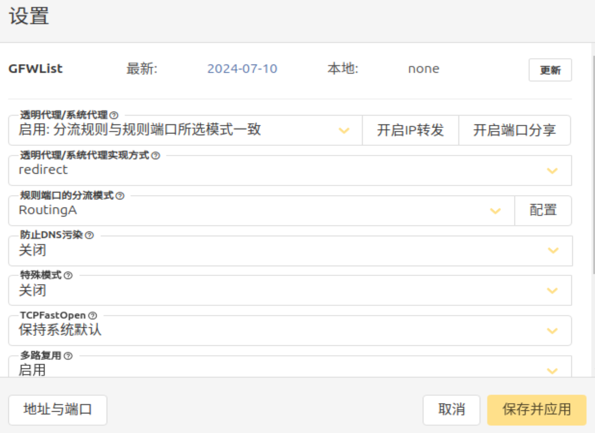

# update-alternatives
用于在 linux 下管理软件版本，其原理如下：

在`/etc/alternatives`存放软链接`link_name`，指向实际的可执行文件`command-version-x`。在`/usr/bin`目录下存放软链接`command_name`指向`/etc/alternatives/link_name`。本质是通过两段软链来达到最终命令指向，之间的一段用于版本控制。

命令参数如下：

```plain
用法：update-alternatives [<选项> ...] <命令>

命令：
  --install <链接> <名称> <路径> <优先级>
    [--slave <链接> <名称> <路径>] ...
                           在系统中加入一组候选项（--slave 可选多个）。
  --remove <名称> <路径>   从 <名称> 替换组中去除 <路径> 项。
  --remove-all <名称>      从替换系统中删除 <名称> 替换组。
  --auto <名称>            将 <名称> 的主链接切换到自动模式。
  --display <名称>         显示关于 <名称> 替换组的信息。
  --query <名称>           机器可读版的 --display <名称>.
  --list <名称>            列出 <名称> 替换组中所有的可用候选项。
  --get-selections         列出主要候选项名称以及它们的状态。
  --set-selections         从标准输入中读入候选项的状态。
  --config <名称>          列出 <名称> 替换组中的可选项，并就使用其中
                           哪一个，征询用户的意见。
  --set <名称> <路径>      将 <路径> 设置为 <名称> 的候选项。
  --all                    对所有可选项一一调用 --config 命令。

<链接> 是指向 /etc/alternatives/<名称> 的符号链接。
    (如 /usr/bin/pager)
<名称> 是该链接替换组的主控名。
    (如 pager)
<路径> 是候选项目标文件的位置。
    (如 /usr/bin/less)
<优先级> 是一个整数，在自动模式下，这个数字越高的选项，其优先级也就越高。

选项：
  --altdir <目录>          改变候选项目录。
                             （默认是 /etc/alternatives）。
  --admindir <目录>        设置 statoverride 文件的目录。
                             （默认是 /var/lib/dpkg/alternatives）。
  --instdir <目录>         改变安装目录。
  --root <目录>            改变文件系统根目录。
  --log <文件>             改变日志文件。
  --force                  允许使用候选项链接替换文件。
  --skip-auto              在自动模式中跳过设置正确候选项的提示
                           (只与 --config 有关)
  --quiet                  安静模式，输出尽可能少的信息。
  --verbose                启用详细输出。
  --debug                  调试输出，信息更多。
  --help                   显示本帮助信息。
  --version                显示版本信息。
```

以下示例管理 gcc 版本

```bash
# 添加多个 gcc
sudo update-alternatives --install /usr/bin/gcc gcc /usr/bin/gcc-5 10 --slave /usr/bin/g++ g++ /usr/bin/g++-5
sudo update-alternatives --install /usr/bin/gcc gcc /usr/bin/gcc-7 20 --slave /usr/bin/g++ g++ /usr/bin/g++-7
# 展示 gcc 版本
sudo update-alternatives --display gcc
# 移除 gcc-7 的版本
sudo update-alternatives --remove gcc /usr/bin/gcc-7
# 交互式的管理 gcc 版本
sudo update-alternatives --config gcc
```

# v2raya
该工具可在 linux 下运行一个 web 应用用于管理当前 linux 的代理（适合给软路由和虚拟机安装）。本质还是使用的 v2ray-core，该工具相当于封装了一个 web 版本。

可从 github 直接[下载](https://github.com/v2rayA/v2rayA)，该软件依赖 v2ray-core，因此要先下载 [v2ray-core](https://github.com/v2fly/v2ray-core)。

1. 首先下载并解压 v2ray-core`mkdir v2ray && unzip v2ray-linux-64.zip -d v2ray`
2. 下载 v2raya 的安装包直接安装`sudo apt install -y /home/lhc/packages/installer_debian_x64_2.2.5.7.deb`
3. 安装完成后由于 v2ray-core 不是通过 apt 安装的，因此需要修改一下 v2raya 的配置，该配置在`/etc/default/v2raya`修改其中的`V2RAYA_V2RAY_CONFDIR、V2RAYA_V2RAY_ASSETSDIR`将其都改为 v2ray-core 解压后的文件夹。其它参数可自行修改
4. 启动并添加到开机启动项`systemctl daemon-reload && systemctl start v2raya.service && systemctl enable v2raya.service`
5. 通过浏览器打开`127.0.0.1:2017`（局域网在确定不受防火墙干扰的情况下也可以通过其它主机登录管理）可打开控制台页面。第一次打开时需要创建账号。进入后导入订阅规则，然后选择可用节点
6. 右上角配置选择如下



7. 保存并应用后，左上角点击开启，最后在终端中验证一下`curl google.com`（注意该软件暂时不能代理 ping 命令，本质还是通过修改路由表的方式实现的代理）


