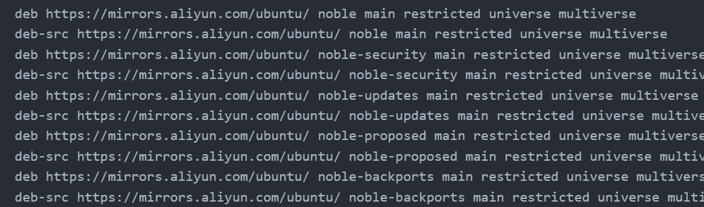
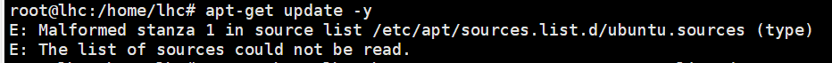
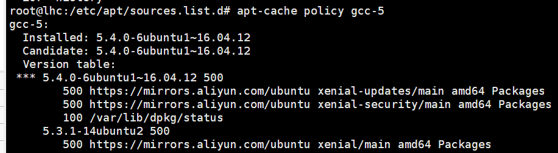
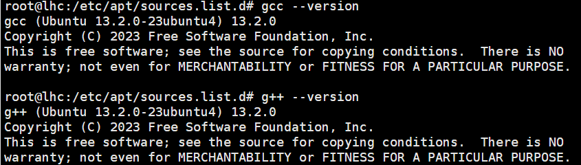

# ubuntu24.04-live-server 安装
1. 子网划分时只能选用 CDIR 进行，因此大部分划分格式为 `192.168.x.0/24`
2. 分区时自定义分区必须添加 /boot （分配 2G 即可）swap （一般分配 2G，实机可不分配），否在在格式化时会直接奔溃，其余空间均挂载在 / 下即可
3. 记得勾选 ssh 服务

# ubuntu 换源
+ 所有版本都可以直接修改 `/etc/apt/sources.list.d/ubuntu.sources`文件（以下为 24.04 版本对应的源，其它版本需要自行对应第二列的[版本号](https://wiki.ubuntu.com/Releases/)）

```bash
deb https://mirrors.aliyun.com/ubuntu/ noble main restricted universe multiverse
deb-src https://mirrors.aliyun.com/ubuntu/ noble main restricted universe multiverse
deb https://mirrors.aliyun.com/ubuntu/ noble-security main restricted universe multiverse
deb-src https://mirrors.aliyun.com/ubuntu/ noble-security main restricted universe multiverse
deb https://mirrors.aliyun.com/ubuntu/ noble-updates main restricted universe multiverse
deb-src https://mirrors.aliyun.com/ubuntu/ noble-updates main restricted universe multiverse
deb https://mirrors.aliyun.com/ubuntu/ noble-proposed main restricted universe multiverse
deb-src https://mirrors.aliyun.com/ubuntu/ noble-proposed main restricted universe multiverse
deb https://mirrors.aliyun.com/ubuntu/ noble-backports main restricted universe multiverse
deb-src https://mirrors.aliyun.com/ubuntu/ noble-backports main restricted universe multiverse
```

+ ubuntu24.04 的源地址配置文件发生改变，`/etc/apt/sources.list `文件内容变成了一行注释 `# Ubuntu sources have moved to /etc/apt/sources.list.d/ubuntu.sources`新的官方源配置放在了`/etc/apt/sources.list.d/ubuntu.sources`中，升级前的三方源被放在了`/etc/apt/sources.list.d/third-party.sources`中
    1. 首先修改`sources.list.d/ubuntu.sources`，添加`Enabled: no`进行禁用

```bash
Enabled: no
Types: deb
URIs: http://archive.ubuntu.com/ubuntu
Suites: noble noble-updates
Components: main restricted universe multiverse
Signed-By: /usr/share/keyrings/ubuntu-archive-keyring.gpg

Enabled: no
Types: deb
URIs: http://security.ubuntu.com/ubuntu
Suites: noble-security
Components: main restricted universe multiverse
Signed-By: /usr/share/keyrings/ubuntu-archive-keyring.gpg
```

    2. 在目录 `/etc/apt/sources.list.d`下新建 `third-party.sources`（名字其实无所谓）

```bash
# 清华源
Enabled: yes
Types: deb
URIs: https://mirrors.tuna.tsinghua.edu.cn/ubuntu/
Suites: noble noble-updates noble-security
Components: main restricted universe multiverse
Signed-By: /usr/share/keyrings/ubuntu-archive-keyring.gpg

# 中科大源
Enabled: yes
Types: deb
URIs: https://mirrors.ustc.edu.cn/ubuntu/
Suites: noble noble-updates noble-security
Components: main restricted universe multiverse
Signed-By: /usr/share/keyrings/ubuntu-archive-keyring.gpg

# 阿里源
Enabled: yes
Types: deb
URIs: https://mirrors.aliyun.com/ubuntu/
Suites: noble noble-updates noble-security
Components: main restricted universe multiverse
Signed-By: /usr/share/keyrings/ubuntu-archive-keyring.gpg

# 网易源
Enabled: no
Types: deb
URIs: https://mirrors.163.com/ubuntu/
Suites: noble noble-updates noble-security
Components: main restricted universe multiverse
Signed-By: /usr/share/keyrings/ubuntu-archive-keyring.gpg

# 腾讯源
Enabled: yes
Types: deb
URIs: https://mirrors.tencent.com/ubuntu/
Suites: noble noble-updates noble-security
Components: main restricted universe multiverse
Signed-By: /usr/share/keyrings/ubuntu-archive-keyring.gpg
```

+ ubuntu24.04 如果直接把以下内容写入 `/etc/apt/sources.list`



会出现以下错误



+ 如果需要安装低版本的 gcc 则需要添加低版本的 ubuntu 源，添加以下源运行`apt update`更新后安装

```bash
Enabled: yes
Types: deb
URIs: https://mirrors.aliyun.com/ubuntu/
Suites: xenial xenial-updates xenial-security
Components: main universe
Signed-By: /usr/share/keyrings/ubuntu-archive-keyring.gpg
```

以 gcc5 为例进行安装：

1. 首先查看 gcc5 可选的版本`apt-cache policy gcc-5`



2. 选择其中一个版本进行安装 `apt-get install -y gcc-5=5.4.0-6ubuntu1~16.04.12 g++-5=5.4.0-6ubuntu1~16.04.12`
3. 将 gcc5、g++5 设为默认版本 `update-alternatives --install /usr/bin/gcc gcc /usr/bin/gcc-5 30 && update-alternatives --install /usr/bin/g++ g++ /usr/bin/g++-5 30`
4. 运行命令`gcc --version`、`g++ --version`输出以下结果无误



# ubuntu 安装 docker
由于各种原因现在只推荐离线安装 docker 了

1. 首先需要卸载之前安装过的 docker 应用，执行以下命令删除 docker

```bash
 for pkg in docker.io docker-doc docker-compose docker-compose-v2 podman-docker containerd runc; do sudo apt-get remove $pkg; done
```

2. 需要安装一些依赖`apt-get install -y apt-transport-https ca-certificates curl gnupg lsb-release`（这些依赖是为通过 apt 在线安装服务的，如果是离线安装则无需下载安装）
3. 去[官网](https://download.docker.com/linux/ubuntu/dists/noble/pool/stable/amd64/)直接下载对应的安装包，需要注意平台和操作系统版本。这里需要下载`docker-ce docker-ce-cli containerd.io docker-buildx-plugin docker-compose-plugin`这 5 个包即可
4. 通过命令进行安装

```bash
dpkg -i ./containerd.io_<version>_<arch>.deb \
  ./docker-ce_<version>_<arch>.deb \
  ./docker-ce-cli_<version>_<arch>.deb \
  ./docker-buildx-plugin_<version>_<arch>.deb \
  ./docker-compose-plugin_<version>_<arch>.deb
```

5. 修改配置文件，然后重启 docker 应用`systemctl restart docker`

```bash
mkdir -p /etc/docker && \
tee /etc/docker/daemon.json <<-'EOF'
{
  "data-root": "/home/lhc/softs/docker_storage",
  "registry-mirrors": [
    "https://docker.m.daocloud.io",
    "https://docker.jianmuhub.com",
    "https://huecker.io",
    "https://dockerhub.timeweb.cloud",
    "https://dockerhub1.beget.com"
  ]
}
EOF
```

6. 添加 docker 服务权限给普通用户组

```bash
usermod -aG docker mpsp
# 退出到 mpsp 用户执行以下命令, 或者重启服务器
newgrp docker
```

