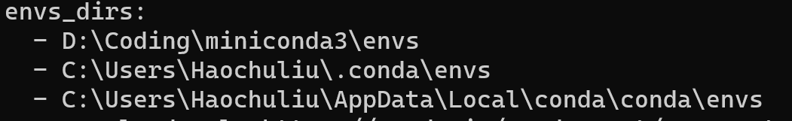
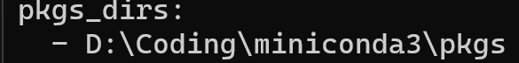
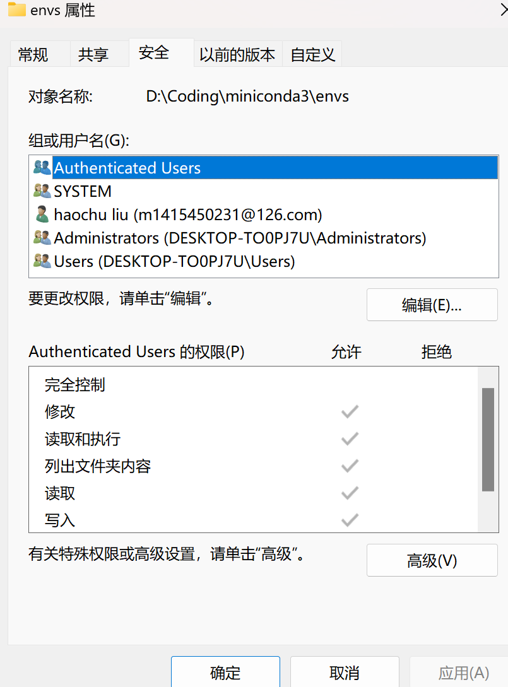

# ext

# --no-sandbox

有时候运行在 windows 上的由 electron 构建的应用会闪退，无法启动。需要在启动的快捷方式最后加上\*\* \*\*--no-sandbox ，暂时不知道原因。

# Windows 下 Miniconda 默认环境安装到 C 盘

1. 可以执行 `conda config --show`查看默认的安装路径





2. 首先在 `C:\Users\Haochuliu\.condarc`中直接修改路径

```yaml
channels:
  - defaults
show_channel_urls: true
default_channels:
  - https://mirrors.tuna.tsinghua.edu.cn/anaconda/pkgs/main
  - https://mirrors.tuna.tsinghua.edu.cn/anaconda/pkgs/r
  - https://mirrors.tuna.tsinghua.edu.cn/anaconda/pkgs/msys2
custom_channels:
  conda-forge: https://mirrors.tuna.tsinghua.edu.cn/anaconda/cloud
  msys2: https://mirrors.tuna.tsinghua.edu.cn/anaconda/cloud
  bioconda: https://mirrors.tuna.tsinghua.edu.cn/anaconda/cloud
  menpo: https://mirrors.tuna.tsinghua.edu.cn/anaconda/cloud
  pytorch: https://mirrors.tuna.tsinghua.edu.cn/anaconda/cloud
  pytorch-lts: https://mirrors.tuna.tsinghua.edu.cn/anaconda/cloud
  simpleitk: https://mirrors.tuna.tsinghua.edu.cn/anaconda/cloud
ssl_verify: false
envs_dirs:
  - D:\Coding\miniconda3\envs
pkgs_dirs:
  - D:\Coding\miniconda3\pkgs
```

3. 如果还是安装在 C 盘需要修改对应文件夹的权限



4. 最后安装环境只会在 C 盘生成 `C:\Users\Haochuliu\.conda\environments.txt`文件
