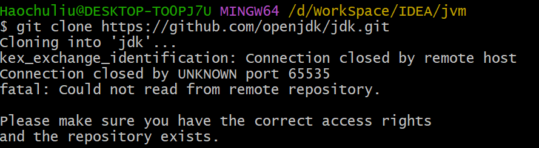

# Git 创建密钥以及配置代理
键入以下命令，连敲三次回车生成公钥，默认生成路径（第一次敲回车前就是设置路径） C:\Users\Haochuliu\.ssh

```bash
ssh-keygen -t ed25519 -C "邮箱地址"
```

配置本地用户名、邮箱

```bash
git config --global user.name 用户名
git config --global user.email 邮箱
```

配置全局代理

```bash
# HTTP/HTTPS 协议 单独为 github配置
git config --global http.proxy://github.com.proxy http://127.0.0.1:10809
# SOCKS5 协议
git config --global http.proxy://github.com.proxy socks5://127.0.0.1:10808
# HTTP/HTTPS 协议 全局配置
git config --global http.proxy http://127.0.0.1:10809
# SOCKS5 协议 全局配置
git config --global http.proxy socks5://127.0.0.1:10808
# 也可以直接修改 C:\Users\Haochuliu\.gitconfig 文件
# 以下为示例
[user]
	email = 1814876440@qq.com
	name = haochuliu
[url "git@github.com:"]
	insteadOf = https://github.com
[http "proxy://github.com"]
	proxy = http://127.0.0.1:10809
	sslVerify = false
[https "proxy://github.com"]
	proxy = http://127.0.0.1:10809
	sslVerify = false
[url "git@gitee.com:"]
	insteadOf = https://gitee.com
[http "proxy://gitee.com"]
	proxy = http://127.0.0.1:10809
	sslVerify = false
[https "proxy://gitee.com"]
	proxy = http://127.0.0.1:10809
	sslVerify = false
[safe]
	directory = *
# 这里为不需要走代理的仓库地址
[credential "http://git.ci.xxx.com.cn"]
	provider = generic

```

多账户设置代理，在目录下（C:\Users\Haochuliu\.ssh）创建 config 文件，写入以下内容

```bash
# Host：仓库网站的别名，随意写，这个别名可以在 git clone 时替换原本域名
# HostName：仓库网站的域名（PS：IP 地址应该也可以）
# Port：SSH 默认的端口
# User：仓库网站上的用户名，最好写成邮箱
# IdentityFile：私钥的绝对路径
# ProxyCommand：代理方式，使用 connect 进行代理（这个 connect 安装 git 后会自带）
Host github.com
HostName github.com
Port 22
User 1814876440@qq.com
PreferredAuthentications publickey
IdentityFile "C:\Users\Haochuliu\.ssh\id_ed25519"
ProxyCommand "D:\Apps\Git\mingw64\bin\connect.exe" -S 127.0.0.1:10808 -a none %h %p
TCPKeepAlive yes

Host gitee.com
HostName gitee.com
Port 22
User 1814876440@qq.com
PreferredAuthentications publickey
IdentityFile "C:\Users\Haochuliu\.ssh\id_ed25519"
ProxyCommand "D:\Apps\Git\mingw64\bin\connect.exe" -S 127.0.0.1:10808 -a none %h %p
TCPKeepAlive yes
```

# Git 本地创建密钥
github 自 2022 年 3 月份以后需要更改密钥生成规则，以下是生成过程

1. 打开 git bash 键入命令：ssh-keygen -t ed25519 -C "your-email"  然后连敲三次回车
2. cat ~/.ssh/id_ed25519.pub
3. 将密钥复制到 github ssh密钥配置
4. 键入命令生成 know_host 文件 ssh-keyscan -t rsa github.com >> ~/.ssh/known_hosts
5. ssh -T git@github.com 验证是否成功（gitee 验证为 ssh -T git@gitee.com）

# Git 远程创建仓库和本地关联
1. 首先在 github 创建远程仓库
2. 本地打开 git bash 键入命令：git init
3. 本地创建分支：git branch -b 分支名称（如果不创建默认就是 master）
4. 关联远程仓库：git remote add origin 远程仓库地址
5. 本地创建远程分支：git push --set-upstream origin 本地分支名称（可尝试加 -f 强制创建）
6. 正常 git add .      git commit -m 提交描述     git push

# Gitee、Git 配置公钥后依旧需要使用密码登录
这里大概率当前仓库是通过 https 拉取下来的，需要改成 ssh 才行。

+ 直接进入项目的 .git 文件夹中找到 config 文件直接修改文件中的 url 为 ssh 协议即可

# Git clone 指定文件或者文件夹而不是整个仓库
可以使用 Sparse Checkout 模式，需要 Git 版本至少为 2.37.1，依次键入以下命令，单独拉取文件、文件夹

```bash
# 初始化本地仓库
git clone --filter=blob:none --no-checkout --depth 1 --sparse <project-url>
# 进入仓库
cd <project>
# 添加需要单独拉取的文件夹名称
git sparse-checkout add <folder1> <folder2>
# 开始拉取
git checkout
```

# Git 常用命令
1. git 删除本地分支 `git branch --delete 分支名`
2. git 删除远程分支 `git push origin --delete 分支名`
3. git 删除提交到暂存区的文件/文件夹<font style="color:rgb(51, 51, 51);"> </font>`git rm --cache 文件名` `git rm --cache -r 文件夹`（不带参数 --cache 则会删除源文件/文件夹，这个路径是从工程的根路径算起）
4. git 查看提交信息/版本号 `git log`
5. git 撤销某次修改 `git reset --mixed commitID`（--soft 仅仅只是撤销已提交的版本库，不会修改暂存区和工作区；--mixed 仅仅只是撤销已提交的版本库和暂存区，不会修改工作区；--hard 彻底将工作区、暂存区和版本库记录恢复到指定的版本库。<font style="color:#DF2A3F;">--hard 使用之前必须保证尚未提交的代码已经提交，不然会丢失代码</font>）
6. git 删除某次提交（提交历史记录也不存在）首先 `git log`查看要删除的提交编号，然后`git rebase -i commitID`进入 vim 编辑，找到对应的 commitid 将 pick 修改未为 drop，保存退出即可。

# Git 配置代理错误
以下错误大概率是代理配置错误或者代理不支持 ssh 连接（socket 代理连接），可以尝试修改为 http 代理连接



