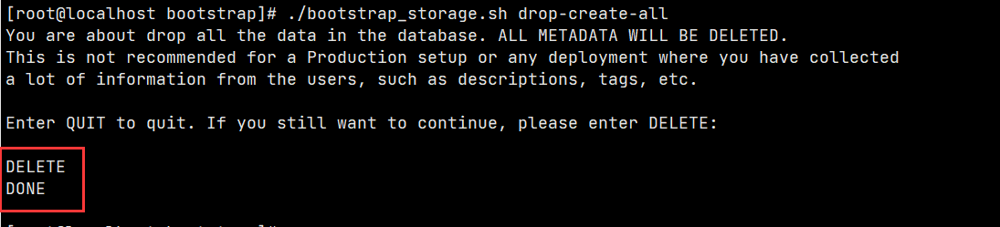
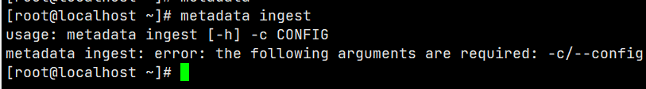

# openmetadata 部署

# JDK 11 环境

服务器 172.16.30.115/172.16.30.116/172.16.30.117 请将默认的 jdk 版本修改至 jdk11。

172.21.80.65/172.22.80.65 均需要默认 jdk11 的运行环境，可以从 172.16.30.115 复制过来并设置为默认的 jdk 环境

# ES7 环境安装

1. 上传附件中的文件 elasticsearch-7.17.10-no-jdk-linux-x86\_64.tar.gz 到服务器 172.16.30.115/172.16.30.116/172.16.30.117
2. 三台服务器均解压到 mpsp 用户路径下`tar -xf ./elasticsearch-7.17.10-no-jdk-linux-x86_64.tar.gz -C /usr/mpsp`
3. 三台服务器均需要配置 ES 所需的环境（以 root 用户执行）

```bash
vim /etc/security/limits.conf
# 在文件末尾添加内容
* soft nproc   unlimited # The maximum number of processes available to a single user
* hard nproc   unlimited
* soft memlock unlimited # The maximum size that may be locked into memory
* hard memlock unlimited
* soft core    unlimited # The maximum size of core files created
* hard core    unlimited
* soft stack   unlimited
* hard stack   unlimited
vim /etc/systemd/system.conf
# 在文件末尾添加内容
DefaultLimitMEMLOCK=infinity
vim /etc/sysctl.conf
# 在文件末尾添加内容
vm.max_map_count=655360
```

执行以下命令应用变更 `source /etc/profile && sysctl -p`

4. 三台服务器均需要配置 jvm 参数（这里直接删除原来的文件，使用以下文件内容）

```bash
rm -rf /usr/mpsp/elasticsearch-7.17.10/config/jvm.options && vim /usr/mpsp/elasticsearch-7.17.10/config/jvm.options
# 以下为 jvm.options 文件内容
-Xms16g
-Xmx16g
-XX:+UseG1GC
-Djava.io.tmpdir=${ES_TMPDIR}
-XX:+HeapDumpOnOutOfMemoryError
9-:-XX:+ExitOnOutOfMemoryError
-XX:HeapDumpPath=data
-XX:ErrorFile=logs/hs_err_pid%p.log
9-:-Xlog:gc*,gc+age=trace,safepoint:file=logs/gc.log:utctime,pid,tags:filecount=32,filesize=64m
```

5. 172.16.30.115 服务器上的 es 配置文件（第 34 行的 数据存储和 第 36 行的日志存储路径需要按照实际情况配置）

```bash
rm -rf /usr/mpsp/elasticsearch-7.17.10/config/elasticsearch.yml && vim /usr/mpsp/elasticsearch-7.17.10/config/elasticsearch.yml
# elasticsearch.yml 文件内容

# 集群名称，一个集群的名称需要一致
cluster.name: openmetadata-cluster
# 当前节点名称
node.name: node-172_16_30_115
# 启动时锁定内存，centos6 以下需要关闭此参数
bootstrap.memory_lock: true
# 绑定本机网络
network.host: 172.16.30.115
# 开放给外部调用的端口
http.port: 9200
# 集群间通信端口
transport.tcp.port: 9300
# 该节点是否可被选为 master
node.master: true
# 该节点是否存储数据
node.data: true
# 为了避免脑裂，集群节点数最少为 半数+1
discovery.zen.minimum_master_nodes: 2
# 只要指定数量的节点加入集群，就开始进行恢复
gateway.recover_after_nodes: 2
# ES 的查询参数限制，默认是限制只能传入1024个参数
indices.query.bool.max_clause_count: 10240
# 将阻止主副本分片被分配到同一台物理机，提高可用性
cluster.routing.allocation.same_shard.host: true
# 设置是否压缩tcp传输时的数据，默认为 false，不压缩。 
transport.tcp.compress: true
# 是否支持跨域
http.cors.enabled: true
http.cors.allow-origin: "*"
# 数据存储路径
path.data: /usr/mpsp/elasticsearch-7.17.10/data
# 日志存储路径
path.logs: /usr/mpsp/elasticsearch-7.17.10/logs
# 该配置将用作发现其它节点
discovery.seed_hosts: ["172.16.30.115:9300", "172.16.30.116:9300", "172.16.30.117:9300"]
# 集群初始化时的主节点候选，一旦启动集群成功后需要删除所有节点的该配置选项
cluster.initial_master_nodes: ["node-172_16_30_115", "node-172_16_30_116", "node-172_16_30_117"]
```

6. 172.16.30.116 服务器上的 es 配置文件和 第 5 点文件基本一致，修改第 7、11 行内容即可

```bash
node.name: node-172_16_30_116
network.host: 172.16.30.116
```

7. 172.16.30.117 服务器上的 es 配置文件和 第 5 点文件基本一致，修改第 7、11 行内容即可

```bash
node.name: node-172_16_30_117
network.host: 172.16.30.117
```

8. 三台服务器上均修改文件夹所属用户为 mpsp 然后切换用户到 mpsp（ES 无法以 root 用户启动），然后执行命令启动 ES

```bash
chown -R mpsp:develop /usr/mpsp/elasticsearch-7.17.10
su mpsp
cd /usr/mpsp/elasticsearch-7.17.10
nohup ./bin/elasticsearch >> elasticsearch.log &
```

9. 观察日志当三台服务器上的 ES 启动完毕后执行以下命令查看集群状态（在三台中的任意一台执行均可），若为绿色则集群状态正常 `curl http://localhost:9200/_cat/health?v`


10. 集群安装完成后运行命令删除三台服务上的主节点候选配置项（即最后一行）理由：集群初始化时需要指定候选节点，当集群启动后集群信息被持久化到本地，不再需要指定项配置（避免下次重启混乱）

```bash
sed -i '$d' /usr/mpsp/elasticsearch-7.17.10/config/elasticsearch.yml
```

# 配置虚 ip

172.16.30.115/172.16.30.116/172.16.30.117 上部署的三个 ES 节点需要为其配置虚 ip

# openmetadata 安装

1. 上传文件 openmetadata-1.0.1.tar.gz 到 172.21.80.65/172.22.80.65
2. 两天服务器均解压到 mpsp 目录下 `tar -xf ./openmetadata-1.0.1.tar.gz -C /usr/mpsp`
3. 两台服务器配置文件均一致

```bash
vim /opt/softs/openmetadata-1.0.1/conf/openmetadata-env.sh
# 写入以下内容
export OPENMETADATA_HEAP_OPTS="-Xmx2G -Xms2G"
```

以下文件的 es 虚 ip 需要按照实际生产环境配置

```bash
vim /usr/mpsp/openmetadata-1.0.1/conf/openmetadata.yaml
# 123 行起修改以下内容
database:
  # the name of the JDBC driver, mysql in our case
  driverClass: ${DB_DRIVER_CLASS:-com.mysql.cj.jdbc.Driver}
  # the username and password
  user: root
  password: mysql123
  # the JDBC URL; the database is called openmetadata_db
  url: jdbc:mysql://127.0.0.1:3306/openmetadata?allowPublicKeyRetrieval=true&useSSL=false&serverTimezone=UTC
# 212 行起修改以下内容
elasticsearch:
  host: 172.16.30.115
  port: 9200
  scheme: http
  #username: ${ELASTICSEARCH_USER:-""}
  #password: ${ELASTICSEARCH_PASSWORD:-""}
  #truststorePath: ${ELASTICSEARCH_TRUST_STORE_PATH:-""}
  #truststorePassword: ${ELASTICSEARCH_TRUST_STORE_PASSWORD:-""}
```

4. 执行数据库初始化脚本 <code>cd /usr/mpsp/openmetadata-1.0.1 && ./bootstrap/bootstrap_storage.sh drop-create-all</code>
5. 稍等脚本会提示输入，请求输入 `DELETE`后等待 DONE 即完成数据库初始化



5. 两台服务器均启动服务 `/usr/mpsp/openmetadata-1.0.1/bin/openmetadata.sh start`

# Ingest 插件安装

以下操作需要在 172.16.30.113/172.16.30.114 操作

1. 安装 python3.10.0 环境，需要切换至 root 用户操作

```bash
# 安装 python3 需要的依赖，当 python 版本大于 3.10 时需要添加 zip* 
yum -y install zlib-devel bzip2-devel openssl-devel ncurses-devel sqlite-devel readline-devel tk-devel gcc make libffi-devel zip*
# 首先需要安装 openssl-1.1.1
wget http://www.openssl.org/source/openssl-1.1.1.tar.gz
tar -xf openssl-1.1.1.tar.gz && cd openssl-1.1.1 && ./config --prefix=/usr/local/openssl shared zlib
make && make install
# 设置环境变量
echo "export LD_LIBRARY_PATH=$LD_LIBRARY_PATH:/usr/local/openssl/lib" >> /etc/profile && source /etc/profile
# 下载 python 安装包
wget https://www.python.org/ftp/python/3.10.0/Python-3.10.0.tar.xz
# 解压至指定目录
tar -Jxvf Python-3.10.0.tar.xz
# 进入目录开始编译
cd Python-3.10.0
# 这里可以开启编译优化 --enable-shared --enable-optimizations 但是需要 gcc 8.1.0 以上才行
./configure prefix=/usr/local/python3 --with-openssl=/usr/local/openssl
make && make install
# 建立软链或者也可以配置环境变量
ln -s /usr/local/python3/bin/python3.10 /usr/local/bin/python3
ln -s /usr/local/python3/bin/pip3.10 /usr/local/bin/pip3
```

2. 开始安装 ingest 插件 `pip3 install "openmetadata-ingestion[db2]" "openmetadata-ingestion[mysql]" "openmetadata-ingestion[oracle]" -i https://pypi.tuna.tsinghua.edu.cn/simple`
3. 添加至全局环境中 `ln -s /usr/local/python3/bin/metadata /usr/local/bin/metadata`
4. 安装完成后执行命令 `metadata ingest`验证，以下结果为正常


