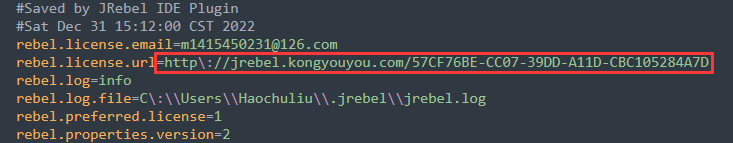
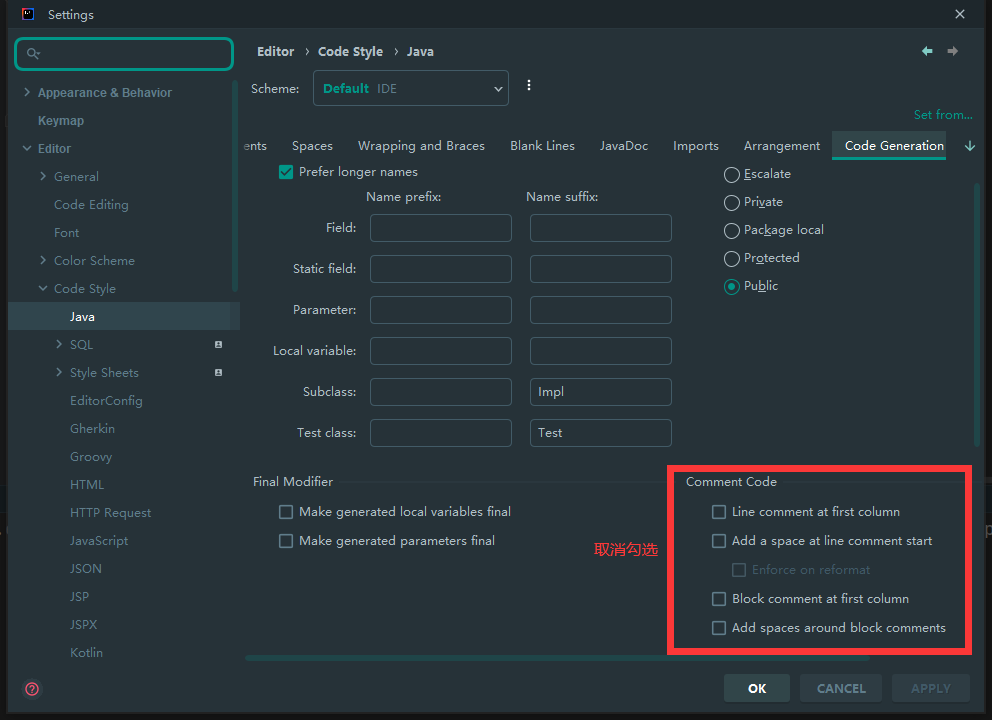

# tool

# IDEA 激活

[激活网址](https://3.jetbra.in/)

IDEA 文件配置

```yaml
# 增加下面三列
-javaagent:实际路径\ja-netfilter.jar=jetbrains
--add-opens=java.base/jdk.internal.org.objectweb.asm=ALL-UNNAMED
--add-opens=java.base/jdk.internal.org.objectweb.asm.tree=ALL-UNNAMED
```

# JRebel 插件激活

[插件激活网址](http://jrebel-license.jiweichengzhu.com/)

还需要一个 UUID 就填后面这个就行  57CF76BE-CC07-39DD-A11D-CBC105284A7D

完整地址  http://jrebel.kongyouyou.com/57CF76BE-CC07-39DD-A11D-CBC105284A7D

邮箱随便填一个就行

JRebel 插件升级后可能会无法激活，需要修改配置文件，配置文件路径：C:\Users${用户名}.jrebel\jrebel.properties 修改里面的 rebel.license.url 用上面的地址就行。



# IDEA 设置注释不顶行

File -> Settings -> Editor -> Code Style -> Java（其它语言也一样） -> Code Generation

如下图取消勾选即可



# Chrome 浏览器修改 cookie 变相登录

有些时候在一条电脑上登录之后另一台电脑需要重复登录，或者没有登录凭证（登录时三方的程序完成的）这时候需要移植 cookie 来实现变相登录。

1. 首先在已经登录的浏览器页面打开控制台输入`document.cookie`获取 cookie
2. 然后在未登录浏览器的需要登录界面打开控制台

```javascript
// 定义函数
function UpdateCookies(cookies) {
  datas = cookies.split(";")
  for(var i=0; i<datas.length; i++) {
    document.cookie = datas[i]
  }
  return "success"
}
// 定义已经登录的 cookie
cookies = '上一步获取的 cookie'
// 修改 cookie 实现登录
UpdateCookies(cookies)
```
