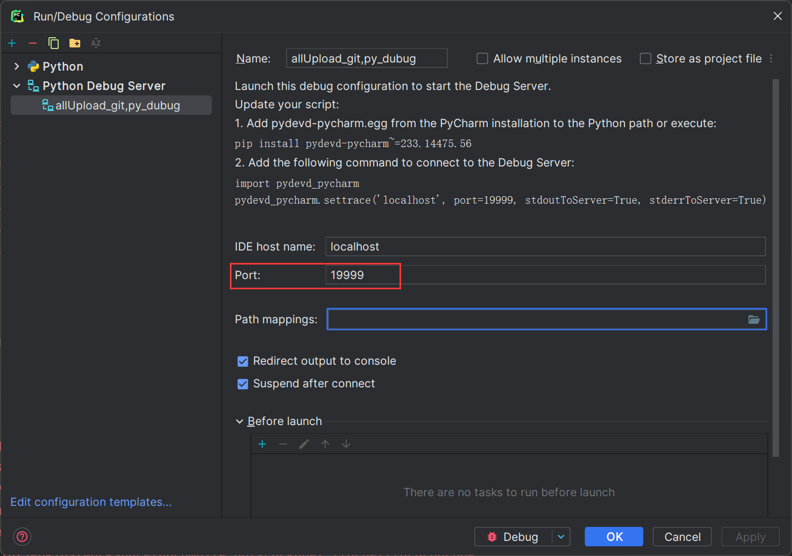

# Python 正则替换
正则替换可以使用内置的  re 包进行，主要用到其中的两个方法：

1. re.findall(p1: str, p2: str) -> List 第一个参数是正则表达式，第二个参数是要进行正则匹配的字符串，它返回一个列表表示进行正则匹配到的区域，这种方式可以简单使用，但是再重复多次使用时会有性能问题，可以采用下面的方案提前编译正则表达式
2. re.compile(p1: str, [flags: re.x]) 这个方法可以返回一个正则表达式对象 _compile，用作以后的多次匹配，第一个参数是正则字符串，第二个参数为匹配模式，它有以下选项：

1）re.IGNORECASE：忽略大小写

2）re.MULTILINE：多行模式

3）re.DOTALL：点号匹配任意字符，包括换行符

3）re.UNICODE：启用 Unicode 匹配

4）re.VERBOSE：启用详细模式，可以在正则表达式中添加注释和空格

接着可以使用返回的对象（_compile）调用 match、search、findall 可以获取匹配到的结果（匹配不到返回 None）search 可以指定匹配起始和结束下标，match 不行，如果要返回多个匹配结果要选用 findall

+ 正则提取书写规则，与一般的正则匹配一致，主要用 () 包含需要替换的字符部分，以下为示例（其中的 group 表示 () 的位置，从 1 开始算起）：

```python
import re
pattern = re.compile(r'.*山东县(.+)')

# 需要匹配的字符串列表
strings = ['xxx山东县临沂市兰陵县', 'xxxx山东省山东县平度市', 'xxx山东县威海市文登区']

# 遍历字符串列表并匹配
for string in strings:
    match = pattern.match(string)
    if match:
        result = match.group(1)
        print(result)
# 临沂市兰陵县  山东县平度市 威海市文登区
```

+ 正则替换书写规则：如果是想去除字符串中的某些字符，则可以这么书写：

```python
import re
# [] 里面表示任意匹配
reg1 = re.compile('[·()（）]')
s1 = 'xxxx () ()) yyyy ·'
# 替换为空串或者你想指定的字符
print(re.sub(reg1, '', s1))
# xxxx  yyyy 
```

# Conda 移植环境
1. 首先在源机器上安装额外组件 `conda install -c conda-forge conda-pack`
2. 开始打包需要移植的环境 `conda pack -n 需要移植的环境名称 -o 新环境名称.tar.gz`
3. 上传压缩包到新机器上，在新的机器上安装 conda 的 env 目录下（忘记安装位置可以运行 `conda info -e`查看）创建和移植环境名称一致的文件夹，然后解压压缩包到这个目录下即可
4. 最后运行命令查看 `conda activate 环境名称`

# requsets 库发送原始 JSON 数据
python 的 requests 库在发送 json 数据时会对发送的 json 字符串做美化处理（在 key 和 value 之间加空格）有些接口在验签的时候对这个很敏感，因此需要发送原始的 json 字符串。这个时候可以对其进行编码，例如：

```python
import requests

url = 'https://fx.soopay.net/cberest/v1/payments/payment'

json_str = r'{"payer":{"payment_method":"NOT_APPLICABLE","payer_info":{"phone":"17610496925"},"interface_type":"SERVER_TO_WEB","external_customer_id":"UMP1499826888843602","business_type":"B2C"},"order":{"mer_reference_id":"0612101924800101","mer_date":"20230612","amount":{"total":"0.01","currency":"CNY"},"order_summary":"test","expire_time":"360","user_ip":"10.10.70.133","sub_orders":[{"mer_sub_reference_id":"0612101924800102","trans_code":"01122030","amount":{"total":"0.01","currency":"CNY"},"is_customs":"TRUE","invoice_id":"123456","items":[{"mer_item_id":"0612101924801103","type":"ELECTRONIC","name":"商品1","quantity":"2","description":"描述1","amount":{"total":"0.01","currency":"CNY"}}]}],"sub_mer_id":"umfsubmer001"},"notify_url":"http://10.10.178.36:2216/spay_rest/payments/test/mer","ret_url":"http://10.10.178.36:2213/notify0000V4.jsp","risk_info":{"trans_type":"02"}}'
headers = {
    "Content-Type": r"application/json",
    "Authorization": r"Bearerb9de255a2e11ca6c9b7388c03016b2496c9b655e431d9b64b5fe6bde7d8524d1",
    "Accept-Language": r"ZH",
    "Charset": r"UTF-8",
    "Signature": r"TA0jL8o+P5FrtYAfT/Q73/SC+pkKdCyBYNzcU/g6ZadM3T3W5+6sZuCI1eIIqv1Mr1enA3KGahs0auLtVRGgUw9kQnNL0m8n8noZHrkRMgZbZpyFXh529sy9wBRGgYrb15qSGj73gXQUqfe5IAPZbr1pw0nUdDbq2InyBXdSbpU="
}

# 需要将原始的 json 的字符串变成字节数组
if __name__ == '__main__':
    ret = requests.post(url=url, headers=headers, data=json_str.encode('utf-8'))
    print(ret.json())
```

# Java P8 类型 RSA 密钥对应 Python 加密、验签、解密
java 的 p8 类型证书中的 SHA1withRSA 对应 python pycryptodome 库的 PKCS1_v1_5 算法

```python
from typing import Dict

import Crypto
import requests
from Crypto.PublicKey import RSA
from Crypto.Signature import PKCS1_v1_5
from Crypto.Cipher import PKCS1_v1_5 as PKCS1_v1_5_cipher
from Crypto.Hash import SHA
import base64

from bs4 import BeautifulSoup

# 需要依赖的环境 BeautifulSoup4 pycryptodome  直接用 pip 安装即可，python 版本 3.7.16


VERIFY_ENCRYPT_PUBLIC_KEY = 'MIIDNDCCAp2gAwIBAgICLVkwDQYJKoZIhvcNAQEFBQAwPTEOMAwGA1UEBhMFQ0hJTkExKzApBgNVBAMTIkNIS' \
                            'U5BVEVMRUNPTSBDRVJUSUZJQ0FURSBBVVRIT1JJVFkwHhcNMDEwMzIxMTA0NzEzWhcNMDMwMzIxMTA0NzEzWj' \
                            'BcMQswCQYDVQQGEwJDTjERMA8GA1UEChMItPPBrLXn0MUxETAPBgNVBAgTCFNoZW55YW5nMRQwEgYDVQQDEws' \
                            'xOTIuMTY4LjIuMjERMA8GA1UEBxMIU2hlbnlhbmcwgZ8wDQYJKoZIhvcNAQEBBQADgY0AMIGJAoGBAMZYC7in' \
                            'porVKJCo0pPWdOBjADxzPRF1719G2YskDHVDEuqt6sBRWX+65dXs1AVKROKmi6jdzAQSlp7z3brsB4skHMo9s' \
                            'qdQgPolgZvCersKJFHgTbjjNyCoTyOjwOeRsfcqSJaiehQwPW4fLpNQW/lbvOuFrP8Tn0xWZvOunVPDAgMBAA' \
                            'GjggEiMIIBHjAJBgNVHRMEAjAAMEYGA1UdHwQ/MD0wO6A5oDeGNWxkYXA6Ly8yMDIuMTAzLjY1LjE4L291PWN' \
                            'hLG91PXN5c3RlbSxvdT1jYTEsbz1jdCxjPUNOMC8GCCsGAQUFBwEBBCMwITAfBggrBgEFBQcwAYYTLDIwMi4x' \
                            'MDMuNjUuMTg6OTAwMzAPBghghkgBhvhDDAQDAgEBMBIGCGCGSAGG+EMOBAYWBDI3RjkwGQYIYIZIAYb4QxAED' \
                            'RYLMTkyLjE2OC4yLjIwEAYIYIZIAYb4QxEEBBYCTlQwGgYIYIZIAYb4QxkEDhYMOTe9ybfRt/7O8cb3MBkGCG' \
                            'CGSAGG+EMbBA0WCzE5Mi4xNjguMi4yMA8GCGCGSAGG+EMaBAMCAQMwDQYJKoZIhvcNAQEFBQADgYEAckkH/Ve' \
                            'm5+kXPSGgkowjPwv47XXNbD0hGRMTVXm5PC2kY/wNApQh3lv7Tf5k3UQEoFBACxf6XJtuxf6S0uKBS4ySMKdp' \
                            'bMbOUvtwu6ycQUQTRAs1EBgoh1zyuafU2D3iyHQM8etHxaSePXZOZXFkkvBJemyPz23HAyIn5SKQ2Es='


class RSAP8:
    def __init__(self, pri_key_path: str) -> None:
        # 用作请求参数加签
        with open(pri_key_path, 'rb') as f:
            req_sign_private_key = f.read()
        self.req_sign_cipher = PKCS1_v1_5.new(RSA.importKey(req_sign_private_key))
        self.req_sign_digest = SHA.new()

        # 用作加密部分请求字段以及返回结果的验签
        self.verify_encrypt_key = RSA.importKey(base64.b64decode(VERIFY_ENCRYPT_PUBLIC_KEY))
        self.encrypt_cipher = PKCS1_v1_5_cipher.new(self.verify_encrypt_key)
        self.verify_cipher = PKCS1_v1_5.new(self.verify_encrypt_key)
        self.verify_encrypt_digest = SHA.new()
        block_size = Crypto.Util.number.size(self.verify_encrypt_key.n) / 8
        self.max_length = int(block_size - 11)

    def sign(self, sign_str: str) -> str:
        self.req_sign_digest.update(sign_str.encode('GBK'))
        sign = self.req_sign_cipher.sign(self.req_sign_digest)
        return base64.b64encode(sign).decode()

    def verify(self, origin_text, sign_text) -> bool:
        self.verify_encrypt_digest.update(origin_text.encode("GB18030"))
        return self.verify_cipher.verify(self.verify_encrypt_digest, base64.b64decode(sign_text))

    def encrypt(self, encrypt_str: str) -> str:
        encrypt_result = b''
        while encrypt_str:
            input_data = encrypt_str[:self.max_length]
            encrypt_str = encrypt_str[self.max_length:]
            out_data = self.encrypt_cipher.encrypt(input_data.strip().encode('GBK'))
            encrypt_result += out_data
        return base64.b64encode(encrypt_result).decode()


# 填写密钥文件地址
rsa_p8 = RSAP8('xxxxx\\6245_.key.p8')


# 测试数据拼装
def prepare_data() -> Dict[str, object]:
    req_map = {}
    req_map['card_holder'] = rsa_p8.encrypt('张三')
    req_map['card_id'] = rsa_p8.encrypt('111111111111111')
    req_map['charset'] = 'UTF-8'
    req_map['identity_code'] = rsa_p8.encrypt('111111111111111')
    req_map['identity_type'] = 'IDENTITY_CARD'
    req_map['media_id'] = '13333333333'
    req_map['media_type'] = 'MOBILE'
    req_map['mer_id'] = '6245'
    req_map['pay_category'] = '02'
    req_map['res_format'] = 'HTML'
    req_map['service'] = 'pay_confirm'
    req_map['trade_no'] = '3801261003248915'
    req_map['version'] = '4.0'

    req_map['sign'] = rsa_p8.sign('&'.join([f'{key}={value}' for key, value in req_map.items()]))

    req_map['sign_type'] = 'RSA'
    return {
        'url': 'https://fx.soopay.net/cberest/v1/payments/payment',
        'field': req_map,
    }


def req(req_map: Dict[str, object]) -> None:
    headers = {
        'Content-Type': 'application/json',
        'Authorization': 'Bearer2f4ab86d8f99bfb6233d14f93dcf2bfcb0f245745496fd20044e55463db315da',
        'Accept-Language': 'ZH',
        'Signature': 'D6XhU4J9WleaDlto0pmxIziwWUaHDJ1qwPT/7o2mRGRmeR8iEnqMBKiiugscwasZ+XWsAXAR7RGZF1ZIGgW6ojHgvIgNQxZBczCMA1Wdgxx5+Vzqx7nHnQzC8bxpoB92DbpYw5nrd5XIAh2VnZCI+S63UUnwkfA6eusKThF0zhU=',
        'Cookie': 'JSESSIONID=aaa4cL5z2VVHC7H8iFUzy',
        'Content-Encoding': 'UTF-8',
        'User-Agent': 'Rich Powered/1.0',
    }
    data = req_map['field']
    ret = requests.post(url=str(req_map['url']), headers=headers, data=data, verify=False)
    soup = BeautifulSoup(ret.content, 'html.parser')
    meta_content = soup.head.find('meta').get('content').strip()
    print(f'请求结果：{meta_content}')
    segs = meta_content.split('&')
    origin_res = ''
    result_sign = ''
    for item in segs:
        if item.startswith('sign='):
            result_sign = item[5:]
        elif not item.startswith('sign_type'):
            origin_res = origin_res + '&' + item
    origin_res = origin_res[1:]
    print(f'验签结果：{rsa_p8.verify(origin_res, result_sign)}')


if __name__ == '__main__':
    data = prepare_data()
    req(data)
```

# 精度计算，且最终以正常的文本形式显示结果（不以科学计数法展示）
python 进行精度计算可以使用自带的 decimal 模块，但是用这个模块构造对象时<font style="color:#DF2A3F;">参数必须是字符串</font>，否则依旧为浮点数计算

```python
from decimal import Decimal

if __name__ == '__main__':
    num1 = Decimal('980000')
    num2 = Decimal('0.0045')
    num3 = num1 * num2
    # 4.41E+3
    print(num3.normalize())
    # 需要格式化处理下，否则整数带0 最终会以科学计数法展示
    result = format(num3.normalize(), 'f')
    # 4410
    print(result)
```

# Pycharm 远程 Debug
pycharm 可以像 idea 一样进行远程调试

1. 首先在远程的 python 环境上安装依赖 `pip install pydevd-pycharm`这个包清华源没有需要指定默认源进行下载，8M左右大约 10 分钟
2. 在要 debug 的 python 脚本头部添加以下代码

```bash
# 这里的 ip 是指 pycharm 所在的机器 ip 端口则指定一个不冲突的端口即可
import pydevd_pycharm
pydevd_pycharm.settrace('ip', port=19999, stdoutToServer=True, stderrToServer=True)
```

3. 先将 debug 的 python 脚本添加到 pycharm 中，然后新增一个 `Python Debug Server`这里只用填一个参数 `port`要和上面代码中的 port 保持一致（这里还有个 Path mappings 可以将远程的脚本与本地进行映射关联，这里可以不填那么在首次运行的时候可以选择自动映射）



4. 本地直接首先运行右上角的 Debug 即可，然后直接执行远程的脚本

