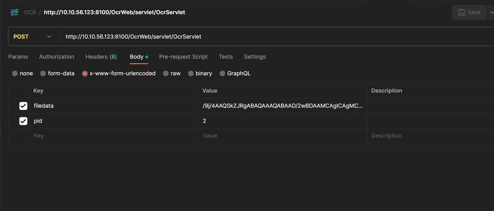

# ocr

# 通用识别服务 API 调用方式

* 以下为 http 请求：

| method | post |
| --- | --- |
| Content-Type | application/x-www-form-urlencoded |
| url | http://IP:Port/OcrWeb/servlet/OcrServlet（以具体环境为准） |

* 请求参数：

| filedata | 图片文件的 BASE64 编码（图片大小最佳在 150KB~250KB，最小不得小于 60KB，最大不得大于 5MB，识别的图片越大耗时越长，尽量保证在 1MB 以内） |
| --- | --- |
| pid | 产品id编号（当前只能填 2、4 需要更多支持需要单独提需求，详见 产品 id 编号） |

* 请求参数示例：



* 结果示例：

仅当返回的 ErrorCode 为 "0" 时代表识别成功，其它返回码均为失败，返回类型为 `text/plain;charset=UTF-8`内容是规范的 json 格式，因此可视为 json 进行解析

```json
{
    "ErrorCode": "0",
    "IDNum": "410521199006104529",
    "Nation": "汉",
    "Name": "程江艳",
    "Address": "河南省林州市东姚镇下庄村下庄自然村314号",
    "Sex": "女",
    "Birth": "19900610",
    "Birth_OCR": "19900610"
}
```

# 产品 id 编号

当前只能填 2、4

| 产品名称 | Pid | 产品名称 | Pid |
| --- | --- | --- | --- |
| VIN | 1 | 二代证 | 2 |
| 港澳台居住证 | 2 | 银行卡 | 4 |
| 行驶证 | 5 | 车牌 | 6 |
| 驾驶证 | 7 | 护照 | 8 |
| 军官证 | 11 | 增值税发票 | 21 |
| 通用票据 | 22 | 营业执照 | 41 |
| 出生证明 | 52 | 外国人永久居留证 | 53 |
| 二手车发票 | 60 | 机动车发票 | 61 |
| 机动车登记证 | 62 | 机动车合格证 | 68 |
| 条码 | 69 | 工牌 | 101 |
| 通用文本 | 1001 | 户口本（户主+个人页） | 1002 |
| 结婚证 | 1004 | 离婚证 | 1005 |
| 税务登记证正本 | 1012 | 往来港澳通行证正面 | 1013 |
| 往来港澳通行证背面 | 1014 | 开户许可证 | 1015 |
| 北京医疗发票 | 1017 | 港澳台居民往来大陆通行证 | 1018 |
| 广东居住证 | 1019 | 临时身份证 | 1020 |
| 深圳居住证 | 1021 | 税务登记证副本 | 1022 |
| 统一社会信用代码证书 | 1023 | 事业单位法人证书正本 | 1024 |
| 事业单位法人证书副本 | 1025 | 组织机构代码证 | 1026 |
| 社会团体法人证书正本 | 1027 | 社会团体法人证书副本 | 1028 |
| 电子承兑汇票 | 1031 | 全国各省市房产证 | 1033 |
| 通用手写 | 1034 | 通用表格识别 | 1036 |
| 银行回单 | 1037 | 电子保单 | 1038 |
| 社保卡 | 1039 | 印章签名检测 | 1040 |
| 香港身份证 | 1050 | 澳门身份证 | 1051 |
| 台湾省份证 | 1052 | 名片 | 1053 |
| 图像质量检测（二代证） | 1054 | 底盘合格证 | 1056 |
| 手写签名 | 1062 | 手写签名比对 | 1065 |
| 银行流水 | 1066 |  |  |

# 测试、生产环境 URL

* 二代证、银行卡 URL

测试环境 url：`http://10.10.56.123:8100/OcrWeb/servlet/OcrServlet`

生产环境 url：`http://172.16.30.201:8080/NewOcrWeb/servlet/OcrServlet`
