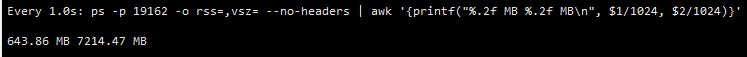
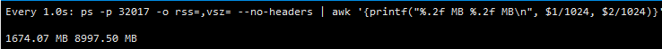
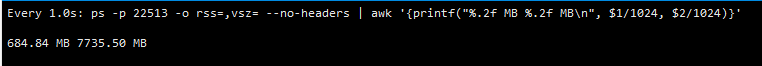
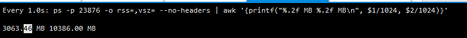

# ocr 识别

# 未开启营业执照识别：
内存占用：

+ web：

+ ocr：

| 序号 | 操作 | 内存（MB） | 内存占用（MB） | 耗时（MS） |
| --- | --- | --- | --- | --- |
| 1 | 默认 | 1674.07 | / | / |
| 2 | 身份证 | 1674.07 - 1771.00 | 96.93 | 1674 |
| 3 | 身份证 | 1771.00 - 1871.79 | 100.79 | 2414 |
| 4 | 身份证 | 1871.79 - 1896.66 | 24.87 | 1428 |
| 5 | 身份证 | 1888.74 - 1971.77 | 83.03 | 1773 |
| 6 | 身份证 | 1916.36 - 1969.16 | 52.80 | 1567 |
| 7 | 身份证 | 1961.16 - 2077.68 | 116.52 | 2300 |
| 8 | 身份证 | 2077.68 - 2087.99 | 10.31 | 1683 |
| 9 | 身份证 | 2087.99 - 2122.01 | 34.02 | 1792 |
| 10 | 身份证 | 2122.31 - 2208.02 | 85.71 | 2107 |
| 11 | 身份证 | 2191.94 - 2233.50 | 41.56 | 1709 |
| 12 | 均值 | / | 64.85 | 1844.70 |

# 开启营业执照识别：
内存占用：

+ web：

+ ocr：

| 序号 | 操作 | 内存（MB） | 内存占用（MB） | 耗时（MS） |
| --- | --- | --- | --- | --- |
| 1 | 默认 | 3036.46 | / | / |
| 2 | 营业执照 | 3036.46 - 3490.52 | 454.06 | 7065 |
| 3 | 营业执照 | 3235.52 - 3482.61 | 247.09 | 6997 |
| 4 | 营业执照 | 3379.07 - 3532.57 | 153.5 | 7850 |
| 5 | 营业执照 | 3424.28 - 3606.79 | 182.51 | 5876 |
| 6 | 营业执照 | 3502.61 - 3766.90 | 264.29 | 7479 |
| 7 | 营业执照 | 3511.44 - 3701.13 | 189.69 | 8164 |
| 8 | 营业执照 | 3528.50 - 3724.11 | 195.61 | 7936 |
| 9 | 营业执照 | 3591.39 - 3783.48 | 192.09 | 5940 |
| 10 | 营业执照 | 3630.98 - 3933.67 | 302.69 | 6876 |
| 11 | 营业执照 | 3677.98 - 3806.98 | 129 | 8252 |
| 12 | 均值 | / | 225.95 | 7243.50 |

# 总结
在开启通用识别后，单个进程的内存较开启之前增加 1362.39 MB（3036.46 - 1674.07）

单次识别营业执照较证件照，内存增加 161.1 MB（225.95 - 64.85）

单次识别营业执照较证件照，耗时增加 5429.8 MS（7243.50 - 1844.70）
