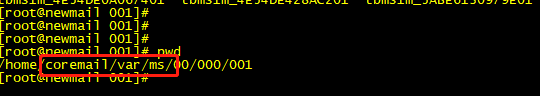
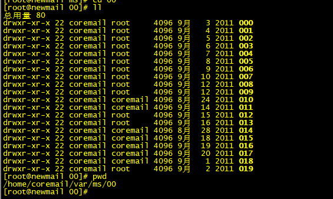
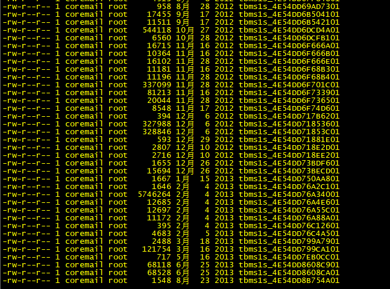
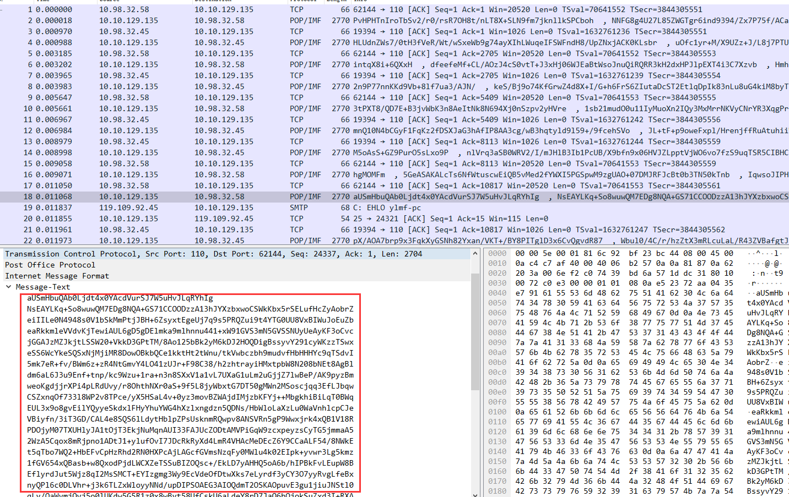
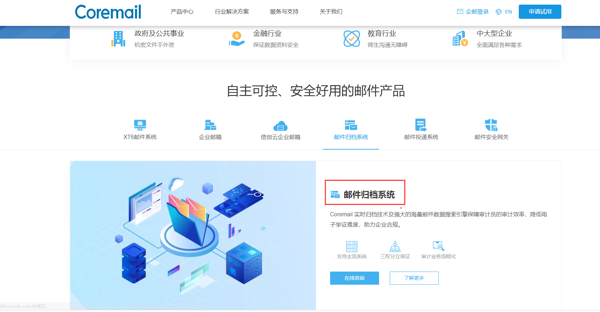

# 邮件归档说明

在不额外增加支出的情况下计划对 Coremail 邮件进行归档有以下两种方案：

1. 直接拷贝 Coremail 服务器上的邮件源文件进行压缩备份

实际验证该方案不可行，原因：Coremail 服务器上的源文件仅支持自解析（文件加密），由于 CoreMail 不是开源的邮件服务，因此无法推测加密类型和文件排布规律，以下附 现服务器上的文件夹目录（毫无逻辑）

文件目录：

文件名称，打开后都是乱字符，只能用二进制查看：

2. 在 Coremail 服务器上监听 POP3 和 SMTP 端口数据，收集数据还原成原始邮件

该方案依旧不可行，原因：方案测试通过 TCPDUMP 命令在 Coremail 服务器上的 POP3 和 SMTP 端口抓取了100 个数据包进行分析，本地解析数据包内容时，由于是直接抓取的 TCP 报文，解析时存在报文乱序和邮件内容乱序的情况，难以直接解析。即使花费时间解析后还有下一个问题：即，公司内的邮件收发不都是通过 POP3 和 SMTP 进行的，Coremail 有网页版的邮箱，通过 SSL 层进行通信，无法解析内容（SSL 层通俗来说就是 HTTPS 协议）附部分 TCP 报文段：

3. Coremail 邮件服务商至今任在提供服务，浏览 [官网](https://www.coremail.cn/)，应该是升级后的产品提供了邮件归档的服务（该服务应该是收费的）附服务说明图片：

