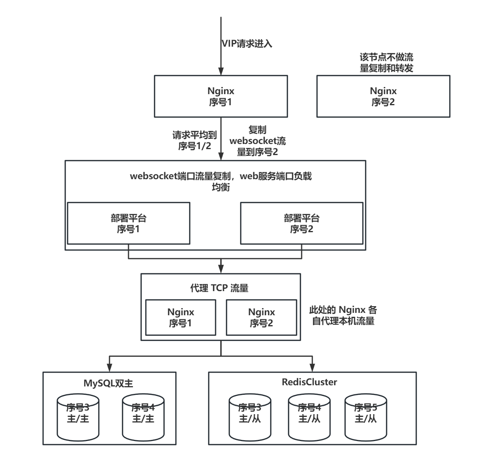

# 部署平台调用关系梳理及部署规划

# 部署规划
为支持部署平台高可用计划和 CI 环境一样采用虚 IP + 两台实际应用节点的模式进行部署，因此需要 5 台 4C 16G 内存 40G 硬盘的服务器。具体计划如下：

| 序号 | 规格（CPU/内存/硬盘） | 用途 | 备注 |
| --- | --- | --- | --- |
| 1 | 4C/16G/40G | 部署平台 | 需要提前配置虚 IP |
| 2 | 4C/16G/40G | 部署平台 | 需要提前配置虚 IP |
| 3 | 4C/16G/40G | MySQL、Redis |  |
| 4 | 4C/16G/40G | MySQL、Redis |  |
| 5 | 4C/16G/40G | Redis | |

# 网络访问
首先要求这 5 台服务器之间互相均能访问，表格中的临时 IP 指的是部署平台的两台服务器的 IP。表格梳理如有遗漏后续再进行补充

| 源 IP | 目标 IP | 备注 |
| --- | --- | --- |
| 临时 IP | 10.10.66.125:443 | DOP 服务器 |
| 临时 IP | 10.10.68.21:80 | 暂时不明确 |
| 临时 IP | 10.210.1.44:8082 | dubbo服务器 |
| 临时 IP | 邮件服务器 IP | |
| 临时 IP | 10.210.4.104 | ELK服务器 |
| 临时 IP | 172.16.40.201 | zabbix监控 |
| 临时 IP | 10.10.66.110 | 应用包服务器 |
| 临时 IP | 10.10.77.125:4001 | 基线服务器 |
| 临时 IP | 10.10.178.125 | 基线服务器 |
| 临时 IP | 10.10.67.74:8090 | DBHelper 服务器 |
| 临时 IP | 172.16.40.41:8222 | 生产 ansible 服务器 |
| 172.16.40.41 | 临时 IP:9092 | 回传 ansible 执行脚本信息 |

# 部署架构图
由于暂时未分配机器，图中的 机器 IP 均使用 序号 + 数字 代替

