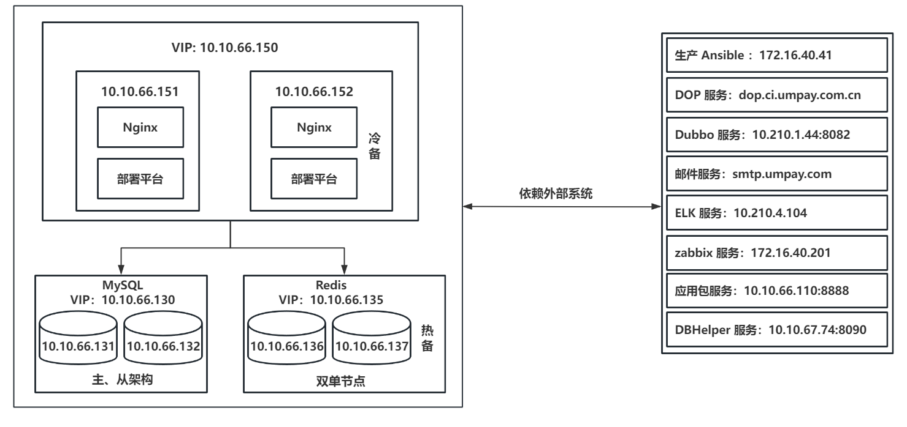

# 部署平台部署文档v1.0

# 部署规划

部署所需的机器信息如下：

| 序号 | IP | 规格（CPU/内存/硬盘） | 用途 | 备注 |
| --- | --- | --- | --- | --- |
| 1 | 10.10.66.151 | 4C/16G/40G | 部署平台 | 需要提前配置虚 IP |
| 2 | 10.10.66.152 | 4C/16G/40G | 部署平台 | 需要提前配置虚 IP |
| 3 | 10.10.66.131 | 4C/8G/140G | MySQL | 已完成部署 |
| 4 | 10.10.66.132 | 4C/8G/140G | MySQL | 已完成部署 |
| 5 | 10.10.66.136 | 4C/4G/40G | Redis | 需要部署单节点 |
| 6 | 10.10.66.137 | 4C/4G/40G | Redis | 需要部署单节点 |

# 网络访问

首先要求这 6 台服务器之间互相均能访问，表格梳理如有遗漏后续再进行补充

| 原IP | 新 IP | 虚 IP | 目标 IP | 备注 |
| --- | --- | --- | --- | --- |
| 10.10.68.20 | 10.10.66.151、10.10.66.152 | 暂未分配 | 10.10.66.125:443 | DOP 服务器 |
| 10.10.68.20 | 10.10.66.151、10.10.66.152 | 暂未分配 | 10.10.68.21:80 | 暂时不明确 |
| 10.10.68.20 | 10.10.66.151、10.10.66.152 | 暂未分配 | 10.210.1.44:8082 | dubbo服务器 |
| 10.10.68.20 | 10.10.66.151、10.10.66.152 | 暂未分配 | 邮件服务器 | |
| 10.10.68.20 | 10.10.66.151、10.10.66.152 | 暂未分配 | 10.210.4.104 | ELK 服务器 |
| 10.10.68.20 | 10.10.66.151、10.10.66.152 | 暂未分配 | 172.16.40.201 | zabbix 监控 |
| 10.10.68.20 | 10.10.66.151、10.10.66.152 | 暂未分配 | 10.10.66.110:8888 | 应用包服务器 |
| 10.10.68.20 | 10.10.66.151、10.10.66.152 | 暂未分配 | 10.10.77.125:4001 | 基线服务器 |
| 10.10.68.20 | 10.10.66.151、10.10.66.152 | 暂未分配 | 10.10.178.125 | 基线服务器 |
| 10.10.68.20 | 10.10.66.151、10.10.66.152 | 暂未分配 | 10.10.67.74:8090 | DBHelper 服务器 |
| 10.10.68.20 | 10.10.66.151、10.10.66.152 | 暂未分配 | 10.10.68.21 | 代理 Nginx 服务器 |
| 10.10.68.20 | 10.10.66.151、10.10.66.152 | 暂未分配 | 172.16.40.41:8222 | 生产 ansible 服务器 |
| 172.16.40.41 | 172.16.40.41（ansible 回传） | 暂未分配 | 虚 IP:8081 | 回传 ansible 执行脚本信息 |

# 部署架构图



# 部署平台部署流程

部署新机器 10.10.66.151/10.10.66.152，全程以 root 用户操作

1. 首先安装 miniconda 环境

* 去 [清华源](https://mirrors.tuna.tsinghua.edu.cn/anaconda/miniconda/Miniconda3-latest-Linux-x86_64.sh) 下载 `wget https://mirrors.tuna.tsinghua.edu.cn/anaconda/miniconda/Miniconda3-latest-Linux-x86_64.sh --no-check-certificate`（这个单独下载传上去也行）
* 赋予可执行权限后直接安装 <code>chmod +x Miniconda3-latest-Linux-x86_64.sh && bash Miniconda3-latest-Linux-x86_64.sh</code>（安装过程会让选择安装路径，请选择安装在 /data 下）
* 刷新环境变量 `source /root/.bashrc`
* 生成配置文件 `conda config --set show_channel_urls yes`
* 配置清华源 `vim ~/.condarc`

```yaml
channels:
  - defaults
show_channel_urls: true
default_channels:
  - https://mirrors.tuna.tsinghua.edu.cn/anaconda/pkgs/main
  - https://mirrors.tuna.tsinghua.edu.cn/anaconda/pkgs/r
  - https://mirrors.tuna.tsinghua.edu.cn/anaconda/pkgs/msys2
custom_channels:
  conda-forge: https://mirrors.tuna.tsinghua.edu.cn/anaconda/cloud
  msys2: https://mirrors.tuna.tsinghua.edu.cn/anaconda/cloud
  bioconda: https://mirrors.tuna.tsinghua.edu.cn/anaconda/cloud
  menpo: https://mirrors.tuna.tsinghua.edu.cn/anaconda/cloud
  pytorch: https://mirrors.tuna.tsinghua.edu.cn/anaconda/cloud
  pytorch-lts: https://mirrors.tuna.tsinghua.edu.cn/anaconda/cloud
  simpleitk: https://mirrors.tuna.tsinghua.edu.cn/anaconda/cloud
```

* 清除之前的缓存源 `conda clean -i`
* 从 10.10.178.109 机器上复制环境`/opt/packages/auto_deploy.tar.gz`到新机器上，创建目录 `mkdir -p /data/miniconda3/envs/auto_deploy`然后将复制过来的环境解压到改目录下
* 修改 root 用户下 conda 的默认环境为 auto\_deploy `echo "conda activate auto_deploy" >> ~/.bashrc`然后刷新环境 `source /root/.bashrc`至此部署平台的 python 环境安装完毕

2. 打包源程序 <code>cd /www && tar -zcf autotwo_py3_20230602.tar.gz autotwo_py3 --exclude='autotwo_py3/media/tmp' --exclude='autotwo_py3/media/yaml_tmp' --exclude='*/__pycache__'</code>（注意修改打包后的文件名）
3. 这里计划在新机器的 /data 下部署（空间最大）创建目录 `mkdir -p /data/auto_deploy` 然后上传部署文件并解压<code>tar -xf autotwo_py3_20230602.tar.gz && mv /data/auto_deploy/www/autotwo_py3 /data/auto_deploy && rm -rf /data/auto_deploy/www && chown -R root.root autotwo_py3</code>
4. 创建打包时丢失的目录 `mkdir -p autotwo_py3/media/tmp autotwo_py3/media/yaml_tmp`
5. 安装  uwsgi 环境，运行命令安装缺失的库 `apt install -y libpcre3 libpcre3-dev`然后创建链接 `ln -s /usr/lib/x86_64-linux-gnu/libpcre.so.3 /usr/lib/libpcre.so.1`运行命令 `uwsgi --version`输出版本即成功
6. 安装 supervisor `apt install -y supervisor`运行命令 `supervisord -version`输出版本即成功
7. 开始修改文件内容`vim autotwo_py3/automgr/dbconf.py`（第一列指的是文件中对应的行号，不要直接复制，以下的路径请提前创建好）`mkdir -p /data/auto_deploy/logs/taskarray /data/auto_deploy/logs/batch /data/auto_deploy/logs/shells /data/auto_deploy/logs/zbx_warn /data/auto_deploy/logs/load_log /data/auto_deploy/logs/upload_scm_log /data/auto_deploy/logs/nginx /data/auto_deploy/runtime`

```plain
'NAME': 'autotwo_prod',
'HOST': '10.10.66.130',
'PASSWORD': 'root123',
'HOST': '10.10.66.130',
'NAME': 'zbxdata_prod',
'PASSWORD': 'root123'
TASKLOGDIR = '/data/auto_deploy/logs/taskarray'
BATCH_LOG_DIR = '/data/auto_deploy/logs/batch'
# 这里的 VIP 指的是两台部署平台机器的 VIP
PROJADDR = 'VIP'
BATCH_SHELL_LOG_DIR = '/data/auto_deploy/logs/shells'
ZABBIX_WARN_LOG = '/data/auto_deploy/logs/zbx_warn'
RELOAD_LOG = '/data/auto_deploy/logs/load_log'
UPLOAD_SCM_LOG = '/data/auto_deploy/logs/upload_scm_log'
```

8. 修改 `vim autotwo_py3/automgr/settings.py`（注意拷贝文件）

```plain
# 这里的 redis 密码和 VIP 需要替换
BROKER_URL = 'redis://:redis密码@VIP:6379/6'
# 删除 154 行
SSH_KEY = "/root/.ssh/id_rsa"
# 从 10.10.68.20 服务器上拷贝文件 /var/sshkeys/pwdpub 过来
SSH_PUBPWD = "/data/auto_deploy/keys/sshkeys/pwdpub"
# 从 10.10.68.20 服务器上拷贝文件 /var/sshkeys/pwdpri 过来
SSH_PRIPWD = "/data/auto_deploy/keys/pwdpri"
# 从 10.10.68.20 服务器上拷贝文件 /root/.ssh/.ansi 过来
SSH_ANSIPWD = "/data/auto_deploy/keys/.ssh/.ansi"
```

9. 修改 `autotwo_py3/advance_upload.py`

```plain
SSH_PRI = '/data/auto_deploy/keys/pwdpri'
SSH_ANSI = '/data/auto_deploy/keys/.ssh/.ansi'
```

10. 修改 `autotwo_py3/modapps/appMgr/models.py`这里 232 行的 ansible.addr 需要修改成代理的服务器地址
11. 复制 10.10.68.20 目录 `/www/etc`到现机器目录下`/data/auto_deploy/conf`（这个目录要创建）pid 后缀的文件都不需要复制
12. 现机器目录下创建文件并写入以下内容`vim /data/auto_deploy/apprun.sh`

```bash
#!/bin/bash
WORK_DIR=/data/auto_deploy/autotwo_py3
CONF_DIR=/data/auto_deploy/conf
NGINX_DIR=/data/nginx-1.8.1

# switch to work directory
cd $WORK_DIR

# supervisor start
/usr/bin/supervisord -c $CONF_DIR/supervisord.conf

# nginx start
$NGINX_DIR/sbin/nginx -c $CONF_DIR/conf/nginx.conf
```

13. 10.10.68.20 服务器使用的 nginx 版本为 1.8.1，在本机上需要自行编译。这里省去过程（1.8.1版本在 debian11 上编译会有各种问题比较难解决，测试时用的是 1.18.0 版本），但是最终编译目标文件夹需要设置为 `/data/nginx-1.8.1`以下给出测试时编译的参数，需要更多的模块请自行添加 `./configure --prefix=/opt/softs/nginx-1.8.1 --with-http_stub_status_module --with-http_ssl_module --with-http_gzip_static_module`（仅做参考，路径是不正确的）
14. 将 10.10.68.20 `/usr/mpsp/nginx-1.8.1/conf/nginx.conf` 复制到新机器上 `/data/nginx-1.8.1/conf/nginx.conf`将 10.10.68.20 `/usr/mpsp/nginx-1.8.1/ssl/nginx_cert` 目录复制到新机器上 `/data/nginx-1.8.1/ssl`
15. 复制完成后，修改文件 `vim /data/nginx-1.8.1/conf/nginx.conf`

```plain
user root root
error_log  /data/auto_deploy/logs/nginx/error.log;
pid        /data/auto_deploy/runtime/nginx.pid;
access_log  /data/auto_deploy/logs/nginx/access.log  main;
access_log /data/auto_deploy/logs/nginx/autotwo3_access_log;
error_log  /data/auto_deploy/logs/nginx/autotwo3_error_log;
alias /data/auto_deploy/autotwo_py3/statics/;
include /data/nginx-1.8.1/conf/uwsgi_params;
alias /data/auto_deploy/autotwo_py3/media/knlibrary_excle/;
server_name  本机ip;
access_log /data/auto_deploy/logs/nginx/access_log;
error_log  /data/auto_deploy/logs/nginx/error_log;
server_name 本机ip;
access_log /data/auto_deploy/logs/nginx/access443_log;
error_log /data/auto_deploy/logs/nginx/error443_log;
ssl_certificate      /data/nginx-1.8.1/ssl/server.crt;
ssl_certificate_key  /data/nginx-1.8.1/ssl/server.key;
alias /data/auto_deploy/autotwo_py3/statics/;
include /data/nginx-1.8.1/conf/uwsgi_params;
alias /data/auto_deploy/autotwo_py3/media/knlibrary_excle/;
```

16. 修改复制过来的`vim /data/auto_deploy/conf/uwsgi.xml` 主要也是修改路径

```plain
<chdir>/data/auto_deploy/autotwo_py3</chdir>
<pidfile>/data/auto_deploy/runtime/uwsgi.pid</pidfile>
```

17. 修改复制过来的 `vim /data/auto_deploy/conf/supervisord.conf`其中大部分的路径都要进行修改

```plain
file=/data/auto_deploy/runtime/supervisor.sock   ; (the path to the socket file)
logfile=/data/auto_deploy/logs/supervisord.log ; (main log file;default $CWD/supervisord.log)
pidfile=/data/auto_deploy/runtime/supervisord.pid ; (supervisord pidfile;default supervisord.pid)
serverurl=unix:///data/auto_deploy/runtime/supervisor.sock ; use a unix:// URL  for a unix socket
command=python /data/auto_deploy/autotwo_py3/manage.py celeryd --concurrency=2 --pidfile=/data/auto_deploy/runtime/django_celeryd_%(process_num)02d.pid
directory=/data/auto_deploy/autotwo_py3
stdout_logfile=/data/auto_deploy/logs/celery_worker.log
stderr_logfile=/data/auto_deploy/logs/celery_worker.err
command=python /data/auto_deploy/autotwo_py3/manage.py celery beat --schedule=/data/auto_deploy/conf/celerybeat-schedule --pidfile=/data/auto_deploy/runtime/django_celerybeat.pid --loglevel=INFO
directory=/data/auto_deploy/autotwo_py3
stdout_logfile=/data/auto_deploy/logs/celery_beat.log
stderr_logfile=/data/auto_deploy/logs/celery_beat.err
command=python /data/auto_deploy/autotwo_py3/manage.py celerycam --frequency=5.0 --pidfile=/data/auto_deploy/runtime/django_celerycam.pid
directory=/data/auto_deploy/autotwo_py3
stdout_logfile=/data/auto_deploy/logs/celerycam.log
stderr_logfile=/data/auto_deploy/logs/celerycam.err
command=python /data/auto_deploy/autotwo_py3/main.py
directory=/data/auto_deploy/autotwo_py3
stdout_logfile=/data/auto_deploy/logs/websocket.log
stderr_logfile=/data/auto_deploy/logs/websocket.err
command=uwsgi -x /data/auto_deploy/conf/uwsgi.xml
directory=/data/auto_deploy/autotwo_py3
stdout_logfile=/data/auto_deploy/logs/autotwo_uwsgi.log
stderr_logfile=/data/auto_deploy/logs/autotwo_uwsgi.err
```

19. 准备将 10.10.68.20 上 MySQL 的  autotwo 和 zbxdata 两个库迁移到新数据库上（MySQL 数据库一定要是忽略大小写的）
20. 启动脚本然后检查应用运行情况 <code>chmod +x /data/auto_deploy/apprun.sh && /data/auto_deploy/apprun.sh</code>
